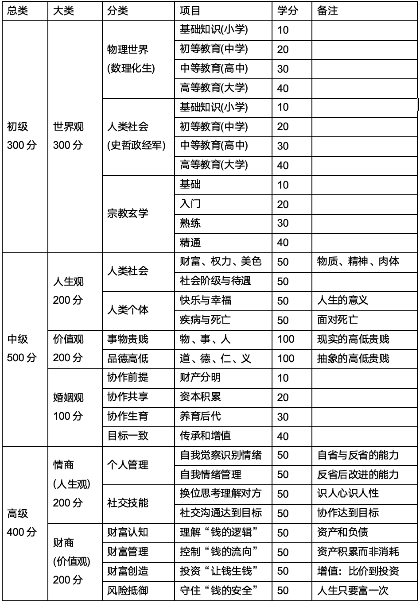

**世界观：人们对整个世界（包括自然界、人类社会和思想）的总体看法和根本观点。**

1. 自然界

- 物质的运动：经典力学、刚体力学、流体力学
- 物质的组成：亚原子层面的结构、能量的本质、电磁的本质
- 物质的变化：原子核的变化、分子的变化、无机化学、有机化学
- 生命的形式：DNA、RNA、蛋白质、细胞、细胞分化、细胞的寿命、植物、动物
- 生命的智能：条件反射、抽象、认知、智慧、社会网络、人工智能

1. 社会
- 人与动物：人与动物的共同属性，人与动物的差别属性
- 人与社会：社会存在的原因，人性与社会暗面的必然性
- 社会阶级：社会阶级存在必然性，客观认识不同的阶级的差别
- 人性、道德、法律：道德和法律的异同和对人性的束缚形式
- 历史：鉴史知今断未来

**人生观：人对人生的目的、意义、价值的根本看法，人生观是世界观在人生问题上的体现。**

1. 人为什么活着
2. 财富与权力、挫折与失败、快乐与幸福、疾病与死亡等人生课题和自己的答案

**价值观：人对事物（包括人、事、物）高低贵贱的判断标准，价值观则是人生观的具体延伸。**

1. 物之高低贵贱：物在社会中的价值
2. 事之高低贵贱：人从事的行业
3. 仁之高低贵贱：亲亲为仁，人的各种亲戚关系的远近亲疏
4. 义之高低贵贱：义宜也，尊贤为大，人的各种社会关系的远近亲疏
5. 人之高低贵贱：社会的阶级性
6. 物、事、人、道、德、仁、义、礼、法之高低贵贱

**完备认知体系表格**

