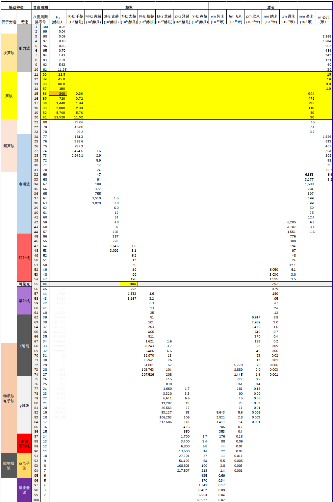

# 波基础知识

## 常见物质共振频率

- 人体:2-5Hz/T
- 地球: 7.83Hz/T (舒曼共振)
- H原子:42.58MHz/T
- C原子:10.71MHz/T
- F原子:40.05MHz/T
- P原子:11.26MHz/T

## 波在不同介质中的速度排序（由小到大）

**核心前提说明**

1. 以下排序为 **同一种波（机械波/电磁波）** 在不同介质中的传播速度对比，不同类型波（如声波vs光波）无直接可比性（机械波依赖介质，电磁波可在真空传播，且速度量级差异极大）。
2. 机械波（如声波）的速度由 **介质力学属性** 决定（弹性模量越大、密度越小，速度越快）；电磁波（如光波）的速度由 **介质电磁属性** 决定（折射率 $n = \frac{c}{v}$，折射率越大，速度越慢，$c$ 为真空中光速）。
3. 数值为 **常温常压（20℃，1标准大气压）下的典型值**，特殊条件（如高温、高压、高浓度）会导致速度偏移。

### 一、机械波（以声波为例，纵波）

**传播速度排序（由小到大）**

1. 空气（气体）：约 343 m/s（干燥空气，20℃）
   - 原理：气体分子间距大，弹性模量小、密度低，振动传递效率低，是机械波传播最慢的介质类型。
2. 酒精（液体）：约 1160 m/s
   - 原理：液体分子排列紧密，弹性模量高于气体，但密度比水小、弹性比水弱，速度低于水。
3. 纯水（液体）：约 1482 m/s
   - 原理：液体弹性模量显著高于气体，分子间作用力强，振动传递快于气体和部分弱弹性液体。
4. 海水（液体，3.5%含盐量）：约 1531 m/s
   - 原理：含盐量增加导致密度增大，但弹性模量提升更显著，速度略高于纯水。
5. 橡胶（固体，软弹性）：约 1600 m/s（横波约 540 m/s）
   - 原理：软固体弹性模量较低，虽分子结合比液体紧密，但恢复力弱，速度接近液体上限。
6. 玻璃（固体，普通硅酸盐）：约 5000 m/s（纵波），横波约 3000 m/s
   - 原理：硬固体分子结合牢固，弹性模量远高于液体和软固体，振动传递效率极高。
7. 钢铁（固体，碳钢）：约 5900 m/s（纵波），横波约 3200 m/s
   - 原理：金属键结合极强，弹性模量和密度均较大，但弹性模量占主导，是常见介质中机械波速度最快的类型之一。
8. 铝（固体）：约 6300 m/s（纵波），横波约 3100 m/s
   - 原理：铝的弹性模量与钢铁接近，但密度更小，纵波速度略高于钢铁。

**机械波速度核心规律**

- 同一介质中：纵波速度 > 横波速度（如钢铁纵波5900 m/s vs 横波3200 m/s）；
- 不同介质类型：气体 < 液体 < 固体（软固体除外），本质是弹性模量的量级差异（固体弹性模量 ≫ 液体 ≫ 气体）。

### 二、电磁波（以可见光为例，横波）

**传播速度排序（由小到大，基于折射率 $n = \frac{c}{v}$，$c ≈ 3×10^8$ m/s）**

1. 金刚石（固体，折射率 $n ≈ 2.42$）：$v ≈ \frac{3×10^8}{2.42} ≈ 1.24×10^8$ m/s
   - 原理：折射率极高，分子极化率强，电磁场传播受到的阻碍最大，速度最慢。
2. 玻璃（固体，普通硅酸盐，$n ≈ 1.52$）：$v ≈ \frac{3×10^8}{1.52} ≈ 1.97×10^8$ m/s
   - 原理：常见透明介质中折射率中等，速度低于液体和真空。
3. 水（液体，$n ≈ 1.33$）：$v ≈ \frac{3×10^8}{1.33} ≈ 2.26×10^8$ m/s
   - 原理：液体折射率低于固体，电磁场传播阻碍小于固体，速度高于玻璃、金刚石。
4. 酒精（液体，$n ≈ 1.36$）：$v ≈ \frac{3×10^8}{1.36} ≈ 2.21×10^8$ m/s
   - 原理：折射率略高于水，速度略低于水（与机械波中酒精速度低于水的规律一致）。
5. 空气（气体，干燥，$n ≈ 1.00029$）：$v ≈ \frac{3×10^8}{1.00029} ≈ 2.999×10^8$ m/s
   - 原理：气体分子稀疏，极化率极低，折射率接近1，速度接近真空中的光速。
6. 真空（无介质）：$v = c ≈ 299792458$ m/s（约 $3×10^8$ m/s）
   - 原理：电磁波传播不依赖介质，真空折射率 $n=1$，是电磁波的最大传播速度（相对论中光速上限）。

**电磁波速度核心规律**

- 同一介质中：电磁波速度与频率无关（无色散介质，如真空、空气），或随频率略有变化（色散介质，如玻璃、水）；
- 不同介质类型：固体（高折射率） < 液体 < 气体 < 真空，本质是介质折射率的差异（折射率越大，电磁相互作用越强，传播越慢）。

### 三、跨类型波速对比（补充说明）

- 机械波（声波）在固体中的最快速度（如铝纵波6300 m/s），远小于电磁波（可见光）在气体中的最慢速度（如空气2.999×10^8 m/s）；
- 原因：机械波依赖介质分子振动传递（速度受分子运动速度限制，量级为10³ m/s），电磁波是电磁场相互激发传播（速度由电磁常数决定，量级为10⁸ m/s），二者物理本质不同，速度量级相差5个数量级以上。

### 总结（核心排序表）

1. 机械波（声波）：空气（343）< 酒精（1160）< 纯水（1482）< 海水（1531）< 橡胶（1600）< 玻璃（5000）< 钢铁（5900）< 铝（6300）（单位：m/s）
2. 电磁波（可见光）：金刚石（1.24×10⁸）< 玻璃（1.97×10⁸）< 酒精（2.21×10⁸）< 水（2.26×10⁸）< 空气（2.999×10⁸）< 真空（3×10⁸）（单位：m/s）

核心逻辑：**波的速度由传播介质的固有属性决定**——机械波看“力学属性（弹性+密度）”，电磁波看“电磁属性（折射率）”，且不同类型波的速度量级存在本质差异，不可直接混淆排序。