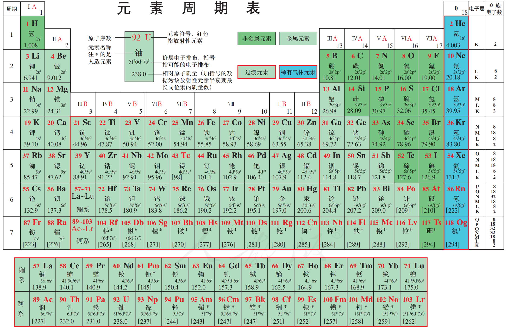

# 化学元素周期表

[元素周期表在线查看](https://ptable.com/)

[原子轨道在线查看](https://www.orbitals.com/orb/orbtable.htm)

元素周期表的知识点可按“基础构成-核心规律-应用拓展”三层梳理，覆盖结构、性质、应用等关键维度。

### 一、基础构成与编排原则
- 核心依据：按元素**原子序数（质子数）** 递增顺序排列，将**电子层数相同**的元素归为同一周期，**最外层电子数相同**的元素归为同一主族（共18列，主族A、副族B、0族、Ⅷ族）。
- 周期划分：7个周期，1-3周期为短周期（元素种类少），4-6周期为长周期，7周期为不完全周期（含人工合成元素）。
- 族的分类：主族（ⅠA-ⅦA）、副族（ⅠB-ⅦB）、Ⅷ族（8-10列）、0族（稀有气体，最外层电子稳定）。
- 特殊区域：过渡元素（副族+Ⅷ族，多为金属）、镧系（第6周期ⅢB族）、锕系（第7周期ⅢB族，含放射性元素）。

### 二、核心规律（周期性变化）
- 原子结构递变：同周期从左到右，核电荷数增大，原子半径减小（除稀有气体）；同主族从上到下，电子层数增多，原子半径增大。
- 化合价规律：主族元素最高正价=主族序数（O、F除外），最低负价=主族序数-8（H为-1）。
- 金属性与非金属性：同周期从左到右，金属性减弱、非金属性增强；同主族从上到下，金属性增强、非金属性减弱（如F是非金属性最强元素，Cs是金属性最强元素）。
- 化合物性质递变：最高价氧化物对应水化物，同周期从左到右酸性增强、碱性减弱；同主族从上到下酸性减弱、碱性增强。
- 气态氢化物稳定性：同周期从左到右稳定性增强，同主族从上到下稳定性减弱（如HF>H2O>NH3>CH4）。

### 三、关键应用与特殊知识点
- 常见元素位置记忆：如ⅠA族（碱金属）、ⅡA族（碱土金属）、ⅤA族（氮族）、ⅥA族（氧族）、ⅦA族（卤族）、0族（稀有气体）的典型元素。
- 对角线规则：某些主族元素（如Li与Mg、Be与Al、B与Si）性质相似，因原子结构与性质的关联性。
- 原子序数与位置换算：已知原子序数可推断周期数（电子层数）和主族序数（最外层电子数），反之亦然。
- 实际应用：指导元素推断、物质性质预测、新材料研发（如半导体元素多在金属与非金属分界线附近）。
