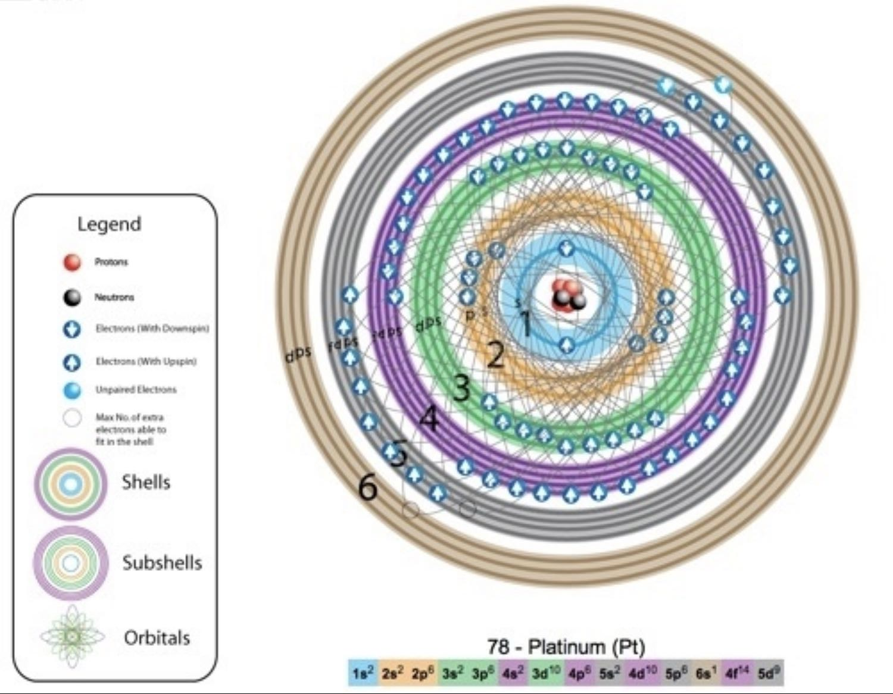
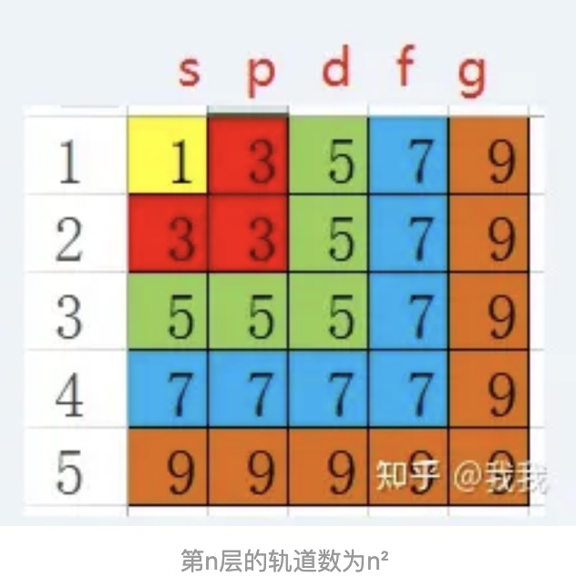

# 元素周期表基础知识

## 原子结构可视化模型

原子结构可视化模型是将微观的原子结构（核、电子层、亚层、轨道、电子）通过图形化方式呈现的工具，不同模型会侧重不同维度，以你提供的**铂原子可视化模型**为例，其详细结构可拆解为以下5个核心层级：

**一、核心：原子核区域**

位于模型最中心，由**质子（红色小球）**和**中子（黑色小球）**紧密聚集而成：
- 数量对应元素的原子序数（铂的质子数=78）和质量数（中子数≈117，质量数≈78+117=195）；
- 这部分是原子的质量核心（占原子总质量的99.9%以上），但体积仅占原子的极小部分。

**二、层级1：电子层（Shells）**

以原子核为中心的**同心圆/圈层**，对应电子的“能层”，用数字1、2、3…标注：
- 层数=电子离核的距离（层数越大，离核越远，能量越高）；
- 每个电子层可容纳的最大电子数遵循公式：\(2n^2\)（n为层数，如第1层最多2个，第2层最多8个）。

**三、层级2：电子亚层（Subshells）**

嵌套在电子层内的**不同颜色/样式圈层**，对应电子的“能级”，用s、p、d、f等符号标注（图中可见s、p、d、f标识）：
- 亚层类型由电子层决定：第1层只有s亚层，第2层有s、p亚层，第3层有s、p、d亚层，第4层及以上有s、p、d、f亚层；
- 每个亚层的轨道数固定：s亚层1个轨道，p亚层3个轨道，d亚层5个轨道，f亚层7个轨道。

**四、层级3：电子轨道（Orbitals）**

模型中连接电子的**细线/区域**，代表电子的“运动空间”：
- 轨道是电子出现概率较高的区域（并非固定轨迹），每个轨道最多容纳2个电子；
- 图中通过线条的交织呈现不同亚层轨道的空间分布（如s轨道是球形，p轨道是哑铃形，d/f轨道形状更复杂）。

**五、层级4：电子（箭头）**

模型中的**蓝色箭头**，是原子结构可视化的核心展示对象：
- 箭头方向：区分电子的**自旋状态**（↑=向上自旋，↓=向下自旋），同一轨道的2个电子自旋必相反（泡利不相容原理）；
- 电子数量：每个亚层的电子数标注在排布式中（如图底的`6s¹`表示第6层s亚层有1个电子）；
- 未成对电子：用“浅蓝色小球”单独标识（图中可见），对应轨道中只有1个电子的状态（如铂的5d亚层有9个电子，存在1个未成对电子）。

这类模型的优势是**把抽象的电子排布规则（如泡利原理、洪特规则）转化为直观的图形**，帮助理解原子的微观结构与性质的关联（如铂的未成对电子使其具有催化活性）。

## 电子亚层

轨道指的是围绕着原子运动的电子运行的轨道，更准确地说是电子出现在外空间某个地方的概率，有s、p、d、f、g、h等，再往后的轨道属于我未知的领域。

每个轨道上，最多能够容纳两个电子，运动方向相同。轨道上有一个电子的时候不稳定，有两个电子的时候稳定。大概是拨浪鼓的样子。

s轨道有1个，p轨道有3个，d轨道有5个，f轨道有7个，g轨道有9个，h轨道有11个，以此类推。

在原子核外面的电子是分层的，每层可容纳的电子数最多是2n²，就是第一层最多2个，第二层最多8个，第三层最多18个。原子外面的电子并不是像下图那样绕着一个球运动，而是按照轨道的方式运动。

补注：为什么容纳电子数是2n²呢？因为：
- 第1层外层只有1个s轨道，轨道总数量为1=1²，最大可容纳电子数为2*1²=2；
- 第2层外层有1个s轨道和3个p轨道，可容纳的轨道数为1+3=4=2²，最大可容纳电子数为2*2²=8；
- 第3层外层有1个s轨道、3个p轨道和5个d轨道，可容纳的轨道数为1+3+5=9=3²，最大可容纳电子数为2*3²=18；
- 可推导第n层电子层，可容纳的最多轨道数为n²，可容纳的最多电子数为2n²

每一层电子，都先有s轨道，再有p轨道，再有d轨道，就是说第一层的两个电子形成了一个稳定的s轨道，第二层又从s轨道开始，电子填满了才会有p轨道。

第一层的电子最多有两颗，是s轨道，对应的分别是氢和氦。

氢是1s1，原子外面有一个电子在s轨道上，不稳定，需要形成氢气或者和其他元素反应成为稳定的物质。

氦是1s2，原子外面有两个电子在s轨道上，稳定。

第二层电子有最多八颗，第二层电子在第一层的s轨道外面，先由两颗电子形成一个第二层的s轨道，满了之后再形成p轨道。

锂是2s1，原子外面先有一个层的s轨道，第一层s轨道外面再套一个s轨道，上面只有一个电子，不稳定。

铍是2s2，原子外面先有一个层的s轨道，第一层s轨道外面再套一个s轨道，上面有两个电子，稳定。

第二层的s轨道排满了之后，后面的六颗电子就按照p轨道运动，p轨道有三个，分别在xyz轴上

## 亚层填充顺序

要确认电子所在的亚层，核心是依据**电子排布规则（能量最低原理、泡利不相容原理、洪特规则）**，结合**能级顺序**和**原子序数**来推导，步骤如下：

**步骤1：明确能级顺序（电子填充的先后）**

电子填充亚层的能级顺序是固定的（需记忆）：
\(1s < 2s < 2p < 3s < 3p < 4s < 3d < 4p < 5s < 4d < 5p < 6s < 4f < 5d < 6p < 7s < 5f < 6d…\)

**步骤2：按原子序数分配电子到各亚层**

根据原子序数（即核外电子总数），按能级顺序依次给每个亚层填充电子，每个亚层的最大电子数为：
- s亚层：最多2个（1个轨道）
- p亚层：最多6个（3个轨道）
- d亚层：最多10个（5个轨道）
- f亚层：最多14个（7个轨道）

**示例：以铁（原子序数26）为例**

电子总数=26，按能级顺序填充：
1. \(1s^2\)（填2个，剩余24）
2. \(2s^2\)（填2个，剩余22）
3. \(2p^6\)（填6个，剩余16）
4. \(3s^2\)（填2个，剩余14）
5. \(3p^6\)（填6个，剩余8）
6. \(4s^2\)（填2个，剩余6）
7. \(3d^6\)（填6个，刚好用完26个）

最终电子排布式：\(1s^22s^22p^63s^23p^64s^23d^6\)，可以明确每个电子所在的亚层（如最后6个电子在3d亚层）。

**步骤3：特殊情况（洪特规则特例）**

部分元素（如Cu、Cr）会出现“半满/全满更稳定”的特例，需调整电子排布：
- 铬（原子序数24）：正常应是\(3d^44s^2\)，实际为\(3d^54s^1\)（3d半满更稳定）；
- 铜（原子序数29）：正常应是\(3d^94s^2\)，实际为\(3d^{10}4s^1\)（3d全满更稳定）。

## 电子填充亚层的能级

电子填充亚层的能级顺序是通过**实验观测（光谱数据）+ 理论归纳**共同确定的，核心依据是**多电子原子中轨道的能量高低关系**，具体过程可拆解为3个关键步骤：

**1. 实验基础：光谱数据的观测**

科学家通过分析**原子光谱（如原子发射/吸收光谱）** 中谱线的能量，反推电子在不同轨道间跃迁的能量差，从而确定各轨道的能量相对高低：
- 例如，当电子从高能级轨道跃迁到低能级轨道时，会释放特定能量的光（对应光谱中的谱线）；通过测量谱线的能量，可计算出不同轨道的能量差，进而排序。

**1. 理论归纳：鲍林近似能级图与(n+0.7l)规则**

基于大量光谱实验数据，科学家归纳出能级顺序的规律：
- **鲍林近似能级图**：1939年由鲍林提出，将能量相近的轨道归为一个能级组，明确了多电子原子中轨道的能量顺序（如\(1s<2s<2p<3s<3p<4s<3d<4p…\)）。
- **徐光宪(n+0.7l)规则**：用“主量子数\(n\)+0.7×角量子数\(l\)”的计算值来判断能级高低（\(l\)对应亚层：s=0、p=1、d=2、f=3）：
  - 计算值越小，能级越低；
  - 例如：4s的\(n+0.7l=4+0=4\)，3d的\(n+0.7l=3+1.4=4.4\)，因此4s能量低于3d，电子先填充4s。

**1. 核心现象：能级分裂与能级交错**

多电子原子中，电子之间的排斥作用会导致轨道能量出现两种变化：
- **能级分裂**：同一电子层（\(n\)相同）的不同亚层，能量随\(l\)增大而升高（如\(3s<3p<3d\)）；
- **能级交错**：不同电子层的亚层，可能出现“\(n\)小的亚层能量高于\(n\)大的亚层”的情况（如\(4s<3d\)），这是能级顺序的关键特征。

简言之，能级顺序是**从实验中总结、用理论规则量化**的多电子原子轨道能量规律，最终体现为电子填充时遵循的“能量最低原理”。

**能级顺序与(n+0.7l)规则对应计算表**

| 亚层符号 | 主量子数n | 角量子数l（s=0/p=1/d=2/f=3） | (n+0.7l)计算值 | 能级高低排序 | 备注（填充顺序关联） |
|----------|-----------|-------------------------------|----------------|--------------|----------------------|
| 1s       | 1         | 0                             | 1+0.7×0=1.0    | 1            | 最先填充，仅1个轨道  |
| 2s       | 2         | 0                             | 2+0.7×0=2.0    | 2            | 填充1s后优先填充     |
| 2p       | 2         | 1                             | 2+0.7×1=2.7    | 3            | 2s填满后填充（最多6电子） |
| 3s       | 3         | 0                             | 3+0.7×0=3.0    | 4            | 2p填满后填充         |
| 3p       | 3         | 1                             | 3+0.7×1=3.7    | 5            | 3s填满后填充（最多6电子） |
| 4s       | 4         | 0                             | 4+0.7×0=4.0    | 6            | 能量低于3d，先于3d填充 |
| 3d       | 3         | 2                             | 3+0.7×2=4.4    | 7            | 4s填满后开始填充     |
| 4p       | 4         | 1                             | 4+0.7×1=4.7    | 8            | 3d填满后填充（最多6电子） |
| 5s       | 5         | 0                             | 5+0.7×0=5.0    | 9            | 能量低于4d，先于4d填充 |
| 4d       | 4         | 2                             | 4+0.7×2=5.4    | 10           | 5s填满后开始填充     |
| 5p       | 5         | 1                             | 5+0.7×1=5.7    | 11           | 4d填满后填充（最多6电子） |
| 6s       | 6         | 0                             | 6+0.7×0=6.0    | 12           | 能量低于4f、5d，优先填充 |
| 4f       | 4         | 3                             | 4+0.7×3=6.1    | 13           | 6s填满后开始填充     |
| 5d       | 5         | 2                             | 5+0.7×2=6.4    | 14           | 4f填满后继续填充     |
| 6p       | 6         | 1                             | 6+0.7×1=6.7    | 15           | 5d填满后填充（最多6电子） |
| 7s       | 7         | 0                             | 7+0.7×0=7.0    | 16           | 能量低于5f、6d，优先填充 |
| 5f       | 5         | 3                             | 5+0.7×3=7.1    | 17           | 7s填满后开始填充     |
| 6d       | 6         | 2                             | 6+0.7×2=7.4    | 18           | 5f填满后继续填充     |

**核心说明**

1. 计算值越小，能级越低，电子优先填充。
2. 能级交错的关键：4s（4.0）<3d（4.4）、5s（5.0）<4d（5.4）、6s（6.0）<4f（6.1）<5d（6.4），直接决定填充顺序。
3. 同一能级组（计算值相近）的亚层，电子填充后构成元素周期表的一个周期。

## 轨道杂化

轨道杂化，只发生在最外层的轨道！里面已经填满了的轨道是稳定的不用管的。

https://www.orbitals.com/orb/orbtable.htm