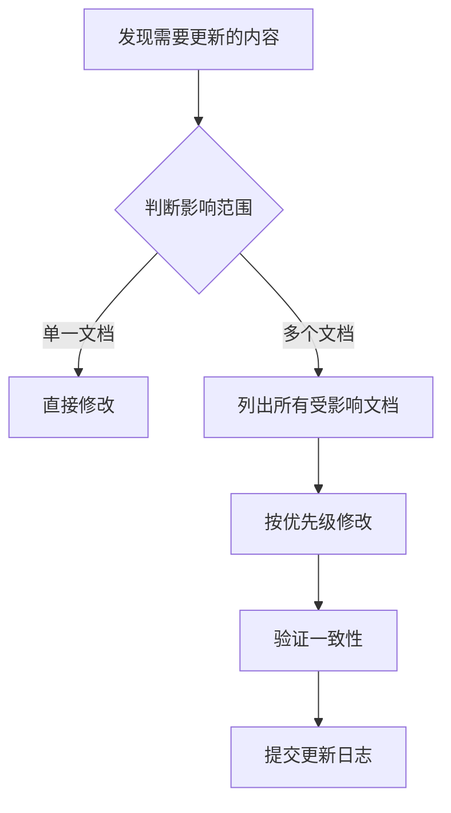

# One AI 项目文档中心

本目录包含 One AI 项目的所有技术文档，包括智能体（Agent）、MCP（Model Context Protocol）等核心模块。

---

## 📁 文档结构

```
99ai/
├── README.md                          # 本文档（总索引）
├── c0-knowledge-system.md             # 知识体系总览
│
├── 📁 agent/                          # Agent 相关文档（历史遗留）
│   ├── README.md                      # Agent 文档索引
│   ├── lingma-user-guide.md           # 👤 Lingma 用户指南
│   ├── lingma-development-guide.md    # 💻 Lingma 开发扩展指南
│   ├── lingma-architecture.md         # 🏗️ Lingma 架构设计
│   ├── lingma-skill-guide.md          # 🎯 Lingma 技能使用指南
│   ├── mcp-integration-guide.md       # 🔌 Agent 对接 MCP 指南
│   └── vscode-api-guide.md            # 🔧 VSCode API 使用指南
│
├── 📁 mcp/                            # MCP 相关文档（历史遗留）
│   ├── README.md                      # MCP 文档索引
│   ├── mcp-user-guide.md              # 👤 MCP 使用指南
│   ├── mcp-development-guide.md       # 💻 MCP 开发指南
│   └── mcp-execution-results.md       # 📊 MCP 执行结果记录
│
├── 📁 c1-core-arch/                   # C1 核心架构 ⭐NEW
│   ├── README.md                      # c1 模块索引
│   ├── c1-1-agent-loop.md             # Agent Loop 设计模式
│   ├── c1-2-hub-spoke-architecture.md # 轮辐式架构实现
│   └── c1-3-microkernel-vs-monolith.md# 微内核与单体架构对比
│
├── 📁 c2-llm-integration/             # C2 LLM 集成 ⭐NEW
│   ├── README.md                      # c2 模块索引
│   └── c2-2-function-calling.md       # Function Calling / Tool Calling
│
├── 📁 c3-memory-system/               # C3 记忆系统 ⭐NEW
│   ├── README.md                      # c3 模块索引
│   └── (待补充)
│
├── 📁 c4-platform-connector/          # C4 平台对接 ⭐NEW
│   └── (待补充)
│
├── 📁 c5-automation/                  # C5 自动化执行 ⭐NEW
│   └── (待补充)
│
├── 📁 c6-security/                    # C6 安全管理 ⭐NEW
│   └── (待补充)
│
├── 📁 c7-skill-ecosystem/             # C7 技能生态 ⭐NEW
│   └── (待补充)
│
├── 📁 c8-ux-design/                   # C8 用户体验 ⭐NEW
│   └── (待补充)
│
├── 📁 c9-advanced/                    # C9 进阶能力 ⭐NEW
│   └── (待补充)
│
└── 📁 c10-legal/                      # C10 法律合规 ⭐NEW
    └── (待补充)
```

---

## 📚 文档列表

### AI智能体核心模块（新体系）⭐

| 模块 | 文档数 | 核心内容 | 状态 |
|------|-------|---------|------|
| **[c1 核心架构](./c1-core-arch/README.md)** | 3 | Agent Loop、轮辐式架构、架构选型 | ✅ 建设中 |
| **[c2 LLM 集成](./c2-llm-integration/README.md)** | 1 | Function Calling、Prompt 工程 | ✅ 建设中 |
| **[c3 记忆系统](./c3-memory-system/README.md)** | 0 | 短期/长期记忆、向量检索、RAG | 🚧 规划中 |
| **[c4 平台对接](./c4-platform-connector/README.md)** | 0 | Telegram/Discord/钉钉等平台 API | 🚧 规划中 |
| **[c5 自动化执行](./c5-automation/README.md)** | 0 | Shell、浏览器、文件操作 | 🚧 规划中 |
| **[c6 安全管理](./c6-security/README.md)** | 0 | 权限控制、加密、隐私保护 | 🚧 规划中 |
| **[c7 技能生态](./c7-skill-ecosystem/README.md)** | 0 | MCP 协议、技能市场 | 🚧 规划中 |
| **[c8 UX 设计](./c8-ux-design/README.md)** | 0 | NLU、多轮对话、反馈机制 | 🚧 规划中 |
| **[c9 进阶能力](./c9-advanced/README.md)** | 0 | 自我进化、多智能体协作 | 🚧 规划中 |
| **[c10 法律合规](./c10-legal/README.md)** | 0 | 开源协议、GDPR | 🚧 规划中 |

---

### Agent 模块（历史文档）

| 文档 | 目标读者 | 核心内容 | 行数 |
|------|---------|---------|-----|
| **[Lingma 架构设计](./agent/lingma-architecture.md)** | 架构师 | 完整架构设计、组件说明、数据流 | 1050 |
| **[Lingma 开发扩展指南](./agent/lingma-development-guide.md)** | 开发者 | 配置部署、扩展开发、性能优化 | 540 |
| **[Lingma 技能使用指南](./agent/lingma-skill-guide.md)** | 高级用户 | 技能系统、工具调用、最佳实践 | 870 |
| **[Agent 对接 MCP 指南](./agent/mcp-integration-guide.md)** | Agent 开发者 | Agent 架构、工具匹配、完整示例 | 790 |
| **[VSCode API 使用指南](./agent/vscode-api-guide.md)** | IDE 开发者 | VSCode 扩展开发、API 参考 | 1180 |

**快速导航：** [Agent 文档索引 →](./agent/README.md)

---

### MCP 模块

| 文档 | 目标读者 | 核心内容 | 行数 |
|------|---------|---------|-----|
| **[OpenClaw 知识体系](./openclaw-knowledge-system.md)** | AI 开发者 | OpenClaw 架构、技术栈、学习路径 | 182 |
| **[MCP 使用指南](./mcp/mcp-user-guide.md)** | 普通用户 | 安装配置、工具使用、IDE 集成 | 279 |
| **[MCP 开发指南](./mcp/mcp-development-guide.md)** | MCP 开发者 | SDK 使用、多语言开发、服务部署 | 552 |
| **[MCP 执行结果](./mcp/mcp-execution-results.md)** | 所有读者 | 实际执行示例、输出记录 | 154 |

**快速导航：** [MCP 文档索引 →](./mcp/README.md)

---

## 🎯 快速开始

### 我想...

#### **使用 Lingma 智能助手**
→ 查看 [Lingma 用户指南](./agent/lingma-user-guide.md)

#### **了解 Lingma 的能力层级**
→ 查看任一指南的第一章：
- [用户指南 1.2 节](./agent/lingma-user-guide.md#12-lingma-能帮您做什么) - 简洁版
- [开发指南 1.1 节](./agent/lingma-development-guide.md#11-lingma-的能力层级) - 详细版

#### **配置和部署 Lingma**
→ 查看 [Lingma 开发扩展指南](./agent/lingma-development-guide.md) 第三章

#### **扩展 Lingma 的能力**
→ 查看 [Lingma 开发扩展指南](./agent/lingma-development-guide.md) 第五章

#### **在 Agent 中集成 MCP**
→ 查看 [Agent 对接 MCP 指南](./agent/mcp-integration-guide.md)

#### **开发自定义 MCP 工具**
→ 查看 [MCP 开发指南](./mcp/mcp-development-guide.md)

#### **了解 MCP 工具列表**
→ 查看 [获取 MCP 工具命令列表的方法](memory://common_pitfalls_experience)

---

## 📊 文档体系

### 三层能力架构

Lingma 的能力分为三个层级，这个核心概念贯穿所有文档：

```
层级 1: 纯数字世界（原生支持）
- 语言理解、代码生成、文档创作
- 知识问答、逻辑推理、数学计算
- 代码分析、Bug 检测、优化建议

层级 2: 操作系统（IDE 支持）
- 文件操作、命令执行、进程管理
- 项目结构分析、代码导航
- 终端命令、脚本执行

层级 3: 物理世界（通过 MCP）
- 硬件控制、IoT 设备、工业系统
- 打印机、传感器、音视频设备
- 智能家居、机器人、自动化系统
```

**关键说明：**
- **层级 1** 是 AI 的原生能力，无需外部支持
- **层级 2** 依赖 IDE 或平台提供的工具
- **层级 3** 通过 MCP 协议连接物理设备

---

## 📋 推荐阅读路径

### 对于最终用户
1. [Lingma 用户指南](./agent/lingma-user-guide.md) - 完整阅读
2. [Lingma 用户指南](./agent/lingma-user-guide.md) 第四章 - 高级功能
3. [MCP 使用指南](./mcp/mcp-user-guide.md) - 了解如何配置 MCP

### 对于应用开发者
1. [Lingma 用户指南](./agent/lingma-user-guide.md) - 快速浏览
2. [Lingma 开发扩展指南](./agent/lingma-development-guide.md) - 重点阅读
3. [MCP 使用指南](./mcp/mcp-user-guide.md) - 了解 MCP 配置

### 对于系统工程师
1. [Lingma 开发扩展指南](./agent/lingma-development-guide.md) - 完整阅读
2. [Agent 对接 MCP 指南](./agent/mcp-integration-guide.md) - 深入阅读
3. [MCP 开发指南](./mcp/mcp-development-guide.md) - 参考实现

### 对于架构师
1. [Agent 对接 MCP 指南](./agent/mcp-integration-guide.md) - 架构设计
2. [Lingma 开发扩展指南](./agent/lingma-development-guide.md) - 技术选型
3. [MCP 开发指南](./mcp/mcp-development-guide.md) - 生态了解

---

## 🔗 相关资源

### 项目内部
- [One AI 项目介绍](../README.md)
- [任务管理系统](../ai-workspace/README.md)
- [项目技术栈](memory://project_tech_stack)

### 外部资源
- [MCP 官方规范](https://modelcontextprotocol.io/specification)
- [MCP SDK](https://github.com/modelcontextprotocol/sdk)
- [Awesome-MCP-ZH](https://gitcode.com/gh_mirrors/aw/Awesome-MCP-ZH)
- [Lingma 社区论坛](https://community.lingma.ai)

---

## 📝 更新日志

### 2026-03-07 - v3.0
- ✅ **创建 AI智能体核心知识体系**（c1-c10 章节编号）
- ✅ 新增 c1 核心架构模块（3 篇详细文档）
  - Agent Loop 设计模式（337 行）
  - 轮辐式架构实现（527 行）
  - 微内核与单体架构对比（282 行）
- ✅ 新增 c2 LLM 集成模块框架
  - Function Calling 详细教程（585 行）
- ✅ 新增 c3 记忆系统模块框架
- ✅ 创建 10 个标准目录（c1-core-arch 到 c10-legal）
- 🔄 更新总索引，兼容新旧文档体系
- 📝 后续计划：补充 c3-c10 模块详细文档

### 2026-03-06
- ✅ 创建 MCP 文档体系（使用指南 + 开发指南）
- ✅ 创建 Agent 对接 MCP 指南
- ✅ 添加 MCP 执行结果记录

---

## 🔄 文档同步机制

### 同步原则

当修改以下核心概念时，需要同步更新相关文档：

#### **1. 三层能力层级**
**影响范围：**
- ✅ [Lingma 用户指南](./agent/lingma-user-guide.md) 第 1.2 节
- ✅ [Lingma 开发指南](./agent/lingma-development-guide.md) 第 1.1 节
- ✅ [本文档](./README.md)（本节下方）

**同步检查清单：**
- [ ] 用户指南是否已更新？
- [ ] 开发指南是否已更新？
- [ ] 总索引是否已更新？
- [ ] 章节编号是否需要调整？

#### **2. MCP 工具列表**
**影响范围：**
- ✅ [MCP 使用指南](./mcp/mcp-user-guide.md)
- ✅ [MCP 开发指南](./mcp/mcp-development-guide.md)
- ✅ [记忆库](memory://common_pitfalls_experience)

**同步检查清单：**
- [ ] 使用指南的工具列表是否更新？
- [ ] 开发指南的示例是否更新？
- [ ] 记忆库是否同步？

#### **3. 架构设计**
**影响范围：**
- ✅ [Lingma 开发指南](./agent/lingma-development-guide.md) 第一章
- ✅ [Agent 对接 MCP 指南](./agent/mcp-integration-guide.md)
- ✅ [记忆库](memory://project_introduction)

---

### 同步流程



### 修改优先级

1. **P0 - 核心概念**（如三层能力架构）
   - 必须同步更新所有相关文档
   - 保持表述一致
   - 更新更新日志

2. **P1 - 技术细节**（如配置参数）
   - 更新主要文档
   - 在索引中添加链接
   - 可选：更新相关示例

3. **P2 - 补充说明**（如最佳实践）
   - 在对应章节添加
   - 不需要全局同步

---

### 更新检查清单

详细的同步检查清单请查看：[文档更新检查清单](./UPDATE-CHECKLIST.md)

**快速检查命令：**
```bash
# 检查三层能力层级是否同步
grep -r "层级 1: 纯数字世界" doc/

# 应该找到：
# doc/agent/lingma-user-guide.md
# doc/agent/lingma-development-guide.md
# doc/README.md
```

---

## 💡 使用建议

### 第一次使用本项目？
1. 从 [Lingma 用户指南](./agent/lingma-user-guide.md) 开始
2. 按照"快速开始"章节操作
3. 遇到问题查看"常见问题"

### 需要开发集成？
1. 阅读 [Lingma 开发扩展指南](./agent/lingma-development-guide.md)
2. 参考"配置和部署"章节
3. 查看"扩展开发"示例

### 开发 Agent 系统？
1. 精读 [Agent 对接 MCP 指南](./agent/mcp-integration-guide.md)
2. 参考完整的代码示例
3. 结合 [MCP 开发指南](./mcp/mcp-development-guide.md) 了解生态

---

## 📞 联系方式

- **项目地址:** https://github.com/one-ai
- **问题反馈:** support@lingma.ai
- **社区论坛:** https://community.lingma.ai

---

**文档维护:** One AI Team  
**最后更新:** 2026-03-07  
**文档版本:** 2.1  
**反馈建议:** 欢迎提交 Issue 或 PR
