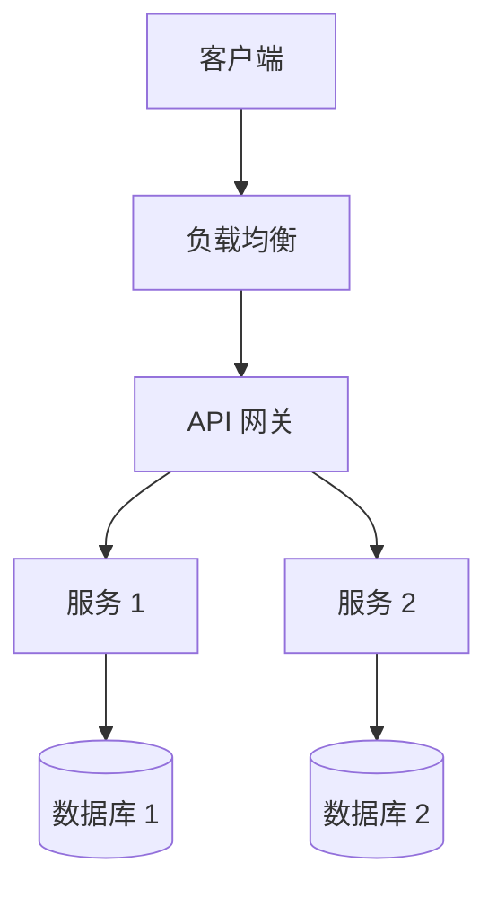
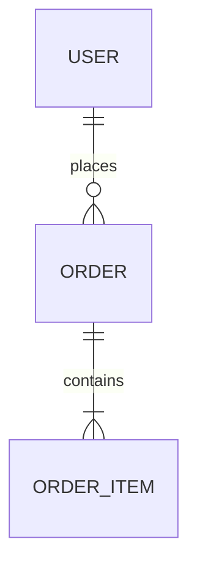

# 架构文档 (AD - Architecture Document)

## 📋 文档信息

| 项目 | 内容 |
|------|------|
| **项目名称** | [填写项目名称] |
| **文档版本** | v1.0 |
| **创建日期** | YYYY-MM-DD |
| **最后更新** | YYYY-MM-DD |
| **负责人** | [填写负责人] |
| **状态** | 草稿/评审中/已批准 |

---

## 1. 架构愿景 (Vision)

### 1.1 架构目标

[描述系统架构要达成的核心目标]

### 1.2 设计原则

- **原则 1**: 如高可用、高扩展、易维护等
- **原则 2**: 如安全第一、性能优先等
- **原则 3**: 如模块化、松耦合等

### 1.3 架构约束

| 约束类型 | 约束描述 | 影响范围 |
|----------|----------|----------|
| 技术约束 | 如必须使用 Java 技术栈 | 全部系统 |
| 业务约束 | 如需支持 10 万并发 | 核心模块 |

---

## 2. 架构问题与挑战 (Problems)

### 2.1 技术挑战

| 挑战 ID | 挑战描述 | 严重程度 | 解决思路 |
|---------|----------|----------|----------|
| TC001 | [挑战 1] | 高/中/低 | [思路] |

### 2.2 现有系统问题

[如果是重构项目，描述现有系统的架构问题]

### 2.3 风险评估

| 风险 ID | 风险描述 | 发生概率 | 影响程度 | 缓解措施 |
|---------|----------|----------|----------|----------|
| AR001 | [风险 1] | 高/中/低 | 高/中/低 | [措施] |

---

## 3. 架构目标 (Goals)

### 3.1 质量属性目标

| 属性 | 目标值 | 测量方法 |
|------|--------|----------|
| 可用性 | 99.9% | 月度统计 |
| 响应时间 | <200ms | P95 延迟 |
| 吞吐量 | 1000 TPS | 峰值测试 |
| 可扩展性 | 水平扩展 | 节点数×2 |

### 3.2 技术目标

- [ ] 目标 1: 如实现微服务化
- [ ] 目标 2: 如容器化部署
- [ ] 目标 3: 如自动化运维

---

## 4. 系统架构设计

### 4.1 架构概览



### 4.2 逻辑架构

#### 4.2.1 分层架构

```
┌─────────────────┐
│   展现层 (UI)    │
├─────────────────┤
│   业务逻辑层     │
├─────────────────┤
│   数据访问层     │
├─────────────────┤
│   基础设施层     │
└─────────────────┘
```

#### 4.2.2 模块划分

| 模块名称 | 职责描述 | 主要技术 | 负责人 |
|----------|----------|----------|--------|
| 用户模块 | 用户管理 | Spring Boot | |
| 订单模块 | 订单处理 | Spring Cloud | |

### 4.3 物理架构

#### 4.3.1 部署架构

[描述系统的物理部署方案]

#### 4.3.2 网络拓扑

[绘制网络拓扑图]

---

## 5. 技术选型

### 5.1 技术栈总览

| 层次 | 技术 | 版本 | 选型理由 |
|------|------|------|----------|
| 前端 | React | 18.x | 生态丰富 |
| 后端 | Spring Boot | 3.x | 成熟稳定 |
| 数据库 | MySQL | 8.0 | 性能优秀 |

### 5.2 关键技术详细说明

#### 5.2.1 [技术名称 1]

- **用途**: [用于什么场景]
- **优势**: [相比其他方案的优势]
- **风险**: [潜在风险和应对]

### 5.3 中间件选型

| 中间件 | 产品 | 版本 | 使用场景 |
|--------|------|------|----------|
| 缓存 | Redis | 7.x | 会话、热点数据 |
| 消息队列 | Kafka | 3.x | 异步解耦 |

---

## 6. 数据架构

### 6.1 数据模型

#### 6.1.1 ER 图



### 6.2 数据库设计

| 表名 | 说明 | 预计数据量 | 增长速率 |
|------|------|------------|----------|
| user | 用户表 | 100 万 | 10 万/月 |

### 6.3 数据流转

[描述关键数据的流转过程]

---

## 7. 接口设计

### 7.1 接口规范

- **协议**: HTTP/HTTPS
- **格式**: JSON
- **认证**: JWT/OAuth2

### 7.2 核心接口列表

| 接口 ID | 接口名称 | 请求方式 | 路径 | 描述 |
|---------|----------|----------|------|------|
| API001 | 用户登录 | POST | /api/login | 用户认证 |

### 7.3 接口示例

```json
{
  "endpoint": "/api/example",
  "method": "POST",
  "request": {},
  "response": {}
}
```

---

## 8. 安全架构

### 8.1 安全策略

- **认证**: 多因素认证
- **授权**: RBAC 权限控制
- **加密**: TLS 传输加密

### 8.2 安全措施

| 安全领域 | 措施 | 实施级别 |
|----------|------|----------|
| 网络安全 | 防火墙、WAF | 必须 |
| 数据安全 | 加密存储 | 必须 |

---

## 9. 运维架构

### 9.1 监控体系

- **应用监控**: APM 工具
- **日志监控**: ELK Stack
- **业务监控**: 自定义指标

### 9.2 部署方案

- **环境**: 开发、测试、生产
- **方式**: 容器化部署
- **策略**: 蓝绿部署/灰度发布

---

## 📝 变更历史

| 版本 | 日期 | 作者 | 变更描述 | 审批人 |
|------|------|------|----------|--------|
| v1.0 | YYYY-MM-DD | [作者] | 初始版本 | |

---

## 🔗 关联文档

- **上游**: [vision.md](../vision.md), [problems.md](../problems.md), [goals.md](../goals.md)
- **下游**: [BRD](./brd_vision.md), [PDD](./pdd_vision.md), [HLD](../hld/hld_goals.md)

---

**文档状态**: 草稿  
**最后更新**: YYYY-MM-DD  
**负责人**: [填写]
