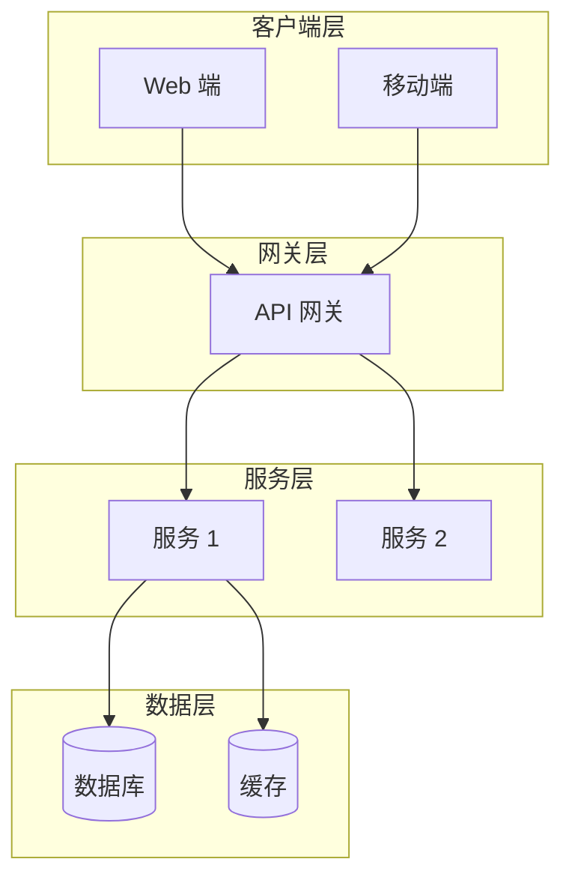
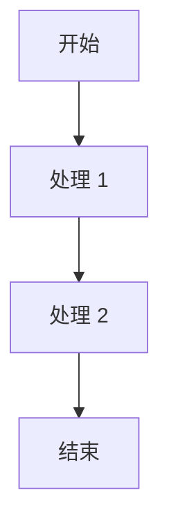
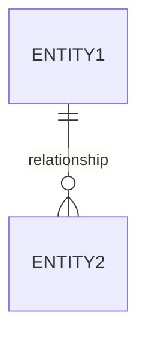

# 概要设计文档 (HLD - High Level Design)

## 📋 文档信息

| 项目 | 内容 |
|------|------|
| **项目名称** | [填写项目名称] |
| **文档版本** | v1.0 |
| **创建日期** | YYYY-MM-DD |
| **最后更新** | YYYY-MM-DD |
| **负责人** | [填写负责人] |
| **状态** | 草稿/评审中/已批准 |

---

## 1. 引言

### 1.1 目的

[说明本文档的目的和适用范围]

### 1.2 范围

[描述本设计涵盖的功能范围]

### 1.3 术语定义

| 术语 | 定义 |
|------|------|
| [术语 1] | [定义] |
| [术语 2] | [定义] |

---

## 2. 系统概述

### 2.1 系统目标

[从 goals.md 继承的系统目标]

### 2.2 假设与依赖

#### 2.2.1 假设条件

- [假设 1]: 如用户具备基本操作能力
- [假设 2]: 如网络环境稳定

#### 2.2.2 外部依赖

| 依赖项 | 提供方 | 版本要求 | 影响 |
|--------|--------|----------|------|
| [依赖 1] | | | |

---

## 3. 总体设计

### 3.1 系统架构图



### 3.2 技术栈

| 层次 | 技术选型 | 版本 | 说明 |
|------|----------|------|------|
| 前端 | | | |
| 后端 | | | |
| 数据库 | | | |
| 中间件 | | | |

---

## 4. 功能模块设计

### 4.1 模块划分

| 模块 ID | 模块名称 | 职责描述 | 关联目标 |
|---------|----------|----------|----------|
| M001 | [模块 1] | [职责] | [G001](../../goals.md#目标 -1) |
| M002 | [模块 2] | [职责] | [G002](../../goals.md#目标 -2) |

### 4.2 模块关系


### 4.3 核心模块详细说明

#### 4.3.1 模块 1: [模块名称]

**功能描述**:
- [功能 1]
- [功能 2]

**接口定义**:
- 输入：[描述]
- 输出：[描述]

**处理流程**:


---

## 5. 数据设计

### 5.1 数据模型

#### 5.1.1 核心实体

| 实体名 | 说明 | 主要属性 |
|--------|------|----------|
| [实体 1] | [说明] | [属性列表] |

#### 5.1.2 实体关系



### 5.2 数据存储方案

| 数据类型 | 存储方案 | 理由 |
|----------|----------|------|
| 结构化数据 | MySQL | 事务支持 |
| 缓存数据 | Redis | 高性能 |

---

## 6. 接口设计

### 6.1 对外接口

| 接口 ID | 接口名称 | 方法 | 路径 | 描述 |
|---------|----------|------|------|------|
| IF001 | [接口 1] | POST | /api/xxx | [描述] |

### 6.2 内部接口

| 接口 ID | 调用方 | 被调用方 | 方法 | 描述 |
|---------|--------|----------|------|------|
| II001 | 模块 1 | 模块 2 | RPC | [描述] |

---

## 7. 非功能性设计

### 7.1 性能设计

| 指标 | 目标值 | 设计方案 |
|------|--------|----------|
| QPS | | 负载均衡、缓存 |
| 响应时间 | | 异步处理、索引优化 |

### 7.2 可用性设计

- **冗余设计**: 主备部署
- **故障转移**: 自动切换
- **降级策略**: 核心功能优先

### 7.3 扩展性设计

- **水平扩展**: 支持动态扩容
- **模块化**: 插件化架构

---

## 8. 任务映射

### 8.1 目标 - 任务对应关系

| 目标 ID | 涉及模块 | 相关任务 |
|---------|----------|----------|
| [G001](../../goals.md#目标 -1) | M001, M002 | [T001](../../tasks.md#任务 -1), [T002](../../tasks.md#任务 -2) |

### 8.2 任务实现路径

```
G001 (目标)
├── T001 (任务 1) → M001.功能 1
└── T002 (任务 2) → M002.功能 2
```

---

## 📝 变更历史

| 版本 | 日期 | 作者 | 变更描述 | 审批人 |
|------|------|------|----------|--------|
| v1.0 | YYYY-MM-DD | [作者] | 初始版本 | |

---

## 🔗 关联文档

- **上游**: [goals.md](../../goals.md), [tasks.md](../../tasks.md)
- **上游文档**: [AD](../ad/ad_vision.md)
- **下游**: [DD](./dd_tasks.md), [DP](../dp/dp_tasks.md)

---

**文档状态**: 草稿  
**最后更新**: YYYY-MM-DD  
**负责人**: [填写]
