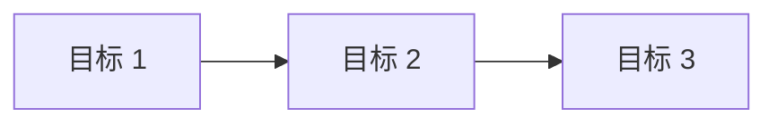

# 项目目标定义 (Goals)

## 📋 当前状态

**状态**: 待定义  
**最后更新**: 2026-03-27  
**版本**: v1.0

---

## 🎯 目标列表

### 目标 1: [待定义]

**描述**: 
- 目标的详细说明

**来源问题**: 
- [关联的问题 ID](./problems.md#问题 -1)

**成功标准**:
- [ ] 可衡量的标准 1
- [ ] 可衡量的标准 2
- [ ] 可衡量的标准 3

**优先级**: 高/中/低

**预计完成时间**: YYYY-MM-DD

**关联任务**: [待分解]

---

### 目标 2: [待定义]

**描述**: 
- 目标的详细说明

**来源问题**: 
- [关联的问题 ID](./problems.md#问题 -2)

**成功标准**:
- [ ] 可衡量的标准 1
- [ ] 可衡量的标准 2

**优先级**: 高/中/低

**预计完成时间**: YYYY-MM-DD

**关联任务**: [待分解]

---

## 📊 目标优先级矩阵

| 目标 ID | 目标名称 | 重要性 | 紧急性 | 可行性 | 优先级评分 | 状态 |
|---------|----------|--------|--------|--------|------------|------|
| G001 | [待填充] | - | - | - | - | pending |
| G002 | [待填充] | - | - | - | - | pending |

**评分标准**:
- 重要性：1-5 分（5 为最重要）
- 紧急性：1-5 分（5 为最紧急）
- 可行性：1-5 分（5 为最可行）
- 优先级评分 = (重要性 + 紧急性) × 可行性

---

## 🔄 目标依赖关系

**说明**: 
- 箭头表示依赖关系（前置→后置）
- 无依赖的目标可以并行执行

---

## 📈 目标完成度追踪

| 目标 ID | 计划开始 | 实际开始 | 计划完成 | 预计完成 | 完成度 | 状态 |
|---------|----------|----------|----------|----------|--------|------|
| G001 | - | - | - | - | 0% | pending |
| G002 | - | - | - | - | 0% | pending |

**状态说明**:
- `pending`: 尚未开始
- `in_progress`: 进行中
- `completed`: 已完成
- `blocked`: 被阻塞
- `cancelled`: 已取消

---

## 🔗 上下游关联

- **上游**: [problems.md](./problems.md) - 问题拆解
- **下游**: [tasks.md](./tasks.md) - 任务分解

---

## 📝 更新日志

- **v1.0** (2026-03-27): 初始版本，待填充目标内容

---

**下一步**:
1. 从 problems.md 的问题推导出目标
2. 使用 SMART 原则定义每个目标
3. 确定目标优先级和依赖关系
4. 将目标分解为具体任务（tasks.md）
