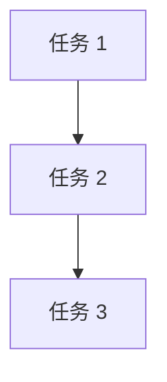

# 任务分解列表 (Tasks)

## 📋 当前状态

**状态**: 待创建  
**最后更新**: 2026-03-27  
**版本**: v1.0

---

## 📝 任务列表

### 任务 1: [待定义]

**关联目标**: [G001](./goals.md#目标 -1)  
**优先级**: 高/中/低  
**预估工时**: 0 小时  
**状态**: pending

**描述**:
- 任务的详细说明

**验收标准**:
- [ ] 标准 1
- [ ] 标准 2
- [ ] 标准 3

**依赖任务**: 
- 无 / [任务 ID]()

**执行计划**: [plan_001.md](./plans/plan_001.md)

---

### 任务 2: [待定义]

**关联目标**: [G001](./goals.md#目标 -1)  
**优先级**: 高/中/低  
**预估工时**: 0 小时  
**状态**: pending

**描述**:
- 任务的详细说明

**验收标准**:
- [ ] 标准 1
- [ ] 标准 2

**依赖任务**: 
- 无 / [任务 ID]()

**执行计划**: [plan_002.md](./plans/plan_002.md)

---

## 📊 任务看板

### 按状态分组

| pending (待开始) | in_progress (进行中) | completed (已完成) | blocked (阻塞) |
|------------------|----------------------|--------------------|----------------|
| T001, T002 | - | - | - |

### 按优先级分组

| 高优先级 | 中优先级 | 低优先级 |
|----------|----------|----------|
| T001 | T002 | - |

---

## 📈 进度追踪

### 总体进度

```
总任务数：0
已完成：0
进行中：0
待开始：0
完成率：0%
```

### 燃尽图数据

| 日期 | 剩余任务数 | 完成百分比 |
|------|------------|------------|
| 2026-03-27 | 0 | 0% |

---

## 🔄 任务依赖关系



**说明**:
- 箭头表示依赖关系（前置→后置）
- 关键路径用粗线标注

---

## 📁 相关文档

### 设计文档
- **HLD**: [概要设计](./docs/hld/hld_goals.md)
- **DD**: [详细设计](./docs/dd/dd_tasks.md)

### 计划文档
- **DP**: [开发计划](./docs/dp/dp_tasks.md)
- **执行计划**: [plans/](./plans/)

### 进度记录
- **Progress**: [progress/](./progress/)

---

## 🔗 上下游关联

- **上游**: [goals.md](./goals.md) - 目标定义
- **下游**: [plans/](./plans/) - 执行计划

---

## 📝 更新日志

- **v1.0** (2026-03-27): 初始版本，待填充任务内容

---

**下一步**:
1. 从 goals.md 的目标分解出具体任务
2. 为每个任务定义明确的验收标准
3. 评估任务优先级和工时
4. 识别任务依赖关系
5. 为每个任务创建执行计划（plans/）
