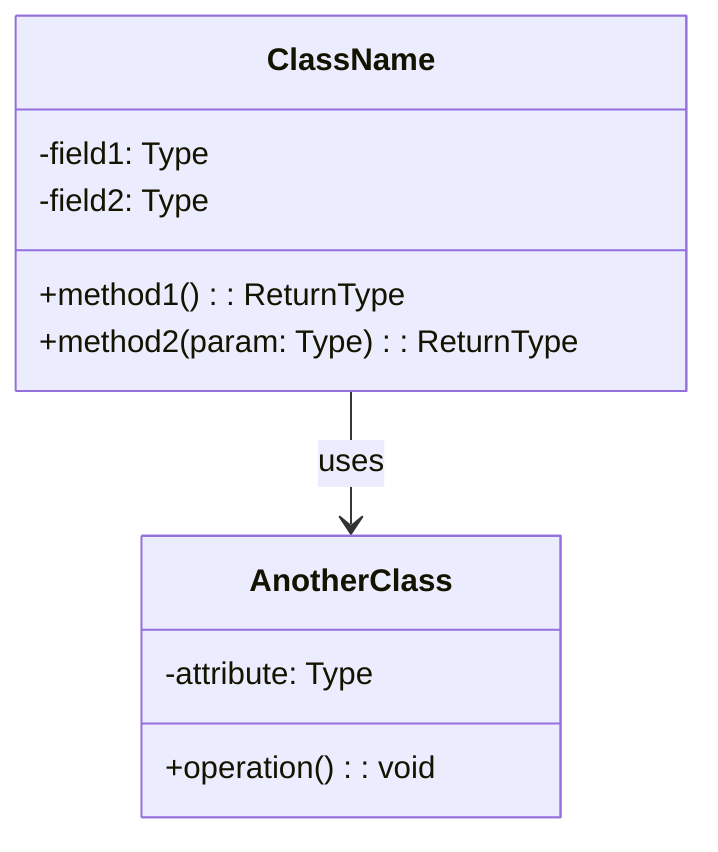
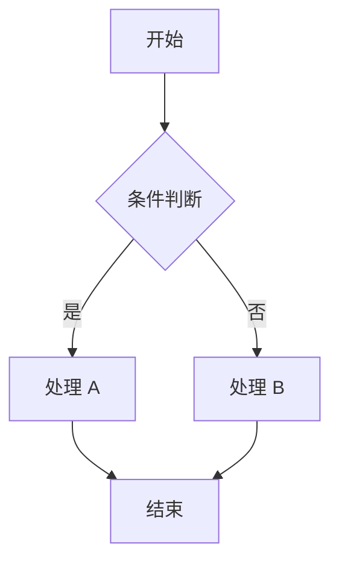

# 详细设计文档 (DD) - {VISION_ID}

## 📋 文档信息

| 项目 | 内容 |
|------|------|
| **愿景 ID** | {VISION_ID} |
| **项目名称** | [填写项目名称] |
| **文档版本** | v1.0 |
| **创建日期** | YYYY-MM-DD |
| **最后更新** | YYYY-MM-DD |
| **负责人** | [填写负责人] |
| **状态** | 草稿/评审中/已批准 |

---

## 1. 模块详细设计

### 1.1 模块概述

| 属性 | 值 |
|------|-----|
| **模块名称** | [模块名称] |
| **模块 ID** | M001 |
| **关联任务** | [T001](../../visions/{VISION_ID}/tasks.md#任务 -1) |
| **优先级** | 高/中/低 |

### 1.2 功能说明

#### 1.2.1 功能列表

| 功能 ID | 功能名称 | 功能描述 | 输入 | 输出 |
|---------|----------|----------|------|------|
| F001 | [功能 1] | [描述] | [输入] | [输出] |

---

## 2. 类设计

### 2.1 类图



### 2.2 类详细说明

#### 2.2.1 类名：[ClassName]

**职责**: [类的核心职责]

**属性**:
| 属性名 | 类型 | 可见性 | 说明 |
|--------|------|--------|------|
| field1 | Type | private | [说明] |

**方法**:
| 方法名 | 参数 | 返回值 | 说明 |
|--------|------|--------|------|
| method1 | () | ReturnType | [说明] |

**使用示例**:
```java
// 代码示例
ClassName obj = new ClassName();
obj.method1();
```

---

## 3. 数据库设计

### 3.1 表结构

#### 3.1.1 表名：[table_name]

| 字段名 | 数据类型 | 约束 | 默认值 | 说明 |
|--------|----------|------|--------|------|
| id | BIGINT | PRIMARY KEY, AUTO_INCREMENT | | 主键 ID |
| name | VARCHAR(100) | NOT NULL | | 名称 |
| created_at | DATETIME | NOT NULL | CURRENT_TIMESTAMP | 创建时间 |

### 3.2 索引设计

| 索引名 | 字段 | 类型 | 说明 |
|--------|------|------|------|
| idx_name | name | NORMAL | 加速名称查询 |

### 3.3 SQL 示例

```sql
-- 查询示例
SELECT * FROM table_name WHERE name = ?;

-- 插入示例
INSERT INTO table_name (name) VALUES (?);
```

---

## 4. 接口详细设计

### 4.1 API 接口

#### 4.1.1 接口：[接口名称]

**请求**:
- **方法**: POST
- **路径**: /api/v1/resource
- **Content-Type**: application/json

**请求参数**:
```json
{
  "param1": "value1",
  "param2": 123
}
```

**响应**:
```json
{
  "code": 200,
  "message": "success",
  "data": {
    "id": 1,
    "name": "example"
  }
}
```

**错误码**:
| 错误码 | 说明 | 处理建议 |
|--------|------|----------|
| 400 | 参数错误 | 检查请求参数 |
| 404 | 资源不存在 | 确认资源 ID |

---

## 5. 算法与逻辑

### 5.1 核心算法

#### 5.1.1 算法名称：[Algorithm Name]

**目的**: [算法要解决的问题]

**伪代码**:
```
FUNCTION algorithm_name(input):
    // 步骤 1
    result = initialize()
    
    // 步骤 2
    FOR each item IN input:
        result = process(item)
    
    // 步骤 3
    RETURN result
END FUNCTION
```

**复杂度分析**:
- 时间复杂度：O(n)
- 空间复杂度：O(1)

### 5.2 业务流程

#### 5.2.1 流程：[流程名称]



---

## 6. 计划执行步骤

### 6.1 关联计划

本文档对应的执行计划：[plan_{VISION_ID}_XXX.md](../../plans/plan_{VISION_ID}_XXX.md)

### 6.2 实现步骤

| 步骤 | 操作 | 预期结果 | 验收标准 |
|------|------|----------|----------|
| 1 | [步骤 1] | [结果] | [标准] |
| 2 | [步骤 2] | [结果] | [标准] |

### 6.3 代码结构

```
src/
├── controller/      # 控制器层
│   └── XxxController.java
├── service/         # 服务层
│   ├── XxxService.java
│   └── impl/
│       └── XxxServiceImpl.java
├── repository/      # 数据访问层
│   └── XxxRepository.java
└── model/           # 数据模型
    └── Xxx.java
```

---

## 7. 测试设计

### 7.1 单元测试

| 测试用例 ID | 测试方法 | 输入 | 预期输出 | 覆盖代码 |
|-------------|----------|------|----------|----------|
| TC001 | testMethod1 | [输入] | [输出] | [代码行] |

### 7.2 集成测试

| 测试场景 | 前置条件 | 测试步骤 | 预期结果 |
|----------|----------|----------|----------|
| [场景 1] | [条件] | [步骤] | [结果] |

---

## 8. 进度记录

### 8.1 执行日志

| 日期 | 步骤 | 完成情况 | 问题记录 | 负责人 |
|------|------|----------|----------|--------|
| YYYY-MM-DD | 步骤 1 | ✅ | 无 | |

### 8.2 进度追踪

```
总步骤数：0
已完成：0
进行中：0
完成率：0%
```

详细进度记录：[../../progress/progress_{VISION_ID}.md](../../progress/progress_{VISION_ID}.md)

---

## 📝 变更历史

| 版本 | 日期 | 作者 | 变更描述 | 审批人 |
|------|------|------|----------|--------|
| v1.0 | YYYY-MM-DD | [作者] | 初始版本 | |

---

## 🔗 关联文档

### 本愿景文档
- **上游**: [./hld_{VISION_ID}.md](./hld_{VISION_ID}.md)
- **上游**: [../visions/{VISION_ID}/tasks.md](../../visions/{VISION_ID}/tasks.md)

### 下游文档
- **DP**: [./dp_{VISION_ID}.md](./dp_{VISION_ID}.md)
- **Plans**: [../../plans/](../../plans/)

### 参考文档
- **AD**: [./ad_{VISION_ID}.md](./ad_{VISION_ID}.md)

### 跨愿景文档（如适用）
- **全局 DD**: [./dd_global.md](./dd_global.md)

---

**文档状态**: 草稿  
**最后更新**: YYYY-MM-DD  
**负责人**: [填写]  
**愿景 ID**: {VISION_ID}
