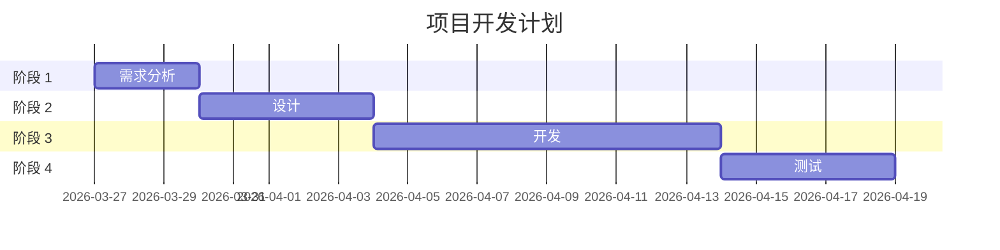

# 开发计划文档 (DP) - {VISION_ID}

## 📋 文档信息

| 项目 | 内容 |
|------|------|
| **愿景 ID** | {VISION_ID} |
| **项目名称** | [填写项目名称] |
| **文档版本** | v1.0 |
| **创建日期** | YYYY-MM-DD |
| **最后更新** | YYYY-MM-DD |
| **负责人** | [填写负责人] |
| **状态** | 草稿/评审中/已批准 |

---

## 1. 计划概述

### 1.1 计划目标

[本计划要达成的具体目标]

### 1.2 关联目标

| 目标 ID | 目标描述 | 来源 |
|---------|----------|------|
| [G001](../../visions/{VISION_ID}/goals.md#目标 -1) | [目标描述] | goals.md |

### 1.3 关联任务

| 任务 ID | 任务名称 | 优先级 | 预估工时 |
|---------|----------|--------|----------|
| [T001](../../visions/{VISION_ID}/tasks.md#任务 -1) | [任务名称] | 高 | X 小时 |

---

## 2. 执行步骤

### 2.1 步骤总览

| 步骤 ID | 步骤名称 | 前置条件 | 预计耗时 | 负责人 | 状态 |
|---------|----------|----------|----------|--------|------|
| S001 | [步骤 1] | 无 | 30 分钟 | | pending |
| S002 | [步骤 2] | S001 完成 | 1 小时 | | pending |

### 2.2 详细步骤说明

#### 步骤 1: [步骤名称]

**操作说明**:
1. 打开终端
2. 进入项目目录
3. 执行命令：`xxx`

**预期结果**:
- [ ] 结果 1
- [ ] 结果 2

**验收标准**:
- [ ] 标准 1
- [ ] 标准 2

**可能的问题**:
- [问题 1]: [解决方案]

#### 步骤 2: [步骤名称]

[同上格式]

---

## 3. 时间规划

### 3.1 里程碑

| 里程碑 | 日期 | 交付物 | 完成标准 |
|--------|------|--------|----------|
| M1: 启动 | YYYY-MM-DD | 环境准备就绪 | 所有依赖安装完成 |
| M2: 开发完成 | YYYY-MM-DD | 代码完成 | 所有功能实现 |
| M3: 测试完成 | YYYY-MM-DD | 测试报告 | 所有测试通过 |

### 3.2 甘特图



---

## 4. 资源需求

### 4.1 人力资源

| 角色 | 人数 | 职责 | 投入时间 |
|------|------|------|----------|
| 开发工程师 | 1 | 编码实现 | 全职 |
| 测试工程师 | 1 | 测试验证 | 兼职 |

### 4.2 技术资源

| 资源类型 | 资源名称 | 用途 | 使用期限 |
|----------|----------|------|----------|
| 服务器 | AWS EC2 | 开发环境 | 3 个月 |
| 数据库 | MySQL | 数据存储 | 3 个月 |

### 4.3 工具资源

| 工具名称 | 用途 | 许可证 |
|----------|------|--------|
| VS Code | 代码编辑 | 免费 |
| Git | 版本控制 | 免费 |

---

## 5. 风险管理

### 5.1 风险识别

| 风险 ID | 风险描述 | 发生概率 | 影响程度 | 风险等级 |
|---------|----------|----------|----------|----------|
| R001 | [风险 1] | 中 | 高 | 高 |

### 5.2 风险应对

| 风险 ID | 应对策略 | 具体措施 | 负责人 |
|---------|----------|----------|--------|
| R001 | 规避 | [措施] | |
| R002 | 减轻 | [措施] | |

---

## 6. 质量管理

### 6.1 质量标准

- **代码质量**: 符合编码规范，Code Review 通过率 100%
- **测试覆盖**: 单元测试覆盖率 > 80%
- **性能指标**: 响应时间 < 200ms

### 6.2 质量保证活动

| 活动 | 时间 | 参与人 | 输出物 |
|------|------|--------|--------|
| 代码审查 | 每周一次 | 全体开发 | 审查记录 |
| 测试报告 | 测试完成后 | 测试工程师 | 测试报告 |

---

## 7. 进度追踪

### 7.1 完成情况

```
总步骤数：0
已完成：0
进行中：0
待开始：0
完成率：0%
```

### 7.2 燃尽图数据

| 日期 | 剩余步骤 | 完成百分比 | 备注 |
|------|----------|------------|------|
| YYYY-MM-DD | 0 | 0% | 计划启动 |

### 7.3 变更记录

| 版本 | 日期 | 变更内容 | 原因 | 审批人 |
|------|------|----------|------|--------|
| v1.0 | YYYY-MM-DD | 初始版本 | | |

---

## 8. 沟通计划

### 8.1 会议安排

| 会议类型 | 频率 | 时间 | 参与人 | 议程 |
|----------|------|------|--------|------|
| 站会 | 每日 | 9:00 | 全体成员 | 同步进度 |
| 周会 | 每周 | 周一 10:00 | 全体成员 | 周计划 |

### 8.2 沟通渠道

| 渠道 | 用途 | 响应时间 |
|------|------|----------|
| 微信群 | 日常沟通 | 即时 |
| 邮件 | 正式通知 | 24 小时内 |

---

## 9. 交付物清单

### 9.1 文档交付物

- [ ] [需求文档](./brd_{VISION_ID}.md)
- [ ] [设计文档](./dd_{VISION_ID}.md)
- [ ] 测试报告
- [ ] 用户手册

### 9.2 代码交付物

- [ ] 源代码
- [ ] 数据库脚本
- [ ] 部署脚本

---

## 📝 变更历史

| 版本 | 日期 | 作者 | 变更描述 | 审批人 |
|------|------|------|----------|--------|
| v1.0 | YYYY-MM-DD | [作者] | 初始版本 | |

---

## 🔗 关联文档

### 本愿景文档
- **上游**: [../visions/{VISION_ID}/goals.md](../../visions/{VISION_ID}/goals.md)
- **上游**: [../visions/{VISION_ID}/tasks.md](../../visions/{VISION_ID}/tasks.md)
- **上游文档**: [./hld_{VISION_ID}.md](./hld_{VISION_ID}.md)
- **上游文档**: [./dd_{VISION_ID}.md](./dd_{VISION_ID}.md)

### 下游文档
- **Progress**: [../../progress/progress_{VISION_ID}.md](../../progress/progress_{VISION_ID}.md)

### 跨愿景文档（如适用）
- **全局 DP**: [./dp_global.md](./dp_global.md)

---

**文档状态**: 草稿  
**最后更新**: YYYY-MM-DD  
**负责人**: [填写]  
**愿景 ID**: {VISION_ID}
