# 线性结构

数据的逻辑结构主要分为两种：

- **线性的：**就是连成一条线的结构，比如数组、链表、 队列、栈 等
- **非线性的：**顾名思义，数据之间的关系是非线性的，比如 堆、树、图 等

## 数组

**数组**是一个有限的、类型相同的数据的集合，在内存中是一段连续的内存区域。

1. 支持随机访问
2. 数组的访问时间复杂度是 O(1)
3. 数组插入删除的时间复杂度是O(n)

如下图：

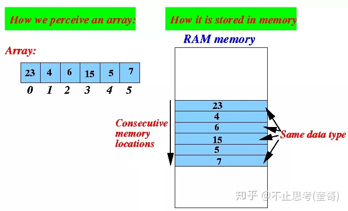

数组的下标是从0开始的，上图数组中有6个元素，对应着下标依次是0、1、2、3、4、5，同时，数组里面存的数据的类型必须是一致的，比如上图中存的都是数字类型。数组中的全部元素是“连续”的存储在一块内存空间中的，如上图右边部分，元素与元素之间是不会有别的存储隔离的。另外，也是因为数组需要连续的内存空间，所以数组在定义的时候就需要提前指定固定大小，不能改变。

**数组的访问：**

数组在访问操作方面有着独特的性能优势，因为**数组是支持随机访问的**，也就是说我们可以通过下标随机访问数组中任何一个元素，其原理是因为数组元素的存储是连续的，所以我们可以通过数组内存空间的首地址加上元素的偏移量计算出某一个元素的内存地址，如下：

```
array[n]的地址 = array数组内存空间的首地址 + 每个元素大小*n
```


通过上述公式可知：数组中通过下标去访问数据时并不需要遍历整个数组，因此**数组的访问时间复杂度是 O(1)**，当然这里需要注意，如果不是通过下标去访问，而是通过内容去查找数组中的元素，则时间复杂度不是O(1)，极端的情况下需要遍历整个数组的元素，时间复杂度可能是O(n)，当然通过不同的查找算法所需的时间复杂度是不一样的。

**数组的插入与删除：**

同样是因为数组元素的连续性要求，所以导致数组在插入和删除元素的时候效率比较低。

如果要在数组中间插入一个新元素，就必须要将要相邻的后面的元素全部往后移动一个位置，留出空位给这个新元素。还是拿上面那图举例，如果需要在下标为2的地方插入一个新元素11，那就需要将原有的2、3、4、5几个下标的元素依次往后移动一位，新元素再插入下标为2的位置，最后形成新的数组是：
  23、4、11、6、15、5、7

如果新元素是插入在数组的最开头位置，那整个原始数组都需要向后移动一位，此时的时间复杂度为最坏情况即O(n)，如果新元素要插入的位置是最末尾，则无需其它元素移动，则此时时间复杂度为最好情况即O(1)，所以平均而言**数组插入的时间复杂度是O(n)**

数组的删除与数组的插入是类似的。

## 链表

**链表**是一种物理存储单元上非连续、非顺序的存储结构，数据元素的逻辑顺序是通过链表中的指针链接次序实现的，一般用于插入与删除较为频繁的场景。

1. 链表的访问时间复杂度为O(n)
2. 链表的时间插入删除的时间复杂度为O(1)

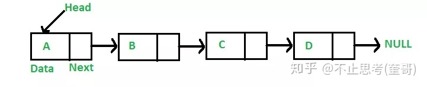

上图是“单链表”示例，链表并不需要数组那样的连续空间，它只需要一个个零散的内存空间即可，因此对内存空间的要求也比数组低。
链表的每一个节点通过“指针”链接起来，每一个节点有2部分组成，一部分是数据（上图中的Data），另一部分是后继指针（用来存储后一个节点的地址），在这条链中，最开始的节点称为Head，最末尾节点的指针指向NULL。

「 链表 」也分为好几种，上图是最简单的一种，它的每一个节点只有一个指针（后继指针）指向后面一个节点，这个链表称为：**单向链表**，除此之外还有 双向链表、循环链表 等。

**双向链表：**

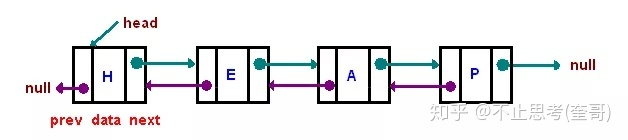

双向链表与单向链表的区别是前者是2个方向都有指针，后者只有1个方向的指针。双向链表的每一个节点都有2个指针，一个指向前节点，一个指向后节点。双向链表在操作的时候比单向链表的效率要高很多，但是由于多一个指针空间，所以占用内存也会多一点。

**循环链表：**

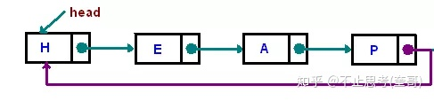

其实循环链表就是一种特殊的单向链表，只不过在单向链表的基础上，将尾节点的指针指向了Head节点，使之首尾相连。

- **链表的访问**
  链表的优势并不在与访问，因为链表无法通过首地址和下标去计算出某一个节点的地址，所以链表中如果要查找某个节点，则需要一个节点一个节点的遍历，因此**链表的访问时间复杂度为O(n)**
- **链表的插入与删除**
  也正式因为链表内存空间是非连续的，所以它对元素的插入和删除时，并不需要像数组那样移动其它元素，只需要修改指针的指向即可。

例如：删除一个元素E：

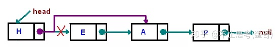

例如：插入一个元素：


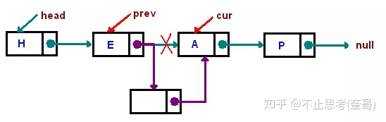


既然插入与删除元素只需要改动指针，无需移动数据，那么**链表的时间插入删除的时间复杂度为O(1)**不过这里指的是找到节点之后纯粹的插入或删除动作所需的时间复杂度。

如果当前还未定位到指定的节点，只是拿到链表的Head，这个时候要去删除此链表中某个固定内容的节点，则需要先查找到那个节点，这个查找的动作又是一个遍历动作了，这个遍历查找的时间复杂度却是O(n)，两者加起来总的时间复杂度其实是O(n)的。

其实就算是已经定位到了某个要删除的节点了，删除逻辑也不简单。以“删除上图的E节点”为例，假如当前链表指针已经定位到了E节点，删除的时候，需要将这个E节点的前面一个节点H的后继指针改为指向A节点，那么E节点就会自动脱落了，但是当前链表指针是定位在E节点上，如何去改变H节点的后续指针呢，对于“单向链表”而言，这个时候需要从头遍历一遍整个链表，找到H节点去修改其后继指针的内容，所以时间复杂度是O(n)，但如果当前是“双向链表”，则不需要遍历，直接通过前继指针即可找到H节点，时间复杂度是O(1)，这里就是“双向链表”相当于“单向链表”的优势所在。

## 堆栈

堆栈（stack）是一种先进后出的、操作受限的线性表，也可以直接称为 **栈**。

**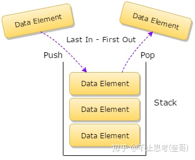**

可以把栈想象成一个桶一样，往这个桶里面一层一层的放东西，先放进去的在里面，后放进去的东西依次在外面。但取东西的时候就是先取靠近外面的，再依次一层层取里面的。这就是 后进先出（ Last In-First Out ）的原则。

因此「 栈 」虽然是线性的，有2个端：顶端和底端，但它只允许从一端进行插入和删除数据，这就是为啥前面说「 栈 」是操作受限的了。

**栈**只有两种操作：Push 和 Pop 。我们用Push（压入）来表示往栈中插入数据，也叫入栈，用Pop（弹出）来表示从栈中删除数据，也叫出栈。我们可以既可以用 「 数组 」 来实现一个栈，也可以用 「 链表 」 来实现一个栈。

用数组实现的栈，叫做 **顺序栈**：

顺序栈的实现非常简单，这里就不写代码了，写一下思路。先初始化一个数组，然后再用一个变量给这个数组里的元素进行计数，当有新元素需要入栈的时候，将这个新元素写入到数组的最后一个元素的后面，然后计数器加一。当需要做出栈操作时，将数组中最后一个元素返回，计数器减一。

当然在入栈前需要判断数组是否已经满了，如果数组大小等于计数器大小，则表明数组是满的。

出栈的时候也需要判断数组是不是空数组，如果计数器是0，则表明数组是空的。

从上面的实现流程可以看出，通过数组实现的栈，其入栈和出栈都是对单个元素进行操作，因此其入栈和出栈的时间复杂度都是O(1)，并且其入栈和出栈操作并没有额外开销更多空间，因此其空间复杂度也是O(1)的。

用链表实现的栈，叫做 **链式栈**：

实现思路是先定义一个链表节点的类，基于这个类去定义一个头节点Head。当有新元素需要入栈的时候，将这个新元素的Next指针指向头结点Head的Next节点，然后再将Head的Next指向这个新节点。当需要做出栈操作时，直接将Head所指向的节点返回，同时让Head指向下一个节点。

当然，在入栈和出栈时都需要判断链表是否为空的情况。

链式栈的入栈和出栈都是在处理头部节点，所以操作很简单，其时间和空间复杂度均为O(1)。

## **队列**

**队列（queue）**是一种先进先出的、操作受限的线性表。

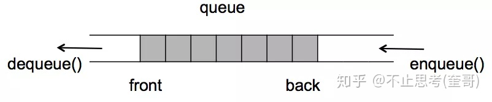

队列这种数据结构非常容易理解，就像我们平时去超市买东西，在收银台结账的时候需要排队，先去排队的就先结账出去，排在后面的就后结账，有其他人再要过来结账，必须排在队尾不能在队中间插队。
「 队列 」数据结构就是这样的，先进入队列的先出去，后进入队列的后出去。**必须从队尾插入新元素，队列中的元素只能从队首出**，这也就是「 队列 」操作受限制的地方了。
与堆栈类似，队列既可以用 「 数组 」 来实现，也可以用 「 链表 」 来实现。
下面主要介绍一下目前用的比较多的几种「 队列 」类型：

- **顺序队列**
- **链式队列**
- **循环队列**
- **优先队列**

下面来依次了解一下：

用数组实现的队列，叫做 **顺序队列**：

用数组实现的思路是这样的：初始化一个长度为n的数组，创建2个变量指针front和rear，front用来标识队头的下标，而rear用来标识队尾的下标。因为队列总是从对头取元素，从队尾插入数据。因此我们在操作这个队列的时候通过移动front和rear这两个指针的指向即可。初始化的时候front和rear都指向第0个位置。

当有元素需要入队的时候，首先判断一下队列是否已经满了，通过rear与n的大小比较可以进行判断，如果相等则说明队列已满（队尾没有空间了），不能再插入了。如果不相等则允许插入，将新元素赋值到数组中rear指向的位置，然后rear指针递增加一（即向后移动了一位），不停的往队列中插入元素，rear不停的移动，如图：

**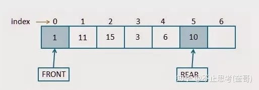**

当队列装满的时候，则是如下情况：

** 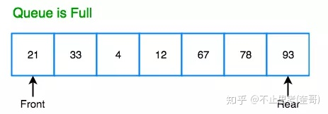**

当需要做出队操作时，首先要判断队列是否为空，如果front指针和rear指针指向同一个位置（即front==rear）则说明队列是空的，无法做出队操作。如果队列不为空，则可以进行出队操作，将front指针所指向的元素出队，然后front指针递增加一（即向后移动了一位），加入上图的队列出队了2个元素：

**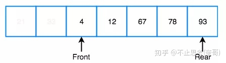**

所以对于数组实现的队列而言，需要用2个指针来控制（front和rear），并且无论是做入队操作还是出队操作，front或rear都是往后移动，并不会往前移动。入队的时候是rear往后移动，出队的时候是front往后移动。出队和入队的时间复杂度都是O(1)的。

用链表实现的队列，叫做 **链式队列**：

用链表来实现也比较简单，与数组实现类似，也是需要2个指针来控制（front和rear），如图：

**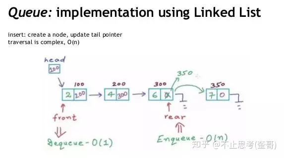**

当进行入队操作时，让新节点的Next指向rear的Next，再让rear的Next指向新节点，最后让rear指针向后移动一位（即rear指针指向新节点），如上图右边部分。

当进行出队操作时，直接将front指针指向的元素出队，同时让front指向下一个节点（即将front的Next赋值给front指针），如上图左边部分。

**循环队列**

循环队列是指队列是前后连成一个圆圈，它以循环的方式去存储元素，但还是会按照队列的先进先出的原则去操作。循环队列是基于数组实现的队列，但它比普通数据实现的队列带来的好处是显而易见的，它能更有效率的利用数组空间，且不需要移动数据。
普通的数组队列在经过了一段时间的入队和出队以后，尾指针rear就指向了数组的最后位置了，没法再往队列里插入数据了，但是数组的前面部分（front的前面）由于旧的数据曾经出队了，所以会空出来一些空间，这些空间就没法利用起来。

当然可以在数组尾部已满的这种情况下，去移动数据，把数据所有的元素都往前移动以填满前面的空间，释放出尾部的空间，以便尾部还可以继续插入新元素。但是这个移动也是消耗时间复杂度的。
而**循环队列**就可以天然的解决这个问题，下面是循环队列的示意图：

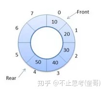

循环队列也是一种线性数据结构，只不过它的最后一个位置并不是结束位。对于循环队列，头指针front始终指向队列的前面，尾指针rear始终指向队列的末尾。在最初阶段，头部和尾部的指针都是指向的相同的位置，此时队列是空的，如图：

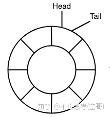

当有新元素要插入到这个循环队列的时候（入队），新元素就会被添加到队尾指针rear指向的位置（rear和tail这两个英文单词都是表示队尾指针的，不同人喜欢的叫法不一样），并且队尾指针就会递增加一，指向下一个位置，如图：

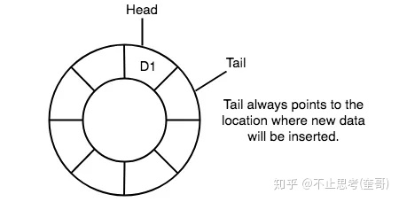

当需要做出队操作时，直接将头部指针front指向的元素进行出队（我们常用 front 或 head 英文单词来表示头部指针，凭个人喜好），并且头部指针递增加一，指向下一个位置，如图：

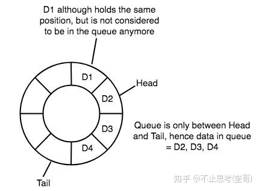

上图中，D1元素被出队列了，头指针head也指向了D2，不过D1元素的实际数据并没有被删除，但即使没有删除，D1元素也不属于队列中的一部分了，队列只承认队头和队尾之间的数据，其它数据并不属于队列的一部分。

当继续再往队列中插入元素，当tail到达队列的尾部的时候：

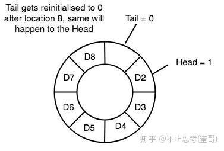

tail的下标就有重新变成了0，此时队列已经真的满了。

不过此处有个知识点需要注意，在上述队列满的情况下，其实还是有一个空间是没有存储数据的，这是循环队列的特性，只要队列不为空，那么就必须让head和tail之间至少间隔一个空闲单元，相当于浪费了一个空间吧。

假如此时我们将队列中的D2、D3、D4、D5都出队，那队列就又有空间了，我们又可以继续入队，我们将D9、D10入队，状态如下：

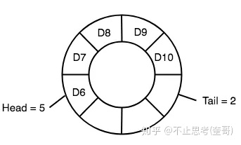

此时，头指针的下标已经大于尾指针的下标了，这也是正式循环队列的特性导致的。

所以可以看到，整个队列的入队和出队的过程，就是头指针head和尾指针tail互相追赶的过程，如果tail追赶上了head就说明队满了（前提是相隔一个空闲单元），如果head追赶上了tail就说明队列空了。

因此循环队列中，**判断队列为空的条件是：head==tail**。

判断队列为满的情况就是：tail+1=head（即tail的下一个是head，因为前面说了不为空的情况下两者之间需相隔一个单元），不过如果tail与head正好一个在队头一个在队尾（即tail=7，head=0）的时候，队列也是满的，但上述公式就不成立了，因此正确**判断队满的公式应该是：(tail+1)%n=head**

**优先队列**

优先队列（priority Queue）是一种特殊的队列，它不遵守先进先出的原则，它是按照优先级出队列的。分为**最大优先队列**（是指最大的元素优先出队）和**最小优先队列**（是指最小的元素优先出队）。

一般用**堆**来实现优先队列，在后面讲**堆**的文章里我会详细再讲，这里了解一下即可。

