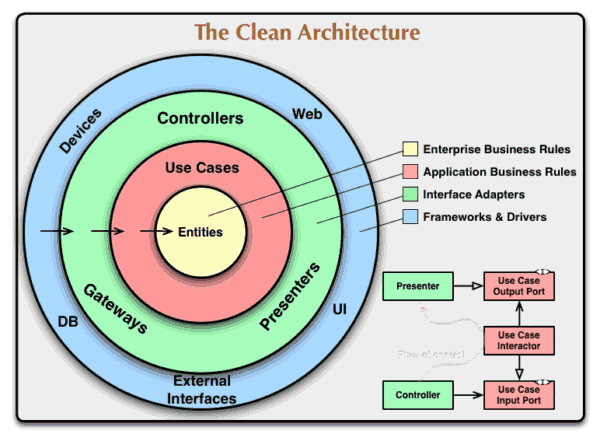

# clean架构 [clean架构]

外圈的层次可以依赖内层，反之不可以；内圈核心的实体代表业务，不可以依赖其所处的技术环境。

注：如果内层调用外部接口，需要加一层防腐层（ACL），ACL属于内层自己，不算依赖外层

这是著名软件大师Bob大叔提出的一种架构，也是当前各种语言开发架构。干净架构提出了一种单向依赖关系，从而在逻辑上形成一种向上的抽象系统。

这种干净的架构图如下：

​

## 依赖规则Dependency Rule

上图中同心圆代表各种不同领域的软件。一般来说，越深入代表你的软件层次越高。外圆是战术实现机制，内圆的是战略核心策略。

使此体系架构能够工作的关键是**依赖规则**。这条规则规定源代码只能向内依赖，在最里面的部分对外面一点都不知道，也就是内部不依赖外部，而外部依赖内部。这种依赖包含代码名称、类的函数、变量或任何其他命名软件实体。

同样，在外面圈中使用的数据格式不应被内圈中使用，特别是如果这些数据格式是由外面一圈的框架生成的。我们不希望任何外圆的东西会影响内圈层。

## 实体Entities

实体封装的是企业业务规则，一个实体能是一个带有方法的对象，或者是一系列数据结构和函数，只要这个实体能够被不同的应用程序使用即可。

如果你没有编写企业软件，只是编写简单的应用程序，这些实体就是应用的业务对象。它们封装着最普通的高级别业务规则，你不能希望这些实体对象被一个页面的分页导航功能改变，也不能被安全机制改变。操作实现层面的任何改变不能影响实体层，只有业务需求改变了才可以改变实体。

## 用例UseCases

在这个层的软件包含应用指定的业务规则，它封装和实现系统的所有用例，这些用例会混合各种来自实体的各种数据流程，并且指导这些实体使用企业规则来完成用例的功能目标。

我们并不期望改变这层会影响实体层，我们也不期望这层被更外部如数据库、UI、普通框架影响，这层也是因为关注而外部分离的。

我们期望应用层面的技术操作都不能影响用例层，如果需求中用例发生改变，这个层的代码才会发生改变。

## 接口适配器InterfaceAdapters

这一层的软件基本都是一些适配器，主要用于将用例和实体中的数据转换为外部系统如数据库或Web使用的数据。在这个层次，可以包含一些GUI的MVC架构，表现视图与控制器都属于这个层。模型Model是从控制器传递到用例或从用例传递到视图的数据结构。

通常在这个层数据被转换，从用例和实体使用的数据格式转换到持久层框架使用的数据，主要是为了存储到数据库中。这个圈层的代码是一点和数据库没有任何关系，如果数据库是一个SQL数据库， 这个层限制使用SQL语句以及任何和数据库打交道的事情。

## 框架和驱动

最外面一圈通常是由一些框架和工具组成，如数据库Database,Web框架等。通常你不必在这个层写太多代码，而是写些胶水性质的代码与内层进行粘结通讯。这个层是细节所在，Web技术是细节，数据库是细节，我们将这些实现细节放在外面以免它们对我们的业务规则造成影响伤害。

## 只有四个圈层吗？

这个圆圈图是示意性的。您可能会发现您需要的不仅仅是这四个。也没有规定说你必须始终只有这四个。然而，依赖规则始终适用。源代码的依赖关系总是由外向内。当你越向内时，抽象水平越高。而最外面的一圈是低层次的具体细节。当你越向内时软件变得越为抽象，封装了更高层次的策略。

## 跨边界流

在图的右下方是我们如何越过圆边界的例子。它显示控制器和界面之间是如何和用例进行通信的。注意控制流程，它开始于控制器，通过用例，然后在界面处执行。还要注意源代码的依赖关系，它们中的每一个点都是指向内部用例。我们通常使用依赖注入来实现这种依赖。

那么数据如何跨层流动呢？

通常跨层的数据是简单的数据结构。如果你喜欢你可以使用基本结构或简单的数据传输对象DTO，或函数可以调用数据参数，或者你可以打包到哈希表中，或为它建构一个对象。最重要是跨层传递是孤立的、简单的数据结构。

我们不想让这个数据结构是一个实体或数据库记录，因为我们不希望它们有任何的依赖关系，这会违反了依赖规则。例如，许多数据库框架在查询响应中返回一个方便的数据格式，我们可能会要求对这个记录重构，因为我们不想要跨层向内传递数据库记录。这就违反了依赖规则，它会迫使内圈要知道关于外圈的东西。所以当我们跨层传递数据，它总是以对内圈最方便的形式。

## 总结

符合这些简单的规则将会节省您大量的头痛开发。通过将软件分离到各种层，并符合依赖规则，这样您创建一个系统本质上是可测试的，这就意味着很多好处。

这种软件架构产生的系统特点是：

1.  独立的框架：这样的架构并不依赖与应用软件的具体库包，这样可以将框架作为工具，而不必将你的系统都胡乱混合在一起；
2.  可测试： 业务规则能够在没有UI和数据库 或Web服务器的情况下被测试；
3.  UI的独立性.：UI改变变得容易，不必改变系统的其余部分，一个Web UI能被一个控制台或专门的图形UI替代, 这些读不必更改业务核心规则；
4.  数据库的独立性：你能够在Oracle或SQL Server Mongo, BigTable, CouchDB,或之间切换，你的业务规则不会和数据库绑定；
5.  独立的外部代理：其实你的业务规则可以对其外面的技术世界毫无所知，比如是否使用了MVC或DCI都可以不关心；
