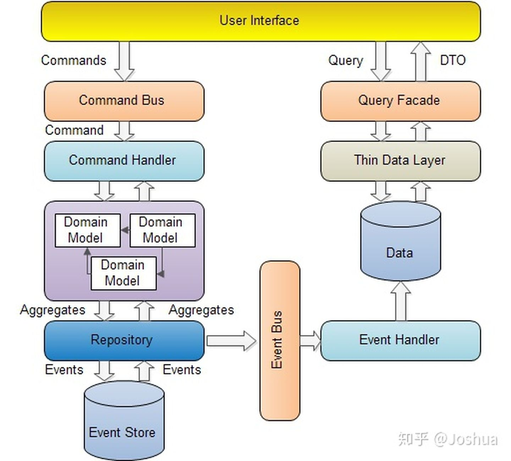

# CQRS

DDD作为一种系统分析的方法论，最大的问题是如何在项目中实践。而在实践过程中必然会面临许多的问题，「模式」是系统架构领域中一种常见的手段，能够帮助开发人员与架构师在遭遇某种较为棘手，或是陌生的问题时，参考已有的成熟经验与解决方案，从而优雅的解决自己项目中的问题。

从本期开始，我会开始介绍 DDD中一些常见的模式，包括这些模式的背景，作用，优缺点，以及在使用过程中需要注意的地方。而本次的主角就是CQRS，中文名为命令查询职责分离。

## 为何要使用？

毋庸置疑「领域」在 DDD 中占据了核心的地位，DDD通过领域对象之间的交互实现业务逻辑与流程，并通过分层的方式将业务逻辑剥离出来，单独进行维护，从而控制业务本身的复杂度。

但是作为一个业务系统，「查询」的相关功能也是不可或缺的。在实现各式各样的查询功能时，往往会发现很难用领域模型来实现。假设在用户需要一个订单相关信息的查询功能，展现的是查询结果的列表。列表中的数据来自于「订单」，「商品」，「品类」，「送货地址」等多个领域对象中的某几个字段。这样的场景如果还是通过领域对象来封装就显的很麻烦，其次与领域知识也没有太紧密的关系。

此时 CQRS 作为一种模式可以很好的解决以上的问题，那么具体什么是 CQRS呢？又如何实现呢？

## 什么是 CQRS？

让我们先看一下 CQRS 的架构图:

从图上可以看到，当 command系统完成数据更新的操作后，会通过「领域事件」的方式通知 query 系统。query系统在接受到事件之后更新自己的数据源。所有的查询操作都通过 query系统暴露的接口完成。

从架构图上来看，CQRS的实现似乎并不难，许多开发者觉得无非是「增删改」一套系统一个数据库，「查询」一个系统一个数据库而已，有点类似「读写分离」，并没有什么特别的地方。但是真正要使用 CQRS 是有许多问题与细节要解决的。

## CQRS 带来的问题

### 事务

其实仔细的思考一下，你应该很快会发现 CQRS 需要面临的一个最大的问题:事务。在原本单一进程，单一数据源的系统中，依靠关系型数据库的事务特性能够很好的保证数据的完整性。但是在CQRS 中这一切都发生了变化。

当 command 端完成数据更新后，需要通过事件的形式通知 query端系统，这就存在着一定的时间差，如果你的业务对于数据完整的实时性非常高，那么可能CQRS 不一定适合你。

其次一个 command 触发的事件在 query端可能需要更新数个数据模型，而这也是有可能失败的。一旦更新失败那么数据就会长时间的处于不一致状态，需要外部的介入。这也是在使用CQRS 之前就需要考虑的。

从事务的角度来看CQRS，你需要面对的是问题从根本来说是个最终一致性的问题，所以如果你的团队在这块没有太多经验的话，那么需要提前学习并积累一定的经验。

### 基础设施与技术能力的挑战

CQRS的另一个问题是没有一个成熟易用的框架，Axon 可能算一个，但是 Axon本身是一个重量级且依赖性较高的框架。为了 CQRS 而引入 Axon有点舍本逐末的意思，因此大部分时间你不得不自己动手实现 CQRS。

一个成熟可靠的 CQRS系统对于基础设施有一定的要求，例如为了实现领域事件，一个可靠的消息中间件是不可或缺的。不然频繁丢失事件造成数据不一致的情况会让运维人员焦头烂额。之前提到的分布式事务与最终一致性的问题也需要专门的中间件或是框架的支持，这些不仅仅提升了对基础设施的要求，对于开发，运维也提出了更高的要求。

开发过程中需要加入对于事件的支持，系统设计的思路也同样需要一定的转变。在定义command 时需要设计对应的事件，设计事件的类型与数据结构，所以在这方面也对开发团队提出了新的要求。

因此在开始使用 CQRS之前不妨对自己团队的基础设施以及开发能力做一次全面的评估，尽早的识别出短板，并进行有目的的改进与强化，避免在开发过程中别某些问题卡住。

### 查询模型的设计

虽然 CQRS为我们分离了领域模型和服务于查询功能的数据模型，但这意味着我们需要设计另一套针对查询功能的数据模型。一般比较简单的做法是按照查询功能所需的数据进行设计，即针对每一个查询接口设计一个数据视图，当收到领域事件时更新有关联的数据视图。

但是这种简单做法带来的问题就是当查询接口越来越多时就会难以管理，仍然需要按照DDD 中划分 BC 的思路将属于一个 BC的查询集中管理作为整个查询系统的一个上下文，或是干脆独立出来做一个微服务。所以即使引入了CQRS，我们依然需要使用领域驱动的思路设计查询接口。

### 与 Event Sourcing 的关系

[Event Sourcing](https://link.zhihu.com/?target=https%3A//martinfowler.com/eaaDev/EventSourcing.html) 是由 Martin Fowler-提出的一个企业架构模式。简单的来说它会将系统所有产生业务行为以append-only的形式存储起来，通俗的说就是「流水账」。它的优点是可以「回溯」，因为记录了每一次数据变动的信息，所以当出现bug或是需要排查业务数据问题时就非常的方便。但是它的缺点同样明显，就是当需要查询最新状态的数据时需要做大量的计算，例如账户余额这样的数据。

许多讨论 CQRS 的文章中都会谈及 EventSourcing，认为这是两个需要配套使用的模式。但是从我实际使用的角度而言，这两个模式其实并没有什么必然的联系。Command端只需要关心领域模型的更新成功与否，同时使用 Aggregate这样的领域对象保证数据的完整性，而 Query端关心的是接收到领域事件后更新对应的数据模型，对于「回溯」这样的特性并没有强制的要求。的确Event Sourcing 可以帮助我们构建更为稳定，功能更为强大的 CQRS 系统，但是Event Sourcing 本身的复杂性可能比 CQRS有过之而无不及，所以在没有特殊需要的情况下，CQRS 与 Event Sourcing不需要绑在一起。

### 不同类型的数据存储引擎

这一点其实不能算是问题，更多的是一项挑战或是优势。由于分离了领域模型与数据模型，因此意味着我们可以在Query 端使用与查询需求更为贴近的数据存储引擎，例如 NoSQL，ElasticSearch等。

比较常见的情况是 Command端依然使用传统的关系型数据库，但是对于那些比较特殊的查询则使用专门的数据存储。例如在一些基于关键字进行全文检索的场景，如果依然使用关系型数据库，通过like 这样的 SQL 查询，很容易遇到性能问题。此时则可以将数据存储换为ElasticSearch这样的检索引擎，通过反向索引提取关键字查询，在性能方面会得到非常明显的提升。在另一些需要非结构化数据查询的场景，Json是一种不错的存储格式，虽然现在比较新版本的关系型数据库都提供了 Json格式的存储与查询，但是 MongoDB 这样的文档型数据库显得更为简单高效，此时Query 端灵活的优势就更为明显。

## 小结

CQRS 在 DDD中是一种常常被提及的模式，它的用途在于将领域模型与查询功能进行分离，让一些复杂的查询摆脱领域模型的限制，以更为简单的DTO形式展现查询结果。同时分离了不同的数据存储结构，让开发者按照查询的功能与要求更加自由的选择数据存储引擎。

同样的，CQRS在带来架构自由与便利的同时也不可避免的引入了额外的复杂性与技能要求，例如对于分布式事务，消息中间件的管理，数据模型的设计等等，所以在引入CQRS之前需要对团队能力与现有架构做仔细的分析，对短板进行必要的提升。如果现有系统逻辑较为简单，只是一些CRUD，那么并不建议使用CQRS。但是如果你的业务系统已经非常庞大，业务流程庞杂，逻辑繁琐，那么不妨尝试使用CQRS 将 Command 与 Query进行拆分，将领域模型与数据模型的边界划分的更清晰些。
