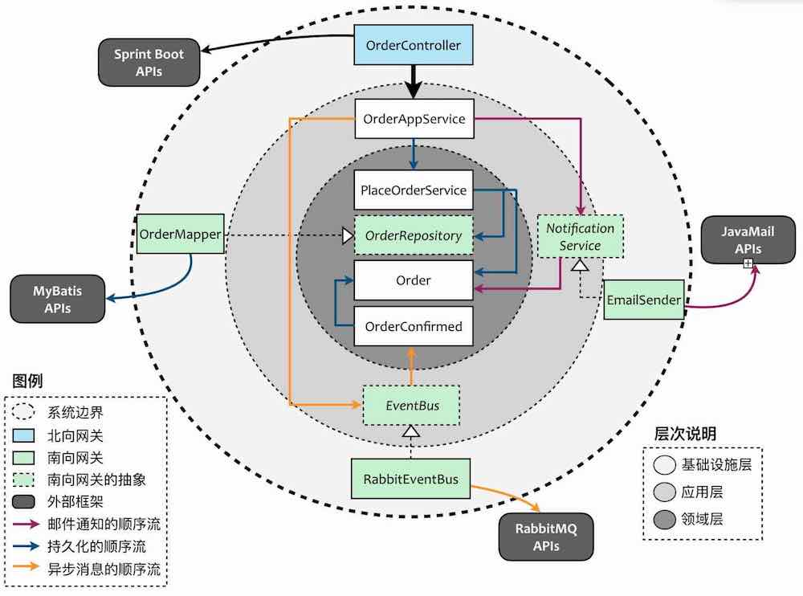
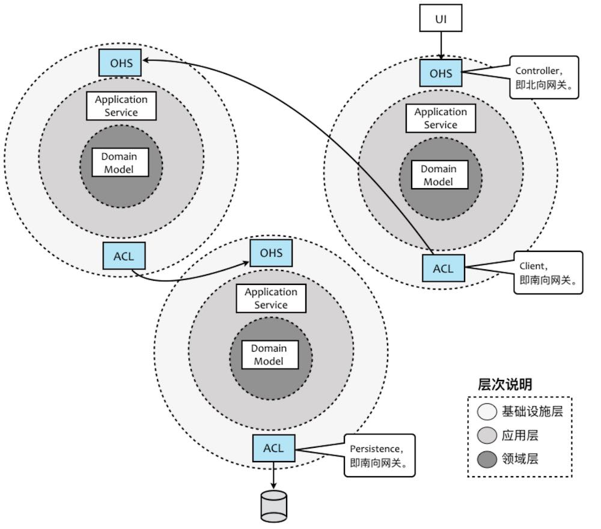
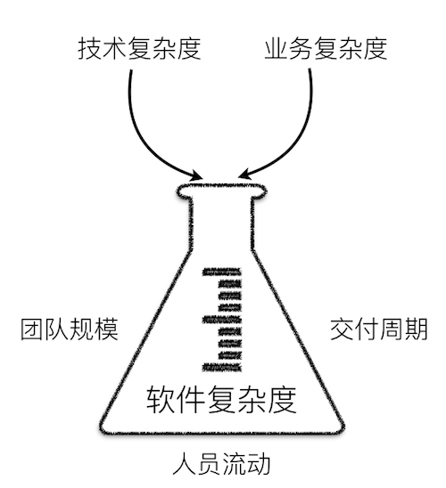

# 领域驱动

[doc-领域驱动](id:doc-cst-arch-ddd)

## 最佳结果

1.  零共享架构：各BC界限上下文服务独立、数据库独立、互相调用有ACL通过IOC注入

## 什么是领域驱动设计

DDD的是一个历史架构方法的汇总方法论，领域驱动设计的提出，是 **设计观念的转变，蕴含了全新的设计思想、设计原则与设计过程** 。

领域驱动设计当然不是架构方法，也并非设计模式。准确地说，它其实是“一种思维方式，也是一组优先任务，它旨在加速那些必须处理复杂领域的软件项目的开发”。

DDD并非一种模式语言，它是专注于交付的一种协作思想体系，其中 **通信起核心作用** ，而要高效通信，就需要使用公共语言。

DDD会将侧重点放在以下几个方面：

-   核心领域
-   协作
-   与领域专家探讨
-   实验研究以生成更有用的模型
-   对各种上下文的理解

领域驱动设计是一套方法论，它建立了 **以领域为核心驱动力** 的设计体系，因而具有一定的开放性

-   使用用例（Use Case）、测试驱动开发（TDD）、用户故事（User Story）帮助我们对领域建立模型；
-   我们可以引入整洁架构思想以及六边形架构，以帮助我们建立一个层次分明、结构清晰的系统架构；
-   我们可以引入函数式编程思想，利用纯函数与抽象代数结构的不变性以及函数的组合性来表达领域模型。

## 需求与复杂度

需求分为 **业务需求** 与 **质量属性** 需求，因而需求引起的复杂度可以分为两个方面：技术复杂度与业务复杂度。

-   技术复杂度来自需求的质量属性，诸如安全、高性能、高并发、高可用性等需求，为软件设计带来了极大的挑战。
-   业务复杂度对应了客户的业务需求，因而这种复杂度往往会随着需求规模的增大而增加。

确定业务逻辑与技术实现的边界，从而隔离各自的复杂度。

## 领域驱动设计过程

领域驱动设计强调领域模型的重要性，并通过模型驱动设计来保障领域模型与程序设计的一致。从业务需求中提炼出 **统一语言（Ubiquitous Language）** ，再基于统一语言建立领域模型；这个领域模型会指导着程序设计以及编码实现；最后，又通过重构来发现隐式概念，并运用设计模式改进设计与开发质量。

这个过程如下图所示：

<span class="spurious-link" target="assets/01-01.png">*assets/01-01.png*</span>

## 战略设计阶段

领域驱动设计的战略设计阶段是从两个方面来考量的：

-   问题域方面：针对问题域，引入 **限界上下文（Bounded Context）** 和 **上下文映射（Context Map）** 对问题域进行合理的分解，识别出 **核心领域（Core Domain）** 与 **子领域（SubDomain）** ，并确定领域的边界以及它们之间的关系，维持模型的完整性。
-   架构方面：通过 **分层架构** 来隔离关注点，尤其是将领域实现独立出来，可以更利于领域模型的单一性与稳定性；引入**六边形架构**清晰地表达领域与技术基础设施的边界；CQRS模式则分离了查询场景和命令场景，针对不同场景选择使用同步或异步操作，提高架构的低延迟性与高并发能力。

Eric Evans提出战略设计的初衷是要 **保持模型的完整性** 。限界上下文的边界可以保护上下文内部和其他上下文之间的领域概念互不冲突。然而，如果我们将领域驱动设计的战略设计模式引入到架构过程中，就会发现限界上下文不仅限于对领域模型的控制，而在于分离关注点之后，使得整个上下文可以成为独立部署的设计单元，这就是“微服务”的概念，上下文映射的诸多模式则对应了微服务之间的协作。因此在战略设计阶段，微服务扩展了领域驱动设计的内容，反过来领域驱动设计又能够保证良好的微服务设计。

一旦确立了限界上下文的边界，尤其是作为物理边界，则分层架构就不再针对整个软件系统，而仅仅针对粒度更小的限界上下文。此时，限界上下文定义了技术实现的边界，对当前上下文的领域与技术实现进行了封装，我们只需要关心对外暴露的接口与集成方式，形成了在服务层次的设计单元重用。

## 战术设计阶段

整个软件系统被分解为多个限界上下文（或领域）后，我们就可以分而治之，对每个限界上下文进行战术设计。领域驱动设计并不牵涉到技术层面的实现细节，在战术层面，它主要应对的是领域的复杂性。领域驱动设计用以表示模型的主要要素包括：

-   应用服务（Application Service）
    -   应用服务只是一个domain的门面（Facade）
    -   与横切关注点协作的服务应被定义为应用服务
    -   不包含领域逻辑的业务服务应被定义为应用服务
    -   这里的应用服务类似于应用的中service层，组合领域功能或做ACL防腐层
    -   controler层类似于北向网关，微服务有gateway则没有contoller的概念
-   领域服务（Domain Service）
-   领域事件（Domain Event）
-   资源库（Repository）
    -   类似于分层上的DAL数据访问层，对数据层做的封装
    -   按clean架构Repository是domain对数据层做的南向网关
    -   按六边型架构Repository是domaiin对数据层做的ACL防腐层
-   工厂（Factory）
-   聚合（Aggregate）
-   值对象（Value Object）
-   实体（Entity）

## 演进的领域驱动设计过程

下图展示了一个演进的领域驱动设计过程：

<span class="spurious-link"
target="assets/20190428175125760222-20211106233218930.jpg">*assets/20190428175125760222-20211106233218930.jpg*</span>

## 领域场景分析的6W模型

在软件构造过程中，我们必须正确地理解领域。一种生动的方式是通过“场景”来展现领域逻辑。领域专家或业务分析师从领域中提炼出“场景”，就好像是从抽象的三维球体中，切割出具体可见的一片。然后以这一片场景为舞台，上演各种角色之间的悲欢离合。每个角色的行为皆在业务流程的指引下展开活动，并受到业务规则的约束。当我们在描述场景时，就好像在讲故事，又好似在拍电影。

组成场景的要素常常被称之为\*6W模型\*，即描写场景的过程必须包含\*W\*ho，\*W\*hat，\*W\*hy，\*W\*here，\*W\*hen与ho\*W\*这六个要素。6W模型如下图所示：

<span class="spurious-link" target="assets/6w.png">*assets/6w.png*</span>

## 验证限界上下文的原则

正交性要求：“如果两个或更多事物中的一个发生变化，不会影响其他事物，这些事物就是正交的。”

奥卡姆剃刀原理，即“切勿浪费较多东西去做用较少的东西同样可以做好的事情”，更文雅的说法就是“如无必要，勿增实体”。遵循该原则，意味着当我们没有寻找到必须切分限界上下文的必要证据时，就不要增加新的限界上下文。倘若觉得功能的边界不好把握分寸，可以考虑将这些模棱两可的功能放在同一个限界上下文中。待到该限界上下文变得越来越庞大，以至于一个领域特性团队无法完成交付目标；又或者违背了限界上下文的自治原则，或者质量属性要求它的边界需要再次切分时，再对该限界上下文进行分解，增加新的限界上下文。这才是设计的实证主义态度。

## 限界上下文的边界

### 逻辑边界

\*\*采用逻辑边界划分限界上下文的系统架构是单块（Monolithic）架构\*\*，所有的限界上下文都部署在同一个进程中，因此不能针对某一个限界上下文进行水平伸缩。需要对限界上下文的实现进行替换或升级时，会影响到整个系统。即使我们守住了逻辑边界，这种耦合仍然存在，导致各个限界上下文的开发互相影响，团队之间的协调成本也随之而增加。

### 物理边界

逻辑边界的坏，正是物理边界的好；反过来，物理边界的坏，同样是逻辑边界的好。\*\*当我们将限界上下文的边界定义为物理边界时，每个限界上下文就变成了一个个细粒度的微服务。\*\*

倘若我们将限界上下文的边界视为物理边界，则可以保证边界内的服务、基础设施乃至于存储资源、中间件等其他外部资源的完整性，最终形成自治的服务。限界上下文之间仅仅通过限定的方式以限定的通信协议和数据格式进行通信，除此之外，彼此没有任何共享，这种架构被称之为\*\*零共享架构\*\*。这种架构的表现形式为：每个限界上下文都有自己的代码库、数据存储以及开发团队，每个限界上下文选择的技术栈和语言平台也可以不同。

### 数据库共享

在逻辑边界和物理边界中间，还存在一种折中的手段。在考虑限界上下文划分时，分开考虑代码模型与数据库模型，就可能出现在代码上分离，而在数据库层面却存在数据共享的形式，即多个限界上下文共享同一个数据库。

因为没有分库，在数据库层面就可以更好地保证事务的ACID。这或许是该方案最有说服力的证据，但也可以视为是对“一致性”约束的妥协。

数据库共享的问题在于数据库的变化方向与业务的变化方向会不一致。这种不一致性体现在两个方面：

-   耦合：虽然业务上限界上下文之间是解耦的，但是在数据库层面依然存在强耦合关系
-   水平伸缩：部署在应用服务器的应用服务可以根据限界上下文的边界单独进行水平伸缩，但是在数据库层面却无法做到

我们可以将“数据库共享”模式视为一种过渡方案，不要在一开始设计微服务的时候，就直接将数据彻底分开，而是采用演进式的设计。

倘若架构被设计为数据库共享，且两个服务需要操作同一张数据表（这张表被称之为“共享表”），则传递了一个信号，即我们的设计可能出现了错误：

-   遗漏了一个限界上下文，共享表对应的是一个被重用的服务：买家在查询商品时，商品服务会查询价格表中的当前价格，而在提交订单时，订单服务也会查询价格表中的价格，计算当前的订单总额；共享价格数据的原因是我们遗漏了价格上下文，通过引入价格服务就可以解除这种不必要的数据共享。
-   职责分配出现了问题，操作共享表的职责应该分配给已有的服务：舆情服务与危机服务都需要从邮件模板表中获取模板数据，然后再调用邮件服务组合模板的内容发送邮件；实际上从邮件模板表获取模板数据的职责应该分配给已有的邮件服务。
-   共享表对应两个限界上下文的不同概念：仓储上下文与订单上下文都需要访问共享的产品表，但实际上这两个上下文需要的产品信息是完全不同的，应该按照限界上下文的边界分开为产品建表。

为什么会出现这三种错误的设计？\*\*根本原因还是在于我们没有通过业务建模，而是在数据库中隐式地进行建模\*\*，因而在代码中没有体现正确的领域模型，从而导致了数据库层面的耦合或共享。

## 领域驱动设计中的架构要素

Clean Architecture与DDD的分层架构整合



在这个架构图中，基础设施层处于最外部，然后是应用层，最核心的是领域层。基础设施中的模块，我都称之为gateway。向内调用北向网关，向外调用南向网关。



Context Map中有两个常用的模式OHS（开放主机服务）与ACL（防腐层）。显然，OHS就对应前面提到的北向网关，ACL就对应着南向网关。

<span class="spurious-link" target="assets/03.jpg">*assets/03.jpg*</span>

## 领域驱动设计对软件复杂度的应对



随着业务需求的增加与变化，以及对质量属性的高标准要求，自然也引起了软件系统规模的增大与结构的繁杂，至于变化，则是软件开发绕不开的话题。因此，当我们面对一个相对复杂的软件系统时，通常面临的问题在于：

-   问题域过于庞大而复杂，使得从问题域中寻求解决方案的挑战增加。该问题与软件系统的 **规模** 有关。
-   开发人员将业务逻辑的复杂度与技术实现的复杂度混淆在一起。该问题与软件系统的 **结构** 有关。
-   随着需求的增长和变化，无法控制业务复杂度和技术复杂度。该问题与软件系统的 **变化** 有关

### 隔离业务复杂度与技术复杂度

首要任务就是确定业务逻辑与技术实现的边界，从而隔离各自的复杂度。

理想状态下，我们应该保证业务规则与技术实现是正交的。

领域驱动设计通过 分层架构 与 六边形架构 确保业务逻辑与技术实现的隔离。

分层架构遵循了“关注点分离”原则，将属于业务逻辑的关注点放到领域层（Domain Layer）中，而将支撑业务逻辑的技术实现放到基础设施层（Infrastructure Layer）中。同时，领域驱动设计又颇具创见的引入了应用层（Application Layer）。应用层扮演了双重角色。一方面它作为业务逻辑的外观（Facade），暴露了能够体现业务用例的应用服务接口；另一方面它又是业务逻辑与技术实现的粘合剂，实现二者之间的协作。

下图展现的就是一个典型的领域驱动设计分层架构。蓝色区域的内容与业务逻辑有关，灰色区域的内容与技术实现有关，二者泾渭分明，然后汇合在应用层。应用层确定了业务逻辑与技术实现的边界，通过直接依赖或者依赖注入（DI，Dependency Injection）的方式将二者结合起来：

<span class="spurious-link" target="assets/02-20211107232257788.jpg">*assets/02-20211107232257788.jpg*</span>

由Cockburn提出的六边形架构则以“内外分离”的方式，更加清晰地勾勒出业务逻辑与技术实现的边界，且将业务逻辑放在了架构的核心位置。这种架构模式改变了我们观察系统架构的视角：

<span class="spurious-link" target="assets/03-20211107232232428.jpg">*assets/03-20211107232232428.jpg*</span>

体现业务逻辑的应用层与领域层处于六边形架构的内核，并通过内部的六边形边界与基础设施的模块隔离开。当我们在进行软件开发时，只要恪守架构上的六边形边界，就不会让技术实现的复杂度污染到业务逻辑，保证了领域的整洁。边界还隔离了变化产生的影响。如果我们在领域层或应用层抽象了技术实现的接口，再通过依赖注入将控制的方向倒转，业务内核就会变得更加的稳定，不会因为技术选型或其他决策的变化而导致领域代码的修改。

## 领域模型的构建

程序是由数据加代码组成，代码一部分是业务逻辑，一部分是来操作加工数据的。

-   面向过程编程数据和代码是分离的
-   面向对象编程OOP数据和数据和相关行为是封装成一个对象的

面向对象操作 cart.clear() Cart.clear(cart)

``` java
Class cls = Class.forName("MethodTest");
Method meth = cls.getMethod("add", partypes);
MethodTest methobj = new MethodTest();
Object arglist[] = new Object[2];
arglist[0] = new Integer(37);
arglist[1] = new Integer(47);
Object retobj = meth.invoke(obj, arglist);
```

### 贫血模型

贫血模型是指领域对象里只有get和set方法（POJO），所有的业务逻辑都不包含在内而是放在Business
Logic层。

“行为”（逻辑、过程）和“状态”（数据，对应到语言就是对象成员变量）分离到不同的对象

我们常见的N层结构中的Logic/Service/Manager层

Manager层的由来

Service层容易代码臃肿，很容易出现大事务，事务嵌套，导致问题很多，而且极难排查

增加了 Manager 层，它与 Service 层的关系是：Manager 层提供原子的服务接口，Service 层负责依据业务逻辑来编排原子接口。

### 充血模型

数据和对应的业务逻辑被封装到同一个类中。因此，这充血模型满足面向对象的封装特性，是典型的面向对象编程风格。

传统的设计一般是：

-   类：User+UserManager；
-   保存用户调用：userManager.save(User user)。

充血的设计则可能会是：

-   类：User；
-   保存用户调用：user.save()；
-   User有一个行为是：保存它自己。

### 领域模型代码结构

面向对象的充血模式实现方案：

-   将常规Service中的代码逻辑，使用OOP的思想拆分出对象的行为逻辑封装到对象中

-   将常规Service中的代码逻辑，拆分数据查询逻辑封装到Repository资源库

-   将外部服务调用抽象接口，实现拆分到南向网关

-   将消息等抽象接口，实现拆分到基础服务

-   常规Service拆分后的代码逻辑为领域对象交互、南向网关调用、基础服务调用等

-   OrderService 领域服务，调用不同领域实现业务

    -   Order 领域对象，包含领域的业务逻辑
        -   Order的值对象
        -   OrderRepository 资源库
            -   OrderDao 数据访问 也可以是OrderMapper
            -   OrderDO 数据库对象 orm映射
        -   OrderDetailRepository 资源库

-   PayService 领域服务

-   CartService 领域服务

说明：

1.  领域模型不适用复杂查询，列表查询还是直接查库，不通过domain
2.  因为领域对象做为聚合，不能直接关联创建子对象，所以资源库要集成在领域对象中
