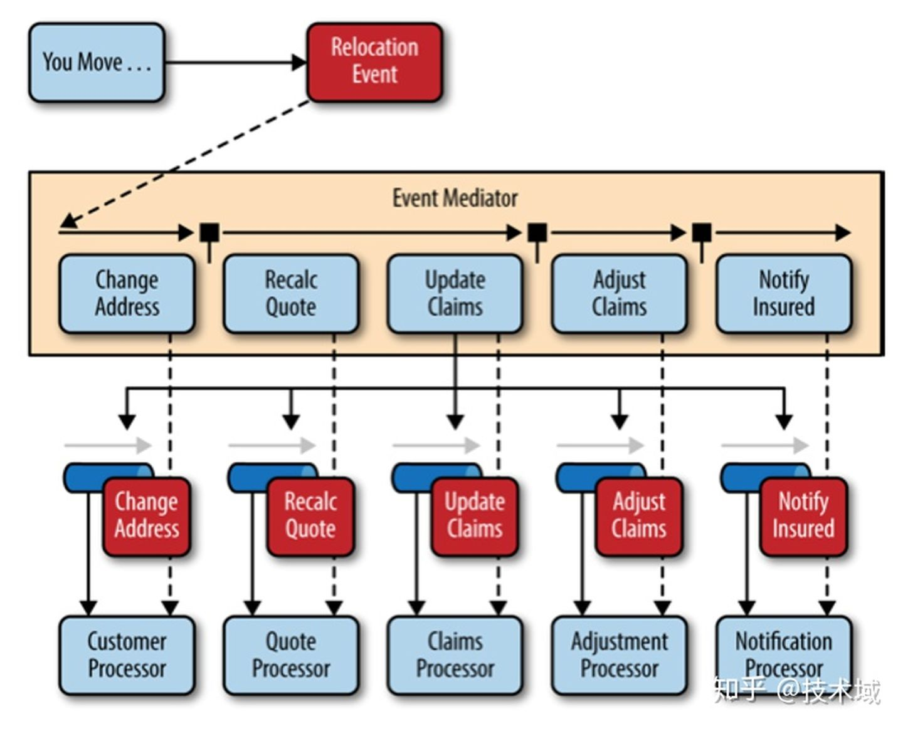

# 事件驱动架构 

事件驱动架构模式是一种主流的异步分发事件架构模式，常用于设计高度可拓展的应用。当然了，它有很高的适应性，使得它在小型应用、大型应用、复杂应用中都能表现得很好。事件驱动架构模式由高度解耦、单一目的的事件处理组件构成，这些组件负责异步接收和处理事件。

事件驱动架构模式包含了两种主要的拓扑结构：中介(mediator)拓扑结构和代理(broker)拓扑结构。

mediator拓扑结构通常在你需要在事件内使用一个核心中介分配、协调多个步骤间的关系、执行顺序时使用；而代理拓扑结构则在你想要不通过一个核心中介将多个事件串联在一起时使用。由于这两种结构在结构特征和实现策略上有很大的差别，所以如果你想要在你的应用中使用它们的话，一定要深入理解两者的技术实现细节，从而为你的实际使用场景选择最合理的结构。

**中介 (Mediator)拓扑结构**

中介拓扑结构适合用于拥有多个步骤，并需要在处理事件时能通过某种程度的协调将事件分层的场景，举例来说吧：假设你现在需要进行股票交易，那你首先需要证券所批准你进行交易，然后检查进行这次交易是否违反了股票交易的某种规定，检查完成后将它交给一个经纪人，计算佣金，最后与经纪人确认交易。以上所有步骤都需要通过中介进行某种程度的分配和协调，以决定各个步骤的执行顺序，判断哪些步骤可以并行，哪些步骤可以串行。

在中介拓扑结构中主要有四种组件：事件队列（event queue）, 事件中介,事件通道（event channel）, 和 事件处理器（event processor）。当事件流需要被处理，客户端将一个事件发送到某个事件队列中，由消息队列将其运输给事件中介进行处理和分发。事件中介接收到该消息后，并通过将额外的异步事件发送给事件通道，让事件通道执行该异步事件中的每一个步骤，使得事件中介能够对事件进行分配、协调。同时，又因为事件处理器是事件通道的监听器，所以事件通道对异步事件的处理会触发事件处理器的监听事件，使事件处理器能够接收来自事件中介的事件，执行事件中具体的业务逻辑，从而完成对传入事件的处理。事件驱动架构模式中的中介拓扑模式结构大体如下图：

在事件驱动架构中拥有十几个，甚至几百个事件队列是很常见的情况，该模式并没有对事件队列的实现有明确的要求，这就意味着事件队列可以是消息队列，Web服务端，或者其它类似的东西。

在事件驱动架构模式中主要有两种事件：初始事件和待处理事件。初始事件是中介所接收到的最原始的事件，没有经过其他组件的处理；而待处理事件是由事件中介生成，由事件处理器接收的组件，不能把待处理
事件看作初始事件经过处理后得到的事件，两者是完全不同的概念。

事件中介负责分配、协调初始事件中的各个待执行步骤，事件中介需要为每一个初始事件中的步骤发送一个特定的待处理事件到事件通道中，触发事件处理器接收和处理该待处理事件。这里需要注意的是：事件、中介没有真正参与到对初始事件必须处理的业务逻辑的实现之中；相反，事件中介只是知道初始事件中有哪些步骤需要被处理。

事件中介通过事件通道将与初始事件每一个执行步骤相关联的特定待处理事件传递给事件处理器。尽管我们通常在待处理事件能被多个事件处理器处理时才会在中介拓扑结构中使用消息主题，但事件通道仍可以是消息队列或消息主题。（但需要注意的是，尽管在使用消息主题时待处理事件能被多个事件处理器处理，但由于接收到的待处理事件各异，所以对其处理的操作也各不相同）

为了能顺利处理待处理事件，事件处理器组件中包含了应用的业务逻辑。此外，事件处理器作为事件驱动架构中的组件，不依赖于其他组件，独立运作，高度解耦，在应用或系统中完成特定的任务。当事件处理器需要处理的事件从细粒度（例如：计算订单的营业税）变为粗粒度（例如：处理一项保险索赔事务），必须要注意的是：一般来说，每一个事件处理器组件都只完成一项唯一的业务工作，并且事件处理器在完成其特定的业务工作时不能依赖其他事件处理器。

虽然事件中介有许多方法可以实现，但作为一名架构⼯工程师，你应该了解所有实现⽅方式，以确保你能为你的实际需求选择了最合适的事件中介。

事件中介最简单、常见的实现就是使用开源框架，例如：Spring Integration，Apache Camel 或 Mule ESB。事件流在这些开源框架中通常用 Java或域特定语言（domain-specific language）。在调节过程和业务流程都很复杂的使用场景下，你可以使用业务流程执行语言（BPEL -business process execution language）结合类似开源框架 Apache ODE 的 BPEL引擎进行开发。BPEL 是一种基于 XML的服务编制编程语言，它为处理初始事件时需要描述的数据和步骤提供了描述。对每一个拥有复杂业务流程（包括与用户交互的执行步骤）的大型应用来说，你可以使用类似jBPM 的业务处理管理系统（business process manager）实现事件中介。

如果你需要使用中介拓扑结构，那么理解你的需求，并为其匹配恰当的事件中介实现是构建事件驱动架构过程中至关重要的一环。使用开源框架去解决非常复杂的业务处理、管理、调节事件，注定会失败，因为开源框架只是用BPM的方式解决了一些简单的事件分发逻辑，比起你的业务逻辑，其中的事件分发逻辑简直是九牛一毛。

为了解释清楚中介拓扑结构是怎么运作的，我假设你在某家保险公司买了保险，成为了受保人，然后你打算搬家。在这种情况下，初始事件就是重定位事件，或者其他类似的事件。与重定位事件相关的处理步骤就像下图展示的那样，处于事件中介之中。对每一个初始事件的传入，事件中介都会创建一个待处理事件（例如：改变地址，重新计算保险报价，等等……），并将它发送给事件通道，等待发出响应的事件处理器处理待处理事件（例如：客户改变地址的操作流程、报价计算流程，等等……）。直到初始事件中的每一个需要处理的步骤完成了，这项处理才会继续（例如：把所有手续都完成之后，保险公司才会帮你改变地址）。事件中介中，重新报价和更新理赔步骤上面的直线表示这些步骤可以并行处理。

**代理 (Broker) 拓扑结构**

代理拓扑结构与中介拓扑结构不同之处在于：代理拓扑结构中没有核心的事件中介；相反，事件流在代理拓扑结构中通过一个轻量的消息代理（例如：ActiveMQ,HornetQ，等等……）将消息串联成链状，分发至事件处理器组件中进行处理。代理扑结构适用的使用场景大致上具有以下特征：你的事件处理流相对来说比较简单，而且你不想（不需要）使用核心的事件分配、调节机制以提高你处理事件的效率。

在代理拓扑结构中主要包括两种组件：代理和事件处理器。代理可被集中或相互关联在一起使用，此外，代理中还可以包含所有事件流中使用的事件通道。

存在于代理组件中的事件通道可以是消息队列，消息主题,或者是两者的组合。

代理拓扑结构大致如下图，如你所见，在这其中没有一个核心的事件中介组件控制和分发初始事件；相反，每一个事件处理器只负责处理一个事件，并向外发送一个事件，以标明其刚刚执行的动作。例如，假设存在一个事件处理器用于平衡证券交易，那么事件处理器可能会接受一个拆分股票的初始事件，为了处理这项初始事件，事件处理器则需要重新平衡股票的投资金额，而这个重新平衡的事件将由另一个事件处理器接收、处理。在这其中有一个细节需要注意：处理初始事件后，由事件处理器发出的事件不被其他事件处理器接收、处理的情况时常会发生，尤其是你在为应用添加功能和进行功能拓展时，这种情况更为常见。

为了阐明代理拓扑结构的运行机制，我会用一个与讲解中介拓扑结构时类似的例子（受保人旅行的例子）进行解释。因为在代理拓扑结构中没有核心事件中介接收初始事件，那么事件将由客户处理组件直接接收，改变客户的地址，并发出一个事件告知系统客户的地址被其进行了改变（例如：改变地址的事件）。在这个例子中：有两个事件处理器会与改变地址的事件产生关联：报价处理和索赔处理。报价事件处理器将根据受保人的新地址重新计算保险的金额，并发出事件告知系统该受保人的保险金额被其改变。而索赔事件处理器将接受到相同的改变地址事件，不同的是，它将更新保险的赔偿金额，并发出一个更新索赔金额事件告知系统该受保人的赔偿金额被其改变。当这些新的事件被其他事件处理器接收、处理，使事件链一环扣一环地交由系统处理，直到事件链上的所有事件都被处理完，初始事件的处理才算完成。

如上图所示，代理拓扑结构的设计思想就是将对事件流的处理转换为对事件链的业务功能处理，把代理拓扑结构看作是接力比赛是最好的理解方式：在一场4\*100的接力比赛中，每一位运动员都需要拿着一根接力棒跑100米，运动员跑完自己的100米后需要将接力棒传递给下一位运动员，直到最后一位运动员拿着接力棒跑过终点线，整场接力比赛才算结束。根据这样的逻辑我们还可以知道：在代理拓扑结构中，一旦某个事件处理器将事件传递给另一个事件处理器，那么这个事件处理器不会与该事件的后续处理产生任何联系。

**顾虑**

实现事件驱动架构模式相对于实现其他架构模式会更困难一些，因为它通过异步处理进行事件分发。当你需要在你的应用中使用这种架构模式，你必须处理各种由事件分发处理带来的问题，例如：远程操作功能的可用性，缺少权限，以及在代理或中介中处理事件失败时，用于处理这种情况的重连逻辑。如果你不能很好地解决这些问题，那你的应用一定会出现各种Bug，让开发团队痛苦不已。

在选择事件驱动架构时还有一点需要注意：在处理单个业务逻辑时，这种架构模式不能处理细粒度的事务。因为事件处理器都高度解耦、并且广泛分布，这使得在这些事件处理器中维持一个业务单元变得非常困难。因此，当你使用这种架构模式架构你的应用时，你必须不断地考虑哪些事件能单独被处理，哪些不能，并为此设计相应事件处理器的处理粒度。如果你发现你需要将一个业务单元切割成许多子单元，并一一匹配相应的事件处理器，那你就要为此进行代码设计；如果你发现你用多个不同的事件处理器处理的哪些业务其实是可以合并到一个业务事件之中的，那么这种模式可能并不适合你的应用，又或者是你的设计出了问题。

使用事件驱动架构模式最困难的地方就在于架构的创建、维护、以及对事件处理器的管理。通常每一个事件都拥有其指定的事件处理协议（例如：传递给事件处理器的数据类型、数据格式），这就使得设下标准的数据格式成为使用事件驱动架构模式中至关重要的一环（例如：XML，JSON，Java对象，等等……），并在架构创建之初就为这些数据格式授权，以便处理。

**模式分析**

下面是基于对常见的架构模式特征进行评价的标准，对事件驱动架构模式所作的实际分析，评价是以常见的架构模式的相似实现作为标准进行的。

**整体灵活性**

评价：高

分析：整体灵活性用于评价架构能否在不断改变的使用场景下快速响应，因为事件处理器组件使用目的单一、高度解耦、与其他事件处理器组件相互独立，不相关联，那么发生的改变对一个或多个事件处理器来说普遍都是独立的，使得对改变的反馈非常迅速，不需要依赖其他事件处理器的响应作出处理。

**易于部署**

评价：高

分析：总的来看，事件驱动架构模式由于其高度解耦的事件处理器组件的存在，对事件的部署相对来说比较容易，而使用代理拓扑结构比使用中介拓扑结构进行事件调度会更容易一些，主要是因为在中介拓扑结构中事件处理器与事件中介紧密地耦合在一起：事件处理器中发生改变后，事件中介也随之改变，如果我们需要
改变某个被处理的事件，那么我们需要同时调度事件处理器和事件中介。

**可测试性**

评价：低

分析：虽然在事件驱动架构模式中进行单元测试并不困难，但如果我们要进行单元测试，我们就需要某种特定的测试客户端或者是测试工具产生事件，为单元测试提供初始值。此外，由于事件驱动架构模式是异步进行事件分发的，其异步处理的特性也为单元测试带来了一定的困难。

**Performance 性能**

评价：高

分析：对消息传递的架构可能会让设计出来的事件驱动架构的表现不如我们的期望，但通常来说，该模式都能通过其异步处理的特性展示优秀的性能表现；换句话来说，高度解耦，异步并行操作大大减少了传递消息
过程中带来的时间开销。

**伸缩性**

评价：高

分析：事件驱动架构中的高度解耦、相互独立的事件处理器组件的存在，使得可拓展性成为该架构与生俱来的优点。架构的这些特定使得事件处理器能够进行细粒度的拓展，使得每一个事件处理器都能单独被拓展，
而不影响其他事件处理器。

**易于开发**

评价：低

分析：由于使用事件驱动架构进行开发需要考虑其异步处理机制、协议创建流程，并且开发者需要用代码为事件处理器和操作失败的代理提供优秀的错误控制环境，无疑使得用事件驱动架构进行开发会比使用其他架构进行开发要困难一些。

读完整篇文章，我相信大家对 mediator 与 broker这两个概念有一个大致的印象，但就两者的译文来看，中介和代理似乎没什么区别，尤其是了解proxy 的读者会更加困惑，这三者之间到底是什么关系？它们的概念是互通的吗？为了解决这种混淆，在此阐述三者间的区别：

假如现在我有一个事件/事件流需要被处理，那么使用 mediator、broker、proxy处理事件的区别在哪里呢？ 如果我们使用mediator，那就意味着我将把事件流交给 mediator，mediator会帮我把事件分解为多个步骤，并分析其中的执行逻辑，调整和分发事件（例如判断哪些事件可以并行，哪些事件可以串行），然后根据 mediator分解、调节的结果去执行事件中的每一个步骤，把所有步骤完成后，就能把需要处理的事件处理好。

如果我们使用 broker，那就意味着我将把事件交给 broker，broker获得事件后会把事件发出去（在本文中为：通知架构中所有可用的事件处理器），事件处理器们接收到事件以后，判断处理这个事件是否为自己的职责之一，如果不是则无视，与自己有关则把需要完成的工作完成，完成后如果事件还有后续需要处理的事件，则通过broker再次发布，再由相关的事件处理器接收、处理。以这样的方式将事件不断分解，沿着事件链一级一级地向下处理子事件，直到事件链中的所有事件被完成，我的事件也就处理好了。

如果我们使用proxy，那就意味着我自己对需要处理的事件进行了分解，然后把不同的子事件一一委托给不同的 proxy，由被委托的 proxy 帮我完成子事件，从而完成我要做的事件。
