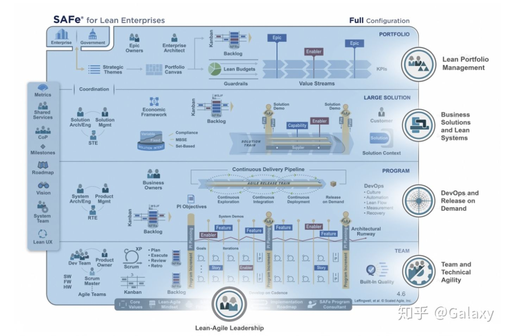
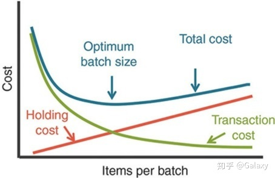

# SAFe4.6 官方更新指南（全中文译版）

我们很高兴能宣布推出SAFE4.6，重点介绍精益企业的五大核心竞争力。这五大核心竞争力是理解和实现SAFE的入口。掌握这五项能力使企业能够成功地应对数字危机，并有效地应对市场行情波动、客户需求变化和新兴技术竞争。

------

如下是我们在SAFE4.6中介绍的五大竞争力

## **精益敏捷领导力**

精益敏捷领导力能力描述了精益敏捷领导者如何通过授权给个人和团队，来发挥他们的最大潜力，从而推动和维持组织变革，保持运行稳定。这主要归功于他们学习、实践、传播SAFE精益敏捷思维、价值观、原则和方法论。

## 精益敏捷领导力-相关部分更改

1. 先前的敏捷领导者内容与敏捷领导力内容被整合到同一个模块。
2. 对安全原则有了新的阐释，重新定义了原则3-假设变化和预留选项
3. 增加了一篇新的高阶文章《管理者角色的演变》，以全新的工作方式描述了线性管理的新变化。

## 团队与技术灵活性

团队和技术的敏捷能力，阐述了创建高性能敏捷团队所需的关键技能、敏捷原则和优良实践，这些团队提供质量过硬、设计优良的技术解决方案。

1. 团队敏捷性——使高绩效的敏捷团队，团队能够根据有效的敏捷原则和优良实践自我组织，开展工作。
2. 提供精益、敏捷的技术实践，以创建质量过硬、设计优良的技术解决方案，以支持当前和未来的企业业务需求。

## 团队与技术灵活性-相关部分更改

1. 全新的质量内建模块，定义了实现质量内建的五个维度——流程、架构和设计质量、代码质量、系统质量和发布质量。

\2. 产品所有者、Scrum敏捷教练、开发团队的模块进行了更改，以明确反映团队的新指导思想、技术敏捷能力及其在行为驱动开发（BDD）中的职责。

\3. 增加了新的高阶文章：

- 测试驱动开发（TDD）：是一种哲学和开发实践，它建议在实现代码或系统组件之前就自我构建并执行测试。
- 行为驱动开发（BDD）：BDD是一种测试优先、敏捷优先的测试实践方法，它通过在指定系统中预先定义测试，或把测试作为系统的一份子来保障质量内建。
- 敏捷测试（AT）：AT是一种把敏捷测试策略用于当下测试对象的综合概述。

## 按需发布

DevOps持续交付和按需发布能力，阐述了实现持续交付流程的企业，无论在任何时间，都能够提供满足市场和客户需求的能力。与相关的模块结合后，这个模块被修改，并补充了关于实现完整持续交付流程的指导意见。

## 按需发布-相关部分更改

1. 更新并丰富了持续交付流程的指南，包括绘制当前交付流程图，评估和改进DevOps流程，以及按需发布的健康雷达（雷达包括了16个测定维度）。
2. 更新了持续探索、持续整合、持续部署和随需发布的文章内容，也反映了健康雷达的16个维度
3. 因为DevOps和按需发布能力变动，从而更新DevOps部分文章和模块
4. 更新了相关文章，以阐释按需发布在行为驱动开发中的角色和地位

## 业务方案和精益系统

业务方案和精益系统，描述了如何将精益敏捷原则和实践应用于大型、复杂软件和物理网络系统，这其中包括了研发规范、开发流程、落地部署和升级演变几个生命阶段。

## 业务方案和精益系统-相关部分更改

1. 在新业务方案和精益系统工程能力文章中，增加了构建大型和复杂解决方案的八个实践指南。
2. 包括四个主要要素的新经济框架：在精益预算和保护内运营；为解决方案进行经济权衡；平衡供应商；为获得最大利益而工作（使用WSJF）
3. 所有新的路线图文章中，都增加了多个范围规划和解决方案路线图，它提供了一个长期的、通常是持续多年的视图。也展示了实现方案所需的关键里程碑和可交付成果。路线图还包含了理解和利用市场变化的新指南。

## 精益投资组合管理

精益投资组合管理能力，描述了企业如何实施战略性的投融资、敏捷投资组合运营、精益治理等方法。

精益投资组合管理-相关部分更改

更新了文章中的战略制定和投资组合的定义。

1. 根据新的精益投资组合管理能力,更新了战略主题。
2. 新的产品组合画布，描述了解决方案是如何为企业创建、交付和获取价值的。投资组合画布还帮助定义了实现企业目标的解决方案，并为如何发展投资组合以满足未来愿景提供基础。
3. 更新后的精益预算从传统预算向精益预算过渡、为投资和预算提供了新的指导。
4. 更新价值流文章，其中包括关于定义价值流和修订开发价值流画布，使其内容更好地与新的投资组合画布一致。

## 政府的SAFe

新的“政府SAFe模式”文章中，描述了一组帮助公共事业部门实施精益敏捷的成功模式。

在国家、地区或地方政府的背景下，SAFe模式将作为一个更全面更高效的入口，为解决以下问题提供了具体指导：

- 建立精益敏捷价值观，原则和实践的基础
- 创建政府和承包商的高绩效团队
- 使技术投资与战略保持一致
- 从单个项目到持续精益
- 采用与价值流对齐的精益预算方法
- 精益估算和预测在实施节奏中的应用
- 修改采购方案以实现精益敏捷运营
- 建立质量标准和合规
- 调整实践以支持敏捷精益价值流

值得注意的是，针对政府并不需要使用特别定制的SAFe框架，也不建议修改SAFe术语和实践。政府服务部门中，经验丰富的从业者已经报告说，当使用SAFe模型和术语而不加修改时，他们也一样可以获得最佳结果。

## 新的SAFe实施路线图

SAFe实施路线图已经更新，包括三个新的部分：

- SAFe与DevOps
- 敏捷软件工程
- SAFe系统和方案架构师

此外，在路线图的开始添加了“瀑布/临时敏捷”起点，以确认大多数组织开始转型的起步位置。此外，所有的12份SAFe实施路线图文章均已更新。

# SAFe4.5 第1章 SAFe业务需求

SAFe是目前国际上最流行的规模化敏捷方法。本文章来源为英文原版《SAFe4.5 Distilled》的全中文译本，由 Galaxy 译著并校对。

目前我没有找到现成且完整的，关于SAFe4.5的官方推荐中文材料。所以我尽己所能，翻译本书全文。希望借此践行敏捷项目价值观：通过身体力行和帮助他人，来推广更好的软件开发方式。

------

> “如果你无法准确描述你当下的行为，那你根本就不知道你在做什么。” —— W·爱德华兹戴明

在第一部分中，我们将介绍SAFe的业务需求，并讨论软件和系统开发过程中的挑战。我们还将学习，如何使用SAFe的三个主要知识体系：敏捷，精益开发和系统思维。以便于帮助我们更好实现业务目标。此外，本部分还包括了SAFe的概况介绍，它将帮助您了解大致框架并为您的学习奠定基础。

------

> “无论它们提供何种产品或服务，每家公司都是技术公司，它们正在重塑这个世界。“ —— Stephenie Stone，美国M·W集团，CIO

## 为什么企业需要使用SAFe？

在这个快节奏的数字经济时代，企业必须迅速响应技术进步，以确保自己的竞争优势。软件和系统无处不在，推动业务创新的全新工作方式，正在取代逐渐老化的商业模式。

“如今，没有成熟的专一的技术，任何公司都无法有效地生产，交付或销售产品。虽然智能手机和互联网曾经是先进的标志。但近来，新技术应用的发布和上线时间正在缩小。这迫使原本习惯于四年一发布的公司进行变革。企业必须学习如何将技术发布周期整合进入生产和服务周期中“

在公司业务中，应用新技术是当下的迫切需要。遍布全球、各类领域的企业，都在努力开发重要的软件和系统。

了解变化并能够提出新的工作方式，快速适应当下的紧迫型公司将会成功。而其他企业只能挣扎，或者等待破产。事实上，商业世界充满了各种各样的例子：Blockbuster，Kodak，Tower Records，Borders，Palm Computing，Novell，BlackBerry，Polaroid，Nokia（手机）和Compaq都是曾今标志性的市场领导者，他们的技术创新领先于竞争对手，但无法适应新的商业模式。

教训很简单：企业必须学会如何快速适应不断变化的技术和经济环境，否则它们将面临破产危险，无论它们的规模，储备或力量如何。即使对于那些不认为自己是信息技术（IT）或软件公司的企业来说也是如此。专业服务，金融机构，医疗健康，传统制造，硬件设备公司和政府都高度依赖于他们的专有技术——生产新产品的能力，和专业领域服务的能力。

## **系统发展的挑战**

显然，我们采用的研发方法必须与日益复杂的市场情况保持实时同步。当下的市场，充满了移动技术，大数据，社交和物联网（IoT）的创新。但与此同时，集团组织内部，还必须维护现有系统，抵御网络攻击，并防止用户隐私和知识产权被盗。系统更大，覆盖更广，内部逻辑也更复杂，集成化程度更高，它们对全球经济的影响是巨大的。此外，关键系统的失败往往会导致可怕的社会和经济后果。

由于这种复杂性，企业研发部门的规模和技术能力范围也在不断扩大。虽然外包可以帮助我们克服一些挑战，但它也同时带来额外的风险和复杂性，例如沟通延迟，对外依赖以及内部能力缺失。此外，外包也难以保证质量与合规性。

尽管存在这些挑战，许多公司仍然泥古不化，使用传统“瀑布流“开发，这些方法是高线性的，有很明确的顺序要求和阶段规范。这种方式创建于40多年前，当时创新速度较慢，开发工具和流程不那么复杂。同时技术需求固定，在研发过程中也几乎没有修改的必要。

如果企业的工作流程和系统需求仍基于传统的，一成不变的方式，即使采用敏捷方法的团队也无法快速交付有价值的产物。此外，该组织仍需要努力扩招，在工作流上继续投资，以跟上当下的市场步伐。

面对这些艰难的挑战，有什么应对方法呢？管理顾问W.Edwards Deming对此有着独到的见解。他告诉我们，大多数此类问题的根源，并非是有限的资金或资源造成的，主要问题在于我们的工作方式和工具。

为了适应对整个开发价值流的广泛变革，产品从创意构思到发布上市，我们必须贯彻精益方法和变更思维，灵活做出决策。不幸的是，大多数企业的组织结构，工作流程和团队文化都是在一个多世纪以前发展起来的。构建初衷是控制权和稳定性，而不是为了创新，速度和灵活性。企业管理，战略和执行的微小变化往往不足以确保原有的竞争力。真正的敏捷和精益转变需要执行的更加彻底，这能对整个企业产生积极且持久的影响。

## 运用新的知识体系

考虑到企业在开发大规模方案时，可能面临的诸多挑战与系统问题，应用我们现有的工具和知识是很有必要的。幸运的是，过去几十年中，涌现了三大知识体系，可以用它们来应对挑战：敏捷，精益，和系统化思维。这些知识体系为Scaled Agile Framework（SAFe）的价值观，原则和实践都奠定了基础。下面将简要叙述每个部分：

**敏捷开发**

> ”通过身体力行和帮助他人，来推广更好的软件开发方式。“ —— 敏捷宣言

通过身体力行和帮助他人，来推广更好的软件开发方式。“大胆的宣言”在20世纪90年代末期，由一些独立工作的思想领袖开创，这个宣言是敏捷开发的先河。 Jim Highsmith，Kent Beck，Martin Fowler，Ken Schwaber，Brian Marick和其他人正在尝试替代那个时代负担过重的文档驱动研发方法。17位先去在犹他州的雪鸟会议上一同讨论新的解决方案。与会者包括独立专家，以及轻量级软件开发框架的创建者，包括了极限编程（XP），Scrum，动态系统开发方法（DSDM）。而后出现的是敏捷宣言。这份宣言引爆了这个行业的广泛关注，并统一了一个共同的信念体系与背后的优良实践。这份宣言阐述了一种戏剧性的，全新的思维和工作方式，分析了研发工作的内在动机。这一的重要突破不容小觑。 SAFe建立在敏捷文化和团队创新的基础之上。实际上，这份宣言已经成为SAFe精益敏捷思维的一个关键部分，详细说明在第3章中有阐述。

**系统化思维**

> “必须管理一个系统。因为系统不会自我管理，每个组件都是自私的，独立的中心。不加管理会破坏系统。系统的价值在于组件之间合作，以实现组织的目标。“ —— W·爱德华兹戴明

SAFe的第二个知识体系是系统化思维，这可能是爱德华兹戴明最有影响力的代表作。作为解决方案开发的整体思想，这种思维方式将系统视为一组相互关联的元素来看待。系统化思维还要求必须考虑的两个不同系统：为客户利益而构建的系统，和用于构建组织的系统。我们需要适用于这两者的原则来思考。基于SAFe设计实施的基础，是理解个人，团队，程序和业务单元，这些都是不可或缺的工作部分，详细说明在第4章中有阐述。

**精益开发**

> “我们只关注从收到客户订单，到收到货款的时间差。通过消除非增值的无效工作来缩短账期。” —— 丰田生产之父 Taiichi Ohno

SAFe的第二个知识体系是精益产品开发，是精益思想和产品研发流程的混合学科。精益思想的指导来源于全面质量管理和丰田生产系统。在之前的行业讨论中，丰田的Taiichi Ohno将精益的本质概括为：对现有流程的持续评估，以消除浪费和延迟。这种无情的设定迫使企业实现精益目标：在最短的可持续交付周期内以最高的质量为客户和社会提供最大化价值。实际上，这是一个非常有价值的目标。在过去的几十年里，艾伦·沃德，迈克尔·肯尼迪，唐·赖纳森，埃里克·里斯等思想领袖将精益科学应用于产品研发。如今，企业可以利用广泛的知识和精益产品开发来大幅改进其生产解决方案。精益产品开发的亮点包括：

- 我们如何使公司以共享业务和技术目标为中心，以此组织工作团队，以帮助我们的计划成功。同时我们还要确保层次结构中没有固有的延迟反馈和官僚作风？
- 我们如何在已有的时间表上提供新价值，以便其他业务的计划与执行？ 我们如何管理和简化团队，程序和价值流之间的依赖关系？
- 我们如何将敏捷实践从团队内部扩展到更大的业务目标？
- 我们如何提高解决方案的质量以满足客户的需求？
- 我们如何改变我们的文化，以便创造容忍失败，奖励冒险，促进合作，创新的团队氛围？

通过采用SAFe的价值观，原则和实践，个人和企业都可以解决这些问题，并实现更大的业务成果。这也是本书的主旨和目的。

## SAFe的商业利益

> “我们正在开发的产品比一个敏捷团队更大。团队需要进行互动，制定行动计划，我们确实需要以SAFe作为基础。它带来了优良的实践和方法，协调多个团队同时在同一产品上工作。” —— Mike Eason，首席商务银行CIO，商业银行

现在，SAFe4.5已进行了第四次重大修订，正在帮助改善全球各种规模公司的业务发展与交付成果。它帮助企业大大加速产品的推进时间，员工敬业度，质量，客户满意度以及经营成果。它还有助于创造更高效，更有回报和更有趣的团队文化。

**质量优势**

SAFe的质量内建实践可提高客户满意度，并提供更快，更透明，可预测的价值交付。他们还提高了团队的创新能力。应用SFAe的公司通常会经历快速且引人注目的解决方案质量提升：

- “缺陷减少95％” - 特斯拉
- “部署影响减少5倍” - CSG国际
- “55％缺陷减少率” - SK海力士
- “减少44％发布缺陷“ - Mitchell International
- ”50％保修费用减少“ - John Deere
- ”客户满意度增加20-25％“ - SEI Investments

**生产力**

生产力是团队成员最关注的关键个人需求。当他们做出更多贡献，更少的错误和返工时，每个人的感觉都会更好。当生产力提高时，系统开发经济效益也会提高，员工敬业度也会提高：

- “生产力提高了至少20-25％。” - Discount轮胎
- “团队生产力提高了20-50％。” - BMC Software
- “单一缺陷仅一次就能修复完全。” - TomTom

**敬业程度**

“培养更多敬业的员工队伍将有助于您的组织实现使命，执行战略，并产生积极的业务成果。”据Hay集团称，高员工敬业度和支持率的结合导致员工绩效提高40％，同时在客户满意度方面增长18％。显然，员工敬业度与业务绩效直接相关，SAFe有助于提高员工敬业度。

**快速推向市场**

SAFe帮助企业更快地为市场创造价值，从而帮助企业获得市场先发优势，并为企业提供更高的利润。SAFe企业通常会将产品上市时间缩短30-75％（最多3倍！）。

**规划执行**

规划执行是SAFe的核心价值。掌握它意味着开发组织可以成为业务人员的信任和尊重的合作伙伴。开发组织按计划开展工作。这使企业能够更有效地制定计划，落实战略。

**基线校准**

当管理层和团队都认同使命，并在大局观上保持一致时，所有的贡献和服务能力都会流向客户。每个人都在同一条基线上，朝着同一个目的努力。

**透明度**

您无法掩盖事实，也不要尝试掩盖事实。使用透明度才能建立信任。反过来，信任对于绩效，创新，冒险和不懈改进至关重要。

------

行业的数字化转型影响着全球的公司。现在，几乎每个业务都依赖于软件和解决方案的功能研发。SAFe帮助企业实现并掌握新一轮的竞争力。通过实现从创意到市场发布的整个开发价值流，让企业服务和产品变得更加灵活，更精简，更具备响应变化的能力。现在，SAFe4.5经过第四次重大修订，正在成为改善各规模公司业务成果的新兴力量。它帮助企业大大加速产品上市时间，员工敬业度，质量，客户满意度。它还有助于创造更高效，更高回报率和更有趣的团队集体文化。

# SAFe4.5 第2章 SAFe概览与最简配置

精益企业的规模化敏捷框架（SAFe）是一个可扩展/可配置的框架，可帮助企业在最短的可持续交付周期内以最优化质量和最大化价值交付世界上最重要的系统。它可以帮助多个敏捷团队甚至更大规模的集团组织进行协调同步，协作和交付。

SAFe将敏捷的力量，精益产品开发，系统化思维相结合。其广泛的知识体系基于精益敏捷原则和价值观，它们更好地指导了业务所需的角色，职责，工件和活动。

## 配置

SAFe支持各种开发环境，具有四种开箱即用配置，具体配置项目如下：

- 必不可少的最简SAFe
- 基于投资组合SAFe
- 基于大型解决方案SAFe
- 全局完整的SAFe

> 因为照顾到整体水平，这里我们先探讨最简单的一种开箱即用配置——必不可少的最简SAFe。了解它的组成要件，参与角色人员，十大基本原则。

## 最简SAFe

最简SAFe是完整版本的基础，是框架核心，也是SAFe实践的最简单的入门起点。其他配置都需要这些基本模块，它描述了原则，参与角色人员，十大关键要素。

团队组织和计划实施，两个层面共同构成了一个名为Agile Release Train（ART 敏捷发布火车）的结构。ART是针对于多个团队，利益相关方和项目资源的持续化解决方案任务列表。

目前，你只需要把它当做传统SCRUM里面的Product BackLog来理解即可，即我们实施解决方案，需要完成哪些研发，设计，测试任务。

------

## ART的基本原则：

1. ART通过共同愿景，路线图和积压计划表，使管理层，团队和利益相关方与共同使命保持一致；

\2. ART提供了可持续发展价值所需的上层功能（用户功能）和底层推动支持（技术基础设施）；

\3. ART工作推进中，团队迭代是同步的，使用相同的持续时间，相同的开始和结束日期；

\4. 每个ART周期在两周左右，每个周期都提供有价值且经过测试的系统级增量；

\5. 程序增量（PI）为规划，执行，检查和调整工作提供了更长，更固定，更有节奏的时间周期；

\6. ART使用大规模的面对面程序增量研发计划，来确保团队协作、进度基线对齐和快速适应变更；

\7. ART建立并维护一个持续的交付渠道，以便于定期开发和释放有价值的增量。这使团队可以随时根据市场需求发布自己想要的解决方案；

\8. ART为系统架构设计和使用体验（UX）设计提供了通用且一致的方法；

\9. ART融合DevOps持续交付。DevOps是一种思维方式，文化和技术实践，提供了计划，开发，测试，部署，发布和维护解决方案。同时提供了所有人之间沟通，集成，自动化和密切合作的可能性；

------

## 角色

通过必要的协调和治理，以下角色有助于使多个团队与共同使命和组织愿景保持一致：

**系统架构师/工程师**

是一个应用系统化思维的个人或小型跨学科团队。充当此角色的人员定义了系统的整体架构，确定了新的非功能需求（NFR），确定了关键元素和子系统，并确定了它们之间的接口和协作规范。

**产品经理**

提供客户的内部声音，与产品所有者和客户合作，以沟通了解他们的需求，从而定义系统功能并参与验证。产品经理负责管理产品的积压计划表，并使用经济学方法确定功能和其推动因素的优先级。

**首席Scrum Master**

无实权领袖，也叫发布快线工程师（RTE）。此角色的主要工作是使用诸如计划看板，检查调整（I＆A）事件，PI计划等机制来帮助改善团队工作计划中的价值流动，使其更加流畅。

**商业负责人**

代表利益相关方的小组，他们对治理，合规和投资等业务和技术负责，为ART开发的解决方案买单。他们是重要的利益相关者，评估项目适用性并积极参与ART活动。

**客户**

是价值的最终裁定者，是敏捷开发流程和价值流的重要组成部分。他们在SFAe中负有特定的责任和角色定位。

上面提及的三个要素有助于协调ART的推进，它们分别是：PI规划，系统演示和I＆A事件。接下来我会将简要介绍所有要素。

------

## SAFe的十大关键要素

哪怕是一个最简的SAFe也确定了10个关键要素，这些要素适用于所有SAFe配置。这对于成功的精益和敏捷开发是必不可少的。如果企业在建立新解决方案时融入这些元素，那么他们将很好地获得SAFe的全部优势。

**1. 精益敏捷原则**

其中包含了九个小的基本原则，这些原则合集为SAFe实践提供了信息。如果这些实践不能直接适用于当下特定的环境，那么基本原则就会为他们指出连续的明确的发展路径，确保他们在尽可能短的时间内开始尝试这些实践。

**2. 完备的敏捷和培训团队**

被完备组建的敏捷与培训团队，都需要产生一个可行的，经过测试的解决方案增量。团队内实施跨职能，自组织和自管理，ART允许价值更快地流动，同时最小化成本。产品经理，系统架构师/工程师和RTE提供权限并简化开发过程。产品所有者和Scrum Masters帮助开发团队实现其目标。客户在整个开发过程中发挥着关键作用。

**3. 节奏和同步**

节奏是一种固定的，周期性模式的事件，就像是项目进展中的心跳一样重要。它确保定期举行各种团队会议，制定计划和大型解决方案活动，使其成为团队中默认的常规（例如每日站立，PI计划，系统演示，I＆A事件，解决方案演示）。同步则允许从多个方面理解并解决问题。 例如，它将一个系统中的不同资产结合在一起，以评估解决方案的可行性。

**4. 程序增量（PI）计划**

PI的基石，SAFe中没有比PI规划更强大的事件。此活动是ART的心跳活动，本计划的制定，共识与实施，使ART的所有团在未来愿景上保持一致。

**5. DevOps和可交付性**

SAFe接近于DevOps的“CALMeR —— culture, automation, Lean-flow, measurement, recovery”方法，这使企业能够缩小开发和运营的差距。可交付性侧重于企业根据市场需求更频繁地为客户提供价值的能力。DevOps和可交付性共同作用，使组织能够通过频繁发布和快速验证来实现更好的经济效益。

**6. 系统演示**

ART进展的主要衡量标准，是系统演示中解决方案提供的客观证据。每两周，敏捷发布列车（ART）上的所有团队都要整合工作，并会向利益相关方进行演示，然后利益相关方提供反馈，帮助团队保持正确的前进防线并及时纠正偏差。

**7. 检查和调整（I＆A）**

每个程序增量迭代（PI）都要周期性举办的重要活动。I＆A是为了定期反映问题，收集数据，解决问题、汇集团队和利益相关方一起评估解决方案。这是一个定期机会，有助于提高下一个PI的速度，质量和可靠性。

**8. 创新和规划（IP）迭代**

每次程序增量迭代中，为了多方目的，计划至少一次创新和规划迭代（PI）。它可以看作为了实现PI目标的估算缓冲区，并为创新，团队继续教育，PI规划和I＆A活动提供时间。这就像是坦克中的额外燃料：如果没有它，我们的敏捷发布火车可能会开始在“极端的暴政”迭代失衡

**9. 架构跑道**

架构跑道由现有的代码，组件和技术基建储备组成。这些代码，组件和技术基建储备必须支持高优先级，近期的任务安排，确保不会出现过度的延迟交付和中途返工。这样就能加速价值交付流程。

**10. 精益敏捷领导力**

为了确保SAFe实施的有效性，企业的管理人员和管理人员必须对敏捷精益的采用与成功承担领导责任。因此，领导者必须接受培训，并成为更精干的思考者和团队培训者。只有当领导者积极参与并负责实施时，SAFe转型才能成功。

# SAFe4.5  第3章 更大更复杂的SAFe配置

## 投资组合SAFe

这种配置，使投资组合计划与企业战略保持一致，通过一个或多个价值流的围绕支持来组织敏捷开发。

投资组合SAFe配置定义了价值流策略，投资资金以及投资组合中的解决方案。它还为提供解决方案所需的人员和资源，提供敏捷组合运营和精益治理。精益预算和敏捷治理有助于确保投资能够帮助企业实现其战略目标。

> *以下关注点在最简SAFe的基础上被加入*

**精益预算：**在适当的财务控制和问责制之下，‌允许更快速和有实际权力的决策；

**价值流：**每个价值流都是持续的，可重复的一系列步骤（例如，定义，开发，部署和发布），并在步骤中不断构建和部署解决方案。每个价值流都为需要为客户和利益相关方提供价值的人与资源服务。

**投资组合看板：**该看板使即将到来的投资组合工作可视化，并支持在制品（WIP）的队列限制，以确保需求与价值流的容量相互匹配。

> *以下角色对投资组合的管理负责*

**精益投资组合经理（LPM）：**LPM职能对SAFe投资组合具有最高级别的决策和财务责任。 它负责三个主要领域：战略和投资基金，敏捷投资组合运营和精益治理。

**史诗所有者：**负责通过投资组合看板来协调一个较大用户故事的开发（史诗级）。

**企业架构师：**个人或小团队，跨越价值流和计划，提供投资组合结果的优化方向。企业架构师经常充当史诗所有者来协调预言史诗。

------

## 大型解决方案SAFe

大型解决方案SAFe配置用于开发最大和最复杂解决方案，通常需要多个ART和供应商，但这其中没有考虑组合级别。大型解决方案在航空航天、国防、汽车、政府机构等行业中十分常见，这些行业对于大型方案都拥有明确的需求。

> 以下关于大型解决方案的关注点在投资组合SAFe的基础上被加入

**解决方案列车：**是大解决方案层面的关键组织要素。它使每个人的工作与共同解决方案愿景，项目积压工作列表保持一致。

**供应商：**开发解决方案列车所需的各类子组件，子系统或依赖服务。

**经济框架：**为解决方案列车的决策实施提供了财务支持和范围。

**解决方案库：**是当前和未来解决方案与实施过程的存储资料库，支持系统定义，通信，验证和合规性。它还扩展了系统工程学科的质量内建实践，包括基于集合的设计（SBD），基于模型的系统工程 （MBSE）。

**解决方案背景：**描述了系统如何在其操作环境中进行对接，工作，研发以及部署等等。

**解决方案看板：**促进了解决方案的功能和促成因素的流动。

> *以下角色有助于帮助多个ART，供应商与集团在愿景上保持一致，并提供必要的协调职能*

**解决方案架构师：**是个人或小团队，负责定义正在开发的解决方案的技术和架构。

**解决方案产品经理：**拥有大解决方案级别的内容权限，并与客户合作以了解他们的需求。这些人员创建解决方案愿景，方案积压待办列表和路线图，以及定义需求（功能和内在动机），并通过解决方案看板指导工作。

**解决方案培训工程师（STE）：**STE是一名仆人领袖，也是团队教练，负责指导所有ART和供应商工作。

> *解决方案列车由多个ART和供应商组成，三个关键活动有助于协调列车前进：*

**1. PI的前置和后置规划**：允许解决方案发布列车提前为下一个PI建立跨团队，跨ART，和供应商的统一计划。

**2. 解决方案演示**：来自多个ART的所有开发结果，以及来自供应商的贡献被统一集成在一起，然后展示给客户和其他利益相关方，并接受评估。

**3. 检查和调整（I＆A）**：带有审查与回顾作用的解决方案检查和调整，在每个PI结束时举行。我们对解决方案的当前状态进行演示和评估。多个ART团队和供应商团队的代表在一个结构化的问题上进行研讨，反映应该被改良的和作为应急备选的各个工作环节。

------

## 全局完整的SAFe

完整的SAFe配置（图2-5）是最全面的框架配置版本。它支持在企业级别的跨度上，构建和维护大型集成项目与解决方案，可满足数百人以上的管理场景需求，包括所有级别的SAFe：团队，计划，大型解决方案和产品组合。最大的企业可能需要多个SAFe进行协同配置。

> 此配置在最简SAFe上添加了产品组合和大型解决方案支持，还具有完成如下2个目标的能力

- 允许组织自由结合，或者裁剪多种不同的SAFe配置；
- 提供最全面，最强大的配置，以满足大型企业的需求；

SAFe的可配置框架提供了足够的项目指导工具，以满足任何产品，服务或组织的需求。企业可以简单地入门使用，并随着时间的推移逐渐加入其它部分。SAFe的四种配置，其实都由“跨度控制板”和“基础元素”进行支持，以保证实践中的灵活性。我们将在下面具体介绍“跨度控制板”和“基础元素”。

------

## 跨度控制板

跨度控制板包含各种角色和工件，角色与工件可以灵活用于特定团队，程序，大型解决方案或项目组合上下文。SAFe灵活性的一个基本特征：是允许组织仅选择他们所需的元素。图2-6说明了跨越调色板的两个版本：左侧的图形仅在最简SAFe的配置中使用，而右侧的图形支持所有配置。当然，由于SAFe是一个可伸缩的框架，企业可以将更大生产单元中的元素叠加于最简SAFe配置。

> *以下是跨度控制板中包含元素的简要说明*

**指标：**SAFe进展的主要衡量标准是，可工作的解决方案被客观证明有价值，这个证明评估在每个PI周期中都被正式执行。并且。SAFe还定义了团队，火车和投资组合可用于评估进展的其他中长期措施。

**共享服务：**共享服务通常代表被需要的特定专业角色，但这些专业角色不只仅仅负责特定的某个解决方案列车。

**实践社区（CoP）：**CoP是一个由团队成员和其他人组成的非正式小组，他们对于特定的程序研发、企业市场背景等多个相关领域，分享自己的实践知识和经验。

**里程碑：**三种类型的里程碑，固定日期里程碑，程序增量里程碑，学习里程碑。里程碑在团队中代表了重要计划和特定目标。

**路线图：**该路线图采用时间线样式，展示项目计划中的可交付成果和里程碑。

**愿景：**该愿景描述了所提出解决方案的未来蓝图，反映了客户和利益相关方的需求，包括满足这些需求的相关特性和功能。

**系统团队**：系统团队帮助构建敏捷开发环境，包括连续集成和测试自动化，以及敏捷团队在连续交付管道中使用的其他技术。

**精益UX**：精益UX将精益原则应用于用户体验设计。精益UX通过持续的”度量——改进循环“（构建设计 - 用户体验度量 - 发现学习 - 改进表现）方式来进行。其中的指导思想是：迭代和假设驱动。SAFe大规模利用精益UX，探索用户体验设计的正确方向。

------

## 基础元素

如图所示，SAFe基础元素包含支持原则，价值观，思维模式，实施指南和领导角色。这些都是成功创造规划化价值的基础。接下来我们开始了解每个基础元素。

**精益敏捷领导者**：所在管理层对业务成果负最终责任。因此，领导者必须接受培训，并掌握更精干的思考和工作方式。他们应该秉承终身学习理念，并理解，应用精益敏捷原则与实践。

**精益敏捷思维**：是指导SAFe领导者和实践者的信念支柱，他们承认敏捷宣言和精益思想。

**SAFe原则**：包含九个小原则，阐述了使SAFe有效的角色和实践。这些小原则将在后面章节中进一步描述。

**SAFe实施路线图**：要成为精益团体和企业，需要大多数公司在落地实践和管理思维的重大转变。SAFe提供了指导转变的全程实施路线图。实施路线图将在后面章节中进一步描述。

**SAFe计划顾问（SPC）**：变革推动者，他们将SAFe知识与改善公司系统研发过程的内在动机相结合。

**核心价值**：对齐，质量内建，透明度，程序化，这些核心价值定义了SAFe价值体系。 我们接下来马上就会了解到核心价值部分知识。

------

## 核心价值

**1.基线对齐：**当管理层、团队的目标和愿景保持一致时，我们就能全力以赴帮助客户。每个人都在同一个频段，付出最大化的努力实现共同目标。当组合中的每个人，每个团队，每个ART，都了解战略以及他们在战略中的定位时，你的基线就成功对齐了。

**2.质量内建：**规模化架构上，质量出现差错是不可接受的。质量内建可以提高客户满意度，并提供更快，更好的为客户交付价值。它们还提高了创新和承担风险的能力。没有质量内建，企业无法实现“最短的可持续周期内实现最大价值”的精益目标。这些实践还确保每个解决方案中的元素，每个增量，都符合全局要求的质量标准。

**3.透明度：**您无法掩盖事实，也不要尝试掩盖事实。使用透明度才能建立信任。反过来，信任对于绩效，创新，冒险和不懈改进至关重要。

**4.程序化敏捷：**SAFe通过创建长期稳定的敏捷团队（称为ART团队），以最高的可能质量，在最短的可持续交付周期内提供价值。ART是一个敏捷计划，也可以看成是虚拟的组织。这个组织规避了研发功能孤岛，消除了不必要的工作阻碍和繁琐步骤，并通过SAFe精益敏捷原则和实践来加速交付。这个组织是完全跨职能，自组织和自管理的。加速价值流动的同时间，组织也降低在多余能耗上的成本浪费。

------

## 总结

大型企业中，软件和解决方案的类型和范围差异很大。 对于每种情况，都没有一种普适的终极方法。 除了提供灵活的跨度控制板外，SAFe的四种开箱即用配置，这保证了开发挑战所需的适应性。 这有助于SAFe企业在最短的可持续交付周期内，以最佳的质量，最大化的价值进行交付。

# SAFe4.5 第4章 精益敏捷心态01

接下来，我们将从最基本的心态开始，精益敏捷秉承的心态有2个部分，这2部分中对应的内容，我们也将拆开做成2章进行阐述：

- 精益敏捷心态 = 精益思维+拥抱敏捷；
- 精益思维：精益屋模型，屋顶地基 + 四大支柱；
- 拥抱敏捷：四条宣言 + 四大支柱 + 五大价值观 + 十二条价值观支持原则；

这一章，我们先了解精益敏捷心态，以及它的第一组成部分：精益思维。

## 为什么要有精益敏捷心态

> “管理层致力于产品质量和生产力是不够的，他们必须知道自己的管理目标，这种责任不能下放。团队已经在尽力而为，而问题出在系统上。只有管理层才能改变系统。“ —— W·爱德华兹戴明

戴明提醒了我们SAFe有一个基本的前提：管理层最终要对业务的成功负责。因此，这个前提对管理层工作方式有着重大影响。毫无疑问，转向精益敏捷将会使组织内发生巨大的变化。 这些实践不仅不同于传统的集团管理，而且信仰体系，核心价值观，团队文化和哲学也都不同。为了开始这一变革之旅，并将新习惯灌输到团队文化中，领导者也需要积极去学习“精益敏捷思维”。

## 什么是精益敏捷心态

精益敏捷思维主要包含两个方面：

1. **精益思维**

SAFe的“精益屋模型”组织了六个概念，如图3-1所示。屋顶代表着提供价值的目标。支柱通过尊重人和文化，流动，创新和不懈改进的概念来支持这一点。精益领导为其他一切事物奠定了基础。

**2. 拥抱敏捷**

SAFe完全依赖于Agileteams及其领导者的技能，能力和能力。 虽然没有单一的敏捷定义，但清单提供了将敏捷方法引入主流软件开发的价值体系和原则。 随着我们的扩展，我们必须加强它，而不是放弃它。

思考精益和融合敏捷相结合，构成了精益 - 敏捷的心态。 这种新的管理方法通过提供引导成功业务转型所需的概念和信念来改善工作场所文化。 反过来，这有助于个人和企业实现其目标。

精益敏捷心态的第一部分：精益思维，也就是我们要谈到的精益屋模型。

------

## 精益屋模型

精益思维最初是为简化制造业。然而现在，精益思想的原则和实践已深入人心，并广泛应用于软件，产品和系统开发领域。例如：Alen Ward，Don Reinertsen，Mary，Tom Poppendieck，Dean Leffingwell等等，越来越多工程师，管理者在新的行业背景下重新思考并改良精益思维。

结合这些想法，我们开发了基于SAFe的精益屋模型，其灵感来自丰田的“精益之家”和其他行业大佬。接下来我们将通过这个模型更充分地了解精益思维。

**房屋屋顶 —— 价值**

“屋顶”代表价值，我们目标是在最短的可持续交付周期内，为客户和社会提供最高质量产品，提供最大化价值。高昂的士气，团结的团队氛围，不被打扰的私人生活空间，以及客户满意度也是经济效益的目标。

**第一支柱 —— 尊重人，尊重文化**

精益敏捷方法本身无法执行任何实际工作，它是一种看问题的角度，是世界观。因为需要人来参与所有项目工作，所以尊重人，尊重文化是精益的基本原则。SAFe使集体在管理层的要求和指导下，改良自己的实践。

当然，个人和团队也需要自主学习、反思、解决问题，并对适当的改进负责。要成为精益组织，企业的文化需要大幅度改变。对人和文化的尊重也应扩展到供应商，合作伙伴，客户和社区，这些对企业的长期合作都至关重要。总之，要理解并实施SAFe的价值观和原则；第二，想取得成功，必将实施文化变革。

**第二支柱 —— 工作流**

成功实施SAFe的秘诀在于：建立连续快速的反馈，调整的连续增量的交付流程。持续稳定的工作流可以实现快速的价值交付，可靠的产品质量，持续的治理和改进。工作流原则是精益敏捷思维模式的重要组成部分，此外，精益组织专注于减少工作流的反馈延迟，消除不必要的浪费。

- 了解完整的工作价值流；
- 可视化和限制在制品（WIP）；
- 减少批量处理中单次工作单元的大小；
- 管理工作队列的长度;

**第三支柱 —— 创新**

工作流为价值交付奠定了坚实的基础。但如果没有创新，产品交付和流程开展都得不到保障。为了促进创新，精益敏捷领导者必须做到以下几点：

理解并实施日本的“Gemba现场”概念，该概念建议管理层“走出办公室”，进入工作场所。工作场所才是实际产生价值，创造产品的地方。正如丰田的Taiichi Ohno所说，“办公桌上的发明令人难以置信”。请注意如下几点：

- 为人们的创造性提供定期时间和舒适空间。创新的时间必须是目的性的，并成为集团常规发展的一部分。 SAFe的创新和规划（IP）迭代提供了一个这样的机会。
- 避免处理“暴政”陷阱，同时防止团队成为“紧急救火队”。这样的话，创新无法实现100％的被激活和利用。
- 应用创新度量和计算，来建立早期的，非财务的，可操作的指标。为解决方案的新概念，特征及其相关的重要元素提供快速反馈。
- 当假设需要检验时，与客户一起验证创新，无需为错误感到内疚。

**第四支柱 —— 不懈地自我改善**

我们应该通过不断的反思和适应，引导企业成为一个学习型组织。“持续的竞争意识”推动了我们对改进自我的积极追求。领导者和团队系统地围绕一个中西：优化组织和开发过程的整体，而不仅仅是部分修补。

- 仔细考虑事实，然后迅速采取行动。
- 应用精益工具和技术来确定问题的根本原因，并快速施以有效对策。
- 反思关键里程碑，公开识别和解决各个层面的流程缺陷。

**精益屋地基 —— 领导力**

精益的基础是领导力，这也是团队成功的起点。企业的经理，领导和管理人员负责精益敏捷范式的应用，并对效果负责。要取得成功，领导者必须接受这些新创新思维方式的培训，并积极示范精益敏捷领导力的原则和行为。

# SAFe4.5 第5章 精益敏捷心态02

之前已经提到过，精益敏捷秉承的心态有2个部分，这2部分中对应的内容，我们将拆开做成2章进行阐述：

1. 精益敏捷心态 = 精益思维+拥抱敏捷；
2. 精益思维：精益屋模型，屋顶地基 + 四大支柱；
3. 拥抱敏捷：四条宣言 + 五大价值观（八大价值观的版本） + 十二条支持原则；

这一章，我们来了解第二个部分 —— 拥抱敏捷。

## 拥抱敏捷

精益敏捷思维的右半部分当然是敏捷。在我们之前所谈到的 “SAFe的业务需求” 中，我们介绍了敏捷宣言，这是跨职能，自组织，自管理团队的基础。接下来的篇幅，我们将专门讨论SAFe的这一关键要素。

## 四条敏捷宣言

如下是敏捷宣言的原文部分：

我们一直在实践中探寻更好的软件开发方法，身体力行的同时帮助他人。由此我们建立了如下价值观：

- 个体和互动 高于 流程和工具
- 可用的软件 高于 详尽的文档
- 客户合作 高于 合同谈判
- 响应变化 高于 遵循计划

也就是说，尽管右项有其价值，我们更重视左项的价值。

## 解读敏捷宣言

**我们正在发现更好的方法**

宣言的第一句话值得强调：“探寻更好的软件开发方法，身体力行的同时帮助他人”。我们将此解释为描述一个持续的探索发现之旅，以便我们慢慢接受敏捷行为，敏捷和对于新兴软件开发方法的研究，一个无止境的旅程。SAFe也一样，它不是一成不变的框架。一旦我们发现了更好的工作方式，就会对框架进行调整，正如现在去回顾SAFe之前的五个版本一样。

**我们在哪里找到价值**

我们将很快讨论这些价值观，但宣言的最后一句话也很重要：“虽然右边的项目也有价值，但我们更重视左边的项目”。有些人可能对此产生误解，认为左右两个语句的关系是二元决策关系（例如，工作软件与综合文档），只能取其一。但这不是敏捷宣言的本意。首先，我们已经承认，左右的两个项目都有一定价值。其次，左侧的项目具有更多价值（例如，工作软件）。敏捷宣言并非僵化教条，也不是要否定传统开发流程以及副产品的价值。相反，它的关注点在于：根据当下具体情况，平衡价值与价值判定标准。

**个体和互动 高于 流程和工具**

关于流程，W·爱德华兹戴明指出，“如果你无法准确描述你当下的行为，那你根本就不知道你在做什么”。因此，在像Scrum，Kanban和SAFe这样的框架中，敏捷流程很重要。但是，过程仅仅只是达到目的的手段。如果你被一个不起作用，却占据成本的过程所俘虏，那么你可能知道自己在做什么，但你所做的却无法导向你的预期目标。因此，支持个体和交互，然后相应地修改流程。在分布式环境中，工具对于协助通信和协作（例如，视频会议，文本消息，ALM工具和维基）至关重要。但是，工具不应该取代面对面的沟通。

**可用的软件 高于 详尽的文档**

文档很重要且具有价值（例如，QA帮助，系统部署，接口交互，法规/合规性文档）。但是，为了遵守公司相关规定，创建文档具有负面价值。作为变革计划的一部分，对文档的要求标准需要更新，以反映精益敏捷的工作方式。

有一种形式的文档，如软件需求规范，交互图稿等，特别棘手。敏捷尤其关注这种过载工作带来的影响。通常来说，需求规范导致我们需要做很多的提前设计（BDUF），这导致了和瀑布流一样的项目启动延迟。我们用复杂的文档规范限制了开发方向。然后在实际开发中，却发现之前设计的 “固定解决方案“ 通常不切实际。这不如一边设计，一边向客户展示工作的软件，以获得他们的反馈来的更有价值。因此，我们不是完全不写文档。我们只记录必要内容。

**客户合作 高于 合同谈判**

客户是价值的最终决定者，因此他们的密切合作对于我们的研发至关重要。为了明确定义每一方的权利，责任和经济层面问题，合同往往是必要的。但合同可能过度规范做什么以及如何做。无论他们写得多好，都不应该去取代常规的沟通，协作和信任。相反，合同应该是主张双赢的。但是，放弃合同通常会导致糟糕的经济纠纷和不信任，造成短期关系破裂，也影响了长期合作伙伴关系。所以，我们既需要合同，更要与客户良好合作的氛围。

**响应变化 高于 遵循计划**

变更是产品发展的必经之路。精益敏捷开发的力量在于它如何包含变更。随着系统的发展，对业务问题和解决方案的理解也在不断发展。业务利益相关方的知识也可以帮助改善现有的工作流程，客户需求也会随之发展。实际上，基于这些理解的变化为我们的系统创造了新的价值。当然，宣言短语 “遵循计划” 表明实际上有一个计划。我们没有说否定制定计划的价值，要知道，计划本身就是敏捷开发的重要组成部分，Sprint Backlog和Product Backlog也是计划的一种形式。

事实上，敏捷团队比瀑布流团队更经常，更持续地制定并修改计划。因为随着新知识的学习，新情况的出现，我们的计划必须适应现状。更糟糕的是，通过衡量计划的一致性来评估成功会导致错误的行为（例如，面对证据表明该计划不起作用的计划）。

## 五大价值观（原始版）：

> 2008年出版《精益敏捷开发 — 大型应用指南》第111页

**承诺、专注、开放、尊重、勇气;**

## 八大价值观（增强版）：

> 《Scrum精髓》第17页提到Scrum的八大价值观

**去掉承诺；加入诚实、信任、授权、合作；**

## 十二条支持原则

敏捷宣言原则敏捷宣言有12条支持其价值观的原则。在此列出，这些原则使价值观更进一步，并具体描述了其含义：

1.我们的首要任务是尽可能快速和持续地交付有价值的软件，从而来满足客户。

2.欢迎变更需求，甚至在开发后期。敏捷流程包容变更来提升客户的竞争优势。

3.经常提供迭代更新，周期从几周到几个月不等，优先考虑更短的周期。

4.业务人员和开发人员必须每天一起工作。

5.围绕有自我驱动力的人建立项目。给他们应有的环境和支持，并相信他们完成工作。

6.向团队内部传达信息的最有效方法是面对面交谈。

7.可工作软件是衡量进度的主要方法。

8.敏捷过程促进可持续发展。赞助商，开发者和用户应该保持一致且稳定的步伐。

9.对卓越技术和良好设计的关注利于提高灵活性。

10.简化（最大化未完成工作量的艺术）是至关重要的。

11.最好的架构，需求和设计来自有自组织能力的团队。

12.团队定期反思如何提高效率，然后调整其行为。

其中大多数都是不言自明的。除了讨论大规模应用敏捷宣言之外，它们不需要详细阐述。宣言中价值观和原则的结合为敏捷本质创造了一个框架。框架为我们的思维和工作方式赋予了非凡商业和个人利益，感激前辈们。

## 规模化应用敏捷宣言

发起这场大规模运动的宣言已有17年历史。从那时起，这份宣言的内容没有改动过一个字。考虑到过去17年的行业进步，我们自然会有疑问：敏捷宣言是否仍然有效？或者它仅仅就是一个历史？更重要的是，敏捷是为小型，可快速变更的团队定义的。

同时我们也提出了另外一个问题：敏捷宣言是否存在扩大规模的应用可能？它是否能够满足开发更大，更复杂的软件系统，以满足当下需求？它是否能肩负数百人构建的同时，保证系统低故障水平的艰巨任务？有什么更好的方法来评估敏捷的实用性，而不是一味要求人们参与构建这些新系统？这里，我们先来做一个简单的小练习

请把上述原则按照2个标准进行分类

- 能够马上应用于规模化敏捷的
- 需要再修改，才能被用于规模化敏捷

大多数读者都会把原则1,3,4,7,8,9,10和12归类给A。可以看出，大多数原则在不需要重新评估的情况下，都可以进行扩展，实际上，归类在B中的原则，规模运用时需要一些特别的注意事项。如下所示：

**原则＃2**

敏捷过程利用响应变化，来实现客户的竞争优势。这里需要注意，变更其实不仅仅取决于参与者的犹豫不决。相反，我们也要认识到，某些类型的变更在开发后期，其需要付出的成本可能会远远超出我们的接受范围。（想一下，我们可以在火箭发射前几个小时，更改卫星的镜头光学分辨率吗？）然而，如果它仅仅是小成本变更，并且程序仍然满足合规性和验证标准，并能按时交付，那么，我们欢迎这种变更。

**原则＃5**

商业人士和开发人员必须每天在整个项目中一起工作。大多数人肯定认同这个原则。然而，大型项目的客户每日进行现场反馈是有一定局限性的，毕竟跨地区协作需要成本。尽管我们完全认同这一观点。产品负责人，产品经理和解决方案经理等角色，都应该积极响应这一原则，并参与到解决方案演示中来。

**原则＃6**

在开发团队中，传递信息的最有效的方法是面对面交谈。每个人都同意这个原则。SAFe中通过敏捷团队迭代计划，和定期面对面PI计划来解决这一问题。这些事件满足了大部分的沟需求。但是如果你依赖供应商，那你可能希望不断与该供应商交谈，但您也会将通信结果记录下来。所以多元化的通信方式也需要被关注和运用起来。

**原则＃11**

最好的架构，要求和设计来自自组织团队。几乎所有人都同意这一原则。当然这取决于您如何定义团队以及决策的主题和范围！当你把ART定义为广义“团队”时，加上所有敏捷团队在ART上的能力，绝对可以为我们创造最好的“要求和设计”。团队不仅仅是人，ART也是团队中很重要的组成部分。

这项练习的结论是：敏捷宣言依然能够规模化使用。然而，许多原则需要在规模上进一步修改和强调。敏捷宣言仍然与以往一样，甚至在SAFe中更为重要。

------

## 总结

与往常一样，管理层最终要对自己的业务负责，因此对其工作方式的重大改变也要负责。转向精益敏捷的发展模式无疑将是一个巨大的挑战。这些实践不仅表面上与传统不同，而且整个信仰体系：包括核心价值观，文化和领导哲学都不同。要开始组织的精益敏捷之旅，将新习惯灌输到原有文化中，领导者和管理者应采用SAFe框架，精益思想，敏捷宣言所提供的价值观，思维方式等等。这种新的思维方式为成功的精益敏捷转型创造了必要条件。

# SAFe4.5 第6章 SAFe九原则之一

> “我们面对的问题各有不同 —— 这个刻板印象是一种普遍的疾病，这种疾病传染全世界的管理体系。当然，企业，集体和团队确实各有不同。但提高产品和服务质量的原则，却是具有普遍性。“ —— W·爱德华兹戴明

## 为什么要关注九大原则？

SAFe基于精益敏捷原则 —— 驱动有效角色和实践的核心信念，基本事实和经济价值。它基于原则，因为原则经久不衰。无论如何都经得起时间的考验，并且普遍适用。原则能够指导SAFe实践，包括具体的活动，行动或成就方式。但是，在某种情况下优良实践可能失效。因此，在企业应用SAFe实践之前，需要了解基本原则。本章描述了九个SAFe框架独有的原则，同样，它们都依赖于我们之前探讨的精益敏捷。

这一节，我们探讨第一个原则：采取经济观点与视角

## 原则1：采取经济的观点与视角

> “虽然你可能忽视经济学，但它依然作用于你。” —— Don Reinertsen，产品开发流程原理作者

实现精益目标，最短的可持续交付周期，以最佳质量交付价值。这意味着我们需要了解架构系统的经济性。然而，即使是技术上可靠的系统，也可能需要花费很长时间来开发，这或者要付出无法接受的制造或运营成本。领导，管理和研发工作者必须掌握他们的行为会产生的经济影响。因此，SAFe的第一个精益敏捷原则是，采取经济的观点和视角去看问题，这又基于两个概念：

- 增量形式，早期和频繁交付。
- 顺序化工作以获得最大利益。

## 逐步，早期和经常交付

迭代地和渐进地开发提供解决方案，这是SAFe框架的主要优点，也是敏捷的经济要求。每个增量的切割小块（由图中的小箱子表示）都降低了风险和不确定性，并各自价值。这与瀑布开发方法形成鲜明对比，如下图所示。

使用SAFe，每个增量都可以更早地为客户提供价值，如图下所示。

此外，每个增量的值随着时间的推移而持续存在，并且这些累积即使在项目周期早期也能带来实质性的好处。相比之下，瀑布流中，价值的获取必须等到所有特征都已完成才能开始。（而且不能保障项目百分百准时交付！）此外，早期向市场提供的新功能或解决方案通常更有价值。这意味着早期提供的解决方案（即使只有一些最小的特性和功能）提供的经济价值，也比后来的完整产品更具效益。这就是敏捷的经济要求。

## 顺序化工作以获得最大利益

在第1章“SAFe的业务需求”中，我们提到了产品开发流程原理，在为SAFe提供的基础支撑所起的关键作用。毕竟，SAFe是一个基于流的系统，旨在为客户提供连续的价值流。这是与传统系统开发的重要区别，传统系统开发是大量而不经常发布的。反过来，流开发需要采用一种截然不同的方法来优先处理工作。在基于流量的系统中，必须根据当时已知的经济和技术事实不断调整工作的优先级。了解如何排序以实现最佳经济效果是至关重要的。

赖纳特森曾描述了一种称为加权最短作业优先（WSJF）的排序算法。

WSJF的计算方法是将任务的延迟成本（CoD）（等这个功能到位之前，我们要花费的总成本）除以任务的持续时间，如图4-4所示。WSJF最高的工作是下一个最重要的工作，因为它在最短的时间内提供最大的价值。WSJF可以应用于SAFe。

## 计算延迟成本

在SAFe，工作是提供价值的史诗（很大的项目故事点），功能和特性。SAFe描述了有助于计算延迟成本的三个参数，这样我们就能衡量WSJF了。

**用户/业务价值：**

这表示特定作业的用户/客户因此功能而获得的价值。人们更喜欢这个功能吗？ 这个功能对收入或业务会产生什么影响？

**时间紧迫性：**

也就是任务的时间敏感性。有固定的截止日期吗？客户会等待还是转向其他解决方案？

**降低风险/机会支持：**

该值代表了一些关键的非物质要素。这个项目对我们的业务还有什么作用？它是否会降低此次交付或未来交付的风险？这个功能会创造新的商机吗？

这些元素的总和就是总延迟成本（CoD），如图所示。

为了建立CoD，没有必要确定每个参数的绝对货币价值。这可能很难做到，并很有可能浪费时间。敏捷团队只要知道如何做相对估计即可。换句话说，团队只是将作业相互比较，并将每个项目的CoD和其他任务比对，并进行排名。

## 持续时间

接下来，团队需要估计WSJF的分母，工作持续时间，这也是具有挑战性的。在开发开始之前，很难预测在完成工作时可能获得的资源，因此无法预测持续时间。但是，在所有其他条件相同的情况下，更多工作一定需要更长时间，因此我们可以转而去判断工作规模。为了快速确定工作规模，也可以在这里使用相对估算。敏捷团队非常擅长估计相对工作规模。注意，尽管有这个建议，工作规模并不总是能够很好地代表WSJF的持续时间。例如，有时持续时间与作业大小不成正比。一个很小的作业，可能对其他工作有多种依赖性，导致它比一个大规模工作花费的更长时间。或者由于资源可用性高，可能会出现更短时间内完成更大的项目。在这些情况下，我们还是应该去考虑估算工作持续时间。

## 计算加权最短作业

首先使用该数据，我们可以使用图中所示的工作表通过简单计算来比较。WSJF最高的工作具有最高优先级。这种简单，快速，有效的优先级排序技术使得ART（敏捷资源列车）和解决方案列车的利益相关方，可以选择最重要的工作来完成，而不需要担心太多的延迟或开销。

## 其他适用的经济原则

逐步递送和排序工作是实现更好的业务成果的两种基本方法。 然而，我们这里还描述了几个额外的经济原则：

1. 不要考虑已花费的钱（忽略沉没成本）。
2. 了解经济权衡参数。
3. 不断做出经济选择。
4. 使用决策规则来分散经济控制。

# SAFe4.5 第7章 SAFe九原则之二

> “必须管理系统。因为它不会自我管理。独立的组件是自私的，独立的利润中心，这会破坏系统的协作性.......只有组件在组织之间的合作，才能实现组织的大目标。“ —— W·爱德华兹戴明

接上一章，我们来了解SAFe九大原则的第二原则：**应用系统化思维**

## 应用系统化思维

我们在第1章“SAFe的业务需求”中，简要介绍了系统化思维，这也是SAFe的两个基础知识体系之一。系统化思维采用整体方法进行解决方案的考量与开发。它将系统及其环境的所有方面融入其设计，开发，部署和维护中。下图说明了系统化思维的主要方面。了解它们，有助于领导者和团队的解决方案开发，理解组织的复杂性，以及控制上线的大局观。

## 解决方案就是一个系统

SAFe指导复杂软件和系统的开发和部署，付出努力的成果叫做解决方案，也就是最后每个价值流的输出。应用程序，卫星，医疗设备和网站都是解决方案的表现形式。当谈到这样的系统时，我们对于“管理一个系统”这句话，会产生一些新的批判性见解。

团队成员必须清楚地了解系统的边界，系统是什么，以及它如何与周围的环境和系统交互。

优化组件不会优化整个系统。组件可以变得自私并占用资源——包括算力，内存，电力，以及其他组件所需的任何东西。

为了使系统在系统中表现良好，必须了解其预期行为，并对其结构有更深的研究（组件如何协同工作以实现目标）。有意设计是系统化思维的基础。

系统通过其互连产生价值。这些接口，以及它们之间的依赖性，对于提供最终价值至关重要。因此我们应该持续关注接口和交互。

系统的发展速度不会低于其最慢的集成点。整个系统的集成和评估速度越快，系统知识的增长速度也就越快。

## 构建系统的企业，本身也是一个系统

构建解决方案的组织人员和管理流程也构成了一个系统，这是系统思考背后的第二个概念。 必须管理系统的原则也适用于此。否则，构建系统的组织组件将变得自私，从而限制整体价值交付的质量和速度。除了前面给出的规则之外，这还会带来另一组见解：

建立复杂系统是一项社会活动。因此，领导者必须创造一个环境，让人们可以以更好的方式建立系统。

供应商和客户是价值流的组成部分。企业必须将其视为合作伙伴，建立长期的信任基础。

优化组件也不会优化系统。本地优化团队或职能部门不会优化企业的价值流。

价值可以跨越组织边界。加速价值交付需要消除功能孤岛，并创建跨职能的组织团队，例如ART和团队FT化。

## 理解并优化全程价值流

SAFe投资组合是价值流的集合，每个价值流都向市场提供一种或多种解决方案。如下图所示，每个价值流包含实现新功能所需的一系列增量，通过新系统发布，或现有系统升级，进行集成和部署。

理解和优化全程价值流，是减少从“概念到现金”总花费的唯一方法。系统化思想指出：领导者和从业者理解并不断提升全程价值流，特别是它跨越了技术和组织边界。价值流映射了查看产生价值和解决挑战囊括的所有步骤。其中，添加实际价值创建代码和组件，部署，验证等的步骤仅占用了上市时间的一小部分。重点是消除或减少步骤之间的延迟，以改善整个系统的表现。

## 只有管理才能改变系统

> “每个人都在尽力而为; 问题却出在系统上......只有管理才能改变系统。“ —— W·爱德华兹戴明

这句话为我们提供了一系列最终见解：系统化思维也需要一种新的管理方法。管理者必须是系统问题的带头解决者。他们必须拥有远见，积极消除障碍，引导必要的组织变革，以改善系统。了解这些系统化思维，有助于领导者和团队理解他们正在做什么，为什么这样做，以及产生何种影响。反过来，这会创造更精简和更智能的企业，也可以更好地驾驭组织和解决方案开发的复杂性，从而带来更好的业务成果。在第5章“敏捷领导者”中，我们将更详细地介绍这一主题。

# SAFe4.5 第8章 SAFe九原则之三、四、五

## 原则3：假设可变性; 保留选项

> “研发能够发挥替代作用的系统/子系统设计。而不是早早地定向于唯一方案，完全消除其他替代方案和可行性。幸存下来的设计都是您最强大的替代品。“ —— Allen C. Ward，精益产品和工艺开发

解决方案开发可以被描述为“将不确定性转换为确定性知识的过程”。事物的发展一定伴随着外界环境不断的变化，技术和市场不确定性始终存在。但是变化本质上具有两面性，因为它带来了风险和机遇。另一方面，它同时也是决定经济价值的不可控变量。

一方面，试图过早地消除差异化方案，会导致糟糕的经济结果和无法创新风险 —— 这是不利于集体文化发展的。另一方面，团队必须解决一些会影响日常工作的要素 —— 例如自动代码部署，以消除容易出错的手动过程。那么，剩下的就是固有的技术不确定性。

**基于集合的设计**

我们已知可变性是始终存在的，这促使团队积极探索更有效的开发实践。 一个典型例子是基于集合设计。传统的开发实践旨在促使团队快速选择单个设计选项，然后修改设计，迭代直到满足系统意图。这可能是一种有效的方法，除非选择错误的起点; 然后，后续的迭代来改进该解决方案可能非常耗时，结果也不一定理想。

这种策略可以描述为“点方法“，如图4-9顶部所示。在这里，预先选择的单个精确选项，通常会导致重大的返工和延迟，这是由于最终通常会发现的这个精确选项存在巨大缺陷。更重要的是，问题太迟被发现，与之关联的工作和增量已经超出我们的预期。我们要承受很高的修复成本。系统越大，技术越新，选择错误起点的可能性就越高。

更好的方法是基于集合的设计，如上图所示。设计一开始，就考虑多种设计选项，设计解决方案的集合来应对更大风险。从一开始，团队就不断在经济成本和技术要素上权衡利弊。而未来的产品迭代也从客观证据中确定方向。随着时间的推移，不合适的设计从集合中被自然淘汰。基于我们获得的知识和经验，结合实时当下的环境，再决定最终设计。此过程使设计选项尽可能地开放化，必要时再收敛，从而产生更优的技术和经济成果。

## 原则4：逐步构建快速学习周期

> “系统整合点，是他们控制产品开发，是改善系统的杠杆点。当集成点时间得不到保证时，项目就陷入了困境。“ —— Dantar P. Oosterwal

这种精益和敏捷开发的原则，对于描述新系统构建方法至关重要。在传统的阶段关口开发中，随着投资的开始，我们已经积累了全套解决方案，并以详细文档的形式存在。通常，在所有承诺的特征开发结束，或到达项目DEADLINE之前，这些文档几乎没有实际价值。而且，在开发过程中，很难得到有意义的反馈，因为文档已经不允许我们进行需求变更了。同样，系统没有持续输出增量的能力。因此，风险会一直存在，直到最后交付，甚至会蔓延到部署和初始使用。此过程通常会降低我们与客户之间的信任。这中情况会变本加厉，导致客户和团队更加努力地定义需求并选择“最佳”设计，通常实施更严格的阶段管理。不幸的是，每个解决方案实际上都有潜在问题。

使用经济视角，应用系统化思维和依赖基于集合设计告诉我们，更好的方法是通过快速集成化的学习，进行逐步构建。这里我们会开始探讨具体原因：

**集成点在不确定性中创造知识**

许多集成点可以作为最小可行产品（MVP）来发布，用于产品测试，建立可用性和获得客观的客户反馈。通过将开发重点放在集成点上，精益敏捷团队可以快速，渐进地获得知识。从集成点获得的知识建立了持续的技术可行性。必要时，集成点上我们可以转换到其他行动方案，这种方式可以更好地满足目标客户需求。

**意图产生集成点**

开发过程和解决方案体系结构是基于有节奏的集成店设计的。每个集成点都会创建一个“拉动事件”，它将每一个小方案都拉入整体，即使它只解决了系统意图的一部分。集成点也将利益相关者拉到一起，确保同步解决方案与对应业务需求，而不是仅仅去建立假设。每个整合点通过将不确定性转化为确定知识来实现其价值。

**更快的学习周期**

上图说明了集成点是如何体现“计划-实施-检查-调整”（PDCA）科学学习循环的。如前所述，这些集成点体现了解决方案的可变性。

在这个循环中，系统一次推进一个周期。此外，推进越频繁，学习越快。在复杂系统中，我们应该在集成点上，确保每个组件或功能都满足整体解决方案的要求。然后，必须在下一个更高级别的系统上构建新的集成点。系统越大，集成层级就越多。那个最高，最不频繁的集成点（例如，SAFe中的解决方案）是解决方案整体进度的唯一度量指标。当集成点的时效性衰弱，我们就能知道哪个层级出现了问题。这个指标能帮助我们促进或恢复现有工作。

## 原则5：客观的里程碑评价

> “事实上，项目成功和按时结束阶段关口没有什么关联......数据证实，他们可能还是对立关系” —— Dantar P. Oosterwal，精益机器

**阶段门控制的缺陷**

今天，建立大规模系统需要大量的投资。利益相关方需要相互合作，确保投资回报。许多公司依靠研发阶段门来约束开发过程，评估投资的进度和效果。这依赖于审查已完成的工作。如上图所示。但是这种模型存在一个固有缺陷：在大多数情况下，解决方案无法在阶段门上立即验证实际进度或可行性。结果，最后集成测试时，风险和问题往往才暴露。

**里程碑提供的客观依据**

与阶段门控制不同，SAFe迭代和程序增量（PI）里程碑包括了所有交付内容：需求，设计，开发和测试。如上图所示，按固定的节奏检查里程碑。较大的PI里程碑提供了完整解决方案，并在投入使用后提供了客观证据。他们还帮助团队根据目标和路线图评估进度，并帮助团队进行工作检查和适应（I＆A阶段）。

# SAFe4.5 第9章 SAFe九原则之六

## 原则6：可视化和限制WIP，减少批量大小和管理队列长度

> “在产品开发中，把管理队列压榨到极限是一场经济灾难。” —— Donald Reinertsen

为了实现最短的可持续交付周期，精益企业会保障持续的流动状态，这使他们能够快速地将新系统从概念想法变成上线模块。这需要足够的资源来应对突发风险。除资源容量外，我们的项目研发流程还有三个需要注意的重点：

- 可视化和限制在制品（WIP）
- 减少单次工作中的批量任务大小
- 管理队列长度

接下来我们对于这些原则进行逐一说明。

## 什么是WIP在制品

这里首先需要补充一下，什么是WIP在制品，已经了解或看过我之前文章的童鞋可以跳过这段继续。这里为了方便大家查找，依然留下相关传送门：

[Galaxy：初学者终极指南-掌握Scrum敏捷框架-第6章3 赞同 · 0 评论文章](https://zhuanlan.zhihu.com/p/65083612)

[Galaxy：初学者终极指南-掌握Scrum敏捷框架-第7章0 赞同 · 0 评论文章](https://zhuanlan.zhihu.com/p/65146474)

**传统意义上的WIP定义**

WIP不是敏捷工件，也不是敏捷原创概念，而是ERP体系中的借调来的泊来语。（work in progress）指的就是在制品区。为工作中心提供原材料、完成产品、半成品的存储仓库。如果你不熟悉ERP，也没有听说过车间生产管理，你就简单理解为：在制品是个大大的仓库，堆着不会产生利润的半成品，以及花钱买来的原材料。

**敏捷软件行业的WIP定义**

简单理解，程序员写到一半的模块半成品，设计师画到一半的高保真原型，产品经理没有明确的模糊需求，我们需要使用但还不熟悉文档的第三方模块，都是原材料和半成品，就是敏捷中认为的WIP。

> 生产周期 = 在制品数量WIP / 平均完成速率

在生产速率固定的水平前提下，WIP越多，我们每次的生产周期就会拖的越长。为一个延期的项目增加人手，虽然能增加平均完成速率，但是沟通成本和WIP提高的边际效益更强，生产周期一般还是会下滑。这也就解释了为什么往已滞后的项目中加人，项目会更加滞后。

## 可视化和限制WIP

在我们的研发工作中，同时进行太多工作会导致多任务处理和频繁任务切换。使人们超负荷工作，模糊目标，降低了团队生产力和吞吐量。反而使每一个任务的平均交付时间延长。要解决这些问题，第一步是让所有利益相关方都能通过看板，看到当前的WIP。

看板会显示每个开发步骤的总工作量，如上图所示，并帮助识别瓶颈。在某些情况下，仅仅通过可视化当前的工作，开发人员就可以在一开始解决一些设计问题。下一步是建立WIP限制，从而平衡工作量与可用余量。当任何步骤达到WIP限制时，解决瓶颈之前都不要加入任何新工作。

## 减少单次工作中的批量任务大小

改善流量的另一种方法，就是减少一次工作中的批量任务大小。小批量流程更快，并且具有更可预测的完成时间，从而促进更快的学习和价值交付。如图所示，经济上最佳的批量大小取决于持有成本（库存成本和延迟反馈和价值）以及交易成本（计划，实施和测试批次的成本）。

为了提高处理较小批次的经济效益，并提高产量和可靠性，降低交易成本至关重要。这通常涉及增加对基础架构和自动化测试的投入，包括持续集成，测试驱动开发和DevOps等实践。

## 管理队列长度

> 排队论的基本定律：平均等待时间 = 平均排队长度 / 平均处理速率

改进流程的最后一个建议，是管理和减少工作队列的长度。长长的工作队伍非常非常很糟糕。它会产生很多的不良后果：

- 循环时间更长。等待新项目进入队列的时间也就更久
- 风险增加。队列中的项目（如需求）会随着时间的推移，衰减自身价值
- 变异性增加。每个项目都有一些变化，项目越多，总变异风险越大
- 降低动力。一大堆工作降低了团队的紧迫感，团队会失去明确目标

相比之下，减少队列长度可减少延迟，减少浪费，并提高结果的质量和可预测性。

总之，和在星巴克点餐一样，队列越长，等待时间越长。它还告诉我们，只有两个选项可以减少等待时间：要不减少当前的队列长度，要不增加队列长度处理能力。提高处理速度，确实是有益的，但处理率的提高可能要以产品质量为代价。因此，减少等待时间的最快也是最有效方法，就是减少队列长度。通过结合可视化和限制WIP的三个要素，减少批量大小和管理队列，我们可以在吞吐量，质量，客户满意度和员工敬业度方面实现持续的交付改进。

# SAFe4.5 第10章 SAFe九原则之七

## 原则7：应用节奏 与 跨域规划同步

> “节奏和同步限制了差异的积累。” —— Donald Reinertsen

解决方案开发是一个固有的不确定过程。这种不确定性与企业管理投资，跟踪进展，计划和承诺等需求相冲突。精益敏捷方法致力于调和需求短期固有可变性与企业长期规划确定性的矛盾。这是一个平衡的行为。当然，实现方法是应用节奏和跨域规划同步。

**关于节奏**

节奏将不可预测的事件转换为可预测的事件。它也使非常规成为常规。同时提供了一种全新的工作模式 —— 节奏是支撑开发过程的心跳事件。

**关于同步**

同步是让多个事件同时发生。它允许在多个角度上同时理解问题、解决问题、集成系统。从而将工作偏差从全局汇总到一个单位时间上统一解决。

上图强调了节奏和同步的许多好处。

## 在SAFe中应用节奏

SAFe实践下“在节奏上发展”的口头禅说明了节奏对开发过程的重要性。以下示例展示了节奏对于SAFe的发展有多么重要：

敏捷团队使用固定的节奏进行迭代（通常为2周），对于ART和解决方案列车来说，每次的程序增量（PI）计划都是以固定节奏进行的（8-12周），同时我们把PI作为ART的心跳活动来看待，SAFe中没有比PI规划更强大的事件。

活动日历需要提前建立。日历中包括PI计划，系统演示，Inspect和Adapt（I＆A）事件以及团队级事件，这些都是未来团队工作的节奏化指导文件。

系统和解决方案集成是周期性的，也是程序化的节奏事件。

然而，我们还需要注意一个误区，我们为团队“制定节奏”完全是另一回事，这需要牵涉到工作范围或容量保证。规划也需要足够谨慎，以满足我们制定节奏的初衷和承诺，还需要一些特定时期的缓冲，我们会在后面的SAFe规划和承诺流程章节中继续探究。

## **在SAFe中应用同步**

SAFe经常应用基于节奏的同步。以下是示例：

- 为了支持不同的团队协调和系统集成，团队要在统一计划下对准迭代进度基线
- 诸如Scrum of Scrums和产品所有者同步之类的常规事件，有助于我们管理项目的依赖性
- 解决方案培训中的ART应该同步，并使用相同的PI计划
- 系统和解决方案演示集成了系统的组件，以定期评估整体可行性
- 定期同步的跨职能规划使开发团队，业务，客户和供应商与共同的使命和环境保持一致

总之，节奏和同步以及相关活动有助于减少不确定性，并管理解决方案中固有的可变性。

## **与跨域规划同步**

> “未来的产品开发任务无法预先确定。将计划和控制分配给能够理解并对最终结果做出反应的人。“ —— 《精益企业的产品研发》 Michael Kennedy

正如Kennedy所指出的那样，对重大解决方案举措进行集中性规划是有问题的。简而言之，复杂性太大，事实变化太快，统一集中规划往往是无效的。相比之下，SAFe提供常规，跨域，面对面的规划来取而代之。这种规划是将整个过程结合在一起的粘合剂。

最明显的例子是PI规划，来自不同职能领域的团队和利益相关方一起，为即将到来的PI制定计划。此事件对于SAFe至关重要：如果没有进行PI规划，那么就不叫SAFe。PI计划（以及解决方案列车的预先计划和后计划）有三个主要目的：

**评估解决方案的当前状态**

解决方案级演示会议为我们提供客观的评估依旧。这通常发生在计划事件之前。

**让所有利益相关者了解技术和业务愿景**

这使得所有利益相关方都能够基于当下的市场，战略，环境，在短期和长期内达成共同的目标和愿景。

**计划并提交下一个PI**

基于新知识，团队会规划下一个迭代中可以完成的任务。共享的信息能使团队制定最优计划，并在给定的约束条件下实现最佳解决方案。

通过同步跨域规划，企业在制定规划的同时，也可以实现相应的操作。此外，大规模系统的发展从根本上说是一种社会活动。此活动持续提供了创建和改进构建方案的机会。这是一个非常重要的主题，我们会在第7章“规划计划增量”中详细论述。

# SAFe4.5 第11章 SAFe九原则之八、九

## 原则8：释放知识工作者的内在动力

> “知识工作者，是那些比他们老板更了解他们工作的人。” —— Peter F. Drucker

Drucker对知识工作者的定义成为了当今许多商业人士的警钟。毕竟，管理者如何试图监督，协调了解系统的工程师的技术工作？他们做不到。相反，管理层更专注于释放知识型员工的内在动力。完成此操作的提示包括：

- 利用系统化思维。
- 了解薪酬的作用。
- 创造相互影响的环境。
- 提供自主权。

## 利用系统化思维

利用系统化思维，知识工作者可以跨职能进行沟通，根据各自领域知识做出决策，并获得有关其解决方案可行性的快速反馈。他们可以参与持续的，渐进的学习，也为更高效的解决方案开发过程做出贡献。

## 了解薪酬的作用

许多组织仍然接受关于人类潜力和个人工作绩效的过时假设。尽管有越来越多的证据表明，短期激励措施和按业绩付酬是不起作用的，但他们依然泥古不化。像PINK和DRUCKER这样的作者已经证实了这一核心悖论。

对知识型员工的薪酬：如果你不给人足够的报酬，人们就不会有动力。但在一定程度上，金钱不再提供激励动力。事实上，具体的货币激励措施可能会对知识型员工产生副作用。精益敏捷领导者应该要明确，无论是金钱，还是威胁，恐吓或恐惧，都不会激发想法与创新。具体而言，基于个人目标来进行的激励手段，可能破坏实现更大目标所需的合作关系。

## 创造相互影响的环境

> “为了有效领导，必须听取和尊重个体员工的意见。” —— 彼得·德鲁克

相互影响的环境促进了团队动力和权限下放。领导者通过提供诚实的反馈，表现出更加灵活的意愿，并鼓励他人做以下事情，以便创造一个相互影响的环境：

- 在适当的时候果断否决。
- 倡导他们所信仰的价值观。
- 明确他们的需求并推动实现这些需求。
- 与管理层和同行合作解决问题。
- 谈判，妥协，同意和承诺。

## 提供自主，掌握和目的

> “看起来，人们在任务上的表现取决于他们的内在驱动力，这种驱动力可能是最为基本的。” —— Daniel Pink

Daniel Pink帮助我们理解深入工作场所参与有三个主要因素：**自主，掌握和目的**。

自主是自我指导，管理自己生活的意愿和自控力。谈到知识方面的工作，自我指导会提供更好的动力。

掌握是人们在职业生涯中成长并获得新技能的固有需求，这些技能使他们能够提供更高的团队贡献水平。

目的是需要在企业的目标和工人的日常活动之间建立联系。这使得工作更有意义，并将工人的个人目标与公司愿景联系起来。

精益敏捷领导者需要了解这些范例，并努力不断创造一个知识工作者可以发挥到最高水平的工作环境。这包括减少工作限制，避免提供过于死板的工作计划。

------

## 原则9：分散决策权

> “知识工作者本身最适合做出如何开展工作的决定。” —— 彼得·德鲁克

在最短的可持续交付周期内提供价值,需要运用到分散决策。任何升级到更高级别权限的决策事件，都会导致交付延迟。由于缺乏背景知识，以及等待期间发生了需求变更，这种做法会降低决策过程的有效性。相比之下，分散决策可以减少延迟并改善产品开发流程和吞吐量。它可以实现更快的反馈，更具创新性的解决方案以及更高的授权水平。

## 集中战略决策

当然，并非每项决定都应该被下放。有些决策具有战略性，影响深远，并且大部分都在团队的知识和责任范围之外，那么决策就应该是集中的。通常，这些类型的决策具有以下特征：

罕见。这些决定不是经常做出的，通常并不紧急。因此，更深入的考虑是适当的。（例子：产品战略和国际承诺。）

持久的。一旦达成，这些决定不太可能改变。（例如：对标准技术平台的承诺以及围绕价值流进行组织调整。）

提供显著的规模经济效益。这些决定提供了广泛的经济利益。（示例：常用的工作方式，标准开发语言，标准工具和离岸外包。）

领导层负责制定这些类型的决策，并受到受决策影响的人的支持。

## 分散其他决策

但是，大多数决策都没有达到战略重要性的门槛。因此，所有其他决定应该是分散的。这些类型的决策通常符合以下标准：

频繁。这些决定是经常性的和共同的。（示例：团队和程序积压优先级以及对缺陷和新出现问题的响应。）

时间关键。延迟这些类型的决策需要付出高昂的代价。（示例：点发布，客户紧急情况以及与其他团队的依赖关系。）

需要本地信息。这些决策需要特定的本地环境，无论是技术，组织，还是特定的客户或市场影响。（例如：向客户发布，解决重大设计问题，以及个人和团队自我组织应对新兴挑战。）

具有更好的当地背景和对当前情况的技术复杂性的详细了解的人应该做出这些决定。

------

## 总结

幸运的是，正如戴明所说，“我们的问题并没有那么不同”，无论如何，我们可以用来解决大规模软件和解决方案开发问题的原则具有普遍性。 SAFe的九条精益敏捷原则提供了核心信念，真理和经济价值，为框架的角色和实践提供了信息。在SAFe得到有效应用之前，每个人

都需要深入了解原理，尤其是领导者。这种理解将创造有效实施SAFe的正确知识和文化，更重要的是，实现SAFe可以提供的商业利益

最后，我们再来回顾一下SAFe的9大原则：

- 原则1：采取经济的观点与视角
- 原则2：应用系统化思维
- 原则3：假设可变性; 保留选项
- 原则4：逐步构建快速学习周期
- 原则5：客观的里程碑评价
- 原则6：可视化和限制WIP，减少批量大小和管理队列长度
- 原则7：应用节奏 与 跨域规划同步
- 原则8：释放知识工作者的内在动机
- 原则9：分散决策权

# SAFe4.5 第12章 敏捷领导力（上篇）

> “培养能够彻底了解工作，实践工作中的哲学，并能将其传授给他人的领导者。” —— 丰田生产模式原则

与任何重大的组织变革一样，企业的高管，领导负责采用精益敏捷实践，并对其结果负责。只有他们才能改变并不断完善人事工作制度。要实现这一目标，管理者必须首先成为“精益思想经理和教师”，他们先经过学习和培训，然后成为精干工作方式的布道者。随着他们逐渐成为精益敏捷领导者，管理层从基于任务管理，逐步转向目标导向管理。来自数百个SAFe实施的经验证据表明，领导者的许多关键行为，都能推动企业成功采用和发展SAFe实践。本章将介绍这些行为。

## 展示精益敏捷的心态

为了有效地实施SAFe，企业的领导者必须接受精益敏捷的思维模式，在SAFe精神屋和敏捷宣言第3章“精益敏捷中心”中有所描述。但是，领导者必须不断学习和应用这些原则。此外，如果领导者只通过言语而不是通过行动来支持，那么人们将很快意识到他们的犹豫。这样变革其实就已经结束了，不会带来经济利益。领导者理解这些概念，以及作出深层思考至关重要。

## 如何领导变革

实施SAFe并成功管理变更，需要高级管理人员做出重大承诺。毕竟，人的领导力是敏捷精益的推行基础。至于方法，我们将从《引领变革》一书中引述，作者Kotter提供这八个关键要素：

- 建立紧迫感
- 建立强大的指导联盟
- 制定愿景和战略
- 传达愿景
- 积极授权员工
- 推进短期胜利
- 巩固收益，建立自信循环
- 在文化中建立新方法

## 了解学习方式，重视终身学习

这篇指导文件要求领导者创造一个真正重视和促进持续学习的环境。它鼓励采用科学方法，支持反复试验，容忍失败，并允许人们冒险并从错误中吸取教训。

**了解学习方式**

领导者开始了这一旅程。因此，他们首先需要了解精益敏捷开发的新价值观，原则和实践。此外，他们需要实践这些理论。

**强调终身学习**

为SAFe-Agile开发，系统思考和精益生产开发提供的知识体系已记录在数百本书中，其中许多书都将一生的专业内容提炼成几百页。SAFe网站上提供了推荐的阅读清单。我们鼓励领导者在他们的学习历程中尽可能地阅读。

## 培养管理人才

在“卓越管理”一书中，布拉德福德和科恩描述了三种不同的领导风格：

1. 某个领域的专家
2. 协调组织的领导
3. 人本导向的领袖

这三种风格都可以成为一个有效的领导者，没有一个完美的领导风格。需要根据具体情况和背景进行抉择。接下来我们逐一描述不同的风格与优劣：

**作为专家的领导者**

“专家领袖”在技术上精通某个特定领域。在这种风格中，领导者定义并选择具体的实施方案。这种方法一般用于领导者比下属更具备完善的特定知识情况。上图突出显示了该模型的一些特征和挑战。

大多数人都得益于专业知识，在工作中晋升为管理者，因此专家领导者在高科技研发行业很常见。这些领导者因能力被提升到管理层，确保我们的研发方案在技术和经济上都是可行的。但是这种领导风格也存在潜在的劣势。作为专家领导者，可能只将“生产性工作”视为工作目标，或者认为自己是为他人定义行动方案的。这限制了团队的能力增长和权力进一步下放。

**作为指挥的领导者**

“作为指挥的领导者”不提供技术解决方案。相反，他们协调组织的活动以实现其目标。这是一种明智的领导方法。领导者可能有超越当地团队的影响力，可能更好地了解集团内政治，并有能力让团队专注于技术任务。当协调对于我们的工作至关重要时，这种管理方法尤其有效。然而，这种风格也存在挑战，如图所示。这种风格具有明显的劣势：如果这位领导者的工作是协调他人，那么直接下属怎么在领导人没有专业知识的条件下，发挥自己的经验呢？

**人本导向的领袖**

领导者的作用是开发人件，其具体目标是帮助个人和团队实现最大潜力。换句话说，领导者的工作是培养他人的知识，技能和经验。这种风格的优势可参考上图。这种领导风格通常受到研发工作者的青睐，因为工作者通常需要个人成长的机遇和空间，以及与他人的协作。这些领导者一般采取以下步骤：

- 建立一个共同负责的团队
- 让团队设计解决方案，并协调将其推向市场
- 将成功归功于团队，但在出问题时承担个人责任
- 当团队犯错误时表现出同情和支持
- 创造学习文化，不断发展团队的知识技能
- 鼓励个人离开舒适区，解决具有挑战性的问题
- 创建没有畏惧，奖励冒险和创新的环境

这种风格允许每个下属发挥自己的潜力。它提高了生产力和管理关系，最大限度地发挥了管理关系的个人和专业利益。

## 激励，牢记使命，最小化约束

“使命原则：指定最终状态，目的导向和最小限制。” - Don Reinertsen

这一原则确定了精益企业领导的主要责任：确定使命，但减少团队受到的限制。领导者应该传达广泛的战略目标，但避免在没有规定或规划方法的情况下约束团队。任务简单地描述了什么和为什么。通过这种方式，团队拥有开发自主权，同时被赋予了迅速转向的自由。此外，领导者需要消除冗余的政策和程序，包括促进不健康竞争，鼓励偏袒等。

# SAFe4.5 第13章 敏捷领导力（下篇）

## 发展管理者角色演变

通过应用精益敏捷开发原则，SAFe强调自主，跨职能团队和ART价值观。它支持更精简的管理架构，更强大的团队和更快的本地决策，同时消除了日常员工指导和活动管理的需要。然而，开发管理仍是必要的。员工需要经理帮助他们实现职业发展，薪酬和其他人事工作。因此，管理人员必须系统地解决遇到的瓶颈来帮助建立良好的团队。当然，管理层也仍对结果负有最终责任。随着时间的推移，这些“敏捷领导者”将从命令与控制风格，发展为仆人式领导。也就是说，在精益敏捷企业中，他们仍具有以下责任：

- 招募和留住人才
- 提供愿景和任务调整
- 支持质量内建和敏捷软件工程实践
- 指导敏捷团队
- 尽可能提供透明度
- 作为企业负责人或法人

## 采用仆人式领导方法

仆人式领导是一种哲学和一系列工作实践，丰富个人阅历，建立更好的组织，并最终创造了一个更加公正和富有关怀的世界。这种理念是精益敏捷领导力的一个重要方面。

《仆人式领导力量》一书的作者罗伯特·格林利夫（Robert Greenleaf）讨论了体现该领导力的以下特征：

1. 倾听员工并支持他们解决问题。
2. 同理心。理解并同情他人。
3. 自我意识。了解自己的优点和缺点。深刻思考自己的情绪和行为。
4. 劝说。使用说服而不是权威来管理。努力建立共识。
5. 概念化。创建愿景，帮助团队了解他们的工作是否支持公司目标。
6. 管家。负责团队的行动绩效，并对团队成员在组织中扮演的角色负责。
7. 致力于人的成长。致力于团队的个人和专业发展。在您的组织内建立社区意识。

## 发展与人力资源管理的伙伴关系

数字化转型需要改变工作方式。因此，人力资源（HR）实践也必须改变。

> SAFe在《使用SAFe敏捷人力资源：利用精益敏捷价值观和原则将HR带入21世纪》白皮书中提供了有关该指导内容。

白皮书描述了领导者及其人力资源合作伙伴可以用于现代企业中的精益敏捷人员解决方案，其中包括了六个主题：

1. 接受新的人才。
2. 促进持续参与。
3. 培养态度和文化契合度。
4. 转向迭代性反馈。
5. 透明薪酬。
6. 支持有意义的学习和成长。

人力资源专员应该接受有关精益敏捷价值观，原则和实践的教育，包括与敏捷团队交流，以了解其运作方式。

## 论领导力的未来

正如我们在本书中所看到的，组织价值观是一个流动的过程。价值会变化，我们的组织必须迅速发展以支持这些变化。传统的组织结构，无论是功能性还是业务线，可能无法在数字经济中获得这种敏捷性。它们也不一定能够提供知识工作者蓬勃发展的商业环境。

> 对于领导力的观点，我们参考了Reeves，Malone和O'Driscoll撰写的哈佛商业评论文章《在线实验室的领导力》。

在这篇文章中，作者提出了一种未来主义观点。他们的如下研究观点，致力于为高绩效团队创造合适的环境：

- 领导者的领导是一项任务，而不是身份。
- 广泛信息的透明性有助于提高领导力和领导结果。
- 使用非货币奖励而非财务奖励。

作者得出的结论是：业界可能需要的是“更具流动性的劳动力，自我组织和协作的工作活动，以及分散的，非等级的领导力。

## 总结

在SAFe框架中，领导层通过变革，成功实施精益敏捷开发。这些领导者理解精益敏捷的价值观，原则和实践，并将其传授给他人。这为SAFe的成功实施打下了基础，并推动了改进，在未来很长时间内都维持和改善了团队绩效表现。

# SAFe4.5 第14章 ART角色

> “简单，最大化未完成工作量的艺术，是至关重要的。” —— 敏捷宣言

## 基本SAFe简介

基本SAFe配置是框架的核心，也是最简单的实施起点。它是所有其他SAFe配置的基本件，并描述了框架中最关键也是最基本的元素。在第2章“SAFe概述”中简要介绍了必要的SAFe配置，其中我们已经描述了它的各个元素。然而，在第二章，并未解释SAFe的每个部分是怎么协同工作的

接下来，我们会首先描述敏捷发布列车，它是程序和团队级别的组合体。然后在第四章中，我们将讨论ART如何计划，迭代，执行，检查和调整。

> ”你拥有的联盟越多，你可以授予的自主权越多，以此类推。“ —— Stephen Bungay，作家兼战略顾问

## 概要

敏捷发布火车（ART）是长期存在的敏捷团队，与其他人一起，在计划增量（PI）时间框内，逐步开发一系列固定长度的解决方案。每个ART通常是一个计划，执行组织的大小在50-125人左右。ART是企业的重要价值流，它的存在是为了构建能够为最终用户带来利益的解决方案，实现最初的价值承诺。跨职能的ART具有定义，实现，测试和部署新系统功能的健全能力。ART的目标是持续实现价值流，如下图所示。

ART将团队，共同使命和工作计划结合起来。每个ART都遵循一套共同的原则，这有助于管理解决方案开发的固有风险和可变性，共同原则如下：

- 使用固定的时间周期（通常为8-12周），每2周交付一次;
- 团队同步到相同的PI长度，并共同开始迭代/结束迭代（通常为2周）；
- 列车是可预测的，能可靠地估计PI可提供的交付多少（新功能）；
- 敏捷团队为列车提供动力，构建解决方案，并接受敏捷宣言以及SAFe的价值观；
- 大多数人在职责上都是全职；
- 在每个PI末尾，都会花时间进行创新和规划活动以及I＆A；
- 使用DevOps通过自动连续的交付提供价值，并使用LeanUX获得快速反馈并减少浪费；
- 火车使用节奏和同步来帮助管理开发中的固有变化；

此外，在更大价值的流中，作为解决方案的一部分，多个ART相互合作，构建更大的解决方案。在这种情况下，一些ART利益相关者参与了解决方案研发活动，包括演示以及PI前后规划。解决方案列车将在第四部分“大型解决方案SAFe”中详细讨论。

## ART组织

上图显示了一个传统组织，其中每个角色在自己的职能孤岛中独立工作。尽管以这种方式组织有正当理由，但是在这种结构中价值流动性很差，因为需要许多切换和管理来跨孤岛移动价值。结果就是工作的进展缓慢，自组织和自我管理几乎不可能实现。

ART通常是虚拟而非线性的新型管理组织，拥有定义和交付价值所需的所有人员和资源。这种对齐方法打破了传统存在的功能孤岛。作为该结构的替代方案，ART采用“系统视图”并构建跨职能组织，优化从业务需求到部署的价值流，如图下所示。

同样，ART中的敏捷团队本身也是跨职能的，如图下所示。

每个敏捷团队都拥有所需的技能和人员（设计人员，开发人员，测试人员等），能够有效地提供最少依赖的功能或组件。在这个完全跨职能的组织中，每个人都需要产出价值。它是自组织和自我管理的，不需要传统项目管理，因此更加精简。以更小的开销实现更快的价值流，是ART的主要目的。

## ART角色

除敏捷团队外，有三个主要角色确保了ART的工作的成功执行，如图所示：

**发布培训工程师（RTE）**

发布培训工程师（RTE）是ART的服务领导者和教练。他们促进ART活动，并协助团队提供价值。他们与利益相关方沟通，扫清工作中的障碍，帮助管理风险，并推动团队不断改进。

**产品管理**

产品管理负责“构建内容“，把计划积压中的愿景，翻译成实际路线图和新功能定义。这些经理与客户/用户合作，了解他们的需求，并且验证他们的解决方案。

**系统架构师/工程师**

系统架构师/工程师定义系统的技术和架构愿景，在团队和组件之上的抽象层次上进行研发工作。这些人定义了主要的系统元素，子系统，接口和非功能需求（NFR）。

除了这三个主要角色，以下次要角色也是ART的组成部分：

**业务所有者**

是一小部分利益相关者，他们对ART解决方案的治理，合规性和投资回报具有总体业务和技术责任。他们评估解决方案的商业价值和适用性，并积极参与ART活动。

**客户**

是解决方案的最终买家。他们持续参与的解决方案发展对成功至关重要。

**系统团队**

通常协助构建开发环境，包括持续集成，测试自动化和持续部署。他们帮助集成来自敏捷团队的资产，经常执行测试，部署和发布。

**共享服务**

不能全身心投入到一列火车上的兼职专家。例如数据安全专业人员，信息架构师，数据管理员和技术作家。