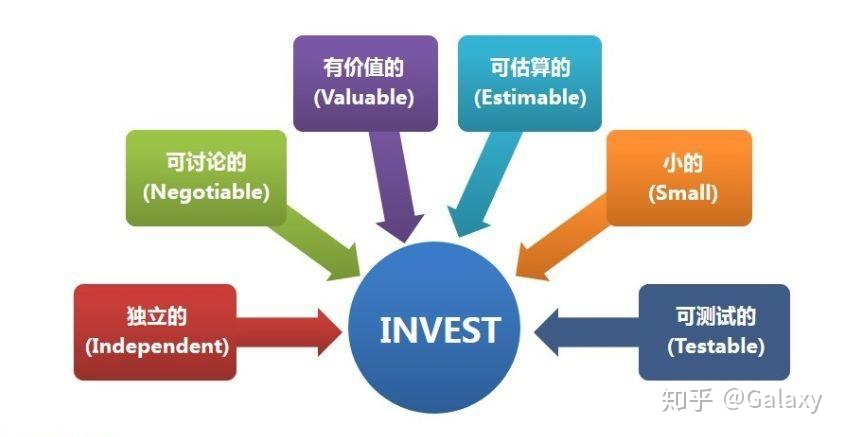

# 第一章 什么是敏捷框架

Scrum敏捷框架是什么？这个词像是高大上的底层框架，或是码农们才能理解的专业术语，可能会令你觉得无所适从。不过不用担心点，实际上Scrum比你想象的要简单得多！

## 什么叫做“框架”

让我们先从基础开始说起。“框架”是什么意思？框架是软件开发中最经常使用的术语，它为特定的问题领域提供一系列功能和解决方案。这意味着，您已经在这个领域中有了基础工具包，但不同的工作和需求随之而来，你也会不断改造，购买，优化这个工具包。

这就好比，英国人每天早上都泡一杯茶。你每次都往杯子里放一些调料，但没有一个固定的量。所以，有时候可能会加更多的糖，有时候可能会忘记了加柠檬。虽然味道会有一点点奇怪，最终你还是会得到一杯茶，至少能喝。

突然有一天，你灵机一动，想到了一个更加高效的办法。先测量出一杯茶中所有配料的比例和克数，然后把所有的干料都放在一个容器里，再配上一个大小差不多的汤勺。从那时起，只要舀出一勺料，就可以得到一杯完美的茶。节省时间，删繁就简，这正是框架发挥的作用。对于你而言，可以自由更改框架，以满足其特定需求。有助于提高生产效率，使工作变得更容易。

## 什么叫做“敏捷”

敏捷本身意味着能够快速，轻而易举地完成特定动作。但敏捷是怎么和循规蹈矩的框架结合呢？我们已经知道，框架是一套工具，我们可以使用，改良这个工具包来完成许许多多任务。敏捷框架是指一种用于软件开发中的的项目管理方法，其特点是能够将原本遥遥无期的交付任务，转化为短而频繁的一个个工作小阶段。

基本上，敏捷框架的过程不是有一个长项目，而是通过将所述项目分解为较小的增量来使用。这使得每个人一次只关注一件事，这有助于质量控制。它基于9个不同的“原则”，用于通知和激励安全或规模化敏捷框架的角色和实践。规模化敏捷框架是一种帮助您以更简单的方式完成任务的框架。它包括对计划的适应性和灵活性，以及一些不同的方法或原则。

## 企业级项目管理的9大准则

## 1.经济效益视角

使用敏捷框架来管理您的项目，其中最大原因，是它能在最短的时间内，以最大化的价值和效益，为您的项目相关方提供最高质量的产品。然而，你需要先理解企业或产品的战略定位，确保在正确的定位，战略和大经济形势下做出决定。也就是说，你需要理解，什么产品对客户是有价值的，什么产品组合对客户是相对有高价值的。

## 2.大局观和系统化思维

一个系统是非常复杂的，计算机/信息系统也是如此。它有许多不同的组件，所有组件都在一起，协调配合，共同工作，并且每项工作都导向一个最终目标。如果说要作出改进和优化，每个人都需要理解系统的目的。在构建你的APP，信息系统，甚至是你的团队组织中，至始至终，你都应该运用系统思维。

## 3.考虑多样性与选择性

所有系统和产品设计开发的一个倾向，也可以说是误区，就是在开发开始时只选择唯一的技术选型。在这样孤注一掷的起步中，一旦发生失误，就会导致不断的转型和重构。这有可能把一个项目推入死亡行军。

## 4.快速学习，持续集成，逐步构建

解决一个超延期+上线见光死项目的最佳方法，是在一系列短迭代快交付中探索解决方案。改良并迭代之前的版本，允许并宽容客户反馈，这意味着每次改动带来的风险更小。迭代也可以为前期的内测打下基础。早反馈，早定向，早修正。

## 5.公开评估里程碑

你应该安排与研发工程师、企业内部相关方（领导，销售，客服等）和客户（金主爸爸）进行的定期交流评估，为你提供财务、技术和战略指导。你们都有责任，也有义务确保要出售/使用的产品能带来经济效益。所以，在每阶段工作有所产出后（达到里程碑），安排这些评估交流的机会就非常重要。每个参与者均可在整个开发周期中各抒己见。

## 6.明确和减少WIP、规范并管理任务队列

使用敏捷框架的一大要点，是实现价值的持续流动，并允许团队中新功能快速、明显地推进。有3个关键该您，可以帮助你更好的理解持续流动：

· WIP：开发在制品，正在开发的需求，已经决定准备开发的需求都是WIP。明确WIP的存在并调节WIP数量非常重要，这也减少了对不必要的变更请求。对于团队来说，在一定的变更口径之下，一次承诺的在制品模块越多，被要求变更的可能性就越大，造成的打断和返工就越频繁。

· 减少每次研发的交付数量，对单次研发速度和质量都有很大的帮助，最主要的是给予团队我 们能做到而且能做好的信心。

· 在任务队列的长度上进行优化，细化每个任务或是减少一些边缘任务，都是加速交付的好方法。

## 7.把握节奏，拟定跨职能计划

节奏有助于为团队提供一定的可预测性。当我们使用跨职能计划时，我们能够理解并包容许多不同的观点，同时关注并聚焦问题。即使在产品开发过程中存在不确定性，我们的团队也能够相互理解，从而更有效地运作。

## 8.打开思维，鼓励创造

团队的前进动力中，不能缺乏新思想、创新力和对未知的好奇心。更不用说在发薪水时，会导致内部的不公平竞争。鼓励创造，宽容失败，可以提高员工敬业程度。这将为整个企业和客户带来更好的回报。

## 9.分散决策，规避风险

当需要实现快速而有价值的交付时，需要进行分散决策。它有助于减少沟通延迟，实现快速反馈，改善开发流程，并带来更多创造性方案。当决策需要层层批准，可能会发生许多延迟。这些延迟带来更高的成本和内部损耗。让每个人都参与到决策体系中，既加深了不同视角对产品的理解，也加速了研发流程。

## **第一章总结**

综上，为什么要使用敏捷框架呢？比如说，我们已经在一个项目上工作了很长时间，终于要交付拿尾款了。但是甲方爸爸们还想要改一改特性，或者功能。这意味着你必须回去修改，浪费时间和团队生产力，也带来的额外的成本（996不给加班费，电费总要钱吧）。

使用敏捷框架，不仅涉及到你，而且涉及到包括客户、利益相关方，和开发团队的每一份子。这样你能够将工作流细化，从而节省金钱、时间，并有助于提高客户满意度。在这个过程中，项目在调整中不断适应，进化并前进，最终比原来闭关蛮干效果好的多。

# 第二章 敏捷宣言

虽然精简工作是非常重要的，但在敏捷框架的使用中，其他规则的确立也很有必要。我们希望这套框架不仅提升效率和客户满意度，更强调了一种敏捷的世界观——与所有人一起工作并保持沟通。并接受以变应万变的事实。这意味着我们需要具备包容变更的能力和态度。

事实上，敏捷宣言的提出，是证明敏捷框架应该被使用的重要论据。

## 敏捷宣言

我们一直在实践中探寻更好的软件开发方法，身体力行的同时也帮助他人。由此我们建立了如下宣言：

- 个体和互动 高于 流程和工具
- 可用的软件 高于 详尽的文档
- 客户合作 高于 合同谈判
- 响应变化 高于 遵循计划

## 把宣言落地

在使用敏捷框架时，记住上面的宣言并将它们实际运用到你的工作中。在思考问题的同时，不忘初心，牢记最重要的目标。我们的工作时为了满足客户的预期，而不仅仅是交付一个最终产品，应该从项目一启动就为之努力。为了做到这一点，试着接纳各种变化，甚至是开发后期的需求变更。敏捷框架对变更的接受自由度非常大，以便你的客户随时都具有优势感和满意度。

## 持续交付

尽可能频繁地交付工作成果也很重要。其中一个原因是，我们可支配的工作时间可能从几周到几个月不等，而较短的时间要求我们尽快交付。另一个重要方面是，围绕核心利益方来构建项目，进行研发可以获得更有价值的成果。因此，作为项目管理者，我们需要确保给予这些利益相关方足够的支持。

## 多方协作

投资者，客户和开发团队要共同协作直到完成任务，在此期间，我们还要确保以最佳方式来完成。毕竟，最好的架构、需求和设计来自于自组织自驱动的团队！一个杰出的团队能够以正确的动机和正确的态度来完成任务。团队还需要思考，如何在整个工作过程中尝试提高效率。如果我们有更好的方法，就应该立即调整并尝试。

当团队紧密合作时，记住最好的沟通方式就是面谈。当通过电子邮件和电话交谈时，我们可能遗漏很多重要信息。许多人通过肢体语言来理解某人在说什么，这些信息其实都非常重要。你可以从眼神，动作，语气中获知他们对于功能优先的思考，对于未来市场的看法等等。但如果单纯通过电子邮件，很容易产生误解或疏漏。

## 平衡的艺术

一定要记住，持续关注卓越和良好的设计和工作习惯，可以提高团队的敏捷性。换句话说，如果你一边开车，一边及时补充燃油，那车就能按预期平稳行驶。忽视燃油情况对你的长途旅行来说是个隐患。将研发团队的开发成果——软件，看做是一种“进度报告”，是衡量目前工作进度与表现的可持续方法。我们欢迎利益相关方、开发人员、客户都看到我们保持稳定的研发节奏。使用敏捷框架的关键是简单化，最大化未完成工作量，是一门管理的艺术。

# 第三章 什么是Scrum

那么，Scrum何以胜任频繁的需求变化呢？敏捷框架提供了不同的方法，您可以根据自身团队和项目的需要，使用不同类型的工具。这个就像尝试不同品牌的服饰，挑选最舒适的下单。这些方法（或敏捷框架的类型）都是“轻量级方法”。这意味着所有的规则和实践对团队带来的实施负担是最低的。这些方法还同时确保开发人员之间的协作和共同决策。

在实践中，特别需要注意的是，每个开发人员都有不同的知识，性格和身份背景，这使得团队能够更快、更有效地工作。如果你的团队成员背景相同，他们遇到一个无法解决的问题，那怎么办？大家的性格，知识与技能互补，团队将更有凝聚力。反过来，团队将创造其他意想不到的惊喜。记住，敏捷开发思想的大局观，是以小的增量逐步推动大的成功。每一个单独的增量都是要经历完整测试的，这就确保了产品在特定的生产时间内具有质量保证，而不是在最后来确定质量（独立增量-质量内建）。

总的来说，敏捷框架是一个容易接受，有章可循的过程，确保着足够的价值产出。它的设计使包括客户在内的每个利益相关方，都能在项目开发期间提供反馈。从当下看，这能尽快帮助团队规避问题，从长远来看，团队总体效率也比以往更高。

虽然敏捷框架有很多不同的选择，敏捷方法伞下也有很多的实践（Nexus，SAFe4.5，XP，SoS，LeSS，DAD），但最流行的选择是Scrum。

Scrum是一种应用广泛的敏捷框架，它可以管理和控制不同类型的迭代和增量项目。当需要处理许多不同类型的项目时，它容易上手而且效果显著，同时确保产品的价值不会缩水。它具有强大的团队协作理念和相关要求，这有助于以最佳方式完成工作。同样，Scrum是关于团队工作和沟通的。Scrum过程中规定了不同角色，每个人都必须认真对待，按照规则团结协作。如果每个角色都不能胜任他们的工作，那么这个过程就会失败。所以在对于团队成员的能力要求上，Scrum框架的实施是有一定门槛的。

## 三个基本原则

更进一步地说，Scrum有三个基本原则：

1. 公开透明
2. 详尽检查
3. 逐步适应

## 公开透明

这一切是为了让大家觉得未来可期，确保每个人都知道当前的项目位置与工作余量。所以清晰、简洁地标识出每个人的状态很重要。如果你在其中想隐藏一个错误或风险，从长远来看，这只会使事情变得更糟。所以，在整个过程中保持透明是相当重要的举措。

## 详尽检查

详尽检查是为了在团队内确保一种责任感。每一次冲刺都需要评审和检查，以确保我们全部的交付都如期完成并包含价值。如果我们没有检查冲刺，团队可能正在开发一个甚至可能完全于需求脱轨的产品。

## 逐步适应

适应可能是最重要的原则之一。市场会变化，战略会变化，工作和生活也会变化。对于Scrum团队来说，能够适应并一同去经历变化是非常重要的。客户可能随时改变主意，Scrum团队可以随之改变自己的工作节奏和具体方式。同样的，产品所有者也可以轻松更改用户故事列表。每一款产品在整个生命周期中，都会经历变化，适应性就是产品能否活下去的关键指标。不能拥抱改变，产品将永远无法在变化中达到平衡，整个系统最后不得不返工。

# 第四章 Scrum中的核心参与者

Scrum中有三个基本角色：

1. 产品所有者
2. Scrum Master
3. Scrum团队（也称为开发团队）

这些角色中的每一个都对应有特定的职责。它们需要履行对应职责，才能保证项目成功。还需要在共生关系中密切合作，以获得最佳效果。

## 产品所有者

这被认为是“产品汪”，“PM”，和“产品负责人”。他们是负责人，他们提出想法，并与Scrum团队合作完成这个想法。事实上，只有他能告诉Scrum团队该做什么，产品负责人应该是团队的唯一可信信源，以便于我们在源头上统一信息。

产品所有者往往更关注问题的业务层面，所以他代表的是客户和利益相关者。这个角色只由一个人来扮演，以防信息同步不畅带来混乱。产品所有者有责任确保产品未来的价值，这也是他们与Scrum团队紧密合作的主要原因。两个角色的共同任务是确保在正确的时间完成正确的事，就能保证项目成功。

产品所有者负责如下版块：

管理和构建产品的待办列表（BackLog）。Scrum产品所有者是唯一有权管理产品待办列表的人。他们的责任是创建，定义，管理产品的待办列表，并同时确定不同条目的优先级。这一点非常重要，因为产品所有者的工作是知道哪些需求最值得当下被实现，以确保及时完成业务目标。这也能确保Scrum团队充分了解产品待办列表中的某个项目。

进行利益相关方的管理。即产品所有者需要与各种利益相关方进行交涉，并且团队中只有他有这个权限。利益相关者与产品所有者讨论后得到的结果，再由产品所有者以更新待办列表的形式传递给Scrum团队。产品所有者还负责上线发布的安排规划。他们提出了上线计划，在什么时候所有的事情都到期了。他们也是分析模块价值含量的人，优先级和待办列表由他们全权决定。

## Scrum Master（敏捷教练）

敏捷教练被认为是团队的总教练。他们的工作是确保Scrum团队遵守敏捷价值观并付诸实践，并优化工作流程。他们尽一切可能确保Scrum团队优先执行产出价值最高的任务，并为团队的前进之路清理障碍，消除干扰。好的Scrum教练有助于保护Scrum团队不被过度承诺；产品所有者可能会对Scrum团队施加压力，并试图让他们在冲刺过程中做得太多，而做的越多，质量越差。

另一方面，Scrum教练还确保团队不会过于自满，并且能够及时完成他们该完成的工作。这些都是帮助团队把握研发节奏。Scrum教练还必须直面管理的权力矛盾，实际上他们没有权力来全权控制Scrum团队。他们可以分配任务，协调解决问题，但不能解雇或雇佣任何人。他们是和成员们一起工作的专职助手。丹不能命令某人一定要做某件事。但是，Scrum教练的权威又必须是整个团队都认可的。

为了有效地完成工作，Scrum教练应该精通开发、运维、人际沟通等多方面的知识。在整个冲刺过程中，需要使用到方方面面的技能，所以Scrum教练的能力非常重要。

在这个框架中，Scrum教练还负责组织开展每日会议、冲刺计划会议、冲刺回顾会议和冲刺评审会议。

## Scrum团队

Scrum团队，也称为开发团队，是具体负责完成交付相关所有工作的角色。他们为了保证客户的产品交付而工作。他们必须以一种强烈的紧密结合的“团队”心态对待每个项目。一般来说，Scrum团队通常由6到10个成员组成。根据需要，可能会有许多不同的Scrum团队参与其中。保持每个团队人数在可控范围内，并正确完成工作是很重要的，但有时会有一个更大的项目，需要更多的Scrum团队。对于所有这些团队来说，协调以确保每个人都在同一个页面上是非常重要的。为了实现这一点，他们召开了名为“Scrum of Scrum”的会议。每个团队选择一个代表，由他们进行跨团队协调，帮助他们更好地合作。会后，代表们再回去向他们各自的团队汇报工作。

每个Scrum团队成员都有特定技能，他们在这些技能都应该受过充分培训，并经验丰富。这意味着每个团队内的成员都来自许多不同专业领域。这样的团队可以确保项目进展不会受到阻碍，并且能够实现人人互助。为了让合作协调更加顺畅，每个成员都应该遵循规则，明确目标，并相互尊重信任。正如最初组建团队时一样，这一过程中可能会出现各种各样的冲突，矛盾和突发情况。虽然一个新的团队一开始可能会让我们失望，但时间会调整彼此关系，我们也会努力完善这层关系。通常，在团队完全磨合之前，平均需要3轮冲刺的时间，大概是6-8周。

团队成员必须明确每日Scrum会议的时间和地点安排，同时遵循编码指南、学习团队协同工具以及明确“完成的定义”。完成的定义用于决定是否我们真正完成了一项工作。如果运气不佳，失败确实发生了，失败也不会，不能也不应该指向某个特定的团队成员。Scrum团队是一个整体，并且也是作为一个整体失败。Scrum团队的成败指标，是他们在冲刺结束时承诺交付什么，每个交付结果如何分解成单条任务，谁执行这个任务，以及每个任务的执行先后优先级。

每个Scrum团队都有被规约的Scrum任务。他们必须执行每日的sprint会议，理解产品待办清单，规划每一个冲刺，确保产品能够如期正确交付，并且必须实时汇报状态和任务余量，以便创建sprint燃尽图。

# 第五章 Scrum中的非核心参与者

正如Scrum中需要必要的核心角色参与一样，也有一些非核心角色。虽然这些角色对于Scrum项目不是强制性的，也没有没有其他角色那么重要，但是它们仍然有存在的价值和意义，这些角色包括利益相关者、供应商和Scrum指导机构。

## 利益相关者

利益相关者(干系人)是一个术语，这个概念包括了与产品所有者、Scrum教练和Scrum团队进行协作的客户、项目发起人和最终用户。他们的工作是提出想法和需求，帮助丰富项目内容，其影响力涉及整个项目开发的生命周期。

**客户**：是那些购买项目产品或功能服务的人。一个组织的项目完全有可能在本组织内拥有客户（内部客户），或者在该组织外拥有客户（外部客户）。

**用户**：是直接使用项目服务或产品的个人和组织。就像客户一样，用户也区分为内部和外部用户。客户和用户甚至可能是同一批人。

**项目发起人**：是为项目提供资金和资源支持的个人或组织。利益相关者也是都要对项目最终负责的人。

## 供应商

供应商是外部人员或组织。他们提供的服务和产品通常不在项目组织内。它们有助于带来原来团队没有的资源，技术，理念和其他有帮助的东西（如软件包，参考方案，管理工具，甚至是团队下午茶）。

## Scrum指导机构

Scrum指导机构是可选的，可以是一系列工具书和指导手册，也可以是一组专家团队。他们的职责是帮助项目合规、保障实施安全、确定硬性质量指标等有关参数。正是这些指导方针帮助产品所有者、Scrum教练和Scrum团队以一致的方向开展工作。

Scrum指导机构也是了解有哪些最佳实践，何时团队应该使用何种最佳实践的良好渠道。请注意，Scrum指导机构并没有做出任何关于项目决策的权力。它为项目组织中的每个人提供指导和咨询。它对Scrum团队特别有用，若有需要，应该随时向Scrum指导机构寻求建议与帮助。

# 第六章 Scrum工件

什么是人工制品？在考古学术语中，器物是指人为制造和加工的物品，如青花瓷瓶，方孔钱币等。基本上，人工制品是人类为了解决问题而特意制造的产物。Scrum敏捷框架使用“工件”这个词来表述制品；在开发过程中会发生什么，正在计划的活动，以及已经完成的活动。在一个项目中可能会有很多工件，但是主要的工件是：

## 产品待办列表

一个需求业务列表，列出了未来所有版本中需要研发的所有需求、功能、特性和缺陷修复计划。随着产品的推广和使用，客户提供的反馈越来越多，产品功能走向也会发生变化，有时甚至是非常大的转变。根据技术限制、业务需求和市场情况，待办列表甚至可能与之前预先的完全不同。待办列表是发展变化的，只要产品存在，待办列表也会随之存在并更新。

通常，产品待办列表中会为每个条目具有写明描述、估算、权重和优先级。但它不是一成不变的，而是根据产品情况不断调整的。产品负责人是唯一的列表维护者。团队还需要定时进行”产品待办列表优化“。Scrum团队向列表中添加细节、制定优先级和评估，他们也决定着何时以及如何进行优化。改进过程包括：审查最高优先级的项目，询问更多有关信息以便明确客户需求，删除不再需要的项目，加入新项目，对项目进行优先级排序，重新定义验收标准，改进细节等以备将来的冲刺。产品待办列表的详细信息越多，产品需要投入的资源就越多。为了完成这个项目，有必要进行精确的估算。

因此，一个列表项目的细节越少，就意味着它在列表中的位置就越靠后，需要花费更多时间来明确与开发。一旦Scrum团队获得了关于它的更多细节，就可以在列表中调整优先级。

## 产品待办列表写作的INVEST标准

**写作要素和标准**

1. *角色：谁要使用，为谁而设计？*
2. *功能：这个功能是有什么作用，要达到什么程度才算发挥作用？*
3. *商业价值：为什么要这个功能，能带来什么商业价值，对用户有什么意义？*
4. *用户故事格式：作为一个 XXX, 我想它实现 XXX, 以便于 XXX。*

**独立（Independent）**：要尽量避免故事间的相互依赖，相互依赖会导致工作量估算更加困难。

**可讨论（Negotiable）**：条目的细节将在客户团队和开发团队的讨论中产生。故事卡的作用是提醒开发人员和客户进行关于需求的对话，它并不是一个写死的具体的规范。

**有价值（Valuable）**：用户故事应该很清晰地体现对用户或客户的价值，最好的做法是让客户编写故事。

**可估算（Estimable）**：开发团队需要去估计一个用户故事以便确定优先级，工作量和工作计划。难以估计故事的问题来自：

1. *开发人员缺少领域知识和业务相关背景；*
2. *开发人员缺少技术知识；*
3. *故事太大了。*

**大小合适（Small）**： 一个好的故事在工作量上要尽量小，最好不要超过10个理想人/天的工作量,至少要确保的是在一个迭代或Sprint中能够完成。

**可测试（Testable）**：故事必须是可测试的。成功通过测试证明了开发人员正确地实现了故事。如果一个用户故事不能够测试，那么我们就不能确定它可以被称为完成。

## 冲刺计划列表

Sprint计划列表可以被看成Scrum团队马上要实施的“待办事项”列表。它是为未来的冲刺选择的一组需求，加上详细目标和交付增量的具体工作计划。基本上，它显示了Scrum团队在下几个冲刺中需要做的全部工作，以达成冲刺目标。

每当新工作出现时，就将其添加到Sprint冲刺计划列表中，不必要的工作也会随时被移除。它专门为实施设计，帮助团队保持专注。只有Scrum团队可以在两个冲刺的间歇期间更新这个列表。它被认为是Scrum团队在一个冲刺过程中的实时快照。

## 燃尽图

在传统意义上，这不是一个Scrum工件。然而，这个术语经常出现，所以把它放在这边啦~当我们进行sprint冲刺时，团队可以跟踪当前剩余的工作总量。这也是了解DEADLINE和剩余时间，实时调整团队的最佳监控方式。Scrum团队使用名为燃尽图的图标来进行展示。产品所有者将实时情况与预期的理想状态比较，以便明确项目进展。同时，也方便利益相关者能观测项目进展，并随时参与进来。

## 增量

这是最重要的Scrum工件。增量是当Scrum团队将冲刺期间完成的交付物与之前的结合在一起所获得的产物。在每个冲刺结束时，这些被称为”增量“的产物必须是完整的，可用的，有质量的。这意味着它必须满足Scrum团队最初对于“完成”的定义。“完成”的定义是Scrum团队在创建时用规范形式专门定义的。这个定义对于不同Scrum团队来说也可以不同，并且随着团队的发展趋于成熟。

即使产品所有者决定这些增量近期不上线，产品仍须处于可工作的就绪状态。Scrum团队在增量上，意见可能会有所不同，但成员必须对“完成”有一个共同的理解。sprint的目的让项目和产品在每个sprint中都获得完成的增量。知道了每个冲刺完成的增量信息，产品所有者可能会选择立即发布，也可能另定发布时间。每个单独的增量都会被集成到先前的增量中，并进行回归测试，以确保所有增量都能正常运行。而且，随着Scrum团队工作的推进，他们对增量的定义应该会有越来越明确的标准。对于任何产品来说，我们所做的任何已完成工作，都算产品的增量。

我们定义增量这个工件，是为了更好的描述产品和冲刺待办列表需要完成的工作，这些工作将为项目持续增加价值。产品增量是在冲刺后已经完成的产品新增的那部分。每一个增量的存在，都给予Scrum团队明确的到期目标。这有助于团队了解他们如何实现冲刺目标，也有助于清除片面的障碍，使大家对目标都有一个共同的理解。

# 第七章 Scrum工作流

Scrum项目可以处理很多问题。在我们的项目工作中，有许多事正在发生，每一件事都需要管理和跟踪。甚至术语本身也可能有点让你应接不暇！但不用担心，Scrum项目有5个基本的活动来确保最佳的产品开发工作流。这助于提高团队研发能力，使项目至始至终都更加高效。这也可以作为Scrum标准工作流程。

## 1. sprint冲刺

由Scrum团队执行，sprint是团队创建产品功能的短期开发时间段。冲刺通常持续1到4周，甚至可能只需要一天。公认的冲刺应该具有较短的开发周期，因此不应超过4周。计划的经济价值取决于冲刺的持续时间，所以如果它比原来想象的要长，那就意味着花费了更多的成本。

## 2. 冲刺计划

Scrum团队在每个冲刺开始前会进行讨论，在这里他们决定并承诺冲刺目标。产品所有者展示产品需求待办列表，解释每个任务条目，并为团队分配任务。Scrum团队还需要结合这个冲刺中需要完成的需求，计算完成所需的预计投入。另外，scrum团队将把每个特定需求拆解成很多单任务。

## 3. 每日站会

一个简短的15分钟每日例会，包括Scrum教练都参与其中。在这次会议中，Scrum团队成员协调他们的优先事项。他们讨论今天应该完成使命，前一天已经完成了什么，以及自己碰到了什么障碍导致无法完成。这样做首先简化了冗余的无聊会议，还能防止即将发生的意外。

## 4. 冲刺评审

这个会议由产品所有者主导，并在每个Sprint结束时举行。在这次会议中，Scrum团队向产品所有者展示在前一次冲刺中完成的增量。然后，产品所有者决定是否更新整个产品待办列表。如果团队做得不正确，可能需要在下个冲刺中继续修正。

## 5. 冲刺回顾

类似于冲刺评审，这是在每个Sprint或项目之后召开的会议。然而，它不是由产品所有者主导，而是由Scrum团队本身发起。讨论哪些步骤进展顺利，哪些做法还要完善，以及如何进行完善。同时如何使团队在出现问题时更高效地解决问题。在这个过程中，不要怕暴露问题导致的难堪，否则可能会给未来工作带来隐患，阻碍项目的继续进行。

# 第八章 敏捷评估与测算

在每个冲刺中，团队可以想出不同的方法来决定项目的敏捷评估。没有错误的方法，每个团队都应该选择最适合他们的。

## 1. 敏捷扑克

团队成员一起评估每一个任务，以平等投票的方式来估计所需时间。如果投票结果相差非常非常大，那出牌人就要就继续讨论，所有人旁听或参与。这样团队成员就能够对每一条冲刺任务从时间，边界，完成定义等方面均都达成共识。

## 2. 桶系统

这项技术使用与计划扑克相同的估算方式。通过把每个任务条目放在一个列表中，估计项目的总成本。团队可以保存并往这个列表内放任何任务。因为有分而治之的阶段，所以这种估算方式对于有很多模块开发经验的团队来说更快。这项技术还可以用于批量估计更多的项目。

## 3. 模糊估计，大/不确定/小

当Scrum团队需要更快但粗略的敏捷评估时，模糊估计是一种很好的方法。需要估计的项目分为三类：大、不确定和小。团队首先只讨论其中的几个问题，然后使用与桶系统和分而治之的技术来解决剩下的问题。

## 4. 边缘估计，TFB/NFC/1

这种技术与 第3种 非常相似，但增加了边缘概念，以应对意想不到的估计情况。TFB是这个用户故事太大（接近于史诗量级）以至于无法估计。NFC是这个用户故事的细节不够，太过于模糊以至于得不到估计。1表示这个用户故事在一次冲刺中（大约）可以交付。

## 5. 点投票

一种简单且非常有效的技术，仅用于估计少量项目时效果最好。每个团队成员都会被传递少量的点，并使用它们来显示项目的大小。一个项目的点数越多，估计值就越大。

## 6. T恤尺寸估计

我们用T恤尺寸作为单位：XS、S、M、L、XL。虽然你会觉得这种描述很搞笑，还有点不正式。但需要快速估计大量条目的时候，还是不错的（这个我自己用过，确实是不错，就是一次处理这么多条目眼睛不太舒服）。这些规模单位是通过开放讨论来确定的。如果估计出现了僵局，那么团队可以投票决定他们认为最适合的尺寸。你甚至可以自己加入一个单位，比如XXS。

## 7. 关联映射估计

这项技术都是基于项目的相似性来组合估计项目。讨论项目方向，并看看团队是否有实施相似项目的经验。当项目数量较少时，关联映射估计最有效，因为它实际上是一个有历史根据的推理估计方法。

## 8. 排序

使用从低到高的简单规则，对项目进行顺序排列。每个团队成员都可轮流更改这个排序。他们可以通过将一个项目降低预估或提高预估来改变项目的顺序，这也增进他们对项目内容的项目讨论和理解。如果每个人都决定对原有估算进行改变，那么就应该更新原有预算。

## 9. 划分最大和最小预算限度

团队为每个项目选择最大预算，例如5人一天的工作量。他们必须确定每个项目是否已经达到最大预算。如果项目最终大于预先确定的大小，那么团队需要再分解，然后对子项重复此过程，直到每个项都在合理范围内。

------

除了这些技术之外，在进行敏捷评估时还需要遵循一些原则。团队必须记住，这些技术应该是以协同为基础的，这意味着每个人被要求参与其中。这些技术也促进了团队团结；同时也是为了不让任何人因错估而受到指责，因为不可能追踪到谁估计了什么。估计被认为是一种非增值的活动，所以我们需要这些技术，尽可能地提高效率。进一步来看，敏捷估计不需要实际的细分单位（如每人每小时）。使用模糊的相对单位点，并将每个任务条目相互比较，可以避免将具体内容与抽象概念相对比时发生的混乱。

# 第九章 分阶段冲刺与交付

将一个团队的人聚集在一起，完成Scrum可能是一项困难的任务（框架是好，但是实施起来人艰不拆）。我们要确保每个人都朝着共同目标努力，并且需要让大家组成一个真正的小组。

这个过程有五个步骤，确保Scrum团队的磨合尽可能成功。前4个阶段（形成、风暴、规范和表演）由布鲁斯·塔克曼于1965年提出。塔克曼表示，这些阶段是Scrum团队成长的必经之路，他们逐渐磨合，面对挑战，解决问题，提出计划，发掘解决方案，并尽最大努力交付成果。塔克曼后来在1977年加入了第五阶段（休会）。

有趣的是，特别是在敏捷软件开发中，团队会表现出一种称为“蜂拥”的行为。表现为团队聚在一起，合作，并专注于解决一个特定的问题。

我们都希望拥有成熟和高效的Scrum团队。但磨合的过程需要时间。大多数公司更关心直接的结果，而不是从长远出发，考虑团队建设的重要性。这样的价值观将不利于带领Scrum团队走向成功。

## 1. 形成阶段

让Scrum团队成功地起步非常重要。此阶段主要让团队成员相互了解并找出他们的共同点。团队借助这个共同点，无缝协作并沟通交流。如果跳过此步骤，团队可能会很难完成后续步骤。这个阶段磨合的一种方式是做有趣的团建破冰活动。团队成员可以分享个人背景、他们喜欢的电影、音乐或食物。这将帮助他们相互了解。

在这一阶段，团队需要依赖于一位组长的指导和指导。成员们正在寻求团体的认可，并希望感觉到团体带给他们的安全感。他们希望工作任务简单，避免矛盾和争论，这意味着这个阶段尽量避免严肃话题和氛围。在这个阶段，团队定向也起着很大的作用。团队成员不仅要更加注重彼此的感受，还要更加注重任务分配。通常，工作讨论可以围绕特定任务、如何处理任务来展开。为了让团队成员从这个阶段中成长，他们必须冒着冲突的风险，走出舒适区。

## 2. 暴风雨阶段

找不到比暴风雨更合适的名词来描述这个阶段了。这一阶段最有可能引发冲突和竞争。“对失败的恐惧”或“对暴露的恐惧”是这个阶段最大的挑战，团队中弥漫着对澄清理念和承诺预期的渴望。成员们都在质疑谁将负责，如何负责，具体规则，奖励制度，以及评估标准。甚至会带来个人的态度转变。团队成员可能相互结盟，尤其是已经熟悉的其他成员，还可能有复杂的派系。有些成员可能会觉得沟通更加自由了，而另一些成员则会渐渐倾向于保持沉默。最终可能会让Scrum团队感受到破裂的气息。

优化工作方式，找到阻碍团队完成目标的根源是很重要的。解决冲突的最佳方法莫过于通过强化沟通与协作，这也是团结的唯一途径。如果Scrum团队已经建立并且工作了一段时间，他们可能已经知道彼此的工作方式。如果磨合还不够，对每个成员来说，最重要的就是每个人倾听与包容的能力。

## 3. 规范阶段

这个阶段是关注的是团队凝聚力。对于每个成员来说，承认彼此的贡献、尝试解决问题非常重要。当其他团队成员描述事实，其他人必须学会倾听和包容。这应该与阐述事实同时进行。团队承认自我领导，不需要任何派系。所有成员相互了解，认同，信任。从而有助于团队整体发展。

为团队会议制定规则也很重要。团队成员需要制定基本规范，例如会议地点、持续时间，会议流程，甚至是冲突协调方案。包容，在Scrum团队中扮演着重要的角色。每个人都需要有归属感和安全感，这样他们才能真正投入其中。我们的主要目标，是找到一套人人认同的规则，并一同遵守。这样做将有助于团队尽其所能地工作。

当人际冲突得到解决时，团队会感到一种解脱。在这个阶段，团队的创造力很高，同时有一种开放和信息共享的感觉。每个人都以团队能完成任务为荣。这个阶段唯一的缺点是，成员们会抵制变化，以及害怕变化之后的不可预测。他们的第一心理会自主抵制变化的发生。

## 4. 执行阶段

并非所有团队都能到达这个阶段。如果有幸成功，这个团队就形成了一个紧密的团队，相互信任，高效执行。团队成员能够独立，分组，或整体工作，具有几乎同等的生产力。每个人的角色都可以根据群体和个人的需要进行调整。这是团队最具生产力的阶段。每个成员都变得自信，既有任务导向，也有人为导向。

大家会有某种团结的氛围。士气高，忠诚强，每个人都清楚了解自己的定位。此时对于任务的变更，大家对尝试解决方案不再抵制，而是强烈支持。团队能够很好地合作以适应变化。每个人都知道，当下目标是通过解决问题的心态和努力工作的行为来完成任务。如果团队遵循规范阶段的规则，那么生产力是最高的，也容易协调解决冲突。

## 5. 休会阶段

这一阶段最初没有，是后来增补的，但这不意味着这部分不重要！此时，团队最有可能实现了项目远景。当我们已经完成时，团队需要在更细致的层面进行检查。每个人都需要反思一下团队是如何合作的，是否有改进上升的空间。他们也可以利用这个机会和他人道别。

在个人层面上总结复盘非常重要，否则会有一种不完整的感觉。如果团队在未来的项目中重新团结起来呢？重要的是，他们要讨论成功的过程，以及失败的教训。在此期间收集的信息甚至可以用于下次评估和其他类似项目参考。所以，还是应该认真对待。

------

有时很难百分百遵循这些阶段。因为保不齐你的团队可能有特别顽固的人，或者不擅长沟通和合作的独行者。为了让团队发挥最大潜力，你必须灵活应变。团队可以采取一些措施来确保正确的磨合：

## 集团需要确保他们的权力

每个人都应该有一个“负责”的机会，这样做会产生一种包容和平等的团队氛围。

## 小组的目的和任务需要集体明确

应该经常检查与反思，以防我们在前进的路上遗失初心。任务完全有可能改变，这取决于每次冲刺后客户的反馈是什么。保持实时更新将有助于每一个人接下来做的更好。

## 规则非常重要，需要设立和遵守

制定规则有助于每个人明确发展方向，以及如果规则被打破或受到挑战该怎么做。

## 小组应该记住，冲突是一件积极的事情

冲突是完全正常的，有时甚至是必要的。每个人本来就有提出质疑和反对的权力。一个成员可能不同意另一个成员对用户故事的理解，或实现代码块的方式。由于两位成员的意见不一致，他们可能会发明全新的第三种方法来完成任务，这样效率更高。

## 应该互相倾听

一味发声，从不接收是没有效率的，而且会使团队陷入不安或怨恨。如果人们觉得自己有机会被别人倾听，他们往往会做出更好的反应，并且更乐于接受别人的意见。

## 会议应以建设性的批评结束

重要的是要互相帮助，解决问题，而不是互相追责。还有一点也很重要，那就是要记住，建设性的批评应该是关于团队的，而不是个人。

## 贡献自己，但贡献也有分工和范围

让一个人做所有的工作肯定会引发不公平的埋怨，产品也很难按时完成。同理，你不能让团队中没有贡献的人共享团队成功荣誉。因为这对团队里的其他人来说是不公平的。

# 第十章 Scrum的规模化应用

Scrum最初被引入团队，主要用于小型项目的管理。很多人相信Scrum是优良的管理实践，但不知道是否有可能规模化运用Scrum，因为没有具有说服力的的实践先例。那么，Scrum如何能够扩展到中大型项目团队呢？实际上，有一种叫做Scrum-of-Scrum的方式能够帮助我们规划化使用Scrum。这是在第4章中谈到的，这一章我们要探讨，Scrum-of-Scrum（SoS）是如何工作的。

## 构成与方法

Scrum团队在最优情况下，由6到10名成员构成。然而，如果需要超过10人，则需要划分为多个团队。更大的团队意味着我们有资源去实现更大的目标，但也需要每个团队之间的沟通协作与信息同步。

具体做法是：每个小组选出一名代表，然后与其他团队代表会面。他们互通进展、阐述障碍与挑战，并协调接下来的行动。会议的频率取决于项目的大小、项目的复杂程度、团队间的依赖关系以及外来Scrum指导机构的建议。

## 运作原理

那么会议是如何运作的呢？我们都希望团队中的任何两方之间能面对面沟通。然而，这并非轻而易举，因为团队可能有国家地区甚至是时差阻隔。如果发生这种情况，就需要借助社交媒体工具（IM）和视频电话会议。

这些会议被称为Scrum-of-Scrum的实施过程，由首席Scrum管理员运行，他们是来自不同团队的代表，以帮助首席执行官/产品总监，同时也是各自团队的Scrum管理者。对于特别大的项目，涉及许多不同的团队，可能需要分批举行多次会议。尽管如此，由于很难让每个人随时响应并面对面沟通，所以每次开会时都要讨论所有重要的事项。在会议开始之前，首席Scrum管理员会宣布议程，然后各个团队可以思考需要讨论的任何项目，包括任何可能影响团队的要素、变更，甚至是风险。即使是单个团队面临的单个挑战也应该及时提出，因为它总是有可能在集体内蔓延和扩散。

团队代表应把自己团队的进度信息透露给其他团队。这样做时，最好遵循以下4条准则：自上次会议以来，我的团队做了哪些工作？在下次会议之前，我的团队计划做什么？是否还有其他团队希望我们配合的工作？我们所做的对其他团队是否有影响？

## 核心目标

召开会议最核心的目标，是确保在不同的Scrum团队之间有密切的沟通协调。项目进展中，会有许多涉及团队间依赖关系的任务；这意味着一个团队的任务可能依赖于另一个团队的交付情况。所以，在团队中实行完善的信息披露是非常重要的。这样做可以确保最好的工作状态与结果。

# 第11章 Scrum大法好

那么，综上10章的内容，Scrum到底有什么好处呢？它可以为我们带来什么？为什么要采用？是否值得采用？

使用Scrum有几个主要的原因，总之，当下使用Scrum是十分明智。

## 应对变化

我们不得不面对新生市场竞争力的挑战和较量。市场变化的愈来愈快，只有采用更加灵活的方案才能应对。使用Scrum，团队可以保持灵活的节奏，从而取得独特的优势。最完美的一点是，它是一个可靠、成功的敏捷框架，在不同的项目和团队中反复得到验证。顶尖研究所使用它向客户交付项目。军队依靠Scrum为部署做好准备。即使在传统制造业里，一辆速度快、价格实惠、效率高、安全可靠、售价不到2万美元的汽车也是用Scrum制造的！

## 保持参与

Scrum还允许在开发的同事，让客户随之参与其中。客户能够在整个过程中不断获得新的版本，查看项目的进展情况，甚至在必要时加入新的想法。因为等到项目结束时，再一次性向客户展示可能是一个巨大的错误。之前埋下的隐患会爆发，浪费时间和金钱的重做也会接踵而至。

使用Scrum敏捷框架就是为了提高项目的透明度；让所有相关人员都有一个清晰的愿景。它还允许所有相关方实时监控把握进展，这有助于尽快发现发现缺陷，并使团队合作更加有效率，犯错更少。

## 质量内建

质量在Scrum中也扮演着重要的角色。每次冲刺中都已经集成了测试，通常是每天都会发生！这样做从一开始的最小组件就保证了质量，并允许及时发现并解决问题。

## 控制成本

Scrum也有助于降低成本，这是每个企业都喜闻乐见的。每个项目通常都有一个固定的周期，这意味着有一个确定的成本。虽然工作和一些细节可能会改变，但由于项目周期是确定的，冲刺的频率和轮次也是确定的，所以总成本核算是始终保持不变。