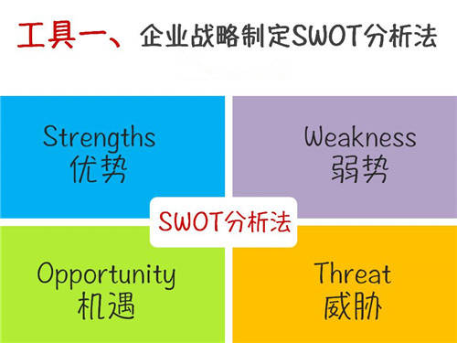
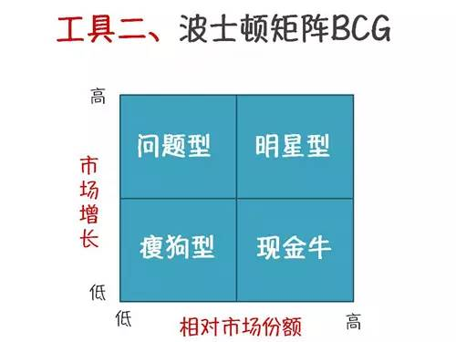
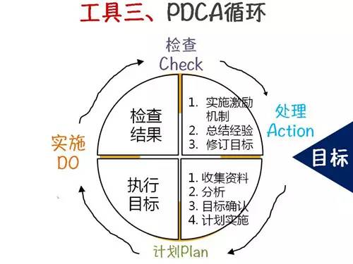
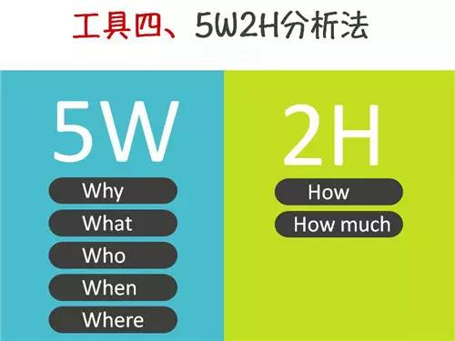
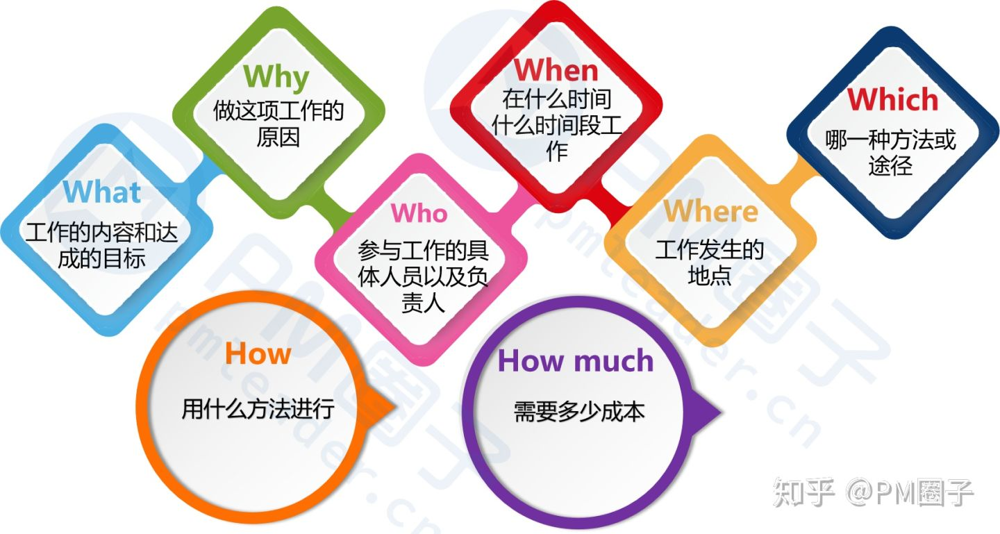
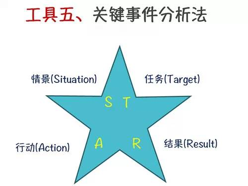
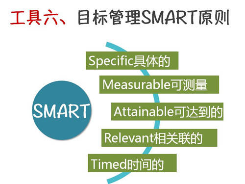
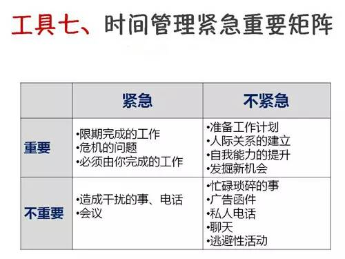
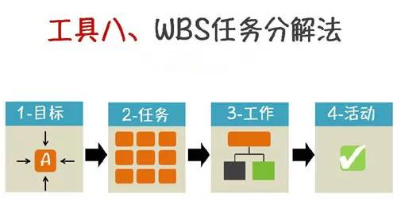

**每个人成功都不是毫无道理的，一定是有办法，有技巧！君子性非异也，善假于物也！今天分享八个工具最实用的总结，这些工具的名称你一定早已熟悉，但你是否知晓它们每一个的具体含义和用法？**

SWOT分析法帮助企业从四个维度进行综合分析，正确识别自己在市场中所处的地位，扬长避短，聚焦优势资源，在500强工作的员工，SWOT分析是必须具备的技能，特别是做市场的员工，全面的思考竞争对手与自身的优势，才能做出及时的战略调整，所谓知己知彼，百战不殆。

**意义：帮员工清晰地把握全局，分析自己在资源方面的优势与劣势，把握环境提供的机会，防范可能存在的风险与威胁。**

**1、问题型业务（高增长-低市场份额）**

它是处于高增长率、低市场占有率象限内的产品群。前者说明市场机会大，前景好，而后者则说明在市场营销上存在问题。其财务特点是利润率较低，所需资金不足，负债比率高。

**2、明星型业务（高增长-高市场份额）**

这类产品可能成为企业的现金牛产品，需要加大投资以支持其迅速发展。采用的发展战略是：积极扩大经济规模和市场机会，以长远利益为目标，提高市场占有率，加强竞争地位。

**3、现金牛型业务（低增长-高市场份额）**

又称厚利产品。它是指处于低增长率、高市场占有率象限内的产品群，已进入成熟期。其财务特点是销售量大，产品利润率高、负债比率低，可以为企业提供资金，而且由于增长率低，也无需增大投资。

**4、瘦狗型业务（低增长-低市场份额）**

也称衰退类产品。它是处在低增长率、低市场占有率象限内的产品群。其财务特点是利润率低、处于保本或亏损状态，负债比率高，无法为企业带来收益。对这类产品应采用撤退战略：首先应减少批量，逐渐撤退，对那些销售增长率和市场占有率均极低的产品应立即淘汰。

**意义：身为企业的员工，特别是营销人员，必须懂得将企业战略规划与资本预算紧密结合，波士顿矩阵能帮助企业识别出哪些产品值得投资，从而使业务组合达到最佳经营效果。**

自我管理在500强企业是很重要的话题，管理者没可能时时刻刻监督下属，如何在工作实现改进，PDCA的工作管理循环是一种不错的方法：

Plan制定每天的目标与计划-Do开展当天的工作任务-Check对工作过程的检查与每天总结—Action处理工作偏差，对成果进行量化，制定新的目标计划。

**意义与作用：可以使我们的思想方法和工作步骤更加条理化、系统化、图像化和科学化。**

员工在日常工作中要制定计划，这个计划不仅包括目标，而且也包括实现这个目标需要采取的措施；计划制定之后，就要按照计划进行检查，看是否实现了预期效果，有没有达到预期的目标；通过检查找出问题和原因；最后就要进行处理，将经验和教训制订成标准、形成改善工作的习惯。

**意义及作用：在职场工作，5W2H能快速帮助我们思路的条理化，特别是向上司汇报工作的时候更有逻辑性。**

Why为什么：为什么要这么做？理由何在？原因是什么？

What是什么：目的是什么？做什么工作？

Who谁：由谁来承担？谁来完成？谁负责？

When何时：什么时间完成？什么时机最适宜？

Where何处：在哪里做？从哪里入手？

How怎么做：如何提高效率？如何实施？方法怎样？

How much多少：做到什么程度？数量如何？质量水平如何？费用产出如何？

STAR分析法是HR必须掌握的技能，通过策略性的交谈与提问对应聘者的知识与才能做出判断，是很好的招聘面试工具。但其实STAR在职场的很多领域中都有它的发挥的地方，例如培训经理在分析企业内部业务所存在的问题时，STAR中的沟通技巧起到关键作用。

**意义及作用：人们在制定工作目标或者任务目标时，考虑一下目标与计划是不是SMART化的。只有具备SMART化的计划才是具有良好可实施性的，也才能指导保证计划得以实现。**

**S（Specific）具体明确的**

所谓明确就是要用具体的语言清楚地说明要达成的行为标准。特别注意的是，很多团队不成功的重要原因之一就因为目标定的模棱两可，或没有将目标有效的传达给相关成员。

**M（Measurable）可衡量的**

衡量性就是指目标应该是明确的，而不是模糊的。应该有一组明确的数据，作为衡量是否达成目标的依据。

**A（Acceptable）可达到的**

目标是要能够被执行人所接受的，如果上司利用一些行政手段，利用权利性的影响力一厢情愿地把自己所制定的目标强压给下属，下属典型的反映是一种心理和行为上的抗拒：我可以接受，但是否完成这个目标，有没有最终的把握，这个可不好说。

**R（Realistic）相关/实际性**

目标的实际性是指在现实条件下是否可行、可操作。可能有两种情形，一方面领导者乐观地估计了当前形势，低估了达成目标所需要的条件，这些条件包括人力资源、硬件条件、技术条件、系统信息条件、团队环境因素等，以至于下达了一个高于实际能力的指标。

另外，可能花了大量的时间、资源，甚至人力成本，最后确定的目标根本没有多大实际意义。

**T（Timed）时限性**

目标特性的时限性就是指完成目标是有时间限制的。管理者在下达任务的时候也应该明确注重完成绩效指标的期限。

时间管理与自我管理是职场员工必须掌握的两项关键能力，而紧急重要矩阵是一个简单易用的工具，特别是刚入职场的新生代员工。时间管理矩阵的四个原则：

第一象限的事情应该首先做；

把大多数的时间放在第二象限的事情上；

第三现象的事尽量少做；

第四象限的事最好别做；

**意义及作用：学会分解任务，只有将任务分解得足够细，您才能心里有数，您才能有条不紊地工作，您才能统筹安排您的时间表及行动计划。**

WBS分解原则：将主体目标逐步细化分解，每个任务原则上要求分解到不能再细分为止。

WBS分解的方法：至上而下与至下而上的充分沟通，一对一个别交流，小组讨论。

WBS分解的标准：分解后的活动结构清晰逻辑上形成一个大的活动。集成了所有的关键因素包含临时的里程碑和监控点，所有活动全部定义清楚。