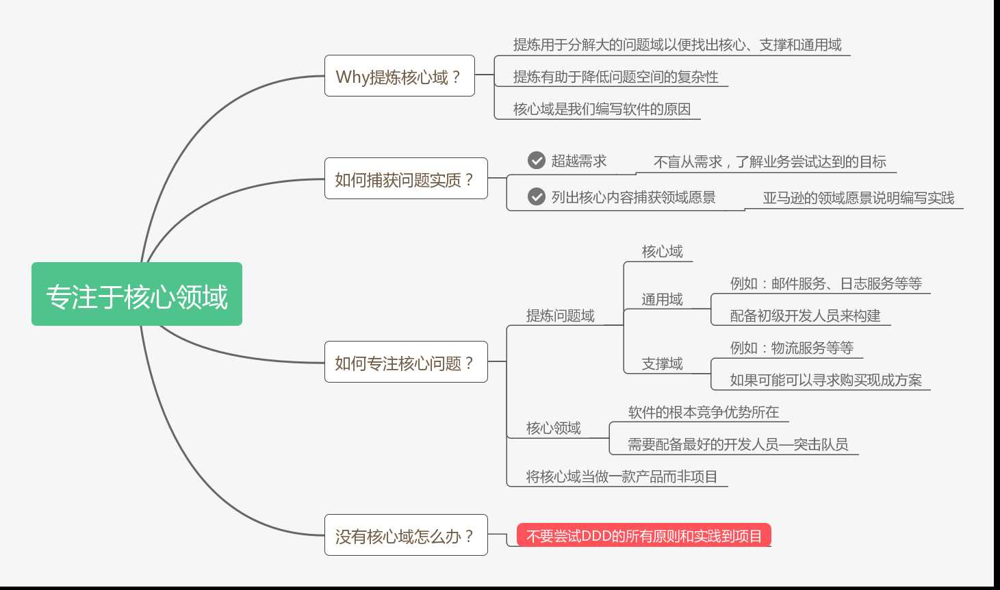
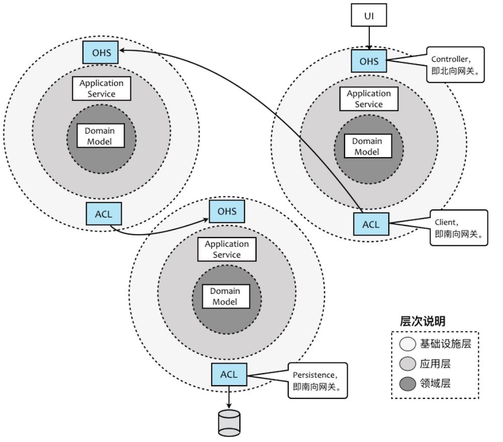

张逸：http://zhangyi.xyz/

# 基本概念

#### 实体(entity)

重点：具备唯一ID，是否是同一实体比较ID

根据eric evans的定义，”一个由它的标识定义的对象叫做实体”。通常实体具备唯一id，能够被持久化，具有业务逻辑，对应现实世界业务对象。

实体一般和主要的业务/领域对象有一个直接的关系。一个实体的基本概念是一个持续抽象的生命，可以变化不同的状态和情形，但总是有相同的标识。

#### 值对象(value object)

重点：不具备唯一ID，是否是同一对象比较值是否相同

值对象的定义是：描述事物的对象；更准确的说，一个没有概念上标识符描述一个领域方面的对象。

这些对象是用来表示临时的事物，或者可以认为值对象是实体的属性，这些属性没有特性标识但同时表达了领域中某类含义的概念。

#### 实体与值对象的区别

实体具有唯一标识，而值对象没有唯一标识，这是实体和值对象间的最大不同。

实体就是领域中需要唯一标识的领域概念。有两个实体，如果唯一标识不一样，那么即便实体的其他所有属性都一样，也认为是两个不同的实体；一个实体的基本概念是一个持续抽象的生命，可以变化不同的状态和情形，但总是有相同的标识。

如果两个对象的所有的属性的值都相同，我们会认为它们是同一个对象的话，那么我们就可以把这种对象设计为值对象。值对象在判断是否是同一个对象时是通过它们的所有属性是否相同，如果相同则认为是同一个值对象；而实体是否为同一个实体的区分，只是看实体的唯一标识是否相同，而不管实体的属性是否相同。

值对象另外一个明显的特征是不可变，即所有属性都是只读的。因为属性是只读的，所以可以被安全的共享；当共享值对象时，一般有复制和共享两种做法，具体采用哪种做法还要根据实际情况而定。

箴言：如果值对象时可共享的，它们应该是不可变的。（值对象应该保持尽量的简单）

值对象的设计应尽量简单，不要让它引用很多其他的对象，因为本质上讲值对象只是代表一个值。

#### 聚合及聚合根(aggregate、aggregate root)

重点：大部分的聚合都只是一个实体，该实体同时也是聚合根，并不是所有的实体都是聚集根，但只有实体才能成为聚集根。

聚合是用来定义领域对象所有权和边界的领域模式。聚合的作用是帮助简化模型对象间的关系。聚合，它通过定义对象之间清晰的所属关系和边界来实现领域模型的内聚，并避免了错综复杂的难以维护的对象关系网的形成。聚合定义了一组具有内聚关系的相关对象的集合，我们把聚合看作是一个修改数据的单元。

一个聚合是一组相关的被视为整体的对象。每个聚合都有一个根对象（聚合根实体），从外部访问只能通过这个对象。根实体对象有组成聚合所有对象的引用，但是外部对象只能引用根对象实体。

基于聚合的以上概念，我们可以推论出从数据库查询时的单元也是以聚合为一个单元，也就是说我们不能直接查询聚合内部的某个非根的对象；

聚合中的对象关系是内聚的，即这些对象之间必须保持一个固定规则，固定规则是指在数据变化时必须保持不变的一致性规则。

当我们在修改一个聚合时，我们必须在事务级别确保整个聚合内的所有对象满足这个固定规则。

通常在大部分领域模型中，有70%的聚合通常只有一个实体，即聚合根，该实体内部没有包含其他实体，只包含一些值对象；另外30%的聚合中，基本上也只包含两到三个实体。这意味着大部分的聚合都只是一个实体，该实体同时也是聚合根。

#### 工厂(factories)

工厂用来封装创建一个复杂对象尤其是聚合时所需的知识，作用是将创建对象的细节隐藏起来。客户传递给工厂一些简单的参数，然后工厂可以在内部创建出一个复杂的领域对象然后返回给客户。当创建 实体和值对象复杂时建议使用工厂模式。

不意味着我们一定要使用工厂模式。如果创建对象很简单，使用构造器或者控制反转/依赖注入容器足够创建对象的依赖。此时，我们就不需要通用工厂模式来创建实体或值对象。

#### 仓储（repositories）

仓储是用来管理实体的集合。

仓储里面存放的对象一定是聚合，原因是domain是以聚合的概念来划分边界的；聚合作为一个整体概念，要么一起被取出来，要么一起被删除。外部访问不会单独对某个聚合内的子对象进行单独操作。因此，我们只对聚合设计仓储。

仓储还有一个重要的特征就是分为仓储定义部分和仓储实现部分，我们在领域模型中定义仓储的接口，而在基础设施层实现具体的仓储。也符合按照接口分离模式在领域层定义仓储库接口的原则。

respositories和dao：

dao和repository在领域驱动设计中都很重要。dao是面向数据访问的，是关系型[数据库](http://www.makaidong.com/search.jspx?q=数据库)和应用之间的契约。

 repository：位于领域层，面向aggregation root。repository是一个独立的抽象，使用领域的通用语言，它与dao进行交互，并使用领域理解的语言提供对领域模型的数据访问服务的“业务接口”。

#### 服务（services）

 服务这个词在服务模式中是这么定义的：服务提供的操作是它提供给使用它的客户端，并突出领域对象的关系。

所有的service只负责协调并委派业务逻辑给领域对象进行处理，其本身并不真正实现业务逻辑，绝大部分的业务逻辑都由领域对象承载和实现了。

当一个领域操作被视为一个重要的领域概念，一般就应该作为领域服务。 服务应该是无状态的。

设计实现领域服务来协调业务逻辑，只在领域服务中实现领域逻辑的调用。

领域服务与domain对象的区别

一般的领域对象都是有状态和行为的，而领域服务没有状态只有行为。需要强调的是领域服务是无状态的，它存在的意义就是协调领域对象共同完成某个操作，所有的状态还是都保存在相应的领域对象中。

#### domain事件

企业级应用程序事件大致可以分为三类：系统事件、应用事件和领域事件。领域事件的触发点在领域模型（domain model）中。它的作用是将领域对象从对repository或service的依赖中解脱出来，避免让领域对象对这些设施产生直接依赖。它的做法就是当领域对象的业务方法需要依赖到这些对象时就发出一个事件，这个事件会被相应的对象监听到并做出处理。

通过使用领域事件，我们可以实现领域模型对象状态的异步更新、外部系统接口的委托调用，以及通过事件派发机制实现系统集成。另外，领域事件本身具有自描述性。它不仅能够表述系统发生了什么事情，而且还能够描述发生事件的动机。

domain事件也用表进行存储。

# 学习笔记

本文是我学习Scott Millett & Nick Tune编著的《领域驱动设计模式、原理与实践》一书的学习笔记，一共会分为4个部分如下，此文为第1部分：

> ① 领域驱动设计的原则与实践
>
> ② 战略模式：在有界上下文之间通信
>
> ③ 战术模式：创建有效的领域模型
>
> ④ 有效应用程序的设计模式

## 一、什么是领域驱动设计


　　脑图浏览：https://www.processon.com/view/5cb49b14e4b0a13c9de1042d#map

　　这一章主要介绍了DDD是什么，强调DDD是一种开发思想体系，**它是模式（战略模式、战术模式）、原则和实践的集合**，可以被应用到软件设计中以**管理复杂性**。

　　DDD并非一种模式语言，它是专注于交付的一种协作思想体系，其中**通信起核心作用**，而要高效通信，就需要使用公共语言。

　　DDD会将侧重点放在以下几个方面：

- 核心领域
- 协作
- 与领域专家探讨
- 实验研究以生成更有用的模型
- 对各种上下文的理解

　　更为重要的是，不要认为DDD是一套框架，DDD也不是银弹或灵丹妙药，不可在项目中小题大做！

　　下图展示了一个演进的领域驱动设计过程：


*From：张逸《领域驱动战略设计实践》课程*

　　这里摘抄一段张逸老师在《领域驱动战略设计实践》课程中的话：

　　面对客户的业务需求，由领域专家与开发团队展开充分的交流，经过需求分析与知识提炼，以获得清晰的问题域。通过对问题域进行分析和建模，识别限界上下文，利用它划分相对独立的领域，再通过上下文映射建立它们之间的关系，辅以分层架构与六边形架构划分系统的逻辑边界与物理边界，界定领域与技术之间的界限。之后，进入战术设计阶段，深入到限界上下文内对领域进行建模，并以领域模型指导程序设计与编码实现。若在实现过程中，发现领域模型存在重复、错位或缺失时，再进而对已有模型进行重构，甚至重新划分限界上下文。

　　两个不同阶段的设计目标是保持一致的，它们是一个连贯的过程，彼此之间又相互指导与规范，并最终保证一个有效的领域模型和一个富有表达力的实现同时演进。

## 二、提炼问题域


　　脑图地址：https://www.processon.com/view/5cb5e474e4b0841b84327187#map

　　这一章主要介绍了什么是知识提炼，知识提炼是一个持续协作达成共识以创建有用模型的过程，而如何实践好这个过程，介绍了一些最佳实践：比如专注于最有意思的对话、从用例开始、提出有力的问题等等。

　　而对于不需要构建新模型的人来说，研究现有模型也是有技巧的，个人感触最深的就是要**真正理解意图**，也就是不要盲从于客户的需求，因为这个需求很可能并不能真正地解决问题和创造价值，往往需要更深层次地理解隐含的愿景并且能够认识到业务到底试图达到什么。影响地图和业务模型是两个经典的实践方法，书中的例子在线运动装备运营商的业务模型图也比较经典。

## 三、专注于核心领域



　　脑图浏览地址：https://www.processon.com/view/5cba8957e4b059e20a0068c8#map

　　这一章主要介绍了核心领域，在一个大的问题空间中会同时存在很多的小问题域，而这些小问题域往往只有少部分是核心领域，其他的可能都是通用域和支撑域。核心域是我们软件的根本竞争力所在，因此也可以说是我们编写软件的原因。拿一个在线拍卖网站来说，可以见下图所示划分了核心域、支撑域和通用域：


　　对于核心域，我们需要配备最好的开发人员专注于此。对于支撑域，我们可以外包开发或者配备初级开发人员，但是要确保支撑域中的模型足够好。而对于通用域，如果可以，我们可以寻求购买现成解决方案。

## 四、模型驱动设计


　　脑图浏览地址：https://www.processon.com/view/5cbaa844e4b01941c8b441d2

　　这一章主要介绍了模型驱动设计和通用语言的重要性，模型驱动设计是将分析模型（业务模型）绑定到代码实现模型并确保这两个模型保持协同并可用的过程。

　　模型驱动设计专注于实现以及对于初始模型可能需要修改的约束，领域驱动设计则专注于语言、协作和领域知识，他们是一个彼此互补的关系。而要实现协作，就需要使用通用语言，借助通用语言可以将分析模型和代码模型绑定在一起，并最终实现团队建模。实践UL是一个持续的过程，多个迭代后会不断对UL进行验证和改进，以便实现更好的协作。

　　由于时间和精力都有限，只有仅仅为核心域应用模型驱动设计和创建UL才能带来最大的价值，而不需要将这些实践应用到整个应用程序之中。

## 五、领域模型实现模式


　　脑图浏览地址：https://www.processon.com/view/5cbab6c5e4b06bcc13844497

　　这一章主要介绍了领域层的概念及作用，下图展示领域层在在整个应用程序代码中的位置，领域层的最大作用就在于隔离领域模型的复杂性和应用程序的技术复杂性。

　　

　　在领域建模时可以遵循的设计模式，Martin Fowler在《企业应用架构模式》一书中提出了以下几种：

- 领域模型模式：适用于复杂问题域，领域中的概念被封装为数据和行为的对象
- 事务脚本模式：组织所有的领域逻辑来满足业务事务或用例
- 表模块模式：代表着以对象形式建模的数据，数据驱动
- 活动记录模式：类似表模块，数据驱动，关注表中的行而非表本身
- 贫血模式：类似领域模型，不包含任何行为，纯粹的一个对象状态模型，需要一个单独的服务类来实现行为

## 六、使用有界上下文维护领域模型的完整性


　　脑图浏览地址：https://www.processon.com/view/5cbad3dee4b09a3e45a3fbc6

　　通常情况下，尝试将单个模型用于复杂问题域通常会导致代码变成大泥球，而且会增加团队之间的协作成本并降低交付业务价值的效率。有界上下文就是划分和破除这种大模型的有效方式，一个有界上下文就是一个语言边界，它可以隔离模型以避免领域术语在不同上下文中的歧义。而我们常常提到的微服务，个人感觉更像是有界上下文的一种技术实现途径之一，有界上下文中具有较高的自主性，拥有从展现层、领域逻辑层再到持久化层的完整代码堆栈，正应对了我们的每一个微服务的应用程序，也具有较高的独立性，拥有自己的数据库和一套完成的垂直切片的架构模式。

　　书中还提到一个重要的观点，那就是“**并非所有有界上下文都共享相同的架构模式”**，换句话说就是可以将不同的架构模式应用到不同的有界上下文中。想想这年来的企业应用架构模式的发展，已经从单一的架构风格发展为了混合式的架构风格了，就微软的大DEMO项目eShopOnContainers而言，也具有多种架构风格（简单的数据驱动CRUD+简化的分层DDD等），如下图所示：


　　因此，我们也不应该局限在某一种或者两种架构模式上，而是应该量身应用，没有复杂性业务逻辑的微服务，那就应该KISS（Keep It Simple & Stupid），否则就可以考虑DDD。

## 七、上下文映射


　　脑图浏览地址：https://www.processon.com/view/5cbc3240e4b0bab909613768

　　上下文映射用来捕获各个有界上下文之间的技术与组织关系，它最大的作用就是保持模型的完整性。张逸老师在《领域驱动战略设计实践》课程中提到，在战略设计阶段，针对问题域，通过引入限界上下文和上下文映射可以对问题域进行合理的分解，识别出核心领域和子领域，并确定领域的边界以及他们之间的关系，从而维持模型的完整性。

　　限界上下文不仅局限于对领域模型的控制，而在于分离关注点之后，使得整个上下文可以成为独立部署的设计单元，这就是我们非常熟悉的“微服务”的概念；而上下文映射的诸多模式则对应了微服务之间的协作。　　

## 八、应用程序架构


　　脑图浏览地址：https://www.processon.com/view/5cc1cbe4e4b0841b84400fc9

　　这一章讨论了应用程序架构、服务和客户端，唯一记住的只有一句：“DDD不需要特殊的架构，只要是能将技术问题与业务问题分离的架构即可”。

## 九、团队开始应用DDD通常会遇到的问题


　　脑图浏览地址：https://www.processon.com/view/5cc46afbe4b08b66b9bd9513

　　DDD的战术模式虽然可以指导我们创建有效领域模型，但这并非DDD的真正价值所在。因为，DDD其实并非编码这么简单，与领域专家的协作以进行知识提炼，以及在通用语言中表述的问题域达成共识才是DDD的支柱。

　　在现实中，团队在应用DDD时通常会低估应用DDD的成本，应用DDD需要一个愿意学习该领域的聪明专注的团队，还需要领域专家的参与，没有他们，团队就无法揭示更深层的见解。

## 十、应用DDD的原则、实践与模式


　　脑图浏览地址：https://www.processon.com/view/5cc5568be4b059e20a0bc1e1

　　DDD不是灵丹妙药，更不是“银弹”，张逸老师说道：请事先降低对领域驱动设计的不合现实的期望，要学会运用设计原则去解决问题，而非所谓的“设计规范”。更为重要的是，仅仅在需要时应用DDD原则，不要将其用作解决所有问题的工具。

　　总体来说，这一章比较高屋建瓴，总结性的内容偏多，但对于没有多少实战经验的人来说，阅读完不会有太深刻的印象。不过，这并不影响，后续就是战略设计和战术设计的部分了，相信会随着学习的深入，再反过来看这些原则和实践会有更多的认识。

# 领域驱动设计概览

http://zhangyi.xyz/overview-of-ddd/

领域驱动设计（Domain Driven Design，DDD）是由Eric Evans最早提出的综合软件系统分析和设计的面向对象建模方法，如今已经发展为一种针对大型复杂系统的领域建模与分析方法。它完全改变了传统软件开发工程师针对数据库进行的建模方法，从而**将要解决的业务概念和业务规则转换为软件系统中的类型以及类型的属性与行为，通过合理运用面向对象的封装、继承、多态等设计要素**，降低或隐藏整个系统的业务复杂性，并使得系统具有更好的扩展性，应对纷繁多变的现实业务问题。

### 领域驱动设计的开放性

领域驱动设计是一种方法论（Methodology）。根据维基百科的定义，方法论是一套运用到某个研究领域的系统与理论分析方法。领域驱动设计就是针对软件开发领域提出的一套系统与理论分析方法。Eric Evans在创造性地提出领域驱动设计时，实则是针对当时项目中聚焦在以数据以及数据样式为核心的系统建模方法的批判。面向数据的建模方法是关系数据库理论的延续，关注的是数据表以及数据表之间关系的设计。这是典型的面向技术实现的建模方法，面对日渐复杂的业务逻辑，这种设计方法欠缺灵活性与可扩展性，也无法更好地利用面向对象设计思想以及设计模式，建立可重用的、可扩展的代码单元。领域驱动设计的提出，是**设计观念的转变，蕴含了全新的设计思想、设计原则与设计过程**。

由于领域驱动设计是一套方法论，它建立了**以领域为核心驱动力**的设计体系，因而具有一定的开放性。在这个体系中，你可以使用不限于领域驱动设计提出的任何一种方法来解决这些问题。例如，我们可以使用用例（Use Case）、测试驱动开发（TDD）、用户故事（User Story）帮助我们对领域建立模型；我们可以引入整洁架构思想以及六边形架构，以帮助我们建立一个层次分明、结构清晰的系统架构；我们可以引入函数式编程思想，利用纯函数与抽象代数结构的不变性以及函数的组合性来表达领域模型。这些实践方法与模型已经超越了Eric Evans最初提出的领域驱动设计范畴，但在体系上却是一脉相承的。这也是为什么在领域驱动设计社区，能够不断诞生诸如CQRS模式、事件溯源（Event Sourcing）模式与事件风暴（Event Storming）等新概念的原因；领域驱动设计也以开放的心态拥抱微服务（Micro Service），甚至能够将它的设计思想与原则运用到微服务架构设计中。

### 领域驱动设计过程

领域驱动设计当然不是架构方法，也并非设计模式。准确地说，它其实是“一种思维方式，也是一组优先任务，它旨在加速那些必须处理复杂领域的软件项目的开发”。领域驱动设计贯穿了整个软件开发的生命周期，包括对需求的分析，建模，架构，设计，甚至最终的编码实现，乃至对编码的测试与重构。

领域驱动设计强调领域模型的重要性，并通过模型驱动设计来保障领域模型与程序设计的一致。从业务需求中提炼出统一语言（Ubiquitous Language），再基于统一语言建立领域模型；这个领域模型会指导着程序设计以及编码实现；最后，又通过重构来发现隐式概念，并运用设计模式改进设计与开发质量。这个过程如下图所示：


这个过程是一个覆盖软件全生命周期的设计闭环，每个环节的输出都可以作为下一个环节的输入，而在其中扮演重要指导作用的则是“领域模型”。这个设计闭环是一个螺旋上升的迭代设计过程，领域模型会在这个迭代过程中逐渐演进，在保证模型完整性与正确性的同时，具有新鲜的活力，使得领域模型能够始终如一的贯穿领域驱动设计过程，阐释着领域逻辑，指导着程序设计，验证着编码质量。

如果仔细审视这个设计闭环，我们发现在针对问题域和业务期望提炼统一语言，并通过统一语言进行领域建模时，可能会面临高复杂度的挑战。这是因为对于一个复杂的软件系统而言，我们要处理的问题域实在太庞大了。在为问题域寻求解决方案时，需要从宏观层次划分不同业务关注点的子领域，然后再深入到子领域中从微观层次对领域进行建模。宏观层次是战略的层面，微观层次是战术的层面，只有将战略设计与战术设计结合起来，才是完整的领域驱动设计。

#### 战略设计阶段

领域驱动设计的战略设计阶段是从两个方面来考量的：

- 问题域方面：针对问题域，引入**限界上下文（Bounded Context）**和**上下文映射（Context Map）**对问题域进行合理的分解，识别出**核心领域（Core Domain）**与**子领域（SubDomain）**，并确定领域的边界以及它们之间的关系，维持模型的完整性。
- 架构方面：通过**分层架构**来隔离关注点，尤其是将领域实现独立出来，可以更利于领域模型的单一性与稳定性；引入**六边形架构**清晰地表达领域与技术基础设施的边界；CQRS模式则分离了查询场景和命令场景，针对不同场景选择使用同步或异步操作，提高架构的低延迟性与高并发能力。

Eric Evans提出战略设计的初衷是要**保持模型的完整性**。限界上下文的边界可以保护上下文内部和其他上下文之间的领域概念互不冲突。然而，如果我们将领域驱动设计的战略设计模式引入到架构过程中，就会发现限界上下文不仅限于对领域模型的控制，而在于分离关注点之后，使得整个上下文可以成为独立部署的设计单元，这就是“微服务”的概念，上下文映射的诸多模式则对应了微服务之间的协作。因此在战略设计阶段，微服务扩展了领域驱动设计的内容，反过来领域驱动设计又能够保证良好的微服务设计。

一旦确立了限界上下文的边界，尤其是作为物理边界，则分层架构就不再针对整个软件系统，而仅仅针对粒度更小的限界上下文。此时，限界上下文定义了技术实现的边界，对当前上下文的领域与技术实现进行了封装，我们只需要关心对外暴露的接口与集成方式，形成了在服务层次的设计单元重用。

边界给了实现限界上下文内部的最大自由度。这也是战略设计在**分治**上起到的效用。我们可以在不同的限界上下文选择不同的架构模式，例如针对订单的查询与处理，选择CQRS模式来分别处理同步与异步场景；还可以针对核心领域与子领域重要性的不同，分别选择领域模型（Domain Model）和事务脚本（Transaction Script）模式，灵活地平衡开发成本与开发质量。在宏观层面，面对整个软件系统，我们可以采用前后端分离与基于REST的微服务架构，保证系统具有一致的架构风格。

#### 战术设计阶段

整个软件系统被分解为多个限界上下文（或领域）后，我们就可以分而治之，对每个限界上下文进行战术设计。领域驱动设计并不牵涉到技术层面的实现细节，在战术层面，它主要应对的是领域的复杂性。领域驱动设计用以表示模型的主要要素包括：

- 值对象（Value Object）
- 实体（Entity）
- 领域服务（Domain Service）
- 领域事件（Domain Event）
- 资源库（Repository）
- 工厂（Factory）
- 聚合（Aggregate）
- 应用服务（Application Service）

Eric Evans通过下图勾勒了战术设计诸要素之间的关系：


领域驱动设计围绕着领域模型进行设计，通过**分层架构（Layered Architecture）**将领域独立出来。表示领域模型的对象包括：**实体**、**值对象**和**领域服务**。**领域逻辑都应该封装在这些对象中**。这一严格的设计原则可以避免业务逻辑渗透到领域层之外，导致技术实现与业务逻辑的混淆。在领域驱动设计的演进中，又引入了**领域事件**来丰富领域模型。

**聚合**是一种边界，它可以封装一到多个**实体**与**值对象**，并维持该边界范围之内的业务完整性。在聚合中，至少包含一个实体，且只有实体才能作为**聚合根（Aggregate Root）**。注意，在领域驱动设计中，没有任何一个类是单独的聚合，因为聚合代表的是边界概念，而非领域概念。极端情况下，一个聚合可能有且只有一个实体。

**工厂**和**资源库**都是对领域对象生命周期的管理。前者负责领域对象的创建，往往用于封装复杂或者可能变化的创建逻辑。后者则负责从存放资源的位置（数据库、内存或者其他Web资源）获取、添加、删除或者修改领域对象。领域模型中的资源库不应该暴露访问领域对象的技术实现细节。

#### 演进的领域驱动设计过程

战略设计会控制和分解战术设计的边界与粒度，战术设计则以实证角度验证领域模型的有效性、完整性与一致性，进而以演进的方式对之前的战略设计阶段进行迭代，从而形成一种螺旋式上升的迭代设计过程，如下图所示：


面对客户的业务需求，由领域专家与开发团队展开充分的交流，经过需求分析与知识提炼，获得清晰的问题域。通过对问题域进行分析和建模，识别限界上下文，利用它划分相对独立的领域，再通过上下文映射建立它们之间的关系，辅以分层架构与六边形架构划分系统的逻辑边界与物理边界，界定领域与技术之间的界限。之后，进入战术设计阶段，深入到限界上下文内对领域进行建模，并以领域模型指导程序设计与编码实现。若在实现过程中，发现领域模型存在重复、错位或缺失时，再进而对已有模型进行重构，甚至重新划分限界上下文。

两个不同阶段的设计目标是保持一致的，它们是一个连贯的过程，彼此之间又相互指导与规范，并最终保证**一个有效的领域模型和一个富有表达力的实现同时演进**。

# 领域场景分析的6W模型

在软件构造过程中，我们必须正确地理解领域。一种生动的方式是通过“场景”来展现领域逻辑。领域专家或业务分析师从领域中提炼出“场景”，就好像是从抽象的三维球体中，切割出具体可见的一片。然后以这一片场景为舞台，上演各种角色之间的悲欢离合。每个角色的行为皆在业务流程的指引下展开活动，并受到业务规则的约束。当我们在描述场景时，就好像在讲故事，又好似在拍电影。

组成场景的要素常常被称之为**6W模型**，即描写场景的过程必须包含**W**ho，**W**hat，**W**hy，**W**here，**W**hen与ho**W**这六个要素。6W模型如下图所示：


通过场景分析领域需求时，我们需要首先识别参与该场景的用户角色。我们可以为其建立用户画像（Persona），通过分析该用户的特征与属性辨别该角色在整个场景中参与的活动。这意味着我们需要明确业务功能（what），思考这一功能给该角色能够带来什么样的业务价值（why）。注意，这里所谓的“角色”是参差多态的，同一个用户在不同场景可能是完全不同的角色。例如在电商系统中，倘若执行的是下订单功能，则角色就是买家；针对该订单发表评论，参与的角色就变成了评论者。

在6W模型中，我将领域功能划分为三个层次，即业务价值、业务功能和业务实现，我将其称之为“职责的层次”。定义为“职责（Responsibility）”，才能够更好地体现它与角色之间的关系，即“角色履行了职责”。业务价值体现了职责存在的目的，即解释了该领域需求的Why。只有提供了该职责，这个场景对于参与角色才是有价值的。为了满足业务价值，我们可以进一步剖析为了实现该价值需要哪些支撑功能，这些业务功能对应6W模型中的What。进一步，我们对功能深入分析，就可以分析获得具体的业务实现。业务实现关注于如何去实现该业务价值，因而对应于hoW。

在电商系统中购买商品时，对于买家而言，**下订单**这一职责是具有业务价值的。通过领域分析，结合职责的层次概念，我们就可以得到如下的职责分层结构：

- 下订单
  - 验证订单是否有效
    - 验证订单是否为空
    - 验证订单信息是否完整
    - 验证订单当前状态是否处于“待提交”状态
    - 验证订单提交者是否为合法用户
    - 验证商品库存量是否大于等于订单中的数量
  - 基于业务规则计算订单总价、优惠与配送费
    - 获取用户信息
    - 获取当前促销规则
    - 计算订单总价
    - 计算订单优惠
    - 计算商品配送费
  - 提交订单
    - 将订单项插入到数据表中
    - 将订单插入到数据表中
    - 更新订单状态为“待付款”
  - 发送通知
    - 给买家发送电子邮件，通知订单提交成功，等待付款

当我们获得这样的职责层次结构之后，就可以帮助我们更加细致地针对领域进行建模。在利用场景进行建模时，还要充分考虑场景的边界，即6W模型中的Where。例如在“下订单”的案例中，验证商品库存量的业务实现需要调用库存提供的接口，而该功能实则属于下订单场景的边界之外。领域驱动设计引入了**限界上下文（Bounded Context）**来解决这一问题。

针对问题域提炼领域知识是一个空泛的概念，业务场景分析的6W模型给出了具有指导意义的约束，要求我们提炼的领域知识必须具备模型的六个要素。这就好比两位侃侃而谈的交谈者，因为有了确定的主题与话题边界，一场本来是漫无目的野鹤闲云似的闲聊就变成了一次深度交流的专题高端对话。6W模型也是对领域逻辑的一种检验，如果提炼出来的领域逻辑缺乏部分要素，就有可能忽略一些重要的领域概念、规则与约束。这种缺失会对后续的领域建模直接产生影响。正本清源，按照领域场景分析的6W模型去分析领域逻辑，提炼领域知识，可以从一开始在一定程度上保证领域模型的完整性。

# 限界上下文的边界

边界通过限界上下文来确定，这在领域驱动设计中具有非凡的意义。对应于通用语言，限界上下文是语言的边界，对于领域模型，限界上下文是模型的边界，二者对应于问题空间（Problem Space）的界定。对于系统的架构，限界上下文还确定了应用边界和技术边界，进而帮助我们确定整个系统及各个限界上下文的解决方案。可以说，限界上下文是连接问题空间与解决方案空间的重要桥梁。

那么，限界上下文所界定的边界，究竟是逻辑边界，还是物理边界？这并没有定论，需得依据不同场景而做出不同的决策。

### 逻辑边界

根据业务对领域进行逻辑分解时，分与合是两个矛盾而又统一的概念。合是目标，分是降低复杂度的一种手段。分实则是为了更好的合。通过业务分解，每个分解出来的限界上下文规模就变得更小，因而更容易理解和把控。由于这种分解是从业务相关性来考虑的，使得领域可以更加细分，业务分析师或者领域专家就可以只要求掌握更加细分的专精领域。

从系统的代码模型（Code Model）看，所谓**逻辑边界**有两种表现形式。以Java为例，归纳如下：

- 命名空间级别：逻辑边界仅仅通过命名空间进行界定，但是所有的限界上下文其实都处于同一个模块中，编译后都属于同一个Jar包。
- 模块级别：在命名空间上是逻辑分离的，而不同限界上下文则属于同一个项目的不同模块，编译后会生成各自的Jar包。若限界上下文之间存在依赖，则在运行时，这些Jar会被同时加载到同一个Java虚拟机中。这里所谓的“模块”，在Java代码中也可以创建为Jigsaw的module。

将限定上下文的边界视为逻辑边界是最常见也是最简单的一种形式。一方面逻辑的分离可以保证系统代码的清晰结构，另一方面它也使得限界上下文之间的协作变得更加容易，更加高效。在物理上，限界上下文彼此之间的通信其实是无缝集成的，要重用的领域模型都可以直接访问，并对模型类进行实例化。如下是国际报税系统的逻辑边界（Java）：


然而，正所谓**越容易重用，就越容易产生耦合**。编写代码时，我们需要谨守这条无形的逻辑边界，时刻注意不要逾界，并确定限界上下文各自对外公开的接口，避免对具体的实现产生依赖。

**采用逻辑边界划分限界上下文的系统架构是单块（Monolithic）架构**，所有的限界上下文都部署在同一个进程中，因此不能针对某一个限界上下文进行水平伸缩。需要对限界上下文的实现进行替换或升级时，会影响到整个系统。即使我们守住了逻辑边界，这种耦合仍然存在，导致各个限界上下文的开发互相影响，团队之间的协调成本也随之而增加。

### 物理边界

逻辑边界的坏，正是物理边界的好；反过来，物理边界的坏，同样是逻辑边界的好。**当我们将限界上下文的边界定义为物理边界时，每个限界上下文就变成了一个个细粒度的微服务。**

这里，我们需要针对Eric Evans提出的“限界上下文”概念做进一步澄清：**限界上下文究竟是仅仅针对领域模型的边界划分，还是对整个架构（包括基础设施层以及需要使用的外部资源）垂直方向的划分？**正如前面对Eric Evans观点的引用，他在《领域驱动设计》一书中明确地指出：“根据团队的组织、软件系统的各个部分的用法以及物理表现（代码和数据库模式等）来设置模型的边界。”显然，限界上下文不仅仅作用于领域层和应用层。**它是架构设计而非仅仅是领域设计的关键因素。**

倘若我们将限界上下文的边界视为物理边界，则可以保证边界内的服务、基础设施乃至于存储资源、中间件等其他外部资源的完整性，最终形成自治的服务。限界上下文之间仅仅通过限定的方式以限定的通信协议和数据格式进行通信，除此之外，彼此没有任何共享，这种架构被称之为**零共享架构**。这种架构的表现形式为：每个限界上下文都有自己的代码库、数据存储以及开发团队，每个限界上下文选择的技术栈和语言平台也可以不同。当每个限界上下文都被物理隔离时，一个限界上下文的开发人员就不能调用另一个限界上下文的方法，或者将数据存储在共享结构中了，这可以避免因为共享带来的耦合。下图为危机分析系统的架构：


物理分隔开的限界上下文变得小而专，使得我们可以很好地安排遵循2PTs规则的小团队去治理它。然而，这种架构的复杂度也不可低估。限界上下文之间的通信是跨进程的，我们需要考虑通信的健壮性。数据库是完全分离的，当需要关联之间的数据时，需得跨限界上下文去访问，无法享受数据库自身提供的关联福利。由于每个限界上下文都是分布式的，如何保证数据的一致性也是一件棘手的问题。当整个系统都被分解成一个个可以独立部署的限界上下文时，运维与监控的复杂度也随之而剧增。

### 数据库共享

在逻辑边界和物理边界中间，还存在一种折中的手段。在考虑限界上下文划分时，分开考虑代码模型与数据库模型，就可能出现在代码上分离，而在数据库层面却存在数据共享的形式，即多个限界上下文共享同一个数据库。

因为没有分库，在数据库层面就可以更好地保证事务的ACID。这或许是该方案最有说服力的证据，但也可以视为是对“一致性”约束的妥协。

数据库共享的问题在于数据库的变化方向与业务的变化方向会不一致。这种不一致性体现在两个方面：

- 耦合：虽然业务上限界上下文之间是解耦的，但是在数据库层面依然存在强耦合关系
- 水平伸缩：部署在应用服务器的应用服务可以根据限界上下文的边界单独进行水平伸缩，但是在数据库层面却无法做到

根据Netflix团队提出的微服务架构最佳实践，其中一个最重要特征就是“**每个微服务的数据单独存储**”。但是服务的分离并不绝对代表数据应该分离。数据库的样式（Schema）与领域模型未必存在一对一的映射关系。在对数据进行分库设计时，如果仅仅站在业务边界的角度去思考，可能会因为分库的粒度太小，导致不必要的跨库关联。因此，我们可以将“数据库共享”模式视为一种过渡方案，不要在一开始设计微服务的时候，就直接将数据彻底分开，而是采用演进式的设计。

为了便于在演进设计中将分表重构为分库，从一开始要**注意避免在两个表之间建立外键约束关系**。某些关系型数据库可能通过这种约束关系提供级联更新与删除的功能，这种功能反过来会影响代码的实现。一旦因为分库而去掉表之间的外键约束关系，需要修改的代码太多，会导致演进的成本太高，甚至可能因为某种疏漏带来隐藏的Bug。

没有外键约束关系可能在当前增加了开发成本，却为未来的演进打开了方便之门。例如，在针对某手机品牌开发的舆情分析系统中，危机查询服务提供对识别出来的危机的查询，需要通过userId获得危机处理人、危机汇报人的详细信息。左图为演进前直接通过数据库查询的方式，右图则切断了这种数据库耦合，改为服务调用的方式：


倘若架构被设计为数据库共享，且两个服务需要操作同一张数据表（这张表被称之为“共享表”），则传递了一个信号，即我们的设计可能出现了错误：

- 遗漏了一个限界上下文，共享表对应的是一个被重用的服务：买家在查询商品时，商品服务会查询价格表中的当前价格，而在提交订单时，订单服务也会查询价格表中的价格，计算当前的订单总额；共享价格数据的原因是我们遗漏了价格上下文，通过引入价格服务就可以解除这种不必要的数据共享。
- 职责分配出现了问题，操作共享表的职责应该分配给已有的服务：舆情服务与危机服务都需要从邮件模板表中获取模板数据，然后再调用邮件服务组合模板的内容发送邮件；实际上从邮件模板表获取模板数据的职责应该分配给已有的邮件服务。
- 共享表对应两个限界上下文的不同概念：仓储上下文与订单上下文都需要访问共享的产品表，但实际上这两个上下文需要的产品信息是完全不同的，应该按照限界上下文的边界分开为产品建表。

为什么会出现这三种错误的设计？**根本原因还是在于我们没有通过业务建模，而是在数据库中隐式地进行建模**，因而在代码中没有体现正确的领域模型，从而导致了数据库层面的耦合或共享。

# 领域驱动设计中的架构要素

多数时候，领域驱动设计的分层架构并不能清晰表达各模块之间的依赖关系，以及这些模块在分层架构中所处的位置。因为我倾向于将Uncle Bob的Clean Architecture与DDD的分层架构整合起来，如下图所示：


在这个架构图中，基础设施层处于最外部，然后是应用层，最核心的是领域层。**基础设施中的模块，我都称之为gateway。**根据依赖方向，如果是被调用的方向，即由外至内的调用方向，就是北向，称之为北向网关。如果当前限界上下文是通过该网关调用外部资源或者别的限界上下文，即由内至外的调用方向，则是南向网关。例如图中的 `OrderController`，会被别人调用，因而属于北向网关。注意，倘若 `OrderController`通过RESTful方式暴露API，即为REST服务，也就是基于资源的服务。我们不能将它与DDD的应用服务混为一谈。

南向网关要特殊一些，它是打通应用层或领域层与外部资源（数据库、消息队列、第三方服务）的通道。根据整洁架构的设计原则，我们不能让内层依赖外层，以保证内层的纯粹性与稳定性。为了解除应用层或领域层与它的耦合，南向网关往往需要提供接口。这就说明，基础设施层的南向网关都是具体实现，内层对南向网关的调用则通过接口和依赖注入。至于它们的接口，就应该放在领域层或者应用层。例如，数据库的持久化属于南向网关，但它们的抽象Repository就属于领域层。

通过上图，可以帮助我们明确各个模块和各层之间的职责。下图则基于这样的内外层架构清晰地表达了限界上下文（Bounded Context，以下简称BC）之间的协作关系，即DDD中的Context Map：



Context Map中有两个常用的模式OHS（开放主机服务）与ACL（防腐层）。显然，OHS就对应前面提到的北向网关，ACL就对应着南向网关。

为了遵循整洁架构原则，就需要为ACL提供一个抽象。例如订单要调用商家BC的服务，就需要在订单BC中定义一个被调用服务的接口，然后在ACL中，通过具体框架提供的跨进程调用方式，去真正发起对商家BC服务的调用。所以，我通常将代表ACL的模块命名为Client。通过Client可以防止上游BC发生变化时对下游BC产生直接影响。一旦变化发生，我们仅需要修改南向网关中的client实现。如下图所示：


这张图体现了有ACL和无ACL的区别。

下图体现了BC对领域概念的控制，它是控制领域概念一致性的边界。在DDD中，最好的方式是不去跨BC重用一个相同的领域概念：


假设我们的BC都是微服务，就是零共享架构，数据库是独立的。那么，各自BC关心的Product属性应该放在各自数据库中，它们的ID要保持一致。

现在基于这些认识来讨论两个问题：

- 一个BC如何发起对另一个BC的调用
- 调用时，是否会产生所谓的“领域模型”耦合

例如在订单BC中，如果在获得订单信息的同时，还需要获得订单中商品的信息以及该商品所属商家的信息，那么该谁发起对商家BC和商品BC的调用？

首先，我们在订单BC中定义自己的模型，该模型除了Order之外，还包含了商家与商品的信息，但这些信息是Read Model，是不需要在订单BC中持久化的。这就遵循了“**BC是控制领域概念一致性的边界**”这一原则。由于商家与商品在订单BC中并没有持久化的需求，因此当修改发生时，并不会因此而产生数据的不一致，更不会产生领域模型的耦合。这些领域模型都各自被定义在自己的BC中，没有重用。

其次，该谁来发起商家和商品BC的调用呢？通过第一张图与第二张图的讨论，我们需要在订单BC中定义商家BC和商品BC对应服务的接口（即前面提到的Client的接口），然后在领域层的相关对象（通常是领域服务），发起对这些接口的调用。框架会通过IoC框架注入Client实现，以满足对外部服务的调用。调用后，会在订单BC将返回的结果转换为自己BC的模型对象。如果需要组装最后的DTO，则可以在领域服务之上再包装一个应用服务，完成整个完整用例的逻辑。这样，就可以让Controller只调用应用服务，减少Controller对领域层的理解，从而遵循“最小知识”法则。

基于这样的设计思想，DDD的代码模型就可以定义为：


以下是对代码结构的说明：

- application：对应了领域驱动设计的应用层，主要内容为该限界上下文中所有的应用服务。
- interfaces：对gateways中除persistence之外的抽象，包括访问除数据库之外其他外部资源的抽象接口，以及对第三方服务或其他限界上下文服务的抽象接口。从分层架构的角度讲，interfaces应该属于应用层，但在实践时，往往会遭遇领域层需要访问这些抽象接口的情形，单独分离出interfaces，非常有必要。
- domain：对应了领域驱动设计的领域层，但是我将repositories单独分了出来，目的是为了更好地体现它在基础设施层扮演的与外部资源打交道的网关语义。
- repositories：代表了领域驱动设计中战术设计阶段的资源库，皆为抽象类型。如果该限界上下文的资源库并不复杂，可以将repositories合并到domain中。
- gateways：对应了领域驱动设计的基础设施层，命名为gateways，则是为了更好地体现网关的语义，其下可以视外部资源的集成需求划分不同的包。其中，controllers相对特殊，它属于对客户端提供接口的北向网关，等同于上下文映射中“**开放主机服务（OHS）**”的概念。如果为了凸显它的重要性，可以将controllers提升到与application、domain、gateways同等层次。我之所以将其放在gateways之下，还是想体现它的网关本质。persistence对应了repositories抽象，至于其余网关，对应的则是application/interfaces下的抽象，包括消息队列以及与其他限界上下文交互的客户端，例如通过http通信的客户端。其中，client包下的实现类与interfaces下的对应接口组合起来，等同于上下文映射中“**防腐层（ACL）**”的概念。

归根结底，在运用DDD进行架构设计，并通过BC映射到微服务设计时，要遵循两方面的设计原则。一个是**普适性的架构与设计原则**，例如整洁架构、分而治之思想、关注点分离、最小知识法则等。理解了这些原则，你就清楚该如何分配职责，如何解耦。另一个是DDD的设计原则，搞清楚每个层的职责，层之间的关系，BC之间的关系，领域模型是什么？在明白了这些设计原则的真谛时，当我们碰到DDD设计落地的问题时，不知道该如何处理时，都可以基于这些设计原则来做出符合当前场景的决策，而不要做个“寻章摘句老雕虫”，照搬书上的方法，只要书上未曾涉及到此问题，就无从应对了。

# 领域驱动设计对软件复杂度的应对

不管是因为规模与结构制造的理解力障碍，还是因为变化带来的预测能力问题，最终的决定因素还是因为**需求**。Eric Evans认为“很多应用程序最主要的复杂性并不在技术上，而是来自领域本身、用户的活动或业务”。因而，领域驱动设计关注的焦点在于**领域和领域逻辑**，因为软件系统的本质其实是给客户（用户）提供具有业务价值的领域功能。

## 需求引起的软件复杂度

需求分为业务需求与质量属性需求，因而需求引起的复杂度可以分为两个方面：**技术复杂度**与**业务复杂度**。

**技术复杂度来自需求的质量属性**，诸如安全、高性能、高并发、高可用性等需求，为软件设计带来了极大的挑战。让人难受的是这些因素彼此之间又可能互相矛盾互相影响。例如，系统安全性要求对访问进行控制，无论是增加防火墙，还是对传递的消息进行加密，又或者对访问请求进行认证和授权，都需要为整个系统架构添加额外的间接层。这不可避免会对访问的低延迟产生影响，拖慢了系统的整体性能。又例如为了满足系统的高并发访问，我们需要对应用服务进行物理分解，通过横向增加更多的机器来分散访问负载；同时，我们还可以将一个同步的访问请求拆分为多级步骤的异步请求，再通过引入消息中间件对这些请求进行整合和分散处理。这种分离一方面增加了系统架构的复杂性，另一方面也因为引入了更多的资源，使得系统的高可用面临挑战，并增加了维护数据一致性的难度。

**业务复杂度对应了客户的业务需求**，因而这种复杂度往往会随着需求规模的增大而增加。由于需求不可能做到完全独立，一旦规模扩大到一定程度，不仅产生了功能数量的增加，还会因为功能互相之间的依赖与影响使得这种复杂度产生叠加，进而影响到整个系统的质量属性，例如系统的可维护性与可扩展性。在考虑系统的业务需求时，还会因为沟通不畅、客户需求不清晰等多种局外因素带来需求的变更和修改。如果不能很好地控制这种变更，就可能因为多次修改导致业务逻辑纠缠不清，系统可能开始慢慢腐烂，变得不可维护，最终形成一种如Brian Foote和Joseph Yoder所说的“大泥球”系统。

以电商系统的促销规则为例。针对不同类型的顾客与产品，商家会提供不同的促销力度；促销的形式多种多样，包括赠送积分、红包、优惠券、礼品；促销的周期需要支持定制，既可以是特定的日期，例如双十一促销，也可以是节假日的固定促销模式。如果我们在设计时没有充分考虑促销规则的复杂度，并处理好促销规则与商品、顾客、卖家与支付乃至于物流、仓储之间的关系，开发过程就会变得踉踉跄跄，举步维艰。

**技术复杂度与业务复杂度并非完全独立，二者混合在一起产生的化合作用更让系统的复杂度变得不可预期，难以掌控。**同时，技术的变化维度与业务的变化维度并不相同，产生变化的原因也不一致，倘若未能很好地界定二者之间的关系，系统架构缺乏清晰边界，会变得难以梳理。复杂度一旦增加，团队规模也将随之扩大，再揉以严峻的交付周期、人员流动等诸多因素，就好似将各种不稳定的易燃易爆气体混合在一个不可逃逸的密闭容器中一般，随时都可能爆炸：


随着业务需求的增加与变化，以及对质量属性的高标准要求，自然也引起了软件系统规模的增大与结构的繁杂，至于变化，则是软件开发绕不开的话题。因此，当我们面对一个相对复杂的软件系统时，通常面临的问题在于：

- 问题域过于庞大而复杂，使得从问题域中寻求解决方案的挑战增加。该问题与软件系统的**规模**有关。
- 开发人员将业务逻辑的复杂度与技术实现的复杂度混淆在一起。该问题与软件系统的**结构**有关。
- 随着需求的增长和变化，无法控制业务复杂度和技术复杂度。该问题与软件系统的**变化**有关。

针对这三个问题，领域驱动设计都给出了自己的应对措施。

## 领域驱动设计的应对措施

### 隔离业务复杂度与技术复杂度

要避免业务逻辑的复杂度与技术实现的复杂度混淆在一起，**首要任务就是确定业务逻辑与技术实现的边界，从而隔离各自的复杂度。**这种隔离也是题中应有之义，毕竟技术与业务的关注点完全不同。例如在电商的领域逻辑中，订单业务关注的业务规则包括验证订单有效性，计算订单总额，提交和审核订单的流程等；技术关注点则从实现层面保障这些业务能够正确地完成，包括确保分布式系统之间的数据一致性，确保服务之间通信的正确性等。

业务逻辑并不关心技术是如何实现的。无论采用何种技术，只要业务需求不变，业务规则就不会变化。换言之，**理想状态下，我们应该保证业务规则与技术实现是正交的**。

领域驱动设计通过**分层架构**与**六边形架构**确保业务逻辑与技术实现的隔离。

### 分层架构的关注点分离

分层架构遵循了“关注点分离”原则，将属于业务逻辑的关注点放到领域层（Domain Layer）中，而将支撑业务逻辑的技术实现放到基础设施层（Infrastructure Layer）中。同时，领域驱动设计又颇具创见的引入了应用层（Application Layer）。应用层扮演了双重角色。一方面它作为业务逻辑的外观（Facade），暴露了能够体现业务用例的应用服务接口；另一方面它又是业务逻辑与技术实现的粘合剂，实现二者之间的协作。

下图展现的就是一个典型的领域驱动设计分层架构。蓝色区域的内容与业务逻辑有关，灰色区域的内容与技术实现有关，二者泾渭分明，然后汇合在应用层。应用层确定了业务逻辑与技术实现的边界，通过直接依赖或者依赖注入（DI，Dependency Injection）的方式将二者结合起来：


### 六边形架构的内外分离

由Cockburn提出的六边形架构则以“内外分离”的方式，更加清晰地勾勒出业务逻辑与技术实现的边界，且将业务逻辑放在了架构的核心位置。这种架构模式改变了我们观察系统架构的视角：


体现业务逻辑的应用层与领域层处于六边形架构的内核，并通过内部的六边形边界与基础设施的模块隔离开。当我们在进行软件开发时，只要恪守架构上的六边形边界，就不会让技术实现的复杂度污染到业务逻辑，保证了领域的整洁。边界还隔离了变化产生的影响。如果我们在领域层或应用层抽象了技术实现的接口，再通过依赖注入将控制的方向倒转，业务内核就会变得更加的稳定，不会因为技术选型或其他决策的变化而导致领域代码的修改。

### 案例：隔离数据库与缓存的访问

领域驱动设计建议我们在领域层建立资源库（Repository）的抽象，它的实现则被放在基础设施层，然后采用依赖注入在运行时为业务逻辑注入具体的资源库实现。那么，对于处于内核之外的Repositories模块而言，即使选择从MyBatis迁移到Sprint Data，领域代码都不会受到牵连：

```
package practiceddd.ecommerce.ordercontext.application;

@Transaction
public class OrderAppService {
    @Service
    private PlaceOrderService placeOrder;
  
    public void placeOrder(Identity buyerId, List<OrderItem> items, ShippingAddress shipping, BillingAddress billing) {
        try {
            palceOrder.execute(buyerId, items, shipping, billing);
        } catch (OrderRepositoryException | InvalidOrderException | Exception ex) {
            ex.printStackTrace();
            logger.error(ex.getMessage());
        }
    }
}

package practiceddd.ecommerce.ordercontext.domain;

public interface OrderRepository {
    List<Order> forBuyerId(Identity buyerId);
    void add(Order order);
} 

public class PlaceOrderService {
    @Repository
    private OrderRepository orderRepository;

    @Service
    private OrderValidator orderValidator;  

    public void execute(Identity buyerId, List<OrderItem> items, ShippingAddress shipping, BillingAddress billing) {
        Order order = Order.create(buyerId, items, shipping, billing);
        if (orderValidator.isValid(order)) {
            orderRepository.add(order);
        } else {
            throw new InvalidOrderException(String.format("the order which placed by buyer with %s is invalid.", buyerId));
        }
    }
}

package practiceddd.ecommerce.ordercontext.infrastructure.db;

public class OrderMybatisRepository implements OrderRepository {}
public class OrderSprintDataRepository implements OrderRepository {}
```

对缓存的处理可以如法炮制，但它与资源库稍有不同之处。资源库作为访问领域模型对象的入口，其本身提供的增删改查功能，在抽象层面上是对领域资源的访问。因此在领域驱动设计中，我们通常将资源库的抽象归属到领域层。对缓存的访问则不相同，它的逻辑就是对key和value的操作，与具体的领域无关。倘若要为缓存的访问方法定义抽象接口，在分层的归属上应该属于应用层，至于实现则属于技术范畴，应该放在基础设施层：

```
package practiceddd.ecommerce.ordercontext.application;

@Transaction
public class OrderAppService {
    @Repository
    private OrderRepository orderRepository;

    @Service
    private CacheClient<List<Order>> cacheClient;
  
    public List<Order> findBy(Identity buyerId) {
        Optional<List<Order>> cachedOrders = cacheClient.get(buyerId.value());
        if (cachedOrders.isPresent()) {
            return orders.get();
        } 
        List<Order> orders = orderRepository.forBuyerId(buyerId);
        if (!orders.isEmpty()) {
            cacheClient.put(buyerId.value(), orders);
        }
        return orders;
    }
}

package practiceddd.ecommerce.ordercontext.application.cache;

public interface CacheClient<T> {
    Optional<T> get(String key);
    void put(String key, T value);
}

package practiceddd.ecommerce.ordercontext.infrastructure.cache;

public class RedisCacheClient<T> implements CacheClient<T> {}
```

## 限界上下文的分而治之

在前面分析缓存访问接口的归属时，我们将接口放在了系统的应用层。从层次的职责来看，这样的设计是合理的，但它却使得系统的应用层变得更加臃肿，职责也变得不够单一了。这是分层架构与六边形架构的局限所在，因为这两种架构模式仅仅体现了一个软件系统的逻辑划分。倘若我们将一个软件系统视为一个纵横交错的魔方，前述的逻辑划分仅仅是一种水平方向的划分。至于垂直方向的划分，则是面向垂直业务的切割。这种方式更利于控制软件系统的规模，将一个庞大的软件系统划分为松散耦合的多个小系统的组合。

针对前述案例，我们可以将缓存视为一个独立的子系统。它同样拥有自己的业务逻辑和技术实现，因而也可以为其建立属于缓存领域的分层架构。在架构的宏观视角，这个缓存子系统与订单子系统处于同一个抽象层次，这一概念在领域驱动设计中，被称之为限界上下文（Bounded Context）。

针对庞大而复杂的问题域，限界上下文采用了“分而治之”的思想对问题域进行了分解，有效地控制了问题域的规模，进而控制了整个系统的规模。一旦规模减小，无论业务复杂度还是技术复杂度，都会得到显著的降低，在对领域进行分析以及建模时，也能变得更容易。如果说分层架构与六边形架构确保了业务逻辑与技术实现的隔离，则限界上下文对整个系统进行了划分，将一个大系统拆分为一个个小系统后，我们再利用分层架构与六边形架构思想对其进行逻辑分层，设计会变得更易于把控，系统的架构也会变得更加的清晰。

### 案例：限界上下文帮助架构的演进

国际报税系统是为跨国公司的驻外出差雇员（系统中被称之为Assignee）提供方便一体化的税收信息填报平台。客户是一家会计师事务所，该事务所的专员（Admin）通过该平台可以收集雇员提交的报税信息，然后对这些信息进行税务评审。如果Admin评审出信息有问题，则返回给Assignee重新修改和填报。一旦信息确认无误，则进行税收分析和计算，并获得最终的税务报告提交给当地政府以及雇员本人。

系统主要涉及的功能包括：

- 驻外出差雇员的薪酬与福利
- 税收计划与合规评审
- 对税收评审的分配管理
- 税收策略设计与评审
- 对驻外出差雇员的税收合规评审
- 全球的Visa服务

主要涉及的用户角色包括：

- Assignee：驻外出差雇员
- Admin：税务专员
- Client：出差雇员的雇主

在早期的架构设计时，架构师并没有对整个系统的问题域进行拆分，而是基于用户角色对系统进行了简单粗暴的划分，分为两个相对独立的子系统：Frond End与Office End。这两个子系统单独部署，分别面向Assignee与Admin。系统之间的集成则通过消息和Web Service进行通信。两个子系统的开发分属不同的团队，Frond End由美国的团队负责开发与维护，而Office End则由印度的团队负责。整个架构如下图所示：


采用这种架构面临如下问题：

- 庞大的代码库：整个Front End和Office End都没有做物理分解，随着需求的增多，代码库变得格外庞大
- 分散的逻辑：系统分解的边界是不合理的，没有按照业务分解，而是按照用户的角色进行分解，导致大量相似的逻辑分散在两个不同的子系统中
- 重复的数据：两个子系统中存在业务重叠，因而也导致了部分数据的重复
- 复杂的集成：Front End与Office End因为某些相关的业务需要彼此通信，这种集成关系是双向的，且由两个不同的团队开发，导致集成的接口混乱，消息协议多样化
- 知识未形成共享：两个团队完全独立开发，没有掌握端对端的整体流程，团队之间没有形成知识的共享
- 无法应对需求变化： 新增需求包括对国际旅游、Visa的支持，现有系统的架构无法很好地支持这些变化

采用领域驱动设计，我们将架构的主要关注点放在了“领域”，与客户进行了充分的需求沟通和交流。通过分析已有系统的问题域，结合客户提出的新需求，对整个问题域进行了梳理，并利用限界上下文对问题域进行了分解，获得了如下限界上下文：

- Account Management：管理用户的身份与配置信息
- Calendar Management：管理用户的日程与旅行足迹

之后，客户希望能改进需求，做到全球范围内的工作指派与管理，目的在于提高公司的运营效率。通过对领域的分析，我们又识别出两个限界上下文。在原有的系统架构中，这两个限界上下文同时处于Front End与Office End之中，属于重复开发的业务逻辑：

- Work Record Management：实现工作的分配与任务的跟踪
- File Sharing：目的是实现客户与会计师事务所之间的文件交换

随着我们对领域知识的逐渐深入理解与分析，又随之识别出如下限界上下文：

- Consent：管理合法的遵守法规的状态
- Notification：管理系统与客户之间的交流
- Questionnaire：对问卷调查的数据收集

这个领域分析的过程实际上就是通过对领域的分析，引入限界上下文对问题域进行分解，通过降低规模的方式降低问题域的复杂度；同时，通过为模型确定清晰的边界，使得系统的结构变得更加的清晰，保证了领域逻辑的一致性。一旦确定了清晰的领域模型，就能够帮助我们更加容易地发现系统的可重用点与可扩展点，并遵循“高内聚松耦合”原则对系统职责进行合理分配，再辅以分层架构划分逻辑边界，如下图所示：


我们将识别出来的限界上下文定义为微服务，并对外公开REST服务接口。UI Applications是一个薄薄的展现层，它会调用后端的RESTful服务，也使得服务在保证接口不变的前提下能够单独演化。每个服务都是独立的，可以单独部署，因而可以针对服务建立单独的代码库和对应的特性团队（Feature Team）。服务的重用性和可扩展性也有了更好的保障，服务与UI之间的集成变得更简单，整个架构更加清晰了。

## 领域模型对领域知识的抽象

领域模型是对业务需求的一种**抽象**，表达了领域概念、领域规则以及领域概念之间的关系。一个好的领域模型是对统一语言的可视化表示，通过它可以减少需求沟通可能出现的歧义；通过提炼领域知识，并运用抽象的领域模型去表达，就可以达到对领域逻辑的化繁为简。模型是封装，实现了对业务细节的隐藏；模型是抽象，提取了领域知识的共同特征，保留了面对变化时能够良好扩展的可能性。

### 案例：项目管理系统的领域模型

我们开发的项目管理系统需要支持多种软件项目管理流程，例如瀑布、RUP、XP或者Scrum。这些项目管理流程是迥然不同的，如果需要各自提供不同的解决方案，就会使得系统的模型变得非常复杂，也可能引入许多不必要的重复。通过领域建模，我们可以对项目管理领域的知识进行抽象，寻找具有共同特征的领域概念。这就需要分析各种项目管理流程的主要特征与表现，才能从中提炼出领域模型。

瀑布式软件开发由需求、分析、设计、编码、测试、验收六个阶段构成，每个阶段都由不同的活动构成，这些活动可能是设计或开发任务，也可能是召开评审会。流程如下图所示：


RUP清晰地划分了四个阶段：先启阶段、细化阶段、构造阶段与交付阶段。每个阶段可以包含一到多个迭代，每个迭代有不同的工作，例如业务建模、分析设计、配置与变更管理等。RUP的流程如下图所示：


XP作为一种敏捷方法，采用了迭代的增量式开发，提倡为客户交付具有业务价值的可运行软件。在执行交付计划之前，XP要求团队对系统的架构做一次预研（Architectual Spike，又被译为架构穿刺）。当架构的初始方案确定后，就可以进入每次小版本的交付。每个小版本交付又被划分为多个周期相同的迭代。在迭代过程中，要求执行一些必须的活动，如编写用户故事、故事点估算、验收测试等。XP的流程如下图所示：


Scrum同样是迭代的增量开发过程。项目在开始之初，需要在准备阶段确定系统愿景、梳理业务用例、确定产品待办项（product backlog）、制定发布计划以及组建团队。一旦在确定了产品待办项以及发布计划之后，就进入sprint迭代阶段。sprint迭代过程是一个固定时长的项目过程，在这个过程中，整个团队需要召开计划会议、每日站会、评审会议和回顾会议。Scrum的流程如下图所示：


不同的项目管理流程具有不同的业务概念。例如瀑布式开发分为了六个阶段，但却没有发布和迭代的概念。RUP没有发布的概念，而Scrum又为迭代引入了sprint的概念。

不同的项目管理流程具有不同的业务规则。例如RUP的四个阶段会包含多个迭代周期，每个迭代周期都需要完成对应的工作，只是不同的工作在不同阶段所占的比重不同。XP需要在进入发布阶段之前，进行架构预研，而在每次小版本发布之前，都需要进行验收测试和客户验收。Scrum的sprint是一个基本固定的流程，每个迭代召开的四会（计划会议、评审会议、回顾会议与每日站会）都有明确的目标。

领域建模就是要从这些纷繁复杂的领域逻辑中寻找到能够表示项目管理领域的概念，并利用面向对象建模范式或其他范式对概念进行抽象，并确定它们之间的关系。经过对这些项目管理流程的分析，我们虽然发现在业务概念和规则上确有不同之处，但由于它们都归属于软件开发领域，我们自然也能寻找到某些共同特征的蛛丝马迹。

首先，从项目管理系统的角度看，无论针对何种项目管理流程，我们的主题需求是不变的，就是要为这些管理流程制定软件开发计划（Plan）。不同之处在于，计划可以由多个阶段（Phase）组成，也可以由多个发布（Release）组成。一些项目管理流程没有发布的概念，我们可以认为是**一个发布**。那么，到底是发布包含了多个阶段，还是阶段包含了多个发布呢？我们发现在XP中，明显地划分了两个阶段：Architecture Spike与Release Planning，而发布只属于Release Planning阶段。因而从概念内涵上，我们可以认为是阶段（Phase）包含了发布（Release）。每个发布又包含了一到多个迭代（Iteration），至于Scrum的sprint概念其实可以看做是迭代的一种特例。每个迭代可以开展多种不同的活动（Activity），这些活动可以是整个团队参与的会议，也可以是部分成员或特定角色执行的实践。对于计划而言，我们还需要跟踪任务（Task）。与活动不同，任务具有明确的计划起止时间、实际起止时间、工作量、优先级与承担人。

于是，我们提炼出如下的统一领域模型：


为了项目管理者更加方便地制定项目计划，产品经理提出了计划模板功能。当管理者选择对应的项目管理生命周期类型后，系统会自动创建满足其规则的初始计划。基于该需求，我们更新了之前的领域模型：


在增加的领域模型中，LifeCycleSpecification是一个隐含的概念，遵循领域驱动设计提出的规格（Specification）模式，封装了项目开发生命周期的约束规则。

领域模型以可视化的方式清晰地表达了业务含义，我们可以根据这个模型来指导后面的程序设计与编码实现。当增加新的需求或者需求发生变化时，我们能够敏锐地捕捉到现有模型的不匹配之处，并对其进行更新。领域模型传递了知识，可以作为交流的载体，符合人们的心智模型，有利于让开发人员从纷繁复杂的业务中解脱出来。这是领域驱动设计对于前述第三个问题——控制业务复杂度的解答。

# 事件风暴的设计要素与驱动力

个人认为，相比较传统领域分析方法，[事件风暴](https://www.eventstorming.com/)的革命意义在于它建立了以“领域事件”为核心的建模思路，这相当于改变了我们观察业务领域的世界观。当我们在理解业务需求时，我们看到的常常是功能、流程，并通过从需求描述中梳理领域概念，进而借助这些概念去识别那些参与到业务场景中互为协作的领域对象，这往往让我们忽略了一个在任何领域中都必须存在的概念，即“**事件**”。这些事件是每次用户操作、业务活动留下来的不可磨灭的足迹，它牵涉到状态的迁移，业务事实的发生，忠实地记录了每次执行命令后可能产生的结果。倘若这些事件还直接影响到该领域的运营和管理时，则可以将它们认为是“关键事件”。

正如Martin Fowler对领域事件的定义：“重要的事件肯定会在系统其它地方引起反应，因此理解为什么会有这些反应同样也很重要。”在识别和理解事件时，正是要从这样的因果关系着手，考虑为什么要产生这一事件，以及为什么要响应这一事件，进而思考如何响应这个事件，驱动着设计者的“心流”不断思考下去，就像搅动了一场激荡湍急的风暴一般。我想着或许是Alberto Brandolini将其命名为事件风暴的缘由吧。

在事件风暴中，往往使用橙色标签来代表一个“关键事件”。由于事件代表的是一个已经发生的事实（fact），所以往往用动词的过去时态来表达，例如 `OrderConfirmed`事件。

在识别“事件”时，团队应与业务人员一起通过梳理业务流程，在统一语言的指导下共同寻找这些可能直接影响业务价值与运营目的的“关键事件”。在一个业务场景中，一系列“关键事件”连接起来，会形成明显的基于一条时间线的状态迁移过程。如下图所示：


这种状态迁移过程体现了业务的**因果关系**。这种因果关系是一种不断传递的过程，导致事件发生的因，在事件风暴中被称之为**命令（Command）**，相当于事件的发布者，在事件风暴中使用蓝色标签来表示。一旦事件发生，作为该命令的结果又可能引起别的业务反应，事件的订阅者关心这一结果，然后触发新的命令，变成了下一个流程的起因。命令往往由动宾短语组成，例如Place Order、Send Invitation等。

注意，在识别事件时，要注意区分触发事件的四种情形：

- 由用户活动触发：例如用户将商品加入到购物车
- 外部系统：支付系统返回交易凭证
- 时间消逝导致：订单的支付时间超时
- 另一个领域事件的结果：支付命令产生支付完成事件（PaymentProcessed），该事件导致订单完成事件（OrderCompleted）

事件由命令触发，那么谁又是命令的发起者呢？答案是**参与者（Actor）**。参与者的引入就将对事件的分析与业务场景结合起来，这就驱动着参与事件风暴的所有成员要对业务达成一致（形成统一语言），并从用户体验（User Experience）的角度去分析每个业务场景。这时作为参与者对业务的参与，就不再是发起一个业务流程，执行一个业务动作，而是**做出决策（Decision）**。在事件风暴中，决策就是命令，但“决策”更具有拟人化的意义，正如在现实生活中，当一个管理者要做出决策时，需要如下两方面数据的支撑：

- 信息：必须基于足够充分的信息才能做出正确的决策，提供这些信息的对象就称之为**读模型（Read Model）**，在事件风暴中用绿色标签表示。
- 策略：一旦做出决策就会触发一个业务流程，流程的执行暗含了业务规则，该规则被命名为**策略（Policy）**，在事件风暴中用紫色标签表示。

描述策略时，往往可以使用“一旦（Whenever）”这个关键字来引导对策略规则的描述。策略引发的决策可以是自动的，也可以是参与者人为触发的。Alberto Brandolini给出了描述策略的实例，如：

- whenever the exposure passes the given threshold, we need to notify the risk manager.  一旦关注的值超出给定的阈值，我们就需要通知风险管理者。
- whenever a user logs in from an new device, we send him an SMS warning. 一旦用户从一个新设备中登录，我们就应该给用户发送一条短信警告。

在运用事件风暴时，我们可以通过用户体验（例如用户旅程等UX方法）剖析业务场景，从参与者到命令再到事件，又可以围绕着表达状态迁移的事件为核心，将策略与读模型组合在一起帮助我们推导出命令对象。Alberto Brandolini整体描述了事件风暴的驱动过程：


一旦我们识别了事件和对应的命令，我们就可以根据这些对象的生命周期与职责内聚性识别出**聚合（Aggregate）**与聚合根。聚合在事件风暴中使用黄色标签来表示。聚合是命令的**真正**发起者，这是相对于前面提到的参与者而言。在问题域中，是由参与者（用户、系统或其他特殊组件，如定时器）发起命令来“开启”一个业务流程。但在解决方案域，我们是从职责的角度去看待命令的，这就需要在领域模型中去寻找履行该职责的对象，即聚合。例如，在电商系统的业务流程中，问题域表达的是“买家购买了商品”，对应的解决方案域，则是“购物车添加了购物项”，因此分析获得 `ShoppingCart`这个聚合对象。

一旦获得了这些内聚的聚合，就可以根据各自的相关性对聚合进行分组，从而获得限界上下文。在获得限界上下文的过程中，可以从业务、团队合作与技术实现等诸多方面进行判定。由于限界上下文属于解决方案域的内容，在初步获得限界上下文之后，团队就可以考虑这些限界上下文的技术实现。尤其是在微服务架构下，需要针对微服务特征来确定限界上下文的粒度与边界是否合理。此时，我们可以引入上下文映射，通过识别限界上下文之间的协作关系进一步确认它的合理性。

# 解惑领域驱动设计

最近重读Eric Evans的经典《领域驱动设计》，正如Eric提倡我们要去发现隐式概念一般，这次重读也让我发现了许多隐藏的DDD知识。恰好今日有朋友咨询我一些DDD问题，好似激活了触发器，随着问题的解答，我倒是在回答过程中又把这些知识梳理了一遍，才有了这篇杂记。

### 问题一：Repository的问题

怎么看待DDD中的Repository？我们必须把握一个根本的底线，就是采用DDD方式设计Repository时，**一定要忘记所有与数据访问有关的技术实现细节**。Repository接口属于领域层，一旦我们将Repository视为DAO对象，就会不期然地重回数据驱动设计的老路。

Eric在书中写道：“Repository将某种类型的所有对象表示为一个**概念集合**（通常是模拟的）”。这句话一语道破天机，也是DDD得名的由来，必须是**通过领域去驱动设计**，也就是说在这个设计过程中，应尽量去掉技术的色彩。

借用Martin Fowler对重构的隐喻，在领域驱动设计过程中，也有两顶帽子：领域设计与技术实现。在进行领域设计时，考虑的应该是领域逻辑、业务规则，以及随之需要设计演进的领域模型；一旦开始关注技术实现，就应该切换到与领域完全无关的技术关注点上。这也就是我认为非常关键的点：**分离技术复杂度和业务复杂度**。

Repository是一个概念集合，我们在领域设计时，又需要保证领域概念的完整性，并考虑领域逻辑的不变性约束，因此，DDD才会引入Aggregate。同时，DDD明确约定：**一个Aggregate只能有一个Repository，即聚合根的Repository**。所有对聚合的访问都应该通过Repository来完成。

### 问题二：针对没有采用DDD的项目，如何演化为DDD

在《领域驱动设计》的第四章“分离领域”，Eric给出了几点DDD的适用范围：

- 领域驱动设计只有应用在大型项目上才能产生最大的收益，而这也确实需要高超的技巧。不是所有的项目都是大型项目；也不是所有的项目团队都能掌握这些技巧
- 如果一个架构能够把那些与领域相关的代码隔离出来，得到一个内聚的领域设计，同时又使领域与系统其它部分保持松散耦合，那么这种架构也许可以支持领域驱动设计
- 将领域实现独立出来是领域驱动设计的前提

因此，领域驱动设计绝对不是银弹，我们也不要将领域驱动设计视为拯救项目的灵丹妙药。从上述几点描述，我们似乎可以得出DDD的基础要素：

- 项目的规模与领域复杂度
- 项目成员的设计能力

当我们开始做一个新项目时，有可能从一开始业务并没有多复杂，系统规模也不够大，没有运用DDD是可以接受的选择。但随着需求的增加与变化，项目规模与领域复杂度都达到了DDD的要求。这时该如何应对？

针对这种已有的系统，若要从Non-DDD形式演化为DDD形式，无非是两种策略：

- **策略一：**对已有系统进行重构。注意这种重构并非Martin Fowler提出的代码级别重构，而是对领域模型的重构。如果没有领域模型，那么我们就需要去重新发掘领域知识，建立统一语言，进而提炼出领域模型，然后使用领域模型指导我们的程序设计。这时，需要重构已有代码来满足领域模型表达的知识。
- **策略二：**如果已有系统的功能与新需求存在一个清晰的边界，更简单的办法是将已有功能视为一个Bounded Context，然后对新需求采用DDD设计方法，并通过引入防腐层和已有系统进行通信。

倘若开启的新项目在领域复杂度上达不到DDD的要求，我仍然建议运用DDD，只不过需要将DDD的设计重点放在战略设计阶段，即对项目划分合理的Bounded Context。一旦确定了这些Context的边界，在边界之内进入战术设计阶段时，就可以不采纳DDD的设计方式，例如选择使用Transaction Script。

### 问题三：微服务与领域驱动设计的关系

领域驱动设计的战略设计可以帮助我们识别微服务的边界。针对微服务内部，可以采用DDD的方式，也可以采用其他方式，这个并没有特别约束。

大体可以这样认为：

- 战略层面，领域驱动设计指导了微服务设计，微服务架构影响了领域驱动设计
- 战术层面，二者没有任何关系，但DDD可以是微服务的其中一种实现

实践中，我们通常会使用DDD的Bounded Context、Context Map以及六边形架构来指导微服务设计。反过来，由于微服务强调服务的独立部署，因此微服务的引入重新定义了Bounded Context的边界，服务之间的通信也突破了Context Map的集成模式。

至于微服务对数据存储的设计约束——“每个微服务的数据单独存储”，属于基础设施层面，严格来讲，与领域驱动设计是没有任何关系的。

# 领域驱动设计基本概念答疑

### 实体与值对象

问题：DDD实现中领域对象区分实体(Entity)和值对象(Value Object)的目的(Why)是什么?或者换一种问法：领域对象区分实体(Entity)和值对象(Value Object)之后，带来的好处和收益是什么?

回答：从DDD的概念上讲，实体（Entity）与值对象（Value Object）的本质区别仅在于后者无需identity（唯一标识）。这其实就是带来的价值——就是你设计的对象不需要去跟踪和管理这个唯一标识。

这是概念划分上，值对象带来的价值。

再来说设计层面。通常情况下，我们建议将值对象设计成一个不变（Immutable）对象。当一个对象是不变的时，你就基本不需要担心并发带来的诸如同步、冲突等问题了，这既降低了编程的难度，又可以无需引入额外的同步锁影响程序的性能。

反而过来说，之所以可以将值对象设计成不变的，其根本原因还是在于我们无需跟踪和管理唯一标识。

在领域驱动设计中，我们提倡的实践是尽量定义值对象来替代基本类型，原因在于基本类型无法体现统一语言中的领域概念。此外，在多数语言中，我们无法对基本类型做封装，就意味着一个领域概念缺乏领域行为来支持。假设一个实体定义了许多属性，如果这些属性都是基本类型，就会导致与这些属性相关的领域行为都要放到实体中，导致实体的职责变得不够单一。

引入值对象后，情况就不同了，因为我们可以利用合理的职责分配，将这些职责（领域行为）按照内聚性分配到各个值对象中，这个领域模型就能变得协作良好。

当然，反过来说，之所以可以这样设计，还是在于值对象无需承担跟踪和管理唯一标识的职责。

这也是为何Eric要将实体和值对象分开的主要原因，也是值对象给我们带来的价值所在。

### Repository与DAO

问题：Repository与DAO其实都是两种模式的名称。然而在领域驱动设计中，名称本身就是非常重要的。Dao即Data Access Object，即数据访问对象。从其命名上看，就应该属于数据访问层，即DDD中的基础设施层。

回答：在DDD中，所有的领域对象应该都属于领域层。那么，该如何访问这些领域对象呢？DDD希望解除领域层与基础设施层之间的关系，即将设计的注意力完全放在领域建模和领域设计上，思考领域逻辑的实现时，应尽可能地不要考虑领域对象的持久化（数据访问），于是就定义了Repository这个抽象。无论放在哪里（文件、DB或者内存），Repository都将其视为一个“资源库”的抽象。经过这么一层的抽象之后，获取领域对象，或者说管理领域对象生命周期的逻辑就应该属于领域层。

在实现上，你当然可以将这样的Repository接口命名为DAO，这本身没有问题，但名不正则言不顺，如果在领域层中夹杂了一个名为DAO的接口，仍然有“将基础设施混入领域层”的嫌疑。

所以，Repository是抽象，代表了对领域对象生命周期的管理，但并不等于是持久化，持久化只是Repository的其中一种实现。你可以假设一台服务器无比的强大，内存大且永远不会宕机，这时何须持久化呢？但无论怎么修改生命周期的具体管理方式，都不会影响到Repository的抽象。

### 领域服务与应用服务

问题：应用服务与领域服务的区别在哪？

回答：从分层架构上，应用服务属于应用层，领域服务属于领域层。

从职责上看，应用服务只是一个门面（Facade），它具体并不做领域服务的活儿，也就是不提供领域实现，也就是不包含业务逻辑。之所以要引入应用服务，有两个原因：

领域服务或其他领域对象的粒度太细（便于协作、扩展和重用），不利于客户端的调用，基于“最小知识原则”，还是让客户端少知道这些领域对象协作的知识为好。此时的应用服务更像是对领域对象的一种“编排”。

在调用领域对象去完成一个用例时，不可避免地要牵涉到一些属于“横切关注点”的内容，如事务、异常处理、授权认证等。这些横切关注点从职责上看，不属于领域层，放在领域服务中可能会导致对领域逻辑的污染，这些职责就像砌砖墙时需要的水泥。水泥自身不提供砖头的职责，但没有水泥，墙就没法砌起来。

具体对领域服务和应用服务的阐述，可以看我的这篇文章《[一篇文章教你分辨应用服务和领域服务](http://zhangyi.xyz/how-to-identify-application-service/)》。

# 如何分辨应用服务与领域服务

判断什么时候应该定义领域服务，什么时候应该定义应用服务，一个根本的判断依据是看**需要封装的职责是否与领域相关**。

### 横切关注点

在应用服务中，我们往往需要和如下逻辑进行协作：

- 消息验证
- 错误处理
- 监控
- 事务
- 认证与授权

在《领域驱动设计模式、原理与实践》一书中，将以上内容视为**基础架构问题**。这些关注点与具体的业务逻辑无关，且在整个系统中，可能会被诸多服务调用（以便于重用），因此可以认为这些关注点为**横切关注点**。

从AOP的角度看，所谓“横切关注点”就是那些在职责上是内聚的，但在使用上又会散布在所有对象层次中，且与所散布到的对象的核心功能毫无关系的关注点。与“横切关注点”对应的是“核心关注点”，就是与系统业务有关的领域逻辑。例如订单业务是核心关注点，插入订单时的事务管理则是横切关注点。

横切关注点与核心关注点是分离的，因此与具体的业务无关。于是，我们可以得到应用服务设计的第一条原则：**与横切关注点协作的服务应被定义为应用服务**。

### Clean Architecture

如果参考Robert Martin的Clean Architecture以及Cockburn的六边形架构，我们可以将分层架构的应用层对应到Clean Architecture内核中的Use Case层，如下图所示：


据上图，Robert Martin认为Use Case层封装了“Application Business Rules”。我们在分析建模时，一个Use Case往往代表一个完整的业务场景。

对外部的客户而言，DDD的应用层代表了与客户协作的应用服务，接口表达的其实是业务的含义。DDD分层架构的主要目的是要将业务复杂度与技术复杂度分离，应用层扮演的正是这样的一条分界线。从设计模式的角度讲，应用层的应用服务就是一个Facade：对外，它提供代表Use Case的整体应用；对内，它负责整合领域层的领域逻辑与其他基础架构层面的横切关注点。应用服务封装的业务含义，其实仅仅是一个转手的买卖，并不真正具有领域逻辑。因此可以得到应用服务设计的第二条准则：**不包含领域逻辑的业务服务应被定义为应用服务**。

### 与领域的交互

第二条设计准则容易造成困惑。虽然单个领域行为确定无误地属于领域逻辑，然而将多个领域行为组合起来的协调行为，算不算是领域逻辑呢？例如对于“下订单”用例而言，如果我们在各自的领域对象中定义了如下行为：

- 验证订单是否有效
- 提交订单
- 移除购物车中已购商品
- 发送邮件通知买家

这些行为的组合正好满足了“下订单”这个完整用例的需求，同时也为了保证客户调用的简便性，我们需要对这四个领域行为进行封装。由于这些行为可能牵涉到不同的领域对象，因此只能定义为服务。那么，这个服务应该是应用服务，还是领域服务？

《领域驱动设计模式、原理与实践》一书将这种封装认为是**与领域的交互**。该书作者给出了自己的一个判断标准：

> 决定一系列交互是否属于领域的一种方式是提出“这种情况总是会出现吗？”或者“这些步骤无法分开吗？”的问题。如果答案是肯定的，那么这看起来就是一个领域策略，因为那些步骤总是必须一起发生。然而，如果那些步骤可以用若干方式重新组合，那么可能它就不是一个领域概念。

但我认为这种判断标准并不准确，至少并非充分必要条件。也就是说，可以分开的领域行为组合在一起未必一定就是应用服务；反过来，一个应用服务封装的领域行为组合也未必一定具有高内聚性。

如果这个判断标准不成立，在牵涉到领域逻辑的协调与交互时，领域逻辑与应用服务的边界就变得非常模糊了。一种观点是在微服务架构中，由于一个Bounded Context的粒度变得越来越小，且代表了跨进程的物理边界，使得区分领域服务与应用服务变得不再那么重要了。换言之，因为微服务的粒度较小，又有着严格的边界控制，业务复杂度与技术复杂度二者的混合产生的负面影响也变得越来越小。

然而，我们不能轻言妥协。只要在微服务边界内依然采用了DDD设计过程，则提炼出一个专门的应用层仍有必要。结合我对DDD的认识，我觉得可以**给应用服务做如下边界定义**：

- 与横切关注点进行协作的只能是应用服务
- 若应用服务要与领域交互，则尽可能将与横切关注点无关的纯领域行为往领域服务下推

基于这个定义，以前面的“下订单”用例为例，对这四个领域行为的封装就应该放在领域服务中（关于邮件通知功能是否属于领域服务，后面有深入讨论）。倘若封装在领域服务中的整体逻辑还需要事务管理，又或者在执行下订单任务之前，需要进行身份认证与授权，则需要将这些逻辑的整合放到应用服务中。

### 纠结的横切关注点

假设这个定义是切实可行的，可以作为判断一个服务是否为应用服务的标准，则需要先明确什么是“横切关注点”。前面已经明确给出了“横切关注点”的定义，且说明它应该与业务逻辑无关。但是在判断横切关注点以及整合横切关注点时，除了前面提到的事务、监控、身份验证与授权没有争议之外，DDD社区对如下关注点普遍存在困惑与纠结。

#### 日志

毫无疑问，日志属于横切关注点的范畴。然而，倘若将日志功能仅仅放在应用层，又可能无法准确详细地记录操作行为与错误信息。很多语言都提供了基础的日志框架，将日志混杂在领域对象中，会影响领域的纯粹性，也带来了系统与日志框架的耦合，除非采用AOP的方式。目前看来，这是一种编码取舍，即倾向于代码的纯粹性，还是代码的高质量。我个人还是更看重代码的质量，尤其是丰富的日志内容还有助于运维时的排错，因此建议将对日志共的调用放在领域服务中，算是上述应用服务边界定义的特例。

当然，这个划分并非排他性的。在应用服务中，同样需要调用日志功能，这是记录的信息与粒度与领域服务不尽相同罢了。

#### 验证

如果是验证外部客户传递过来的消息，例如对RESTful服务的Request请求的验证，则该验证功能属于横切关注点，对它的调用就应该放在应用服务边界。如果验证逻辑属于领域范畴，例如验证订单有效性，这种验证体现的是一种业务规则，则验证逻辑的实现就应该放在领域层，对验证逻辑的调用也应该属于领域对象，包括领域服务。

#### 分布式通信

微服务缩小了架构设计上的物理边界，使得分布式通信变得更为常见。对于分布式通信的实现毫无疑问属于基础设置层，但在很多情况下，在当前领域中，需要通过分布式通信去访问别的领域提供的服务接口。例如针对“下订单用例”，假设订单、购物车、库存属于不同的微服务，那么在验证订单有效性时，就需要分布式调用库存提供的服务；在提交了订单后，需要分布式调用购物车提供的服务。

这种调用属于对横切关注点的调用吗？**显然不是。**因为从抽象层面讲，这个调用其实是一个业务行为；从实现层面讲，又属于基础设施的技术内容。因此，正确的做法是在领域层定义一个抽象的服务接口，然后通过依赖注入的方式注入到领域服务中。微服务框架Spring Cloud的Feign就支持这种形式的协作。

针对这种分布式通信，Martin Fowler的建议是将消息协议的转换部分（包括验证）放在Gateway模块，而将对外部服务的调用放在Http Client模块中，如下图所示：


从分层的角度讲，Gateway与HTTP Client两个模块都应该属于基础设施层，但代表外部服务业务的接口，应该定义在领域层中。

#### 异常处理

与领域逻辑有关的错误与异常，应该以自定义异常形式表达业务含义，并被定义在领域层。此外，如果该异常表达了业务含义，那么在领域层中，可以将异常定义为Checked Exception，以保证业务的健壮性。由于该异常与业务有关，即使被定义在方法接口中，也不存在异常对接口的污染，即可以将异常视为接口契约的一部分。但是，在领域服务中，不应该将与业务无关的Checked Exception定义在领域服务的方法中，否则就会导致业务逻辑（领域）与技术实现（基础设施）的混合。

在应用层中，应尽可能保证应用服务的通用性，因而需要在应用服务中将与业务有关的自定义异常转换成标准格式的异常，例如统一定义为ApplicationException，然后在message或cause中包含具体的业务含义。因此，针对异常处理，只有这部分与业务无关的处理与转换功能，才属于横切关注点的范畴，并放在应用层中，其余异常处理逻辑都属于领域层。

#### 通知

通知关注点包括邮件通知、短信通知等功能。对于通知服务的实现，由于需要用到邮件或短信网关等具体技术，因此实现细节属于基础设施层。但是，对通知功能的调用，究竟算不算领域行为，却存在着争议。

由于身份验证服务确定属于应用服务，因此我们可以对比身份验证服务与通知服务，或许能从二者的区别中发现蛛丝马迹。分为如下三个角度去对比：

- DDD的设计角度：通知服务属于Support SubDomain，而身份验证服务则属于Generic SubDomain。
- 微服务的设计角度：在微服务架构中，通知服务与身份验证服务相同，都属于Infrastructure Service的范畴。从这个角度讲，似乎应该将通知功能视为关注点。不同之处在于，身份验证服务通常会在服务网关中被调用，且实现方式都是被定义为一个filter，放到对Request进行处理的管道上。通知服务则不同，总是与具体业务绑定在一起，只是它的应用范围更加广泛，不特定在某个具体的业务。
- 用例的设计角度：我们通常将身份验证视为主用例的包含用例（include use case），而将通知服务视为主用例的扩展用例（extend use case）。

显然，通知服务与身份验证服务都具有一定的通用性，但本质上又存在一定的区别。

此外，客户对通知服务的调用可能还存在变化，例如针对不同的业务场景，有的需要邮件通知，有的需要短信通知，有的需要组合两种形式。因此，通知服务体现了某种似是而非的朦胧感：

- 与领域相关，但并非核心领域
- 实现可能存在变化
- 往往被实现为单独的服务
- 通知服务自身可能与主业务强相关

因为这一点朦胧感，我们不能武断地认为对通知服务的调用一定应该放在领域服务或应用服务。我个人倾向于**将调用通知服务的逻辑放在应用服务中，除非通知服务自身可能与主业务强相关**。例如在“下订单”用例中，假设通知逻辑为：当订单总额达到实现设置的阈值时，应采用邮件通知和短信通知两种形式通知买家发货，否则仅采用邮件通知。这时，通知服务自己形成了业务逻辑，且与下订单主业务直接相关，那么，对通知服务的调用就应该被定义在领域服务中。

# 验证限界上下文的原则

在获得了限界上下文之后，还应该遵循限界上下文的验证原则对边界的合理性进行验证。

### 正交原则

正交性要求：“如果两个或更多事物中的一个发生变化，不会影响其他事物，这些事物就是正交的。”变化的影响主要体现在变化的传递性，即一个事物的变化会传递到另一个事物引起它的变化，但这个变化影响并不包含彼此正交的点。例如，限界上下文之间存在调用关系，当被调用的限界上下文公开的接口发生变化，自然会影响调用方。这一影响是合理的，也是软件设计很难避免的依赖。故而限界上下文存在正交性，指的是各自边界封装的业务知识不存在变化的传递性。

要破除变化的传递性，就要保证每个限界上下文对外提供的业务能力不能出现雷同，这就需要保证为完成该业务能力需要的领域知识不能出现交叉；要让领域知识不能出现交叉，就要保证封装了领域知识的领域模型不能出现重叠。业务能力、领域知识、领域模型，三者之间存在层次的递进关系，无论是自顶向下去推演，还是自底向上来概括，都不允许同一层次之间存在非正交的事物，如图所示。


领域模型违背了正交性，意味着各自定义的领域模型对象代表的领域概念出现了重复。注意，限界上下文展现的领域概念具有知识语境，不能因为领域概念名称相同就认为领域概念出现了重复。判断领域模型的重复性，必须将限界上下文作为修饰，将二者组合起来共同评判。例如，在供应链系统中，商品限界上下文、运输限界上下文与库存限界上下文的领域模型都定义了Product类，但结合各自的知识语境，这一领域模型类实际代表了不同的领域概念；在保险系统，车险限界上下文、寿险限界上下文的领域模型都定义了Customer类，关注的客户属性也是近似的，属于相同的领域概念，导致领域模型的重复。

领域知识违背了正交性，代表了业务问题的解决方案出现了重复，通常包含了领域行为与业务规则，例如在电商系统中，运费计算的规则不能同时存在于多个限界上下文，如果在订单上下文和配送上下文都各自实现了运费计算的逻辑，就会使得这一重复蔓延到系统各处，一旦运费计算规则发生变化，就需要同时修改多个限界上下文，修改时，如果遗漏了某个重复的实现，还会引入潜在的缺陷。

业务能力违背了正交性，意味着业务服务出现的重复。例如，在一个物流系统中，地图上下文提供了地理位置定位的业务服务，结果在导航上下文又定义了这一服务。之所以出现这一结果，可能是因为各个领域特性团队沟通不畅。

### 单一抽象层次原则

单一抽象层次原则（Single Level of Abstraction Principle，SLAP）来自Kent Beck的编码实践，他在组合方法（Composed Method）模式中要求：“保证一个方法中的所有操作都在同一个抽象层次”。不过，这一原则却是由Gleann Vanderburg在理解了这一概念之后提炼出来的。识别限界上下文时，归纳业务知识的过程就是抽象的过程，限界上下文的名称代表一个抽象的概念，因此，我们可以引入该原则作为限界上下文的验证原则。
要理解单一抽象层次原则，需要先了解什么是概念的抽象层次。

抽象这个词的拉丁文为abstractio，原意为排除、抽出。中文对这个词语的翻译也很巧妙，顾名思义，可以理解为抽出具体形象的东西。例如，人是一个抽象的概念，一个具体的人有性别、年龄、身高、相貌、社会关系等具体特征，而抽象的人就是不包含这些具体特征的一个概念。抽象概念指代一类事物，因此，抽象实际上并非真正抽出这些具体特征，而是对一类具有共同特征的事物进行归纳，从而抹掉具体类型之间的差异。

抽象层次与概念的内涵有关，概念的内涵即事物的特征。内涵越小，意味着抽象的特征越少，抽象的层次就越高，外延也越大，反之亦然。例如，男人和女人有性别特征的具体值，人抽象了性别特征，使得该概念的内涵要少于男人或女人，而外延的范围却更大，抽象层次也就更高。同理，生物的概念层次要高于人，物质的概念层次又要高于生物。

违背了单一抽象层次原则的限界上下文会导致概念层次的混乱。一个高抽象层次的概念由于内涵更小，使得它的外延更大，就有可能包含低抽象层次的概念，使得位于不同抽象层次的限界上下文存在概念上的包含关系，这实际上也违背了正交原则。例如，在一个集装箱多式联运系统中，商务上下文与合同上下文就不在一个抽象层次上，因为商务的概念实际涵盖了合同、客户、项目等更低抽象层次的概念；运输、堆场、货站限界上下文则遵循了单一抽象层次原则，运输上下文是对运输计划和路线的抽象，堆场上下文是对铁路运输场区概念的抽象，货站上下文则是对公路运输站点工作区域相关概念的抽象，它们关注的业务维度可能并不相同，但不影响它们的抽象层次位于同一条水平线上。

抽象层次与重要程度无关，不能说提供支撑功能的限界上下文低于提供核心业务能力的限界上下文。仍然是在集装箱多式联运系统，运输、堆场以及货站等限界上下文都需要作业和作业指令，区别在于操作的作业内容不同。提炼出来的作业上下文为运输、堆场以及货站等限界上下文提供了业务功能的支撑，但它们属于同一抽象层次的限界上下文。

### 奥卡姆剃刀原理

限界上下文作为高层的抽象机制，体现了我们在软件构建过程中对领域思考的本质，它是架构映射阶段的核心模式。因此，限界上下文的识别直接影响了领域驱动设计的架构质量。通过分解、归类、归纳到最后的验证之后，如果对识别出来的限界上下文的准确性依然心存疑虑，比较务实的做法是保证限界上下文具备一定的粗粒度。

这正是奥卡姆剃刀原理的体现，即“切勿浪费较多东西去做用较少的东西同样可以做好的事情”，更文雅的说法就是“如无必要，勿增实体”。遵循该原则，意味着当我们没有寻找到必须切分限界上下文的必要证据时，就不要增加新的限界上下文。倘若觉得功能的边界不好把握分寸，可以考虑将这些模棱两可的功能放在同一个限界上下文中。待到该限界上下文变得越来越庞大，以至于一个领域特性团队无法完成交付目标；又或者违背了限界上下文的自治原则，或者质量属性要求它的边界需要再次切分时，再对该限界上下文进行分解，增加新的限界上下文。这才是设计的实证主义态度。

# 识别实体与值对象的特征

甄别实体与值对象非常重要，正确与否会直接影响聚合的设计。

### 聚合是边界

在DDD中，聚合是实体与值对象的边界。一个聚合对外代表了一个完整的领域概念，遵循面向对象设计的基本原则，聚合内部往往由多个细小的高内聚领域概念组成。聚合内部的领域模型形成了一棵树，树的根必须是实体，可以称之为是**聚合根（Aggregate Root）**，当然，也可以称之为**根实体（Root Entity）**，它是聚合的唯一入口或出口。例如订单聚合定义了 `Order`根实体，它就是订单聚合的唯一代言人。

在一个限界上下文的所有领域模型（实体和值对象）中，按照关系的强弱与概念的完整性，将其划分为多个聚合，就好像草原部落由一个个蒙古包构成了松散的聚居社群一般。

考虑到值对象与实体的差异，倘若需要管理它们的生命周期，则值对象不可能脱离聚合的边界单独存在。这就意味着，当我们要识别领域模型的聚合时，**实体与值对象之间的强弱关系并不会影响到对聚合边界的界定**。只要实体与值对象之间存在关系，无论关系强弱，该值对象都必须与存在关系的实体放在同一个聚合。如果一个值对象与多个实体之间存在关系，要么说明多个实体都属于一个聚合；要么意味着该值对象需要复制为多份，放到不同的聚合中，如下图所示：


如此一来，对于聚合边界的识别，就变成了**对实体关系强弱的判断**。只要我们正确地甄别了实体与值对象，在识别聚合时，就可以不再考虑值对象，如此就能降低识别的难度。

### 上下文的影响

虽然我们知道实体与值对象之间的本质差异在于是否具备唯一的身份标识（identity），然而许多时候，这一差异仍然显得似是而非。更何况，实体与值对象的定义并非绝对，在不同的上下文，同一个领域概念也可能定义为不同的设计类型。例如下图所示的钞票一枚：


在购买上下文，买卖双方只关注钞票的面值与货币类型，只要值相等，即可认为是同一个对象，因而需定义为值对象；在印钞上下文，每张钞票都具有一个唯一的标识，即使同为100元的人民币，只要ID不同，也会认为是不同的对象，故而定义为实体。因此，要正确地甄别实体与值对象，需要结合具体的上下文。

### 识别的特征

即便如此，仍然缺乏相对客观的判断标准。为此，我总结了如下几个特征。

#### 相等性

甄别实体与值对象，可以首先从**相等性**进行判断。只要一个领域模型对象的属性值相等，就认为是同一个对象，应优先考虑建模为值对象；否则，需要为领域模型对象定义唯一标识，并建模为实体。

**注意：**在进行相等性判断时，不能将作为唯一标识的ID视为领域模型的属性。

例如地址领域概念，只要其属性值国家、省份、城市、街道与邮政编码相等，就可以认为是同一个地址，应将 `Address`类定义为值对象。对于大家耳熟能详的订单领域概念，显然需要为其分配一个唯一的订单编号，因为理论上可能存在除订单编号外其他属性都相同的两个不同订单，应将 `Order`定义为实体。

然而，在对相等性进行判断时，可能出现ID与属性存在一种隐含的对应关系。例如，出版行业中作为正规出版物的图书，具有唯一的ISBN号，它相当于是图书领域概念的ID，所以 `Book`应定义为实体。可在对 `Book`相等性进行判断时，也可以不通过ISBN进行相等性判断，基本上，只要书名、作者（译者）、出版社、价格、出版日期、版次、页数、字数等属性值相同，也可以认为是同一本书，那是否意味着可以将 `Book`定义为值对象呢？

显然，在进行相等性判断时，考虑的属性越多，就会出现多个组合的属性形成一种“隐藏”的唯一标识特征，有一些体现业务规则的ID，自身就是根据属性值来定义的。例如，航班的唯一标识就可以根据承运公司二字码、航班号、起降机场三字码与执飞日期来决定。通过唯一标识固然可以决定是否同一个航班，根据映射的多个属性值，也可以判断相等性。这会让人在甄别实体与值对象时，显得摇摆不定。例如，腾讯会议的会议号是 `Meeting`的身份标识，在比较会议的相等性时，倘若我们考虑了除会议号之外的其他属性，如会议名称、会议类型、开始时间、结束时间、创建人、创建时间等属性，不一样可以确定会议的相等性吗？

因此，除了判断相等性，还需考虑**不变性**。

#### 不变性

Eric Evans建议将值对象定义为不变的类，实则是因为根据值判等的值对象就应该具有不变性。仍以购买上下文的钞票为例，`50元+50元=100元`，这100元与原来的50元是另一张不同的钞票：


反之，一个对象除了ID，其余属性值都可以修改，不需要创建一个新的对象，就可以认为该领域对象是可变的，应考虑定义为实体。如前所述的 `Meeting`对象，只要 `meetingId`值不变，如会议名称、会议类型、开始时间、结束时间这样的属性值即使发生了天翻地覆的变化，我们也认为它是同一个会议。显然，应将 `Meeting`定义为实体。

再考虑一个典型的订单聚合：


为什么我们要将订单聚合中的 `OrderItem`定义为实体？如果不考虑ID属性，只要 `orderId`、`product`与 `quantity`值相同，完全可以认为是同一个订单项。然则，订单项的 `quantity`值是可以更改的，更改了数量的订单项也不会认为是不同的订单项。订单项的可变性决定了它应该定义为实体。

为何要将 `OrderItem`的 `Product`属性定义为值对象呢？要知道，该 `Product`类型还定义了 `productId`属性，既然具有身份标识，不应该定义为实体吗？因为在订单上下文中，商品的 `productId`来自于商品上下文的商品ID，在订单聚合中，可以将 `productId`视为 `Product`类的属性值。只要 `productId`、`name`和 `price`值相同，就可以认为是同一个商品，且它们的值是不变的。这正是将 `Product`定义为值对象的原因所在。

#### 独立性

即使考虑了相等性和不变性，仍有一种例外情形，那就是考虑**独立性**特征。值对象作为实体的属性必定附属于实体，不能单独存在；如果一个领域对象既满足了相等性，又满足了不变性，可定义为值对象；可是，如果它单独存在，且需要管理其生命周期，就需要将这样的类“升级”为实体。

考虑考勤上下文的假期领域概念。由于中国农历假期的缘故，每年都需要配置新的假期。假期概念对应的 `Holiday`类定义为：


显然，该类的所有属性值相等，即可认为是同一个假期，一旦修改了假期的值，也可以认为是不同的假期，即 `Holiday`类同时满足相等性和不变性，应定义为值对象。可是，在考勤上下文的领域模型中，`Holiday`类是完全独立的，不依附于其他任何实体，而它也需要管理生命周期。这时，就应遵循独立性特征，将其“升级”为实体。

#### 优先级

以上三个特征并无重要性排列，需综合考虑。如果仍然无法判断，就遵循**优先级**原则：优先将领域概念建模为值对象。

# 运用事件风暴进行领域分析建模

在确定了全景事件流之后，可以在战略设计层面继续精进，鉴别出领域与限界上下文的边界。这里略过不提，且进入战术设计阶段的领域分析建模。

### 事件风暴的分析模型要素

通过事件风暴进行领域分析建模，其核心的模型要素就是“事件”。除此之外，参与事件风暴的分析模型要素还包括决策命令、读模型、策略和聚合。其中，事件和策略已经在探索业务全景的时候进行了初步识别。

#### 决策命令

通观事件之起因，除了外部系统是直接发布事件之外，无论是用户活动，还是满足某个条件，都需要一个**命令（Command）**来响应，它才是直接导致事件发生的“因”。在事件风暴中，Alberto Brandolini将命令称之为“决策命令（Decision Command）”，使用**浅蓝色即时贴**表示。决策命令往往由动宾短语组成，例如Place Order、Send Invitation等。

由于决策命令和事件存在因果关系，因此二者往往是一一对应的。例如，Cancel Order决策命令会触发OrderCancelled事件，Subscribe Course决策命令会触发CourseSubscribed事件。正是这种一一对应关系，使得它们存在语义上的重叠，区别仅在于时态。故而有的事件风暴实践者认为可以在事件风暴中省略决策命令。我并不敢苟同这一观点，相反，我反而极为强调**决策命令在事件风暴中的重要性**，它是领域分析建模的一个重要驱动力，因为通过**它连接了用户、策略、聚合、读模型和事件**，如下图所示：


从图中可以看出，由**事件**可以驱动出**决策命令**，在它们之间籍由**聚合**对象来发布事件。当事件发生后，如果某个**策略**满足条件，也会引发决策命令，而**用户**在引发决策命令时，需要足够的**读模型**来帮助它做出正确的决策。

那么，该如何正确地理解决策命令？显然，Alberto Brandolini使用决策来修饰命令并非空穴来风，因为这一名词突出了命令往往需要更多的信息来帮助参与者（Actor）做出决策。参与者是用例图的设计要素，在事件风暴中，可以认为是对所有事件起因的抽象：用户、条件满足（如定时器）与外部系统。其中，外部系统对我们而言是一个黑盒子，不用考虑它是如何触发了事件，因而可以忽略。因此，参与者在基于业务场景做出决策时，需要如下两方面数据的支撑：

- 信息：必须基于足够充分的信息才能做出正确的决策，提供这些信息的对象被称之为**读模型（Read Model）**，在事件风暴中用**浅绿色即时贴**表示。
- 策略：根据业务规则，当某个条件满足时，会触发一个决策命令，这个业务规则被命名为**策略（Policy）**，在事件风暴中用**紫色标签**表示。

#### 读模型和策略

当决策命令由用户引发时，可以确认该决策命令的发生是否需要提供足够的读模型信息。读模型是用户通过查询（读）操作获得的。若不具备这一信息，可能不足以支持用户执行决策命令。例如买家希望提交订单，就需要先查看购物车获得购物车内容，然后才能执行下订单（Place Order）的决策命令，触发OrderCreated事件。这时，查看购物车获得的结果ShoppingCart就是读模型：


读模型是用户执行决策命令必需的输入信息，在代码层面，这些读模型就是执行决策命令的领域行为所需的输入参数。用户发起决策命令的方式是因为执行了某个活动，例如决策命令“提交订单”实则是因为用户点击了“提交订单”按钮。用户活动的执行与用户体验（User eXerperience，UX）直接有关。现实世界的业务场景通过用户体验将用户与读模型结合起来，把信息传输给事件风暴的决策命令。这一过程牵涉到用户、查询和命令操作，恰好符合组成用例的要素。若建模人员熟悉用例，也可借助用例图来分析。

注意，上图是将读模型ShoppingCart提供给Place Order决策命令，而非查询操作与命令操作之间的交互。有的事件风暴实践者将查询操作也纳入到事件风暴的模型中，认为是用户执行查询操作获得读模型后，触发了决策命令，如下图所示：


我认为这样的模型设计并不恰当，因为它**将活动流程图与事件的因果关系混为一谈**了。实际上，活动流程图反应了现实世界的问题域，事件风暴表现的事件因果关系却是解决方案域的内容，这是领域建模活动中两个不同的层次。买家先查询购物车，然后提交订单，这是买家的操作流程。但从事件的因果关系看，并非“查询购物车”触发了“提交订单”这个决策命令，而是用户通过查询获得了购物车读模型之后，由用户发起“提交订单”的决策命令，再通过订单聚合发布了OrderCreated事件。“查询购物车”和“提交订单”是两个不同的用户活动，它们并不具有时序上的连续性，可以认为是两个独立的业务场景。由于查询操作并不会触发事件的发生，从模型上看，它也不会导致命令的发生，因而在事件风暴中，**并没有查询操作的位置**，而是以读模型的形式出现。这也变相地促使建模人员在识别用户活动时，需要分辨该活动究竟是查询还是命令，有利于CQRS模式的落地。

当决策命令由策略引发时，就表示事件发生后某些数据满足了某条业务规则。一旦该策略被满足，就会引起目标对象的状态变更，然后根据业务规则的规定触发下一个决策命令。例如，策略“提交订单后，一旦超过规定时间未支付，则取消订单”会触发Cancel Order命令，从而引起OrderCancelled事件的发生。策略引发的决策可以是自动的，如定时器检测到支付时间超时；也可以是用户手动触发，如用户登录时输入错误密码的次数太多；还可以二者并存，如在取消订单业务场景中，Cancel Order命令既可以由定时器自动触发，也可以由用户手动触发。

#### 聚合

虽然决策命令和事件之间存在因果关系，但事件并非直接由决策命令发布，而是借助一个“媒介”来发布事件。这个媒介就是“聚合（Aggregate）”。聚合在事件风暴中使用**黄色大即时贴**来表示。**聚合划分了现实世界和模型世界之间的界线**。在现实世界，是用户执行了决策命令触发了事件；在模型世界，是聚合履行了发布事件的职责。例如，在电商系统的业务流程中，现实世界的用户活动是用户提交了订单；在模型世界，是Order聚合发布了OrderCreated事件。

寻找聚合的过程可能是一个艰难的过程。由于聚合是构成领域分析模型的核心要素，识别聚合需要审慎，不要轻易下结论。若未寻找到它，可以先贴上一个空白的黄色大即时贴表示这里存在一个聚合，但目前还不知道它的名字。

在事件风暴中，我们也可以利用事件来反向寻找聚合。分析事件的特征，由于它是由决策命令触发的，意味着事件的产生会带来**目标对象状态的变化**。状态的变化分为三种形式：

- 从无到有：意味着创建，例如“订单已创建”事件标志着新订单的产生；
- 修改属性值：意味着值的更新，例如“订单已取消”事件使得订单从之前的状态变更为“已取消”状态；也可能意味着内容的变化，例如“商品被加入到购物车”事件，说明购物车增加了一个新的条目；
- 从有到无：意味着删除，不过在多数项目中并不存在这种状态变化；表面是删除，实际是修改属性值。例如“会员已注销”事件和“商品已下架”事件，实则都不是直接删除会员和商品记录，而是将该记录的状态置为“已注销/已下架”状态。

显然，发生状态变更的对象有很大几率就是我们要寻找的聚合对象。毕竟聚合对象承担了发布事件的职责，而事件又是由于状态变更而产生。谁能准确地侦知状态是否变更以及何时发生变更？我想，只有拥有状态的聚合对象自身才具备这一能力。

### 事件风暴的领域分析建模过程

显然，围绕着“事件”为中心，事件风暴给出了一条有章可循的领域分析建模路径。领域分析建模的基础是探索业务全景的产出物，即业已识别出来的事件流，以及参与事件流的用户、策略与外部系统。整个领域分析建模的过程如下：

- 第一步：挑选任意一个与用户有关的事件，反向驱动出决策命令，该用户就是发出决策命令的人（角色）。从事件驱动出决策命令非常容易，就是将事件的过去时态转换为动宾形式的决策命令即可。
- 第二步：根据决策命令与事件之间的因果关系，推导出要发布该事件必须的前置信息，即决策所需的读模型。读模型通常由用户通过查询操作获得，可以理解为是决策命令行为的输入参数。
- 第三步：根据事件状态变更的目标，决定决策命令与事件之间的聚合对象。若无法确定，则保留一个空的黄色即时贴，待以后确定。
- 第四步：选择当前事件的后置事件。若后置事件仍然与用户有关，则重复第一步；若后置事件与外部系统有关，可以跳过该事件的建模，继续选择下一个后置事件。若事件与策略有关，在进一步细化策略对象之后，驱动出决策命令，重复第三步。

以前面所示的信用卡开卡事件流为例，我们依次选择以下三个事件：


首先是审批人参与的“开卡申请已审批”事件，执行第一步，由该事件可以反向驱动出决策命令“审批开卡申请”。第二步是根据决策命令推导出触发事件需要的读模型。审批开卡申请的前置信息是“申请”和“用户征信”，若缺乏这两个信息，审批人无法做出“审批开卡申请”的决策。第三步是确定决策命令与事件之间的聚合对象。显然，“开卡申请已审批”事件影响到的就是申请的状态，它就是我们要寻找的聚合对象：


接着进入第四步，选择下一个后置事件“卡号已生成”。该事件与策略有关，细化策略为“卡号规则”。由事件驱动出决策命令为“生成卡号”，进入第三步，识别两者之间的聚合对象。卡号的生成影响了信用卡的属性，可以认为该事件影响状态的目标对象为“信用卡”：


继续第四步，选择下一个后置事件“信用卡制作完毕”。由于该事件由外部系统发布，可以忽略该建模过程，仅仅标记外部系统即可：


通过这个简单案例，可以清晰地看到我总结的领域分析建模过程具有一定的可操作性。事件风暴工作坊的参与人员可以按照建模步骤一步一步执行。执行每一步都需要团队与领域专家进一步讨论和确认，保证识别出来的模型对象遵循该领域的统一语言。在这个分析建模过程中，每个模型对象都有着建模的参考依据，包括模型对象的身份特征、彼此之间的关系、承担的职责，这就在一定程度上减轻了对建模人员经验的依赖。

事件风暴的两个层次恰好可以对应领域驱动设计的战略阶段与战术阶段。前者主要用于识别限界上下文，后者主要用于建立领域分析模型，这恰恰填补了Eric Evans《领域驱动设计》书中的关键空白。当然，Alberto Brandolini提出的事件风暴不仅于此，它还能用于企业的流程改进、业务创新和对新型服务的探索。这些实践与领域驱动设计没有直接关系，这里就不再叙述。若有兴趣了解事件风暴的更多内容，可以访问[事件风暴的官方网站](https://www.eventstorming.com/)。

# 菱形对称架构

## 前言

在实施领域驱动设计的过程中，限界上下文（Bounded Context）扮演了关键角色：它既是维护领域模型完整性与一致性的重要边界，又是系统架构的重要组成部分。随着社区对限界上下文的重视，越来越多的人开始尝试将更多的架构实践与限界上下文融合在一起，创造出符合领域驱动设计的架构模式。

Eric Evans 在领域驱动设计中引入了分层架构（Layered Architecture），目的是希望能够分离领域，这意味着该模式本身是作用在整个系统层次。Vaughn Vernon 在《实现领域驱动设计》一书中，将 Alistair Cockburn 提出的六边形架构（Haxagonal Architecture）引入到领域驱动设计中，并将其与限界上下文结合在一起，清晰地体现了它内部的视图。这一模式的引入，实际上代表着限界上下文在架构中的核心地位。

限界上下文改变了系统架构的逻辑视图，领域层的抽取则意味着领域对设计的驱动力，二者的结合可以形成一种新的架构风格，我将其称之为“**领域驱动架构（Domain Driven Architecture）**”。该架构风格建立了以领域为核心驱动力，以整洁架构为指导原则，将整个系统分解为多个限界上下文，并通过上下文映射（Context Map）表现限界上下文之间的协作关系以及系统与外部环境之间关系。

这一架构风格将整个系统的架构分为两个层次：

- 系统层次
- 领域层次

**系统层次的架构** 以限界上下文为核心，从纵向维度根据业务能力纵向切分形成限界上下文，然后从横向维度提炼出由限界上下文组成的价值层（Value-Added Layer）。


**领域层次的架构** 针对限界上下文内部以领域为核心进行关注点分解，形成由内部领域模型与外部网关组成的内外分层架构。

本文提出的**菱形对称架构（Rhombic Symmetric Architecture）** 主要针对领域层次的架构，借鉴了六边形架构、分层架构、整洁架构的知识，并结合了领域驱动设计的元模型，使其能够更好地运用到限界上下文的架构设计中。因此，本文会依次介绍六边形架构、整洁架构与分层架构，由此再引出我定义的菱形对称架构。

**说明：**由于菱形又可以表示为**diamond**，故而该架构模式也可以称之为“钻石架构”，简称 diamond。我在 GitHub 上建立了名为[diamond](https://github.com/agiledon/diamond)的代码库，提供了本文案例的 Demo 代码，也清晰地展现了限界上下文的代码结构。

本文全稿发表于[GitChat](https://gitbook.cn/new/gitchat/activity/5e55150b238b2a7efa28c297)，通过扫码付费后可以阅读全文，这里发布的是这篇文章的部分内容。

## 架构模式的演进

### 六边形架构

六边形架构（Hexagonal Architecture）又被称之为端口适配器（Port and Adapter），由 Alistair Cockburn 提出，他的定义为：“无论是被用户、程序、还是自动化测试或批处理脚本驱动，应用程序（Application）都能一视同仁地对待，最终使得应用程序能独立于运行时设备和数据库进行开发与测试。”

包含了领域逻辑的应用程序放在六边形的边界内，它与外界的通信只能通过端口与适配器进行。端口存在两个方向：入口和出口。与之相连的适配器自然也存在两种适配器：入口适配器（Inbound Adapter，又可称为 Driving Adapter）和出口适配器（Outbound Adapter，又可称为 Driven Adaptor）。入口适配器负责处理系统外部发送的请求，也就是驱动应用程序运行的用户、程序、自动化测试或批处理脚本会向入口适配器发起请求，适配器将该请求适配为符合内部应用程序执行的输入格式，转交给端口，再由端口调用应用程序。出口适配器负责接收内部应用程序通过出口端口传递的请求，对其进行适配后，向位于外部的运行时设备和数据库发起请求。

显然，从内外边界的视角观察端口与适配器的协作，整个过程如下图所示：


在 Cockburn 对六边形架构的初始定义中，应用程序处于六边形边界之内，它封装了支持业务功能的领域逻辑。入口端口与出口端口放在六边形边界之上，前者负责接收外部的入口适配器转换过来的请求，后者负责发送应用程序的请求给外部的出口适配器，由此可以勾勒出一个清晰的六边形：


我们说限界上下文是在特定知识语境下的业务能力的体现，这一业务能力固然以领域模型为核心，却必须通过与外部环境的协作方可支持其能力的实现，因此限界上下文的边界实则包含了对驱动它运行的入口请求的适配与响应，也包含了对外部设备和数据库的访问。若要将限界上下文与六边形架构结合起来，就需要将入口适配器和出口适配器放在限界上下文的边界之内，从而构成一个外部的六边形：


六边形架构清晰地勾勒出限界上下文的两个边界：

- 外部边界：通过外部六边形展现，是限界上下文的业务边界，当然，同时也可能是限界上下文的工作边界与应用边界。我将此六边形称之为“应用六边形”。
- 内部边界：通过内部六边形将领域单独抽离出来，隔离了业务复杂度与技术复杂度。我将此六边形称之为“领域六边形”。

以预定机票场景为例，用户通过浏览器访问订票网站，向订票系统发起订票请求。根据六边形架构的规定，前端 UI 位于应用六边形之外，属于驱动应用程序运行的起因。订票请求发送给以 RESTful 契约定义的资源服务 `ReservationResource`，它作为入口适配器，介于应用六边形与领域六边形的边界之内。`ReservationResource`在接收到以 JSON 格式传递的前端请求后，将其转换（反序列化）为入口端口 `ReservationAppService`需要的请求对象。

入口端口为应用服务，位于领域六边形的边界之上。当它在接收到入口适配器转换后的请求对象后，调用位于领域六边形边界内的领域服务 `TicketReservation`，执行领域逻辑。

在执行订票的领域逻辑时，需要向数据库添加一条订票记录。这时，位于领域六边形边界内的领域模型对象会调用出口端口 `ReservationRepository`。出口端口为资源库，位于领域六边形的边界之上，定义为接口，真正访问数据库的逻辑则由介于应用六边形与领域六边形边界内的出口适配器 `ReservationRepositoryAdapter`实现。该实现访问了数据库，将端口发送过来的插入订票记录的请求转换为数据库能够接收的消息，执行插入操作。

该领域场景在六边形架构中的体现为：


**六边形架构中的端口是解耦的关键。** 入口端口体现了“封装”的思想，它既隔离了外部请求转换所必须的技术实现，如 REST 服务的反序列化机制与 HTTP 请求路由等基础设施功能，又避免了领域模型向外的泄露，因为端口公开的方法已经抹掉了领域模型的信息。出口端口则体现了“抽象”的思想，它通常需要定义为抽象接口，不包含任何具体的访问外部设备和数据库的实现。

显然，入口端口抵御了外部请求可能对当前限界上下文造成的侵蚀，因此，入口适配器与入口端口之间的关系是一个**依赖调用关系**；出口端口隔离了领域逻辑对技术实现以及外部框架或环境的依赖，因此，出口适配器与出口端口之间的关系是一个**接口实现关系**。二者的结合共同为限界上下文两个边界层次的松散耦合提供助力，最终保证了限界上下文的自治能力。

## 菱形对称架构

### 菱形对称架构的组成

作用于限界上下文的菱形对称架构从领域驱动设计分层架构与六边形架构中汲取了营养，通过对它们的融合形成了以领域为轴心的内外分层对称结构。


内部以领域层的领域模型为主，外部的网关层则根据方向划分为北向网关与南向网关。通过该架构，可清晰说明整个限界上下文的组成：

- 北向网关的远程网关
- 北向网关的本地网关
- 领域层的领域模型
- 南向网关的端口抽象
- 南向网关的适配器实现

限界上下文以领域模型为核心向南北方向对称发散，从而在边界内形成清晰的逻辑层次。很明显，前端 UI 并未包含在限界上下文的边界之内。每个组成元素之间的协作关系表现了清晰直观的自北向南的调用关系，仍以订票服务场景为例，参与该场景的各个类在菱形对称架构下的位置与协作关系如下图所示：


# 利用聚合概念指导MongoDB的Schema设计

习惯的力量强大却往往无法察觉。往往不经意之间，陷入习惯的陷阱中却不自知。

在我们的项目中，为了能够保存分析报表以及用户设置的报表查询条件，我们将这些信息视为报表元数据存储在MongoDB中。要存储的元数据包括：

- 报表分类（ReportCategory）
- 报表（Report）
- 报表查询条件（QeuryCondition）

一个报表分类会包含多个报表，同一个报表只能属于一个分类。每个报表提供了多个标准查询条件和多个用户自定义查询条件。

我需要为这些元数据设计MongoDB的DB Schema。最初考虑将这三个概念合起来定义为元数据表的一条记录。之后想到对于一个报表而言，需要频繁对报表的查询条件进行增删操作，似乎又应该将查询条件单独分离出来。那么报表分类与报表呢？是否将报表也独立出来才合适？对于MongoDB这样的Document数据库而言，将Report作为ReportCategory的embedded属性也是可行的，至少不会像关系型数据库那样会产生数据冗余。倘若要分开，当需要查询某个分类下的所有报表时，还得多余地做一次Link。

好纠结啊！似乎怎么设计都是可行的，又仿佛总有不如意处。

正在思索中，突然想起对于这样面向文档的NoSQL数据库而言，使用聚合（Aggregate）来观察表记录会更加恰当。这个想法恍若闪电般迅捷而锐利，猛地撞向脑中的思绪，一下子点燃了我的设计思维。

这里所谓“**聚合**”，非面向对象中表达对象关系的概念，而是领域驱动设计（DDD）对对象边界的思考。关于聚合（Aggregate）的设计，我根据过往的经验，整理出五条设计原则：

- 聚合作为一种边界，主要用于维护业务完整性，此时应遵循业务规则中定义的不变量（Invariant）
- 作为聚合边界内的非聚合根实体对象，若可能被别的调用者单独调用，则应该作为单独的聚合分离出来
- 在聚合边界内的非聚合根对象，与聚合根之间应该存在直接或间接的引用关系，且可以通过对象的引用方式；若必须采用Id来引用，则说明被引用的对象不属于该聚合
- 若一个对象缺少另一个对象作为其主对象就不可能存在，则该对象一定属于该主对象的聚合边界内
- 若一个实体对象，可能被多个聚合引用，则该实体对象应首先考虑作为单独的聚合

这些设计原则都是我在探索聚合设计时的一些思考，多次实践下来，窃以为颇有指导价值。这里不再铺开，留待以后的文章详述。单说本例，我们该如何运用这些原则来思考ReportCategory、Report与QueryCondition之间的关系？

显然，套用这些原则，我认为前面纠缠不清的混乱思路已可迎刃而解。从业务完整性看，Report虽属于ReportCategory，但二者未尝有强的约束关系，即不存在业务上的不变量（Invariant）。例如ReportCategory可以没有Report，成为一个空的分类，我们也可以撇开ReportCategory，单独查询所有的Report。倘若我们将Report放到ReportCategory聚合中，由于Report可能会被单独调用，聚合的边界保护反而成为了障碍，不合理。

于是，我们可以得出第一个结论：**ReportCategory和Report应该属于两个不同的聚合**。

基于第四条原则，我们可以提出问题：当QueryCondition缺少Report对象后，还有存在意义吗？答案一目了然，没有Report，就没有QueryCondition。皮之不存毛将焉附！第二个结论自然得来：**Report与QueryCondition应属于同一个聚合**。于是，模型呼之欲出：


上图是领域模型而非数据模型。站在领域驱动设计的角度，这才是正确的打开姿势。那么，使用该领域模型去指导MongoDB的Schema设计，是否有将领域混入技术实现之嫌呢？从设计方向看，先考虑领域模型才是正解，DB的技术实现应为了满足该领域模型而设计。只有当领域模型可能阻碍技术实现，又或者依据领域模型得到的Schema设计不满足性能或其他质量属性需求时，才应该反过来调整领域模型。对于MongoDB这种面向Document的数据库，以聚合概念指导Schema设计，可谓水到渠成，不仅没有违和之感，反而让Repository的实现变得更加简单、自然。

在项目开发过程中，我先入为主地做了技术选型，从而习惯性地开始针对MongoDB进行Schema设计，反而忘了领域驱动设计的指导原则。技术人员对技术实现往往见猎心喜，因而忽略了领域设计的驱动力，慎之慎之！

# 何时定义领域服务

若遵循基于面向对象设计范式的领域驱动设计，并用以应对纷繁复杂的业务逻辑，则强调领域模型的充血设计模型已成为社区不争事实。我将Eric提及的战术设计要素如Entity、Value Object、Domain Service、Aggregate、Repository与Factory视为**设计模型**。这其中，只有Entity、Value Object和Domain Service才能表达领域逻辑。

为避免贫血模型，在封装领域逻辑时，考虑设计要素的顺序为：

```
Value Object -> Entity -> Domain Service
```

切记，我们必须将Domain Service作为承担业务逻辑的最后的救命稻草。之所以把Domain Service放在最后，是因为我太清楚领域服务的强大“魔力”了。开发人员总会有一种惰性，很多时候不愿意仔细思考所谓“职责（封装领域逻辑的行为）”的正确履行者，而领域服务恰恰是最便捷的选择。

就我个人的理解，**只有满足如下三个特征的领域行为才应该放到领域服务中**：

- 领域行为需要多个领域实体参与协作
- 领域行为与状态无关
- 领域行为需要与外部资源（尤其是DB）协作

假设某系统的合同管理功能允许客户输入自编码，该自编码需要遵循一定的编码格式。在创建新合同时，客户输入自编码，系统需要检测该自编码是否在已有合同中已经存在。针对该需求，可以提炼出两个领域行为：

- 验证输入的自编码是否符合业务规则
- 检查自编码是否重复

在寻找职责的履行者时，我们应首先遵循“**信息专家模式**”，即“拥有信息的对象就是操作该信息的专家”，因此可以提出一个问题：领域行为要操作的数据由谁拥有？针对第一个领域行为，就是要确认谁拥有自编码格式的验证规则？有两个候选：

- 拥有自编码信息的“合同(Contract)”对象
- 体现自编码知识概念自身的“自编码（CustomizedNumber）”对象

我倾向于定义CustomizedNumber值对象，将该检测规则封装其内，并在构造函数中对其进行验证。在领域驱动设计中，值对象往往用于封装这些基础概念。由于自定义的类型可以封装领域行为，就可以有效地实现职责的“分治”，实现对象的协作。

若要检查自编码是否重复，则需要从数据库中查找，这就需要通过Repository与DB协作。基于前面总结的三个特征，则该职责应该分配给一个领域服务，例如DuplicatedNumberChecker。

从职责分配的角度看，实体Contract又或者值对象CustomizedNumber才应该是承担该职责的合理选择。为何我却定义了这么一条例外原则呢？究其原因，就是在领域驱动设计中，我们应尽量保证实体与值对象的纯粹性，尤其不应该依赖于Repository（资源库）。继续深挖根本原因，是因为**实体与值对象的生命周期是由Repository管理的**。倘若被管理的实体对象还依赖了Repository，就要求该实体对应的Repository在管理实体对象的生命周期的同时，还需要管理它与Repository的依赖，这并不合理。值对象在一个聚合（Aggregate)边界之内，道理相同。

举例来说，假设Contract是聚合根，如果将检查重复编码的职责分配给该实体对象（或值对象CustomizedNumber），内部就需要依赖ContractRepository。然而，Contract的获取也是通过Repository得到，在基础设施层对ContractRepository的实现时，其实**并不知道该如何管理二者之间的依赖**。如果Contract实体还要依赖其他Repository，就更不可能了。

```
public class ContractRepositoryImpl implements ContractRepository {
    public Contract contractById(Identity contractId) {
        //这里并不知道Contract对象需要注入ContractRepository对象自身
    }
}
```

若真要解决此依赖管理问题，较简单的做法是为Contract提供一个 `setContractRepository()`的依赖注入方法。不过，当Contract是通过Repository来获得时，如Spring、Guice之类的DI框架都无法注入这一依赖，因而需要显式调用，这就会引入对Repository具体实现的耦合。这样的耦合放在领域层，会导致本来单纯的领域层内核依赖了外部资源。倘若将这种具体耦合往外推，例如推到应用层，又会加重调用者的负担。

领域服务则不存在此问题，因为它的生命周期不是由Repository管理。如下的领域服务定义是合情合理的：

```
public class DuplicatedNumberChecker {

    @Repository
    private ContractRepository repository;

    public boolean isDuplicate(CustomizedNumber number) {
        return repository.existsNumber(number);
    }
}
```

我们在分配领域逻辑时，领域服务是最轻易也是最便宜的首选。这会导致领域服务的泛滥，长此以往，对领域层的开发又会走向“贫血模型”的老路。所谓“服务”本身就是一个抽象概念。越抽象就越显得包容并蓄。例如定义一个OrderService，那么所有和订单有关的逻辑都可以往这个服务里面塞，而诸如Order之类的实体对象终归有不少限制，分配职责时需得思虑再三。因此，倘若在设计与开发时对职责的分配不加约束，所谓的“职责分治”就不过是一句空话罢了。

归根结底，主流的领域驱动设计在战术层面考察的其实是面向对象的设计能力。我认为，所谓面向对象设计，核心就是**角色**、**职责**与**协作**。在分配职责时，应考虑将**数据与行为封装在一起**，这是面向对象设计的首要原则。

为了避免程序员把领域服务当做一个“筐”，什么逻辑都往里面装，除了需要提高团队成员面向对象的设计能力，并加强代码评审之外，还有一个方法，就是对领域服务加以约束。

没有任何语言可以在DDD设计要素上施加约束。Mat Wall与Nik Silver在对Guardian.co.uk网站推行DDD时的实践值得我们借鉴。他们在文章《[演进架构中的领域驱动设计](http://www.infoq.com/cn/articles/ddd-evolving-architecture)》中建议：

> 为了对付这一行为，我们对应用中的所有服务进行了代码评审，并进行重构，将逻辑移到适当的领域对象中。我们还制定了一个新的规则：任何服务对象在其名称中必须包含一个动词。这一简单的规则阻止了开发人员去创建类似于ArticleService的类。取而代之，我们创建 ArticlePublishingService和ArticleDeletionService这样的类。推动这一简单的命名规范的确帮助我们将领域逻辑移到了正确的地方，但我们仍要求对服务进行定期的代码评审，以确保我们在正轨上，以及对领域的建模接近于实际的业务观点。

其实，这一别具一格的约束形式其实与服务的本质是一脉相承的，即服务应代表无状态的领域行为，甚至可以说领域服务是领域层面用例的体现。

这一实践可能会导致更多细粒度的领域服务产生，但更有可能的结果是，当我们在创建一个新的领域服务时，可能会考虑暂时停下来，想一想，要分配给这个新服务的领域逻辑是否有更好的去处呢？即使因为该逻辑可能牵涉到多个领域实体，又或者需要与Repository协作而不得不放入到领域服务中，似乎也可以考虑将领域逻辑中与实体（或值对象）数据强相关的内容”摘“出来，分配到合适的地方，保证职责分配的合理均衡。**和谐的协作机制**是好的面向对象设计。

# 领域模型在交流中扮演的角色

**问题：**我对于领域模型如何表示始终还不太明白。按照Evans书里的说法，代码应当是领域模型的主要部分，文档、图表作为补充。另外一方面，领域模型应当是所有参与者都能够理解的，而我觉得用户不太可能去理解代码。

比如以Evans书里举的，可以超载10%这一点，书里是通过一个Strategy模式来表达这个知识，从程序员的角度看很清晰了，但是从用户的角度看，还是不太能够明白吧。

请教张老师如何看待这个问题？

**回答**：其实从模型的角度看，有几个层次，Eric说的是模型驱动模型。重点是模型。这几个层次包括:

- 现实模型即问题域
- 领域模型
- 设计模型
- 代码模型

实际上领域模型是搭建现实模型需求问题到解决方案的桥梁。领域模型是领域概念尤其是统一语言的可视化表现，在Eric写作《领域驱动设计》一书的时代，领域模型多数以UML来表达。

这里要注意一个历史问题。在Eric写作该书的时代，正是UML与逆向工程大行其道的时代。当时有很多人都在倡导运用建模工具如Rational Rose来建模，进而利用图形化的模型生成代码。这个思想在当时人们的心中会是未来编程的一个主流发展方向，也有很多人在朝着这个方向努力，随之也催生了诸多建模工具的诞生，UML得到大量的普及，甚至差点成为了软件设计的唯一标准。这也是Eric倡导模型驱动设计的一个历史背景，至少我认为他在写书时是收到这个思想影响的。最终，这种设计思想并没有得以实现，人们低估了编程的复杂度，高估了模型的重要性。所以，Eric的书是有历史局限性的。尽信书不如无书，这是阅读他的书要注意的。书中讲的一些实践，未必都对。

但是，Eric的领域驱动设计是一个方法学，是开放的，也是逐步演进的。事实上，已经有很多人站在Eric的肩膀上，提出了很多切合实际，也吻合软件行业发展趋势的实践与模式，作为领域驱动设计的补充。例如领域事件、六边形架构以及CQRS等。Eric自己也认可这种演进。

回到模型上来。我认为领域模型就是对领域概念的抽象，你说的超载10%其实就是业务规则，所以可以抽象为一个领域概念，在与领域专家进行交流时，可以通过领域模型的这个领域概念来表达，而不是直接使用代码。

设计模型则是对领域模型的一种技术呈现，乃至于是从技术角度的一种精化与演进，例如通过引入设计原则与模式，可以实现领域模型对象更好的职责分配，通过抽象实现解耦，定义更加合理的封装。这时，设计模型要取决于你的编程范式，如采用面向对象还是函数式编程。同样以超载规则为例，面向对象范式的设计模型就是抽象的服务接口，函数式就是一个函数。如果规则需要组合，前者就利用继承或委派，后者就用组合子。

代码模型是设计模型的具体实现，它是遵循设计模型来实现的，采用不同的语言和框架，也会有区别。例如，有的语言可以非常方便地定义值对象，如Scala的Case Class，就是值对象的语法糖。

整体来看，领域模型是团队与领域专家交流所用，设计模型是团队的设计人员交流的工具，代码模型自然为程序员服务。这三个模型之间的关系如下图所示：


随着时间的推移，这三种模型可能会出现不同步的问题。Eric在书中讲解模型驱动设计时也提到了这个问题。如上图所示，领域模型为指导设计模型，设计模型是领域模型的实现，而随着设计模型的演进，我们又需要这种变更体现在领域模型中，保证模型是领域的真实表达。至于代码模型，一方面是遵循设计模型进行代码的实现，同时还应该尽力保障代码模型要表达领域概念，这不仅仅是从代码可读性的角度来考虑，也牵涉到代码对领域逻辑的呈现。这也是为什么在DDD的编程实践中，我们为什么希望避免贫血模型，希望避免使用无法表达领域行为的get和set方法的原因。

倘若要在代码模型中体现领域模型，一种更好的做法是使用DSL，即领域特定语言。但DSL的实现其实是一个相对漫长的积累过程，不同语言的领域表达能力也不相同。所以DSL主要还是用在一些相对复杂但又相对稳定专业的行业中，例如通信和金融行业，就有DSL的开发需求。当然，即使不去做一套DSL，我们也可以借鉴DSL的思想，例如通过Fluent Interface之类的实践改进代码的表达能力。

还有一种做法就是利用BDD编写验收测试，形成活文档（Live Document）。BDD框架如Cucumber、Robot Framework、RSpec其实就是一种DSL，通过这些框架可以编写符合自然语言规范的测试用例，形成一个中规格（Specification），这些测试用例又是能够运行的代码，这就相当于搭建了代码与需求规格的桥梁。不过，这种活文档只能应用在测试保障上，它可以帮助我们建立一种更好的交流机制，但并不能取代设计模型和代码模型。

# 领域驱动建模与面向对象建模的差异

即便采用面向对象建模范式，领域驱动设计的建模仍与面向对象建模存在较大差异，原因在于领域驱动设计引入了**限界上下文（Bounded Context）**与**聚合（Aggregate）**，使得建模的风景变得迥然不同。二者为领域模型引入了边界的约束，使得建模者不能随心所欲地建模，亦改变了模型的面貌。

在我的《解构领域驱动设计》一书中，提炼了领域驱动设计之精髓，在于对边界的控制。其中，限界上下文与聚合是解空间边界控制中最为重要的两个要素。我们构建的领域模型必然位于限界上下文中，构成领域模型中的主力军——实体和值对象——又必然位于聚合的边界内：


虽然限界上下文只是逻辑边界，但它的**自治**特性需要保证其内部领域模型的独立性，建模时，必须避免出现跨限界上下文之间领域模型的直接引用。至于聚合之间的协作，社区的大多数声音认为：聚合之间需通过根实体的ID建立协作关系。

限界上下文与聚合边界的约束，使得我们需要重新正视领域模型类之间的关系，在面向对象世界中，设计者耳熟能详的继承、组合、依赖关系，可能需要做出改变。

以教育领域之用户模型为例。学生、教师、家长是3种不同类型的用户，各自业务不同，又有一些共用业务，如：修改密码。从面向对象的角度思考模型的建立，自然会想到通过为它们建立继承关系，将用户定义为基类，封装共同的领域逻辑满足复用的要求。由此形成如下的领域模型：


我将限界上下文视为**领域模型的知识语境**，通过它形成领域知识的逻辑边界。对相同的一个领域概念因为观察视角的不同，需要关注的领域知识（属性与行为）各有不同。犹如盲人摸象，在此，并非讽刺盲人只见大象之局部而错以为是整头大象，相反，代表了一种正面的含义，即从当前上下文观之，虽然明知此乃大象之局部，我仍然认为它就是大象之整体。


无论现实世界还是软件世界，谁又能穷尽任意一个领域概念的全部呢？就以“人”这一领域概念而言，在居民身份管理系统中，关注公民这一身份，除了姓名、性别、出生年月等基本信息之外，需关注籍贯、户籍所在地、照片等与公民身份有关的重要属性；在员工管理系统中，关注的内容又变成角色、职位以及教育背景、工作经验等与员工能力息息相关的属性。如果将一个“人”的所有属性加在一起，可以认为是一头完整的“大象”的话，居民身份管理系统与员工管理系统看到的“人”，何尝不像是盲人看到的大象局部呢？而在各自的上下文中，公民与员工就是当前需要关注的全部了。

系统如此，限界上下文亦如此，只是边界更小罢了。因而在教育领域的身份上下文，用户的全部就是诸如姓名、账号、密码以及身份认证等领域知识；切换到学籍上下文，知识语境发生了变化，用户变为了学生，关注的领域知识不再是对身份的认证，而是对学生信息如学籍号的管理，此时的家长，作为学生附带属性的一部分，表达了学生的家庭关系，抽象其概念，可以表示为“家庭成员”；再切换到教务上下文，则需要建立以教师、课程、年级、班级为核心的领域模型，此时的学生概念，变成了教学活动的参与者，建立了班级与学生之间的关系，需要明确学生的“学号”而非“学籍号”，抽象其概念，实则代表了“班级成员”。

在各自知识语境的界定下，如果仍然要保持学生、家长、教师与用户之间的继承关系，就显得“不合时宜”了。本质上，它们是同一个概念在不同语境下的局部知识，在切换上下文时，每个建模者看到的局部概念，都应视为一个整体，如果让学籍管理上下文的学生继承自身份管理上下文的用户，就好似让一头“局部的大象”去继承另外一头“局部的大象”，真是匪夷所思了！正确的领域模型应该如下图所示：


因此，在领域驱动设计的领域建模中，需要建立**上下文为王**的意识。形成的一个个自治的限界上下文，就是领域模型的“独立王国”，除了需要调用必须的对外公开的业务能力之外，它们几乎是”老死不相往来“的。在跨限界上下文的领域模型之间，即便是相对弱耦合的依赖关系也当避免，更不用说继承、合成与聚合关系了。除非，我们将某个限界上下文设计为“共享内核（shared kernel）”。

在领域驱动设计获得的设计模型中，一个聚合作为边界封装了实体和值对象。我们可以将聚合“伪装”为一个完整的类（其实质是领域模型的边界），与之对应的设计要素还包括管理聚合生命周期的资源库（repository）和负责协作外部资源或多聚合的领域服务（domain service）。多数情况下，一个聚合、一个资源库和一个领域服务可能都需要定义，它们的关系如下图所示：


资源库和领域服务在操作聚合时，是将**聚合当作一个完整的整体概念来看待**的。领域驱动设计尤其重视聚合对领域模型的边界控制。在设计领域模型时，需要清晰定义出聚合的边界，然后再由此推导出资源库和领域服务。在学籍管理上下文中，我将家长放到了以学生为根实体的聚合中，如下图所示：


一方面，家长信息如家庭住址一般都是学生的属性，另一方面，需要约束学生与家长关系的**不变量（Invariant）**，例如，在为学生添加家长信息时，总不能出现两个父亲吧？——谁愿意呢！

由此可知，当限界上下文作为领域模型的边界时，一方面它限制了跨限界上下文之间领域模型的关系，另一方面它作为知识语境，分离了同一个领域概念的不同视角。我将限界上下文称为**战略设计的基本架构单元**。

聚合作为领域模型的边界，维护的是当前上下文领域概念的完整性，并将其作为一个不可分割的整体，由资源库管理其生命周期。它平衡了领域对象粒度与数量的矛盾，既可以确保每个领域概念的细粒度，又可通过聚合根的封装在形式上减少领域对象的数量。通过聚合边界的控制，减少了领域对象之间不必要的依赖，并通过约束聚合之间的关系来降低耦合。我将聚合称为**战术设计的基本设计单元**。

对象建模范式的领域建模确乎是建立在面向对象思想之上的，但领域驱动设计考虑了软件世界与理想的对象世界之差异，不只是考虑领域模型的关系与协作，还考虑领域模型与外部资源的关系，这就需要施加恰当的约束，进一步保证领域模型的质量。这是我们在进行领域建模时务必谨记的要点。

# 领域驱动战略设计工作坊

在2018年第二届领域驱动设计中国峰会，我作为讲师做了一个领域驱动战略设计工作坊——再现具有实操价值的架构方案。在这个工作坊中，我将敏捷实践中的Inception与领域驱动战略设计结合起来，并引入Event Storming和用例场景分析等方法，带着大家一起糊了墙，玩风暴，算是满意地完成了战略设计的预期目标。在这次工作坊的参与者中，我欣喜地看到了业务同学的加入。这些业务同学敏锐的分析目光与业务感给我们的用例场景分析带来了极好的助力，也为整个工作坊增加了不少亮点。

我把整个工作坊分为了十个步骤，依次为：

- 确定利益相关人
- 确定业务期望和愿景
- 对问题域的共同理解
- 确定项目的业务范围
- 确定业务流程
- 史诗级故事和主故事
- 运用用例分析场景
- 通过边界识别限界上下文
- 上下文映射
- 领域架构

我选择一些重要步骤对整个工作坊做一个简单的回顾。

### 对问题域的共同理解

我认为：“对问题域（Problem Domain）的识别其实就是对客户痛点的识别。之所以要开发这个软件，目的就是解决这些痛点，为应对这些问题提供具有业务价值的功能。在识别痛点的过程中，需要始终从业务期望与愿景出发，与不同的利益相关人进行交流，如此才能达成对问题域的共同理解。”在工作坊中，一位业务人员补充了我对问题域定义的不足，她认为问题域不仅是对**痛点**的识别，还包括系统所要提供的**价值**。

ThoughtWorks的禚娴静则以淘宝和京东的例子提出了她对问题域的看法，她认为，虽然这两家都是电商系统，但二者的核心价值并不相同。淘宝的核心价值是为买家提供物美价廉的商品，京东的核心价值则是提供快速便捷的物流。对于京东而言，物流问题域会作为一个核心领域而存在。

通过分析系统的业务期望和愿景，有团队针对问题域做出了颇具价值的抽象，如下图所示，他们提炼出“需、控、供、决策”这四个核心问题域：


另一个团队则从价值和服务两个维度对整个系统的问题域进行了清晰的划分：


现场探讨了问题域与解决方案域之间的区别，进而也谈到了核心域、子域与限界上下文之间的关系。我的观点可以用这样一幅图来表达：


### 确定项目的业务范围

之所以要确定项目的业务范围，是为了明确整个系统的边界。明确系统边界是架构设计的重要前提，它一方面可以明确职责划分，了解哪些内容才属于领域驱动设计的范畴；另一方面则可以事先明确当前系统需要与哪些外部系统集成。

我引入了Simon C4模型中的System Context来确定系统的边界：


在这个过程中，我们要将自己设计的系统视为一个黑盒子，假设它已经实现，再来考虑它需要与哪些角色以及外部系统、外部资源进行协作。System Context除了可以帮助我们确定系统的边界之外，还有利于推动我们开展build vs buy的决策。如果是购买第三方软件系统或服务，则该系统或服务就将作为本系统协作的外部系统。

### 运用用例分析场景

一个主用例可以认为是一个具有业务价值的业务功能。我提出的用例场景分析步骤为：

- 确定业务流程，通过业务流程识别参与者（Actor）；
- 根据每个参与者识别属于该参与者的用例，遵循一个参与者一张用例图的原则，保证用例图的直观与清晰；
- 对识别出来的用例根据语义相关性和功能相关性进行分类，确定用例的主题边界，并对每个主题进行命名。

首先，我让学员通过识别系统的参与者驱动用例的识别。一个参与者一个用例图，可以让我们的用例分析既有清晰的分析起点，又能保证用例图的清晰直观：


运用用例进行场景分析时，不必死板地抱着UML的规则行事，但用例图的根本价值仍然值得重视。例如参与者与用例的use关系体现了用例的价值（Why），用例的描述应采用简洁明了的动宾短语，识别用例之间的包含与扩展关系等。在工作坊演练过程中，我让学员使用不同颜色的即时贴来表达用例，例如黄色代表Actor，蓝色代表主用例，绿色代表扩展或包含用例。这样就有助于整个团队在进行场景分析时的沟通与协作，俗称“糊墙”：


当然，你也可以放在桌面上进行：


一旦准确地识别出用例，再根据语义相关性和功能相关性对这些用例进行分组，最后，确定主题边界（Subject Boundary）就变得相对容易了。以下是其中四个团队分别给出的主题边界分组：


这些识别出来的主题边界其实就是限界上下文的候选了。可以看到，不同团队因为需求理解的不同，识别出来的主题边界确实存在差别，但这个差别是非常细微的，基本能就限界上下文的边界达成一致。这些识别出来的用例同时也将作为统一语言的一部分，在后续的领域建模和战术设计中提供非常有价值的指导。

### 领域架构

在架构层面，我引入了RUP的4+1视图，这样可以使得领域驱动战略设计的成果显得更加系统化，能够为业务人员、开发人员、运维人员提供不同视角的架构指导。例如获得的逻辑视图可以非常清晰地表达系统层面与限界上下文层面各自的逻辑组成：


进程视图则使用时序图针对那些需要异步处理或分布式通信的用例进行了清晰刻画：


至于开发视图则为后续的领域驱动战术设计提供了重要的指导，明确了每个模块（包）的职责以及它们在逻辑架构中所处的位置：


针对这样的战略设计工作坊，我们既要有高屋建瓴的系统理论，又需要让这些理论和方法能够落地，成为具有实操价值的一种工作坊形式。我充分借鉴了事件风暴这种新方法，却又未完全抛弃UML这种老方法，采用各取所长的手段将二者结合起来，形成一种行之有效的设计手法，有助于大家清晰地认识问题域，并通过场景分析寻找解决方案域中最重要的限界上下文。这一方法同样可以帮助我们进行微服务设计，毕竟，从某种角度讲，一个限界上下文就可以等于是一个微服务。

特别强调的是，在整个工作坊设计过程中，我们需要抛开技术因素对我们的干扰，只能由业务来驱动我们的设计。这就需要团队充分地与领域专家或需求分析人员进行沟通和交流。只有在最后确定限界上下文的粒度与边界，以及探讨限界上下文之间的协作时，我们才能揭开技术的面纱，从技术复杂度的角度去进一步地分析，直到得到就目前而言恰如其分的领域架构。

**说明：**工作坊用到的系统需求文档以及工作坊讲义可以通过关注我的微信公众号。发送“工作坊”消息可获得工作坊讲义，发送“需求”可获得工作坊用到的系统需求文档。

# 函数范式与领域建模

## 函数范式

REA的Ken Scambler认为函数范式的主要特征为：模块化（Modularity），抽象化（Abstraction）和可组合（Composability）。这三个特征可以帮助我们编写**简单**的程序。

通常，为了降低系统的复杂度，都需要将系统分解为多个功能的组成部分，每个组成部分有着清晰的边界。**模块化**的编码范式需要支持实现者能够轻易地对模块进行替换，这就要求模块具有隔离性，避免在模块之间出现太多的纠缠。函数范式以“函数”为核心，作为模块化的重要组成部分。函数范式要求函数均为没有副作用的纯函数（pure function）。在推断每个函数的功能时，由于函数没有产生副作用，就可以不考虑该函数当前所处的上下文，形成清晰的隔离边界。这种相互隔离的纯函数使得模块化成为可能。

函数的**抽象**能力不言而喻，因为它本质上是一种将输入类型转换为输出类型的转换行为。任何一个函数都可以视为一种转换(transform)，这是对行为的最高抽象，代表了类型（type）之间的某种动作。极端情况下，我们甚至不用考虑函数的名称和类型，只需要关注其数学本质：`f(x) = y`。其中，x是输入，y是输出，f就是极度抽象的函数。

函数范式领域模型的核心要素为代数数据类型（Algebraic Data Type, ADT）和纯函数。代数数据类型表达领域概念，纯函数表达领域行为。由于二者皆被定义为不变的、原子的，因此在类型的约束规则下可以对它们进行组合。**可组合**的特征使得函数范式建立的领域模型可以由简单到复杂，利用组合子来表现复杂的领域逻辑。

### 代数数据类型

代数数据类型借鉴了代数学中的概念，作为一种函数式数据结构，体现了函数范式的数学意义。通常，代数数据类型不包含任何行为。它利用**和类型（Sum Type）**来展示相同抽象概念的不同组合，使用**积类型（Product Type）**来展示同一个概念不同属性的组合。

和与积是代数中的概念，它们在函数范式中体现了类型的两种组合模式。和就是加，用以表达一种类型是它的所有子类型之和。例如表达时间单位的TimeUnit类型：

```
sealed trait TimeUnit

case object Days extends TimeUnit
case object Hours extends TimeUnit
case object Minutes extends TimeUnit
case object Seconds extends TimeUnit
case object MilliSeconds extends TimeUnit
case object MicroSeconds extends TimeUnit
case object NanoSeconds extends TimeUnit
```

**说明：**由于Java并非真正的函数式语言，较难表达一些函数式特性，因此，本节内容的代码使用Scala语言作为示例。

在上述模型中，`TimeUnit`是对时间单位概念的一个抽象。定义为和类型，说明它的实例只能是以下的任意一种：Days、Hours、Minutes、Seconds、MilliSeconds、MicroSeconds或NanoSeconds。这是一种逻辑或的关系，用加号来表示：

```
type TimeUnit = Days + Hours + Minutes + Seconds + MilliSeconds + MicroSeconds + NanoSeconds
```

积类型体现了一个代数数据类型是其属性组合的笛卡尔积，例如一个员工类型：

```
case class Employee(number: String, name: String, email: String, onboardingDate: Date)
```

它表示Employee类型是 `(String, String, String, Date)`组合的集合，也就是这四种数据类型的笛卡尔积，在类型语言中可以表达为：

```
type Employee = (String, String, String, Date)
```

也可以用乘号来表示这个类型的定义：

```
type Employee = String * String * String * Date
```

和类型和积类型的这一特点体现了代数数据类型的组合（combinable）特性。代数数据类型的这两种类型并非互斥的，有的代数数据类型既是和类型，又是积类型，例如银行的账户类型：

```
sealed trait Currency
case object RMB extends Currency
case object USD extends Currency
case object EUR extends Currency

case class Balance(amount: BigDecimal, currency: Currency)

sealed trait Account {
    def number: String
    def name: String
}

case class SavingsAccount(number: String, name: String, dateOfOpening: Date) extends Account
case class BilledAccount(number: String, name: String, dateOfOpening: Date, balance: Balance) extends Account
```

代码中的 `Currency`被定义为和类型，`Balance`为积类型。`Account`首先是和类型，它的值要么是 `SavingsAccount`，要么是 `BilledAccount`；同时，每个类型的Account又是一个积类型。

代数数据类型与对象范式的抽象数据类型有着本质的区别。前者体现了数学计算的特性，具有**不变性**。使用Scala的 `case object`或 `case class`语法糖会帮助我们创建一个不可变的抽象。当我们创建了如下的账户对象时，它的值就已经确定，不可改变：

```
val today = Calendar.getInstance.getTime
val balance = Balance(10.0, RMB)
val account = BilledAccount("980130111110043", "Bruce Zhang", today, balance)
```

数据的不变性使得代码可以更好地支持并发，可以随意共享值而无需承受对可变状态的担忧。**不可变数据是函数式编程中实践的重要原则之一**，它可以与纯函数更好地结合。

代数数据类型既体现了领域概念的知识，同时还通过和类型和积类型定义了约束规则，从而建立了严格的抽象。例如类型组合 `(String, String, Date)`是一种高度的抽象，但它却丢失了领域知识，因为它缺乏类型标签，如果采用积类型方式进行定义，则在抽象的同时，还约束了各自的类型。和类型在约束上更进了一步，它将变化建模在一个特定数据类型内部，并限制了类型的取值范围。和类型与积类型结合起来，与操作代数数据类型的函数放在一起，然后利用模式匹配来实现表达业务规则的领域行为。

我们以Robert Martin在《敏捷软件开发》一书中给出的薪资管理系统需求为例，利用函数范式的建模方式来说明代数数据类型的优势。需求描述如下：

> 公司雇员有三种类型。一种雇员是钟点工，系统会按照雇员记录中每小时报酬字段的值对他们进行支付。他们每天会提交工作时间卡，其中记录了日期以及工作小时数。如果他们每天工作超过8小时，超过部分会按照正常报酬的1.5倍进行支付。支付日期为每周五。月薪制的雇员以月薪进行支付。每个月的最后一个工作日对他们进行支付。在雇员记录中有月薪字段。销售人员会根据他们的销售情况支付一定数量的酬金（Commssion）。他们会提交销售凭条，其中记录了销售的日期和数量。在他们的雇员记录中有一个酬金报酬字段。每隔一周的周五对他们进行支付。

我们现在要计算公司雇员的薪资。从需求看，我们需要建立的领域模型是雇员，它是一个**积类型**。注意，需求虽然清晰地勾勒出三种类型的雇员，但实则它们的差异体现在**收入**的类型上，这种差异体现为**和类型**不同的值。于是，可以得到由如下代数数据类型呈现的领域模型：

```
// ADT定义，体现了领域概念
// Amount是一个积类型，Currency则为前面定义的和类型
calse class Amount(value: BigDecimal, currency: Currency) {
    // 实现了运算符重载，支持Amount的组合运算
    def +(that: Amount): Amount = {
        require(that.currency == currency)
        Amount(value + that.value, currency)
    }
    def *(times: BigDecimal): Amount = {
        Amount(value * times, currency)
    }
}

// 以下类型皆为积类型，分别体现了工作时间卡与销售凭条领域概念
case class TimeCard(startTime: Date, endTimeDate)
case class SalesReceipt(date: Date, amount: Amount)

// 支付周期是一个隐藏概念，不同类型的雇员支付周期不同
case class PayrollPeriod(startDate: Date, endDate: Date)

// Income的抽象表示成和类型与乘积类型的组合
sealed trait Income
case class WeeklySalary(feeOfHour: Amount, timeCards: List[TimeCard], payrollPeriod: PayrollPeriod) extends Income
case class MonthlySalary(salary: Amount, payrollPeriod: PayrollPeriod) extends Income
case class Commission(salary: Amount, saleReceipts: List[SalesReceipt], payrollPeriod: PayrollPeriod)

// Employee被定义为积类型，它组合的Income具有不同的抽象
case class Employee(number: String, name: String, onboardingDate: Date, income: Income)
```

在定义了以上由代数数据类型组成的领域模型之后，即可将其与领域行为结合起来，例如计算每个雇员的收入。由于 `Income`被定义为和类型，它表达的是一种逻辑或的关系，因此它的每个子类型（称为ADT变体）都将成为模式匹配的分支。和类型的组合有着确定的值（类型理论的术语将其称之为inhabitant），例如 `Income`和类型的值为3，则模式匹配的分支就应该是3个，这就使得Scala编译器可以检查模式匹配的穷尽性。如果模式匹配缺少了对和类型的值表示，编译器都会给出警告。倘若和类型增加了一个新的值，编译器也会指出所有需要新增ADT变体来更新模式匹配的地方。针对 `Income`积类型，可以利用模式匹配结合业务规则对它进行解构，代码如下所示：

```
def calculateIncome(employee: Employee): Amount = employee.income match {
    case WeeklySalary(fee, timeCards, _) => weeklyIncomeOf(fee, timeCards)
    case MonthlySalary(salary, _) => salary
    case Commision(salary, saleReceipts, _) => salary + commistionOf(saleReceipts)
}
```

`calculateIncome()`是一个纯函数，它利用模式匹配，针对 `Employee`的特定 `Income`类型计算雇员的不同收入。

### 纯函数

在函数范式中，往往使用纯函数（pure function）来表现领域行为。所谓“纯函数”，就是指没有副作用（side effects）的函数。《Scala函数式编程》认为常见的副作用包括：

- 修改一个变量
- 直接修改数据结构
- 设置一个对象的成员
- 抛出一个异常或以一个错误终止
- 打印到终端或读取用户的输入
- 读取或写入一个文件
- 在屏幕上绘画

例如，读取花名册文件对内容进行解析获得收件人电子邮件列表的函数为：

```
def parse(rosterPath: String): List[Email] = {
    val lines = readLines(rosterPath)
    lines.filter(containsValidEmail(_)).map(toEmail(_))
}
```

代码中的 `readLines()`函数需要读取一个外部的花名册文件，这是引起副作用的一个原因。该副作用为单元测试带来了影响。要测试 `parse()`函数，就需要为它事先准备好一个花名册文件，增加了测试的复杂度。同时，该副作用使得我们无法根据输入参数推断函数的返回结果，因为读取文件可能出现一些未知的错误，如读取文件错误，又或者有其他人同时在修改该文件，就可能抛出异常或者返回一个不符合预期的邮件列表。

要将 `parse()`定义为纯函数，就需要分离这种副作用，函数的计算结果就不会受到任何内部或外部过程状态改变的影响。一旦去掉副作用，调用函数返回的结果就与直接使用返回结果具有相同效果，二者可以互相替换，这称之为“引用透明（referential transparency）”。引用透明的替换性可以用于验证一个函数是否是纯函数。假设客户端要根据解析获得的电子邮件列表发送邮件，解析的花名册文件路径为 `roster.txt`。假定解析该花名册得到的电子邮件列表为：

```
List(Email("liubei@dddcompany.com"), Email("guanyu@dddcompany.com"))
```

如果 `parse()`是一个纯函数，就需要遵循引用透明的原则，则如下函数调用的行为应该完全相同：

```
// 调用解析方法
send(parse("roster.txt"))

// 直接调用解析结果
send(List(Email("liubei@dddcompany.com"), Email("guanyu@dddcompany.com")))
```

显然并非如此。后者传入的参数是一个电子邮件列表，而前者除了提供了电子邮件列表之外，还读取了花名册文件。函数获得的电子邮件列表不是由花名册文件路径决定的，而是由读取文件的内容决定。读取外部文件的这种副作用使得我们无法根据确定的输入参数推断出确定的计算结果。要将 `parse()`改造为支持引用透明的纯函数，就需要分离副作用，即将产生副作用的读取外部文件功能推向 `parse()`函数外部：

```
def parse(content: List[String]): List[Emial] = 
    content.filter(containsValidEmail(_)).map(toEmail(_))
```

现在，以下代码的行为就是完全相同的：

```
send(parse(List("liubei, liubei@dddcompany.com", "noname", "guanyu, guanyu@dddcompany.com")))

send(List(Email("liubei@dddcompany.com"), Email("guanyu@dddcompany.com")))
```

这意味着改进后的 `parse()`可以根据输入结果推断出函数的计算结果，这正是引用透明的价值。**保持函数的引用透明，不产生任何副作用，是函数式编程的基本原则。**如果说面向对象设计需要将依赖尽可能向外推，最终采用依赖注入的方式来降低耦合；那么，函数式编程思想就是要利用纯函数来隔离变化与不变，内部由无副作用的纯函数组成，纯函数将副作用向外推，形成由不变的业务内核与可变的副作用外围组成的结构：


具有引用透明特征的纯函数更加贴近数学中的函数概念：没有计算，只有转换。转换操作不会修改输入参数的值，只是基于某种规则把输入参数值转换为输出。输入值和输出值都是不变的（immutable），只要给定的输入值相同，总会给出相同的输出结果。例如我们定义 `add1()`函数：

```
def add1(x: Int):Int => x + 1
```

基于数学函数的转换（transformation）特征，完全可以翻译为如下代码：

```
def add1(x: Int): Int => x match {
    case 0 => 1
    case 1 => 2
    case 2 => 3
    case 3 => 4
    // ...
}
```

我们看到的不是对变量x增加1，而是根据x的值进行模式匹配，然后基于业务规则返回确定的值。这就是纯函数的数学意义。

引用透明、无副作用以及数学函数的转换本质，为纯函数提供了模块化的能力，再结合高阶函数的特性，使纯函数具备了强大的组合（combinable）特性，而这正是函数式编程的核心原则。这种组合性如下图所示：


图中的 `andThen`是Scala语言提供的组合子，它可以组合两个函数形成一个新的函数。Scala还提供了 `compose`组合子，二者的区别在于组合函数的顺序不同。上图可以表现为如下Scala代码：

```
sealed trait Fruit {
    def weight: Int
}
case class Apple(weight: Int) extends Fruit
case class Pear(weight: Int) extends Fruit
case class Banana(weight: Int) extends Fruit

val appleToPear: Apple => Pear = apple => Pear(apple.weight)
val pearToBanana: Pear => Banana = pear => Banana(pear.weight)

// 使用组合
val appleToBanana = appleToPear andThen pearToBanana
```

组合后得到的函数类型，以及对该函数的调用如下所示：

```
scala> val appleToBanana = appleToPear andThen pearToBanana
appleToBanana: Apple => Banana = <function1>

scala> appleToBanana(Apple(15))
res0: Banana = Banana(15)
```

除了纯函数的组合性之外，函数式编程中的Monad模式也支持组合。我们可以简单地将一个Monad理解为提供bind功能的容器。在Scala语言中，bind功能就是 `flatMap`函数。可以简单地将 `flatMap`函数理解为是 `map`与 `flattern`的组合。例如，针对如下的编程语言列表：

```
scala> val l = List("scala", "java", "python", "go")
l: List[String] = List(scala, java, python, go)
```

对该列表执行map操作，对列表中的每个元素执行 `toCharArray()`函数，就可以把一个字符串转换为同样是Monad的字符数组：

```
scala> l.map(lang => lang.toCharArray)
res7: List[Array[Char]] = List(Array(s, c, a, l, a), Array(j, a, v, a), Array(p, y, t, h, o, n), Array(g, o))
```

`map`函数完成了从 `List[String]`到 `List[Array[Char]]`的转换。对同一个列表执行相同的转换函数，但调用 `flatMap`函数：

```
scala> l.flatMap(lang => lang.toCharArray)
res6: List[Char] = List(s, c, a, l, a, j, a, v, a, p, y, t, h, o, n, g, o)
```

`flatMap`函数将字符串转换为字符数组后，还执行了一次拍平操作，完成了 `List[String]`到 `List[Char]`的转换。

然而在Monad的真正实现中，`flatMap`并非 `map`与 `flattern`的组合，相反，`map`函数是 `flatMap`基于unit演绎出来的。因此，Monad的核心其实是 `flatMap`函数：

```
class M[A](value: A) { 
    private def unit[B] (value : B) = new M(value) 
    def map[B](f: A => B) : M[B] = flatMap {x => unit(f(x))} 
    def flatMap[B](f: A => M[B]) : M[B] = ... 
} 
```

`flatMap`和 `map`以及 `filter`往往可以组合起来，实现更加复杂的针对Monad的操作。一旦操作变得复杂，这种组合操作的可读性就会降低。例如，我们将两个同等大小列表中的元素项相乘，使用 `flatMap`与 `map`的代码为：

```
val ns = List(1, 2)
val os = List(4, 5)
val qs = ns.flatMap(n => os.map(o => n * o))
```

这样的代码并不好理解。为了提高代码的可读性，Scala提供了for-comprehaension。它本质上是Monad的语法糖，组合了flatMap、map与filter等函数；但从语法上看，却类似一个for循环，这就使得我们多了一种可读性更强的调用Monad的形式。同样的功能，使用for-comprehaension语法糖就变成了：

```
val qs = for {
    n <- ns
    o <- os
} yield n * o
```

这里演示的for语法糖看起来像是一个嵌套循环，分别从ns和os中取值，然后利用yield生成器将计算得到的积返回为一个列表；实质上，这段代码与使用 `flatMap`和 `map`的代码完全相同。

在使用纯函数表现领域行为时，我们可以让纯函数返回一个Monad容器，再通过for-comprehaension进行组合。这种方式既保证了代码对领域行为知识的体现，又能因为不变性避免状态变更带来的缺陷。同时，结合纯函数的组合子特性，使得代码的表现力更加强大，非常自然地传递了领域知识。例如，针对下订单场景，需要验证订单，并对验证后的订单进行计算。验证订单时，需要验证订单自身的合法性、客户状态以及库存；对订单的计算则包括计算订单的总金额、促销折扣与运费。

在对这样的需求进行领域建模时，我们需要先寻找到表达领域知识的各个原子元素，包括具体的代数数据类型和实现原子功能的纯函数：

```
// 积类型
case class Order(id: OrderId, customerId: CustomerId, desc: String, totalPrice: Amount, discount: Amount, shippingFee: Amount, orderItems: List[OrderItem])

// 以下是验证订单的行为，皆为原子的纯函数，并返回scalaz定义的Validation Monad
val validateOrder : Order => Validation[Order, Boolean] = order =>
    if (order.orderItems isEmpty) Failure(s"Validation failed for order $order.id") 
    else Success(true)

val checkCustomerStatus: Order => Validation[Order, Boolean] = order => 
    Success(true)

val checkInventory: Order => Validation[Order, Boolean] = order => 
    Success(true)

// 以下定义了计算订单的行为，皆为原子的纯函数
val calculateTotalPrice: Order => Order = order => 
    val total = totalPriceOf(order)
    order.copy(totalPrice = total)

val calculateDiscount: Order => Order = order => 
    order.copy(discount = discountOf(order))

val calculateShippingFee: Order => Order = order =>
    order.copy(shippingFee = shippingFeeOf(order))
```

这些纯函数是原子的、分散的、可组合的，接下来就可以利用纯函数与Monad的组合能力，编写满足业务场景需求的实现代码：

```
val order = ...

// 组合验证逻辑
// 注意返回的orderValidated也是一个Validation Monad
val orderValidated = for {
    _ <- validateOrder(order)
    _ <- checkCustomerStatus(order)
    c <- checkInventory(order)
} yield c

if (orderValidated.isSuccess) {
    // 组合计算逻辑，返回了一个组合后的函数
    val calculate = calculateTotalPrice andThen calculateDiscount andThen calculateShippingFee
    // 返回具有订单总价、折扣与运费的订单对象
    // 在计算订单的过程中，订单对象是不变的
    val calculatedOrder = calculate(order)

    // ...
}
```

### 函数范式与领域模型

遵循函数范式建立领域模型时，代数数据类型与纯函数是主要的建模元素。代数数据类型中的和类型与积类型可以表达领域概念，纯函数则用于表达领域行为。它们都被定义为不变的原子类型，然后再将这些原子的类型与操作组合起来，满足复杂业务逻辑的需要。这是函数式编程中面向组合子（combinator）的建模方法，它与面向对象的建模方法存在思想上的不同。

面向对象的建模方法是一种**归纳法**，通过分析和归纳需求，找到问题域并逐级分解问题，然后通过对象来表达领域逻辑，并以职责的角度分析这些领域逻辑，按照角色把职责分配给各自的对象，通过对象之间的协作实现复杂的领域行为。面向组合子的建模方法则是一种**演绎法**，通过在领域需求中寻找和定义最基本的原子操作，然后根据基本的组合规则将这些原子类型与原子函数组合起来。

因此，函数范式对领域建模的影响是全方位的，它与对象范式看待世界的角度迥然不同。对象范式是在定义一个完整的世界，然后以上帝的身份去规划各自行使职责的对象；函数范式是在组合一个完整的世界，它就像古代哲学家一般，看透了物质的本原而识别出不可再分的原子微粒，然后再按照期望的方式组合这些微粒来创造世界。故而，采用函数范式进行领域建模，关键是组合子包括组合规则的设计，既要简单，又要完整，还需要保证每个组合子的正交性，如此才能对其进行组合，互不冗余，互不干涉。这些组合子，就是前面介绍的代数数据类型和纯函数。

通过前面给出的案例，我们发现函数范式的领域模型颠覆了面向对象思想中“贫血模型是坏的”这一观点。事实上，函数范式的贫血模型不同于结构范式和对象范式的贫血模型。结构范式是将过程与数据分离，这些过程实现的是一个完整的业务场景，由于缺乏完整的封装性，因而无法控制对过程与数据的修改对其他调用者带来的影响。对象范式要求将数据与行为封装在一起，就是为了解决这一问题。函数范式虽然建立的是贫血模型，但它的模块化、抽象化与可组合特征降低了变化带来的影响。在组合这些组合子时，通过引入高内聚松耦合的模块对这些功能进行分组，就能避免细粒度的组合子过于散乱，形成更加清晰的代码层次。

Debasish Ghosh总结了函数范式的基本原则，用以建立更好的领域模型：

- 利用函数组合的力量，用小函数组装成一个大函数，获得更好的组合性。
- 纯粹，领域模型的很多部分都由引用透明的表达式组成。
- 通过方程式推导，可以很容易地推导和验证领域行为。

不止如此，根据代数数据类型的不变性以及对模式匹配的支持，它还天生适合表达领域事件。例如地址变更事件，就可以用一个积类型来表示：

```
case class AddressChanged(eventId: EventId, customerId: CustomerId, oldAddress: Address, newAddress: Address, occurred: Time)
```

我们还可以用和类型对事件进行抽象，这样就可以在处理事件时运用模式匹配：

```
sealed trait Event {
    def eventId: EventId
    def occurred: Time
}

case class AddressChanged(eventId: EventId, customerId: CustomerId, oldAddress: Address, newAddress: Address, occurred: Time) extends Event
case class AccountOpened(eventId: EventId, Account: Account, occurred: Time) extends Event

def handle(event: Event) = event match {
    case ac: AddressChanged => ...
    case ao: AccountOpened => ...
}
```

函数范式中的代数数据类型仍然可以用来表示实体和值对象，但它们都是不变的，二者的区别主要在于是否需要定义唯一标识符。聚合的概念仍然存在，如果使用Scala语言，往往会为聚合定义满足角色特征的trait，这样就可以使得聚合的实现通过混入多个trait来完成代数数据类型的组合。由于资源库（Repository）会与外部资源进行协作，意味着它会产生副作用，因此遵循函数式编程思想，往往会将其推向纯函数的外部。在函数式语言中，可以利用柯里化（Currying，又译作咖喱化）或者Reader Monad来推迟对资源库具体实现的注入。

主流的领域驱动设计往往以对象范式作为建模范式，利用函数范式建立的领域模型多多少少显得有点“另类”，因此我将其称之为非主流的领域驱动设计。这里所谓的“非主流”，仅仅是从建模范式的普及性角度来考虑的，并不能说明二者的优劣与高下之分。事实上，函数范式可以很好地与事件驱动架构结合在一起，这是一种**以领域事件作为模型驱动设计的驱动力**思想。针对事件进行建模，则任何业务流程皆可用状态机来表达。状态的迁移，就是命令（command）或者决策（decision）对事件的触发。我们还可以利用事件风暴（Event Storming）帮助我们识别这些事件，而事件的不变性特征又可以很好地与函数式编程结合起来。

如果采用命令查询职责分离（CQRS）模式，那么在命令端，将由命令与事件组成一系列异步的非阻塞消息流。这种对消息的认识，恰好可以与响应式编程（Reactive Programming）结合起来。诸如ReactiveX这样的响应式编程框架在参考了迭代器模式与观察者模式的基础上，结合了函数式编程思想，以事件处理的形式实现了异步非阻塞处理，在满足系统架构灵活性与伸缩性的同时，提高了事件处理的响应能力。

显然，围绕着不变的事件为中心，包括响应式编程、事件风暴、事件溯源与命令查询职责分离模式都可以与函数范式有效地结合起来，形成一种事件模型驱动设计(Event Model Driven Design, EDDD)方法。与事件驱动架构不同，事件模型驱动设计可以算是领域驱动设计的一种分支。作为一种设计方法学，它的实践与模式同样涵盖了战略设计与战术设计等多个层次，且可以与领域驱动设计的模式如限界上下文、领域事件、领域服务等结合起来。在金融、通信等少数领域，已经开始了对这种建立在函数范式基础之上的领域驱动设计的尝试，与它们相关的知识可以写成厚厚的一本大书，在这里就不再赘述了。
