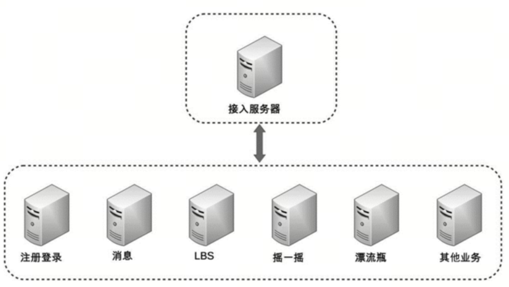
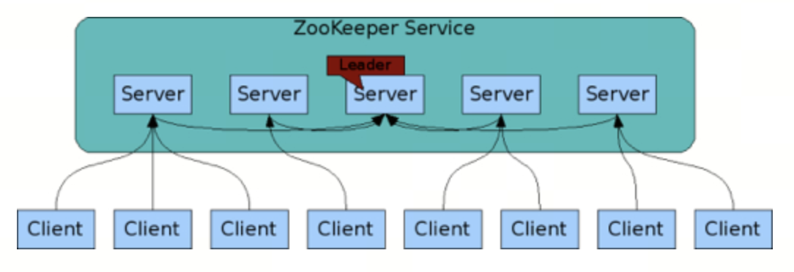
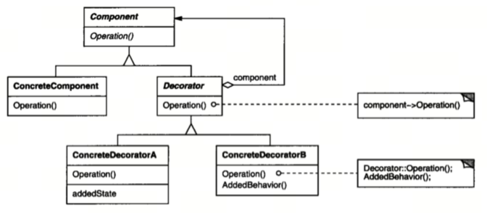

# 前言

架构设计的思维和程序设计的思维差异很大，架构设计的关键思维是判断和取舍，程序设计的关键思维是逻辑和实现。

# 第1章 基础架构

## 1.1 架构到底是指什

理几个有关系而又相似的概念，包括：系统与子系统、模块与组件、框架与架构。

### 系统与子系统

系统泛指由一群有关联的个体组成，根据某种规则运作，能完成个别元件不能单独完成的工作的群体。它的意思是“总体”“整体”或“联盟”。

关联、规则、能力

子系统也是由一群有关联的个体所组成的系统，多半会是更大系统中的一部分。

### 模块与组件

软件模块（Module）是一套一致而互相有紧密关连的软件组织。它分别包含了程序和数据结构两部分。现代软件开发往往利用模块作为合成的单位。模块的接口表达了由该模块提供的功能和调用它时所需的元素。模块是可能分开被编写的单位。这使它们可再用和允许人员同时协作、编写及研究不同的模块。

软件组件定义为自包含的、可编程的、可重用的、与语言无关的软件单元，软件组件可以很容易被用于组装应用程序中。

模块和组件都是系统的组成部分，只是从不同的角度拆分系统而已。

从逻辑的角度来拆分系统后，得到的单元就是“模块”；从物理的角度来拆分系统后，得到的单元就是“组件”。划分模块的主要目的是职责分离；划分组件的主要目的是单元复用。

### 框架与架构

软件框架（Software framework）通常指的是为了实现某个业界标准或完成特定基本任务的软件组件规范，也指为了实现某个软件组件规范时，提供规范所要求之基础功能的软件产品。

软件架构指软件系统的“基础结构”，创造这些基础结构的准则，以及对这些结构的描述。

框架关注的是“规范”，架构关注的是“结构”。框架的英文是 Framework，架构的英文是 Architecture。Spring MVC 的英文文档标题就是“Web MVC framework”。

IBM 的 RUP 将软件架构视图分为著名的“4+1 视图”，架构从不同的角度看会有不同的描述，框架是架构的一种角度。

### 重新定义架构

软件架构指软件系统的顶层结构。

首先，“系统是一群关联个体组成”，这些“个体”可以是“子系统”“模块”“组件”等；架构需要明确系统包含哪些“个体”。

其次，系统中的个体需要“根据某种规则”运作，架构需要明确个体运作和协作的规则。

第三，维基百科定义的架构用到了“基础结构”这个说法，我改为“顶层结构”，可以更好地区分系统和子系统，避免将系统架构和子系统架构混淆在一起导致架构层次混乱。

## 1.2 架构设计的目的

### 架构设计的误区

-   因为架构很重要，所以要做架构设计
-   不是每个系统都要做架构设计吗
-   公司流程要求系统开发过程中必须有架构设计
-   为了高性能、高可用、可扩展，所以要做架构设计

### 以史为签

软件开发进化的历史：

-   机器语言（1940 年之前）
-   汇编语言（20 世纪 40 年代）
-   高级语言（20 世纪 50 年代）
    -   Fortran：1955 年
    -   LISP：1958 年
    -   Cobol：1959 年

C语言：1963年CPL语言->1967年BCPL语言->1969年B语言+初版UNIX操作系统（UNICS）->1972年C语言->1973年重写UNIX->1982年C标准委员会->1989年C89标准ANSI C->1999年C99->2011年C11

第一次软件危机与结构化程序设计（20 世纪 60 年代\~20 世纪 70 年代）

第一次软件危机的根源在于软件的“逻辑”变得非常复杂

软件危机最典型的例子莫过于 IBM 的 System/360 的操作系统开发。共计花费了 5000 人一年的工作量，写出将近 100 万行的源码，总共投入 5 亿美元，是美国的“曼哈顿”原子弹计划投入的 1/4。布鲁克斯后来基于这个项目经验而总结的《人月神话》一书

在 1968、1969 年连续召开两次著名的 NATO 会议，会议正式创造了“软件危机”一词，并提出了针对性的解决方法“软件工程”。

1968 年发表了著名的《GOTO 有害论》论文，引起了长达数年的论战，并由此产生了结构化程序设计方法。

第二次软件危机与面向对象（20 世纪 80 年代）

第二次软件危机的根本原因还是在于软件生产力远远跟不上硬件和业务的发展。

面向对象的思想并不是在第二次软件危机后才出现的，早在 1967 年的 Simula 语言中就开始提出来了，但第二次软件危机促进了面向对象的发展。面向对象真正开始流行是在 20 世纪 80 年代，主要得益于 C++ 的功劳，后来的 Java、C# 把面向对象推向了新的高峰。

软件架构的历史背景

软件架构真正流行却是从 20 世纪 90 年代开始的，由于在 Rational 和 Microsoft 内部的相关活动，软件架构的概念开始越来越流行了。

随着软件系统规模的增加，计算相关的算法和数据结构不再构成主要的设计问题；当系统由许多部分组成时，整个系统的组织，也就是所说的“软件架构”，导致了一系列新的设计问题。

问题，例如：

-   系统规模庞大，内部耦合严重，开发效率低；
-   系统耦合严重，牵一发动全身，后续修改和扩展困难；
-   系统逻辑复杂，容易出问题，出问题后很难排查和修复。

“模块”“对象”“组件”本质上都是对达到一定规模的软件进行拆分，差别只是在于随着软件的复杂度不断增加，拆分的粒度越来越粗，拆分的层次越来越高。

### 架构设计的真正目的

解决软件系统复杂度带来的问题。

-   性能
-   可扩展性
-   高可用
-   安全性
-   成本

## 1.3 复杂度来源 

### 高性能 

软件系统中高性能带来的复杂度主要体现在两方面，一方面是单台计算机内部为了高性能带来的复杂度；另一方面是多台计算机集群为了高性能带来的复杂度。

单机复杂度：多进程、多线程、进程间通信、多线程并发等技术

1.  集群的复杂度

    1.  任务分配

        

        1台服务器演变为 2 台服务器后，架构上明显要复杂多了，主要体现在：

        1.  需要增加一个任务分配器，这个分配器可能是硬件网络设备（例如，F5、交换机等），可能是软件网络设备（例如，LVS），也可能是负载均衡软件（例如，Nginx、HAProxy），还可能是自己开发的系统。选择合适的任务分配器也是一件复杂的事情，需要综合考虑性能、成本、可维护性、可用性等各方面的因素。
        2.  任务分配器和真正的业务服务器之间有连接和交互（即图中任务分配器到业务服务器的连接线），需要选择合适的连接方式，并且对连接进行管理。例如，连接建立、连接检测、连接中断后如何处理等。
        3.  任务分配器需要增加分配算法。例如，是采用轮询算法，还是按权重分配，又或者按照负载进行分配。如果按照服务器的负载进行分配，则业务服务器还要能够上报自己的状态给任务分配器。

        随着性能的增加，任务分配器本身又会成为性能瓶颈，当业务请求达到每秒 10 万次的时候，单台任务分配器也不够用了，任务分配器本身也需要扩展为多台机器，这时的架构又会演变成这个样子。

        

        这个架构比 2 台业务服务器的架构要复杂，主要体现在：

        1.  任务分配器从 1 台变成了多台（对应图中的任务分配器 1 到任务分配器 M），这个变化带来的复杂度就是需要将不同的用户分配到不同的任务分配器上（即图中的虚线“用户分配”部分），常见的方法包括 DNS 轮询、智能 DNS、CDN（Content Delivery Network，内容分发网络）、GSLB 设备（Global Server Load Balance，全局负载均衡）等。
        2.  任务分配器和业务服务器的连接从简单的“1 对多”（1 台任务分配器连接多台业务服务器）变成了“多对多”（多台任务分配器连接多台业务服务器）的网状结构。
        3.  机器数量从 3 台扩展到 30 台（一般任务分配器数量比业务服务器要少，这里我们假设业务服务器为 25 台，任务分配器为 5 台），状态管理、故障处理复杂度也大大增加。

    2.  任务分解

        业务越来越复杂，单台机器处理的性能会越来越低。为了能够继续提升性能，我们需要采取第二种方式：任务分解。

        

        业务越来越复杂，单台机器处理的性能会越来越低。为了能够继续提升性能，我们需要采取第二种方式：任务分解。

        任务分解既不会减少功能，也不会减少代码量（事实上代码量可能还会增加，因为从代码内部调用改为通过服务器之间的接口调用），那为何通过任务分解就能够提升性能呢？

        主要有几方面的因素：

        -   简单的系统更加容易做到高性能
        -   可以针对单个任务进行扩展

        如果系统拆分得太细，为了完成某个业务，系统间的调用次数会呈指数级别上升，而系统间的调用通道目前都是通过网络传输的方式，性能远比系统内的函数调用要低得多。

        任务分解带来的性能收益是有一个度的，并不是任务分解越细越好，而对于架构设计来说，如何把握这个粒度就非常关键了。

### 高可用

系统无中断地执行其功能的能力，代表系统的可用性程度，是进行系统设计时的准则之一。

系统的高可用方案五花八门，但万变不离其宗，本质上都是通过“冗余”来实现高可用。

高性能增加机器目的在于“扩展”处理性能；高可用增加机器目的在于“冗余”处理单元。

1.  计算高可用

    计算有一个特点就是无论在哪台机器上进行计算，同样的算法和输入数据，产出的结果都是一样的，所以将计算从一台机器迁移到另外一台机器，对业务并没有什么影响。

    PN: 功能上要无状态

    

    这个双机的架构图和上期“高性能”讲到的双机架构图是一样的，因此复杂度也是类似的，具体表现为：

    需要增加一个任务分配器，选择合适的任务分配器也是一件复杂的事情，需要综合考虑性能、成本、可维护性、可用性等各方面因素。

    任务分配器和真正的业务服务器之间有连接和交互，需要选择合适的连接方式，并且对连接进行管理。例如，连接建立、连接检测、连接中断后如何处理等。

    任务分配器需要增加分配算法。例如，常见的双机算法有主备、主主，主备方案又可以细分为冷备、温备、热备。

    

    这个高可用集群相比双机来说，分配算法更加复杂，可以是 1 主 3 备、2 主 2 备、3 主 1 备、4 主 0 备，具体应该采用哪种方式，需要结合实际业务需求来分析和判断，并不存在某种算法就一定优于另外的算法。例如，ZooKeeper 采用的就是 1 主多备，而 Memcached 采用的就是全主 0 备。

2.  存储高可用

    存储与计算相比，有一个本质上的区别：将数据从一台机器搬到到另一台机器，需要经过线路进行传输。

    除了物理上的传输速度限制，传输线路本身也存在可用性问题，传输线路可能中断、可能拥塞、可能异常（错包、丢包）

    存储高可用的难点不在于如何备份数据，而在于如何减少或者规避数据不一致对业务造成的影响。

    分布式领域里面有一个著名的 CAP 定理，从理论上论证了存储高可用的复杂度。也就是说，存储高可用不可能同时满足“一致性、可用性、分区容错性”，最多满足其中两个，这就要求我们在做架构设计时结合业务进行取舍。

3.  高可用状态决策

    无论是计算高可用还是存储高可用，其基础都是“状态决策”，即系统需要能够判断当前的状态是正常还是异常，如果出现了异常就要采取行动来保证高可用。

    通过冗余来实现的高可用系统，状态决策本质上就不可能做到完全正确。

    1.  独裁式

        

        独裁式的决策方式不会出现决策混乱的问题，因为只有一个决策者，但问题也正是在于只有一个决策者。当决策者本身故障时，整个系统就无法实现准确的状态决策。

    2.  协商式

        

        协商式决策指的是两个独立的个体通过交流信息，然后根据规则进行决策，最常用的协商式决策就是主备决策。

        如果两者的信息交换出现问题（比如主备连接中断），此时状态决策应该怎么做。

    3.  民主式

        

        民主式决策指的是多个独立的个体通过投票的方式来进行状态决策。例如，ZooKeeper 集群在选举 leader 时就是采用这种方式。

        民主式决策和协商式决策比较类似，其基础都是独立的个体之间交换信息，每个个体做出自己的决策，然后按照“多数取胜”的规则来确定最终的状态。

        除了算法复杂，民主式决策还有一个固有的缺陷：脑裂。

        

        为了解决脑裂问题，民主式决策的系统一般都采用“投票节点数必须超过系统总节点数一半”规则来处理。

        这种方式虽然解决了脑裂问题，但同时降低了系统整体的可用性，即如果系统不是因为脑裂问题导致投票节点数过少，而真的是因为节点故障，此时系统也不会选出主节点，整个系统就相当于宕机了

        无论采取什么样的方案，状态决策都不可能做到任何场景下都没有问题，但完全不做高可用方案又会产生更大的问题，如何选取适合系统的高可用方案，也是一个复杂的分析、判断和选择的过程。

### 可扩展性 

可扩展性指系统为了应对将来需求变化而提供的一种扩展能力，当有新的需求出现时，系统不需要或者仅需要少量修改就可以支持，无须整个系统重构或者重建。

设计具备良好可扩展性的系统，有两个基本条件：正确预测变化、完美封装变化。

1.  预测变化

    “唯一不变的是变化”

    预测变化的复杂性在于：

    -   不能每个设计点都考虑可扩展性。
    -   不能完全不考虑可扩展性。
    -   所有的预测都存在出错的可能性。

2.  应对变化

    第一种应对变化的常见方案是将“变化”封装在一个“变化层”，将不变的部分封装在一个独立的“稳定层”。

    

    

    

    通过剥离变化层和稳定层的方式应对变化，都会带来两个主要的复杂性相关的问题。

    1.  系统需要拆分出变化层和稳定层
    2.  需要设计变化层和稳定层之间的接口

    第二种常见的应对变化的方案是提炼出一个“抽象层”和一个“实现层”。

    这种方案典型的实践就是设计模式和规则引擎。

    以设计模式的“装饰者”模式来分析，下面是装饰者模式的类关系图。

    

    装饰者模式相对普通的类实现模式，明显要复杂多了。本来一个函数或者一个类就能搞定的事情，现在要拆分成多个类，而且多个类之间必须按照装饰者模式来设计和调用。

### 低成本

当我们设计“高性能”“高可用”的架构时，通用的手段都是增加更多服务器来满足“高性能”和“高可用”的要求；而低成本正好与此相反，我们需要减少服务器的数量才能达成低成本的目标。因此，低成本本质上是与高性能和高可用冲突的，所以低成本很多时候不会是架构设计的首要目标，而是架构设计的附加约束。

低成本给架构设计带来的主要复杂度体现在，往往只有“创新”才能达到低成本目标。这里的“创新”既包括开创一个全新的技术领域，也包括引入新技术，如果没有找到能够解决自己问题的新技术，那么就真的需要自己创造新技术了。

类似的新技术例子很多，我来举几个。

-   NoSQL（Memcache、Redis 等）的出现是为了解决关系型数据库无法应对高并发访问带来的访问压力。
-   全文搜索引擎（Sphinx、Elasticsearch、Solr）的出现是为了解决关系型数据库 like 搜索的低效的问题。
-   Hadoop 的出现是为了解决传统文件系统无法应对海量数据存储和计算的问题。

### 安全

安全可以分为两类：一类是功能上的安全，一类是架构上的安全。

功能安全

从实现的角度来看，功能安全更多地是和具体的编码相关

架构安全

如果说功能安全是“防小偷”，那么架构安全就是“防强盗”。

传统的架构安全主要依靠防火墙，防火墙最基本的功能就是隔离网络

互联网系统的架构安全目前并没有太好的设计手段来实现，更多地是依靠运营商或者云服务商强大的带宽和流量清洗的能力，较少自己来设计和实现。

### 规模

规模带来复杂度的主要原因就是“量变引起质变”，当数量超过一定的阈值后，复杂度会发生质的变化。常见的规模带来的复杂度有：

1.  功能越来越多，导致系统复杂度指数级上升
2.  数据越来越多，系统复杂度发生质变

MySQL 单表的数据因不同的业务和应用场景会有不同的最优值，但不管怎样都肯定是有一定的限度的，一般推荐在 5000 万行左右。如果因为业务的发展，单表数据达到了 10 亿行，就会产生很多问题

# 第2章 架构设计原则 

优秀程序员和架构师之间还有一个明显的鸿沟需要跨越，这个鸿沟就是“不确定性”。

对于架构设计来说，本质上是不确定的，同样的一个系统，A 公司和 B 公司做出来的架构可能差异很大，但最后都能正常运转；同样一个方案，A 设计师认为应该这样做，B 设计师认为应该那样做，看起来好像都有道理……相比编程来说，架构设计并没有像编程语言那样的语法来进行约束，更多的时候是面对多种可能性时进行选择。

架构设计领域并没有一套通用的规范来指导架构师进行架构设计，更多是依赖架构师的经验和直觉

几个共性的原：合适原则、简单原则、演化原则

## 合适原则

合适原则宣言：“合适优于业界领先”。

再好的梦想，也需要脚踏实地实现！

-   将军难打无兵之仗: 没那么多人，却想干那么多活，是失败的第一个主要原因。
-   罗马不是一天建成的:没有那么多积累，却想一步登天，是失败的第二个主要原因。
-   冰山下面才是关键: 没有那么卓越的业务场景，却幻想灵光一闪成为天才，是失败的第三个主要原因。

业界领先的方案其实都是“逼”出来的！简单来说，“业务”发展到一定阶段，量变导致了质变，出现了新的问题，已有的方式已经不能应对这些问题，需要用一种新的方案来解决，通过创新和尝试，才有了业界领先的方案。

## 简单原则

简单原则宣言：“简单优于复杂”。

“复杂”在制造领域代表先进，在建筑领域代表领先，但在软件领域，却恰恰相反，代表的是“问题”。

1.  结构的复杂性

结构复杂的系统几乎毫无例外具备两个特点：

组成复杂系统的组件数量更多；

同时这些组件之间的关系也更加复杂。

组件越多，就越有可能其中某个组件出现故障，从而导致系统故障。

某个组件改动，会影响关联的所有组件，这些被影响的组件同样会继续递归影响更多的组件。

定位一个复杂系统中的问题总是比简单系统更加困难。

1.  逻辑的复杂性

意识到结构的复杂性后，我们的第一反应可能就是“降低组件数量”，不幸的是，这样做是行不通的，原因在于除了结构的复杂性，还有逻辑的复杂性，即如果某个组件的逻辑太复杂，一样会带来各种问题。

为什么复杂的电路就意味更强大的功能，而复杂的架构却有很多问题呢？根本原因在于电路一旦设计好后进入生产，就不会再变，复杂性只是在设计时带来影响；而一个软件系统在投入使用后，后续还有源源不断的需求要实现，因此要不断地修改系统，复杂性在整个系统生命周期中都有很大影响。

《UNIX 编程艺术》总结的 KISS（Keep It Simple, Stupid!）原则一样适应于架构设计。

## 演化原则

演化原则宣言：“演化优于一步到位”。

对于建筑来说，永恒是主题；而对于软件来说，变化才是主题。

软件架构设计其实更加类似于大自然“设计”一个生物，通过演化让生物适应环境，逐步变得更加强大

-   首先，设计出来的架构要满足当时的业务需要。
-   其次，架构要不断地在实际应用过程中迭代，保留优秀的设计，修复有缺陷的设计，改正错误的设计，去掉无用的设计，使得架构逐渐完善。

-第三，当业务发生变化时，架构要扩展、重构，甚至重写；代码也许会重写，但有价值的经验、教训、逻辑、设计等却可以在新架构中延续。

# 第3章 架构设计流程 

## 有的放矢-识别复杂度

架构的复杂度主要来源于“高性能”“高可用”“可扩展”等几个方面，但架构师在具体判断复杂性的时候，不能生搬硬套，认为任何时候架构都必须同时满足这三方面的要求。实际上大部分场景下，复杂度只是其中的某一个，少数情况下包含其中两个。

将主要的复杂度问题列出来，然后根据业务、技术、团队等综合情况进行排序，优先解决当前面临的最主要的复杂度问题。

## 按图索骥-设计备选方案

第一种常见的错误：设计最优秀的方案。 第二种常见的错误：只做一个方案。

弊端

-   心里评估过于简单
-   架构师再怎么牛，经验知识和技能也有局限
-   单一方案设计会出现过度辩护的情况

合理的做法

-   备选方案的数量以 3 \~ 5 个为最佳
-   备选方案的差异要比较明显
-   备选方案的技术不要只局限于已经熟悉的技术

第三种常见的错误：备选方案过于详细。

备选阶段关注的是技术选型，而不是技术细节，技术选型的差异要比较明显。

## 深思熟虑-评估和选择备选方案

列出我们需要关注的质量属性点，然后分别从这些质量属性的维度去评估每个方案，再综合挑选适合当时情况的最优方案。

常见的方案质量属性点有：性能、可用性、硬件成本、项目投入、复杂度、安全性、可扩展性等。在评估这些质量属性时，需要遵循架构设计原则“合适原则”和原则“简单原则”，避免贪大求全，基本上某个质量属性能够满足一定时期内业务发展就可以了。

通常情况下，如果某个质量属性评估和业务发展有关系（例如，性能、硬件成本等），需要评估未来业务发展的规模时，一种简单的方式是将当前的业务规模乘以 2 ~4 即可，如果现在的基数较低，可以乘以 4；如果现在基数较高，可以乘以 2。

当然，最理想的情况是设计一个方案，能够简单地扩容就能够跟上业务的发展。

当然，最理想的情况是设计一个方案，能够简单地扩容就能够跟上业务的发展。

面临这种选择上的困难，有几种看似正确但实际错误的做法。

-   数量对比法：简单地看哪个方案的优点多就选哪个。问题在于把所有质量属性的重要性等同，而没有考虑质量属性的优先级。
-   加权法：每个质量属性给一个权重。无法客观地给出每个质量属性的权重得分。

正确的做法是按优先级选择，即架构师综合当前的业务发展情况、团队人员规模和技能、业务发展预测等因素，将质量属性按照优先级排序，首先挑选满足第一优先级的，如果方案都满足，那就再看第二优先级……以此类推。

## 精雕细琢-详细方案设计

详细设计方案阶段可能遇到的一种极端情况就是在详细设计阶段发现备选方案不可行，一般情况下主要的原因是备选方案设计时遗漏了某个关键技术点或者关键的质量属性。

通过下面方式有效地避免：

-   架构师不但要进行备选方案设计和选型，还需要对备选方案的关键细节有较深入的理解。
-   通过分步骤、分阶段、分系统等方式，尽量降低方案复杂度
-   如果方案本身就很复杂，那就采取设计团队的方式来进行设计，博采众长，汇集大家的智慧和经验，防止只有 1~2 个架构师可能出现的思维盲点或者经验盲区。
