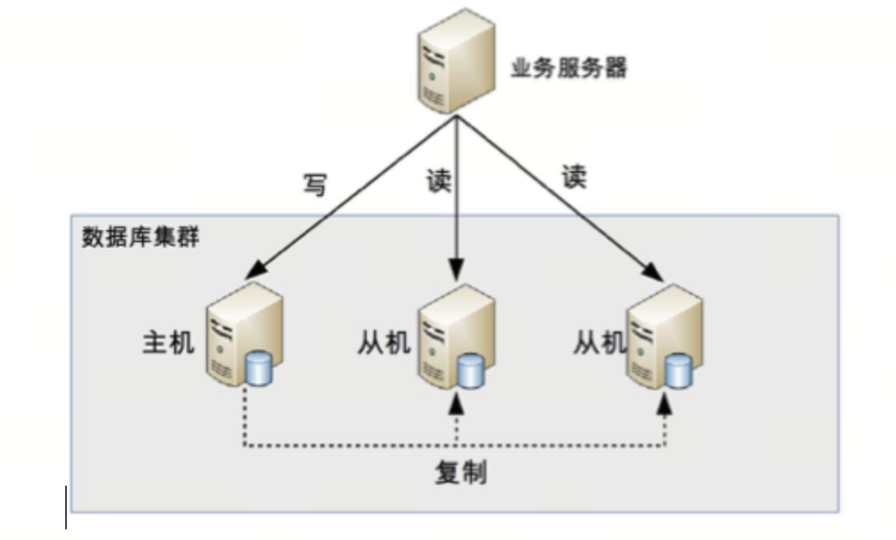
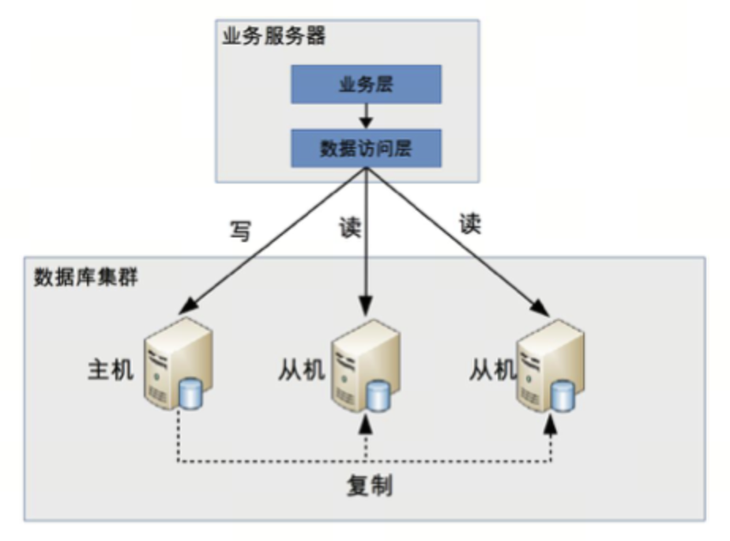
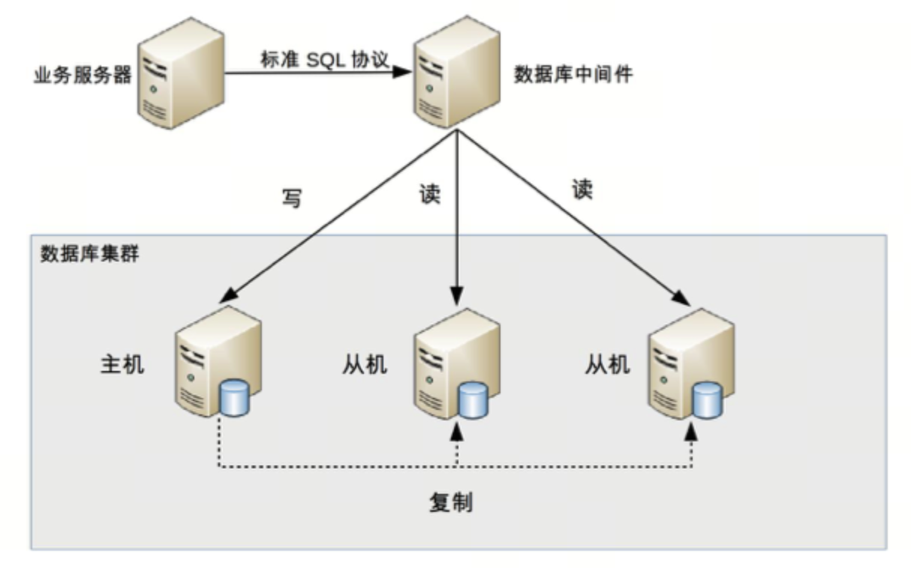
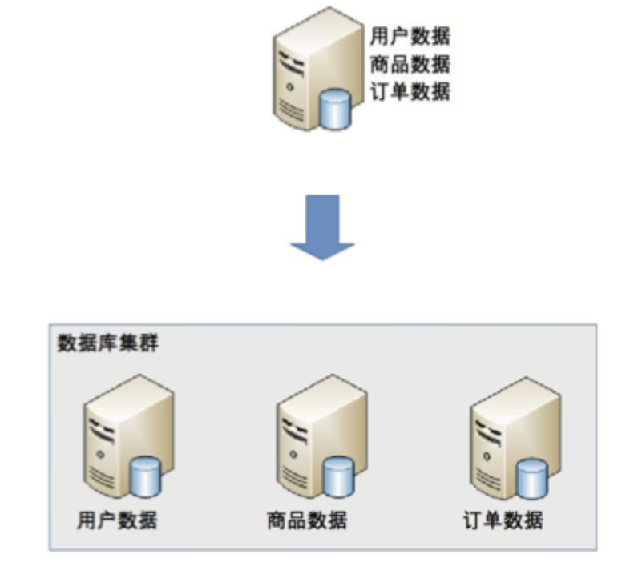
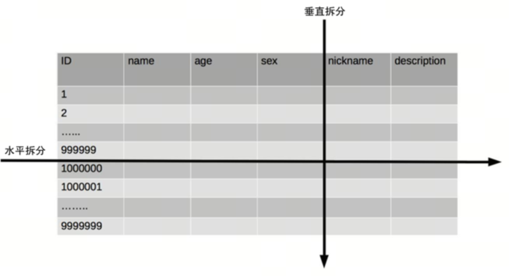

# 第4章 存储高性能 

## 关系数据库 

### 读写分离

读写分离的基本原理是将数据库读写操作分散到不同的节点上

读写分离的基本实现是：

-   数据库服务器搭建主从集群，一主一从、一主多从都可以。
-   数据库主机负责读写操作，从机只负责读操作。
-   数据库主机通过复制将数据同步到从机，每台数据库服务器都存储了所有的业务数据。
-   业务服务器将写操作发给数据库主机，将读操作发给数据库从机。

引入设计复杂度：主从复制延迟和分配机制。

1.  复制延迟

    解决主从复制延迟有几种常见的方法：

    -   写操作后的读操作指定发给数据库主服务器
    -   读从机失败后再读一次主机
    -   关键业务读写操作全部指向主机，非关键业务采用读写分离

2.  分配机制

    将读写操作区分开来，一般有两种方式：程序代码封装和中间件封装。

    1.  程序代码封装

        程序代码封装指在代码中抽象一个数据访问层

        程序代码封装的方式具备几个特点：

        -   实现简单，而且可以根据业务做较多定制化的功能。
        -   每个编程语言都需要自己实现一次，无法通用，重复开发的工作量比较大。
        -   故障情况下，如果主从发生切换，则可能需要所有系统都修改配置并重启。

        

    2.  中间件封装

        中间件封装指的是独立一套系统出来，实现读写操作分离和数据库服务器连接的管理。中间件对业务服务器提供
        SQL 兼容的协议，业务服务器无须自己进行读写分离。

        

        数据库中间件的方式具备的特点是：

        -   能够支持多种编程语言

        -   数据库中间件要支持完整的 SQL 语法和数据库服务器的协议，实现比较复杂，细节特别多，很容易出现 bug，需要较长的时间才能稳定。

        -   数据库中间件自己不执行真正的读写操作，但所有的数据库操作请求都要经过中间件，中间件的性能要求也很高。

        -   数据库主从切换对业务服务器无感知，数据库中间件可以探测数据库服务器的主从状态。

            mycat和ProxySQL

### 分库分表

当数据量达到千万甚至上亿条的时候，单台数据库服务器的存储能力会成为系统的瓶颈，主要体现在这几个方面：

-   数据量太大，读写的性能会下降，即使有索引，索引也会变得很大，性能同样会下降。
-   数据文件会变得很大，数据库备份和恢复需要耗费很长时间。
-   数据文件越大，极端情况下丢失数据的风险越高

1.  业务分库

    业务分库指的是按照业务模块将数据分散到不同的数据库服务器。

    

    业务分库能够分散存储和访问压力，但同时也带来了新的问题:

    -   join 操作问题
    -   事务问题:分布式事务（例如，MySQL 的 XA）性能低，与高性能存储的目标是相违背的
    -   成本问题: 对于小公司初创业务，并不建议一开始就这样拆分

### 分表

同一业务的单表数据也会达到单台数据库服务器的处理瓶颈，此时就需要对单表数据进行拆分。

单表数据拆分有两种方式：垂直分表和水平分表。

单表进行切分后，是否要将切分后的多个表分散在不同的数据库服务器中，可以根据实际的切分效果来确定，并不强制要求单表切分为多表后一定要分散到不同数据库中。

引入各种复杂性:

垂直分表:合将表中某些不常用且占了大量空间的列拆分出去，引入的复杂性主要体现在表操作的数量要增加

水平分表:表的数据量达到千万级别时，作为架构师就要警觉起来

-   路由:某条数据具体属于哪个切分后的子表，需要增加路由算法进行计算
    -   范围路由:选取有序的数据列（例如，整形、时间戳等）作为路由的条件
        -   设计复杂点:主要体现在分段大小的选取上，一般建议分段大小在 100 万至 2000 万之间
        -   缺点: 分布不均匀
        -   优点: 随着数据的增加平滑地扩充新的表
    -   Hash 路由:选取某个列（或者某几个列组合也可以）的值进行 Hash
        运算，然后根据 Hash 结果分散到不同的数据库表中
        -   设计复杂点: 初始表数量的选取上，表数量太多维护比较麻烦，表数量太少又可能导致单表性能存在问题。
        -   缺点: 扩充新的表很麻烦
        -   优点: 表分布比较均匀
    -   配置路由: 路由表，用一张独立的表来记录路由信息
        -   缺点: 必须多查询一次，会影响整体性能
        -   优点: 设计简单，使用灵活，在扩充表的时候，只需要迁移指定的数据，然后修改路由表就可以了。
-   join 操作
-   count() 操作
    -   count() 相加
    -   记录数表
    -   order by 操作

分库分表具体的实现方式也是“程序代码封装”和“中间件封装”，但实现会更复杂。

## NoSQL

关系数据库存在如下缺点:

-   关系数据库存储的是行记录，无法存储数据结构
-   关系数据库的 schema 扩展很不方便
-   关系数据库在大数据场景下 I/O 较高
-   关系数据库的全文搜索功能比较弱

NoSQL 方案带来的优势，本质上是牺牲 ACID 中的某个或者某几个特性， NoSQL为SQL的一个有力补充，NoSQL != No SQL，而是 NoSQL = Not Only SQL。

常见的 NoSQL 方案分为 4 类。

-   K-V 存储：解决关系数据库无法存储数据结构的问题，以 Redis 为代表。
-   文档数据库：解决关系数据库强 schema 约束的问题，以 MongoDB 为代表。
-   列式数据库：解决关系数据库大数据场景下的 I/O 问题，以 HBase 为代表。
-   全文搜索引擎：解决关系数据库的全文搜索性能问题，以 Elasticsearch 为代表。

### K-V存储

Redis 是 K-V 存储的典型代表，包括 string、hash、list、set、sorted set、bitmap 和 hyperloglog，所以常常被称为数据结构服务器。

### 文档数据库

为了解决关系数据库 schema 带来的问题，文档数据库应运而生。文档数据库最大的特点就是 no-schema，可以存储和读取任意的数据。目前绝大部分文档数据库存储的数据格式是 JSON（或者 BSON），因为 JSON 数据是自描述的，无须在使用前定义字段，读取一个 JSON 中不存在的字段也不会导致 SQL 那样的语法错误。

几个明显的优势:

-   新增字段简单
-   历史数据不会出错
-   可以很容易存储复杂数据

文档数据库 no-schema 的特性带来的这些优势也是有代价的，最主要的代价就是不支持事务。另外一个缺点就是无法实现关系数据库的 join 操作

PN: 现在已经有支持事务的了 MongoDB很早就有事务的概念，但是这个事务只能是针对单文档的，即单个文档的操作是有原子性保证的。在4.0版本之后，MongoDB开始支持多文档的事务：

-   4.0版本支持副本集范围的多文档事务。
-   4.2版本支持跨分片的多文档事务(基于两阶段提交)。
-   在事务的隔离性上，MongoDB支持快照snapshot的隔离级别，可以避免脏读、不可重复读和幻读。

尽管有了真正意义上的事务功能，但多文档事务对于性能有一定的影响，应用应该在充分评估后再做选用。

### 列式数H据库

列式数据库就是按照列来存储数据的数据库，与之对应的传统关系数据库被称为“行式数据库”，因为关系数据库是按照行来存储数据的。

关系数据库按照行式来存储数据，主要有以下几个优势：

-   业务同时读取多个列时效率高，因为这些列都是按行存储在一起的，一次磁盘操作就能够把一行数据中的各个列都读取到内存中。
-   能够一次性完成对一行中的多个列的写操作，保证了针对行数据写操作的原子性和一致性

行式存储的优势是在特定的业务场景下才能体现，如果不存在这样的业务场景，那么行式存储的优势也将不复存在，甚至成为劣势，典型的场景就是海量数据进行统计。例如，计算某个城市体重超重的人员数据，实际上只需要读取每个人的体重这一列并进行统计即可，而行式存储即使最终只使用一列，也会将所有行数据都读取出来。如果单行用户信息有 1KB，其中体重只有 4 个字节，行式存储还是会将整行 1KB 数据全部读取到内存中，这是明显的浪费。而如果采用列式存储，每个用户只需要读取 4 字节的体重数据即可，I/O 将大大减少。

列式存储还具备更高的存储压缩比，能够节省更多的存储空间。普通的行式数据库一般压缩率在 3:1 到 5:1 左右，而列式数据库的压缩率一般在 8:1 到 30:1 左右，因为单个列的数据相似度相比行来说更高，能够达到更高的压缩率。

一般将列式存储应用在离线的大数据分析和统计场景中，因为这种场景主要是针对部分列单列进行操作，且数据写入后就无须再更新删除。

### 全文搜索引擎

全文搜索基本原理:全文搜索引擎的技术原理被称为“倒排索引”（Inverted index）

全文搜索的使用方式

全文搜索引擎的索引对象是单词和文档，而关系数据库的索引对象是键和行，两者的术语差异很大，不能简单地等同起来。

全文搜索引擎能够基于 JSON 文档建立全文索引，然后快速进行全文搜索。

## 缓存

基本原理是将可能重复使用的数据放到内存中，一次生成、多次使用，避免每次使用都去访问存储系统。

好的缓存方案应该从这几个方面入手设计： 
1. 什么数据应该缓存
2. 什么时机触发缓存和以及触发方式是什么 
3. 缓存的层次和粒度（ 网关缓存如 nginx，本地缓存如单机文件，分布式缓存如redis cluster，进程内缓存如全局变量）

缓存虽然能够大大减轻存储系统的压力，但同时也给架构引入了更多复杂性。架构设计时如果没有针对缓存的复杂性进行处理，某些场景下甚至会导致整个系统崩溃。

### 缓存穿透 

缓存穿透是指缓存没有发挥作用，业务系统虽然去缓存查询数据，但缓存中没有数据，业务系统需要再次去存储系统查询数据。通常情况下有两种情况：

-   存储数据不存在
-   缓存数据生成耗费大量时间或者资源

### 缓存雪崩 

缓存雪崩是指当缓存失效（过期）后引起系统性能急剧下降的情况。

当缓存过期被清除后，业务系统需要重新生成缓存，因此需要再次访问存储系统，再次进行运算，这个处理步骤耗时几十毫秒甚至上百毫秒。而对于一个高并发的业务系统来说，几百毫秒内可能会接到几百上千个请求。由于旧的缓存已经被清除，新的缓存还未生成，并且处理这些请求的线程都不知道另外有一个线程正在生成缓存，因此所有的请求都会去重新生成缓存，都会去访问存储系统，从而对存储系统造成巨大的性能压力。这些压力又会拖慢整个系统，严重的会造成数据库宕机，从而形成一系列连锁反应，造成整个系统崩溃。

缓存雪崩的常见解决方法有两种：

-   更新锁机制：对缓存更新操作进行加锁保护
-   后台更新机制：定时更新缓存、消息队列通知更新

后台更新机制还适合业务刚上线的时候进行缓存预热。缓存预热指系统上线后，将相关的缓存数据直接加载到缓存系统，而不是等待用户访问才来触发缓存加载。

### 缓存热点 

缓存热点的解决方案就是复制多份缓存副本，将请求分散到多个缓存服务器上，减轻缓存热点导致的单台缓存服务器压力。

缓存副本设计有一个细节需要注意，就是不同的缓存副本不要设置统一的过期时间，否则就会出现所有缓存副本同时生成同时失效的情况，从而引发缓存雪崩效应。
