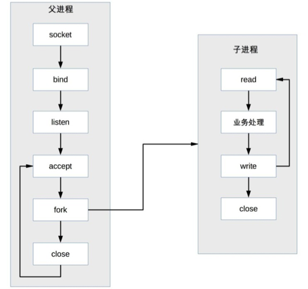
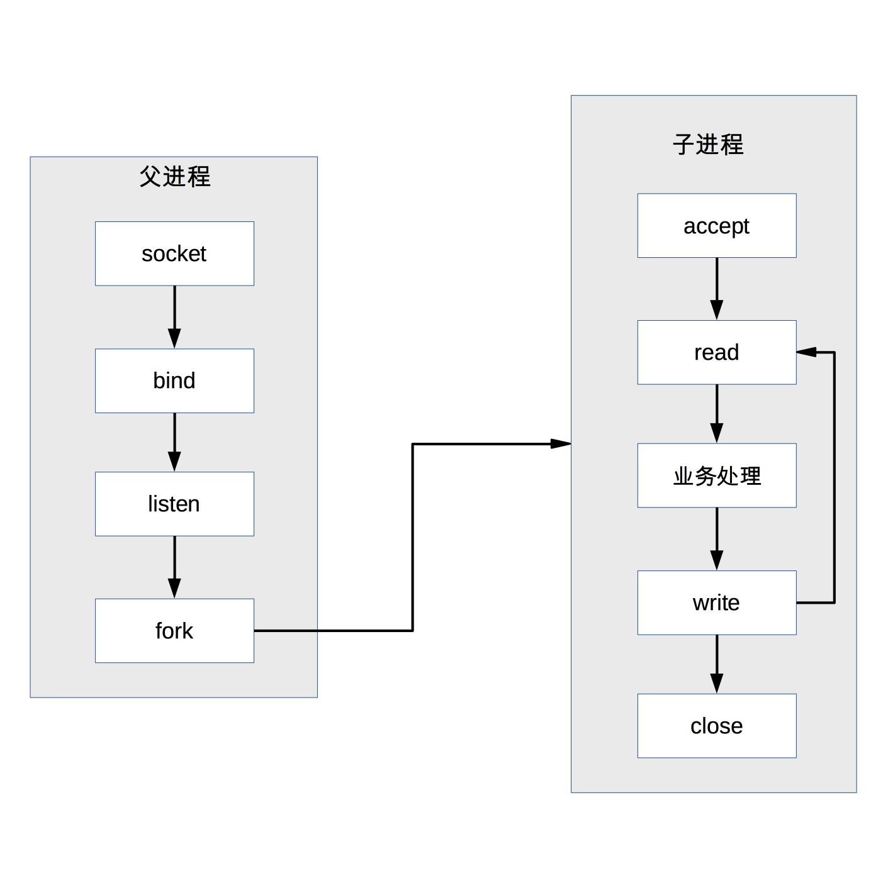
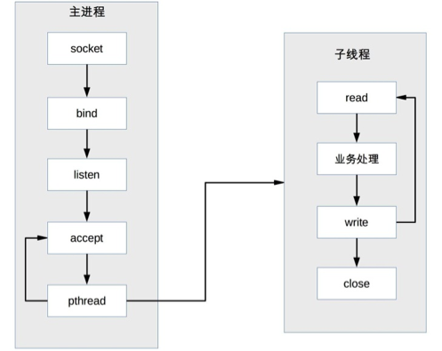
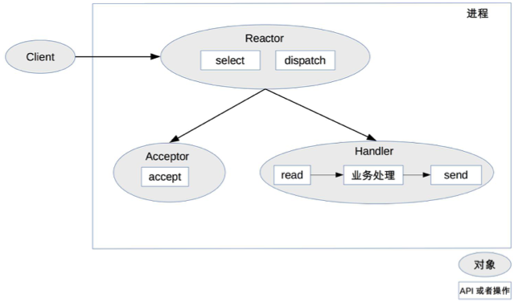
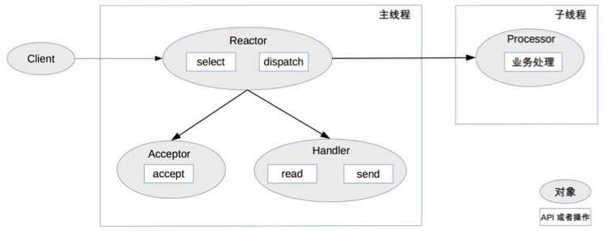
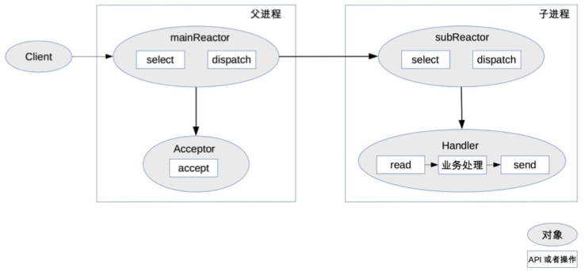
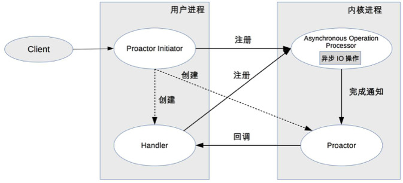
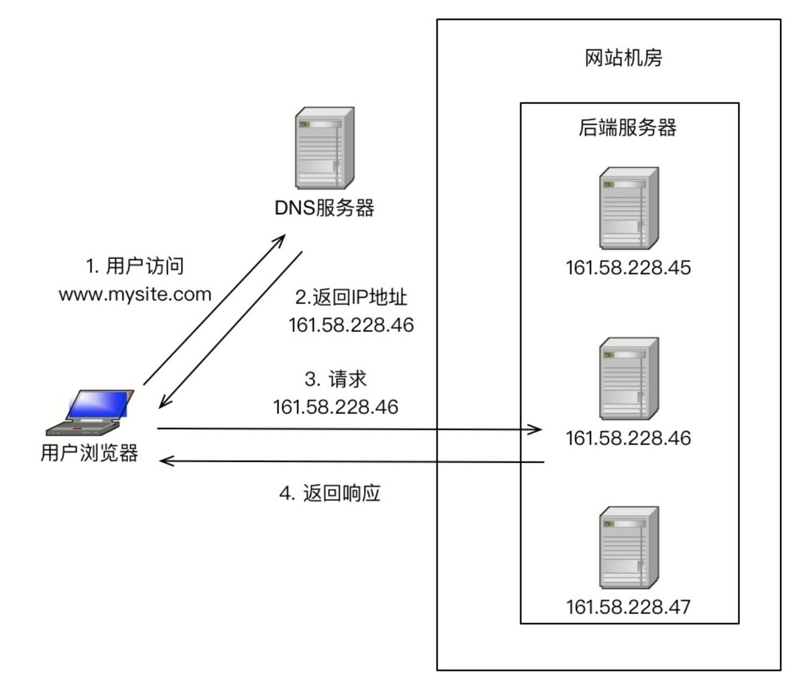
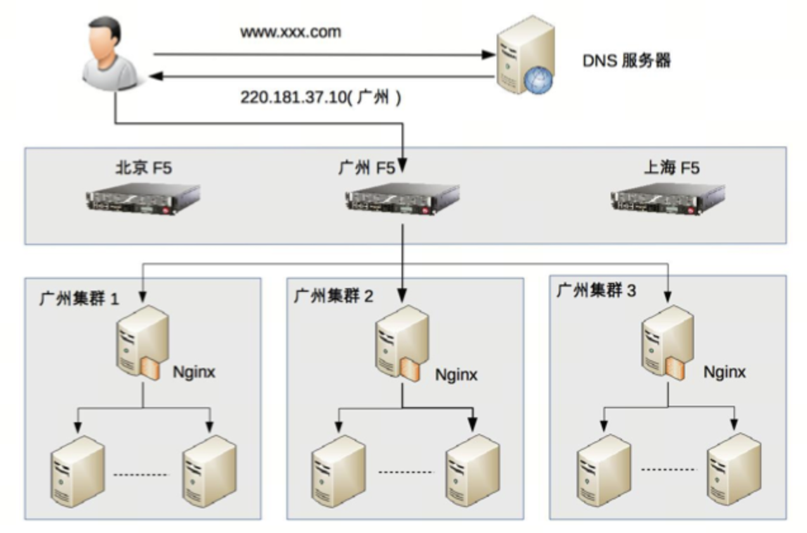

# 第5章 计算高性能

## 单服务器高性能 

单服务器高性能的关键之一就是服务器采取的并发模型，并发模型有如下两个关键设计点：

-   服务器如何管理连接。
-   服务器如何处理请求。

以上两个设计点最终都和操作系统的 I/O 模型及进程模型相关。

-   I/O 模型：阻塞、非阻塞、同步、异步。
-   进程模型：单进程、多进程、多线程。

### PPC

PPC 是 Process Per Connection 的缩写，其含义是指每次有新的连接就新建一个进程去专门处理这个连接的请求，这是传统的 UNIX 网络服务器所采用的模型。

注意，图中有一个小细节，父进程“fork”子进程后，直接调用了 close，看起来好像是关闭了连接，其实只是将连接的文件描述符引用计数减一，真正的关闭连接是等子进程也调用 close 后，连接对应的文件描述符引用计数变为 0 后，操作系统才会真正关闭连接

问题：

-   fork 代价高：站在操作系统的角度，创建一个进程的代价是很高的，需要分配很多内核资源，需要将内存映像从父进程复制到子进程。
-   父子进程通信复杂：父进程“fork”子进程时，文件描述符可以通过内存映像复制从父进程传到子进程，但“fork”完成后，父子进程通信就比较麻烦了，需要采用 IPC（Interprocess Communication）之类的进程通信方案。
-   支持的并发连接数量有限：如果每个连接存活时间比较长，而且新的连接又源源不断的进来，则进程数量会越来越多

### prefork 

prefork 就是提前创建进程（pre-fork）。系统在启动的时候就预先创建好进程，然后才开始接受用户的请求，当有新的连接进来的时候，就可以省去 fork 进程的操作，让用户访问更快、体验更好。

prefork 的实现关键就是多个子进程都 accept 同一个 socket，当有新的连接进入时，操作系统保证只有一个进程能最后 accept 成功。但这里也存在一个小小的问题：“惊群”现象，就是指虽然只有一个子进程能 accept 成功，但所有阻塞在 accept 上的子进程都会被唤醒，这样就导致了不必要的进程调度和上下文切换了。幸运的是，操作系统可以解决这个问题，例如 Linux 2.6 版本后内核已经解决了 accept 惊群问题。

### TPC 

TPC 是 Thread Per Connection 的缩写，其含义是指每次有新的连接就新建一个线程去专门处理这个连接的请求。与进程相比，线程更轻量级，创建线程的消耗比进程要少得多；同时多线程是共享进程内存空间的，线程通信相比进程通信更简单。因此，TPC 实际上是解决或者弱化了 PPC fork 代价高的问题和父子进程通信复杂的问题。

注意，和 PPC 相比，主进程不用“close”连接了。原因是在于子线程是共享主进程的进程空间的，连接的文件描述符并没有被复制，因此只需要一次 close 即可。

问题：

-   创建线程虽然比创建进程代价低，但并不是没有代价，高并发时（例如每秒上万连接）还是有性能问题。
-   无须进程间通信，但是线程间的互斥和共享又引入了复杂度，可能一不小心就导致了死锁问题。
-   多线程会出现互相影响的情况，某个线程出现异常时，可能导致整个进程退出（例如内存越界）。

TPC 还是存在 CPU 线程调度和切换代价的问题。因此，TPC 方案本质上和 PPC 方案基本类似，在并发几百连接的场景下，反而更多地是采用 PPC 的方案，因为 PPC 方案不会有死锁的风险，也不会多进程互相影响，稳定性更高。

### prethread 

和 prefork 类似，prethread 模式会预先创建线程，然后才开始接受用户的请求，当有新的连接进来的时候，就可以省去创建线程的操作，让用户感觉更快、体验更好。

由于多线程之间数据共享和通信比较方便，因此实际上 prethread 的实现方式相比 prefork 要灵活一些，常见的实现方式有下面几种：

-   主进程 accept，然后将连接交给某个线程处理。
-   子线程都尝试去 accept，最终只有一个线程 accept 成功

Apache 服务器的 MPM worker 模式本质上就是一种 prethread 方案，但稍微做了改进。Apache 服务器会首先创建多个进程，每个进程里面再创建多个线程，这样做主要是为了考虑稳定性，即：即使某个子进程里面的某个线程异常导致整个子进程退出，还会有其他子进程继续提供服务，不会导致整个服务器全部挂掉。

prethread 理论上可以比 prefork 支持更多的并发连接，Apache 服务器 MPM worker 模式默认支持 16 × 25 = 400 个并发处理线程。

### reactor 

引入资源池的处理方式后，会引出一个新的问题：进程如何才能高效地处理多个连接的业务？当一个连接一个进程时，进程可以采用“read -> 业务处理 -> write”的处理流程，如果当前连接没有数据可以读，则进程就阻塞在 read 操作上。

解决这个问题的最简单的方式是将 read 操作改为非阻塞，然后进程不断地轮询多个连接。这种方式能够解决阻塞的问题，但解决的方式并不优雅。首先，轮询是要消耗 CPU 的；其次，如果一个进程处理几千上万的连接，则轮询的效率是很低的。

为了能够更好地解决上述问题，很容易可以想到，只有当连接上有数据的时候进程才去处理，这就是 I/O 多路复用技术的来源。

I/O 多路复用技术归纳起来有两个关键实现点：

-   当多条连接共用一个阻塞对象后，进程只需要在一个阻塞对象上等待，而无须再轮询所有连接，常见的实现方式有
    select、epoll、kqueue 等。
-   当某条连接有新的数据可以处理时，操作系统会通知进程，进程从阻塞状态返回，开始进行业务处理。

I/O 多路复用结合线程池，完美地解决了 PPC 和 TPC 的问题，而且“大神们”给它取了一个很牛的名字：Reactor，中文是“反应堆”。“事件反应”的意思，可以通俗地理解为“来了一个事件我就有相应的反应”

Reactor 模式也叫 Dispatcher 模式（在很多开源的系统里面会看到这个名称的类，其实就是实现 Reactor 模式的），更加贴近模式本身的含义，即 I/O 多路复用统一监听事件，收到事件后分配（Dispatch）给某个进程。

Reactor 模式的核心组成部分包括 Reactor 和处理资源池（进程池或线程池），其中 Reactor 负责监听和分配事件，处理资源池负责处理事件。

-   Reactor 的数量可以变化：可以是一个 Reactor，也可以是多个 Reactor。
-   资源池的数量可以变化：以进程为例，可以是单个进程，也可以是多个进程（线程类似）。

Reactor 模式有这三种典型的实现方案：

-   单 Reactor 单进程 / 线程。
-   单 Reactor 多线程。
-   多 Reactor 多进程 / 线程。

1.  单 Reactor 单进程 / 线程

    单 Reactor 单进程的方案在实践中应用场景不多，只适用于业务处理非常快速的场景，目前比较著名的开源软件中使用单 Reactor 单进程的是 Redis。

    注意，select、accept、read、send 是标准的网络编程 API，dispatch 和“业务处理”是需要完成的操作，其他方案示意图类似。

    

    -   Reactor 对象通过 select 监控连接事件，收到事件后通过 dispatch 进行分发。
    -   如果是连接建立的事件，则由 Acceptor 处理，Acceptor 通过 accept 接受连接，并创建一个 Handler 来处理连接后续的各种事件。
    -   如果不是连接建立事件，则 Reactor 会调用连接对应的 Handler（第 2 步中创建的 Handler）来进行响应。
    -   Handler 会完成 read-> 业务处理 ->send 的完整业务流程。

2.  单 Reactor 多线程

    

    -   主线程中，Reactor 对象通过 select 监控连接事件，收到事件后通过 dispatch 进行分发。
    -   如果是连接建立的事件，则由 Acceptor 处理，Acceptor 通过 accept 接受连接，并创建一个 Handler 来处理连接后续的各种事件。
    -   如果不是连接建立事件，则 Reactor 会调用连接对应的 Handler（第 2 步中创建的 Handler）来进行响应。
    -   Handler 只负责响应事件，不进行业务处理；Handler 通过 read 读取到数据后，会发给 Processor 进行业务处理。
    -   Processor 会在独立的子线程中完成真正的业务处理，然后将响应结果发给主进程的 Handler 处理；Handler 收到响应后通过 send 将响应结果返回给 client。

    存在下面的问题:

    -   多线程数据共享和访问比较复杂。例如，子线程完成业务处理后，要把结果传递给主线程的 Reactor 进行发送，这里涉及共享数据的互斥和保护机制。以 Java 的 NIO 为例，Selector 是线程安全的，但是通过 Selector.selectKeys() 返回的键的集合是非线程安全的，对 selected keys 的处理必须单线程处理或者采取同步措施进行保护。
    -   Reactor 承担所有事件的监听和响应，只在主线程中运行，瞬间高并发时会成为性能瓶颈。

3.  多 Reactor 多进程 / 线程

    开源系统 Nginx 采用的是多 Reactor 多进程，采用多 Reactor 多线程的实现有 Memcache 和 Netty。

    为了解决单 Reactor 多线程的问题，最直观的方法就是将单 Reactor 改为多 Reactor，这就产生了第 3 个方案：多 Reactor 多进程 / 线程。

    

    多 Reactor 多进程 / 线程方案:

    -   父进程中 mainReactor 对象通过 select 监控连接建立事件，收到事件后通过 Acceptor 接收，将新的连接分配给某个子进程。
    -   子进程的 subReactor 将 mainReactor 分配的连接加入连接队列进行监听，并创建一个 Handler 用于处理连接的各种事件。
    -   当有新的事件发生时，subReactor 会调用连接对应的 Handler（即第 2 步中创建的 Handler）来进行响应。
    -   Handler 完成 read→业务处理→send 的完整业务流程。

    Nginx 采用的是多 Reactor 多进程的模式，但方案与标准的多 Reactor 多进程有差异。并没有创建 mainReactor 来“accept”连接，而是由子进程的 Reactor 来“accept”连接，通过锁来控制一次只有一个子进程进行“accept”

### proactor 

Reactor 是非阻塞同步网络模型，因为真正的 read 和 send 操作都需要用户进程同步操作。这里的“同步”指用户进程在执行 read 和 send 这类 I/O 操作的时候是同步的，如果把 I/O 操作改为异步就能够进一步提升性能，这就是异步网络模型 Proactor。

Proactor 中文翻译为“前摄器”比较难理解，与其类似的单词是 proactive，含义为“主动的”，因此我们照猫画虎翻译为“主动器”反而更好理解。Reactor 可以理解为“来了事件我通知你，你来处理”，而 Proactor 可以理解为“来了事件我来处理，处理完了我通知你”。这里的“我”就是操作系统内核，“事件”就是有新连接、有数据可读、有数据可写的这些 I/O 事件，“你”就是我们的程序代码。

-   Proactor Initiator 负责创建 Proactor 和 Handler，并将 Proactor 和
    Handler 都通过 Asynchronous Operation Processor 注册到内核。
-   Asynchronous Operation Processor 负责处理注册请求，并完成 I/O 操作。
-   Asynchronous Operation Processor 完成 I/O 操作后通知 Proactor。
-   Proactor 根据不同的事件类型回调不同的 Handler 进行业务处理。
-   Handler 完成业务处理，Handler 也可以注册新的 Handler 到内核进程。

## 集群高性能 

单服务器无论如何优化，无论采用多好的硬件，总会有一个性能天花板，当单服务器的性能无法满足业务需求时，就需要设计高性能集群来提升系统整体的处理性能。

高性能集群的复杂性主要体现在需要增加一个任务分配器，以及为任务选择一个合适的任务分配算法。

对于任务分配器，现在更流行的通用叫法是“负载均衡器”。

### 负载均衡分类 

常见的负载均衡系统包括 3 种：DNS 负载均衡、硬件负载均衡和软件负载均衡。

1.  DNS 负载均衡

    DNS 是最简单也是最常见的负载均衡方式，一般用来实现地理级别的均衡。

    

    DNS 负载均衡实现简单、成本低，但也存在粒度太粗、负载均衡算法少等缺点。

    其优点有：

    -   简单、成本低：负载均衡工作交给 DNS 服务器处理，无须自己开发或者维护负载均衡设备。
    -   就近访问，提升访问速度：DNS 解析时可以根据请求来源 IP，解析成距离用户最近的服务器地址，可以加快访问速度，改善性能。

    缺点有：

    -   更新不及时：DNS 缓存的时间比较长，修改 DNS 配置后，由于缓存的原因，还是有很多用户会继续访问修改前的 IP，这样的访问会失败，达不到负载均衡的目的，并且也影响用户正常使用业务。
    -   扩展性差：DNS 负载均衡的控制权在域名商那里，无法根据业务特点针对其做更多的定制化功能和扩展特性。
    -   分配策略比较简单：DNS 负载均衡支持的算法少；不能区分服务器的差异（不能根据系统与服务的状态来判断负载）；也无法感知后端服务器的状态。

2.  硬件负载均衡

    业界典型的硬件负载均衡设备有两款：F5 和 A10。这类设备性能强劲、功能强大，但价格都不便宜，一般只有“土豪”公司才会考虑使用此类设备。

    优点是：

    -   功能强大：全面支持各层级的负载均衡，支持全面的负载均衡算法，支持全局负载均衡。
    -   性能强大：对比一下，软件负载均衡支持到 10 万级并发已经很厉害了，硬件负载均衡可以支持 100 万以上的并发。
    -   稳定性高：商用硬件负载均衡，经过了良好的严格测试，经过大规模使用，稳定性高。
    -   支持安全防护：硬件均衡设备除具备负载均衡功能外，还具备防火墙、防 DDoS 攻击等安全功能。

    缺点是：

    -   价格昂贵：最普通的一台 F5 就是一台“马 6”，好一点的就是“Q7”了。
    -   扩展能力差：硬件设备，可以根据业务进行配置，但无法进行扩展和定制。

3.  软件负载均衡

    常见的有 Nginx 和 LVS，其中 Nginx 是软件的 7 层负载均衡，LVS 是 Linux 内核的 4 层负载均衡。

    4层和7层的区别就在于协议和灵活性，Nginx 支持 HTTP、E-mail 协议；而 LVS 是4层负载均衡，和协议无关，几乎所有应用都可以做，例如，聊天、数据库等。

    Ngxin的性能是万级，一般的Linux服务器上装一个Nginx大概能到5万/秒；LVS 的性能是十万级，据说可达到80万/秒；而F5性能是百万级，从200万/秒到800万/秒都有

    优点：

    -   简单：无论是部署还是维护都比较简单。
    -   便宜：只要买个 Linux 服务器，装上软件即可。
    -   灵活：4 层和 7 层负载均衡可以根据业务进行选择；

    缺点：

    -   性能一般：一个 Nginx 大约能支撑 5 万并发。
    -   功能没有硬件负载均衡那么强大。
    -   一般不具备防火墙和防 DDoS 攻击等安全功能。

### 负载均衡架构 

组合的基本原则为：DNS 负载均衡用于实现地理级别的负载均衡；硬件负载均衡用于实现集群级别的负载均衡；软件负载均衡用于实现机器级别的负载均衡。

### 负载均衡的算法

负载均衡算法数量较多，而且可以根据一些业务特性进行定制开发

-   任务平分类：负载均衡系统将收到的任务平均分配给服务器进行处理，这里的“平均”可以是绝对数量的平均，也可以是比例或者权重上的平均。
-   负载均衡类：负载均衡系统根据服务器的负载来进行分配，这里的负载并不一定是通常意义上我们说的“CPU 负载”，而是系统当前的压力，可以用 CPU 负载来衡量，也可以用连接数、I/O 使用率、网卡吞吐量等来衡量系统的压力。
-   性能最优类：负载均衡系统根据服务器的响应时间来进行任务分配，优先将新任务分配给响应最快的服务器。
-   Hash 类：负载均衡系统根据任务中的某些关键信息进行 Hash 运算，将相同 Hash 值的请求分配到同一台服务器上。常见的有源地址 Hash、目标地址 Hash、session id hash、用户 ID Hash 等。

1.  轮询

    负载均衡系统无须关注“服务器本身状态”，这里的关键词是“本身”。也就是说，只要服务器在运行，运行状态是不关注的。但如果服务器直接宕机了，或者服务器和负载均衡系统断连了，这时负载均衡系统是能够感知的，也需要做出相应的处理。

2.  加权轮询

    负载均衡系统根据服务器权重进行任务分配，这里的权重一般是根据硬件配置进行静态配置的

    加权轮询是轮询的一种特殊形式，其主要目的就是为了解决不同服务器处理能力有差异的问题。

3.  负载最低优先

    负载均衡系统将任务分配给当前负载最低的服务器，这里的负载根据不同的任务类型和业务场景，可以用不同的指标来衡量。

    -   LVS 这种 4 层网络负载均衡设备，可以以“连接数”来判断服务器的状态，服务器连接数越大，表明服务器压力越大。
    -   Nginx 这种 7 层网络负载系统，可以以“HTTP 请求数”来判断服务器状态
    -   如果我们自己开发负载均衡系统，可以根据业务特点来选择指标衡量系统压力。

4.  性能最优类

    负载最低优先类算法是站在服务器的角度来进行分配的，而性能最优优先类算法则是站在客户端的角度来进行分配的，优先将任务分配给处理速度最快的服务器，通过这种方式达到最快响应客户端的目的。

    性能最优优先类算法本质上也是感知了服务器的状态，只是通过响应时间这个外部标准来衡量服务器状态而已。

    复杂度：

    -   收集和分析每个服务器每个任务的响应时间，在大量任务处理的场景下，这种收集和统计本身也会消耗较多的性能。
    -   为了减少这种统计上的消耗，可以采取采样的方式来统计，复杂度进一步上升，因为要确定合适的采样率
    -   无论是全部统计还是采样统计，都需要选择合适的周期：是 10 秒内性能最优，还是 1 分钟内性能最优，还是 5 分钟内性能最优

5.  Hash 类

    根据任务中的某些关键信息进行 Hash 运算，将相同 Hash 值的请求分配到同一台服务器上，这样做的目的主要是为了满足特定的业务需求。

    -   源地址 Hash：同一个源 IP 地址的任务分配给同一个服务器进行处理，适合于存在事务、会话的业务。
    -   ID Hash：将某个 ID 标识的业务分配到同一个服务器中进行处理，这里的 ID 一般是临时性数据的 ID（如 session id）

    PN: 服务有状态才需要
