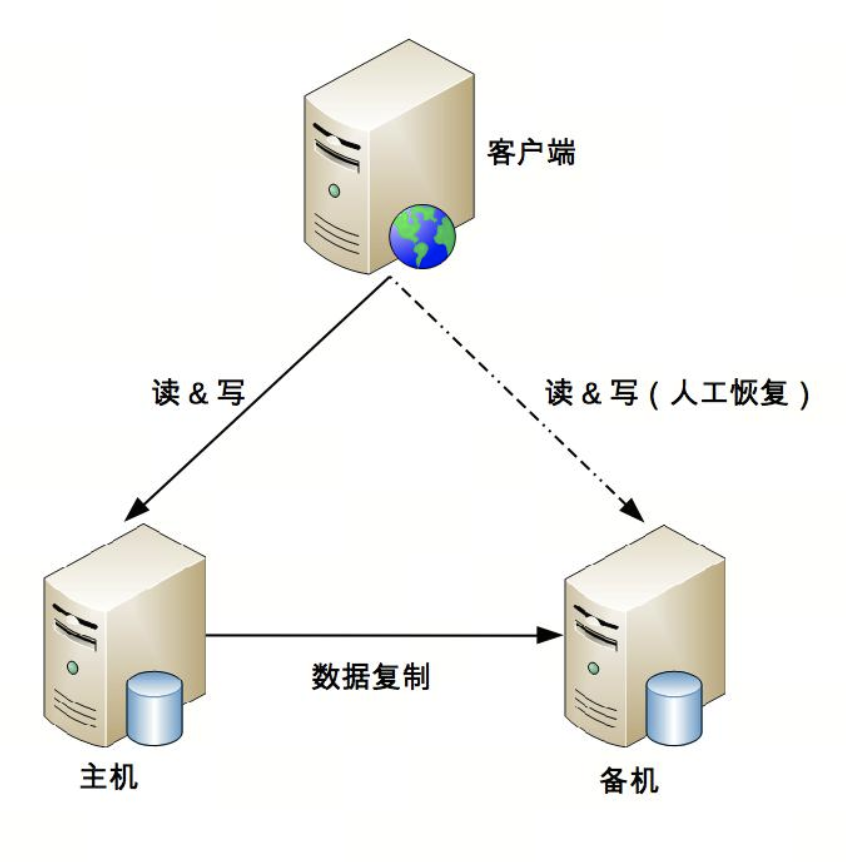
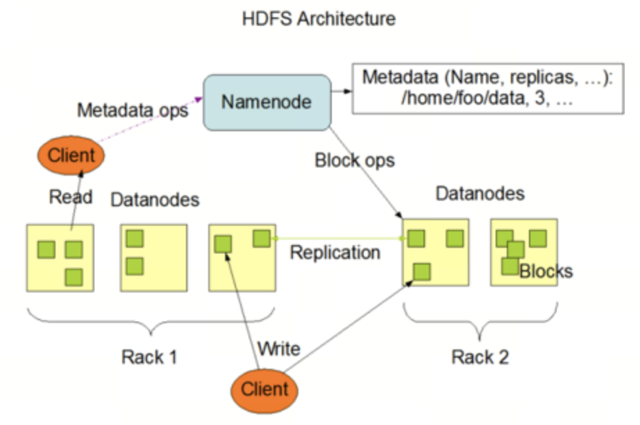

# 第6章 CAP 

在一个分布式系统（指互相连接并共享数据的节点的集合）中，当涉及读写操作时，只能保证一致性（Consistence）、可用性（Availability）、分区容错性（Partition Tolerance）三者中的两个，另外一个必须被牺牲。

分布式系统理论上不可能选择 CA 架构，只能选择 CP 或者 AP 架构。

## CAP 细节

**CAP 关注的粒度是数据，而不是整个系统。**

每个系统不可能只处理一种数据，而是包含多种类型的数据，有的数据必须选择 CP，有的数据必须选择 AP。而如果我们做设计时，从整个系统的角度去选择 CP 还是 AP，就会发现顾此失彼，无论怎么做都是有问题的。

**CAP 是忽略网络延迟的。**

CAP 理论中的 C 在实践中是不可能完美实现的，在数据复制的过程中，节点 A 和节点 B 的数据并不一致。

单个用户的余额、单个商品的库存，理论上要求选择 CP 而实际上 CP 都做不到，只能选择 CA。也就是说，只能单点写入，其他节点做备份，无法做到分布式情况下多点写入。

这并不意味着这类系统无法应用分布式架构，只是说“单个用户余额、单个商品库存”无法做分布式，但系统整体还是可以应用分布式架构的。

**正常运行情况下，不存在 CP 和 AP 的选择，可以同时满足 CA。**

架构设计的时候既要考虑分区发生时选择 CP 还是 AP，也要考虑分区没有发生时如何保证 CA。

**放弃并不等于什么都不做，需要为分区恢复后做准备。**

分区期间放弃 C 或者 A，并不意味着永远放弃 C 和 A，我们可以在分区期间进行一些操作，从而让分区故障解决后，系统能够重新达到 CA 的状态。

最典型的就是在分区期间记录一些日志，当分区故障解决后，系统根据日志进行数据恢复，使得重新达到 CA 状态。

## ACID、BASE

### ACID

ACID 是数据库管理系统为了保证事务的正确性而提出来的一个理论，ACID 包含四个约束:

-   Atomicity（原子性）:一个事务中的所有操作，要么全部完成，要么全部不完成，不会在中间某个环节结束。
-   Consistency（一致性）:在事务开始之前和事务结束以后，数据库的完整性没有被破坏。
-   Isolation（隔离性）:数据库允许多个并发事务同时对数据进行读写和修改的能力。
    -   事务隔离分为不同级别:
    -   包括读未提交（Read uncommitted）
    -   读提交（read committed）
    -   可重复读（repeatable read）
    -   串行化（Serializable）
-   Durability（持久性）:事务处理结束后，对数据的修改就是永久的，即便系统故障也不会丢失。

### BASE

BASE 是指基本可用（Basically Available）、软状态（ Soft State）、最终一致性（ Eventual Consistency），核心思想是即使无法做到强一致性（CAP 的一致性就是强一致性），但应用可以采用适合的方式达到最终一致性。

BASE 理论本质上是对 CAP 的延伸和补充，更具体地说，是对 CAP 中 AP 方案的一个补充。

基本可用（Basically Available）

分布式系统在出现故障时，允许损失部分可用性，即保证核心可用。

软状态（Soft State）

允许系统存在中间状态，而该中间状态不会影响系统整体可用性。这里的中间状态就是 CAP 理论中的数据不一致。

最终一致性（Eventual Consistency）

系统中的所有数据副本经过一定时间后，最终能够达到一致的状态。

# 第7章 FMEA 

FMEA（Failure mode and effects analysis，故障模式与影响分析）又称为失效模式与后果分析、失效模式与效应分析、故障模式与后果分析等，专栏采用“故障模式与影响分析”

在架构设计领域，FMEA 的具体分析方法是：

-   给出初始的架构设计图。
-   假设架构中某个部件发生故障。
-   分析此故障对系统功能造成的影响。
-   根据分析结果，判断架构是否需要进行优化。

FMEA 分析表格包含下面部分:

-   功能点: 这里的“功能点”指的是从用户角度来看的，而不是从系统各个模块功能点划分来看的。
-   故障模式: 故障模式指的是系统会出现什么样的故障，包括故障点和故障形式。
-   故障影响: 当发生故障模式中描述的故障时，功能点具体会受到什么影响，尽量准确描述。
-   严重程度: 严重程度指站在业务的角度故障的影响程度，一般分为“致命 / 高 / 中 / 低 / 无”五个档次。
-   故障原因: 单独将故障原因的目的
    -   不同的故障原因发生概率不相同
    -   不同的故障原因检测手段不一样
    -   不同的故障原因的处理措施不一样
-   故障概率: 一般分为“高 / 中 / 低”三档即可，硬件、开源系统、自研系统
-   风险程度: 风险程度 = 严重程度 × 故障概率
-   已有措施: 检测告警、容错、自恢复等。
-   规避措施: 为了降低故障发生概率而做的一些事情，可以是技术手段，也可以是管理手段。
-   解决措施: 为了能够解决问题而做的一些事情，一般都是技术手段。
-   后续规划: 哪些还缺乏对应的措施，哪些已有措施还不够，针对这些不足的地方给出后续的改进规划

# 第8章 存储高可用

存储高可用方案的本质都是通过将数据复制到多个存储设备，通过数据冗余的方式来实现高可用，其复杂性主要体现在如何应对复制延迟和中断导致的数据不一致问题。

常见的高可用存储架构有主备、主从、主主、集群、分区，每一种又可以根据业务的需求进行一些特殊的定制化功能，由此衍生出更多的变种。

## 主备复制

主备架构中的“备机”主要还是起到一个备份作用，并不承担实际的业务读写操作，如果要把备机改为主机，需要人工操作。

优点就是简单:

-   对于客户端来说，不需要感知备机的存在
-   对于主机和备机来说，双方只需要进行数据复制即可，无须进行状态判断和主备切换

缺点:

-   备机仅仅只为备份，并没有提供读写操作，硬件成本上有浪费
-   故障后需要人工干预，无法自动恢复。

## 主从复制 

主机负责读写操作，从机只负责读操作，不负责写操作。

优点：

-   主从复制在主机故障时，读操作相关的业务可以继续运行。
-   主从复制架构的从机提供读操作，发挥了硬件的性能。

缺点：

-   主从复制架构中，客户端需要感知主从关系，并将不同的操作发给不同的机器进行处理，复杂度比主备复制要高。
-   主从复制架构中，从机提供读业务，如果主从复制延迟比较大，业务会因为数据不一致出现问题。
-   故障时需要人工干预。

一般情况下，写少读多的业务使用主从复制的存储架构比较多。

## 主备倒换与主从倒换 

主备复制和主从复制方案存在两个共性的问题：

-   主机故障后，无法进行写操作。
-   如果主机无法恢复，需要人工指定新的主机角色。

一个完善的切换方案，必须考虑这几个关键的设计点：

-   主备间状态判断
    -   状态传递的渠道：是相互间互相连接，还是第三方仲裁？
    -   状态检测的内容：例如机器是否掉电、进程是否存在、响应是否缓慢等。
-   切换决策
    -   切换时机：什么情况下备机应该升级为主机
    -   切换策略：原来的主机故障恢复后，要再次切换，还是原来的主机故障恢复后自动成为新的备机？
    -   自动程度：切换是完全自动的，还是半自动的？
-   数据冲突解决:当原有故障的主机恢复后，新旧主机之间可能存在数据冲突。

根据状态传递渠道的不同，常见的主备切换架构有三种形式：互连式、中介式和模拟式。

### 互连式

在主备复制的架构基础上，主机和备机多了一个“状态传递”的通道，这个通道就是用来传递状态信息的。这个通道的具体实现可以有很多方式：

-   可以是网络连接（例如，各开一个端口），也可以是非网络连接（用串口线连接）。
-   可以是主机发送状态给备机，也可以是备机到主机来获取状态信息。
-   可以和数据复制通道共用，也可以独立一条通道。
-   状态传递通道可以是一条，也可以是多条，还可以是不同类型的通道混合（例如，网络 +
    串口）。

为了充分利用切换方案能够自动决定主机这个优势，客户端这里也会有一些相应的改变，常见的方式有：

-   为了切换后不影响客户端的访问，主机和备机之间共享一个对客户端来说唯一的地址。例如虚拟
    IP，主机需要绑定这个虚拟的 IP。
-   客户端同时记录主备机的地址，哪个能访问就访问哪个

缺点:

-   如果状态传递的通道本身有故障，那么备机也会认为主机故障了从而将自己升级为主机，而此时主机并没有故障，最终就可能出现两个主机。
-   通过增加多个通道来增强状态传递的可靠性不能从根本上解决这个缺点，可能从不同的通道收到了不同甚至矛盾的状态信息。

### 中介式

中介式指的是在主备两者之外引入第三方中介，主备机之间不直接连接，而都去连接中介，并且通过中介来传递状态信息，其架构图如下：

中介式架构在状态传递和决策上更加简单了:

-   连接管理更简单：主备机无须再建立和管理多种类型的状态传递连接通道，只要连接到中介即可，实际上是降低了主备机的连接管理复杂度。
-   状态决策更简单：主备机的状态决策简单了，无须考虑多种类型的连接通道获取的状态信息如何决策的问题，只需要按照下面简单的算法即可完成状态决策。
    -   无论是主机还是备机，初始状态都是备机，并且只要与中介断开连接，就将自己降级为备机，因此可能出现双备机的情况。
    -   主机与中介断连后，中介能够立刻告知备机，备机将自己升级为主机。
    -   如果是网络中断导致主机与中介断连，主机自己会降级为备机，网络恢复后，旧的主机以新的备机身份向中介上报自己的状态。
    -   如果是掉电重启或者进程重启，旧的主机初始状态为备机，与中介恢复连接后，发现已经有主机了，保持自己备机状态不变。
    -   主备机与中介连接都正常的情况下，按照实际的状态决定是否进行切换。例如，主机响应时间超过 3 秒就进行切换，主机降级为备机，备机升级为主机即可。

其关键代价就在于如何实现中介本身的高可用。为了实现高可用，我们引入中介，但中介本身又要求高可用，于是又要设计中介的高可用方案

### 模拟式

模拟式指主备机之间并不传递任何状态数据，而是备机模拟成一个客户端，向主机发起模拟的读写操作，根据读写操作的响应情况来判断主机的状态。

模拟式切换与互连式切换相比，优点是实现更加简单，因为省去了状态传递通道的建立和管理工作。

简单既是优点，同时也是缺点。因为模拟式读写操作获取的状态信息只有响应信息（例如，HTTP 404，超时、响应时间超过 3 秒等），没有互连式那样多样（除了响应信息，还可以包含 CPU 负载、I/O 负载、吞吐量、响应时间等），基于有限的状态来做状态决策，可能出现偏差。

## 主主复制

主主复制架构具有如下特点：

-   两台都是主机，不存在切换的概念。
-   客户端无须区分不同角色的主机，随便将读写操作发送给哪台主机都可以。

如果采取主主复制架构，必须保证数据能够双向复制，而很多数据是不能双向复制的。

主主复制架构对数据的设计有严格的要求，一般适合于那些临时性、可丢失、可覆盖的数据场景。

## 数据集群

主备、主从、主主架构本质上都有一个隐含的假设：主机能够存储所有数据，但主机本身的存储和处理能力肯定是有极限的。

集群就是多台机器组合在一起形成一个统一的系统，这里的“多台”，数量上至少是 3 台；相比而言，主备、主从都是 2 台机器。根据集群中机器承担的不同角色来划分，集群可以分为两类：数据集中集群、数据分散集群。

### 数据集中集群

数据集中集群为 1 主多备或者 1 主多从。无论是 1 主 1 从、1 主 1 备，还是 1 主多备、1 主多从，数据都只能往主机中写，而读操作可以参考主备、主从架构进行灵活多变。

复杂度整体更高：

-   主机如何将数据复制给备机
-   备机如何检测主机状态
-   主机故障后，如何决定新的主机

### 数据分散集群

数据分散集群指多个服务器组成一个集群，每台服务器都会负责存储一部分数据；同时，为了提升硬件利用率，每台服务器又会备份一部分数据。

复杂点在于如何将数据分配到不同的服务器上：

-   均衡性：保证服务器上的数据分区基本是均衡的
-   容错性：当出现部分服务器故障时，算法需要将原来分配给故障服务器的数据分区分配给其他服务器。
-   可伸缩性：当集群容量不够，扩充新的服务器后，算法能够自动将部分数据分区迁移到新服务器，并保证扩容后所有服务器的均衡性。

数据分散集群中的每台服务器都可以处理读写请求，因此不存在数据集中集群中负责写的主机那样的角色。

在数据分散集群中，必须有一个角色来负责执行数据分配算法，这个角色可以是独立的一台服务器，也可以是集群自己选举出的一台服务器。如果是集群服务器选举出来一台机器承担数据分区分配的职责，则这台服务器一般也会叫作主机，但我们需要知道这里的“主机”和数据集中集群中的“主机”，其职责是有差异的。

Hadoop 的实现就是独立的服务器负责数据分区的分配，这台服务器叫作 Namenode。

Elasticsearch 集群通过选举一台服务器来做数据分区的分配，叫作 master node

数据分散集群，由于其良好的可伸缩性，适合业务数据量巨大、集群机器数量庞大的业务场景。例如，Hadoop 集群、HBase 集群，大规模的集群可以达到上百台甚至上千台服务器。

## 数据分区 

基于地理级别的故障来设计高可用架构，这就是数据分区架构产生的背景。

数据分区指将数据按照一定的规则进行分区，不同分区分布在不同的地理位置上，每个分区存储一部分数据，通过这种方式来规避地理级别的故障所造成的巨大影响。

设计一个良好的数据分区架构，需要从多方面去考虑。

### 数据量

数据量的大小直接决定了分区的规则复杂度。数据量越大，分区规则会越复杂，考虑的情况也越多。

### 分区规则

地理位置有近有远，因此可以得到不同的分区规则，包括洲际分区、国家分区、城市分区。

### 复制规则

常见的分区复制规则有三种：集中式、互备式和独立式。

集中式

集中式备份指存在一个总的备份中心，所有的分区都将数据备份到备份中心

-   设计简单，各分区之间并无直接联系，可以做到互不影响。
-   扩展容易，如果要增加第四个分区（例如，武汉分区），只需要将武汉分区的数据复制到西安备份中心即可，其他分区不受影响。
-   成本较高，需要建设一个独立的备份中心。

互备式

互备式备份指每个分区备份另外一个分区的数据，其基本架构如下：

-   设计比较复杂，各个分区除了要承担业务数据存储，还需要承担备份功能，相互之间互相关联和影响。
-   扩展麻烦，如果增加一个武汉分区，则需要修改广州分区的复制指向武汉分区需要调整所有分区备份关系。
-   成本低，直接利用已有的设备。

独立式

独立式备份指每个分区自己有独立的备份中心，其基本架构如下：

-   设计简单，各分区互不影响。
-   扩展容易，新增加的分区只需要搭建自己的备份中心即可。
-   成本高，每个分区需要独立的备份中心，备份中心的场地成本是主要成本，因此独立式比集中式成本要高很多。

# 第9章 计算高可用 

计算高可用的主要设计目标是当出现部分硬件损坏时，计算任务能够继续正常运行。因此计算高可用的本质是通过冗余来规避部分故障的风险，单台服务器是无论如何都达不到这个目标的。所以计算高可用的设计思想很简单：通过增加更多服务器来达到计算高可用。

计算高可用架构的设计复杂度主要体现在任务管理方面，即当任务在某台服务器上执行失败后，如何将任务重新分配到新的服务器进行执行。

-   哪些服务器可以执行任务
    -   每个服务器都可以执行任务
    -   只有特定服务器（通常叫“主机”）可以执行任务
-   任务如何重新执行
    -   执行失败也不做任何处理，系统只需要保证新的任务能够分配到其他非故障服务器上执行即可。
    -   设计一个任务管理器来管理需要执行的计算任务，服务器执行完任务后，需要向任务管理器反馈任务执行结果

“任务分配器”是一个逻辑的概念，并不一定要求系统存在一个独立的任务分配器模块。

-   Nginx 将页面请求发送给 Web 服务器，而 CSS/JS 等静态文件直接读取本地缓存。这里的 Nginx 角色是反向代理系统，但是承担了任务分配器的职责，而不需要 Nginx 做反向代理，后面再来一个任务分配器。
-   对于一些后台批量运算的任务，可以设计一个独立的任务分配系统来管理这些批处理任务的执行和分配。
-   ZooKeeper 中的 Follower 节点，当接收到写请求时会将请求转发给 Leader 节点处理，当接收到读请求时就自己处理，这里的 Follower 就相当于一个逻辑上的任务分配器。

## 主备

-   主机执行所有计算任务。例如，读写数据、执行操作等。
-   当主机故障（例如，主机宕机）时，任务分配器不会自动将计算任务发送给备机，此时系统处于不可用状态。
-   如果主机能够恢复（不管是人工恢复还是自动恢复），任务分配器继续将任务发送给主机。
-   如果主机不能够恢复（例如，机器硬盘损坏，短时间内无法恢复），则需要人工操作，将备机升为主机，然后让任务分配器将任务发送给新的主机（即原来的备机）；同时，为了继续保持主备架构，需要人工增加新的机器作为备机。

主备架构又可以细分为冷备架构和温备架构。

冷备：备机上的程序包和配置文件都准备好，但备机上的业务系统没有启动（注意：备机的服务器是启动的），主机故障后，需要人工手工将备机的业务系统启动，并将任务分配器的任务请求切换发送给备机。

温备：备机上的业务系统已经启动，只是不对外提供服务，主机故障后，人工只需要将任务分配器的任务请求切换发送到备机即可。冷备可以节省一定的能源，但温备能够大大减少手工操作时间，因此一般情况下推荐用温备的方式。

## 主从

任务分配器需要将任务进行分类，确定哪些任务可以发送给主机执行，哪些任务可以发送给备机执行，其基本的架构示意图如下：

主从方案详细设计：

-   正常情况下，主机执行部分计算任务（如图中的“计算任务 A”），备机执行部分计算任务（如图中的“计算任务 B”）。
-   当主机故障（例如，主机宕机）时，任务分配器不会自动将原本发送给主机的任务发送给从机，而是继续发送给主机，不管这些任务执行是否成功。
-   如果主机能够恢复（不管是人工恢复还是自动恢复），任务分配器继续按照原有的设计策略分配任务，即计算任务 A 发送给主机，计算任务 B 发送给从机。
-   如果主机不能够恢复，则需要人工操作，将原来的从机升级为主机（一般只是修改配置即可），增加新的机器作为从机，新的从机准备就绪后，任务分配器继续按照原有的设计策略分配任务。

主从架构与主备架构相比，优缺点有：

-   优点：主从架构的从机也执行任务，发挥了从机的硬件性能。
-   缺点：主从架构需要将任务分类，任务分配器会复杂一些。

## 集群

在可用性要求更加严格的场景中，我们需要系统能够自动完成切换操作，这就是高可用集群方案。

高可用计算的集群方案根据集群中服务器节点角色的不同，可以分为两类：一类是对称集群，即集群中每个服务器的角色都是一样的，都可以执行所有任务；另一类是非对称集群，集群中的服务器分为多个不同的角色，不同的角色执行不同的任务，例如最常见的 Master-Slave 角色。

### 对称集群

对称集群更通俗的叫法是负载均衡集群

负载均衡集群详细设计：

-   正常情况下，任务分配器采取某种策略（随机、轮询等）将计算任务分配给集群中的不同服务器。
-   当集群中的某台服务器故障后，任务分配器不再将任务分配给它，而是将任务分配给其他服务器执行。
-   当故障的服务器恢复后，任务分配器重新将任务分配给它执行。

负载均衡集群的设计关键点在于两点：

-   任务分配器需要选取分配策略。
-   任务分配器需要检测服务器状态。

### 非对称集群

非对称集群中不同服务器的角色是不同的，不同角色的服务器承担不同的职责。以 Master-Slave 为例，部分任务是 Master 服务器才能执行，部分任务是 Slave 服务器才能执行。

非对称集群架构详细设计：

-   集群会通过某种方式来区分不同服务器的角色。例如，通过 ZAB 算法选举，或者简单地取当前存活服务器中节点 ID 最小的服务器作为 Master 服务器。
-   任务分配器将不同任务发送给不同服务器。例如，图中的计算任务 A 发送给 Master 服务器，计算任务 B 发送给 Slave 服务器。
-   当指定类型的服务器故障时，需要重新分配角色。例如，Master 服务器故障后，需要将剩余的 Slave 服务器中的一个重新指定为 Master 服务器；如果是 Slave 服务器故障，则并不需要重新分配角色，只需要将故障服务器从集群剔除即可。

非对称集群相比负载均衡集群，设计复杂度主要体现在两个方面：

-   任务分配策略更加复杂：需要将任务划分为不同类型并分配给不同角色的集群节点。
-   角色分配策略实现比较复杂：例如，可能需要使用 ZAB、Raft 这类复杂的算法来实现 Leader 的选举。

计算高可用架构，主要解决当单点发生故障后，原本发送到故障节点的任务，任务如何分发给非故障节点，根据业务特点选择分发和重试机制即可，不存在数据一致性问题，只需要保证任务计算完成即可

存储高可用架构，解决的问题是当单点发生故障了，任务如何分发给其他非故障节点，以及如何保障数据的一致性问题。

存储高可用比计算高可用要复杂的多，存储高可用是有状态的，计算高可用一般解决的都是无状态问题，有状态就存在着如何保存状态、同步状态的问题了

# 第10章 业务高可用 

## 异地多活 

异地多活架构的关键点就是异地、多活，其中异地就是指地理位置上不同的地方，类似于“不要把鸡蛋都放在同一篮子里”；多活就是指不同地理位置上的系统都能够提供业务服务，这里的“活”是活动、活跃的意思。

判断一个系统是否符合异地多活，需要满足两个标准：

-   正常情况下，用户无论访问哪一个地点的业务系统，都能够得到正确的业务服务。
-   某个地方业务异常的时候，用户访问其他地方正常的业务系统，能够得到正确的业务服务。

与“活”对应的是字是“备”，备是备份，正常情况下对外是不提供服务的，如果需要提供服务，则需要大量的人工干预和操作，花费大量的时间才能让“备”变成“活”。

异地多活架构代价

-   系统复杂度会发生质的变化，需要设计复杂的异地多活架构。
-   成本会上升，毕竟要多在一个或者多个机房搭建独立的一套业务系统。

### 异地多活架构

根据地理位置上的距离来划分，异地多活架构可以分为同城异区、跨城异地、跨国异地。

1.  同城异区

同城异区是应对机房级别故障的最优架构。同城的两个机房，距离上一般大约就是几十千米，通过搭建高速的网络，同城异区的两个机房能够实现和同一个机房内几乎一样的网络传输速度。

1.  跨城异地

跨城异地指的是业务部署在不同城市的多个机房，而且距离最好要远一些。

距离增加带来的最主要问题是两个机房的网络传输速度会降低，这不是以人的意志为转移的，而是物理定律决定的

中间传输各种不可控的因素也非常多。例如，挖掘机把光纤挖断、中美海底电缆被拖船扯断、骨干网故障等

如果要做到真正意义上的多活，业务系统需要考虑部署在不同地点的两个机房，在数据短时间不一致的情况下，还能够正常提供业务。这就引入了一个看似矛盾的地方：数据不一致业务肯定不会正常，但跨城异地肯定会导致数据不一致。

重点还是在“数据”上，即根据数据的特性来做不同的架构。如果是强一致性要求的数据，例如银行存款余额、支付宝余额等，这类数据实际上是无法做到跨城异地多活的。

1.  跨国异地

跨国异地的距离就更远了，因此数据同步的延时会更长，正常情况下可能就有几秒钟了。这种程度的延迟已经无法满足异地多活标准的第一条：“正常情况下，用户无论访问哪一个地点的业务系统，都能够得到正确的业务服务”。

跨国异地多活的主要应用场景一般有这几种情况：

-   为不同地区用户提供服务
-   只读类业务做多活，例如，谷歌的搜索业务，跨国异地的几秒钟网络延迟，对搜索结果是没有什么影响的。

备份系统平常没有流量，如果直接上线可能触发平常测试不到的故障。
再实时的系统也会有数据延时，如果涉及到金融这种系统，仍然是不敢直接切换的。
系统运行过程中会有很多中间数据，缓存数据等。系统不经过预热直接把流量倒过来，大流量会直接把系统拖垮。

### 异地多活设计技巧

异地多活设计的理念可以总结为一句话：采用多种手段，保证绝大部分用户的核心业务异地多活！

1.  技巧 1：保证核心业务的异地多活

    优先实现核心业务的异地多活架构！

    例：“注册”“登录”“用户信息”三个业务，“登录”才是最核心的业务，“注册”和“用户信息”虽然也是主要业务，但并不一定要实现异地多活，主要原因在于业务影响不同。对于一个日活 1000 万的业务来说，每天注册用户可能是几万，修改用户信息的可能还不到 1 万，但登录用户是 1000 万，很明显我们应该保证登录的异地多活。

2.  技巧 2：保证核心数据最终一致性

    所有数据都实时同步，实际上是一个无法达到的目标。

    -   尽量减少异地多活机房的距离，搭建高速网络
    -   尽量减少数据同步，只同步核心业务相关的数据
    -   保证最终一致性，不保证实时一致性

3.  技巧 3：采用多种手段同步数据

    数据同步是异地多活架构设计的核心，幸运的是基本上存储系统本身都会有同步的功能。例如，MySQL 的主备复制、Redis 的 Cluster 功能、Elasticsearch 的集群功能。

    避免只使用存储系统的同步功能，可以将多种手段配合存储系统的同步来使用，甚至可以不采用存储系统的同步方案，改用自己的同步方案。

    可以采用如下几种方式同步数据：

    -   消息队列方式: 账号数据，由于账号只会创建，不会修改和删除
    -   二次读取方式: B 中心在读取本地数据失败时，可以根据路由规则，再去 A 中心访问一次
    -   存储系统同步方式: 密码数据，由于用户改密码频率较低，数据库的同步机制
    -   回源读取方式: session 数据
    -   重新生成数据方式

    

4.  技巧 4：只保证绝大部分用户的异地多活

    某些场景下我们无法保证 100% 的业务可用性，总是会有一定的损失。

    有没有什么巧妙能做到 100% 可用呢？很遗憾，答案是没有！

    安抚或者补偿:

    -   挂公告
    -   事后对用户进行补偿: 送一些业务上可用的代金券、小礼包等，减少用户的抱怨。
    -   补充体验: 对于为了做异地多活而带来的体验损失，可以想一些方法减少或者规避。

### 异地多活设计步骤

1.  第 1 步：业务分级

    挑选出核心的业务，只为核心业务设计异地多活，降低方案整体复杂度和实现成本。

    -   访问量大的业务
    -   核心业务
    -   产生大量收入的业务

2.  第 2 步：数据分类

    对核心业务相关的数据进一步分析，目的在于识别所有的数据及数据特征

    -   数据量: 总的数据量和新增、修改、删除的量
    -   唯一性: 是否要求多个异地机房产生的同类数据必须保证唯一，要么只能一个中心点产生数据，要么需要设计一个数据唯一生成的算法。
    -   实时性: 实时性要求越高，对同步的要求越高，方案越复杂。
    -   可丢失性: 数据是否可以丢失。
    -   可恢复性: 数据丢失后，是否可以通过某种手段进行恢复

3.  第 3 步：数据同步

    常见的数据同步方案有：

    -   存储系统同步: 优点是使用简单，因为几乎主流的存储系统都会有自己的同步方案；缺点是这类同步方案都是通用的，无法针对业务数据特点做定制化的控制。
    -   消息队列同步: 消息队列同步适合无事务性或者无时序性要求的数据。
    -   重复生成: 适合于可以重复生成的数据。例如，登录产生的 cookie、session 数据、缓存数据等。

4.  第 4 步：异常处理

    异常处理主要有以下几个目的：

    -   问题发生时，避免少量数据异常导致整体业务不可用。
    -   问题恢复后，将异常的数据进行修正。
    -   对用户进行安抚，弥补用户损失。

    措施有这几类：

    -   多通道同步
        -   一般情况下，采取两通道即可，采取更多通道理论上能够降低风险，但付出的成本也会增加很多。
        -   数据库同步通道和消息队列同步通道不能采用相同的网络连接，否则一旦网络故障，两个通道都同时故障；可以一个走公网连接，一个走内网连接。
        -   需要数据是可以重复覆盖的，即无论哪个通道先到哪个通道后到，最终结果是一样的。例如，新建账号数据就符合这个标准，而密码数据则不符合这个标准。
    -   同步和访问结合: 异地机房通过系统的接口来进行数据访问。
        -   接口访问通道和数据库同步通道不能采用相同的网络连接，可以采用接口访问走公网连接，数据库同步走内网连接这种方式。
        -   数据有路由规则，可以根据数据来推断应该访问哪个机房的接口来读取数据。
        -   由于有同步通道，优先读取本地数据，本地数据无法读取到再通过接口去访问，这样可以大大降低跨机房的异地接口访问数量，适合于实时性要求非常高的数据。
    -   日志记录: 用于用户故障恢复后对数据进行恢复
        -   服务器上保存日志，数据库中保存数据，这种方式可以应对单台数据库服务器故障或者宕机的情况。
        -   本地独立系统保存日志，这种方式可以应对某业务服务器和数据库同时宕机的情况。
        -   日志异地保存，这种方式可以应对机房宕机的情况。
    -   用户补偿: 只能最大限度地降低受到影响的范围和程度，无法完全做到没有任何影响。
        -   常见的补偿措施有送用户代金券、礼包、礼品、红包等，有时为了赢得用户口碑，付出的成本可能还会比较大，但综合最终的收益来看还是很值得的。

## 接口级的故障应对方案 

接口级故障的典型表现就是系统并没有宕机，网络也没有中断，但业务却出现问题了。

这类问题的主要原因在于系统压力太大、负载太高，导致无法快速处理业务请求，由此引发更多的后续问题。

解决接口级故障的核心思想和异地多活基本类似：优先保证核心业务和优先保证绝大部分用户。

### 降级 

降级指系统将某些业务或者接口的功能降低，可以是只提供部分功能，也可以是完全停掉所有功能。

降级的核心思想就是丢车保帅，优先保证核心业务。

常见的实现降级的方式有：

-   系统后门降级：系统后门降级的方式实现成本低，但主要缺点是如果服务器数量多，需要一台一台去操作，效率比较低，这在故障处理争分夺秒的场景下是比较浪费时间的。
-   独立降级系统：将降级操作独立到一个单独的系统中，可以实现复杂的权限管理、批量操作等功能。

### 熔断 

降级的目的是应对系统自身的故障，而熔断的目的是应对依赖的外部系统故障的情况。

假设一个这样的场景：A 服务的 X 功能依赖 B 服务的某个接口，当 B 服务的接口响应很慢的时候，A 服务的 X 功能响应肯定也会被拖慢，进一步导致 A 服务的线程都被卡在 X 功能处理上，此时 A 服务的其他功能都会被卡住或者响应非常慢。这时就需要熔断机制了，即：A 服务不再请求 B 服务的这个接口，A 服务内部只要发现是请求 B 服务的这个接口就立即返回错误，从而避免 A 服务整个被拖慢甚至拖死。

熔断机制实现的关键是需要有一个统一的 API 调用层，由 API 调用层来进行采样或者统计，如果接口调用散落在代码各处就没法进行统一处理了。

熔断机制实现的另外一个关键是阈值的设计，例如 1 分钟内 30% 的请求响应时间超过 1 秒就熔断，这个策略中的“1 分钟”“30%”“1 秒”都对最终的熔断效果有影响。实践中一般都是先根据分析确定阈值，然后上线观察效果，再进行调优。

### 限流

降级是从系统功能优先级的角度考虑如何应对故障，而限流则是从用户访问压力的角度来考虑如何应对故障。限流指只允许系统能够承受的访问量进来，超出系统访问能力的请求将被丢弃。

常见的限流方式可以分为两类：基于请求限流和基于资源限流。

1.  基于请求限流

    常见的方式有：限制总量、限制时间量。

    限制总量的方式是限制某个指标的累积上限，常见的是限制当前系统服务的用户总量，例如某个直播间限制总用户数上限为 100 万，超过 100 万后新的用户无法进入；某个抢购活动商品数量只有 100 个，限制参与抢购的用户上限为 1 万个，1 万以后的用户直接拒绝。

    限制时间量指限制一段时间内某个指标的上限，例如，1 分钟内只允许 10000 个用户访问，每秒请求峰值最高为 10 万。

    无论是限制总量还是限制时间量，共同的特点都是实现简单，但在实践中面临的主要问题是比较难以找到合适的阈值

    为了找到合理的阈值，通常情况下可以采用性能压测来确定阈值，但性能压测也存在覆盖场景有限的问题

    根据阈值来限制访问量的方式更多的适应于业务功能比较简单的系统

2.  基于资源限流

    基于资源限流是从系统内部考虑的，即：找到系统内部影响性能的关键资源，对其使用上限进行限制。常见的内部资源有：连接数、文件句柄、线程数、请求队列等。

    基于资源限流相比基于请求限流能够更加有效地反映当前系统的压力，但实践中设计也面临两个主要的难点：如何确定关键资源，如何确定关键资源的阈值。通常情况下，这也是一个逐步调优的过程。

### 排队

排队实际上是限流的一个变种，限流是直接拒绝用户，排队是让用户等待一段时间

由于排队需要临时缓存大量的业务请求，单个系统内部无法缓存这么多数据，一般情况下，排队需要用独立的系统去实现，例如使用 Kafka 这类消息队列来缓存用户请求。
