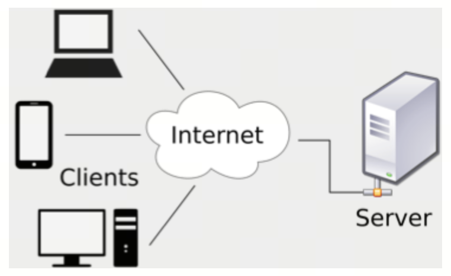
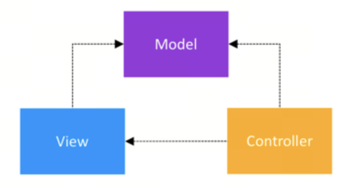
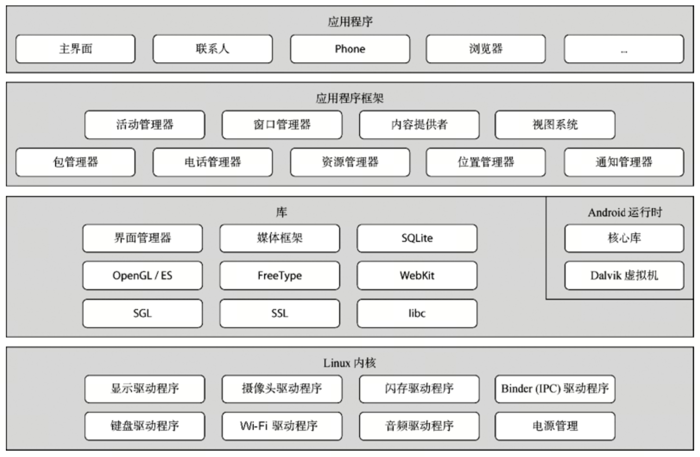
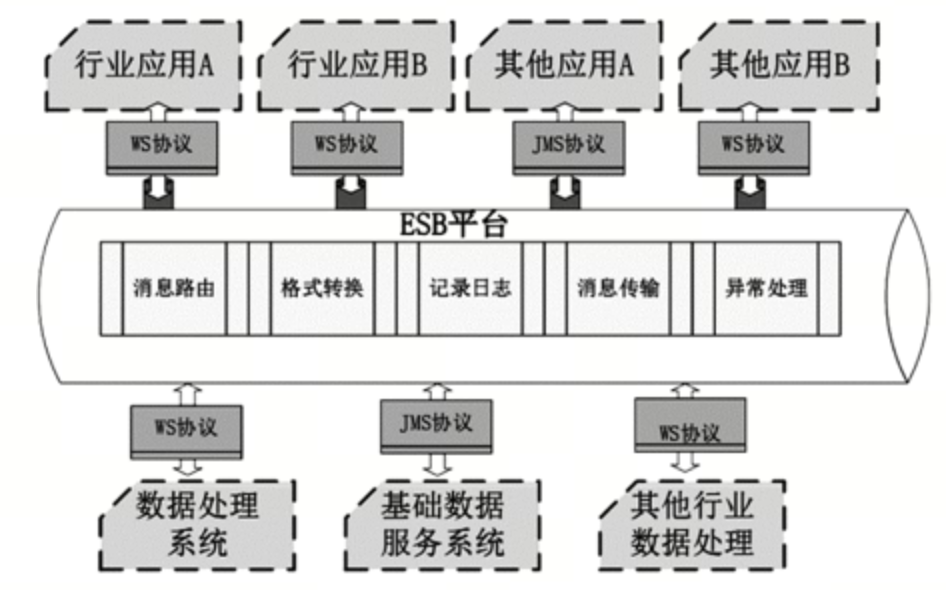
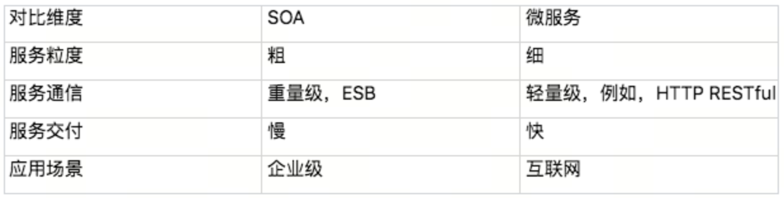
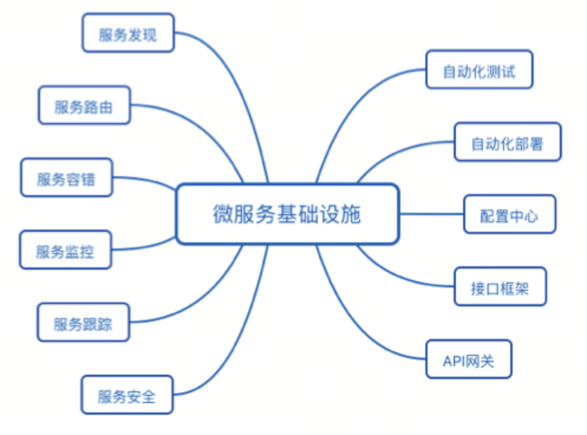
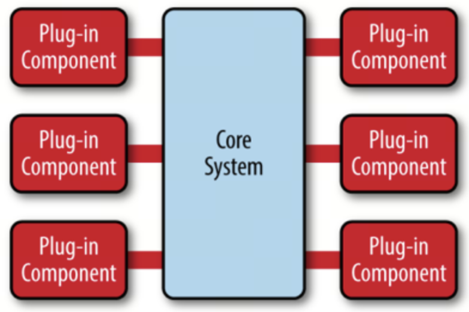
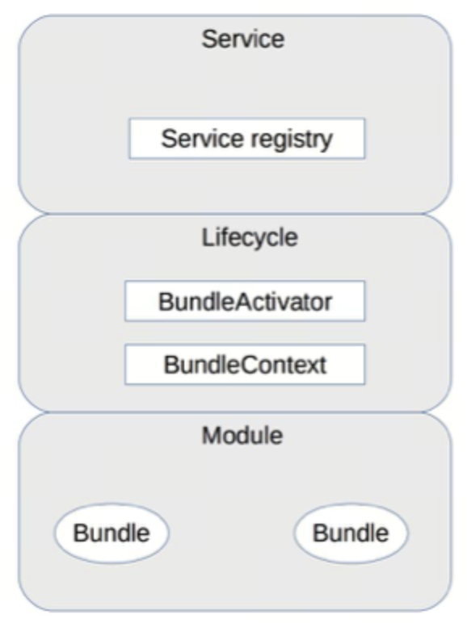
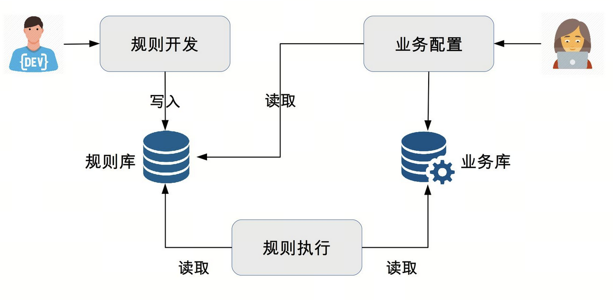

# 第11章 可扩展模式 

软件系统与硬件和建筑系统最大的差异在于软件是可扩展的，一个硬件生产出来后就不会再进行改变、一个建筑完工后也不会再改变其整体结构。

架构可扩展模式内容包括分层架构、SOA 架构、微服务和微内核等

所有的可扩展性架构设计，背后的基本思想都可以总结为一个字：拆！

按照不同的思路来拆分软件系统，就会得到不同的架构。常见的拆分思路有如下三种。

-   面向流程拆分（分层）：将整个业务流程拆分为几个阶段，每个阶段作为一部分。
-   面向服务拆分：将系统提供的服务拆分，每个服务作为一部分。
-   面向功能拆分：将系统提供的功能拆分，每个功能作为一部分。

不同的拆分方式，本质上决定了系统的扩展方式。

## 可扩展方式

合理的拆分，能够强制保证即使程序员出错，出错的范围也不会太广，影响也不会太大。

不同拆分方式应对扩展时的优势。

-   面向流程拆分：扩展时大部分情况只需要修改某一层，不会出现所有层都同时要修改。
-   面向服务拆分：对某个服务扩展，或者要增加新的服务时，只需要扩展相关服务即可，无须修改所有的服务。
-   面向功能拆分：对某个功能扩展，或者要增加新的功能时，只需要扩展相关功能即可，无须修改所有的服务。

不同的拆分方式，将得到不同的系统架构，典型的可扩展系统架构有：

-   面向流程拆分：分层架构。
-   面向服务拆分：SOA、微服务。
-   面向功能拆分：微内核架构。

# 第12章 分层架构 

分层架构是很常见的架构模式，它也叫N层架构。通常情况下，N至少是2层。例如，C/S架构、B/S架构。常见的是3层架构（例如，MVC、MVP
架构），4
层架构5层架构的比较少见，一般是比较复杂的系统才会达到或者超过5层，比如操作系统内核架构。

分层架构设计最核心的一点就是需要保证各层之间的差异足够清晰，边界足够明显，让人看到架构图后就能看懂整个架构

分层架构之所以能够较好地支撑系统扩展，本质在于隔离关注点。

分层时要保证层与层之间的依赖是稳定的，才能真正支撑快速扩展。

分层结构的另外一个特点就是层层传递，也就是说一旦分层确定，整个业务流程是按照层进行依次传递的，不能在层之间进行跳跃。

虽然分层架构的实现在某些场景下看起来有些啰嗦和冗余，但复杂度却很低。

分层架构另外一个典型的缺点就是性能，因为每一次业务请求都需要穿越所有的架构分层，有一些事情是多余的，多少都会有一些性能的浪费。

根据不同的划分维度和对象，可以得到多种不同的分层架构。

## C/S 架构、B/S 架构

划分的对象是整个业务系统，划分的维度是用户交互，即将和用户交互的部分独立为一层

## MVC 架构、MVP 架构

划分的对象是单个业务子系统，划分的维度是职责，将不同的职责划分到独立层

## 逻辑分层架构

划分的对象可以是单个业务子系统，也可以是整个业务系统，划分的维度也是职责。虽然都是基于职责划分，逻辑分层架构中的层是自顶向下依赖的。

PN: 4+1视图中的逻辑视图

# 第13章 SOA架构

SOA出现的背景是企业内部的IT系统重复建设且效率低下，主要体现在：

-   企业各部门有独立的 IT 系统，比如人力资源系统、财务系统、销售系统。例如，某个员工离职后，需要分别到上述三个系统中删除员工的权限。
-   各个独立的 IT 系统可能采购于不同的供应商，实现技术不同，企业自己也不太可能基于这些系统进行重构。
-   随着业务的发展，复杂度越来越高，更多的流程和业务需要多个 IT 系统合作完成。

SOA 提出了 3 个关键概念：

-   服务：所有业务功能都是一项服务，服务就意味着要对外提供开放的能力
-   ESB：“企业服务总线”，ESB 将企业中各个不同的服务连接在一起。因为各个独立的服务是异构的，如果没有统一的标准，则各个异构系统对外提供的接口是各式各样的。
-   松耦合：目的是减少各个服务间的依赖和互相影响。
    -   真正做到松耦合并没有那么容易，要做到完全后向兼容，是一项复杂的任务。

典型的 SOA 架构样例如下：

SOA 架构是比较高层级的架构设计理念，一般情况下我们可以说某个企业采用了 SOA 的架构来构建 IT 系统，但不会说某个独立的系统采用了 SOA 架构。

SOA 解决了传统 IT 系统重复建设和扩展效率低的问题，但其本身也引入了更多的复杂性。SOA 最广为人诟病的就是 ESB，ESB 需要实现与各种系统间的协议转换、数据转换、透明的动态路由等功能。

ESB 虽然功能强大，但现实中的协议有很多种，如 JMS、WS、HTTP、RPC 等，数据格式也有很多种，如 XML、JSON、二进制、HTML 等。ESB 要完成这么多协议和数据格式的互相转换，工作量和复杂度都很大，而且这种转换是需要耗费大量计算性能的，当 ESB 承载的消息太多时，ESB 本身会成为整个系统的性能瓶颈。

# 第14章 微服务 

## 微服务历史

-   2005 年：Dr. Peter Rodgers 在 Web Services Edge 大会上提出了“Micro-Web-Services”的概念。
-   2011 年：一个软件架构工作组使用了“microservice”一词来描述一种架构模式。
-   2012 年：同样是这个架构工作组，正式确定用“microservice”来代表这种架构。
-   2012 年：ThoughtWorks 的 James Lewis 针对微服务概念在 QCon San Francisco 2012 发表了演讲。
-   2014 年：James Lewis 和 Martin Fowler 合写了关于微服务的一篇学术性的文章，详细阐述了微服务。

## 微服务与 SOA 的关系

关于 SOA 和微服务的关系和区别，大概分为下面几个典型的观点。

-   微服务是 SOA 的实现方式
-   微服务是去掉 ESB 后的 SOA
-   微服务是一种和 SOA 相似但本质上不同的架构理念

对比一下 SOA 和微服务的一些具体做法

-   服务粒度: SOA 的服务粒度要粗一些，而微服务的服务粒度要细一些。
-   服务通信: SOA 采用了 ESB 作为服务间通信的关键组件，微服务推荐使用统一的协议和格式
-   服务交付: SOA 对服务的交付并没有特殊要求，微服务的架构理念要求“快速交付”
-   应用场景: SOA 更加适合于庞大、复杂、异构的企业级系统，微服务更加适合于快速、轻量级、基于 Web 的互联网系统

SOA 和微服务本质上是两种不同的架构设计理念，只是在“服务”这个点上有交集而已，因此两者的关系应该是上面第三种观点。

## 微服务的陷阱

微服务具体有哪些坑：

-   服务划分过细，服务间关系复杂
-   服务数量太多，团队效率急剧下降
-   调用链太长，性能下降
-   调用链太长，问题定位困难
-   没有自动化支撑，无法快速交付
-   没有服务治理，微服务数量多了后管理混乱
    -   服务路由：假设某个微服务有 60 个节点，部署在 20 台机器上，那么其他依赖的微服务如何知道这个部署情况呢？
    -   服务故障隔离：假设上述例子中的 60 个节点有 5 个节点发生故障了，依赖的微服务如何处理这种情况呢？
    -   服务注册和发现：同样是上述的例子，现在我们决定从 60 个节点扩容到 80 个节点，或者将 60 个节点缩减为 40 个节点，新增或者减少的节点如何让依赖的服务知道呢？

## 微服务最佳实践

微服务需要避免踩的陷阱，简单提炼为：

-   微服务拆分过细，过分强调“small”。
-   微服务基础设施不健全，忽略了“automated”。
-   微服务并不轻量级，规模大了后，“lightweight”不再适应。

### 服务粒度

建议基于团队规模进行拆分，类似贝索斯在定义团队规模时提出的“两个披萨”理论（每个团队的人数不能多到两张披萨都不够吃的地步）

微服务拆分粒度的“三个火枪手”原则，即一个微服务三个人负责开发。

-   首先，从系统规模来讲，3 个人负责开发一个系统，系统的复杂度刚好达到每个人都能全面理解整个系统，又能够进行分工的粒度
-   其次，从团队管理来说，3 个人可以形成一个稳定的备份，即使 1 个人休假或者调配到其他系统，剩余 2 个人还可以支撑；
-   最后，从技术提升的角度来讲，3 个人的技术小组既能够形成有效的讨论，又能够快速达成一致意见；

“三个火枪手”的原则主要应用于微服务设计和开发阶段，如果微服务经过一段时间发展后已经比较稳定，处于维护期了，无须太多的开发，那么平均 1 个人维护 1 个微服务甚至几个微服务都可以。

### 拆分方法

几种拆分方式不是多选一，而是可以根据实际情况自由排列组合

1.  基于业务逻辑拆分

    最常见的一个问题就是团队成员对于“职责范围”的理解差异很大，经常会出现争论，难以达成一致意见。

    导致这种困惑的主要根因在于从业务的角度来拆分的话，规模粗和规模细都没有问题，因为拆分基础都是业务逻辑，要判断拆分粒度，不能从业务逻辑角度，而要根据前面介绍的“三个火枪手”的原则，计算一下大概的服务数量范围，然后再确定合适的“职责范围”，否则就可能出现划分过粗或者过细的情况，而且大部分情况下会出现过细的情况。

2.  基于可扩展拆分

    将系统中的业务模块按照稳定性排序，将已经成熟和改动不大的服务拆分为稳定服务，将经常变化和迭代的服务拆分为变动服务。

    主要是为了提升项目快速迭代的效率，避免在开发的时候，不小心影响了已有的成熟功能导致线上问题。

3.  基于可靠性拆分

    将可靠性要求高的核心服务和可靠性要求低的非核心服务拆分开来，然后重点保证核心服务的高可用。

    -   避免非核心服务故障影响核心服务
    -   核心服务高可用方案可以更简单
    -   能够降低高可用成本

4.  基于性能拆分

    基于性能拆分和基于可靠性拆分类似，将性能要求高或者性能压力大的模块拆分出来，避免性能压力大的服务影响其他服务。

## 基础设施

每项微服务基础设施都是一个平台、一个系统、一个解决方案

已经有开源的微服务基础设施全家桶了，例如大名鼎鼎的 Spring Cloud 项目，涵盖了服务发现、服务路由、网关、配置中心等功能；如果微服务的数量并不是很多的话，并不是每个基础设施都是必须的

按照下面优先级来搭建基础设施：

1.  服务发现、服务路由、服务容错：这是最基本的微服务基础设施。
2.  接口框架、API 网关：主要是为了提升开发效率，接口框架是提升内部服务的开发效率，API 网关是为了提升与外部服务对接的效率。
3.  自动化部署、自动化测试、配置中心：主要是为了提升测试和运维效率。
4.  服务监控、服务跟踪、服务安全：主要是为了进一步提升运维效率。

# 第15章 微内核架构 

微内核架构（Microkernel Architecture），也被称为插件化架构（Plug-in Architecture），是一种面向功能进行拆分的可扩展性架构，通常用于实现基于产品的应用。

## 基本架构

微内核架构包含两类组件：核心系统（core system）和插件模块（plug-in modules）。核心系统负责和具体业务功能无关的通用功能；插件模块负责实现具体的业务逻辑

## 设计关键点

内核的核心系统设计的关键技术有：插件管理、插件连接和插件通信。

### 插件管理

核心系统需要知道当前有哪些插件可用，如何加载这些插件，什么时候加载插件。常见的实现方法是插件注册表机制。

核心系统提供插件注册表（可以是配置文件，也可以是代码，还可以是数据库），插件注册表含有每个插件模块的信息，包括它的名字、位置、加载时机（启动就加载，还是按需加载）等。

### 插件连接

插件连接指插件如何连接到核心系统。通常来说，核心系统必须制定插件和核心系统的连接规范，然后插件按照规范实现，核心系统按照规范加载即可。

### 插件通信

虽然设计的时候插件间是完全解耦的，但实际业务运行过程中，必然会出现某个业务流程需要多个插件协作，这就要求两个插件间进行通信。由于插件之间没有直接联系，通信必须通过核心系统，因此核心系统需要提供插件通信机制。

## OSGi 架构简析

OSGi 的全称是 Open Services Gateway initiative，本身其实是指 OSGi Alliance。这个联盟是 Sun Microsystems、IBM、爱立信等公司于 1999 年 3 月成立的开放的标准化组织，最初名为 Connected Alliance。它是一个非盈利的国际组织，旨在建立一个开放的服务规范，为通过网络向设备提供服务建立开放的标准，这个标准就是 OSGi specification。现在我们谈到 OSGi，如果没有特别说明，一般都是指 OSGi 的规范。

OSGi 联盟的初始目标是构建一个在广域网和局域网或设备上展开业务的基础平台，所以 OSGi 的最早设计也是针对嵌入式应用的。现在我们谈论 OSGi，已经和嵌入式应用关联不大了，更多是将 OSGi 当作一个微内核的架构模式。

需要注意的是，OSGi 是一个插件化的标准，而不是一个可运行的框架，Eclipse 采用的 OSGi 框架称为 Equinox，类似的实现还有 Apache 的 Felix、Spring 的 Spring DM。

OSGi 框架的逻辑架构图如下：

模块层（Module 层）

模块层实现插件管理功能。OSGi 中，插件被称为 Bundle，每个 Bundle 是一个 Java 的 JAR 文件，每个 Bundle 里面都包含一个元数据文件 MANIFEST.MF，这个文件包含了 Bundle 的基本信息。例如，Bundle 的名称、描述、开发商、classpath，以及需要导入的包和输出的包等，OSGi 核心系统会将这些信息加载到系统中用于后续使用。

生命周期层（Lifecycle 层）

生命周期层实现插件连接功能，提供了执行时模块管理、模块对底层 OSGi 框架的访问。生命周期层精确地定义了 Bundle 生命周期的操作（安装、更新、启动、停止、卸载），Bundle 必须按照规范实现各个操作。

服务层（Service 层）

服务层实现插件通信的功能。OSGi 提供了一个服务注册的功能，用于各个插件将自己能提供的服务注册到 OSGi 核心的服务注册中心，如果某个服务想用其他服务，则直接在服务注册中心搜索可用服务中心就可以了。

这里的服务注册不是插件管理功能中的插件注册，实际上是插件间通信的机制。

## 规则引擎架构简析

规则引擎从结构上来看也属于微内核架构的一种具体实现，其中执行引擎可以看作是微内核，执行引擎解析配置好的业务流，执行其中的条件和规则，通过这种方式来支持业务的灵活多变。

1.  可扩展:
    通过引入规则引擎，业务逻辑实现与业务系统分离，可以在不改动业务系统的情况下扩展新的业务功能。
2.  易理解:
    规则通过自然语言描述，业务人员易于理解和操作，而不像代码那样只有程序员才能理解和开发。
3.  高效率:
    规则引擎系统一般提供可视化的规则定制、审批、查询及管理，方便业务人员快速配置新的业务。

规则引擎的基本架构如下：

-   开发人员将业务功能分解提炼为多个规则，将规则保存在规则库中。
-   业务人员根据业务需要，通过将规则排列组合，配置成业务流程，保存在业务库中。
-   规则引擎执行业务流程实现业务功能。
