# 分布式事务 

[分布式事务详解——不会在收藏夹吃灰的文章](https://segmentfault.com/a/1190000042001173?sort=votes)

## 基本概念

事务四部分构成—— ACID

-   A(Atomic)：原子性，构成事务的所有操作，要么全部执行成功，要么全部执行失败，不会出现部分成功或者部分失败的情况。
-   C(Consistency)：一致性，在事务执行前后，数据库的一致性约束没有被破坏，比如，小勇去银行取100块钱，取之前是600，取之后应该是500，取之前和取之后的数据为正确数值为一致性，如果取出100，而银行里面的钱没有减少，要么小勇要笑醒了，这个就没有达到一致性的要求。
-   I(Isolation):隔离性，数据库中的事务一般都是并发的，隔离性是只在并发的两个事务执行过程互不干扰，一个事务在执行过程中不能看到其他事务运行过程的中间状态，通过配置事务隔离级别可以避免脏读，重复读等问题
-   D(Durability)：持久性，当事务完成之后，事务对数据的更改会被持久化到数据库，且不会回滚

事务分为两部分：本地事务和分布式事务

本地事务：

在计算机系统中，比较多的是通过关系型数据库来控制事务，这是利用数据库本身的事务特性进行实现的，因为应用主要靠关系型数据库来维持事务，加上数据库和应用都在同一个服务器，所以基于关系型数据的事务又被称为本地事务。

分布式事务：

分布式事务是指事务的参与者、支持事务的服务器、资源服务器以及事务管理者分别位于不同的分布式系统的不同节点之上，且属于不同的应用，分布式事务需要保证这些操作要么全部成功，要么全部失败，分布式事务就是为了保证在不同服务器上数据库数据的一致性。

分布式系统会把一个应用拆分为多个可独立部署的服务，服务于服务之间通常需要远程协作才能完成事务的操作，这种分布式系统环境下由于不同的服务之间通过网络远程协作完成的事务被称为分布式事务，例如供应链系统中，订单创建（生成订单、扣减库存、履约通知发货）等

## 分布式事务

分布式事务是什么？

分布式事务指的是事务的参与者，支持事务的服务器，资源服务器分别位于分布式系统的不同节点之上，通常一个分布式事物中会涉及到对多个数据源或业务系统的操作。

随着互联网的发展，从之前的单一项目逐渐向分布式服务做转换，现如今微服务在各个公司已经普遍存在，而当时的本地事务已经无法满足分布式应用的要求，因此分布式服务之间事务的协调就产生了问题，如果做到多个服务之间事务的操作，能够像本地事务一样遵循ACID原则，成为一个难题，但是在大牛们不断的探索下，终于找到了分布式事务存在两大理论依据：CAP定律和BASE理论

### CAP定律

CAP定律由一致性(C)、可用性(A)、分区容错性(P)组成，在分布式系统中，不可能同时满足Consistency(一致性)/Availability(可用性)/Partition
tolerance(分区容错性) 三个特性，最多只能同时满足其中两项。

-   一致性(C)：在分布式系统中所有的数据备份，在同一时刻保持一致的特性，所有的应用节点访问的都是同一份最新的数据副本。
-   可用性(A): 当集群中一部分节点故障以后，集群整体能够响应客户端的读写请求，对数据更新具备高可用性。
-   分区容错性(P): 如果系统在规定时间限制内不能达成数据的一致性，就表示要发生分区的情况，当前操作需要在C和A之间做出选择，让系统能够在遇到网络故障等情况的时候，任然能够保证对外提供满足一致性或者可用性的服务。

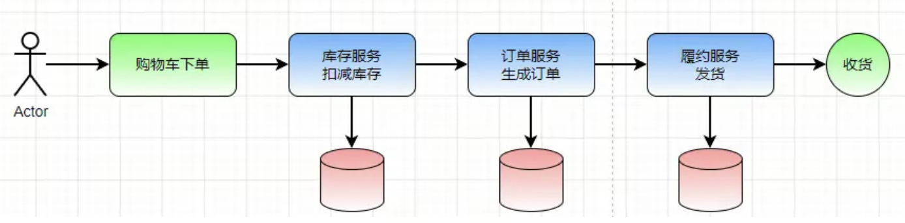

在上图中我们可以看到，当我们用户去购物车里面点击下单结算的时候，首先会经过我们库存服务，判断库存是否足够，当库存满足，扣减库存以后，我们需要将数据同步到其他服务器上，这一步是为了保证数据的结果的一致性，这个时候如果网络产生波动了，我们的系统需要保证分区容错性，也就是我们必须容忍网络所带来的一些问题，此时想保证一致性，就需要舍弃可用性。

但是如果为了保证高可用性，那么在高并发的情况下，是无法保证在限定时间内给出响应，由于网络的不可靠，我们的订单服务可能无法拿到最新的数据，但是我们要给用户做出响应，那么也无法保证一致性，所以AP是无法保证强一致性的

如果既想要保证高可用又想要保证一致性，必须在网络良好的情况下才能实现，那么解决方法只有一个，那就是需要将库存、订单、履约放到一起，但是这个就上去了我们微服务的作用，也就不再是分布式系统了

在分布式系统中，分区容错性是必须存在的，我们只能在一致性和可用性上取舍，在这种条件下就诞生了BASE理论

### BASE理论

BASE由 基本可用 (Basically Available)、软状态 (Soft state)和 最终一致性 (Eventually consistent) 三个构建而成，是对CAP中一致性和可用性权衡的结果，来源于对互联网系统分布式实践的总结，是基于CAP定理逐步演化而来的，核心四系那个是及时无法做到强一致性，但是每个应用都可以根据自身的业务特点，采用适当的方式来使系统达到最终一致性。

基本可用

基本可用是指当分布式系统出现不可预知故障的时候，允许损失部分可用性，但是这里并不是说表示系统不可以用，主要体现为以下几点:

响应时间上的损失，在正常情况下，一个在线搜索引擎需要在0.5秒之内返回给用户响应的查询结果，但是由于出现故障，查询结果的响应时间增加了1-2秒

系统功能上的损失，在正常情况下，一个电子商务网站上进行购物，消费者几乎能够顺利的完成每一单操作，但是在一些节日大促销购物高峰期的时候，由于网站上购买量的猛增，为了保证系统的稳定性，部分消费者可能会引导到一个临时降级处理的页面或者提示

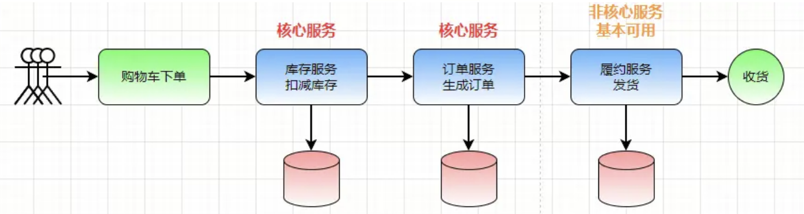

基本可用的意思是，对于我们的核心服务是可以使用的，其他的服务可以适当的降低响应时间，甚至是进行服务降级处理，在当前中，库存和订单肯定是核心服务，至于我们的发货系统在当时只要保证基本可用就行，它的同步可以慢一点或者延迟更高，等待流量高峰过去以后，在进行恢复。

软状态

软状态是指允许系统中的数据存在中间状态，并认为该中间状态的存在不会影响系统的整体可用性，即允许系统不用节点的数据副本之间进行数据同步的过程存在延时

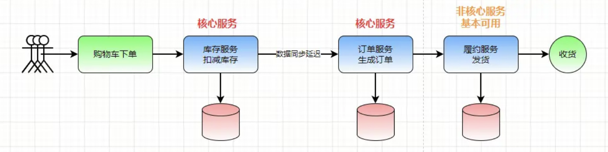

软状态的意思是说，当我们大量下单的时候，扣减库存时，流量激增，这个时候如果大量访问到库存或者订单中，可能会将系统弄垮，这个过程中我们可以允许数据的同步存在延迟，不影响整体系统的使用。

最终一致性

最终一致性强调的是所有数据副本，在经过一段时间的同步之后，最终都能够达到一个一致的状态，因此，最终一致性的本质是需要系统保证最终数据能够达到一致，而不是需要实时保证系统的强一致性。

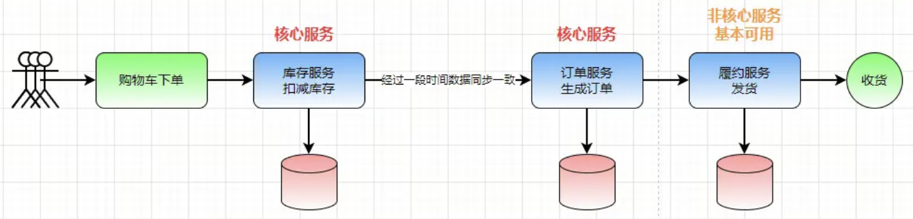

经过流量高峰期以后，经过一段时间的同步，从中间状态最后变成数据最终一致性，保证各个服务数据的一致性。

## 二阶段提交(2PC)

2PC即两阶段提交协议，是将整个事务流程分为两个阶段，P是指准备阶段，C是指提交阶段。

就好比我们去KCC买冰淇淋吃，那刚好有活动，第二杯半价，但是你是一个人，这个时候刚好有个小姐姐过来，正在考虑买不买冰淇淋吃，这个时候你和她提出了AA，也就会说只有当你和她都同意买这个的时候，才能购买到，如果两个人中有一个不同意那么就不能买这个冰淇淋吃。

阶段一：准备阶段

老板要求你先进行付款，你同意付款完成后，再要求女方付款，女方同意付款完成

阶段二：提交阶段 都付款完成，老板出餐，两个人都吃到冰淇淋

这个例子就组成了一个事务。如果男女双方有一个人拒绝付款，那么老板就不会出餐，并且会把已收取的钱原路退回。

整个事务过程是由事务管理器和参与者组成的，店老板就是事务管理器，你和那个女孩就是参与者，事务管理器决策整个分布式事务在计算机中关系数据支持两阶段提交协议：

-   准备阶段(Prepare phase)：事务管理器给每个参与者发送 Prepare 消息，每个数据库参与者在本地执行事务，并写本地的 Undo/Redo 日志，此时事务没有提交。
    -   undo日志是记录修改前的数据，用于数据库回滚
    -   Redo 日志是记录修改后的数据，用于提交事务写入数据文件
-   提交阶段(commit phase)：如果事务管理器收到了参与者的执行失败或者超时消息时，直接给每个参与者发送(Rollback) 消息，如果收到参与者都成功，发送(Commit) 参与者根据事务管理器的指令执行提交或者回滚操作，并释放事务处理过程中使用的资源。

成功提交：

事务管理器向所有参与者发送事务内容，询问是否准备好了，等待参与者的响应，各个参与者事务节点执行事务操作，并将 Undo和Redo 信息记入事务日志中。如果参与者成功执行事务操作，反馈事务管理器YES操作，表示事务可以执行，假如协调者从所有的参与者或得反馈都是Yes响应，那么就会执行事务提交。

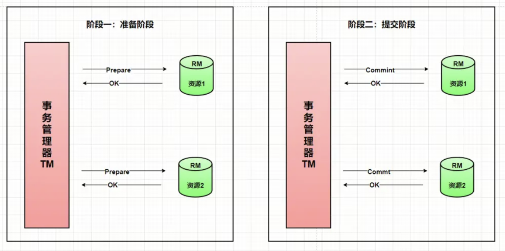

失败：

假如任何一个参与者向事务管理器反馈了No指令，或者等待超时之后，事务管理器无法接收到所有参与者的反馈响应，那么中断事务，发送回滚请求，事务管理器向所有参与者节点发送 RollBack 请求，参与者接收到 RollBack 请求后，会利用在阶段一记录的Undo信息执行事务的回滚操作，在完成回滚之后释放事务执行期间占用的资源，参与者在完成事务回滚之后，向协调者发送ACK消息，事务管理器在接受到所有参与者反馈的ACK消息之后，完成事务中断。

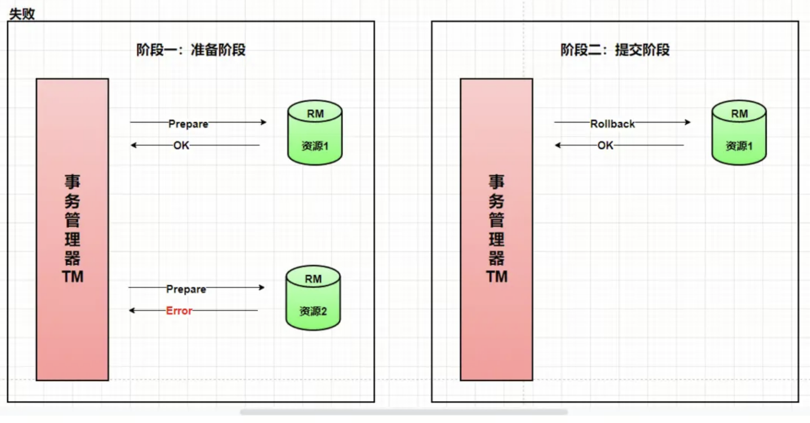

## 三阶段提交(3PC)

3PC 主要是为了解决两阶段提交协议的单点故障问题和缩小参与者阻塞范围。是二阶段提交（2PC）的改进版本，引入参与节点的超时机制之外，3PC把2PC的准备阶段分成事务询问（该阶段不会阻塞）和事务预提交,则三个阶段分别为 CanCommit、PreCommit、DoCommit

CanCommit 询问状态

CanCommit阶段 协调者(Coordinator)会向参与者(Participant) 发送CanCommit消息，询问是否可以执行操作，参与者收到消息后，表示能够执行，会返回给协调者能够执行的(yes)命令

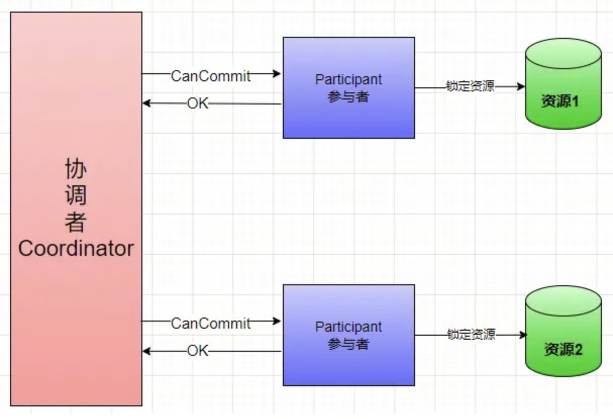

如果参与者不能执行，会返回No命令,释放资源，结束事务。

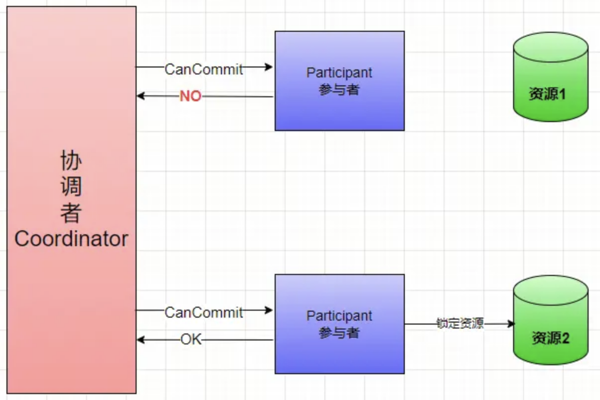

PreCommit 预提交

PreCommit 阶段如果协调者收到参与者返回的状态值为YES，那么就证明它们都有能力去执行这个操作，那么协调者就会向所有参与者 发送 PreCommit 消息，协调者收到 PreCommit消息后，回去执行本地事务，如果执行成功会将本地事务保存到 undo和redo 后，再返回给协调者YES指令，如果执行本地事务失败，返回协调者No,只要协调者收到一个执行失败，给所有参与者发送中断事务消息，参与者收到消息后，对事务进行回滚操作。

在这个阶段参与者和协调者都引入了超时机制，如果参与者没有收到，协调者的消息，或者协调者没有收到参与者返回的预执行结果状态，在等待超时之后，事务会中断，避免了事务的阻塞。

协调者向参与者发送PreCommit，如果参与者执行成功，返回yes

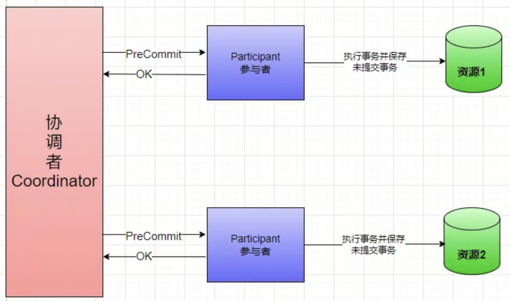

如果参与者执行失败，只有有一个返回No到协调者，协调者会向参与者发送中断事务的消息，参与者回滚事务。

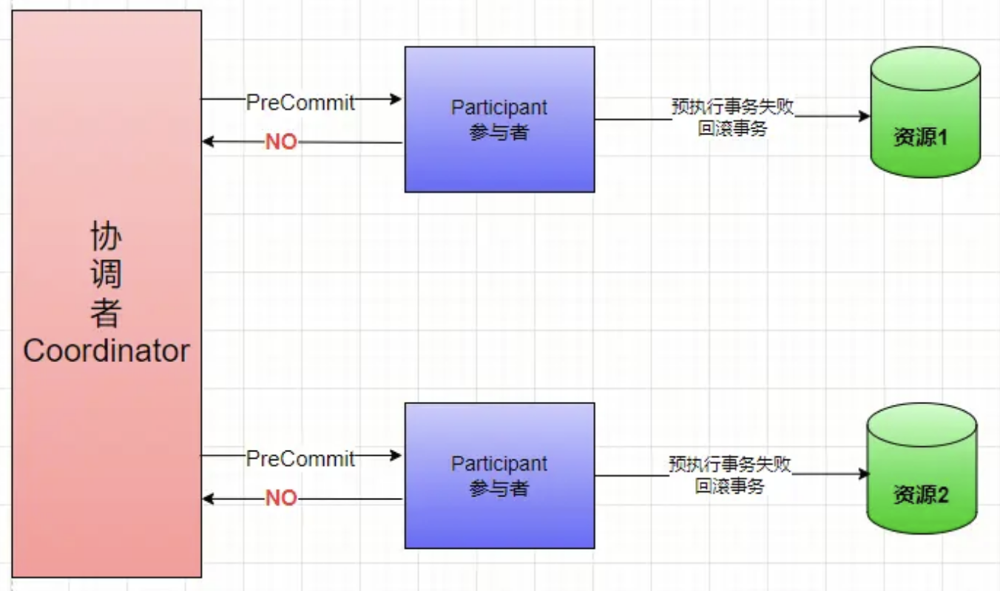

DoCommit 提交

协调者收到所有参与者返回的状态都是YES，这时协调者会向所有的参与者都发送 DoCommit ，参与者收到 DoCommit 后，会真正的提交事务，当事务提交成功后，返回协调者YES状态，表示我已经完成事务的提交了，协调者收到所有参与者都返回YES状态后，那么就完成了本次事务。

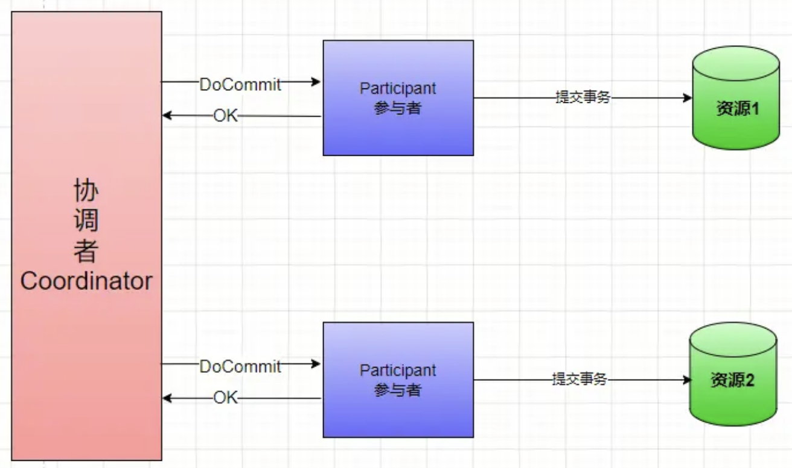

如果某个参与者返回No消息，协调者发送中断事务消息(abort)，给参与者们，参与者回滚事务

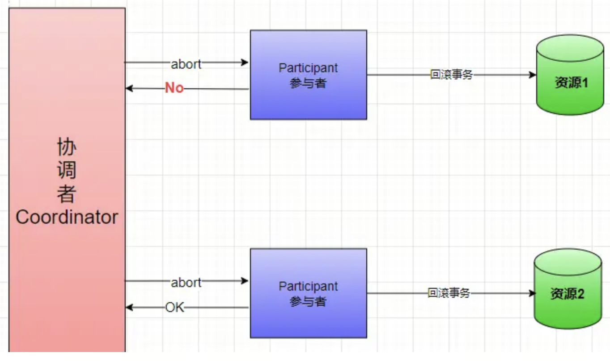

3PC是2PC的升级版，引入了超时机制，解决了单点故障引起的事务阻塞问题，但是3PC依然不能解决事务一致性的问题，因为在DoCommit阶段，如果由于网络或者超时等原则导致参与者收不到协调者发送过来的 中断事务消息(abort) ，过了这个时间后，参与者会提交事务，本来是应该进行回滚，提交事务后，会导致数据不一致的问题出现，2PC虽然在网络故障情况下存在强一致性被破坏的问题，但是故障恢复以后能保证最终一致性，3PC虽然有超时时间，解决了阻塞，提高了可用性，但是牺牲了一致性，如果针对网络波动问题导致数据问题这一点上，2PC是优于3PC的

说到分布式事务，就会谈到那个经典的”账号转账”问题：2个账号，分布处于2个不同的DB，对应2个不同的系统A,B。A要扣钱，B要加钱，如何保证原子性？

## 传统方案2PC

2PC的理论层面

2pc涉及到2个阶段，3个操作：

-   阶段1：“准备提交”。事务协调者向所有参与者发起prepare，所有参与者回答yes/no。
-   阶段2：“正式提交”。如果所有参与者都回答yes，则向所有参与者发起commit；否则，向所有参与者发起rollback。
-   因此，要实现2pc，所有参与者，都得实现3个接口：prepare/commit/rollback。

2PC的实现层面

对应的实现层面，也就是XA协议，通常的数据库都实现了这个协议。

2PC的问题

问题1：阶段2，事务协调者挂了，则所有参与者接受不到commit/rollback指令，将处于“悬而不决”状态

问题2：阶段2，其中一个参与者超时或者出错，那其他参与者，是commit，还是rollback呢？
也不能确定

为了解决2pc的问题，又引入3pc。3pc有类似的挂了如何解决的问题，因此还是没能彻底解决问题，此处就不详述了。

问题3：2PC的实现，目前主要是用在数据库层面（数据库实现了XA协议）。但目前，大家基本都是微服务架构，不会直接在2个业务DB之间搞一致性，而是想如何在2个服务上面实现一致性。

正因为2PC有上面诸多问题和不便，实践中一般很少使用，而是采用下面将要讲的各种方案。

## 最终一致性

一般的思路都是通过消息中间件来实现“最终一致性”：A系统扣钱，然后发条消息给中间件，B系统接收此消息，进行加钱。

但这里面有个问题：A是先update DB，后发送消息呢？ 还是先发送消息，后update DB？

假设先update DB成功，发送消息网络失败，重发又失败，怎么办？

假设先发送消息成功，update DB失败。消息已经发出去了，又不能撤回，怎么办？

所以，这里下个结论： 只要发送消息和update DB这2个操作不是原子的，无论谁先谁后，都是有问题的。

那这个问题怎么解决呢？？

### 错误的方案0

有人可能想到了，我可以把“发送消息”这个网络调用和update DB放在同1个事务里面，如果发送消息失败，update DB自动回滚。这样不就保证2个操作的原子性了吗？

这个方案看似正确，其实是错误的，原因有2：

（1）网络的2将军问题：发送消息失败，发送方并不知道是消息中间件真的没有收到消息呢？还是消息已经收到了，只是返回response的时候失败了？

如果是已经收到消息了，而发送端认为没有收到，执行update db的回滚操作。则会导致A账号的钱没有扣，B账号的钱却加了。

（2）把网络调用放在DB事务里面，可能会因为网络的延时，导致DB长事务。严重的，会block整个DB。这个风险很大。

基于以上分析，我们知道，这个方案其实是错误的！

## 方案1: 最终一致性（业务方自己实现）

假设消息中间件没有提供“事务消息”功能，比如你用的是Kafka。那如何解决这个问题呢？

解决方案如下：

 （1）Producer端准备1张消息表，把update DB和insert message这2个操作，放在一个DB事务里面。

（2）准备一个后台程序，源源不断的把消息表中的message传送给消息中间件。失败了，不断重试重传。允许消息重复，但消息不会丢，顺序也不会打乱。

（3）Consumer端准备一个判重表。处理过的消息，记在判重表里面。实现业务的幂等。但这里又涉及一个原子性问题：如果保证消息消费 + insert message到判重表这2个操作的原子性？

消费成功，但insert判重表失败，怎么办？ exactly once问题

通过上面3步，我们基本就解决了这里update db和发送网络消息这2个操作的原子性问题。

但这个方案的一个缺点就是：需要设计DB消息表，同时还需要一个后台任务，不断扫描本地消息。导致消息的处理和业务逻辑耦合额外增加业务方的负担。

## 方案2: 最终一致性（RocketMQ 事务消息）

为了能解决该问题，同时又不和业务耦合，RocketMQ提出了“事务消息”的概念。

具体来说，就是把消息的发送分成了2个阶段：Prepare阶段和确认阶段。

具体来说，上面的2个步骤，被分解成3个步骤：

1.  发送Prepared消息
2.  update DB
3.  根据update DB结果成功或失败，Confirm或者取消Prepared消息。

可能有人会问了，前2步执行成功了，最后1步失败了怎么办？这里就涉及到了RocketMQ的关键点：RocketMQ会定期（默认是1分钟）扫描所有的Prepared消息，询问发送方，到底是要确认这条消息发出去？还是取消此条消息？

总结：对比方案2和方案1，RocketMQ最大的改变，其实就是把“扫描消息表”这个事情，不让业务方做，而是消息中间件帮着做了。

至于消息表，其实还是没有省掉。因为消息中间件要询问发送方，事物是否执行成功，还是需要一个“变相的本地消息表”，记录事物执行状态。

人工介入

可能有人又要说了，无论方案1，还是方案2，发送端把消息成功放入了队列，但消费端消费失败怎么办？

消费失败了，重试，还一直失败怎么办？是不是要自动回滚整个流程？

答案是人工介入。从工程实践角度讲，这种整个流程自动回滚的代价是非常巨大的，不但实现复杂，还会引入新的问题。比如自动回滚失败，又怎么处理？

对应这种极低概率的case，采取人工处理，会比实现一个高复杂的自动化回滚系统，更加可靠，也更加简单。

## 方案3：TCC

为了解决SOA系统中的分布式事务问题，支付宝提出了TCC。2PC通常都是在跨库的DB层面，而TCC本质就是一个应用层面的2PC。

同样，TCC中，每个参与者需要3个操作：Try/Confirm/Cancel，也是2个阶段。
阶段1：”资源预留/资源检查“，也就是事务协调者调用所有参与者的Try操作
阶段2：“一起提交”。如果所有的Try成功，一起执行Confirm。否则，所有的执行Cancel.

TCC是如何解决2PC的问题呢？

关键：Try阶段成功之后，Confirm如果失败(不管是协调者挂了，还是某个参与者超时），不断重试！！

同样，Cancel失败了，也是不断重试。这就要求Confirm/Cancel都必须是幂等操作。

下面以1个转账case为例，来说明TCC的过程：

有3个账号A, B, C，通过SOA提供的转账服务操作。A, B同时分别要向C转30, 50元，最后C的账号+80，A, B各减30, 50。

-   阶段1：A账号锁定30，B账号锁定50，检查C账号的合法性（比如C账号是否违法被冻结，C账号是否已注销）。 所以，对应的“扣钱”的Try操作就是”锁定”，对应的“加钱”的Try操作就是检查账号合法性
-   阶段2：A, B, C都Try成功，执行Confirm。即A, B减钱，C加钱。如果任意一个失败，不断重试！

从上面的案例可以看出，Try操作主要是为了“保证业务操作的前置条件都得到满足”，然后在Confirm阶段，因为前置条件都满足了，所以可以不断重试保证成功。

## 方案4：事务状态表 + 调用方重试 + 接收方幂等 （同步 + 异步）

同样以上面的转账为例：调用方调系统A扣钱，系统B加钱，如何保证2个同时成功？

调用方维护1张事务状态表（或者说事务日志，日志流水），每次调用之前，落盘1条事务流水，生成1个全局的事务ID。

初始状态是Init，每调用成功1个系统更新1次状态（这里就2个系统），最后所有系统调用成功，状态更新为Success。

当然，你也可以不保存中间状态，简单一点，你也可以只设置2个状态：Init/Success，或者说begin/end。

然后有个后台任务，发现某条流水，在过了某个时间之后(假设1次事务执行成功通常最多花费30s)，状态仍然是Init，那就说明这条流水有问题。就重新调用系统A，系统B，保证这条流水的最终状态是Success。当然，系统A, 系统B根据这个全局的事务ID，做幂等，所以重复调用也没关系。

这就是通过同步调用 + 后台任务异步补偿，最终保证系统一致性。

补充说明：

1.  如果后台任务重试多次，仍然不能成功，那要为状态表加1个Error状态，要人工介入干预了。
2.  对于调用方的同步调用，如果部分成功，此时给客户端返回什么呢？
    答案是不确定，或者说暂时未知。你只能告诉用户，该笔转账超时，稍后再来确认。
3.  ）对于同步调用，调用方调用A，或者B失败的时候，可以重试3次。重试3次还不成功，放弃操作。再交由后台任务后续处理。

## 方案4的扩展：状态机 + 对账

把方案4扩展一下，岂止事务有状态，系统中的各种数据对象都有状态，或者说都有各自完整的生命周期。

这种完整的生命周期，天生就具有校验功能！！！我们可以很好的利用这个特性，来实行系统的一致性。

一旦我们发现系统中的某个数据对象，过了一个限定时间，生命周期仍然没有走完，仍然处在某个中间状态，那就说明系统不一致了，可以执行某种操作。

举个电商系统的订单的例子：一张订单，从“已支付”，到“下发给仓库”，到“出仓完成”。假定从“已支付”到“下发给仓库”，最多用1个小时；从“下发给仓库”到“出仓完成”，最多用8个小时。

那意味着：只要我发现1个订单的状态，过了1个小时之后，还是“已支付”，我就认为订单下发没有成功，我就重新下发，也就是上面所说的“重试”；

同样，只要我发现订单过了8个小时，还未出仓，我这个时候可能就会发报警出来，是不是仓库的作业系统出了问题。。。诸如此类。

更复杂一点：订单有状态，库存系统的库存也有状态，优惠系统的优惠券也有状态，根据业务规则，这些状态之间进行比对，就能发现系统某个地方不一致，做相应的补偿行为。

上面说的“最终一致性”和TCC、状态机+对账，都是比较“完美”的方案，能完全保证数据的一致性。

但是呢，最终一致性这个方案是异步的；

TCC需要2个阶段，性能损耗大；

事务状态表，或者状态机，每次要记事务流水，要更新状态，性能也有损耗。

如果我需要1个同步的方案，可以立马得到结果，同时又要有很高的性能，支持高并发，那怎么处理呢？

## 方案5：妥协方案 弱一致性 + 基于状态的补偿

举个典型场景：

电商网站的下单，扣库存。订单系统有订单的DB，订单的服务；库存系统有库存的DB，库存的服务。
如何保证下单 + 扣库存，2个的原子性呢？

如果用上面的最终一致性方案，因为是异步的，库存扣减不及时，会导致超卖，因此最终一致性的方案不可行；

如果用TCC的方案，性能可能又达不到。

这里，就采用了一种弱一致的方案，什么意思呢？

对于该需求，有1个关键特性：对于电商的购物来讲，允许少卖，但不能超卖。你有100件东西，卖给99个人，有1件没有卖出去，这个可以接受；但是卖给了101个人，其中1个人拿不到货，平台违约，这个就不能接受。

而该处就利用了这个特性，具体是这么做的：

先扣库存，再提交订单。

1.  扣库存失败，不提交订单了，直接返回失败，调用方重试（此处可能会多扣库存）
2.  扣库存成功，提交订单失败，返回失败，调用方重试（此处可能会多扣库存）
3.  扣库存成功，提交订单成功，返回成功。

反过来，你先提交订单，后扣库存，也是按照类似的这个思路。

最终，只要保证1点：库存可以多扣，不能少扣！！！

但是，库存多扣了，这个数据不一致，怎么补偿呢？

库存每扣1次，都会生成1条流水记录。这条记录的初始状态是“占用”，等订单支付成功之后，会把状态改成“释放”。

对于那些过了很长时间，一直是占用，而不释放的库存。要么是因为前面多扣造成的，要么是因为用户下了单，但不支付。

通过比对，库存系统的“占用又没有释放的库存流水“与订单系统的未支付的订单，我们就可以回收掉这些库存，同时把对应的订单取消掉。（就类似12306网站一样，过多长时间，你不支付，订单就取消了，库存释放）

## 方案6： 妥协方案 重试 + 回滚 + 监控报警 + 人工修复

对于方案5，我们是基于订单的状态 + 库存流水的状态，做补偿（或者说叫对账）。

如果业务很复杂，状态的维护也很复杂。方案5呢，就是1种更加妥协而简单的办法。

提交订单不是失败了嘛！

先重试！

重试还不成功，回滚库存的扣减！

回滚也失败，发报警出来，人工干预修复！

总之，根据业务逻辑，通过重试3次，或者回滚的办法，尽最大限度，保证一致。实在不一致，就发报警，让人工干预。只要日志流水记录的完整，人工肯定可以修复！
（通常只要业务逻辑本身没问题，重试、回滚之后，还失败的概率会比较低，所以这种办法虽然丑陋，但蛮实用）

## 总结

其他的，诸如状态机驱动、1PC之类的办法，只是说法不一，个人认为本质上都是方案4/方案5的做法。

在上文中，总结了实践中比较靠谱的6种方法：2种最终一致性的方案，2种妥协办法，2种基于状态 + 重试的方法（TCC，状态机 + 重试 + 幂等）。

实现层面，妥协的办法肯定最容易，TCC最复杂。
