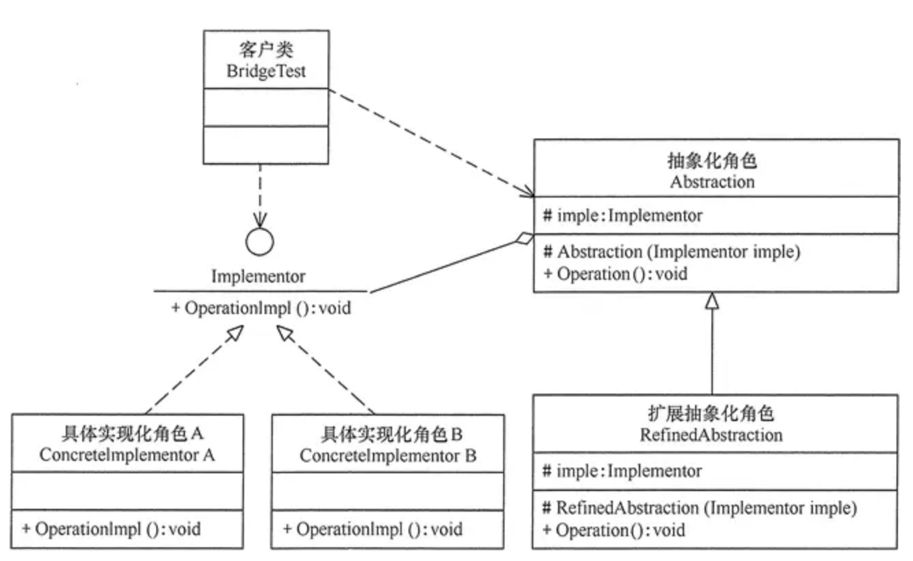
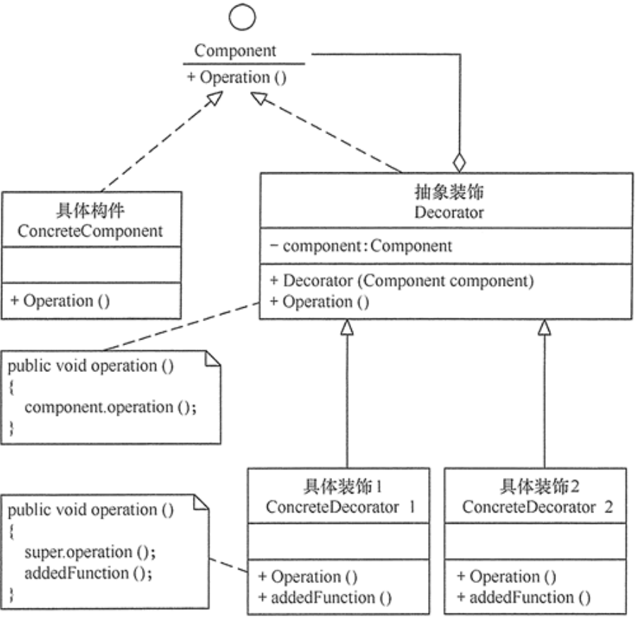
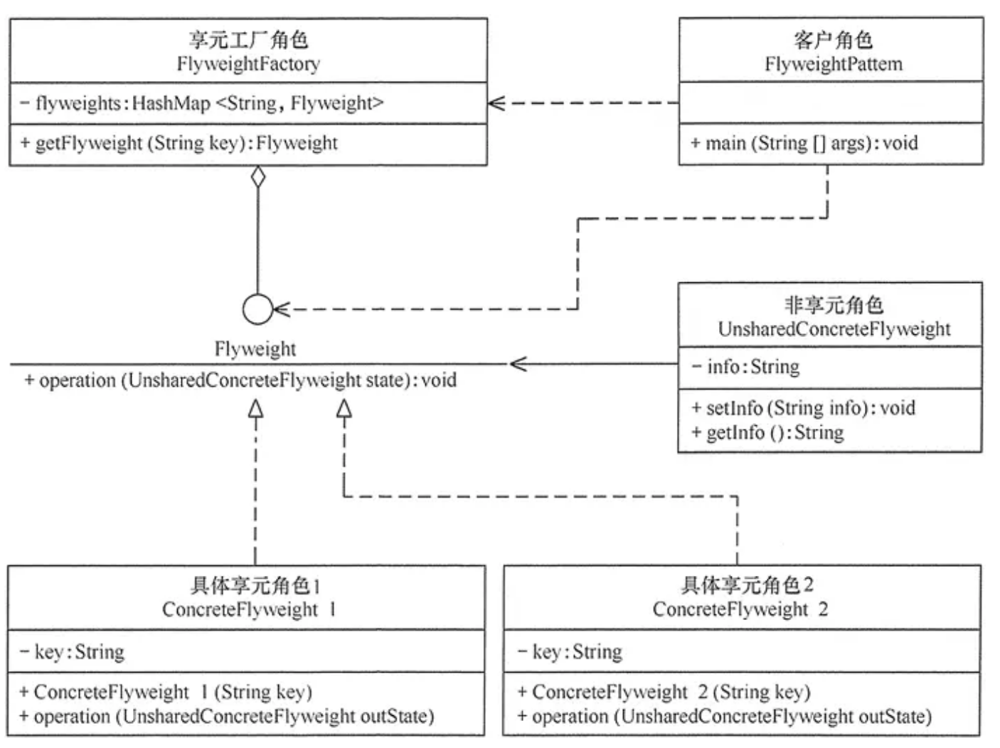
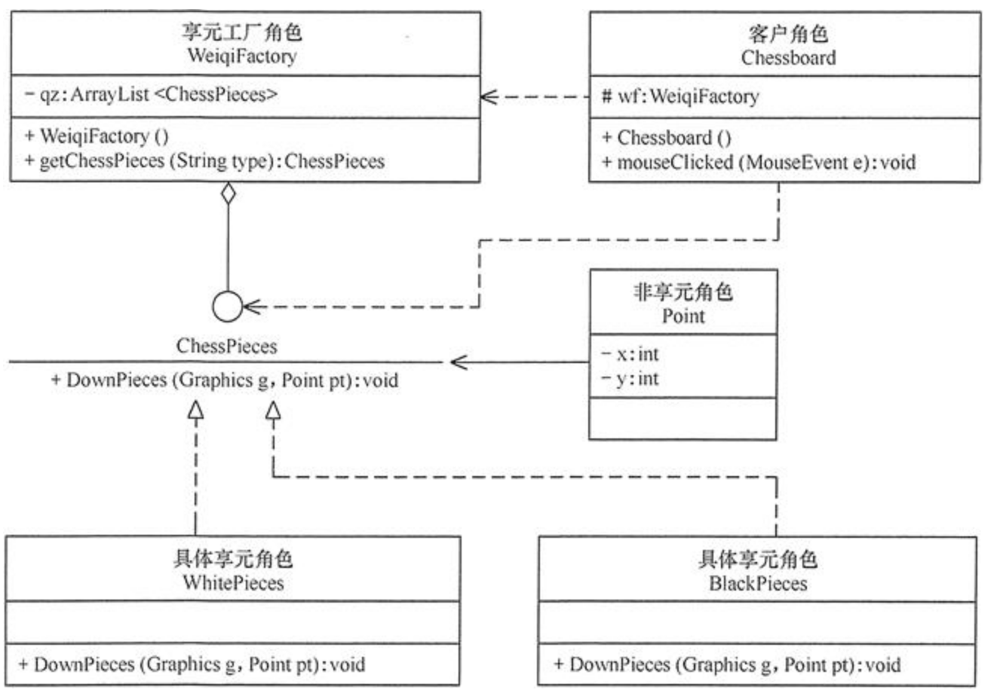
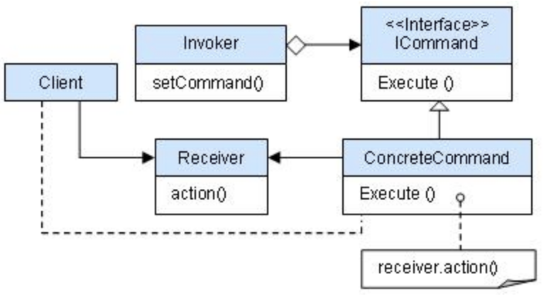
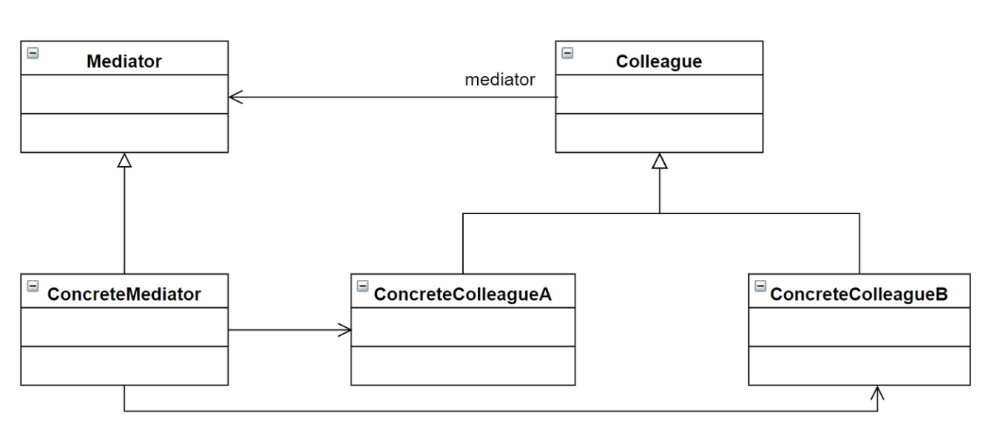
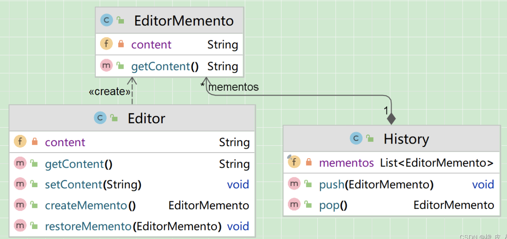
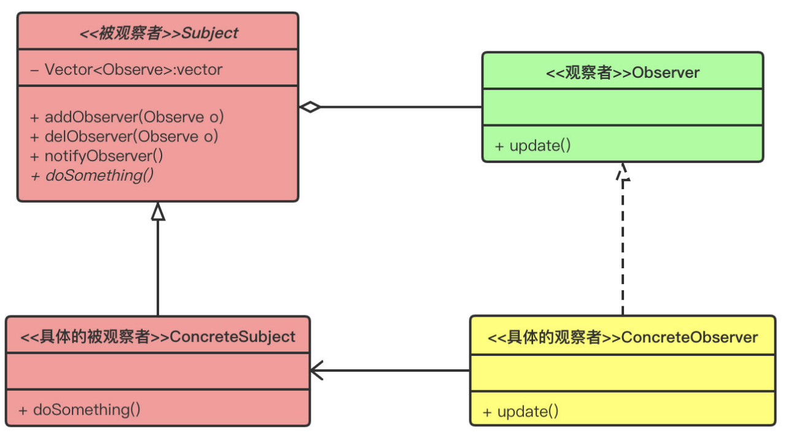
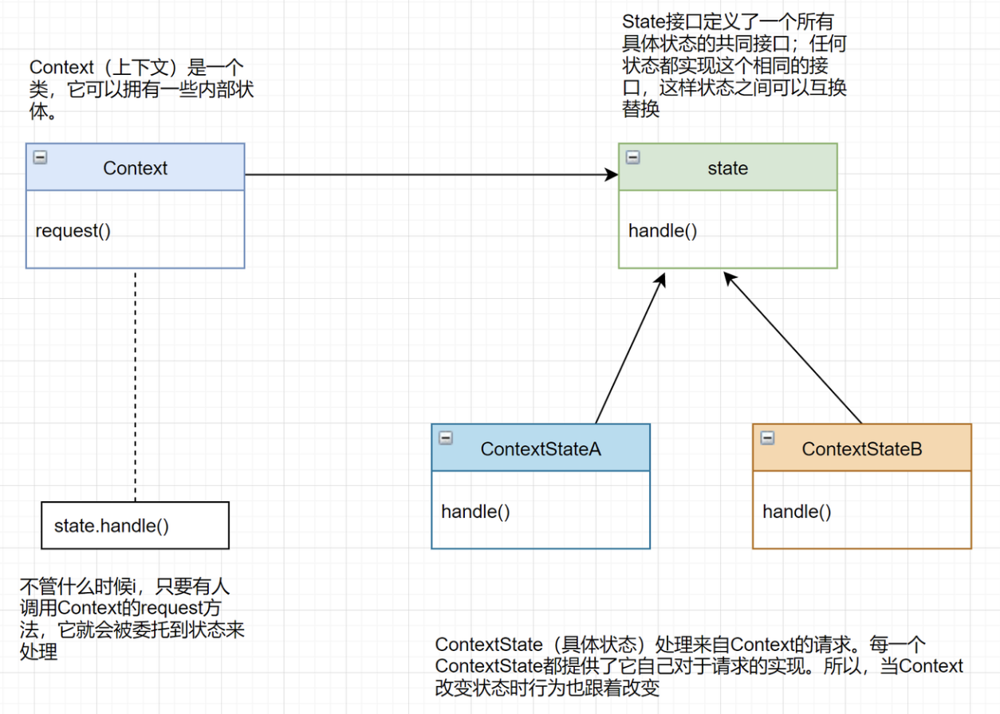

# 设计模式

[设计模式简介](https://www.runoob.com/design-pattern/design-pattern-intro.html)


SOLID原则: 基本原则 开闭原则

-   单一职责原则（SRP）: 一个类只允许有一个职责，即只有一个导致该类变更的原因
-   开放封闭原则（OCP) : 对外扩展开放，对内部修改关闭
-   迪米特法则（最少知道原则）: 一个对象应该对尽可能少的对象有接触
-   里氏替换原则（LSP）: 所有引用基类的地方必须能透明地使用其子类的对象
-   接口隔离原则（ISP）: 多个特定的客户端接口要好于一个通用性的总接口
-   依赖倒置原则（DIP）: 依赖抽象而不是依赖实现
-   合成复用原则 : 原则是尽量使用合成/聚合的方式，而不是使用继承

## 分类

-   创建型模式：对象实例化的模式，创建型模式用于解耦对象的实例化过程。
    -   单例模式：某个类只能有一个实例，提供一个全局的访问点。
    -   简单工厂：一个工厂类根据传入的参量决定创建出那一种产品类的实例。
    -   工厂方法：定义一个创建对象的接口，让子类决定实例化那个类。
    -   抽象工厂：创建相关或依赖对象的家族，而无需明确指定具体类。
    -   建造者模式：封装一个复杂对象的构建过程，并可以按步骤构造。
    -   原型模式：通过复制现有的实例来创建新的实例。
-   结构型模式：把类或对象结合在一起形成一个更大的结构。
    -   代理模式：为其他对象提供一个代理以便控制这个对象的访问。
    -   适配器模式：将一个类的方法接口转换成客户希望的另外一个接口。
    -   组合模式：将对象组合成树形结构以表示“”部分-整体“”的层次结构。
    -   外观模式：对外提供一个统一的方法，来访问子系统中的一群接口。
    -   装饰模式：动态的给对象添加新的功能。
    -   亨元（蝇量）模式：通过共享技术来有效的支持大量细粒度的对象。
    -   桥接模式：将抽象部分和它的实现部分分离，使它们都可以独立的变化。
-   行为型模式：类和对象如何交互，及划分责任和算法。
    -   模板模式：定义一个算法结构，而将一些步骤延迟到子类实现。
    -   策略模式：定义一系列算法，把他们封装起来，并且使它们可以相互替换。
    -   解释器模式：给定一个语言，定义它的文法的一种表示，并定义一个解释器。
    -   责任链模式：将请求的发送者和接收者解耦，使的多个对象都有处理这个请求的机会。
    -   观察者模式：对象间的一对多的依赖关系。
    -   迭代器模式：一种遍历访问聚合对象中各个元素的方法，不暴露该对象的内部结构。
    -   状态模式：允许一个对象在其对象内部状态改变时改变它的行为。
    -   中介者模式：用一个中介对象来封装一系列的对象交互。
    -   备忘录模式：在不破坏封装的前提下，保持对象的内部状态。
    -   命令模式：将命令请求封装为一个对象，使得可以用不同的请求来进行参数化。
    -   访问者模式：在不改变数据结构的前提下，增加作用于一组对象元素的新功能。

## 创建模式

### 工厂模式

工厂模式（Factory Pattern）是 Java 中最常用的设计模式之一。这种类型的设计模式属于创建型模式，它提供了一种创建对象的最佳方式。

工厂模式提供了一种将对象的实例化过程封装在工厂类中的方式。通过使用工厂模式，可以将对象的创建与使用代码分离，提供一种统一的接口来创建不同类型的对象。

在工厂模式中，我们在创建对象时不会对客户端暴露创建逻辑，并且是通过使用一个共同的接口来指向新创建的对象。

-   意图：定义一个创建对象的接口，让其子类自己决定实例化哪一个工厂类，工厂模式使其创建过程延迟到子类进行。
-   主要解决：主要解决接口选择的问题。
-   何时使用：我们明确地计划不同条件下创建不同实例时。
-   如何解决：让其子类实现工厂接口，返回的也是一个抽象的产品。
-   关键代码：创建过程在其子类执行。

### 抽象工厂模式

抽象工厂模式（Abstract Factory Pattern）是围绕一个超级工厂创建其他工厂。该超级工厂又称为其他工厂的工厂。这种类型的设计模式属于创建型模式，它提供了一种创建对象的最佳方式。

在抽象工厂模式中，接口是负责创建一个相关对象的工厂，不需要显式指定它们的类。每个生成的工厂都能按照工厂模式提供对象。

抽象工厂模式提供了一种创建一系列相关或相互依赖对象的接口，而无需指定具体实现类。通过使用抽象工厂模式，可以将客户端与具体产品的创建过程解耦，使得客户端可以通过工厂接口来创建一族产品。

-   意图：提供一个创建一系列相关或相互依赖对象的接口，而无需指定它们具体的类。
-   主要解决：主要解决接口选择的问题。
-   何时使用：系统的产品有多于一个的产品族，而系统只消费其中某一族的产品。
-   如何解决：在一个产品族里面，定义多个产品。
-   关键代码：在一个工厂里聚合多个同类产品。

### 单例模式

单例模式（Singleton Pattern）是 Java 中最简单的设计模式之一。这种类型的设计模式属于创建型模式，它提供了一种创建对象的最佳方式。

这种模式涉及到一个单一的类，该类负责创建自己的对象，同时确保只有单个对象被创建。这个类提供了一种访问其唯一的对象的方式，可以直接访问，不需要实例化该类的对象。

单例模式是一种创建型设计模式，它确保一个类只有一个实例，并提供了一个全局访问点来访问该实例。

### 建造者模式

建造者模式（Builder Pattern）使用多个简单的对象一步一步构建成一个复杂的对象。这种类型的设计模式属于创建型模式，它提供了一种创建对象的最佳方式。

一个 Builder 类会一步一步构造最终的对象。该 Builder 类是独立于其他对象的。

-   意图：将一个复杂的构建与其表示相分离，使得同样的构建过程可以创建不同的表示。
-   主要解决：主要解决在软件系统中，有时候面临着"一个复杂对象"的创建工作，其通常由各个部分的子对象用一定的算法构成；由于需求的变化，这个复杂对象的各个部分经常面临着剧烈的变化，但是将它们-
    组合在一起的算法却相对稳定。
-   何时使用：一些基本部件不会变，而其组合经常变化的时候。
-   如何解决：将变与不变分离开。
-   关键代码：建造者：创建和提供实例，导演：管理建造出来的实例的依赖关系。

### 原型模式

原型模式（Prototype Pattern）是用于创建重复的对象，同时又能保证性能。这种类型的设计模式属于创建型模式，它提供了一种创建对象的最佳方式之一。

这种模式是实现了一个原型接口，该接口用于创建当前对象的克隆。当直接创建对象的代价比较大时，则采用这种模式。例如，一个对象需要在一个高代价的数据库操作之后被创建。我们可以缓存该对象，在下一个请求时返回它的克隆，在需要的时候更新数据库，以此来减少数据库调用。

-   意图：用原型实例指定创建对象的种类，并且通过拷贝这些原型创建新的对象。
-   主要解决：在运行期建立和删除原型。
-   何时使用： 1、当一个系统应该独立于它的产品创建，构成和表示时。 2、当要实例化的类是在运行时刻指定时，例如，通过动态装载。 3、为了避免创建一个与产品类层次平行的工厂类层次时。 4、当一- 个类的实例只能有几个不同状态组合中的一种时。建立相应数目的原型并克隆它们可能比每次用合适的状态手工实例化该类更方便一些。
-   如何解决：利用已有的一个原型对象，快速地生成和原型对象一样的实例。
-   关键代码： 1、实现克隆操作，在 JAVA 实现 Cloneable 接口，重写 clone()，在 .NET 中可以使用 Object 类的 MemberwiseClone() 方法来实现对象的浅拷贝或通过序列化的方式来实现深拷贝。 2、原型模式同样用于隔离类对象的使用者和具体类型（易变类）之间的耦合关系，它同样要求这些"易变类"拥有稳定的接口。

当系统中需要大量创建相同或者相似的对象时，就可以通过“原型设计模式”来实现。原型模式是“创建型设计模式”中的一种。 原型模式的核心思想是，通过拷贝指定的“原型实例（对象）”，创建跟该对象一样的新对象。简单理解就是“克隆指定对象”。 这里提到的“原型实例（对象）”，就是被克隆的对象，它的作用就是指定要创建的对象种类。

需要拷贝的原型类必须实现"java.lang.Cloneable"接口，然后重写Object类中的clone方法，从而才可以实现类的拷贝。

原型模式中的拷贝对象可以分为：“浅拷贝”和“深拷贝”。

原型模式的优点

1、原型模式是在内存中进行二进制流的拷贝，要比直接new一个对象性能好，特别是在一个循环体内创建大量对象时。
2、原型模式可以简化对象创建的过程，可以直接拷贝现有的原型实例的值，实现对象复用。

适用场景

1、性能优化场景：类初始化需要消化非常多的资源，这个资源包括数据、硬件资源等。
2、安全访问场景：当某个对象对外可能是只读的，为了防止外部对这个只读对象的修改，通常可以通过返回一个对象拷贝的形式实现只读的限制。
3、一个对象多个修改者的场景：一个对象需要提供给其他对象访问，而且各个调用者可能都需要修改其值时，可以考虑使用原型模式拷贝多个对象供调用者使用。

## 结构模式

### 适配器模式

架构上的防腐层的概念

适配器模式又称为变压器模式、包装模式（Wrapper） 将一个类的接口变换成客户端所期待的另一种接口，从而使原本因接口不匹配而无法在一起工作的两个类能够在一起工作

适配器模式（Adapter Pattern）是作为两个不兼容的接口之间的桥梁。这种类型的设计模式属于结构型模式，它结合了两个独立接口的功能。

这种模式涉及到一个单一的类，该类负责加入独立的或不兼容的接口功能。举个真实的例子，读卡器是作为内存卡和笔记本之间的适配器。您将内存卡插入读卡器，再将读卡器插入笔记本，这样就可以通过笔记本来读取内存卡。

-   意图：将一个类的接口转换成客户希望的另外一个接口。适配器模式使得原本由于接口不兼容而不能一起工作的那些类可以一起工作。
-   主要解决：主要解决在软件系统中，常常要将一些"现存的对象"放到新的环境中，而新环境要求的接口是现对象不能满足的。
-   何时使用： 1、系统需要使用现有的类，而此类的接口不符合系统的需要。 2、想要建立一个可以重复使用的类，用于与一些彼此之间没有太大关联的一些类，包括一些可能在将来引进的类一起工作，这些源- 类不一定有一致的接口。 3、通过接口转换，将一个类插入另一个类系中。（比如老虎和飞禽，现在多了一个飞虎，在不增加实体的需求下，增加一个适配器，在里面包容一个虎对象，实现飞的接口。）
-   如何解决：继承或依赖（推荐）。
-   关键代码：适配器继承或依赖已有的对象，实现想要的目标接口。

### 桥接模式

桥接（Bridge）模式的定义如下：将抽象与实现分离，使它们可以独立变化。它是用组合关系代替继承关系来实现，从而降低了抽象和实现这两个可变维度的耦合度。

PN: 面向模型编程，将模型抽象出来，变化通过策略实现注入接口

-   意图：将抽象部分与实现部分分离，使它们都可以独立的变化。
-   主要解决：在有多种可能会变化的情况下，用继承会造成类爆炸问题，扩展起来不灵活。
-   何时使用：实现系统可能有多个角度分类，每一种角度都可能变化。
-   如何解决：把这种多角度分类分离出来，让它们独立变化，减少它们之间耦合。
-   关键代码：抽象类依赖实现类。

缺点是：由于聚合关系建立在抽象层，要求开发者针对抽象化进行设计与编程，能正确地识别出系统中两个独立变化的维度，这增加了系统的理解与设计难度。

桥接（Bridge）模式包含以下主要角色。

-   抽象化（Abstraction）角色：定义抽象类，并包含一个对实现化对象的引用。
-   扩展抽象化（Refined Abstraction）角色：是抽象化角色的子类，实现父类中的业务方法，并通过组合关系调用实现化角色中的业务方法。
-   实现化（Implementor）角色：定义实现化角色的接口，供扩展抽象化角色调用。
-   具体实现化（Concrete Implementor）角色：给出实现化角色接口的具体实现。




``` java
package bridge;
public class BridgeTest {
    public static void main(String[] args) {
        Implementor imple = new ConcreteImplementorA();
        Abstraction abs = new RefinedAbstraction(imple);
        abs.Operation();
    }
}
//实现化角色
interface Implementor {
    public void OperationImpl();
}
//具体实现化角色
class ConcreteImplementorA implements Implementor {
    public void OperationImpl() {
        System.out.println("具体实现化(Concrete Implementor)角色被访问");
    }
}
//抽象化角色
abstract class Abstraction {
    protected Implementor imple;
    protected Abstraction(Implementor imple) {
        this.imple = imple;
    }
    public abstract void Operation();
}
//扩展抽象化角色
class RefinedAbstraction extends Abstraction {
    protected RefinedAbstraction(Implementor imple) {
        super(imple);
    }
    public void Operation() {
        System.out.println("扩展抽象化(Refined Abstraction)角色被访问");
        imple.OperationImpl();
    }
}
​
```

### 组合模式

PN: 面向对象代码的结构：自身代码、继承自父类、组合其他对象

组合模式（Composite Pattern），又叫部分整体模式，是用于把一组相似的对象当作一个单一的对象。组合模式依据树形结构来组合对象，用来表示部分以及整体层次。这种类型的设计模式属于结构型模式，它创建了对象组的树形结构。

这种模式创建了一个包含自己对象组的类。该类提供了修改相同对象组的方式。

-   意图：将对象组合成树形结构以表示"部分-整体"的层次结构。组合模式使得用户对单个对象和组合对象的使用具有一致性。
-   主要解决：它在我们树型结构的问题中，模糊了简单元素和复杂元素的概念，客户程序可以像处理简单元素一样来处理复杂元素，从而使得客户程序与复杂元素的内部结构解耦。
-   何时使用： 1、您想表示对象的部分-整体层次结构（树形结构）。 2、您希望用户忽略组合对象与单个对象的不同，用户将统一地使用组合结构中的所有对象。
-   如何解决：树枝和叶子实现统一接口，树枝内部组合该接口。
-   关键代码：树枝内部组合该接口，并且含有内部属性 List，里面放 Component。

### 装饰模式

装饰器模式（Decorator Pattern）允许向一个现有的对象添加新的功能，同时又不改变其结构。这种类型的设计模式属于结构型模式，它是作为现有的类的一个包装。

装饰器模式通过将对象包装在装饰器类中，以便动态地修改其行为。

这种模式创建了一个装饰类，用来包装原有的类，并在保持类方法签名完整性的前提下，提供了额外的功能。

PN: 对接口实现添加功能，类似AOP

-   意图：动态地给一个对象添加一些额外的职责。就增加功能来说，装饰器模式相比生成子类更为灵活。
-   主要解决：一般的，我们为了扩展一个类经常使用继承方式实现，由于继承为类引入静态特征，并且随着扩展功能的增多，子类会很膨胀。
-   何时使用：在不想增加很多子类的情况下扩展类。
-   如何解决：将具体功能职责划分，同时继承装饰者模式。
-   关键代码： 1、Component 类充当抽象角色，不应该具体实现。 2、修饰类引用和继承 Component 类，具体扩展类重写父类方法。

创建装饰类实现同一接口，装饰器创建传入接口的原实现，在装饰器接口实现方法里调用原方法的前后可以添加功能




``` java
package decorator;
public class DecoratorPattern
{
    public static void main(String[] args)
    {
        Component p=new ConcreteComponent();
        p.operation();
        System.out.println("---------------------------------");
        Component d=new ConcreteDecorator(p);
        d.operation();
    }
}
//抽象构件角色
interface  Component
{
    public void operation();
}
//具体构件角色
class ConcreteComponent implements Component
{
    public ConcreteComponent()
    {
        System.out.println("创建具体构件角色");       
    }   
    public void operation()
    {
        System.out.println("调用具体构件角色的方法operation()");           
    }
}
//抽象装饰角色
class Decorator implements Component
{
    private Component component;   
    public Decorator(Component component)
    {
        this.component=component;
    }   
    public void operation()
    {
        component.operation();
    }
}
//具体装饰角色
class ConcreteDecorator extends Decorator
{
    public ConcreteDecorator(Component component)
    {
        super(component);
    }   
    public void operation()
    {
        super.operation();
        addedFunction();
    }
    public void addedFunction()
    {
        System.out.println("为具体构件角色增加额外的功能addedFunction()");           
    }
}
```

### 外观模式

外观模式（Facade
Pattern）隐藏系统的复杂性，并向客户端提供了一个客户端可以访问系统的接口。这种类型的设计模式属于结构型模式，它向现有的系统添加一个接口，来隐藏系统的复杂性。

这种模式涉及到一个单一的类，该类提供了客户端请求的简化方法和对现有系统类方法的委托调用。

-   意图：为子系统中的一组接口提供一个一致的界面，外观模式定义了一个高层接口，这个接口使得这一子系统更加容易使用。
-   主要解决：降低访问复杂系统的内部子系统时的复杂度，简化客户端之间的接口。
-   何时使用：
    1、客户端不需要知道系统内部的复杂联系，整个系统只需提供一个"接待员"即可。
    2、定义系统的入口。
-   如何解决：客户端不与系统耦合，外观类与系统耦合。
-   关键代码：在客户端和复杂系统之间再加一层，这一层将调用顺序、依赖关系等处理好。

PN: 架构上的防腐层，系统调用加一层facade

外观（Facade）模式又叫作门面模式，是一种通过为多个复杂的子系统提供一个一致的接口，而使这些子系统更加容易被访问的模式。该模式对外有一个统一接口，外部应用程序不用关心内部子系统的具体细节，这样会大大降低应用程序的复杂度，提高了程序的可维护性。

### 亨元

享元（Flyweight）模式的定义：运用共享技术来有效地支持大量细粒度对象的复用。它通过共享已经存在的对象来大幅度减少需要创建的对象数量、避免大量相似类的开销，从而提高系统资源的利用率。

-   意图：运用共享技术有效地支持大量细粒度的对象。
-   主要解决：在有大量对象时，有可能会造成内存溢出，我们把其中共同的部分抽象出来，如果有相同的业务请求，直接返回在内存中已有的对象，避免重新创建。
-   何时使用： 1、系统中有大量对象。 2、这些对象消耗大量内存。
    3、这些对象的状态大部分可以外部化。
    4、这些对象可以按照内蕴状态分为很多组，当把外蕴对象从对象中剔除出来时，每一组对象都可以-
    用一个对象来代替。
    5、系统不依赖于这些对象身份，这些对象是不可分辨的。
-   如何解决：用唯一标识码判断，如果在内存中有，则返回这个唯一标识码所标识的对象。
-   关键代码：用 HashMap 存储这些对象。

享元模式的本质是缓存共享对象，降低内存消耗。

享元模式的主要优点是：相同对象只要保存一份，这降低了系统中对象的数量，从而降低了系统中细粒度对象给内存带来的压力。

其主要缺点是：

-   为了使对象可以共享，需要将一些不能共享的状态外部化，这将增加程序的复杂性。
-   读取享元模式的外部状态会使得运行时间稍微变长。

对象的信息分为两个部分：内部状态和外部状态。

-   内部状态指对象共享出来的信息，存储在享元信息内部，并且不回随环境的改变而改变；
-   外部状态指对象得以依赖的一个标记，随环境的改变而改变，不可共享。

比如，连接池中的连接对象，保存在连接对象中的用户名、密码、连接URL等信息，在创建对象的时候就设置好了，不会随环境的改变而改变，这些为内部状态。而当每个连接要被回收利用时，我们需要将它标记为可用状态，这些为外部状态。

享元模式的主要角色有如下。

-   抽象享元角色（Flyweight）：是所有的具体享元类的基类，为具体享元规范需要实现的公共接口，非享元的外部状态以参数的形式通过方法传入。
-   具体享元（Concrete Flyweight）角色：实现抽象享元角色中所规定的接口。
-   非享元（Unsharable
    Flyweight)角色：是不可以共享的外部状态，它以参数的形式注入具体享元的相关方法中。
-   享元工厂（Flyweight
    Factory）角色：负责创建和管理享元角色。当客户对象请求一个享元对象时，享元工厂检査系统中是否存在符合要求的享元对象，如果存在则提供给客户；如果不存在的话，则创建一个新的享元对象。

示例是享元模式的结构图，其中：

UnsharedConcreteFlyweight 是非享元角色，里面包含了非共享的外部状态信息
info； Flyweight 是抽象享元角色，里面包含了享元方法
operation(UnsharedConcreteFlyweight
state)，非享元的外部状态以参数的形式通过该方法传入； ConcreteFlyweight
是具体享元角色，包含了关键字 key，它实现了抽象享元接口；
FlyweightFactory 是享元工厂角色，它是关键字 key 来管理具体享元；
客户角色通过享元工厂获取具体享元，并访问具体享元的相关方法。

```{=org}
#+DOWNLOADED: screenshot @ 2023-10-11 16:04:46
```


``` java
public class FlyweightPattern {
    public static void main(String[] args) {
        FlyweightFactory factory = new FlyweightFactory();
        Flyweight f01 = factory.getFlyweight("a");
        Flyweight f02 = factory.getFlyweight("a");
        Flyweight f03 = factory.getFlyweight("a");
        Flyweight f11 = factory.getFlyweight("b");
        Flyweight f12 = factory.getFlyweight("b");
        f01.operation(new UnsharedConcreteFlyweight("第1次调用a。"));
        f02.operation(new UnsharedConcreteFlyweight("第2次调用a。"));
        f03.operation(new UnsharedConcreteFlyweight("第3次调用a。"));
        f11.operation(new UnsharedConcreteFlyweight("第1次调用b。"));
        f12.operation(new UnsharedConcreteFlyweight("第2次调用b。"));
    }
}
//非享元角色
class UnsharedConcreteFlyweight {
    private String info;
    UnsharedConcreteFlyweight(String info) {
        this.info = info;
    }
    public String getInfo() {
        return info;
    }
    public void setInfo(String info) {
        this.info = info;
    }
}
//抽象享元角色
interface Flyweight {
    public void operation(UnsharedConcreteFlyweight state);
}
//具体享元角色
class ConcreteFlyweight implements Flyweight {
    private String key;
    ConcreteFlyweight(String key) {
        this.key = key;
        System.out.println("具体享元" + key + "被创建！");
    }
    public void operation(UnsharedConcreteFlyweight outState) {
        System.out.print("具体享元" + key + "被调用，");
        System.out.println("非享元信息是:" + outState.getInfo());
    }
}
//享元工厂角色
class FlyweightFactory {
    private HashMap<String, Flyweight> flyweights = new HashMap<String, Flyweight>();
    public Flyweight getFlyweight(String key) {
        Flyweight flyweight = (Flyweight) flyweights.get(key);
        if (flyweight != null) {
            System.out.println("具体享元" + key + "已经存在，被成功获取！");
        } else {
            flyweight = new ConcreteFlyweight(key);
            flyweights.put(key, flyweight);
        }
        return flyweight;
    }
}
```

五子棋游戏

分析：五子棋同围棋一样，包含多个“黑”或“白”颜色的棋子，所以用享元模式比较好。

本实例中:

-   棋子（ChessPieces）类是抽象享元角色，它包含了一个落子的
    DownPieces(Graphics g,Point pt) 方法；
-   白子（WhitePieces）和黑子（BlackPieces）类是具体享元角色，它实现了落子方法；
-   Point 是非享元角色，它指定了落子的位置；
-   WeiqiFactory 是享元工厂角色，它通过 ArrayList
    来管理棋子，并且提供了获取白子或者黑子的 getChessPieces(String type)
    方法；
-   客户类（Chessboard）利用 Graphics
    组件在框架窗体中绘制一个棋盘，并实现 mouseClicked(MouseEvent e)
    事件处理方法，该方法根据用户的选择从享元工厂中获取白子或者黑子并落在棋盘上。

```{=org}
#+DOWNLOADED: screenshot @ 2023-10-11 16:06:34
```


``` java
import javax.swing.*;
import java.awt.*;
import java.awt.event.MouseAdapter;
import java.awt.event.MouseEvent;
import java.util.ArrayList;
public class WzqGame {
    public static void main(String[] args) {
        new Chessboard();
    }
}
//棋盘
class Chessboard extends MouseAdapter {
    WeiqiFactory wf;
    JFrame f;
    Graphics g;
    JRadioButton wz;
    JRadioButton bz;
    private final int x = 50;
    private final int y = 50;
    private final int w = 40;    //小方格宽度和高度
    private final int rw = 400;    //棋盘宽度和高度
    Chessboard() {
        wf = new WeiqiFactory();
        f = new JFrame("享元模式在五子棋游戏中的应用");
        f.setBounds(100, 100, 500, 550);
        f.setVisible(true);
        f.setResizable(false);
        f.setDefaultCloseOperation(JFrame.EXIT_ON_CLOSE);
        JPanel SouthJP = new JPanel();
        f.add("South", SouthJP);
        wz = new JRadioButton("白子");
        bz = new JRadioButton("黑子", true);
        ButtonGroup group = new ButtonGroup();
        group.add(wz);
        group.add(bz);
        SouthJP.add(wz);
        SouthJP.add(bz);
        JPanel CenterJP = new JPanel();
        CenterJP.setLayout(null);
        CenterJP.setSize(500, 500);
        CenterJP.addMouseListener(this);
        f.add("Center", CenterJP);
        try {
            Thread.sleep(500);
        } catch (InterruptedException e) {
            e.printStackTrace();
        }
        g = CenterJP.getGraphics();
        g.setColor(Color.BLUE);
        g.drawRect(x, y, rw, rw);
        for (int i = 1; i < 10; i++) {
            //绘制第i条竖直线
            g.drawLine(x + (i * w), y, x + (i * w), y + rw);
            //绘制第i条水平线
            g.drawLine(x, y + (i * w), x + rw, y + (i * w));
        }
    }
    public void mouseClicked(MouseEvent e) {
        Point pt = new Point(e.getX() - 15, e.getY() - 15);
        if (wz.isSelected()) {
            ChessPieces c1 = wf.getChessPieces("w");
            c1.DownPieces(g, pt);
        } else if (bz.isSelected()) {
            ChessPieces c2 = wf.getChessPieces("b");
            c2.DownPieces(g, pt);
        }
    }
}
//抽象享元角色：棋子
interface ChessPieces {
    public void DownPieces(Graphics g, Point pt);    //下子
}
//具体享元角色：白子
class WhitePieces implements ChessPieces {
    public void DownPieces(Graphics g, Point pt) {
        g.setColor(Color.WHITE);
        g.fillOval(pt.x, pt.y, 30, 30);
    }
}
//具体享元角色：黑子
class BlackPieces implements ChessPieces {
    public void DownPieces(Graphics g, Point pt) {
        g.setColor(Color.BLACK);
        g.fillOval(pt.x, pt.y, 30, 30);
    }
}
//享元工厂角色
class WeiqiFactory {
    private ArrayList<ChessPieces> qz;
    public WeiqiFactory() {
        qz = new ArrayList<ChessPieces>();
        ChessPieces w = new WhitePieces();
        qz.add(w);
        ChessPieces b = new BlackPieces();
        qz.add(b);
    }
    public ChessPieces getChessPieces(String type) {
        if (type.equalsIgnoreCase("w")) {
            return (ChessPieces) qz.get(0);
        } else if (type.equalsIgnoreCase("b")) {
            return (ChessPieces) qz.get(1);
        } else {
            return null;
        }
    }
}
```

### 代理模式

在代理模式（Proxy
Pattern）中，一个类代表另一个类的功能。这种类型的设计模式属于结构型模式。

在代理模式中，我们创建具有现有对象的对象，以便向外界提供功能接口。

-   意图：为其他对象提供一种代理以控制对这个对象的访问。
-   主要解决：在直接访问对象时带来的问题，比如说：要访问的对象在远程的机器上。在面向对象系统中，有些对象由于某些原因（比如对象创建开销很大，或者某些操作需要安全控制，或者需要进程外的访问），直接访问会给使用者或者系统结构带来很多麻烦，我们可以在访问此对象时加上一个对此对象的访问层。
-   何时使用：想在访问一个类时做一些控制。
-   如何解决：增加中间层。
-   关键代码：实现与被代理类组合。

### 责任链模式

顾名思义，责任链模式（Chain of Responsibility
Pattern）为请求创建了一个接收者对象的链。这种模式给予请求的类型，对请求的发送者和接收者进行解耦。这种类型的设计模式属于行为型模式。

在这种模式中，通常每个接收者都包含对另一个接收者的引用。如果一个对象不能处理该请求，那么它会把相同的请求传给下一个接收者，依此类推。

-   意图：避免请求发送者与接收者耦合在一起，让多个对象都有可能接收请求，将这些对象连接成一条链，并且沿着这条链传递请求，直到有对象处理它为止。
-   主要解决：职责链上的处理者负责处理请求，客户只需要将请求发送到职责链上即可，无须关心请求的处理细节和请求的传递，所以职责链将请求的发送者和请求的处理者解耦了。
-   何时使用：在处理消息的时候以过滤很多道。
-   如何解决：拦截的类都实现统一接口。
-   关键代码：Handler 里面聚合它自己，在 HandlerRequest
    里判断是否合适，如果没达到条件则向下传递，向谁传递之前 set 进去。

## 行为模式

### 命令模式

命令模式（Command
Pattern）又叫动作模式或事务模式。指的是将一个请求封装成一个对象，使发出请求的责任和执行请求的责任分割开，然后可以使用不同的请求把客户端参数化，这样可以使得两者之间通过命令对象进行沟通，从而方便将命令对象进行储存、传递、调用、增加与管理。命令模式是一种对象行为型模式。

PN:
接收者不可修改，对不同的接收者要统一做调用，包一层command，由调用都选择性调用

-   意图：将一个请求封装成一个对象，从而使您可以用不同的请求对客户进行参数化。
-   主要解决：在软件系统中，行为请求者与行为实现者通常是一种紧耦合的关系，但某些场合，比如需要对行为进行记录、撤销或重做、事务等处理时，这种无法抵御变化的紧耦合的设计就不太合适。
-   何时使用：在某些场合，比如要对行为进行"记录、撤销/重做、事务"等处理，这种无法抵御变化的紧耦合是不合适的。在这种情况下，如何将"行为请求者"与"行为实现者"解耦？将一组行为抽象为对象，可以实现二者之间的松耦合。
-   如何解决：通过调用者调用接受者执行命令，顺序：调用者→命令→接受者。
-   关键代码：定义三个角色：1、received 真正的命令执行对象 2、Command
    3、invoker 使用命令对象的入口

```{=org}
#+DOWNLOADED: screenshot @ 2023-10-11 20:08:43
```


``` java
public abstract class Command {
    public abstract void execute();
}

public class ConcreteCommand extends Command{
    private Receiver receiver;
    public ConcreteCommand(){
        this.receiver = new Receiver();
    }
    @Override
    public void execute() {
        receiver.doSomething();
    }
}

public class Invoker {
    private Command command;

    public Invoker(Command command) {
        this.command = command;
    }

    public void setCommand(Command command) {
        this.command = command;
    }

    public void dosomething() {
        System.out.println("这里是调用者，执行命令");
        command.execute();
    }
}

public class Receiver {
    public void doSomething(){
        System.out.println("这是接受者负责处理业务逻辑");
    }
}

public class CommandPatternTest {
    public static void main(String[] args){
        Command command = new ConcreteCommand();
        //客户端通过调用者来执行命令
        Invoker invoker = new Invoker(command);
        System.out.println("客户端请求调用者");
        invoker.dosomething();
    }
}

```

### 解释器模式

解释器模式（Interpreter
Pattern）提供了评估语言的语法或表达式的方式，它属于行为型模式。这种模式实现了一个表达式接口，该接口解释一个特定的上下文。这种模式被用在
SQL 解析、符号处理引擎等。
意图：给定一个语言，定义它的文法表示，并定义一个解释器，这个解释器使用该标识来解释语言中的句子。
主要解决：对于一些固定文法构建一个解释句子的解释器。
何时使用：如果一种特定类型的问题发生的频率足够高，那么可能就值得将该问题的各个实例表述为一个简单语言中的句子。这样就可以构建一个解释器，该解释器通过解释这些句子来解决该问题。
如何解决：构建语法树，定义终结符与非终结符。
关键代码：构建环境类，包含解释器之外的一些全局信息，一般是 HashMap。

### 迭代器模式

迭代器模式是一种行为型设计模式，它提供了一种统一的方式来访问集合对象中的元素，而不是暴露集合内部的表示方式。简单地说，就是将遍历集合的责任封装到一个单独的对象中，我们可以按照特定的方式访问集合中的元素。

-   意图：提供一种方法顺序访问一个聚合对象中各个元素,
    而又无须暴露该对象的内部表示。
-   主要解决：不同的方式来遍历整个整合对象。
-   何时使用：遍历一个聚合对象。
-   如何解决：把在元素之间游走的责任交给迭代器，而不是聚合对象。
-   关键代码：定义接口：hasNext, next。
-   应用实例：JAVA 中的 iterator。
-   优点： 1、它支持以不同的方式遍历一个聚合对象。
    2、迭代器简化了聚合类。 3、在同一个聚合上可以有多个遍历。
    4、在迭代器模式中，增加新的聚合类和迭代器类都很方便，无须修改原有代码。
-   缺点：由于迭代器模式将存储数据和遍历数据的职责分离，增加新的聚合类需要对应增加新的迭代器类，类的个数成对增加，这在一定程度上增加了系统的复杂性。
-   使用场景： 1、访问一个聚合对象的内容而无须暴露它的内部表示。
    2、需要为聚合对象提供多种遍历方式。
    3、为遍历不同的聚合结构提供一个统一的接口。

注意事项：迭代器模式就是分离了集合对象的遍历行为，抽象出一个迭代器类来负责，这样既可以做到不暴露集合的内部结构，又可让外部代码透明地访问集合内部的数据。

PN: 隔离直接访问对象内部集合元素

-   抽象迭代器（Iterator）：定义了遍历聚合对象所需的方法，包括hashNext()和next()方法等，用于遍历聚合对象中的元素。
-   具体迭代器（Concrete
    Iterator）：它是实现迭代器接口的具体实现类，负责具体的遍历逻辑。它保存了当前遍历的位置信息，并可以根据需要向前或向后遍历集合元素。
-   抽象聚合器（Aggregate）：
    一般是一个接口，提供一个iterator()方法，例如java中的Collection接口，List接口，Set接口等。
-   具体聚合器（ConcreteAggregate）：就是抽象容器的具体实现类，比如List接口的有序列表实现ArrayList，List接口的链表实现LinkList，Set接口的哈希列表的实现HashSet等。

优点：

-   简化了集合类的接口，使用者可以更加简单地遍历集合对象，而不需要了解集合内部结构和实现细节。
-   将集合和遍历操作解耦，使得我们可以更灵活地使用不同的迭代器来遍历同一个集合，根据需求选择不同的遍历方式。
-   满足开闭原则，如果需要增加新的遍历方式，只需实现一个新的具体迭代器即可，不需要修改原先聚合对象的代码。

缺点：

-   具体迭代器实现的算法对外不可见，因此不利于调试和维护。
-   对于某些小型、简单的集合对象来说，使用迭代器模式可能会显得过于复杂，增加了代码的复杂性。

班级名单为例

``` java
@Data
public class Student {
    private String name;
    private Integer age;
    public Student(String name,Integer age){
        this.age=age;
        this.name=name;
    }
}

import java.util.Iterator;
public interface StudentIterator extends Iterator<Student> {
}


public class StudentListIterator implements StudentIterator{
    private List<Student> students;
    private int index;

    public StudentListIterator(List<Student> students) {
        this.students = students;
        this.index = 0;
    }

    //检查是否还有下一个元素
    @Override
    public boolean hasNext() {
        return (index < students.size());
    }

    //返回下一个元素
    @Override
    public Student next() {
        if (!hasNext()) {
            throw new NoSuchElementException();
        }
        Student student = students.get(index);
        index++;
        return student;
    }
}


public interface StudentAggregate {
    //用于创建具体的迭代器对象
    StudentIterator iterator();
    void add(Student student);
}


public class ClassList implements StudentAggregate{
    private List<Student> students = new ArrayList<>();

    //创建迭代器对象
    @Override
    public StudentIterator iterator() {
        return new StudentListIterator(students);
    }

    //向班级名单中添加学生信息
    @Override
    public void add(Student student) {
        students.add(student);
    }
}


@SpringBootTest
public class TestIterator {
    @Test
    void testIterator(){
        ClassList classList = new ClassList();
        // 添加学生信息
        classList.add(new Student("张三", 18));
        classList.add(new Student("李四", 19));
        classList.add(new Student("王五", 20));
        // 获取迭代器，遍历学生信息
        StudentIterator iterator = classList.iterator();
        while(iterator.hasNext()) {
            Student student = iterator.next();
            System.out.println("学生姓名：" + student.getName() + "，学生年龄：" + student.getAge());
        }
    }

}
```

### 中介者模式

中介者模式：用一个中介者对象来封装一系列的对象交互，中介者使各对象不需要显示地相互引用，从而使其松散耦合，而且可以独立地改变它们之间的交互。

-   意图：用一个中介对象来封装一系列的对象交互，中介者使各对象不需要显式地相互引用，从而使其耦合松散，而且可以独立地改变它们之间的交互。
-   主要解决：对象与对象之间存在大量的关联关系，这样势必会导致系统的结构变得很复杂，同时若一个对象发生改变，我们也需要跟踪与之相关联的对象，同时做出相应的处理。
-   何时使用：多个类相互耦合，形成了网状结构。
-   如何解决：将上述网状结构分离为星型结构。
-   关键代码：对象 Colleague 之间的通信封装到一个类中单独处理。

中介者模式又叫调停者模式，是一种对象行为型模式。

中介者模式可以使对象之间的关系急剧减少，通过引入中介者对象，可以将系统的网状结构转化为以中介者为中心的星型结构

```{=org}
#+DOWNLOADED: screenshot @ 2023-10-11 19:38:12
```


-   Mediator（抽象中介者）：定义了与各同事类之间进行通信的方法
-   ConcreteMediator（具体中介者）：抽象中介者的子类，协调各个同事对象实现协作行为，维持对各个同事对象的引用
-   Colleague（抽象同事类）：定义各个同事类的公有方法，并声明一些抽象方法来提供子类实现，同事维持一个抽象中介者的引用，子类可以通过该引用与中介者通信
-   ConcreteColleague（具体同事类）：抽象同事的子类，每一个同事对象在需要和其他同事对象通信时，先与中介者通信，通过中介者来间接完成与其他同事类的通信，在具体同事类中实现了在抽象同事类中声明的抽象方法

### 备忘录模式

备忘录模式又称快照模式，是一种行为型设计模式。它可以在不破坏封装性的前提下捕获一个对象的内部状态，并在对象之外保存这个状态，以便在需要的时候恢复到原先保存的状态。

-   意图：在不破坏封装性的前提下，捕获一个对象的内部状态，并在该对象之外保存这个状态。
-   主要解决：所谓备忘录模式就是在不破坏封装的前提下，捕获一个对象的内部状态，并在该对象之外保存这个状态，这样可以在以后将对象恢复到原先保存的状态。
-   何时使用：很多时候我们总是需要记录一个对象的内部状态，这样做的目的就是为了允许用户取消不确定或者错误的操作，能够恢复到他原先的状态，使得他有"后悔药"可吃。
-   如何解决：通过一个备忘录类专门存储对象状态。
-   关键代码：客户不与备忘录类耦合，与备忘录管理类耦合。

源发器（Originator）：需要保存和恢复状态的对象。它创建一个备忘录对象，用于存储当前对象的状态，也可以使用备忘录对象恢复自身的状态。
备忘录（Memento）：存储源发器对象的状态。备忘录对象可以包括一个或多个状态属性，源发器可以根据需要保存和恢复状态。
管理者（Caretaker）：负责保存备忘录对象，但不能修改备忘录对象的内容。它可以存储多个备忘录对象，并决定何时将备忘录恢复给源发器。

优点：

-   状态保存与恢复：备忘录模式可以帮助我们保存对象的状态，并在需要时恢复到之前的状态。这在某些情况下非常有用，比如撤销操作或者程序崩溃后的恢复。
-   封装性和隔离性：可以确保对象的状态保存在备忘录对象中，而不会暴露给其他对象。这为对象的封装性和隔离性提供了保护，使得对象的状态变化对其他对象是透明的。

缺点：

-   内存占用：可能引起较大的内存占用，特别是当对象的状态较多且状态改变频繁时。每个备忘录对象都需要保存一份完整的状态，如果状态较多或者备忘录对象较多，可能会消耗大量内存。
-   性能开销：备忘录模式涉及到创建、存储和恢复状态的操作，这些操作可能引起一定的性能开销。特别是在状态较大或者对象较复杂的情况下，备忘录模式的性能可能会受到影响。

文本编辑器为例

```{=org}
#+DOWNLOADED: screenshot @ 2023-10-11 19:45:30
```


### 观察者模式

观察者模式(Observer Pattern)：
定义对象间一种一对多的依赖关系，使得当每一个对象改变状态，则所有依赖于它的对象都会得到通知并自动更新。

观察者模式的别名包括发布-订阅（Publish/Subscribe）模式、模型-视图（Model/View）模式、源-监听器（Source/Listener）模式或从属者（Dependents）模式。

-   意图：定义对象间的一种一对多的依赖关系，当一个对象的状态发生改变时，所有依赖于它的对象都得到通知并被自动更新。
-   主要解决：一个对象状态改变给其他对象通知的问题，而且要考虑到易用和低耦合，保证高度的协作。
-   何时使用：一个对象（目标对象）的状态发生改变，所有的依赖对象（观察者对象）都将得到通知，进行广播通知。
-   如何解决：使用面向对象技术，可以将这种依赖关系弱化。
-   关键代码：在抽象类里有一个 ArrayList 存放观察者们。

```{=org}
#+DOWNLOADED: screenshot @ 2023-10-11 17:15:51
```


PN: 一个观察者由subject持有比较好，实现观察者的的增删通知等

### 状态模式

-   意图：允许对象在内部状态发生改变时改变它的行为，对象看起来好像修改了它的类。
-   主要解决：对象的行为依赖于它的状态（属性），并且可以根据它的状态改变而改变它的相关行为。
-   何时使用：代码中包含大量与对象状态有关的条件语句。
-   如何解决：将各种具体的状态类抽象出来。
-   关键代码：通常命令模式的接口中只有一个方法。而状态模式的接口中有一个或者多个方法。而且，状态模式的实现类的方法，一般返回值，或者是改变实例变量的值。也就是说，状态模式一般和对象的状态有关。实现类的方法有不同的功能，覆盖接口中的方法。状态模式和命令模式一样，也可以用于消除
    if…else 等条件选择语句。

```{=org}
#+DOWNLOADED: screenshot @ 2023-10-11 17:57:26
```


物流系统就很适合使用状态模式来开发，因为此过程存在很多不同的状态，例如接单，出库，运输，送货，收货，评价等等。而订单在每个不同的状态下的操作可能都不一样，例如在接单状态下，商家就需要通知仓库拣货，通知用户等等操作，其他状态类似

``` java
          public interface LogisticsState {
            void doAction(JdLogistics context);
        }

        public class JdLogistics {
          private LogisticsState logisticsState;

          public void setLogisticsState(LogisticsState logisticsState) {
              this.logisticsState = logisticsState;
          }

          public LogisticsState getLogisticsState() {
              return logisticsState;
          }

          public void doAction(){
              Objects.requireNonNull(logisticsState);
              logisticsState.doAction(this);
          }
      }

      public class OrderState implements LogisticsState {
        @Override
        public void doAction(JdLogistics context) {
            System.out.println("商家已经接单，正在处理中...");
        }
    }

    public class ProductOutState implements LogisticsState {
      @Override
      public void doAction(JdLogistics context) {
          System.out.println("商品已经出库...");
      }
  }

  public class StateClient {

    public void buyKeyboard() {
        //状态的保持与切换者
        JdLogistics jdLogistics = new JdLogistics();

        //接单状态
        OrderState orderState = new OrderState();
        jdLogistics.setLogisticsState(orderState);
        jdLogistics.doAction();

        //出库状态
        ProductOutState productOutState = new ProductOutState();
        jdLogistics.setLogisticsState(productOutState);
        jdLogistics.doAction();

        //运输状态
        TransportState transportState = new TransportState();
        jdLogistics.setLogisticsState(transportState);
        jdLogistics.doAction();
    }
}

```

技术要点总结

-   必须要有一个Context类，这个类持有State接口，负责保持并切换当前的状态。
-   状态模式没有定义在哪里进行状态转换，本例是在Context类进行的，也有人在具体的State类中转换

当使用Context类切换状态时，状态类之间互相不认识，他们直接的依赖关系应该由客户端负责。
例如，只有在接单状态的操作完成后才应该切换到出库状态，那么出库状态就对接单状态有了依赖，这个依赖顺序应该由客户端负责，而不是在状态内判断。

当使用具体的State类切换时，状态直接就可能互相认识，一个状态执行完就自动切换到了另一个状态去了

### 策略模式

### 模板模式

### 访问者模式

意图：主要将数据结构与数据操作分离。

主要解决：稳定的数据结构和易变的操作耦合问题。

何时使用：需要对一个对象结构中的对象进行很多不同的并且不相关的操作，而需要避免让这些操作"污染"这些对象的类，使用访问者模式将这些封装到类中。

如何解决：在被访问的类里面加一个对外提供接待访问者的接口。

关键代码：在数据基础类里面有一个方法接受访问者，将自身引用传入访问者。

示例

我们都知道财务都是有账本的，这个账本就可以作为一个对象结构，而它其中的元素有两种，收入和支出，这满足我们访问者模式的要求，即元素的个数是稳定的，因为账本中的元素只能是收入和支出。

而查看账本的人可能有这样几种，比如老板，会计事务所的注会，财务主管，等等。而这些人在看账本的时候显然目的和行为是不同的。

``` java
public interface Bill {
    void accept(AccountBookViewer v);
}

public class ConsumeBill implements Bill {
    private double amount;
    private String item;
    public ConsumeBill(double amount, String item) {
        super();
        this.amount = amount;
        this.item = item;
    }

    @Override
    public void accept(AccountBookViewer v) {
        v.view(this);
    }

    public void OperationA(){
        System.out.println("AAAAAAAAAAAAAAA");
    }

    ......
}

public class IncomeBill implements Bill {
    private double amount;
    private String item;
    public IncomeBill(double amount, String item) {
        super();
        this.amount = amount;
        this.item = item;
    }
    @Override
    public void accept(AccountBookViewer v) {
        v.view(this);
    }
    ......
}

public abstract class AccountBookViewer {
    abstract  void view(ConsumeBill bill);
    abstract void view(IncomeBill bill);
}

public class Boss extends AccountBookViewer {
    private double totalIncome;
    private double totalConsume;

    @Override
    void view(ConsumeBill bill) {
        totalConsume += bill.getAmount();
    }

    @Override
    void view(IncomeBill bill) {
        totalIncome += bill.getAmount();
    }

    public double getTotalIncome() {
        System.out.println("老板查看一共收入多少，数目是：" + totalIncome);
        return totalIncome;
    }

    public double getTotalConsume() {
        System.out.println("老板查看一共花费多少，数目是：" + totalConsume);
        return totalConsume;
    }
}

public class Cpa extends AccountBookViewer {
    public void view(ConsumeBill bill) {
        if (bill.getItem().equals("工资")) {
            System.out.println("注会查看工资是否交个人所得税。");
        }
    }
    //如果是收入，则所有的收入都要交税
    public void view(IncomeBill bill) {
        System.out.println("注会查看收入交税了没。");
    }
}


public class AccountBook {
    private List<Bill> billList = new ArrayList<Bill>();

    public void addBill(Bill bill){
        billList.add(bill);
    }

    public void show(AccountBookViewer viewer){
        for (Bill bill : billList) {
            bill.accept(viewer);
        }
    }
}

public class Client {
    public static void main(String[] args) {
        AccountBook accountBook = new AccountBook();
        //添加两条收入
        accountBook.addBill(new IncomeBill(10000, "卖商品"));
        accountBook.addBill(new IncomeBill(12000, "卖广告位"));
        //添加两条支出
        accountBook.addBill(new ConsumeBill(1000, "工资"));
        accountBook.addBill(new ConsumeBill(2000, "材料费"));

        AccountBookViewer boss = new Boss();
        AccountBookViewer cpa = new CPA();

        //两个访问者分别访问账本
        accountBook.show(cpa);
        accountBook.show(boss);

        ((Boss) boss).getTotalConsume();
        ((Boss) boss).getTotalIncome();
    }
}
```
