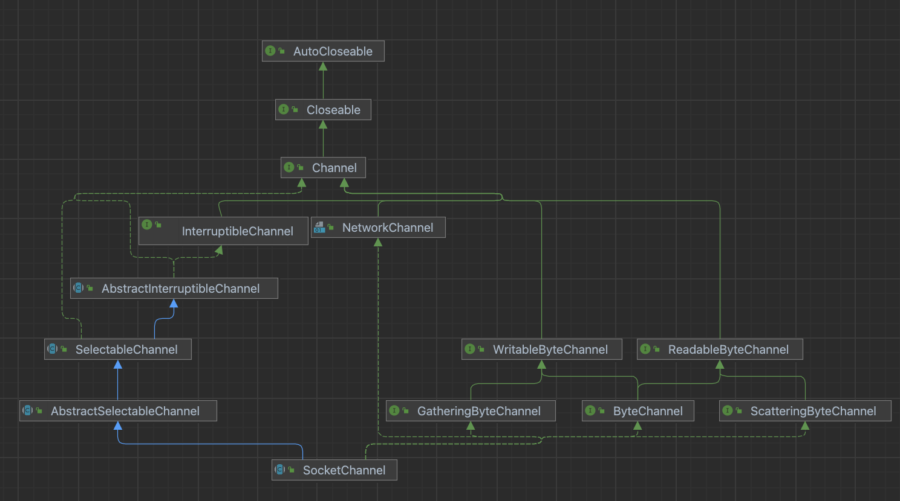
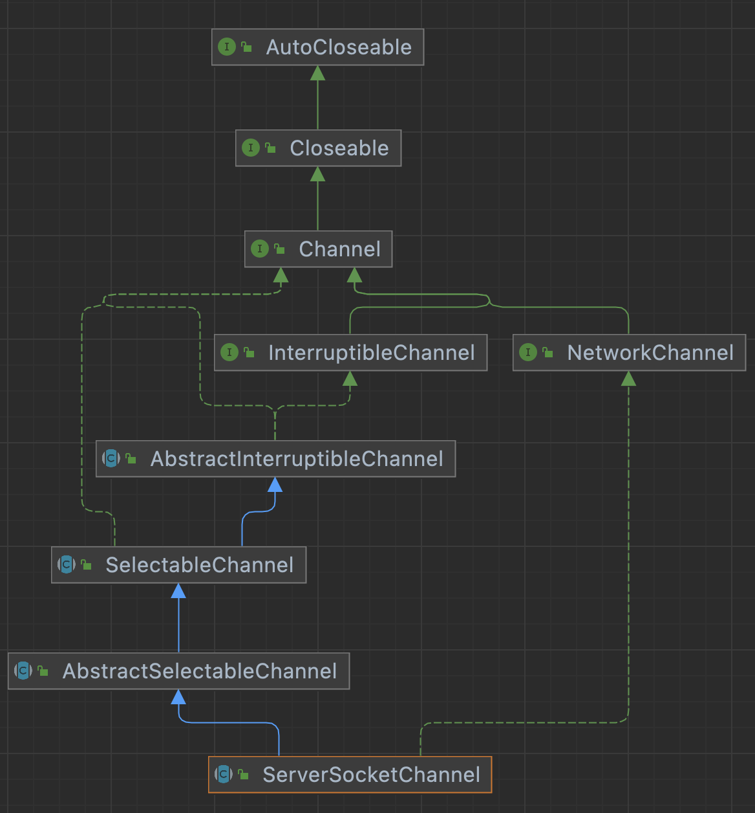

# java socket

## BIO socket

- java.net.SocketOptions: socket参数设置接口
- java.net.SocketImpl: socket的模型
- java.net.PlainSocketImpl: socket的native实现
- java.net.Socket: 客户端socket，核心为SocketImpl
- java.net.ServerSocket: 服务端socket，主要做accept操作，核心为SocketImpl

### PlainSocketImpl

socket核心的native实现

``` java
class PlainSocketImpl extends AbstractPlainSocketImpl
{

    native void socketCreate(boolean isServer) throws IOException;

    native void socketConnect(InetAddress address, int port, int timeout)
        throws IOException;

    native void socketBind(InetAddress address, int port)
        throws IOException;

    native void socketListen(int count) throws IOException;

    native void socketAccept(SocketImpl s) throws IOException;

    native int socketAvailable() throws IOException;

    native void socketClose0(boolean useDeferredClose) throws IOException;

    native void socketShutdown(int howto) throws IOException;

    static native void initProto();

    native void socketSetOption0(int cmd, boolean on, Object value)
        throws SocketException;

    native int socketGetOption(int opt, Object iaContainerObj) throws SocketException;

    native void socketSendUrgentData(int data) throws IOException;
}
```


## NIO socket

- java.nio.channels.SocketChannel
- java.nio.channels.ServerSocketChannel
- java.nio.channels.Selector
  - KQueueSelectorProvider
    - KQueueSelectorImpl
- 读写功能
  - FileDescriptor: 文件描述符
  - NativeDispatcher
    - DatagramDispatcher: UDP数据读写，含native方法
    - SocketDispatcher: TCP数据读写，调用FileDispatcherImpl
    - FileDispatcher: 抽象类
      - FileDispatcherImpl: 文件读写，含native方法


### SocketChannel





### ServerSocketChannel




### Selector

最终Selector的实现为KQueueSelectorImpl

KQueueSelectorImpl->SelectorImpl->AbstractSelector->Selector

select()方法内部最终调用实现类的doSelect()方法，在不同操作系统有不同的实现。

常见的实现方法有kqueue和epoll两种模式

``` java
    protected int doSelect(long var1) throws IOException {
        boolean var3 = false;
        if (this.closed) {
            throw new ClosedSelectorException();
        } else {
            this.processDeregisterQueue();

            int var7;
            try {
                this.begin();
                var7 = this.kqueueWrapper.poll(var1);
            } finally {
                this.end();
            }

            this.processDeregisterQueue();
            return this.updateSelectedKeys(var7);
        }
    }
```

这里select最终被阻塞在了KQueueArrayWrapper的poll方法

``` java
  class KQueueArrayWrapper {
      int poll(long var1) {
          this.updateRegistrations();
          int var3 = this.kevent0(this.kq, this.keventArrayAddress, 128, var1);
          return var3;
      }

      void interrupt() {
          interrupt(this.outgoingInterruptFD);
      }

      private native int init();

      private static native void initStructSizes();

      private native void register0(int var1, int var2, int var3, int var4);

      private native int kevent0(int var1, long var2, int var4, long var5);

      private static native void interrupt(int var0);
  }
```
