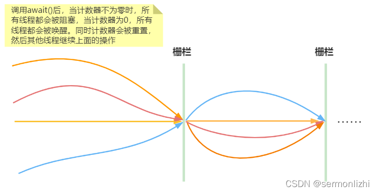
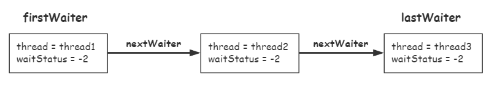
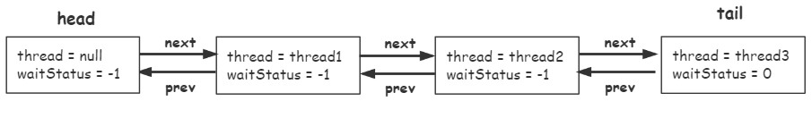

# CyclicBarrier

## 一、简介
在理解CyclicBarrier之前，最好先熟悉一下CountDownLatch的工作原理，这两个工具类都能达到线程等待的效果，但它们的侧重点有所不同，CountDownLatch只能使用一次，当它的计数器为0时会去唤醒所有同步队列中等待的线程，之后就不可用了。而CyclicBarrier的计数器可以被重置，达到重复使用的效果，所以它也就更适用于复杂的业务场景，比如如果计算发生错误时，可以通过重置计算器，让线程重复执行一次

*CyclicBarrier*：回环栅栏（循环屏障），通过它可以实现让一组线程等待至某个状态（屏障点）之后再全部同时执行。叫做回环是因为当所有等待线程都被释放以后，CyclicBarrier可以被重用。

大概的工作原理图如下：



*CyclicBarrier*提供了两个构造方法：

``` java
// parties表示屏障拦截的线程数量，每个线程调用await方法被阻塞，直到最后一个线程到来时再去唤醒之前阻塞的线程。
public CyclicBarrier(int parties)
// 用于在线程到达屏障时(最后一个线程到来)，优先执行 barrierAction，方便处理更复杂的业务场景(该线程的执行时机是在到达屏障之后再执行)
public CyclicBarrier(int parties, Runnable barrierAction)
```

CyclicBarrier中最重要的方法方法就是=await()=

``` java
//屏障 指定数量的线程全部调用await()方法时，这些线程不再阻塞,也就是最后一个到达的线程会去唤醒之前阻塞的线程
// BrokenBarrierException 表示栅栏已经被破坏，破坏的原因可能是其中一个线程 await() 时被中断或者超时
public int await() throws InterruptedException, BrokenBarrierException
public int await(long timeout, TimeUnit unit) throws InterruptedException, BrokenBarrierException, TimeoutException
```

除了上面这些，还提供了以下方法：

``` java
// 获取通过屏障所需的线程数
public int getParties()
// 判断屏障是否处于中断状态
public boolean isBroken()
// 重置通过屏障所需的线程数
public void reset()
// 获取处于等待状态的线程数
public int getNumberWaiting()
```

## 二、使用场景
### 2.1 合并计算结果
同时有多个线程计算数据，最后进行合并，下面模拟三个线程分别去查询商品的价格，最后计算商品的平均价格

在下面的例子中，采用=CyclicBarrier=的=CyclicBarrier(int parties, Runnable barrierAction)=构造方法，每个线程查询完商品价格后，就调用=await()=方法进行阻塞，当最后一个线程调用=await()=方法时，就会去执行计算平均价格的逻辑并唤醒阻塞的线程

``` java
//保存每类商品的价格
ConcurrentHashMap<String, Integer> priceMap = new ConcurrentHashMap<>();
ExecutorService executorService = Executors.newFixedThreadPool(3);

CyclicBarrier cyclicBarrier = new CyclicBarrier(3,() ->{
    Collection<Integer> priceCollect = priceMap.values();
    long avePrice = priceCollect.stream().reduce(Integer::sum).get()/3;
    System.out.println("商品的平均价格:"+avePrice);
});

for (int i = 0; i < 3; i++){
    executorService.execute(() ->{
        // 模拟查询商品价格
        int price = (int) (Math.random() * 100);
        priceMap.put(Thread.currentThread().getName(), price);
        System.out.println(Thread.currentThread().getName()+"价格为"+price);
        try {
            cyclicBarrier.await();
        } catch (InterruptedException | BrokenBarrierException e) {
            log.error(e);
        }
    });
}
```

### 2.2 人满发车
利用*CyclicBarrier*的计数器能够重置，屏障可以重复使用的特性，可以支持类似“人满发车”的场景

``` java
public static void main(String[] args) {
        ExecutorService executorService = Executors.newFixedThreadPool(5);
        CyclicBarrier cyclicBarrier = new CyclicBarrier(5, () -> System.out.println("准备发车……"));


        for (int i=0; i<10;i++){
            executorService.submit(() -> {
                try {
                    Thread.sleep(ThreadLocalRandom.current().nextInt(1000));
                    System.out.println("已上车" + (cyclicBarrier.getNumberWaiting()+1) + "个人");
                    cyclicBarrier.await();
                } catch (InterruptedException | BrokenBarrierException e) {
                    e.printStackTrace();
                }

            });
        }
    }
```

控制台打印结果如下：

``` java
已上车1个人
已上车2个人
已上车3个人
已上车4个人
已上车5个人
准备发车……
已上车1个人
已上车2个人
已上车3个人
已上车4个人
已上车5个人
准备发车……
```

## 三、源码分析
看过=CountDownLatch=源码就知道它是通过共享锁来实现，而=CyclicBarrier=是采用=ReentrantLock=独占锁和=Condition=条件队列来完成的，在实现上，=CyclicBarrier=要比=CountDownLatch=复杂一些，因为它还涉及到线程从条件队列转移到同步队列的操作，而这部分的源码也是稍微有些复杂的。

### 3.1 构造方法
以多参数的构造方法为例：

``` java
public CyclicBarrier(int parties, Runnable barrierAction) {
    if (parties <= 0) throw new IllegalArgumentException();
    this.parties = parties;
    this.count = parties;
    this.barrierCommand = barrierAction;
}
```

该构造方法中，多了一个=Runnable=类型的入参，当所有线程都到达栅栏之后，就回去调用它的=run()=，同时构造方法里面的=parties=和=count=都记录了越过屏障需要的线程数，但=parties=记录的是副本，计数器重置的时候会用到，而=count=则记录了还需要等待多少线程到达屏障，每个线程调用=await()=方法时，该值都会减一

### 3.2 线程阻塞与唤醒
=CyclicBarrier=中线程的阻塞与唤醒都是在=await()=方法中实现的，该方法会完成线程从条件队列到同步队列的转移，以及线程的阻塞和唤醒，下面重点看该方法源码实现的细节

``` java
public int await() throws InterruptedException, BrokenBarrierException {
    try {
        return dowait(false, 0L);
    } catch (TimeoutException toe) {
        throw new Error(toe); // cannot happen
    }
}
```

核心方法在于=dowait()=，下面是整个方法的源码，将其分为三大块来逐个分析

``` java
private int dowait(boolean timed, long nanos)
    throws InterruptedException, BrokenBarrierException,
           TimeoutException {
    final ReentrantLock lock = this.lock;
    lock.lock();
    try {
        final Generation g = generation;

        if (g.broken)
            throw new BrokenBarrierException();

        if (Thread.interrupted()) {
            breakBarrier();
            throw new InterruptedException();
        }

        int index = --count;
        if (index == 0) {  // tripped
            boolean ranAction = false;
            try {
                final Runnable command = barrierCommand;
                if (command != null)
                    command.run();
                ranAction = true;
                nextGeneration();
                return 0;
            } finally {
                if (!ranAction)
                    breakBarrier();
            }
        }

        // loop until tripped, broken, interrupted, or timed out
        for (;;) {
            try {
                if (!timed)
                    trip.await();
                else if (nanos > 0L)
                    nanos = trip.awaitNanos(nanos);
            } catch (InterruptedException ie) {
                if (g == generation && ! g.broken) {
                    breakBarrier();
                    throw ie;
                } else {
                    Thread.currentThread().interrupt();
                }
            }

            if (g.broken)
                throw new BrokenBarrierException();

            if (g != generation)
                return index;

            if (timed && nanos <= 0L) {
                breakBarrier();
                throw new TimeoutException();
            }
        }
    } finally {
        lock.unlock();
    }
}
```

#### 3.2.1 锁的作用
在=dowait()=方法中，首先进行了加锁操作，这一步是为了什么呢？

``` java
final ReentrantLock lock = this.lock;
lock.lock();
```

在=CyclicBarrier=类属性中，有两个特殊的属性，独占锁以及条件队列的条件对象

``` java
/** The lock for guarding barrier entry */
private final ReentrantLock lock = new ReentrantLock();
/** Condition to wait on until tripped */
private final Condition trip = lock.newCondition();
```

在=dowait()=方法中，会调用=Condition=的=await()=和=signalAll()=方法，而这两个方法的调用必须要与=lock()=配合使用，就相当于=wait()=和=notify()/notifyAll()=必须与=Synchronized=关键字搭配使用一样的道理

#### 3.2.2 线程阻塞
=dowait()=方法中，会对=count=进行减一，然后判断是需要阻塞还是唤醒

``` java
int index = --count;
```

如果不等于0，就会去调用=for (;;)=的逻辑，在循环里面会去调用=Condition=的=await()=方法

``` java
for (;;) {
    try {
        if (!timed)
            trip.await();
        else if (nanos > 0L)
            nanos = trip.awaitNanos(nanos);
    } catch (InterruptedException ie) {
        if (g == generation && ! g.broken) {
            breakBarrier();
            throw ie;
        } else {
            Thread.currentThread().interrupt();
        }
    }
}
```

在=AbstractQueuedSynchronizer=中，其内部类=ConditionObject=实现了=Condition=接口，并实现了=await()=方法

这个方法理解起来就有点儿绕了，首先调用=addCondition()=方法将当前线程封装成一个节点然后添加到条件队列中；在=dowait()=方法中，调用了=lock()=方法，阻塞了后面调用=await()=方法的线程，而这里调用=fullRelease()=方法来释放锁，也就是唤醒因调用=await()=方法但=lock()=失败时被阻塞的线程

接着调用=isOnSyncQueue()=方法判断当前生成的条件队列的节点是否在同步队列中(此时当然不在了)，如果不在同步队列中，就直接调用=LockSupport.park()=方法将其阻塞

等到最后一个线程调用=await()=方法后，会把条件队列的节点都转移到同步队列，并唤醒这些线程，这样就可以跳出循环

``` java
public final void await() throws InterruptedException {
    if (Thread.interrupted())
        throw new InterruptedException();
    Node node = addConditionWaiter();
    int savedState = fullyRelease(node);
    int interruptMode = 0;
    while (!isOnSyncQueue(node)) {
        LockSupport.park(this);
        if ((interruptMode = checkInterruptWhileWaiting(node)) != 0)
            break;
    }
    if (acquireQueued(node, savedState) && interruptMode != THROW_IE)
        interruptMode = REINTERRUPT;
    if (node.nextWaiter != null) // clean up if cancelled
        unlinkCancelledWaiters();
    if (interruptMode != 0)
        reportInterruptAfterWait(interruptMode);
}
```

下面再详细看一下上面介绍的几个核心方法

##### 3.2.2.1 条件队列添加节点
这个方法也很简单，这个节点与=ReentrantLock=里面的节点是同一个类，当节点用于条件队列时，主要用=Node=的=nextWaiter=和=waitStatus=这两个属性即可

在前面的=ReentrantLock=的文章中已经介绍过了，同步队列使用双向链表来实现，而条件队列使用单向链表来实现

在该方法中，首先就是将状态不为=CONDITION(-2)=的节点从条件队列中移除，然后将当前线程封装成一个条件队列的节点，与同步队列不同的是，条件队列没有线程为NULL的头节点，它的头节点就是第一个等待的节点，尾节点就是最后等待的节点

``` java
private Node addConditionWaiter() {
    Node t = lastWaiter;
    // If lastWaiter is cancelled, clean out.
    if (t != null && t.waitStatus != Node.CONDITION) {
        unlinkCancelledWaiters();
        t = lastWaiter;
    }
    Node node = new Node(Thread.currentThread(), Node.CONDITION);
    if (t == null)
        firstWaiter = node;
    else
        t.nextWaiter = node;
    lastWaiter = node;
    return node;
}
```

条件队列的结构图如下：



##### 3.2.2.2 释放锁
=fullyRelease()=也比较简单，首先调用=getState()=方法获取=state=的值，由于是一个独占锁，所以返回值也就是1，然后就是调用=release()=方法，该方法也很简单，就是通过调用=tryRelease()=借助CAS将=state=的值改为0，然后就是调用=unparkSuccessor()=方法来唤醒之前=lock=失败而被阻塞的线程，=relesse()=和=tryRelease()=这两个方法的源码在前面=ReentrantLock=的文章已经介绍过了，这里就不再赘述

``` java
final int fullyRelease(Node node) {
    boolean failed = true;
    try {
        int savedState = getState();
        if (release(savedState)) {
            failed = false;
            return savedState;
        } else {
            throw new IllegalMonitorStateException();
        }
    } finally {
        if (failed)
            node.waitStatus = Node.CANCELLED;
    }
}
```

``` java
public final boolean release(int arg) {
    if (tryRelease(arg)) {
        Node h = head;
        if (h != null && h.waitStatus != 0)
            unparkSuccessor(h);
        return true;
    }
    return false;
}
```

#### 3.2.3 线程转移与唤醒
在上面已经介绍了，把线程封装成节点加入到条件队列后，就又被阻塞了，那什么时候去唤醒呢？

当然是要等待最后一个线程调用=await()=方法，此时=count=的值已经变为0了，表示之前等待的线程可以和当前线程一起越过屏障了。

其核心源码就是=dowait()=方法中的这一段源码

``` java
int index = --count;
if (index == 0) {  // tripped
    boolean ranAction = false;
    try {
        final Runnable command = barrierCommand;
        if (command != null)
            command.run();
        ranAction = true;
        nextGeneration();
        return 0;
    } finally {
        if (!ranAction)
            breakBarrier();
    }
}
```

在这段代码就可以很清楚的看到了，当最后一个线程到来时，它首先就会去执行构造参数=Runable=对象的=run()=

然后去调用=nextGeneration()=方法，从这个方法的名字也可以看出来，它表示当前一轮的等待结束了，下一轮线程可以重复执行了，而线程唤醒就是在该方法中实现的

``` java
private void nextGeneration() {
    // signal completion of last generation
    trip.signalAll();
    // set up next generation
    count = parties;
    generation = new Generation();
}
```

首先，调用=Condition=的=signalAll()=方法来唤醒线程，然后重置计数器，这里就可以理解=parties=作为副本的作用了，下面重点介绍=signalAll()=方法，该方法也在=ConditionObject=中已实现

``` java
public final void signalAll() {
    if (!isHeldExclusively())
        throw new IllegalMonitorStateException();
    Node first = firstWaiter;
    if (first != null)
        doSignalAll(first);
}

private void doSignalAll(Node first) {
    lastWaiter = firstWaiter = null;
    do {
        Node next = first.nextWaiter;
        first.nextWaiter = null;
        transferForSignal(first);
        first = next;
    } while (first != null);
}

final boolean transferForSignal(Node node) {
    if (!compareAndSetWaitStatus(node, Node.CONDITION, 0))
        return false;

    Node p = enq(node);
    int ws = p.waitStatus;
    if (ws > 0 || !compareAndSetWaitStatus(p, ws, Node.SIGNAL))
        LockSupport.unpark(node.thread);
    return true;
}
```

上面这一系列方法调用，也算是比较简单的，=doSignalAll()=方法中，从条件队列的头节点开始，循环调用=transferForSignal()=，而主要的实现也在方法中。

=transferForSignal()=中，首先，通过CAS，将条件队列的节点状态从条件状态改为0(初始化状态)，这一步的目的是为将节点添加到同步队列中，而接下来的=enq()=方法就再熟悉不过了，同样在=ReentrantLock=文章中已经介绍过了，它的作用就是将节点添加到同步队列中，然后然后当前节点的前一个节点

最后通过CAS将前一个节点的状态改为=SIGNAL=，表示它需要唤醒后面节点的线程

注意，=Condition=的=signalAll()=并不会真正去唤醒线程，它只是完成了将条件队列的节点转移到了同步队列，同时将前置节点的状态更改了=SIGNAL=，表示可唤醒

此时=CyclicBarrier=对应的同步队列的结构大概如下：



而真正去唤醒同步队列这些线程的，还要回到=CyclicBarrier=的=dowait()=方法中，当最后一个线程调用=await()=时，它就回去完成上述所有的操作，最后在=dowait()=方法的=finally=代码段中去调用=lock.unlock()=，而这里才会真正的去唤醒同步队列中阻塞的线程

``` java
public void unlock() {
    sync.release(1);
}

public final boolean release(int arg) {
    if (tryRelease(arg)) {
        Node h = head;
        if (h != null && h.waitStatus != 0)
            unparkSuccessor(h);
        return true;
    }
    return false;
}
```

注意，这里它只会唤醒同步队列中第一个等待节点的线程，并且它只是唤醒，没有做其他任何操作，当线程被唤醒后，就又回到了它被阻塞的地方，也就是=Condition=的=await()=方法中，当时被阻塞在=while=循环里面，现在被唤醒，而当前节点也在同步队列中，下面就是去调用=acquireQueued()=方法，该方法会把当前被唤醒的线程节点从同步队列中移除，最后又回到了=Condition=的=dowait()=方法中

``` java
public final void await() throws InterruptedException {
    if (Thread.interrupted())
        throw new InterruptedException();
    Node node = addConditionWaiter();
    int savedState = fullyRelease(node);
    int interruptMode = 0;
    while (!isOnSyncQueue(node)) {
        LockSupport.park(this);
        if ((interruptMode = checkInterruptWhileWaiting(node)) != 0)
            break;
    }
    if (acquireQueued(node, savedState) && interruptMode != THROW_IE)
        interruptMode = REINTERRUPT;
    if (node.nextWaiter != null) // clean up if cancelled
        unlinkCancelledWaiters();
    if (interruptMode != 0)
        reportInterruptAfterWait(interruptMode);
}
```

当同步队列的第一个线程又回到=dowait()=方法时，会在下面代码处退出，但退出前也会去调用=finally=块中的=lock.unlock()=，这样依次就可以唤醒同步队列中的所有线程了

``` java
if (g != generation)
    return index;
```


