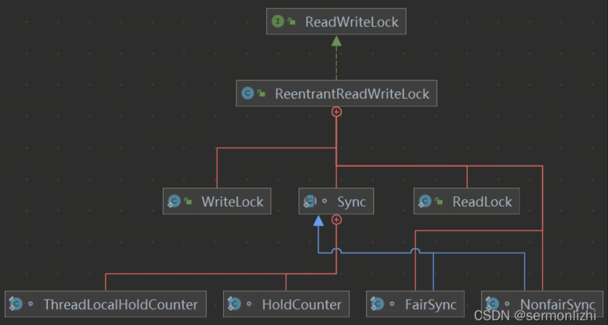

# ReadWriteLock

## 什么是读写锁
在日常开发的过程中，经常存在一种场景：对于某些共享资源有读和写的操作，但是读操作要比写操作频繁(读多写少的情况)。

在没有写操作的时候，对于读操作完全不需要考虑共享资源的安全问题(共享读)，但有了写操作之后，为了保证读写的共享资源的数据一致性，就必须进行同步，即写写、写读、读写都是需要进行互斥的。如果我们直接使用ReentrantLock独占锁来解决读写共存的场景时，在高并发的情况下，性能就会受到很大影响，毕竟读读之间不需要进行互斥，于是就有了读写锁。

在读多写少的情况下，读写锁要比排他锁(独占锁)具有更好的并发性和吞吐量。

针对上面这种情况，Java的并发工具包提供了读写锁的实现ReentrantReadWriteLock，在它内部，维护了一对相关的锁，用于只读操作的读锁，读锁由共享锁实现且支持重入；用于写操作的写锁，写锁由独占锁实现也支持重入。

线程可以获取读锁的前提条件：

- 没有其他线程已获取写锁
- 没有写请求或有写请求，但请求读锁的和持有写锁的线程是同一个

线程可以获取写锁的前提条件：

- 没有其他线程的读锁
- 没有其他线程的写锁

ReentrantReadWriteLock具有以下三个重要的特性：

公平选择性：支持非公平(默认)和公平两种获取锁的方式，同样非公平的方式性能更好一些
- 可重入：读锁和写锁都支持可重入。
- 锁降级：当线程获取写锁后，可以继续获取读锁，然后再释放写锁；按照这个次序就完成了从写锁到读锁的降级过程

## 读写锁类结构

ReentrantReadWriteLock实现了ReadWriteLock接口，该接口中提供了两个方法，分别可以获取读锁和写锁的Lock对象

``` java
  public interface ReadWriteLock {
      /**
       ,* Returns the lock used for reading
       ,*/
      Lock readLock();

      /**
       ,* Returns the lock used for writing.
       ,*/
      Lock writeLock();
  }
```

ReentrantReadWriteLock的类结构如下：

内部维护了读锁和写锁，写锁是独占的，读锁是共享的


读写锁的基本使用

``` java
ReentrantReadWriteLock readWriteLock = new ReentrantReadWriteLock();
ReentrantReadWriteLock.ReadLock readLock = readWriteLock.readLock();
ReentrantReadWriteLock.WriteLock writeLock = readWriteLock.writeLock();

public String get(String key){
    readLock.lock();
    try {
        // 处理业务逻辑
    }finally {
        readLock.unlock();
    }
}

public void put(String key,String value){
    writeLock.lock();
    try {
        // 处理业务逻辑
    }finally {
        writeLock.unlock();
    }
}
```

注意事项：

- 读锁不支持条件变量，但写锁支持条件变量
- 重入时不支持升级，即持有读锁的情况下去获取写锁，会导致永久等待
- 重入是支持降级，即持有写锁的情况下可以去获取读锁，待写锁释放后，变成了只持有读锁(从写锁降级为读锁)

## 使用场景

### 线程安全的缓存

ReentrantReadWriteLock适合读多写少的场景

下面定义一个缓存类Cache，内部使用HashMap存储，通过读写锁将Cache的put()、get()和clear()变成线程安全的方法

``` java
public class Cache{
    static Map<String,Object> map = new HashMap<>();

    static ReentrantReadWriteLock readWriteLock = new ReentrantReadWriteLock();
    static ReentrantReadWriteLock.ReadLock readLock = readWriteLock.readLock();
    static ReentrantReadWriteLock.WriteLock writeLock = readWriteLock.writeLock();

    public static final Object get(String key){
        readLock.lock();
        try {
            return map.get(key);
        }finally {
            readLock.unlock();
        }
    }

    public static final Object put(String key,Object value){
        writeLock.lock();
        try {
            return map.put(key,value);
        }finally {
            writeLock.unlock();
        }
    }

    public static final void clear(){
        writeLock.lock();
        try {
            map.clear();
        }finally {
            writeLock.unlock();
        }
    }
}

```

### 锁降级
前面已经提到过好几次了，锁降级值得就是当前线程从写锁降级为读锁。如果当前线程拥有写锁，将其释放后，再次获取读锁，这种分段完成的过程不能称之为锁降级。

锁降级可以使当前线程拿到刚刚修改后的数据而不会被其他线程锁破坏，防止更新失败。

下面时锁降级的使用示例，只要update更新后，其他线程能够感知其变成，然后并发处理数据

``` java
public class LockDegraded{
    ReentrantReadWriteLock readWriteLock = new ReentrantReadWriteLock();
    ReentrantReadWriteLock.ReadLock readLock = readWriteLock.readLock();
    ReentrantReadWriteLock.WriteLock writeLock = readWriteLock.writeLock();

    private volatile boolean update = false;

    public void analyseMessage(){
        readLock.lock();
        if (!update){
            // 必须先释放读锁,后面才能获取写锁
            readLock.unlock();
            // 锁降级从获取到写锁开始
            writeLock.lock();
            try {
                if (!update){
                    // 查询准备message
                    update = true;
                }
                // 加读锁,让获取到的消息第一时间被处理
                readLock.lock();
            }finally {
                writeLock.unlock();
            }
            // 到这里锁降级就已经完成了
        }
        try {
            // 处理消息
        }finally {
            readLock.unlock();
        }
    }
}

```

锁降级过程中，读锁的获取是必要，主要是为了保证数据的可见性，如果当前线程不获取读锁而释放写锁，假设此时又另外一个线程获取了写锁并修改了数据，那么当前线程是无法感知数据更新的。但是按照锁降级的过程，由于当前线程已经获取了读锁，所以其他线程在获取写锁时就会被阻塞，直到当前线程处理完消息并释放读锁

## 源码分析

在分析源码之前，思考一个问题，之前在介绍ReentrantLock&AQS的时候已经提到了，所有锁的实现都是通过AQS中的state属性来记录锁的，而ReentrantReadWriteLock的实现即用了独占锁，又用到了共享锁，那么它的锁状态是如何来记录的呢？

在上面ReentrantReadWriteLock的类结构图中可以看到，在创建ReadLock和WriteLock对象时，它们构造方法的入参用的是同一个Sync对象，Sync是ReentrantReadWriteLock中继承了AbstractQueuedSynchronizer的内部类，或许，已经猜到了，它用同一个state属性来记录独占锁和共享锁的状态，下面结合源码来看一下

其内部UML图如下：




### 读写状态设计

ReentrantReadWriteLock使用一个变量state来记录读写状态，采用“按位切割使用”的方式来维护这个变量，将其切分为两部分：高16为表示读，低16为表示写

分割之后，通过位运算可以很方便计算读和写的状态，假设state属性值现在为S，那么锁状态计算如下：

- 写状态: 等于S & 0x0000FFFF(将高位全部抹去)。如果写状态+1，就直接S+1`即可
- 读状态: 等于S >>> 16(无符号右移16位置)。如果都状态+1，就等于S+(1 << 16)，也就是S+0x00010000

根据上面状态的划分就可以得出一个结论：S不等于0时，当写状态(S&0x0000FFFF)等于0时，则读状态(S>>>16)大于0，即已获取读锁

根据上面状态的划分就可以得出一个结论：S不等于0时，当写状态(S&0x0000FFFF)等于0时，则读状态(S>>>16)大于0，即已获取读锁


其代码实现在内部类Sync中

``` java
static final int SHARED_SHIFT   = 16;
static final int SHARED_UNIT    = (1 << SHARED_SHIFT);
static final int MAX_COUNT      = (1 << SHARED_SHIFT) - 1;
static final int EXCLUSIVE_MASK = (1 << SHARED_SHIFT) - 1;

/** Returns the number of shared holds represented in count  */
static int sharedCount(int c)    { return c >>> SHARED_SHIFT; }
/** Returns the number of exclusive holds represented in count  */
static int exclusiveCount(int c) { return c & EXCLUSIVE_MASK; }

```

上面两个静态方法所代表的含义是不同的：

- exclusiveCount()：返回已经获取写锁的次数
- sharedCount()：返回所有持有读锁的线程获取读锁的总次数。与写锁不同，读锁可以被多个线程所持有，而读锁又支持每个线程可重入，所以就需要对每个线程所持有的读锁的数量单独计数，这就需要用到HoldCounter计数器

### HoldCounter 计数器

读锁的内部实现，就是共享锁的。一次共享锁的操作就相当于对HoldCounter计数器的操作。获取共享锁，则计数器+1，释放共享锁，则计数器-1。

``` java
/**
  * A counter for per-thread read hold counts.
  * Maintained as a ThreadLocal; cached in cachedHoldCounter
  */
static final class HoldCounter {
    int count = 0;
    // Use id, not reference, to avoid garbage retention
    final long tid = getThreadId(Thread.currentThread());
}

/**
  * ThreadLocal subclass. Easiest to explicitly define for sake
  * of deserialization mechanics.
  */
static final class ThreadLocalHoldCounter
    extends ThreadLocal<HoldCounter> {
    public HoldCounter initialValue() {
        return new HoldCounter();
    }
}

private transient ThreadLocalHoldCounter readHolds;
private transient HoldCounter cachedHoldCounter;

private transient Thread firstReader = null;
private transient int firstReaderHoldCount;

```

通过 ThreadLocalHoldCounter 类，HoldCounter 与线程进行绑定。HoldCounter 是绑定线程的一个计数器，而 ThreadLocalHoldCounter 则是线程绑定的 ThreadLocal。

- HoldCounter是用来记录读锁重入数的对象
- ThreadLocalHoldCounter是ThreadLocal变量，用来存放不是第一个获取读锁的线程的其他线程的读锁重入数对象；第一个获取读锁的线程，由单独的firstReader和firstReaderHoldCount来记录重入次数

### 写锁获取

写锁获取调用的是AQS的acquire()，该方法在ReentrantLock中已经讲过了，不同的锁会去自行事项tryAcquire()，而真正去获取锁调用的是ReentrantReadWriteLock.Sync的tryAcquire()，具体看该方法的实现

``` java
protected final boolean tryAcquire(int acquires) {
    Thread current = Thread.currentThread();
    int c = getState();
    int w = exclusiveCount(c);
    if (c != 0) {
        // (Note: if c != 0 and w == 0 then shared count != 0)
        if (w == 0 || current != getExclusiveOwnerThread())
            return false;
        if (w + exclusiveCount(acquires) > MAX_COUNT)
            throw new Error("Maximum lock count exceeded");
        // Reentrant acquire
        setState(c + acquires);
        return true;
    }
    if (writerShouldBlock() ||
        !compareAndSetState(c, c + acquires))
        return false;
    setExclusiveOwnerThread(current);
    return true;
}

```

首先去获取state属性值和写锁被获取的次数

如果state属性不为0，则判断写锁被获取的次数

- 如果写锁被获取的次数为0(表示已经有线程获取了读锁)或者当前线程不等与独占锁线程(写锁已经被其他线程获取)，这两种情况都不能再获取写锁
- 如果写锁获取到的次数已经得到了允许的最大值(即2^16)，直接抛出异常
- 如果上面两种情况都不满足，则修改state的值，表示写锁重入成功

如果state属性为0，说明此时没有任何线程已经获取了读锁或写锁

- 首先判断是否需要阻塞，这里对应的公平和非公平的逻辑，如果是非公平锁，直接就返回false；如果是公平锁，需要判断当前同步队列中是否有阻塞的线程，如果有，那么当前线程也需要去同步队列阻塞

``` java
final boolean writerShouldBlock() {
    return false; // writers can always barge
}

final boolean writerShouldBlock() {
    return hasQueuedPredecessors();
}
```

- 如果不需要阻塞，就通过CAS去修改state属性值，然后将当前线程设置为独占线程

### 写锁释放

写锁释放调用的的是AQS的release()，这些通用方法，AQS都已经实现了，而内部具体逻辑由每个实现类自行实现，然后调用的是ReentrantReadWriteLock.Sync的tryRelease

``` java
protected final boolean tryRelease(int releases) {
    if (!isHeldExclusively())
        throw new IllegalMonitorStateException();
    int nextc = getState() - releases;
    boolean free = exclusiveCount(nextc) == 0;
    if (free)
        setExclusiveOwnerThread(null);
    setState(nextc);
    return free;
}
```

因为写锁也支持可重入，所以先去计算释放一次写锁后，是否还需要再释放，就是计算state属性低16位的值，如果值为0，说明这是最后一次释放写锁，直接将独占线程置为null，然后返回true，在release()中就会去唤醒同步队列中阻塞的线程；如果不是最后一次释放写锁，则只是修改state的值就行了

### 读锁获取

读锁的获取调用的是AQS的acquireShared()，ReentrantReadWriteLock.Sync中实现了tryAcquireShared()方法

``` java
protected final int tryAcquireShared(int unused) {
    Thread current = Thread.currentThread();
    int c = getState();
    if (exclusiveCount(c) != 0 &&
        getExclusiveOwnerThread() != current)
        return -1;
    int r = sharedCount(c);
    if (!readerShouldBlock() &&
        r < MAX_COUNT &&
        compareAndSetState(c, c + SHARED_UNIT)) {
        if (r == 0) {
            firstReader = current;
            firstReaderHoldCount = 1;
        } else if (firstReader == current) {
            firstReaderHoldCount++;
        } else {
            HoldCounter rh = cachedHoldCounter;
            if (rh == null || rh.tid != getThreadId(current))
                cachedHoldCounter = rh = readHolds.get();
            else if (rh.count == 0)
                readHolds.set(rh);
            rh.count++;
        }
        return 1;
    }
    return fullTryAcquireShared(current);
}

```

同样先获取state属性值来计算读写锁的状态

如果已经有线程获取了写锁，并且获取写锁的线程不是当前线程，那么当前线程就不能获取读锁，然后将其添加到同步队列，在读写锁的同步队列中，独占类型的节点和共享类型的节点都存在

上面条件不满足时，计算已经获取读锁的线程数，接着判断当前获取读锁的线程是否需要阻塞，与上面获取写锁时判断是否需要阻塞是一样的。

如果不需要阻塞，并且已经获取读锁的线程数小于最大值，并且通过CAS修改了获取读锁的总次数成功，下面就是将指定线程持有的读锁次数+1，如果当前线程是第一个获取读锁的线程，则直接修改firstReader和firstReaderHoldCount的属性值，这两个属性值用户记录第一个获取读锁线程的情况；如果当前线程就是第一个获取锁的线程，且是重入获取读锁，直接将firstReaderHoldCount+1。

对于后续获取读锁的线程，有一个cachedHoldCounter来缓存最近一个获取读锁的线程的情况，如果缓存cachedHoldCounter中的线程不是当前线程，则从readHolds中获取当前线程获取读锁的情况，readHolds.get()返回的是一个HoldCounter对象，最后将HoldCounter对象中的count属性值+1。

如果获取读锁失败，最后调用fullTryAcquireShared()去自旋尝试获取读锁，该方法的源码基本与tryAcquireShared()是一样的，就不再赘述

``` java
final int fullTryAcquireShared(Thread current) {
    
    HoldCounter rh = null;
    for (;;) {
        int c = getState();
        if (exclusiveCount(c) != 0) {
            if (getExclusiveOwnerThread() != current)
                return -1;
            // else we hold the exclusive lock; blocking here
            // would cause deadlock.
        } else if (readerShouldBlock()) {
            // Make sure we're not acquiring read lock reentrantly
            if (firstReader == current) {
                // assert firstReaderHoldCount > 0;
            } else {
                if (rh == null) {
                    rh = cachedHoldCounter;
                    if (rh == null || rh.tid != getThreadId(current)) {
                        rh = readHolds.get();
                        if (rh.count == 0)
                            readHolds.remove();
                    }
                }
                if (rh.count == 0)
                    return -1;
            }
        }
        if (sharedCount(c) == MAX_COUNT)
            throw new Error("Maximum lock count exceeded");
        if (compareAndSetState(c, c + SHARED_UNIT)) {
            if (sharedCount(c) == 0) {
                firstReader = current;
                firstReaderHoldCount = 1;
            } else if (firstReader == current) {
                firstReaderHoldCount++;
            } else {
                if (rh == null)
                    rh = cachedHoldCounter;
                if (rh == null || rh.tid != getThreadId(current))
                    rh = readHolds.get();
                else if (rh.count == 0)
                    readHolds.set(rh);
                rh.count++;
                cachedHoldCounter = rh; // cache for release
            }
            return 1;
        }
    }
}
```

### 读锁释放

读锁释放调用的是AQS的releaseShared()，核心逻辑在tryReleaseShared()中

``` java
protected final boolean tryReleaseShared(int unused) {
    Thread current = Thread.currentThread();
    if (firstReader == current) {
        // 第一个获取读锁的线程释放锁
        if (firstReaderHoldCount == 1)
            firstReader = null;
        else
            firstReaderHoldCount--;
    } else {
        // 其他获取读锁的线程释放锁
        HoldCounter rh = cachedHoldCounter;
        if (rh == null || rh.tid != getThreadId(current))
            rh = readHolds.get();
        int count = rh.count;
        if (count <= 1) {
            // 该线程只获取了一次读锁,释放读锁的时候，需要将当前线程
            // 对应的HoldCounter从ThreadLocal中移除
            readHolds.remove();
            if (count <= 0)
                throw unmatchedUnlockException();
        }
        // 重入次数-1
        --rh.count;
    }
    // 读锁的释放是可以并发进行的,所以通过CAS来修改state属性值
    for (;;) {
        int c = getState();
        int nextc = c - SHARED_UNIT;
        if (compareAndSetState(c, nextc))
            // Releasing the read lock has no effect on readers,
            // but it may allow waiting writers to proceed if
            // both read and write locks are now free.
            return nextc == 0;
    }
}

```

## bak

读写锁：分为读锁和写锁，多个读锁不互斥，读锁与写锁互斥，这是由jvm自己控制的，你只要上好相应的锁即可。如果你的代码只读数据，可以很多人同时读，但不能同时写，那就上读锁；如果你的代码修改数据，只能有一个人在写，且不能同时读取，那就上写锁。总之，读的时候上读锁，写的时候上写锁！

ReentrantReadWriteLock会使用两把锁来解决问题，一个读锁，一个写锁

线程进入读锁的前提条件：

没有其他线程的写锁，

没有写请求或者有写请求，但调用线程和持有锁的线程是同一个

线程进入写锁的前提条件：

没有其他线程的读锁

没有其他线程的写锁

ReentrantReadWriteLock锁机制的特性:

(a).重入方面其内部的WriteLock可以获取ReadLock，但是反过来ReadLock想要获得WriteLock则永远都不要想。

(b).WriteLock可以降级为ReadLock，顺序是：先获得WriteLock再获得ReadLock，然后释放WriteLock，这时候线程将保持Readlock的持有。反过来ReadLock想要升级为WriteLock则不可能，为什么？参看(a)

(c).ReadLock可以被多个线程持有并且在作用时排斥任何的WriteLock，而WriteLock则是完全的互斥。这一特性最为重要，因为对于高读取频率而相对较低写入的数据结构，使用此类锁同步机制则可以提高并发量。

(d).不管是ReadLock还是WriteLock都支持Interrupt，语义与ReentrantLock一致。

(e).WriteLock支持Condition并且与ReentrantLock语义一致，而ReadLock则不能使用Condition，否则抛出UnsupportedOperationException异常。

例子1：

``` java
package com.thread;

import java.util.Random;
import java.util.concurrent.locks.ReentrantReadWriteLock;

public class ReadWriteLockTest {
    public static void main(String[] args) {
        final Queue3 q3 = new Queue3();
        for(int i=0;i<3;i++)
        {
            new Thread(){
                public void run(){
                    while(true){
                        q3.get();
                    }
                }

            }.start();
        }
        for(int i=0;i<3;i++)
        {
            new Thread(){
                public void run(){
                    while(true){
                        q3.put(new Random().nextInt(10000));
                    }
                }

            }.start();
        }
    }
}

class Queue3{
    private Object data = null;//共享数据，只能有一个线程能写该数据，但可以有多个线程同时读该数据。
    private ReentrantReadWriteLock rwl = new ReentrantReadWriteLock();
    public void get(){
        rwl.readLock().lock();//上读锁，其他线程只能读不能写
        System.out.println(Thread.currentThread().getName() + " be ready to read data!");
        try {
            Thread.sleep((long)(Math.random()*1000));
        } catch (InterruptedException e) {
            e.printStackTrace();
        }
        System.out.println(Thread.currentThread().getName() + "have read data :" + data);
        rwl.readLock().unlock(); //释放读锁，最好放在finnaly里面
    }

    public void put(Object data){

        rwl.writeLock().lock();//上写锁，不允许其他线程读也不允许写
        System.out.println(Thread.currentThread().getName() + " be ready to write data!");
        try {
            Thread.sleep((long)(Math.random()*1000));
        } catch (InterruptedException e) {
            e.printStackTrace();
        }
        this.data = data;
        System.out.println(Thread.currentThread().getName() + " have write data: " + data);

        rwl.writeLock().unlock();//释放写锁    
    }
}
```

下面使用读写锁模拟一个缓存器：

``` java
package com.thread;

import java.util.HashMap;
import java.util.Map;
import java.util.concurrent.locks.ReadWriteLock;
import java.util.concurrent.locks.ReentrantReadWriteLock;

public class CacheDemo {
    private Map< String,Object> map = new HashMap< String,Object>();//缓存器
    private ReadWriteLock rwl = new ReentrantReadWriteLock();

    public Object get(String id){
        Object value = null;
        rwl.readLock().lock();//首先开启读锁，从缓存中去取
        try{
            value = map.get(id); 
            if(value == null){  //如果缓存中没有释放读锁，上写锁
                rwl.readLock().unlock();
                rwl.writeLock().lock();
                try{
                    value = map.get(id); // 这里可能有多个线程排队进入写逻辑，再取下数据
                    if(value == null){
                        value = "aaa";  //此时可以去数据库中查找，这里简单的模拟一下
                    }
                }finally{
                    rwl.writeLock().unlock(); //释放写锁
                }
                rwl.readLock().lock(); //然后再上读锁
            }
        }finally{
            rwl.readLock().unlock(); //最后释放读锁
        }
        return value;
    }

}
```
