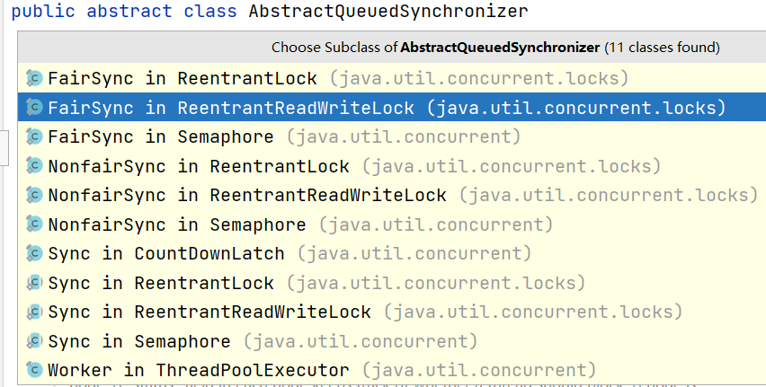
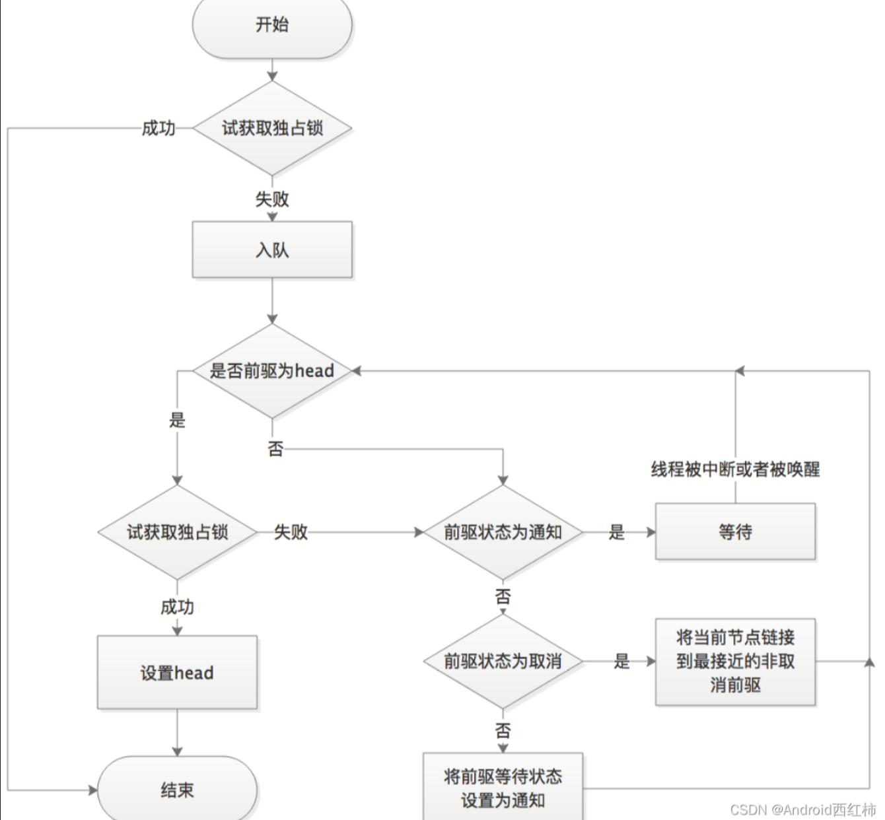
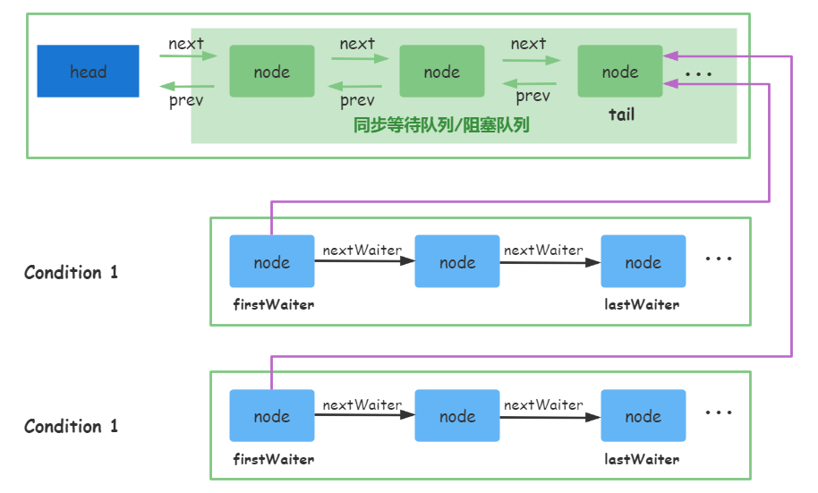
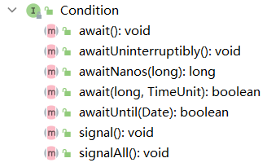
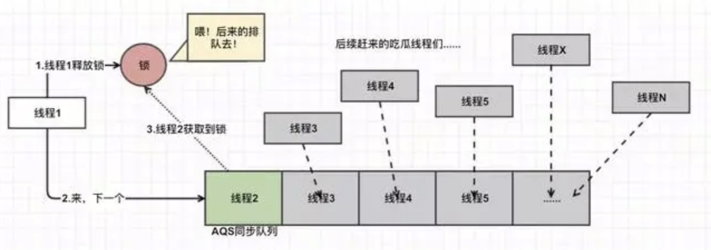
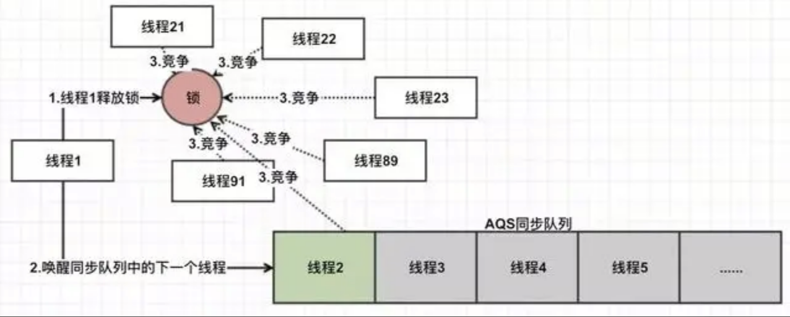
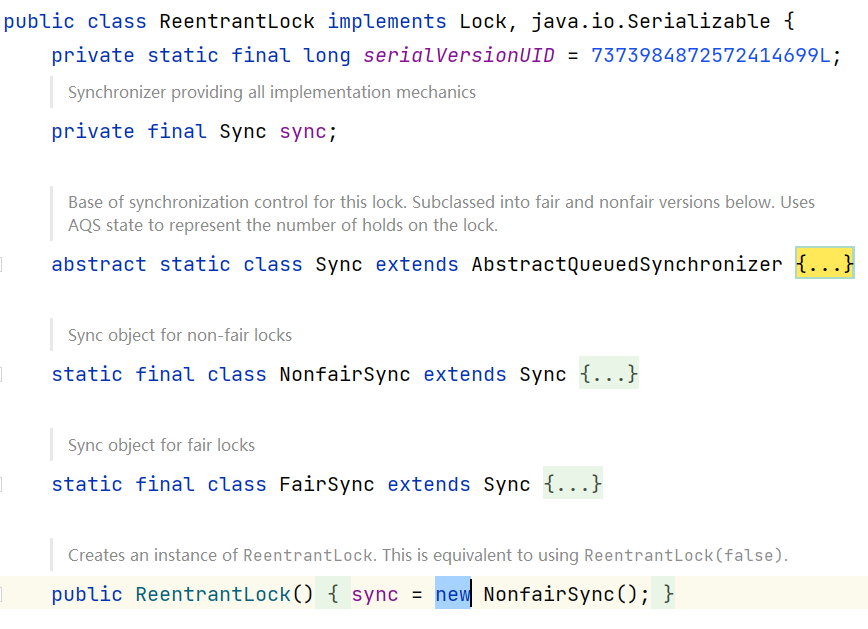

# AQS:AbstractQueuedSynchronizer


## 什么是AQS

MESA管程模型，它主要由共享变量、入口等待队列和条件队列组成，在Synchronized的实现中，只有一个条件队列，而在ReentrantLock中，可以有多个条件队列。

JUC是java.util.concurrent的简写

Java的JUC包下的大多数同步器实现都有着共同的基础行为，比如等待队列、条件队列、独占获取、共享获取等，这些行为的抽象都在=AbstractQueuedSynchronizer=中实现，AQS是一个抽象同步框架，可以用来实现一个依赖状态的同步器。


下面展示了部分AQS的实现类：



## AQS特性

AQS实现了以下的基本功能：

- 阻塞等待队列
- 独占或共享
- 公平或非公平
- 可重入
- 可中断

在AQS内部，维护了一个=volatile int state=属性，这个属性表示共享资源的可用状态，以ReentrantLock为例，它的=lock()=方法就会去调用AQS的=tryAcquire()=方法，而这个方法就是通过CAS操作尝试去修改=state=属性的值，修改成功了就表示拿到了共享资源的使用资格，修改不成功就会被加入到等待队列中。

=state=属性提供了三种访问和修改的方法：

- getState()

  ``` java
  protected final int getState() {
      return state;
  }
  ```

- setState()

  ``` java
  protected final void setState(int newState) {
      state = newState;
  }
  ```

- compareAndSetState()

  ``` java
  protected final boolean compareAndSetState(int expect, int update) {
      // See below for intrinsics setup to support this
      return unsafe.compareAndSwapInt(this, stateOffset, expect, update);
  }
  ```

AQS定义了两种共享资源的访问方式：独占和共享

- Exclusive(独占)：只有一个线程能够执行，如ReentrantLock
- Share(共享)：多个线程可以同时执行，如Semaphore/CountDownLatch

AQS继承了AbstractOwnableSynchronizer，该类里面有一个exclusiveOwnerThread属性，记录当前独占线程，在判断是否为重入时，也是调用该抽象类的=getExclusiveOwnerThread()=方法获取独占线程与当前线程作比较，相等则说明是重入，不需要再次重试获取锁。


AQS定义了MESA管程模型中的两类队列：

- 同步等待队列

  用于维护获取锁失败时入队的线程

  AQS采用双向链表来实现同步等待队列，之所以采用双向链表是因为AQS支持可中断，当线程中断时，双向链表可以比较简单地将该线程从等待队列中移除，而使用单向链表实现则比较麻烦

- 条件等待队列

  当调用=Condition=的=await()=方法时会释放锁，然后将线程加入到条件队列，调用=sign()=方法唤醒的时候，会把条件队列中的线程节点同步队列中，等待再次获取锁

  AQS使用单向链表来实现条件等待队列，也就意味着条件等待队列中的线程不能被中断

在AQS中定义了一个内部类=Node=，=Node=中封装了=Thread=对象、前后节点(同步队列)、节点状态和下一个等待节点(等待队列)，而节点状态又分为5类，其中默认值为0。

- 初始化状态，默认值为0，表示当前节点在同步队列中，等待获取锁
- CANCELLED状态，值为1，表示当前线程被取消
- SIGNAL状态，值为-1，表示同步队列中当前节点的后续节点中的线程可以执行，也就是调用=unpark()=方法
- CONDITION状态，值为-2，表示当前线程正在条件等待队列中
- PROPAGATE状态，值为-3，表示当前场景下后续的=acquireShared=能够得以执行


不同的同步器竞争共享资源的方式也不同，自定义同步器实现(也就是继承AQS)时，只需要按照特定的需求来实现共享资源=state=的获取和释放方式即可，而至于具体线程在等待队列和条件队列的维护(获取锁失败入队或等待唤醒)，AQS都已经实现好了。

自定义同步器实现时主要实现以下几种方法，这些方法在AQS中都是抽象方法：

- isHeldExclusively()  判断当前线程是否独占共享资源=state=，只有用到=Condition=才会去实现它
- tryAcquire(int arg)  独占方式尝试获取共享资源=state=，成功则返回true，失败则返回false
- tryRelease(int arg)  独占方式尝试释放共享资源=state=，成功则返回true，失败则返回false
- tryAcquireShared(int arg) 共享方式尝试获取共享资源=state=，返回负数表示失败，返回0或正数表示成功，返回值为剩余共享资源数
- tryReleaseShared(int arg) 共享方式尝试释放共享资源=state=，成功返回true，失败返回false

## 同步等待队列

CLH(Craig, Landin, and Hagersten locks)是一种自旋锁，能确保无饥饿性，提供先来先服务的公平性。

CLH锁是一种基于链表的可扩展、高性能、公平的自旋锁，申请线程只在本地变量上自旋，它不断轮询前驱的状态，如果发现前驱释放了锁就结束自旋。



AQS当中的同步等待队列也称为CLH队列，是一种基于双向链表数据结构的队列，是FIFO(先进先出)模式的线程等待队列，Java中的CLH队列是原CLH队列的一种变种，线程由原自旋机制改为阻塞机制。

AQS依赖CLH同步队列来完成同步状态的管理：

- 当前线程如果获取同步状态失败时，AQS则会将当前线程初始化状态等信息构成一个节点(Node)并将其加入到CLH同步队列，同时调用=LockSupport.park()=方法来阻塞当前线程。
- 当同步状态释放时，会把首节点唤醒(公平锁)，使其再次尝试获取同步状态
- 通过=Condition=的=sign()=或=signAll()=方法将条件队列中的节点转移到同步队列

基本结构如下如所示：

我们在前面介绍=Node=结构的时候，它包含了=prev=和=next=这两个前后节点指针，用于阻塞队列形成双向链表，而=nextWaiter=指示下一个节点指针，用于条件等待队列形成单向链表



## 条件等待队列
AQS中条件队列使用单向链表来保存节点，用=Node=的=nextWaiter=来连接

条件队列主要的是=await()=和=signal()=方法，而=Conditon=接口中定义了这些方法，同步器需要实现条件队列时，就需要实现=Condition=接口中的这些方法



AQS中通过内部类=ConditionObject=来实现了=Condition=接口，除实现了上面的方法，还定义了=addConditionWaiter()=添加等待节点等方法

- await(): 会将当前线程封装成一个Node节点，然后添加到Condition的等待队列中并阻塞当前线程
- signal(): 会把Condition的条件队列中的首节点添加到同步队列尾部进行等待
- signalAll(): 会把当前条件所有的等待队列添加到同步队列
  
当同步队列头节点中的线程被唤醒后，如果调用=await()=方法会进行阻塞(从同步队列转换到条件队列)

注：Condition的signal方法不会唤起线程竞争锁，锁的竞争只有unlock才会触发

## 共享方式

Exclusive(独占)：只有一个线程能执行，如ReentrantLock

公平锁：按照线程在队列中的排队顺序（FIFO），先到者先拿到锁。




非公平锁：当线程要获取锁时，无视队列顺序直接去抢锁，谁抢到就是谁的（被唤醒的线程和新来的线程重新竞争锁）。




# ReentrantLock


## 介绍

ReentrantLock是AQS的一种实现，是JDK中控制线程并发访问的同步手段，它的功能类似于Synchronized是一种互斥锁，可以保证线程安全。

相比于Synchronized，ReentranLock具备以下特点：

- 可中断
- 可以设置超时时间(条件队列)
- 可以设置公平锁(默认非公平)
- 支持多个多个条件变量(Synchronized只支持一个)
- 与Synchronized一样，支持重入

ReentrantLock中的几个核心内部类如下，抽象类=Sync=实现了AQS，而=NonfairSync=和=FairSync=分别对应非公平锁和公平锁的实现，ReentrantLock默认采用非公平锁的方式。

而公平锁和非公平锁主要的区别在于非公平所加锁时就通过CAS尝试获取同步状态，如果成功就可以继续往下执行，失败再去调用=acquire()=方法去尝试获取同步状态，而公平锁，直接就去调用=acquire()=方法




Synchronized和ReentrantLock有如下一些区别：

- Synchronized是JVM层面的锁实现，而ReentrantLock是JDK层面的锁实现
- Synchronized的锁状态在代码中无法直接判断，需要答应对象头的信息才能看到，而ReentrantLock可以通过=isLocked()=方法判断
- Synchronized是非公平的，而ReentrantLock既可以是非公平的也可以是公平的
- Synchronized是不可被中断的，而ReentrantLock的=lockInterruptibly()=方法可以进行中断
- 出现异常时Synchronized会自动释放锁，而ReentrantLock需要开发人员在=lock()=方法后面紧跟=try-finally=代码段，并在=finally=代码段中显示释放锁
- ReentrantLock获取锁的方式有多种，除了=lock()=方法外，还可以使用=tryLock()=方法立即返回以及等待指定时长的获取
- 对于唤醒策略，Synchronized在特定的情况下对于等待的线程是后来的线程先获取锁，而ReentrantLock是最先等待的线程先获取锁

## 实现同步
ReentrantLock的基本使用

``` java
ReentrantLock lock = new ReentrantLock(); //参数默认false，不公平锁  
ReentrantLock lock = new ReentrantLock(true); //公平锁  

//加锁    
lock.lock(); 
try {  
    //临界区 
} finally { 
    // 解锁 
    lock.unlock();  
}
```

下面的代码演示了同步的效果

``` java
private static  int sum = 0;
private static Lock lock = new ReentrantLock();

public static void main(String[] args) throws InterruptedException {

    for (int i = 0; i < 3; i++) {
        Thread thread = new Thread(()->{
            lock.lock();
            try {
                for (int j = 0; j < 10000; j++) {
                    sum++;
                }
            } finally {
                lock.unlock();
            }
        });
        thread.start();
    }
    Thread.sleep(2000);
    System.out.println(sum);
}
```

## Condition使用

1、调用=Condition#await()=方法会释放当前线程持有的锁，然后阻塞当前线程，同时向条件队列尾部添加一个节点，所以调用=Condition#await()=方法时必须持有锁

2、调用=Condition#signal()=方法会将条件队列的首节点移动到阻塞队列尾部，然后返回阻塞队列原来的尾节点(现在倒数第二个节点)，如果该节点为已取消状态(CANCELLED)或者更新该节点的状态为唤醒状态(SIGNAL)失败时，会去直接唤醒刚才插入阻塞队列的尾部节点中的线程(也就是因调用=await()=方法阻塞的线程)。

被唤醒之后的线程就可以去竞争锁了，所以调用=Condition#signal()=方法的时候必须持有锁，持有锁的线程去唤醒因调用=await()=方法而阻塞的线程


下面代码展示了等待唤醒机制=await()=和=signal()=的使用

``` java

public class ReentrantLockDemo {
    public static void main(String[] args) {
        ReentrantLock lock = new ReentrantLock();
        Condition condition = lock.newCondition();

        new Thread(new WaitThread(lock,condition),"Thread1").start();
        new Thread(new WaitThread(lock,condition),"Thread2").start();

        new Thread(() -> {
            lock.lock();
            try {
                System.out.println(Thread.currentThread().getName()+"开始执行……");
                condition.signalAll(); // 这里只能用All
                for(int i=0;i<10;i++){
                    System.out.println(Thread.currentThread().getName()+"执行中……");
                    Thread.sleep(1000);
                }
                System.out.println(Thread.currentThread().getName()+"任务完成……");
            } catch (InterruptedException e){
                e.printStackTrace();
            } finally {
                lock.unlock();
            }
        },"Thread3").start();

        LockSupport.park();
    }

    static class WaitThread implements Runnable{
        ReentrantLock lock = null;
        Condition condition = null;

        public WaitThread(ReentrantLock lock, Condition condition) {
            this.lock = lock;
            this.condition = condition;
        }

        @Override
        public void run() {
            lock.lock();
            try {
                System.out.println(Thread.currentThread().getName()+"开始执行……");
                condition.await();
                for(int i=0;i<10;i++){
                    System.out.println(Thread.currentThread().getName()+"执行中……");
                    Thread.sleep(1000);
                }
                System.out.println(Thread.currentThread().getName()+"任务完成……");
            } catch (InterruptedException e) {
                e.printStackTrace();
            }finally {
                lock.unlock();
            }
        }
    }
}
```

打印的结果如下：

``` java
Thread1开始执行……
Thread2开始执行……
Thread3开始执行……
Thread3执行中……
Thread3执行中……
Thread3执行中……
Thread3任务完成……
Thread1执行中……
Thread1执行中……
Thread1执行中……
Thread1任务完成……
Thread2执行中……
Thread2执行中……
Thread2执行中……
Thread2任务完成……
```

## 可重入
``` java
public static ReentrantLock lock = new ReentrantLock();

public static void main(String[] args) {
    method1();
}


public static void method1() {
    lock.lock();
    try {
        log.debug("execute method1");
        method2();
    } finally {
        lock.unlock();
    }
}
public static void method2() {
    lock.lock();
    try {
        log.debug("execute method2");
        method3();
    } finally {
        lock.unlock();
    }
}
```

## 可中断
=lockInterruptibly()=方法会在自旋尝试获取同步状态的过程中，判断是否被中断，如果该线程调用了=interrupt()=方法，则=lockInterruptibly()=方法会抛出中断异常

``` java
ReentrantLock lock = new ReentrantLock();

Thread t1 = new Thread(() -> {

    log.debug("t1启动...");

    try {
        lock.lockInterruptibly();
        try {
            log.debug("t1获得了锁");
        } finally {
            lock.unlock();
        }
    } catch (InterruptedException e) {
        e.printStackTrace();
        log.debug("t1等锁的过程中被中断");
    }

}, "t1");

lock.lock();
try {
    log.debug("main线程获得了锁");
    t1.start();
    //先让线程t1执行
    try {
        Thread.sleep(1000);
    } catch (InterruptedException e) {
        e.printStackTrace();
    }
    t1.interrupt();
    log.debug("线程t1执行中断");
} finally {
    lock.unlock();
}
```

## 尝试加锁
### 立即失败
=tryLock()=方法通过CAS尝试去获取同步状态，如果失败就直接返回，并不会将当前线程放入到等待队列中阻塞

``` java
ReentrantLock lock = new ReentrantLock();

Thread t1 = new Thread(() -> {

    log.debug("t1启动...");
    // 注意： 即使是设置的公平锁，此方法也会立即返回获取锁成功或失败，公平策略不生效
    if (!lock.tryLock()) {
        log.debug("t1获取锁失败，立即返回false");
        return;
    }
    try {
        log.debug("t1获得了锁");
    } finally {
        lock.unlock();
    }

}, "t1");


lock.lock();
try {
    log.debug("main线程获得了锁");
    t1.start();
    //先让线程t1执行
    try {
        Thread.sleep(1000);
    } catch (InterruptedException e) {
        e.printStackTrace();
    }
} finally {
    lock.unlock();
}
```

### 超时失败
如果=tryLock()=方法指定了超时时间，那么在执行的时候，会把当前线程先放入到同步等待队列中，然后自旋来尝试获取同步状态，如果在指定的超时时间内仍然没有获取到同步状态就直接返回false，在自旋的过程中，允许线程中断。同时如果当它在同步队列中可以被执行时，但它的超时时间大于1000ns，它会被调用=parkNanos()=方法进行阻塞，而阻塞的即使它的超时时间

``` java
ReentrantLock lock = new ReentrantLock();
Thread t1 = new Thread(() -> {
    log.debug("t1启动...");
    //超时
    try {
        if (!lock.tryLock(1, TimeUnit.SECONDS)) {
            log.debug("等待 1s 后获取锁失败，返回");
            return;
        }
    } catch (InterruptedException e) {
        e.printStackTrace();
        return;
    }
    try {
        log.debug("t1获得了锁");
    } finally {
        lock.unlock();
    }

}, "t1");


lock.lock();
try {
    log.debug("main线程获得了锁");
    t1.start();
    //先让线程t1执行
    try {
        Thread.sleep(2000);
    } catch (InterruptedException e) {
        e.printStackTrace();
    }
} finally {
    lock.unlock();
}
```

## ReentrantLock源码分析

ReentrantLock作为JDK最重要的锁实现，很多同步器都是在ReentrantLock的基础上实现的，而在开发中也经常使用它作为互斥的工具，下面主要结合=lock()=和=unlock()=两个方法的源码来学习它具体是如何实现同步的。

### Lock方法
ReentrantLock提供了公平锁和非公平锁两个实现类，默认为非公平锁(可以提供性能,避免无谓的阻塞等待)，它的两个构造方法如下：

``` java
public ReentrantLock() {
    sync = new NonfairSync();
}

public ReentrantLock(boolean fair) {
    sync = fair ? new FairSync() : new NonfairSync();
}
```

下面以公平锁为例来介绍ReentrantLock加锁的逻辑，=lock()=方法主要是去调用=acquire()=方法，而对于非公共平锁而言，尝试获取同步失败后，也会去调用=acquire()=方法，基本逻辑都是一样的

``` java
static final class FairSync extends Sync {
    private static final long serialVersionUID = -3000897897090466540L;

    final void lock() {
        acquire(1);
    }
    ……
}
```

=acquire()=方法已经在AQS中实现了，它首先通过=tryAcquire()=方法来尝试获取同步状态，如果失败，再去调用=addWaiter()=方法将线程封装成Node节点加入到同步阻塞队列，然后再调用=acquireQueued()=方法来阻塞，在阻塞的方法中会去判断当前线程的中断状态，如果是中断状态，则会去调用线程的中断方法。

具体的逻辑，下面结合源码来慢慢分析

``` java
public final void acquire(int arg) {
    if (!tryAcquire(arg) &&
        acquireQueued(addWaiter(Node.EXCLUSIVE), arg))
        selfInterrupt();
}
```

#### 尝试获取同步状态
AQS中只提供了=tryAcquire()=方法的定义，而具体的实现交由实现类来完成，下面是=FairSync=中的实现

前面在介绍AQS的时候提到过，AQS通过=state=属性值来进行同步，=ReentrantLock=中，=state=属性的初始值为=0=，尝试获取同步状态就是通过CAS将=state=的属性值从=0=改为=1=，释放同步状态就是将其再改回=0=

下面的代码，首先判断当前=state=属性值，如果不为=0=，说明已经有线程获取了同步状态，因为ReentrantLock是支持可重入的，所以下面的else分支会去比较当前线程和持有同步状态的线程，如果是同一个线程，说明是重入操作，只需要将=state=属性值设置为新值即可

如果=state=属性值为=0=时，这里有个=hasQueuedPredecessors()=方法，这也是公平锁与非公平锁的核心区别，这个方法会判断当前同步队列中是否有线程等待并且等待的线程中没有当前线程(即不是重入)，只有满足了上述情况，才会去通过CAS尝试修改=state=的属性值，然后设置当前线程为独占线程。

对于公平锁而言，它的公平就体现在只要有其他线程在同步队列中等待，那么新来的线程也必须去队列等待

``` java
protected final boolean tryAcquire(int acquires) {
    final Thread current = Thread.currentThread();
    int c = getState();
    if (c == 0) {
        if (!hasQueuedPredecessors() &&
            compareAndSetState(0, acquires)) {
            setExclusiveOwnerThread(current);
            return true;
        }
    }
    else if (current == getExclusiveOwnerThread()) {
        int nextc = c + acquires;
        if (nextc < 0)
            throw new Error("Maximum lock count exceeded");
        setState(nextc);
        return true;
    }
    return false;
}
```

#### 添加到阻塞队列

如果尝试获取同步状态失败，那么接下来就是调用=addWaiter()=方法将当前线程封装成一个Node节点，然后添加到同步队列中去等待，对于ReentrantLock而言，它的节点类型是独占类型

``` java
addWaiter(Node.EXCLUSIVE); //添加独占类型的节点
```

AQS中通过两个Node属性来表示独占和共享类型，然后通过=nextWaiter=来记录

``` java
static final class Node {
    /** Marker to indicate a node is waiting in shared mode */
    static final Node SHARED = new Node();
    /** Marker to indicate a node is waiting in exclusive mode */
    static final Node EXCLUSIVE = null;
}
```

在下面的方法中，首先将当前线程根据节点类型封装成一个Node节点，如果尾节点不为null，直接通过CAS将当前节点设置为尾节点，然后调整前面尾节点的指针

如果设置尾节点失败或者尾节点为null，则调用=enq()=方法来创建等待队列(双向链表)或添加节点

``` java
private Node addWaiter(Node mode) {
    Node node = new Node(Thread.currentThread(), mode);
    // Try the fast path of enq; backup to full enq on failure
    Node pred = tail;
    if (pred != null) {
        node.prev = pred;
        if (compareAndSetTail(pred, node)) {
            pred.next = node;
            return node;
        }
    }
    enq(node);
    return node;
}
```

=enq()=方法是一个非常经典的并发环境中创建双向链表的方式，它同样先判断尾节点，如果尾节点为null，说明此时头节点也为null，还不是一个双向链表的结构，这个时候可以通过CAS先创建一个Node节点作为头部点，然后尾节点=tail=也指向这个节点，此时该节点既是头节点也是尾节点。

然后再结合自旋，通过=compareAndSetTail()=方法将当前节点设置为尾节点，最后退出自旋。

``` java
private Node enq(final Node node) {
    for (;;) {
        Node t = tail;
        if (t == null) { // Must initialize
            if (compareAndSetHead(new Node()))
                tail = head;
        } else {
            node.prev = t;
            if (compareAndSetTail(t, node)) {
                t.next = node;
                return t;
            }
        }
    }
}
```

#### 更新节点状态并进行阻塞
=addWaiter()=方法只是将当前线程封装成Node节点然后添加到了阻塞队列中而已，此时还没有将线程阻塞，而线程阻塞是在=acquireQueued()=方法中完成，这个方法不仅会阻塞线程，也会为线程去尝试获取同步状态。

源码如下：

``` java
final boolean acquireQueued(final Node node, int arg) {
    boolean failed = true;
    try {
        boolean interrupted = false;
        for (;;) {
            final Node p = node.predecessor();
            if (p == head && tryAcquire(arg)) {
                setHead(node);
                p.next = null; // help GC
                failed = false;
                return interrupted;
            }
            if (shouldParkAfterFailedAcquire(p, node) &&
                parkAndCheckInterrupt())
                interrupted = true;
        }
    } finally {
        if (failed)
            cancelAcquire(node);
    }
}
```

这个方法的重点在于=for(;;)=的自旋实现，它能够保证当前节点的线程一定能够获取同步状态来执行业务逻辑。

首先调用当前节点的=predcessor()=方法来获取前置节点，如果前置节点是头节点，就调用=tryAcquire()=方法来尝试获取同步状态，获取成功后，就会将该节点从同步队列中移除，移除的方式也很简单，调用=setHead()=方法将当前节点作为头节点，然后将当前节点的里面的=Thread=和=prev=属性都置为null，再把之前的头节点的=next=属性也改为null，这样就相当于处于了当前节点。

如果前置节点不是头节点或者尝试获取同步状态失败，就回去调用下面=if=里面的=shouldParkAfterFailedAcquire()=方法，这个方法主要是判断前置节点的状态。

如果状态为=SIGNAL=，表示后续节点会被唤醒，所以直接返回true，再去调用=parkAndCheckInterrupt()=方法来阻塞线程(即阻塞的前提一定要是它能够被唤醒，也就是它的前置节点的状态为=SIGNAL=)

=shouldParkAfterFailedAcquire()=的实现也比较简单，如果前置节点的状态为=SIGNAL=就直接返回

如果状态大于=0=，即=CANCELLED=状态，就将前置的所有状态为=CANCELLED=的节点都从同步队列中移除

如果为其他状态，就使用CAS将该前置节点的状态修改为=SIGNAL=状态，最后返回false

``` java
private static boolean shouldParkAfterFailedAcquire(Node pred, Node node) {
    int ws = pred.waitStatus;
    if (ws == Node.SIGNAL)
        return true;
    if (ws > 0) {
        do {
            node.prev = pred = pred.prev;
        } while (pred.waitStatus > 0);
        pred.next = node;
    } else {
        compareAndSetWaitStatus(pred, ws, Node.SIGNAL);
    }
    return false;
}
```


在=acquireQueued()=中，=shouldParkAfterFailedAcquire()=方法返回false之后，就会继续自旋，待=shouldParkAfterFailedAcquire=方法返回true时，就表示当前节点的线程可以被阻塞了，然后就会去调用=parkAndCheckInterrupt()=方法进行阻塞

阻塞就是通过=LockSupport=的=park()=方法完成的，JDK层面的线程阻塞都是通过这种方式来实现的。

当线程被唤醒时，会调用=Thread.interrupted()=方法来判断线程是否被中断了，因为该方法会重置中断标志位，所以=acquireQueued()=方法中会将=interrupted=改为true，然后在上面的=acquire()=方法中去调用=selfInterrupt()=方法，该方法就是去重置中断标志位为false

``` java
private final boolean parkAndCheckInterrupt() {
    LockSupport.park(this);
    return Thread.interrupted();
}

static void selfInterrupt() {
    Thread.currentThread().interrupt();
}
```

*总结：从上面的步骤可以看出，当调用完=lock()=方法后，就会把当前线程封装成Node节点加入同步队列，如果它的前置节点不为头节点或者尝试获取同步状态失败，就会去将前置节点的状态修改为=SIGNAL=，然后将当前线程进行阻塞*。

### unlock方法

#### 尝试释放
ReentantLock的=unlock()=方法就是去调用=release()=方法，而该方法在AQS中已经实现了，但方法中的=tryRelease()=方法则由ReentrantLock的内部类=Sync=类实现

``` java
public final boolean release(int arg) {
    if (tryRelease(arg)) {
        Node h = head;
        if (h != null && h.waitStatus != 0)
            unparkSuccessor(h);
        return true;
    }
    return false;
}
```

这个方法也很简单，=unlock()=方法的入参为=1=，因为它是一个独占锁。在=tryRelease()=方法中就会将AQS中定义的=state=属性值-1，因为独占锁支持可重入，所以=state=属性值可能大于1，而只有属性值为0时才会真正被释放。

当需要释放时，将独占线程改为null，然后返回true，表示可以释放同步状态。

不论能不能释放同步状态，都需要更新=state=的属性值

``` java
protected final boolean tryRelease(int releases) {
    int c = getState() - releases;
    if (Thread.currentThread() != getExclusiveOwnerThread())
        throw new IllegalMonitorStateException();
    boolean free = false;
    if (c == 0) {
        free = true;
        setExclusiveOwnerThread(null);
    }
    setState(c);
    return free;
}
```

#### 唤醒线程
如果尝试释放同步状态成功，就拿到同步队列的头节点，去调用=unparkSuccessor()=方法

如果头节点的状态为=SIGNAL=，就将它状态改成0(初始状态)，然后获取头节点的下一个节点(头节点并不是某个线程的节点)。

如果的节点为null，或者节点状态为=CANCELLED=，就从同步队列的尾节点开始，一直向前遍历，知道找到最前面状态为=SIGNAL=或初始化状态的节点，如果该节点不为null，就唤醒该节点里面的线程

``` java
private void unparkSuccessor(Node node) {
    int ws = node.waitStatus;
    if (ws < 0)
        compareAndSetWaitStatus(node, ws, 0);

    Node s = node.next;
    if (s == null || s.waitStatus > 0) {
        s = null;
        for (Node t = tail; t != null && t != node; t = t.prev)
            if (t.waitStatus <= 0)
                s = t;
    }
    if (s != null)
        LockSupport.unpark(s.thread);
}
```

