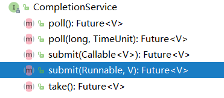

# CompletionService
:PROPERTIES:
:ID: dn-java-thread-completionservice
:END:

## CompletionService使用

=Callable+Future=虽然可以实现多个task并行执行，但是如果遇到前面的task执行较慢时需要阻塞等待前面的task执行完后面task才能取得结果。而=CompletionService=的主要功能就是一边生成任务,一边获取任务的返回值。让两件事分开执行,任务之间不会互相阻塞，可以实现先执行完的先取结果，不再依赖任务顺序了。



=CompletionService=内部通过阻塞队列+=FutureTask=，实现了任务先完成可优先获取到，即结果按照完成先后顺序排序，内部有一个先进先出的阻塞队列，用于保存已经执行完成的Future，通过调用它的=take()=或=poll()=可以获取到一个已经执行完成的=Future=，进而通过调用=Future=接口实现类的get方法获取最终的结果

### 使用案例分析
#### 电商询价
*直接=Future=方式*

向不同电商平台询价，并保存价格，采用=ThreadPoolExecutor+Future=的方案：异步执行询价然后再保存

``` java
//    创建线程池 
ExecutorService    executor = Executors.newFixedThreadPool(2); 
//    异步向电商S1询价 
Future<Integer>    f1 = executor.submit(()->getPriceByS1()); 
//    异步向电商S2询价 
Future<Integer>    f2=    executor.submit(()->getPriceByS2());             
//    获取电商S1报价并异步保存 
executor.execute(()->save(f1.get()));        
//    获取电商S2报价并异步保存 
executor.execute(()->save(f2.get())   
```

如果获取电商S1报价的耗时很长，那么即便获取电商S2报价的耗时很短，也无法让保存S2报价的操作先执行，因为这个主线程都阻塞在了=f1.get()=操作上。

*=CompletionService=方式*

使用=CompletionService=实现先获取的报价先保存到数据库

``` java
//创建线程池
ExecutorService executor = Executors.newFixedThreadPool(10);
//创建CompletionService
CompletionService<Integer> cs = new ExecutorCompletionService<>(executor);
//异步向电商S1询价
cs.submit(() -> getPriceByS1());
//异步向电商S2询价
cs.submit(() -> getPriceByS2());
//将询价结果异步保存到数据库
for (int i = 0; i < 2; i++) {
    Integer r = cs.take().get();
    executor.execute(() -> save(r));
}
```

#### Dobbo的Forking Cluter场景

=Dubbo=中有一种叫做=Forking=的集群模式，这种集群模式下，*支持并行地调用多个服务实例，只要有一个成功就返回结果*。

``` java
geocoder(addr) {
    //并行执行以下3个查询服务， 
    r1=geocoderByS1(addr);
    r2=geocoderByS2(addr);
    r3=geocoderByS3(addr);
    //只要r1,r2,r3有一个返回
    //则返回
    return r1|r2|r3;
}
```

通过=CompletionService=来实现这种=Forking=集群模式

``` java
// 创建线程池
ExecutorService executor = Executors.newFixedThreadPool(3);
// 创建CompletionService
CompletionService<Integer> cs = new ExecutorCompletionService<>(executor);
// 用于保存Future对象
List<Future<Integer>> futures = new ArrayList<>(3);
//提交异步任务，并保存future到futures 
futures.add(cs.submit(()->geocoderByS1()));
futures.add(cs.submit(()->geocoderByS2()));
futures.add(cs.submit(()->geocoderByS3()));
// 获取最快返回的任务执行结果
Integer r = 0;
try {
  // 只要有一个成功返回，则break
  for (int i = 0; i < 3; ++i) {
    r = cs.take().get();
    //简单地通过判空来检查是否成功返回
    if (r != null) {
      break;
    }
  }
} finally {
  //取消所有任务
  for(Future<Integer> f : futures)
    f.cancel(true);
}
// 返回结果
return r;
```

*应用场景总结*

- 当需要批量提交异步任务的时候建议使用=CompletionService=。=CompletionService=将线程池=Executor=和阻塞队列=BlockingQueue=的功能融合在了一起，能够让批量异步任务的管理更简单。
- =CompletionService=能够让异步任务的执行结果有序化。先执行完的先进入阻塞队列，利用这个特性，你可以轻松实现后续处理的有序性，避免无谓的等待，同时还可以快速实现诸如=Forking Cluster=这样的需求。
- 线程池隔离。=CompletionService=支持自己创建线程池，这种隔离性能避免几个特别耗时的任务拖垮整个应用的风险。

## 三、源码分析
### 构造方法
=CompletionService=只是一个接口，它定义了一套提交任务和获取结果的方法，而它唯一的实现类=ExecutorCompletionService=来实现了这些方法，该类构造如下：

``` java
public class ExecutorCompletionService<V> implements CompletionService<V> {
    // 执行任务的线程池
    private final Executor executor;
    private final AbstractExecutorService aes;
    // 任务完成会记录在该队列中
    private final BlockingQueue<Future<V>> completionQueue;
}
```

=ExecutorCompletionService=提供了两个构造方法，其中线程池是一定要有的参数，任务完成的记录队列默认使用的是=LinkedBlockingQueue=

``` java
public ExecutorCompletionService(Executor executor) {
    if (executor == null)
        throw new NullPointerException();
    this.executor = executor;
    this.aes = (executor instanceof AbstractExecutorService) ?
        (AbstractExecutorService) executor : null;
    this.completionQueue = new LinkedBlockingQueue<Future<V>>();
}

public ExecutorCompletionService(Executor executor,
                                 BlockingQueue<Future<V>> completionQueue) {
    if (executor == null || completionQueue == null)
        throw new NullPointerException();
    this.executor = executor;
    this.aes = (executor instanceof AbstractExecutorService) ?
        (AbstractExecutorService) executor : null;
    this.completionQueue = completionQueue;
}
```

### 任务执行与结果记录

提供了两个任务提交的方法，可以传=Callable=和=Runnable=类型的参数，这内部都会将其转换为=RunnableFutuer=实例，然后再封装成=QueueingFuture=实例作为任务来执行

``` java
public Future<V> submit(Callable<V> task) {
    if (task == null) throw new NullPointerException();
    RunnableFuture<V> f = newTaskFor(task);
    executor.execute(new QueueingFuture(f));
    return f;
}

public Future<V> submit(Runnable task, V result) {
    if (task == null) throw new NullPointerException();
    RunnableFuture<V> f = newTaskFor(task, result);
    executor.execute(new QueueingFuture(f));
    return f;
}
```

#### 封装RunnableFuture
不论=aes=是否为null，它们最终调用的都是=FutureTask=的构造方法

``` java
private RunnableFuture<V> newTaskFor(Callable<V> task) {
    if (aes == null)
        return new FutureTask<V>(task);
    else
        return aes.newTaskFor(task);
}

private RunnableFuture<V> newTaskFor(Runnable task, V result) {
    if (aes == null)
        return new FutureTask<V>(task, result);
    else
        return aes.newTaskFor(task, result);
}

protected <T> RunnableFuture<T> newTaskFor(Callable<T> callable) {
    return new FutureTask<T>(callable);
}

protected <T> RunnableFuture<T> newTaskFor(Runnable runnable, T value) {
    return new FutureTask<T>(runnable, value);
}
```

在前面的已经看过=FutureTask=的结构，它的任务是使用=Callable=实例表示的，所以对于=Runnable=类型的任务，会将其封装成一个=Callable=类型任务

``` java
public FutureTask(Callable<V> callable) {
    if (callable == null)
        throw new NullPointerException();
    this.callable = callable;
    this.state = NEW;       // ensure visibility of callable
}

public FutureTask(Runnable runnable, V result) {
    // 线程池静态方法,将runnable封装成一个callable
    this.callable = Executors.callable(runnable, result);
    this.state = NEW;       // ensure visibility of callable
}

public static <T> Callable<T> callable(Runnable task, T result) {
    if (task == null)
        throw new NullPointerException();
    // 构造一个适配对象
    return new RunnableAdapter<T>(task, result);
}

// 继承了Callble,内部存储Runnablle,调用call方法时,内部调用runnable的run方法
static final class RunnableAdapter<T> implements Callable<T> {
    final Runnable task;
    final T result;
    RunnableAdapter(Runnable task, T result) {
        this.task = task;
        this.result = result;
    }
    public T call() {
        task.run();
        return result;
    }
}
```

#### 任务提交
=QueueingFuture=是=ExecutorCompletionService=的内部类，其实现了=FutureTask=接口，当任务执行时，会去调用=FutureTask=的=run()=

``` java
private class QueueingFuture extends FutureTask<Void> {
    QueueingFuture(RunnableFuture<V> task) {
        super(task, null);
        this.task = task;
    }
    protected void done() { completionQueue.add(task); }
    private final Future<V> task;
}
```

下面是=FutureTask=的=run()=

``` java
public void run() {
    // 任务已经被执行,直接退出
    if (state != NEW ||
        !UNSAFE.compareAndSwapObject(this, runnerOffset,
                                     null, Thread.currentThread()))
        return;
    try {
        Callable<V> c = callable;
        if (c != null && state == NEW) {
            V result;
            boolean ran;
            try {
                // 执行任务
                result = c.call();
                ran = true;
            } catch (Throwable ex) {
                result = null;
                ran = false;
                // 记录异常
                setException(ex);
            }
            // 任务执行成功,则记录返回结果
            if (ran)
                set(result);
        }
    } finally {
        // runner must be non-null until state is settled to
        // prevent concurrent calls to run()
        runner = null;
        // state must be re-read after nulling runner to prevent
        // leaked interrupts
        int s = state;
        if (s >= INTERRUPTING)
            handlePossibleCancellationInterrupt(s);
    }
}
```

在任务执行成功，记录返回记录结果的时候，会调用=finishCompletion()=去唤醒所有阻塞的线程并调用=done()=方法

``` java
protected void set(V v) {
    if (UNSAFE.compareAndSwapInt(this, stateOffset, NEW, COMPLETING)) {
        outcome = v;
        UNSAFE.putOrderedInt(this, stateOffset, NORMAL); // final state
        finishCompletion();
    }
}

private void finishCompletion() {
    // assert state > COMPLETING;
    for (WaitNode q; (q = waiters) != null;) {
        if (UNSAFE.compareAndSwapObject(this, waitersOffset, q, null)) {
            // 唤醒后面所有等待的线程
            for (;;) {
                Thread t = q.thread;
                if (t != null) {
                    q.thread = null;
                    LockSupport.unpark(t);
                }
                WaitNode next = q.next;
                if (next == null)
                    break;
                q.next = null; // unlink to help gc
                q = next;
            }
            break;
        }
    }

    done();
    // 任务执行完了,将其置为null
    callable = null;        // to reduce footprint
}
```

而=QueueingFuture=内部类就实现了=done()=方法，它将执行完的=FutureTask=放入到阻塞队列中，当调用=take()=方法时就可以取到任务的执行结果，如果任务都还没有执行完，就阻塞。
