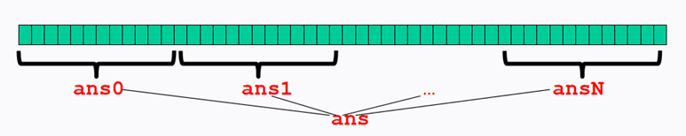
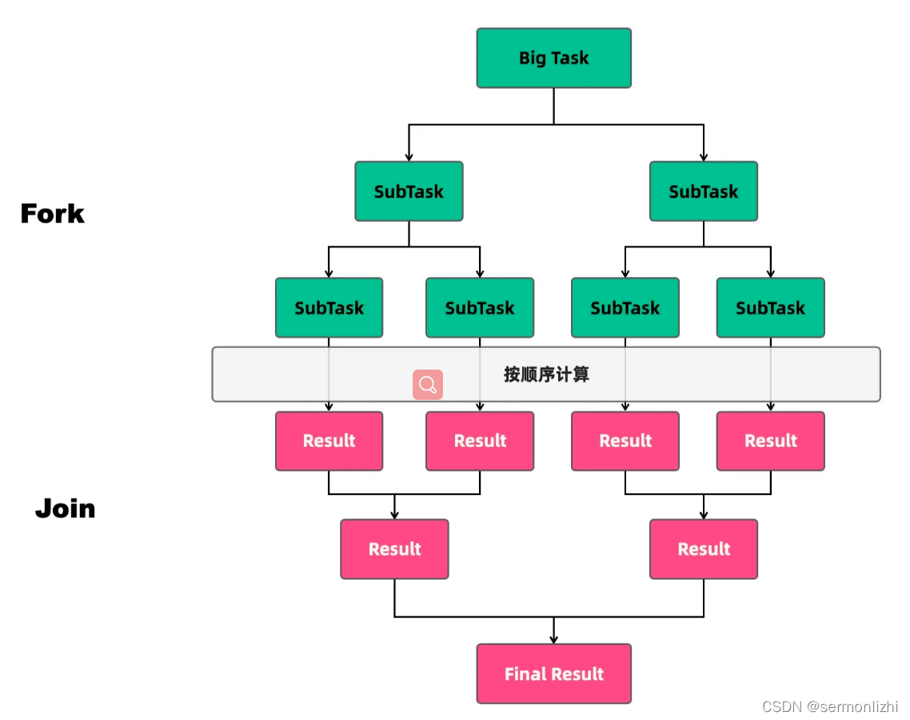
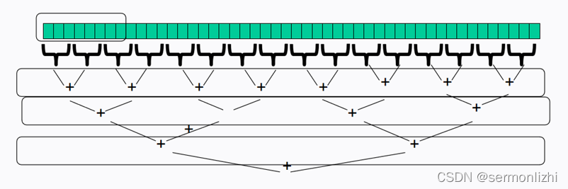
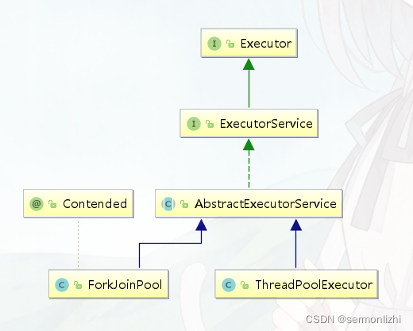
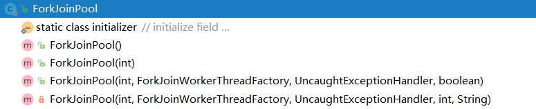
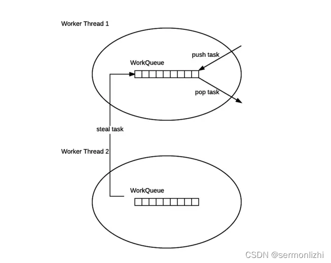
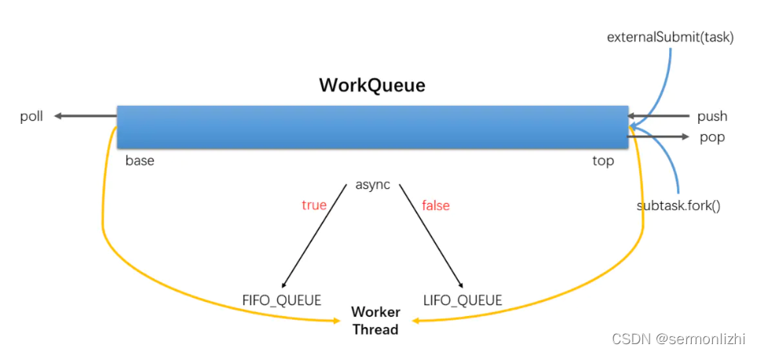
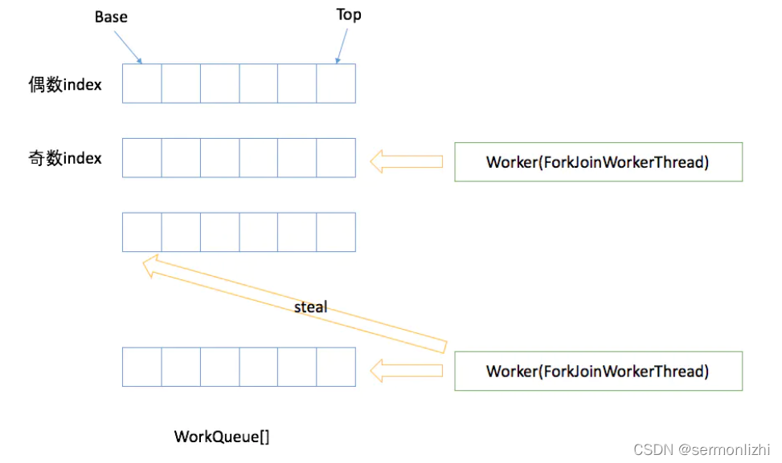
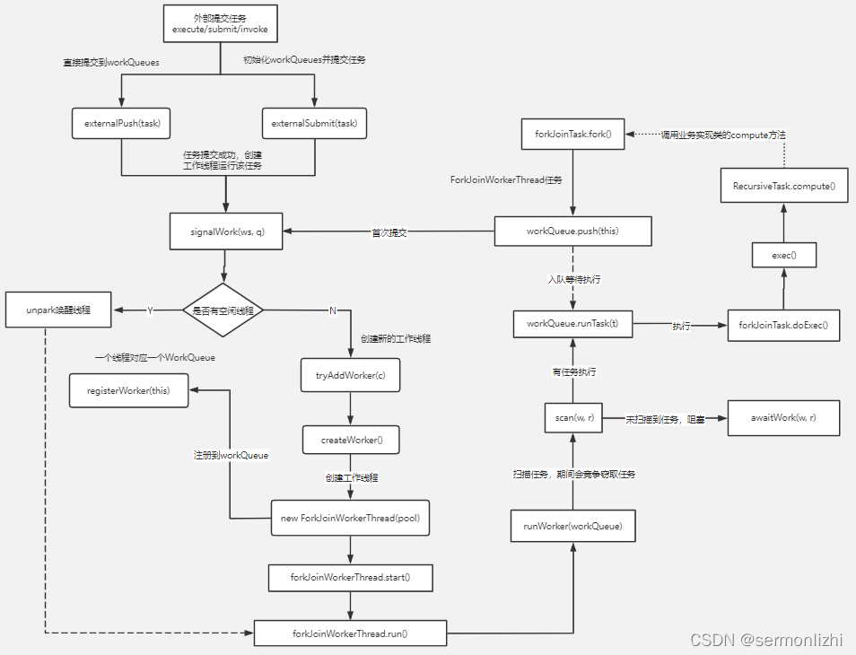

# Fork/Join
## 一、如何高效利用CPU
在介绍Fork/Join框架之前，思考一个问题，在多线程的情况下，如何才能高效的利用CPU，以常用的线程池为例，线程池的线程数设置多少合适？

通常调整线程池中的线程数量其核心目的就是为了能够充分的利用CPU和内存资源，从而最大限度的提高程序的性能。在实际工作中，我们可能会根据任务类型的不同而采取不同的策略。按照一个任务执行过程中使用CPU的时间和任务总耗时的比例，可以将任务分为两种：*CPU密集型任务*和*IO密集型任务*

### 1.1 任务类型
#### 1.1.1 CPU密集型任务
=CPU密集型任务=也称作计算密集型任务，比如加解密、压缩、计算等一系列需要*大量消耗CPU资源的任务*。对*于这样的任务线程池最佳的线程数可以设置为CPU核心数的1~2倍*，如果设置过多的线程数，反而起不到很好的效果。假设对于一个计算密集型任务，设置的线程为CPU核心数的2倍以上，计算任务会占用大量的CPU资源，这时CPU的每个核心都处于满负荷工作中，因为常用操作系统的CPU调度基本都是采用时间片轮转，这样导致如果设置的线程过多，每个线程都要去抢夺CPU时间片来执行任务，造成大量不必要的线程上下文切换。此时线程数的增加并没有提高程序的性能，反而使程序性能下降

#### 1.1.2 IO密集型任务
=IO密集型任务=，比如数据库、文件的读写，网络通信等任务，这种任务一般由设备控制器来完成，并不会特别消耗CPU资源。对于这种任务，线程池的线程数一般会大于CPU核心数很多倍，因为IO的读写速度要比CPU慢好几个量级，如果设置的线程数较少，就会导致有些CPU核心处于空闲状态，等待IO线程完成磁盘或网络的读写工作。如果设置更多的线程数，当这些IO线程不需要CPU时，其他线程就就可以获取CPU的执行权，当IO线程完成文件读写工作后再处于就绪状态，等待CPU调度，这样线程之间互不影响，也可以进一步提高CPU的利用率。

《Java并发编程实战》的作者Brain Goetz推荐了一种计算线程数的方法：

#+begin_example
线程数 = CPU核心数 * (1 + 平均等待时间/平均工作时间 )
#+end_example

从上面的公式可以看出，对于CPU密集型任务，它的等待时间远小于它的工作时间，所以线程数更接近CPU核心数；而对于IO密集型任务，平均等待时间又要比工作时间大很多，线程数一般是CPU核心数的好几倍。

如果想要设置更准确的线程数时，可以进行压测，通过监控JVM的线程情况以及CPU的负载情况，根据实际情况来设置线程数，可以更加合理充分利用资源。

### 1.2 分治思想
思考：如何利用多核CPU的性能，计算一个非常大的数组中所有整数的和？

- 利用单线程相加，=foreach=直接搞定

- 利用多线程，将数组分成多段，每个线程计算独立的一段，然后将结果进行汇总

  

#### 分治算法
分支算法的基本思想是*将一个规模为N的问题分解为K个规模较小的子问题，这些子问题相互独立且与原问题性质相同。求出子问题的解，就可以得到原问题的解*。

分治算法的步骤如下：

- 分解：将要解决的问题划分为若干规模较小的同类问题
- 求解：当子问题划分地足够小时，就可以用简单的方式求解
- 合并：按照原有问题的要求，将子问题的解逐层合并成最后的解



在分治算法中，子问题是相互独立的，因此通常=采用递归算法来求解子问题=



#### 应用场景
分治思想在很多领域都有广泛的应用，例如算法领域有分治算法（归并排序、快速排序都属于分治算法，二分法查找也是一种分治算法）；大数据领域知名的计算框架=MapReduce=背后的思想也是分治。分治这种任务模型非常普遍，Java
并发包里提供了一种叫做 Fork/Join
的并行计算框架，就是用来支持分治这种任务模型的。

## 二、Fork/Join框架介绍
### 2.1 基本概述
在传统的线程池ThreadPoolExecutor中，其存在两个明显的缺点：一是无法对大任务进行拆分，对某个任务只能由单线程执行；二是工作线程从任务队列中获取任务时存在竞争情况。这两点都会影响任务的执行效率。为了解决传统线程池的缺陷，Java7中引入了Fork/Join框架，并在Java8中得到广泛应用。

=Fork/Join=框架应用的核心是=ForkJoinPool=，它是对=AbstractExecutorService=类的扩展。*=ForkJoin=允许其他线程向它提交任务，并根据设定将这些任务拆分为粒度更细的子任务，这些子任务将由=ForkJoinPool=内部的工作线程来执行，并且内部的工作线程之间彼此窃取之间的任务*。



ForkJoinPool*最适合计算密集型任务*，而且最好是非阻塞任务。*ForkJoinPool是ThreadPoolExecutor线程池的一种补充，是对计算密集型场景的加强*。

根据经验和实验，*任务总数、单任务执行耗时以及并行数都会影响到Fork/Join的性能*。当使用=ForkJoin=框架时，需要谨慎评估这三个指标。

### 2.2 ForkJoinPool
#### 2.2.1 基本结构
下面列举=ForkJoinPool=中的部分参数，可以看到有一个=WorkQueue=类型的数组，这个数组就是存放每个线程以及给该线程分配的任务

``` java
@sun.misc.Contended
public class ForkJoinPool extends AbstractExecutorService {
    volatile long ctl;                   // main pool control
    volatile int runState;               // lockable status
    final int config;                    // parallelism, mode
    int indexSeed;                       // to generate worker index
    volatile WorkQueue[] workQueues;     // main registry
    final ForkJoinWorkerThreadFactory factory;
    final UncaughtExceptionHandler ueh;  // per-worker UEH
    final String workerNamePrefix;       // to create worker name string
}
```

下面是=WorkQueue=的结构，主要记录工作线程以及为工作线程分配的任务

``` java
@sun.misc.Contended
static final class WorkQueue {
    // Instance fields
    volatile int scanState;    // versioned, <0: inactive; odd:scanning
    int stackPred;             // pool stack (ctl) predecessor
    // 窃取任务的线程数
    int nsteals;               // number of steals
    int hint;                  // randomization and stealer index hint
    int config;                // pool index and mode
    volatile int qlock;        // 1: locked, < 0: terminate; else 0
    // 记录任务数组头尾索引,任务窃取时会用到
    volatile int base;         // index of next slot for poll
    int top;                   // index of next slot for push
    // 任务数组
    ForkJoinTask<?>[] array;   // the elements (initially unallocated)
    // 线程所在的线程池
    final ForkJoinPool pool;   // the containing pool (may be null)
    final ForkJoinWorkerThread owner; // owning thread or null if shared
    volatile Thread parker;    // == owner during call to park; else null
    volatile ForkJoinTask<?> currentJoin;  // task being joined in awaitJoin
    volatile ForkJoinTask<?> currentSteal; // mainly used by helpStealer
}
```

*注：上面两个类上面都加了=@sun.misc.Contended=注解，这是为了填充缓冲行，解决缓冲行伪共享的问题*

#### 2.2.2 构造方法
=Fork/Join=计算框架主要包含两部分内容：*分治任务的线程池=ForkJoinPool=和分治任务=ForkJoinTask=*

=ForkJoinTask=与=Runnable=一样，都是线程池执行的任务

=ForkJoinPool=是用于执行=ForkJoinTask=任务的线程池，内存存储不在采用=Worker+Queue=的组合模式，而是采用一个队列数组=WorkerQueue=，每个线程单独存储任务，线程之间可以相互窃取任务，所有线程都可以被充分使用。单独存储的另外一个好处就是每个线程获取执行任务时，不需要进行阻塞，进一步提高线程池的效率。

=ForkJoinPool=对外提供了以下四个构造方法，下图中最后一个构造方法是=Private=类型的



=ForkJoinPool=中有四个核心参数，用于控制线程池的*并行数、工作线程的创建(线程工厂)、异常处理和模式指定(存储模式)*。各个参数的含义如下：

- *(int) parallelism*：指定并行数。=ForkJoinPool=根据这个参数来决定工作线程的数量。默认使用CPU核心的逻辑核数，最大不会超过=ox7fff=

  ``` java
  static final int MAX_CAP = 0x7fff;

  public ForkJoinPool() {
      this(Math.min(MAX_CAP, Runtime.getRuntime().availableProcessors()),
           defaultForkJoinWorkerThreadFactory, null, false);
  }
  ```

- *(ForkJoinWorkerThreadFactory) factory*：=ForkJoinPool=在创建线程时，会通过=factory=来创建。但需要注意这里使用的是=ForkJoinWorkerThreadFactory=而不是=ThreadFactory=。默认使用=defaultForkJoinWorkerThreadFactory=

- *(UncaughtExceptionHandler) handler*：指定异常处理器，当任务在运行时出错时，将有设定的处理器处理

- *(boolean) asyncMode*：设置队列的工作模式=asyncMode ? FIFO_QUEUE : LIFO_QUEUE=，当为true时，采用先进先出的队列，为false则采用后进先出的队列，默认使用后者。这样可以利用CPU缓存提高性能(任务进来在CPU缓存中，如果此时有线程可以执行任务，就不要再重新加载进缓存了)。

  ``` java
  public ForkJoinPool(int parallelism,
                      ForkJoinWorkerThreadFactory factory,
                      UncaughtExceptionHandler handler,
                      boolean asyncMode) {
      this(checkParallelism(parallelism),
           checkFactory(factory),
           handler,
           asyncMode ? FIFO_QUEUE : LIFO_QUEUE,
           "ForkJoinPool-" + nextPoolId() + "-worker-");
      checkPermission();
  }
  ```

#### 2.2.3 任务提交
=ForkJoinPool=的核心任务之一就是提交任务，按照返回值和任务类型的不同，提交任务的方式可以分为三种：

|                | 返回值       | 方法                                                                                                                                |
|----------------+--------------+-------------------------------------------------------------------------------------------------------------------------------------|
| 异步执行       | Void         | =execute=(=ForkJoinTask<?>= task) =execute=(=Runnable= task)                                                                        |
| 等待获取结果   | T            | =invoke=(=ForkJoinTask<T>= task)                                                                                                    |
| 获取Future结果 | ForkJoinTask | =submit=(=ForkJoinTask<T>= task) =submit=(=Callable<T>= task) =submit=(=Runnable<T>= task) =submit=(=Runnable<T>= task，=T= result) |

- =execute()=在提交任务之后，不会返回结果。=ForkJoinPool=不仅允许提交=ForkJoinTask=类型的任务，还允许提交=Runnable=任务

  #+begin_example
  执行Runnable类型任务时，将会转换为ForkJoinTask类型。由于任务是不可切分的，所以这类任务无法获得任务拆分这方面的效益，不过仍然可以获得任务窃取带来的好处和性能提升。
  #+end_example

- =invoke()=接收=ForkJoinTask=类型的任务，并在任务执行接收后，返回泛型结果。如果提交的任务时是=null=，将会抛出空指针异常

- =submit()=方法支持三种类型的任务提交：=ForkJoinTask=、=Runnable=、=Callable=。提交任务后，返回=ForkJoinTask=类型的结果。如果提交的任务是=null=，同样抛出空指针异常，并且当任务不能按照计划执行时，将抛出任务拒绝异常

虽然=ForkJoinPool=支持多种类型的任务，但其实在这些方法的内部，都会把这些任务适配成对应的=ForkJoinTask=类型的任务，以=submit()=支持的三种任务类型为例，看一下具体的源码：

=ForkJoinTask=内部提供了这些任务类型的内部类，可以将这些任务封装成=ForkJoinTask=

``` java
public <T> ForkJoinTask<T> submit(Callable<T> task) {
    ForkJoinTask<T> job = new ForkJoinTask.AdaptedCallable<T>(task);
    externalPush(job);
    return job;
}

public <T> ForkJoinTask<T> submit(Runnable task, T result) {
    ForkJoinTask<T> job = new ForkJoinTask.AdaptedRunnable<T>(task, result);
    externalPush(job);
    return job;
}

public ForkJoinTask<?> submit(Runnable task) {
    if (task == null)
        throw new NullPointerException();
    ForkJoinTask<?> job;
    if (task instanceof ForkJoinTask<?>) // avoid re-wrap
        job = (ForkJoinTask<?>) task;
    else
        job = new ForkJoinTask.AdaptedRunnableAction(task);
    externalPush(job);
    return job;
}
```

以=ForkJoinTask.AdaptedCallable=和=AdaptedRunnableAction=为例，这些适配类都继承自=ForkJoinTask=，然后在内部封装了具体的任务，当调用=ForkJoinTask=的=exec()=方法时，该方法内部就回去调用具体任务自己的方法，=Callable=类型调用=call()=方法，=Runnable=类型调用=run()=方法

``` java
static final class AdaptedCallable<T> extends ForkJoinTask<T>
    implements RunnableFuture<T> {
    // 真正的任务类型
    final Callable<? extends T> callable;
    T result;
    AdaptedCallable(Callable<? extends T> callable) {
        if (callable == null) throw new NullPointerException();
        this.callable = callable;
    }
    public final T getRawResult() { return result; }
    public final void setRawResult(T v) { result = v; }
    public final boolean exec() {
        try {
            // 调用任务自己的方法
            result = callable.call();
            return true;
        } catch (Error err) {
            throw err;
        } catch (RuntimeException rex) {
            throw rex;
        } catch (Exception ex) {
            throw new RuntimeException(ex);
        }
    }
    public final void run() { invoke(); }
    private static final long serialVersionUID = 2838392045355241008L;
}

static final class AdaptedRunnableAction extends ForkJoinTask<Void>
    implements RunnableFuture<Void> {
    // 具体的任务类型
    final Runnable runnable;
    AdaptedRunnableAction(Runnable runnable) {
        if (runnable == null) throw new NullPointerException();
        this.runnable = runnable;
    }
    public final Void getRawResult() { return null; }
    public final void setRawResult(Void v) { }
    public final boolean exec() { 
        // 调用任务方法
        runnable.run(); 
        return true; 
    }
    public final void run() { invoke(); }
    private static final long serialVersionUID = 5232453952276885070L;
}
```

### 2.3 ForkJoinTask
*=ForkJoinTask=是=ForkJoinPool=的核心，它是任务的实际载体，定义了任务执行时的具体逻辑和拆分逻辑*。

=ForkJoinTask=继承自=Future=接口，可以将其看成是=Future=轻量级的实现，=Future=表示异步计算的结果，定义了一些方法用于检查计算是否完成、获取计算结果以及取消任务的方法。

=ForkJoinTask=是一个抽象类，它提供了很多方法，但核心的是=fork()=和=join()=方法，承载着主要的任务协调工作，=fork()=用于任务提交，=join()=用于结果获取

=fork()=方法用于向当前任务所运行的线程池中提交任务。如果当前线程是=ForkJoinWorkerThread=类型，将会放入该线程的工作队列，否则放入=common=线程池的工作队列中。

``` java
public final ForkJoinTask<V> fork() {
    Thread t;
    if ((t = Thread.currentThread()) instanceof ForkJoinWorkerThread)
        // 添加到线程对应的任务数组
        ((ForkJoinWorkerThread)t).workQueue.push(this);
    else
        // 添加到通用线程池的工作队列中
        ForkJoinPool.common.externalPush(this);
    return this;
}
```

=join()=方法用于获取任务的执行结果。调用=join()=时，将阻塞当前线程直到对应的子任务完成运行并返回结果。

``` java
public final V join() {
    int s;
    if ((s = doJoin() & DONE_MASK) != NORMAL)
        reportException(s);
    return getRawResult();
}
```

通常情况下不需要直接继承ForkJoinTask类，而只需要继承它的子类，Fork/Join框架提供了以下三个子类：

- *RecursiveAction*：用于递归执行但不需要返回结果的任务。
- *RecursiveTask* ：用于递归执行需要返回结果的任务。
- *CountedCompleter* ：在任务完成执行后会触发执行一个自定义的钩子函数

*注：这三个抽象类中都提供了=compute()=抽象方法，继承类要去实现这个方法，该方法就是任务执行的具体逻辑*

## 三、应用场景
下面以计算一个数组元素和为例，该数组拥有一亿个整数元素，通过=ForkJoinPool=来进行计算

### 3.1 单线程计算
先定义任务类，数组求和需要有返回值，所以任务类继承=RecursiveTask=

``` java
public class LongSum extends RecursiveTask<Long> {
    // 任务拆分最小阈值
    static final int SEQUENTIAL_THRESHOLD = 10000000;

    // 记录每个任务中元素的起始和终止位置
    // 如果任务中的元素个数超过了拆分的最小阈值就会进一步拆分
    // 直到被拆成最小的任务
    int low;
    int high;
    int[] array;

    LongSum(int[] arr, int lo, int hi) {
        array = arr;
        low = lo;
        high = hi;
    }

    @Override
    protected Long compute() {

        //当任务拆分到小于等于阀值时开始求和
        if (high - low <= SEQUENTIAL_THRESHOLD) {

            long sum = 0;
            for (int i = low; i < high; ++i) {
                sum += array[i];
            }
            return sum;
        } else {  // 任务过大继续拆分
            int mid = low + (high - low) / 2;
            LongSum left = new LongSum(array, low, mid);
            LongSum right = new LongSum(array, mid, high);
            // 提交任务
            left.fork();
            right.fork();
            //获取任务的执行结果,将阻塞当前线程直到对应的子任务完成运行并返回结果
            long rightAns = right.compute();
            long leftAns = left.join();
            return leftAns + rightAns;
        }
    }
}
```

构建数组，比较使用=Foreach=、=ForkJoinTask=和并行流的计算耗时

``` java
static long calcSum;

public static void main(String[] args) throws Exception {
    //准备数组
    int[] array = Utils.buildRandomIntArray(100000000);

    Instant now = Instant.now();
    // 单线程计算数组总和
    calcSum = seqSum(array);
    System.out.println("seq sum=" + calcSum);
    System.out.println("执行时间："+ Duration.between(now,Instant.now()).toMillis());

    //递归任务
    LongSum ls = new LongSum(array, 0, array.length);
    // 构建ForkJoinPool
    ForkJoinPool fjp  = new ForkJoinPool();

    now = Instant.now();
    //提交任务,ForkJoin计算数组总和
    ForkJoinTask<Long> result = fjp.submit(ls);
    System.out.println("forkjoin sum=" + result.get());
    System.out.println("执行时间："+ Duration.between(now,Instant.now()).toMillis());

    fjp.shutdown();

    now = Instant.now();
    //并行流计算数组总和
    Long sum = (Long) IntStream.of(array).asLongStream().parallel().sum();
    System.out.println("IntStream sum="+sum);
    System.out.println("执行时间："+ Duration.between(now,Instant.now()).toMillis());

}


static long seqSum(int[] array) {
    long sum = 0;
    for (int i = 0; i < array.length; ++i) {
        sum += array[i];
    }
    return sum;
}

// 生产一个指定容量的证整数数组
public class Utils {
    public static int[] buildRandomIntArray(final int size) {
        int[] arrayToCalculateSumOf = new int[size];
        Random generator = new Random();
        for (int i = 0; i < arrayToCalculateSumOf.length; i++) {
            arrayToCalculateSumOf[i] = generator.nextInt(1000);
        }
        return arrayToCalculateSumOf;
    }
}
```

上面三种方式执行的耗时结果如下：

``` java
seq sum=49949316541
执行时间：45
forkjoin sum=49949316541
执行时间：54
IntStream sum=49949316541
执行时间：125
```

### 3.2 多线程场景
同样还是上面的例子，将其拆分成多个任务，下面测试通过普通线程池和=ForkJoinPool=的性能差异

#### 3.2.1 ThreadPoolExecutor
定义一个任务类，普通线程池就让任务实现=Callable=接口

``` java
public static class RecursiveSumTask implements Callable<Long> {
    //拆分的粒度
    public static final int SEQUENTIAL_CUTOFF = 100000;
    int lo;
    int hi;
    int[] arr; // arguments
    ExecutorService executorService;

    RecursiveSumTask(ExecutorService executorService, int[] a, int l, int h) {
        this.executorService = executorService;
        this.arr = a;
        this.lo = l;
        this.hi = h;
    }

    @Override
    public Long call() throws Exception {
        System.out.format("%s range [%d-%d] begin to compute %n",
                          Thread.currentThread().getName(), lo, hi);
        long result = 0;
        //最小拆分的阈值
        if (hi - lo <= SEQUENTIAL_CUTOFF) {
            for (int i = lo; i < hi; i++) {
                result += arr[i];
            }
        } else {
            // 任务粒度过大时,就将其拆分为
            RecursiveSumTask left = new RecursiveSumTask(
                executorService, arr, lo, (hi + lo) / 2);
            RecursiveSumTask right = new RecursiveSumTask(
                executorService, arr, (hi + lo) / 2, hi);
            Future<Long> lr = executorService.submit(left);
            Future<Long> rr = executorService.submit(right);

            result = lr.get() + rr.get();
        }

        return result;
    }
}
```

创建线程池，并提交计算任务

``` java
public class SumRecursiveMT {
    public static long sum(int[] arr) throws Exception {

        //思考： 用 Executors.newFixedThreadPool可以吗？   定长线程的饥饿
        ExecutorService executorService = Executors.newCachedThreadPool();
        //ExecutorService executorService = Executors.newCachedThreadPool();
        //递归任务 求和
        RecursiveSumTask task = new RecursiveSumTask(executorService, arr, 0, arr.length);
        //返回结果
        long result = executorService.submit(task).get();

        executorService.shutdown();
        return result;
    }
}
```

*注：使用普通线程池时，这里面就有一个问题，上面使用例子使用的是=newCachedThreadPool=创建的线程池，它会为每个提交的任务创建一个线程，但是如果把线程池改为=Executors.newFixedThreadPool=时，如果任务的数量大于线程池的数量，就会导致后面拆分出来的子任务被放到任务队列里面，等待空闲线程来执行，而正在工作线程中执行的任务，它又依赖于子任务的计算结果才能继续往下执行，就形成了相互等待的场景，造成死锁。*

#### 3.2.2 ForkJoinPool
创建任务继承=RecursiveTask=类，=compute()=定义拆分逻辑

``` java
static class SumTask extends RecursiveTask<Long> {
    //拆分的粒度
    public static final int SEQUENTIAL_CUTOFF = 100000;
    int lo;
    int hi;
    int[] arr; // arguments

    SumTask(int [] arr,int lo,int hi){
        this.arr = arr;
        this.lo = lo;
        this.hi = hi;
    }

    @Override
    protected Long compute() {
        long result = 0;
        //最小拆分的阈值
        if (hi - lo <= SEQUENTIAL_CUTOFF) {
            for (int i = lo; i < hi; i++) {
                result += arr[i];
            }
        } else {
            SumTask left = new SumTask(arr, lo, (hi + lo) / 2);
            SumTask right = new SumTask(arr, (hi + lo) / 2, hi);
            ForkJoinTask<Long> lr = left.fork();
            ForkJoinTask<Long> rr = right.fork();

            result = lr.join() + rr.join();
        }

        return result;
    }
}

public static long sum(int [] arr) throws Exception{
    ForkJoinPool forkJoinPool = new ForkJoinPool();
    //递归任务 求和
    SumTask task = new SumTask(arr, 0, arr.length);
    //返回结果
    long result = forkJoinPool.submit(task).get();

    forkJoinPool.shutdown();
    return result;
}
```

然后通过测试比较这两种线程池的执行效率

``` java
public static void main(String[] args) throws Exception {
    //准备数组
    int[] arr = Utils.buildRandomIntArray(100000000);
    System.out.printf("The array length is: %d\n", arr.length);
    Instant now = Instant.now();
    //数组求和
    long result = sum(arr);
    System.out.println("执行时间："+ Duration.between(now,Instant.now()).toMillis());
    System.out.printf("The result is: %d\n", result);
}
```

控制台输出：

``` java
ThreadPoolExecutor sum:49954446424
执行时间：686
ForkJoinPool sum:49954446424
执行时间：75
```

*注：从上面测试的结果可以看出来，相比于普通线程，=ForkJoinTask=更利用执行这种可以拆分的任务*

## 四、源码分析
### 4.1 工作原理概述
上面介绍了=ForkJoinPool=的基本内部构造，以及=WorkQueue=的内部构造，已经直到=ForkJoinPool=内部有多个工作队列，当通过=invoke()=或=submit()=提交任务时，=ForkJoinPool=根据一定的规则将任务添加到一个工作队列中，如果任务在执行过程中还会创建子任务时，那么子任务会被提交到工作线程对应的工作队列中。

=ForkJoinPool=的每个工作线程都维护着一个工作队列（=WorkQueue=），这是一个双端队列（=Deque=），实际存储是通过数组来实现的，里面存放的对象是任务（=ForkJoinTask=）。

每个工作线程在运行中产生新的任务时(通常是调用=fork()=)，会放入工作队列的=top=，并且工作线程在处理自己的工作队列时，使用的是=LIFO=方式，也就是说每次从=top=取出任务来执行。

每个工作线程在处理自己的工作队列同时，会尝试窃取一个任务，窃取的任务位于其他线程的工作队列的=base=，也就是说工作线程在窃取其他工作线程的任务时，使用的是=FIFO=方式。

在遇到 join() 时，如果需要 join
的任务尚未完成，当前工作线程则会先处理其他任务，并等待其完成。

在既没有自己的任务，也没有可以窃取的任务时，工作线程进入休眠 。

#### 任务窃取
=ForkJoinPool=与=ThreadPoolExecutor=有个很大的不同之处在于，=ForkJoinPool=存在引入了*工作窃取设计*，它是其性能保证的关键之一。工作窃取，就是允许空闲线程从繁忙线程的双端队列中窃取任务。默认情况下，工作线程从它自己的双端队列的头部获取任务。但是，当自己的任务为空时，线程会从其他繁忙线程双端队列的尾部中获取任务。这种方法，最大限度地减少了线程竞争任务的可能性。

=ForkJoinPool=的大部分操作都发生在工作窃取队列（work-stealing queues ）
中，该队列由内部类=WorkQueue=实现。它是=Deques=的特殊形式，但仅支持三种操作方式：=push=、=pop=和=poll=（也称为窃取）。*在=ForkJoinPool=中，队列的读取有着严格的约束，push和pop仅能从其所属线程调用，而poll则可以从其他线程调用。*

工作窃取的运行流程如下图所示 ：



- 工作窃取算法的优点是充分利用线程进行并行计算，从尾部窃取任务减少了线程间的竞争;
- 工作窃取算法缺点是在某些情况下还是存在竞争，比如双端队列里只有一个任务时。并且消耗了更多的系统资源，比如创建多个线程和多个双端队列。

此外，这样的设计还有一种考虑。由于任务是可分割的，那队列中较旧的任务最有可能粒度较大，因为它们可能还没有被分割，而空闲的线程则相对更有“精力”来完成这些粒度较大的任务。

#### 工作队列WorkQueue
=WorkQueue= 是双向列表，用于任务的有序执行，如果
=WorkQueue=拥有自己的执行线程 ，线程默认将会从尾端选取任务用来执行
LIFO。

每个 =ForkJoinWorkThread= 都有属于自己的 WorkQueue，但不是每个
=WorkQueue=都有对应的 =ForkJoinWorkThread=。

没有 =ForkJoinWorkThread= 的 =WorkQueue=保存的是
=submission=，来自外部提交，在=WorkQueues[]=的下标是 *偶数位*。

工作队列原理图如下：



=ForkJoinWorkThread=是用于执行任务的线程，用于区别使用非
=ForkJoinWorkThread=线程提交=task=。启动一个该 Thread，会自动注册一个
=WorkQueue= 到 =Pool=，拥有 =Thread=的 =WorkQueue=只能出现在
=WorkQueues[]=的 *奇数位*。

=ForkJoinWorkThread=工作的结构图如下：



*偶数索引对应的=WorkQueue=没有对应的线程，它里面的任务都有线程窃取来执行*

接下来，通过源码来验证上面提到的工作原理

### 4.1 常用方法源码分析
下面以外部任务提交、内部任务提交以及获取执行结果三类方法为例，分别看一下=submit(ForkJoinTask<T> task)=、=fork()=和=join()=的源码实现

#### 4.1.1 外部任务提交
=execute()=、=invoke()=和=submit()=这三个线程池方法，都属于外部任务提交，其内部都是去调用=externalPush()=方法

``` java
public <T> ForkJoinTask<T> submit(ForkJoinTask<T> task) {
    if (task == null)
        throw new NullPointerException();
    externalPush(task);
    return task;
}
```

``` java
static final int SQMASK       = 0x007e;        // max 64 (even) slots

final void externalPush(ForkJoinTask<?> task) {
    WorkQueue[] ws; WorkQueue q; int m;
    // 根据当前线程计算出一个Hash值,用于后面计算WorkQueue的槽位
    int r = ThreadLocalRandom.getProbe();
    int rs = runState;
    // m&r&SQMASK这个公式是为了计算WorkQueue的槽位
    // SQMASK的最低位为0,这样运算的结果的就一定是偶数槽位
    // workQueues的容量是2的幂次方,m的值为容量减一,位运算中它的低位都是1
    // 如果workQueues不为空且对应的槽位有WorkQueue,才会进行下面的操作
    if ((ws = workQueues) != null && (m = (ws.length - 1)) >= 0 &&
        (q = ws[m & r & SQMASK]) != null && r != 0 && rs > 0 &&
        // 使用CAS对WorkQueue加锁保证线程安全
        U.compareAndSwapInt(q, QLOCK, 0, 1)) {
        ForkJoinTask<?>[] a; int am, n, s;
        if ((a = q.array) != null &&
            (am = a.length - 1) > (n = (s = q.top) - q.base)) {
            // 计算任务在WorkQueue的任务队列的槽位
            int j = ((am & s) << ASHIFT) + ABASE;
            // 直接通过CAS将任务添加到队列中
            U.putOrderedObject(a, j, task);
            U.putOrderedInt(q, QTOP, s + 1);
            // 释放锁
            U.putIntVolatile(q, QLOCK, 0);
            // 如果当前线程的任务队列中任务数小于2,就去唤醒或者创建一个线程
            if (n <= 1)
                signalWork(ws, q);
            return;
        }
        // 最后再通过CAS释放锁
        U.compareAndSwapInt(q, QLOCK, 1, 0);
    }
    // 该方法内部也是实现了上面的逻辑,只是还额外做了初始化的一些工作
    // 如果添加任务时,WorkQueue都还没有创建,那么就需要进行从创建和初始化等工作
    // 而这些工作都是在该方法中完成的
    externalSubmit(task);
}
```

*注：=externalSubmit()=和=externalPush()=具有相同的功能就是将任务添加到队列中去，=externalPush()=只不过是把=externalSubmit()=中的一部分逻辑也实现了一下而已。添加任务可以在=externalPush()=中完成就不会再去调用=externalSubmit()=*

下面再看一下核心的方法=externalSubmit()=，它代码比较难理解，只看核心的代码即可

``` java
private void externalSubmit(ForkJoinTask<?> task) {
    int r;                                    // initialize caller's probe
    // 计算当前线程的Hash值,用于计算WorkQueue的槽位
    if ((r = ThreadLocalRandom.getProbe()) == 0) {
        ThreadLocalRandom.localInit();
        r = ThreadLocalRandom.getProbe();
    }
    // 注意这里是自旋的,第一次进来是初始化WorkQueue数组
    for (;;) {
        WorkQueue[] ws; WorkQueue q; int rs, m, k;
        boolean move = false;
        if ((rs = runState) < 0) {
            tryTerminate(false, false);     // help terminate
            throw new RejectedExecutionException();
        }
        else if ((rs & STARTED) == 0 ||     // initialize
                 ((ws = workQueues) == null || (m = ws.length - 1) < 0)) {
            int ns = 0;
            rs = lockRunState();
            try {
                if ((rs & STARTED) == 0) {
                    U.compareAndSwapObject(this, STEALCOUNTER, null,
                                           new AtomicLong());
                    // 计算workQueues数组的容量，然后创建一个WorkQueue数组
                    // create workQueues array with size a power of two
                    int p = config & SMASK; // ensure at least 2 slots
                    int n = (p > 1) ? p - 1 : 1;
                    n |= n >>> 1; n |= n >>> 2;  n |= n >>> 4;
                    n |= n >>> 8; n |= n >>> 16; n = (n + 1) << 1;
                    workQueues = new WorkQueue[n];
                    ns = STARTED;
                }
            } finally {
                unlockRunState(rs, (rs & ~RSLOCK) | ns);
            }
        }
        // (r & m & SQMASK)计算结果一定是一个偶数
        else if ((q = ws[k = r & m & SQMASK]) != null) {
            // 第三次自旋才会进到这里面来,现在槽位的WorkQueue实例有了
            // 但任务还有添加到WorkQueue的任务队列中
            // 同externalPush方法中一样的逻辑,CAS加锁
            if (q.qlock == 0 && U.compareAndSwapInt(q, QLOCK, 0, 1)) {
                ForkJoinTask<?>[] a = q.array;
                int s = q.top;
                boolean submitted = false; // initial submission or resizing
                try {                      // locked version of push
                    if ((a != null && a.length > s + 1 - q.base) ||
                        // 可以对任务队列进行扩容,每次扩大一倍
                        (a = q.growArray()) != null) {
                        // 计算任务的槽位,然后CAS入队
                        int j = (((a.length - 1) & s) << ASHIFT) + ABASE;
                        U.putOrderedObject(a, j, task);
                        U.putOrderedInt(q, QTOP, s + 1);
                        submitted = true;
                    }
                } finally {
                    U.compareAndSwapInt(q, QLOCK, 1, 0);
                }
                // 任务入队成功了,这里就要去唤醒或创建一个工作线程来执行任务
                if (submitted) {
                    signalWork(ws, q);
                    return;
                }
            }
            move = true;                   // move on failure
        }
        else if (((rs = runState) & RSLOCK) == 0) { // create new queue
            // 第二次由于WorkQueue数组对应槽位为空就进到这里来了
            // 这里就去创建一个WorkQueue实例,注意构造方法的这个null
            // 由于这是一个外部任务,所以它是没有ForkJoinWorkerThread线程的
            // 它任务队列里面的任务只能靠其他线程窃取来执行
            q = new WorkQueue(this, null);
            q.hint = r;
            q.config = k | SHARED_QUEUE;
            q.scanState = INACTIVE;
            rs = lockRunState();           // publish index
            if (rs > 0 &&  (ws = workQueues) != null &&
                k < ws.length && ws[k] == null)
                // 填充WorkQueue数组的槽位
                ws[k] = q;                 // else terminated
            unlockRunState(rs, rs & ~RSLOCK);
        }
        else
            move = true;                   // move if busy
        if (move)
            r = ThreadLocalRandom.advanceProbe(r);
    }
}
```

下面看一下=signalWork()=方法，该方法内部会根据线程池状态唤醒或新创建一个工作线程

``` java
final void signalWork(WorkQueue[] ws, WorkQueue q) {
    long c; int sp, i; WorkQueue v; Thread p;
    while ((c = ctl) < 0L) {                       // too few active
        // 如果没有空闲线程,就去新建一个线程
        if ((sp = (int)c) == 0) {                  // no idle workers
            if ((c & ADD_WORKER) != 0L)            // too few workers
                tryAddWorker(c);
            break;
        }
        if (ws == null)                            // unstarted/terminated
            break;
        if (ws.length <= (i = sp & SMASK))         // terminated
            break;
        if ((v = ws[i]) == null)                   // terminating
            break;
        int vs = (sp + SS_SEQ) & ~INACTIVE;        // next scanState
        int d = sp - v.scanState;                  // screen CAS
        // 计算活跃线程数,唤醒阻塞的线程
        long nc = (UC_MASK & (c + AC_UNIT)) | (SP_MASK & v.stackPred);
        if (d == 0 && U.compareAndSwapLong(this, CTL, c, nc)) {
            v.scanState = vs;                      // activate v
            if ((p = v.parker) != null)
                U.unpark(p);
            break;
        }
        if (q != null && q.base == q.top)          // no more work
            break;
    }
}
```

添加工作线程

``` java
private void tryAddWorker(long c) {
    boolean add = false;
    do {
        long nc = ((AC_MASK & (c + AC_UNIT)) |
                   (TC_MASK & (c + TC_UNIT)));
        if (ctl == c) {
            int rs, stop;                 // check if terminating
            if ((stop = (rs = lockRunState()) & STOP) == 0)
                add = U.compareAndSwapLong(this, CTL, c, nc);
            unlockRunState(rs, rs & ~RSLOCK);
            if (stop != 0)
                break;
            if (add) {
                // 需要添加就创建一个工作线程
                createWorker();
                break;
            }
        }
    } while (((c = ctl) & ADD_WORKER) != 0L && (int)c == 0);
}

private boolean createWorker() {
    // 默认使用的是DefaultForkJoinWorkerThreadFactory
    ForkJoinWorkerThreadFactory fac = factory;
    Throwable ex = null;
    ForkJoinWorkerThread wt = null;
    try {
        // 通过线程工厂去创建一个线程,然后启动线程
        if (fac != null && (wt = fac.newThread(this)) != null) {
            // 启动线程之后,就会去调用ForkJoinWorkerThread的run()方法
            wt.start();
            return true;
        }
    } catch (Throwable rex) {
        ex = rex;
    }
    deregisterWorker(wt, ex);
    return false;
}

static final class DefaultForkJoinWorkerThreadFactory
    implements ForkJoinWorkerThreadFactory {
    public final ForkJoinWorkerThread newThread(ForkJoinPool pool) {
        return new ForkJoinWorkerThread(pool);
    }
}

// 在构造方法中,首先会指定该线程所在的线程池
// 然后将当前工作线程绑定到具体的WorkQueue中
protected ForkJoinWorkerThread(ForkJoinPool pool) {
    // Use a placeholder until a useful name can be set in registerWorker
    super("aForkJoinWorkerThread");
    this.pool = pool;
    this.workQueue = pool.registerWorker(this);
}
```

下面看=ForkJoinPool=将工作线程与=WorkQueue=进行绑定，绑定的过程就是重新创建一个具有=ForkJoinWorkerThread=线程的=WorkQueue=实例，但此时这个=WorkQueue=中并不会去添加任务

``` java
final WorkQueue registerWorker(ForkJoinWorkerThread wt) {
    UncaughtExceptionHandler handler;
    // 设置为守护线程
    wt.setDaemon(true);                           // configure thread
    if ((handler = ueh) != null)
        wt.setUncaughtExceptionHandler(handler);
    // 这里重现构建了一个WorkQueue,与之前创建的WorkQueue实例不同
    // 这个WorkQueue具有ForkJoinWorkerThread线程,可以执行自己队列的任务
    WorkQueue w = new WorkQueue(this, wt);
    int i = 0;                                    // assign a pool index
    int mode = config & MODE_MASK;
    int rs = lockRunState();
    try {
        WorkQueue[] ws; int n;                    // skip if no array
        if ((ws = workQueues) != null && (n = ws.length) > 0) {
            int s = indexSeed += SEED_INCREMENT;  // unlikely to collide
            int m = n - 1;
            // 计算WorkQueue的槽位,与1进行或运算,保证最低为是1,m为WorkQueue数组长度减一
            // m的最低位也是1,这样计算出来的槽位一定是奇数
            i = ((s << 1) | 1) & m;               // odd-numbered indices
            // 如果当前槽位已经有WorkQueue了,说明出现了冲突
            // 然后重新计算槽位直到槽位为null
            if (ws[i] != null) {                  // collision
                int probes = 0;                   // step by approx half n
                int step = (n <= 4) ? 2 : ((n >>> 1) & EVENMASK) + 2;
                while (ws[i = (i + step) & m] != null) {
                    // 如果所有槽位都被占用了,就进行扩容,容量为原来的2倍
                    if (++probes >= n) {
                        workQueues = ws = Arrays.copyOf(ws, n <<= 1);
                        m = n - 1;
                        probes = 0;
                    }
                }
            }
            w.hint = s;                           // use as random seed
            w.config = i | mode;
            // 记录线程扫描的槽位
            w.scanState = i;                      // publication fence
            // 填充槽位
            ws[i] = w;
        }
    } finally {
        unlockRunState(rs, rs & ~RSLOCK);
    }
    wt.setName(workerNamePrefix.concat(Integer.toString(i >>> 1)));
    return w;
}
```

再回到=createWorker()=方法，工作线程创建绑定完成之后，就启动了=start()=方法，对应也就去执行=ForkJoinWorkerThread=的=run()=方法

``` java
public void run() {
    // 只有在刚创建的时候才会去启动
    if (workQueue.array == null) { // only run once
        Throwable exception = null;
        try {
            // 这是一个方法,可以自行扩展
            onStart();
            // 由线程池方法来执行任务
            pool.runWorker(workQueue);
        } catch (Throwable ex) {
            exception = ex;
        } finally {
            try {
                onTermination(exception);
            } catch (Throwable ex) {
                if (exception == null)
                    exception = ex;
            } finally {
                // 有异常就移除WorkQueue
                pool.deregisterWorker(this, exception);
            }
        }
    }
}
```

工作线程扫描任务并执行，如果任务执行完了就阻塞

``` java
final void runWorker(WorkQueue w) {
    w.growArray();                   // allocate queue
    int seed = w.hint;               // initially holds randomization hint
    int r = (seed == 0) ? 1 : seed;  // avoid 0 for xorShift
    for (ForkJoinTask<?> t;;) {
        // 扫描到任务就是执行,会去扫描所有WorkQueue来获取任务
        // 当没有任务后，对WorkQueue进行灭活操作
        if ((t = scan(w, r)) != null)
            w.runTask(t);
        // 当没有任务时,线程会被阻塞
        else if (!awaitWork(w, r))
            break;
        r ^= r << 13; r ^= r >>> 17; r ^= r << 5; // xorshift
    }
}

final void runTask(ForkJoinTask<?> task) {
    if (task != null) {
        // 设置为正在执行任务
        scanState &= ~SCANNING; // mark as busy
        // 执行当前任务
        (currentSteal = task).doExec();
        U.putOrderedObject(this, QCURRENTSTEAL, null); // release for GC
        // 依次执行本地任务
        execLocalTasks();
        ForkJoinWorkerThread thread = owner;
        if (++nsteals < 0)      // collect on overflow
            transferStealCount(pool);
        scanState |= SCANNING;
        if (thread != null)
            thread.afterTopLevelExec();
    }
}

// 执行本地任务,就是执行当前线程的WorkQueue中任务队列中的任务
// 循环依次执行
final void execLocalTasks() {
    int b = base, m, s;
    ForkJoinTask<?>[] a = array;
    if (b - (s = top - 1) <= 0 && a != null &&
        (m = a.length - 1) >= 0) {
        if ((config & FIFO_QUEUE) == 0) {
            for (ForkJoinTask<?> t;;) {
                if ((t = (ForkJoinTask<?>)U.getAndSetObject
                     (a, ((m & s) << ASHIFT) + ABASE, null)) == null)
                    break;
                U.putOrderedInt(this, QTOP, s);
                t.doExec();
                if (base - (s = top - 1) > 0)
                    break;
            }
        }
        else
            pollAndExecAll();
    }
}

final void pollAndExecAll() {
    for (ForkJoinTask<?> t; (t = poll()) != null;)
        t.doExec();
}
```

任务执行都是调用=ForkJoinTask=的=doExec()=方法，而其内部又是调用的=exec()=方法，这是一个抽象方法，以=RecursiveTask=为例，它的=exec()=方法就是调用=compute()=方法

``` java
final int doExec() {
    int s; boolean completed;
    if ((s = status) >= 0) {
        try {
            completed = exec();
        } catch (Throwable rex) {
            return setExceptionalCompletion(rex);
        }
        if (completed)
            s = setCompletion(NORMAL);
    }
    return s;
}

public abstract class RecursiveTask<V> extends ForkJoinTask<V> {
    private static final long serialVersionUID = 5232453952276485270L;

    V result;
    protected abstract V compute();

    public final V getRawResult() {
        return result;
    }

    protected final void setRawResult(V value) {
        result = value;
    }
    
    protected final boolean exec() {
        result = compute();
        return true;
    }

}
```

#### 4.1.2 内部任务提交
内部提交主要是针对任务拆分后子任务的提交，由=fork()=完成任务提交

``` java
public final ForkJoinTask<V> fork() {
    Thread t;
    // 如果工作线程是ForkJoinWorkerThread类型的,就把任务添加到工作线程的任务队列中
    if ((t = Thread.currentThread()) instanceof ForkJoinWorkerThread)
        ((ForkJoinWorkerThread)t).workQueue.push(this);
    else
        // 如果是其他类型的线程提交(可以随意线程中实例化一个ForkJoinTask,然后调用fork来提交任务)
        // 就将其添加到静态线程池common,这也是一个ForkJoinPool,这类任务全部采用外部提交的方式
        // 也就是common线程池的WorkQueue数组的偶数槽位全部放的是这样方式的任务
        ForkJoinPool.common.externalPush(this);
    return this;
}
```

看一下=WorkQueue=的=push()=源码实现

``` java
final void push(ForkJoinTask<?> task) {
    ForkJoinTask<?>[] a; ForkJoinPool p;
    int b = base, s = top, n;
    if ((a = array) != null) {    // ignore if queue removed
        int m = a.length - 1;     // fenced write for task visibility
        // 直接通过CAS入队,将任务添加到线程对应的工作队列中
        U.putOrderedObject(a, ((m & s) << ASHIFT) + ABASE, task);
        // 通过CAS修改队列的尾索引
        U.putOrderedInt(this, QTOP, s + 1);
        // 如果是首次提交,就去创建或唤醒一个线程
        if ((n = s - b) <= 1) {
            if ((p = pool) != null)
                p.signalWork(p.workQueues, this);
        }
        // 任务个数到达队列容量后就进行扩容
        // 扩大为原来的2倍
        else if (n >= m)
            growArray();
    }
}
```

#### 4.1.3 获取任务执行结果
=ForkJoinTask=获取执行结果的方式有=join()=、=invoke()=和=get()=三种方式，比较这三种方式可以发现，=join()=和=invoke()=方法出现异常时，直接就会抛出异常，而=get()=方法会把异常抛出，外部方法可以捕获这些异常

``` java
public final V join() {
    int s;
    if ((s = doJoin() & DONE_MASK) != NORMAL)
        reportException(s);
    return getRawResult();
}

public final V invoke() {
    int s;
    if ((s = doInvoke() & DONE_MASK) != NORMAL)
        reportException(s);
    return getRawResult();
}

public final V get() throws InterruptedException, ExecutionException {
    int s = (Thread.currentThread() instanceof ForkJoinWorkerThread) ?
        doJoin() : externalInterruptibleAwaitDone();
    Throwable ex;
    if ((s &= DONE_MASK) == CANCELLED)
        throw new CancellationException();
    if (s == EXCEPTIONAL && (ex = getThrowableException()) != null)
        throw new ExecutionException(ex);
    return getRawResult();
}
// 根据状态抛出异常
private void reportException(int s) {
    if (s == CANCELLED)
        throw new CancellationException();
    if (s == EXCEPTIONAL)
        rethrow(getThrowableException());
}
```

结果都是调用=getRawResult()=方法得到的，以=RecursiveTask=为例，它的方法如下，我们也可以通过直接调用=compute()=方法来获取结果

``` java
protected abstract V compute();

public final V getRawResult() {
    return result;
}

protected final boolean exec() {
    result = compute();
    return true;
}
```

上面的代码只是展示了获取结果的方式，但结果是怎么计算出来的呢？下面看一下计算结果的源码

上面三种获取结果的方式中，执行计算的方法只有两个=doJoin()=和=doInvoke()=，但有所不同的是，=doInvoke()=直接去执行当前任务，而=doJoin()=则通过=WorkQueue=的=tryUnpush()=方法*判断当前任务是否在队列的尾部，只有在尾部才会去执行任务*

如果任务执行失败，都会去调用线程池的=awaitJoin()=进行等待，但对于外部任务的=join=和=inovke=，它们都是调用=externalAwaitDone()=来执行和等待

``` java
private int doJoin() {
    int s; Thread t; ForkJoinWorkerThread wt; ForkJoinPool.WorkQueue w;
    return (s = status) < 0 ? s :
        ((t = Thread.currentThread()) instanceof ForkJoinWorkerThread) ?
        (w = (wt = (ForkJoinWorkerThread)t).workQueue).
        tryUnpush(this) && (s = doExec()) < 0 ? s :
        wt.pool.awaitJoin(w, this, 0L) :
        externalAwaitDone();
}

private int doInvoke() {
    int s; Thread t; ForkJoinWorkerThread wt;
    return (s = doExec()) < 0 ? s :
        ((t = Thread.currentThread()) instanceof ForkJoinWorkerThread) ?
        (wt = (ForkJoinWorkerThread)t).pool.
        awaitJoin(wt.workQueue, this, 0L) :
        externalAwaitDone();
}
```

下面看一下外部任务的执行与阻塞

``` java
private int externalAwaitDone() {
    // 根据任务类型的不同,调用线程池不同的方法来执行任务
    int s = ((this instanceof CountedCompleter) ? // try helping
             ForkJoinPool.common.externalHelpComplete(
                 (CountedCompleter<?>)this, 0) :
             ForkJoinPool.common.tryExternalUnpush(this) ? doExec() : 0);
    // 如果执行失败就进行等待
    if (s >= 0 && (s = status) >= 0) {
        boolean interrupted = false;
        do {
            // 自旋尝试将任务状态改为可唤醒状态
            if (U.compareAndSwapInt(this, STATUS, s, s | SIGNAL)) {
                synchronized (this) {
                    // 状态修改失败就一直阻塞
                    if (status >= 0) {
                        try {
                            wait(0L);
                        } catch (InterruptedException ie) {
                            interrupted = true;
                        }
                    }
                    else
                        // 当状态为可唤醒时,就唤醒当前线程
                        notifyAll();
                }
            }
        } while ((s = status) >= 0);
        if (interrupted)
            Thread.currentThread().interrupt();
    }
    return s;
}
```

=awaitJoin()=的实现

``` java
final int awaitJoin(WorkQueue w, ForkJoinTask<?> task, long deadline) {
    int s = 0;
    if (task != null && w != null) {
        ForkJoinTask<?> prevJoin = w.currentJoin;  //获取给定Worker的join任务
        U.putOrderedObject(w, QCURRENTJOIN, task);  //把currentJoin替换为给定任务
        //判断是否为CountedCompleter类型的任务
        CountedCompleter<?> cc = (task instanceof CountedCompleter) ?
            (CountedCompleter<?>) task : null;
        for (; ; ) {
            if ((s = task.status) < 0)  //已经完成|取消|异常 跳出循环
                break;

            if (cc != null)//CountedCompleter任务由helpComplete来完成join
                helpComplete(w, cc, 0);
            else if (w.base == w.top || w.tryRemoveAndExec(task))  //尝试执行
                helpStealer(w, task);  //队列为空或执行失败，任务可能被偷，帮助偷取者执行该任务

            if ((s = task.status) < 0) //已经完成|取消|异常，跳出循环
                break;
            //计算任务等待时间
            long ms, ns;
            if (deadline == 0L)
                ms = 0L;
            else if ((ns = deadline - System.nanoTime()) <= 0L)
                break;
            else if ((ms = TimeUnit.NANOSECONDS.toMillis(ns)) <= 0L)
                ms = 1L;

            if (tryCompensate(w)) {//执行补偿操作
                task.internalWait(ms);//补偿执行成功，任务等待指定时间
                U.getAndAddLong(this, CTL, AC_UNIT);//更新活跃线程数
            }
        }
        U.putOrderedObject(w, QCURRENTJOIN, prevJoin);//循环结束，替换为原来的join任务
    }
    return s;
}
```

整个任务入队和执行的流程图如下：\\


#总结*

Fork/Join是一种基于分治算法的模型，在并发处理计算型任务时有着显著的优势。其效率的提升主要得益于两个方面：

- *任务切分*：将大的任务分割成更小粒度的小任务，让更多的线程参与执行；
- *任务窃取*：通过任务窃取，充分地利用空闲线程，并减少竞争。

在使用ForkJoinPool时，需要特别注意任务的类型是否为*纯函数计算类型*，也就是这些任务不应该关心状态或者外界的变化，这样才是最安全的做法。如果是阻塞类型任务，那么你需要谨慎评估技术方案。虽然ForkJoinPool也能处理阻塞类型任务，但可能会带来复杂的管理成本。
