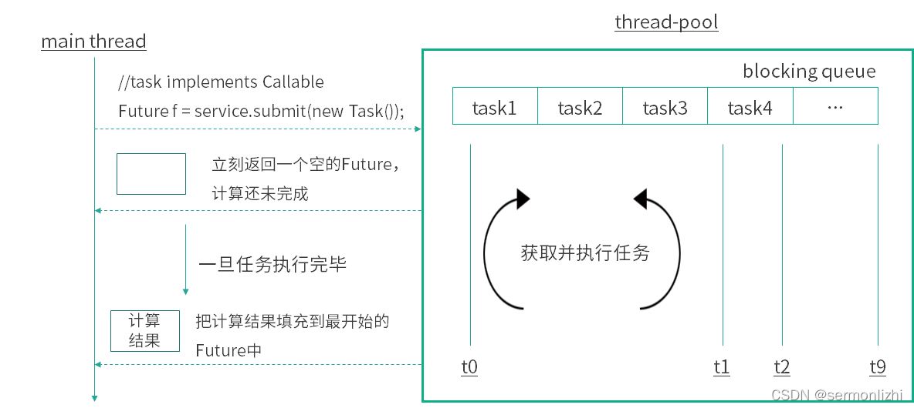
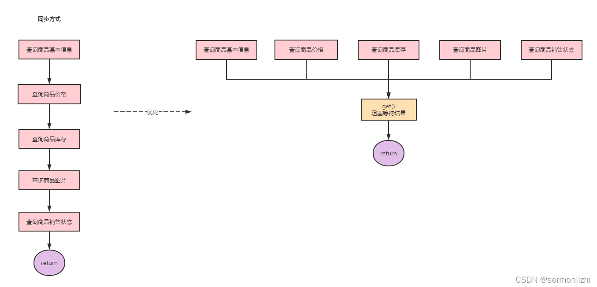

# Callable&Future

## Future原理

最终Callable的实现是FutureTask，FutureTask的run方法会调用创建时传入的Callable实现。

c.call为实际方法体，在执行完后会设置结果。

``` java
    public void run() {
        try {
            Callable<V> c = callable;
            if (c != null && state == NEW) {
                V result;
                boolean ran;
                try {
                    result = c.call();
                    ran = true;
                } catch (Throwable ex) {
                    result = null;
                    ran = false;
                    setException(ex);
                }
                if (ran)
                    set(result);
            }
        } finally {

        }
    }
```

task.get阻塞的实现：get会调用awaitDone方法，使用LockSupport.park阻塞。

get支持超时抛出异常。

## 介绍

继承=Thread=类或实现=Runnable=接口都可以创建线程，但这两种方法都有一个问题就是：没有返回值，不能获取执行完的结果。因此后面在JDK1.5才新增了一个=Callable=接口来解决上面的问题，而=Future=和=FutureTask=就可以与=Callable=配合起来使用。

在Java5之后，任务分两类：一类是实现了=Runnable=接口的类，一类是实现了=Callable=接口的类。两者都可以被=ExecutorService=执行，但是=Runnable=任务没有返回值，而=Callable=任务有返回值。并且=Callable=的=call()=方法只能通过=ExecutorService=的=submit(Callable<t> task)=方法来执行，并且返回一个=Future=，是表示任务等待完成的 =Future=。

而=Callable=只能在线程池中提交任务使用，且只能在=submit()=和=invokeAnay()=以及=invokeAll()=这三个任务提交的方法中使用，如果需要直接使用=Thread=的方式启动线程，则需要使用=FutureTask=对象作为=Thread=的构造参数，而=FutureTask=的构造参数又是=Callable=的对象

当将一个=Callable=的对象传递给=ExecutorService=的=submit=方法，则该=call=方法自动在一个线程上执行，并且会返回执行结果=Future=对象。

同样，将=Runnable=的对象传递给=ExecutorService=的=submit=方法，则该=run=方法自动在一个线程上执行，并且会返回执行结果=Future=对象，但是在该=Future=对象上调用get方法，将返回null。

注意：=Future=的=get=方法是阻塞方法，它会一直等到线程返回结果才会继续执行。

下面展示线程中的使用，以=submit()=为例，其源码如下：

在该方法中，只是把=Callable=封装成了=FutureTask=而已，任务执行依然是=execute()=方法

``` java
public <T> Future<T> submit(Callable<T> task) {
    if (task == null) throw new NullPointerException();
    RunnableFuture<T> ftask = newTaskFor(task);
    execute(ftask);
    return ftask;
}

protected <T> RunnableFuture<T> newTaskFor(Callable<T> callable) {
    return new FutureTask<T>(callable);
}
```

## Callable和Runnable的区别

``` java
@FunctionalInterface
public interface Runnable {
    public abstract void run();
}
@FunctionalInterface
public interface Callable<V> {
    V call() throws Exception;
}
```

*Callable的call方法可以有返回值，可以声明抛出异常*。和=Callable=配合的有一个=Future=类，通过=Future=可以了解任务执行情况，或者取消任务的执行，还可获取任务执行的结果，这些功能都是=Runnable=做不到的，=Callable=的功能要比=Runnable=强大。

``` java
  new Thread(new Runnable() {
      @Override
      public void run() {
          System.out.println("通过Runnable方式执行任务");
      }
  }).start();

  // 需要借助FutureTask
  FutureTask task = new FutureTask(new Callable() {
      @Override
      public Object call() throws Exception {
          System.out.println("通过Callable方式执行任务");
          Thread.sleep(3000);
          return "返回任务结果";
      }
  });
  new Thread(task).start();
  System.out.println("task rs:"+task.get());
```

## 从Future到FutureTask

先看一下=Future=的源码及其定义：

源码中接口上面的注释已经解释地很清楚了，*Future就是对于具体的Runnable或者Callable任务的执行结果进行取消、查询是否完成、获取结果。必要时可以通过get方法获取执行结果，该方法会阻塞直到任务返回结果*。

``` java
/**
 * A {@code Future} represents the result of an asynchronous
 * computation.  Methods are provided to check if the computation is
 * complete, to wait for its completion, and to retrieve the result of
 * the computation.  The result can only be retrieved using method
 * {@code get} when the computation has completed, blocking if
 * necessary until it is ready.  Cancellation is performed by the
 * {@code cancel} method.  Additional methods are provided to
 * determine if the task completed normally or was cancelled. Once a
 * computation has completed, the computation cannot be cancelled.
 * If you would like to use a {@code Future} for the sake
 * of cancellability but not provide a usable result, you can
 * declare types of the form {@code Future<?>} and
 * return {@code null} as a result of the underlying task.
 */
public interface Future<V> {
    // 取消任务的执行,参数表示是否立即中断任务执行,或者等任务结束
    boolean cancel(boolean mayInterruptIfRunning);
    // 任务是否已经取消,任务完成前将其取消,则返回true
    boolean isCancelled();
    // 任务是否已经完成
    boolean isDone();
    // 等待任务执行结束,返回泛型结果.中断或任务执行异常都会抛出异常
    V get() throws InterruptedException, ExecutionException;
    // 同上面的get功能一样，多了设置超时时间。参数timeout指定超时时间，uint指定时间的单位，在枚举类TimeUnit中有相关的定义。如果计算超时，将抛出TimeoutException
    V get(long timeout, TimeUnit unit)
        throws InterruptedException, ExecutionException, TimeoutException;
}
```

其工作过程大概如下：



=Future=归根结底只是一个接口，而=FutureTask=实现了这个接口，同时还实现了=Runnalbe=接口，这样=FutureTask=就相当于是消费者和生产者的桥梁了，消费者可以通过=FutureTask=存储任务的执行结果，跟新任务的状态：未开始、处理中、已完成、已取消等等。而任务的生产者可以拿到=FutureTask=被转型为=Future=接口，可以阻塞式的获取处理结果，非阻塞式获取任务处理状态

总结：*FutureTask既可以被当做Runnable来执行，也可以被当做Future来获取Callable的返回结果*。

``` java
public class FutureTask<V> implements RunnableFuture<V> {
    private volatile int state;
    private static final int NEW          = 0;
    private static final int COMPLETING   = 1;
    private static final int NORMAL       = 2;
    private static final int EXCEPTIONAL  = 3;
    private static final int CANCELLED    = 4;
    private static final int INTERRUPTING = 5;
    private static final int INTERRUPTED  = 6;

    /** The underlying callable; nulled out after running */
    // 任务
    private Callable<V> callable;
    /** The result to return or exception to throw from get() */
    // 执行结果或异常
    private Object outcome; // non-volatile, protected by state reads/writes
    /** The thread running the callable; CASed during run() */
    // 执行任务的线程
    private volatile Thread runner;
    /** Treiber stack of waiting threads */
    private volatile WaitNode waiters;
}

public interface RunnableFuture<V> extends Runnable, Future<V> {
    /**
     * Sets this Future to the result of its computation
     * unless it has been cancelled.
     */
    void run();
}
```

## FutureTask使用

使用方式在上面已经介绍过了，构建一个=FutureTask=对象，其构造方法的入参为=Callable=的实例对象，然后将=FutureTask=对象作为=Thread=构造方法的入参。

这里展示一个实际的应用场景，平常在使用购物软件抢购促销产品的时候，需要查看商品信息(包括商品基本信息、商品价格、商品库存、商品图片)。而这些信息一般都分布在不同的业务中心，由不同的系统提供服务。如果采用同步方式，假设一个接口需要50ms，那么一个商品查询下来就需要200ms-300ms，这对于我们来说是不满意的。如果使用=Future=改造则需要的就是最长耗时服务的接口，也就是50ms左右。

如果采用同步方式，假设一个接口需要50ms，那么一个商品查询下来就需要200ms-300ms，这对于我们来说是不满意的。如果使用Future改造则需要的就是最长耗时服务的接口，也就是50ms左右。



*Future的注意事项*：

- 当 for 循环批量获取Future的结果时容易 block，*get 方法调用时应使用 timeout 限制*
- Future 的生命周期不能后退。一旦完成了任务，它就永久停在了“已完成”的状态，不能从头再来

*Future的局限性*：

从本质上说，Future表示一个异步计算的结果。它提供了isDone()来检测计算是否已经完成，并且在计算结束后，可以通过get()方法来获取计算结果。在异步计算中，Future确实是个非常优秀的接口。但是，它的本身也确实存在着许多限制：

- *并发执行多任务*：Future只提供了get()方法来获取结果，并且是阻塞的。所以，除了等待你别无他法；
- *无法对多个任务进行链式调用*：如果你希望在计算任务完成后执行特定动作，比如发邮件，但Future却没有提供这样的能力；
- *无法组合多个任务*：如果你运行了10个任务，并期望在它们全部执行结束后执行特定动作，那么在Future中这是无能为力的；
- *没有异常处理*：Future接口中没有关于异常处理的方法；

而这些局限性=CompletionService=和=CompletableFuture=都解决了

下面给个例子：

``` java
import java.util.ArrayList;
import java.util.List;
import java.util.concurrent.*;

public class CallableDemo {
    public static void main(String[] args) {
        ExecutorService executorService = Executors.newCachedThreadPool();
        List<Future<String>> resultList = new ArrayList<Future<String>>();

        //创建10个任务并执行
        for (int i = 0; i < 10; i++) {
            //使用ExecutorService执行Callable类型的任务，并将结果保存在future变量中 
            Future< String> future = executorService
                    .submit(new TaskWithResult(i));
            //将任务执行结果存储到List中
            resultList.add(future);
        }

        //遍历任务的结果
        for (Future<String> fs : resultList) {
            try {
                System.out.println(fs.get()); //打印各个线程（任务）执行的结果 
            } catch (InterruptedException e) {
                e.printStackTrace();
            } catch (ExecutionException e) {
                e.printStackTrace();
            } finally {
                //启动一次顺序关闭，执行以前提交的任务，但不接受新任务。如果已经关闭，则调用没有其他作用。
                executorService.shutdown();
            }
        }
    }
}

class TaskWithResult implements Callable<String> {
    private int id;

    public TaskWithResult(int id) {
        this.id = id;
    }

    /**
     * 任务的具体过程，一旦任务传给ExecutorService的submit方法，则该方法自动在一个线程上执行。 
     *
     * @return
     * @throws Exception
     */
    public String call() throws Exception {
        System.out.println("call()方法被自动调用,干活！！！             "
                + Thread.currentThread().getName());
        //一个模拟耗时的操作
        Thread.sleep(1000);
        return "call()方法被自动调用，任务的结果是：" + id + "    "
                + Thread.currentThread().getName();
    }
}
```
