# synchronized

来源：
- [深入理解Synchronized(一)](https://blog.csdn.net/sermonlizhi/article/details/122406394)
- [深入理解Synchronized(二)](https://blog.csdn.net/sermonlizhi/article/details/122418230)
- [深入理解Synchronized(三)](https://blog.csdn.net/sermonlizhi/article/details/122509192)

Java内置管程Synchronized

Java参考了MESA模型，语言内置的管程(synchronized)对MESA模型进行了精简，在MESA模型中，条件变量可以有多个，而Java语言内置的管程中只有一个条件变量。模型如下图所示：


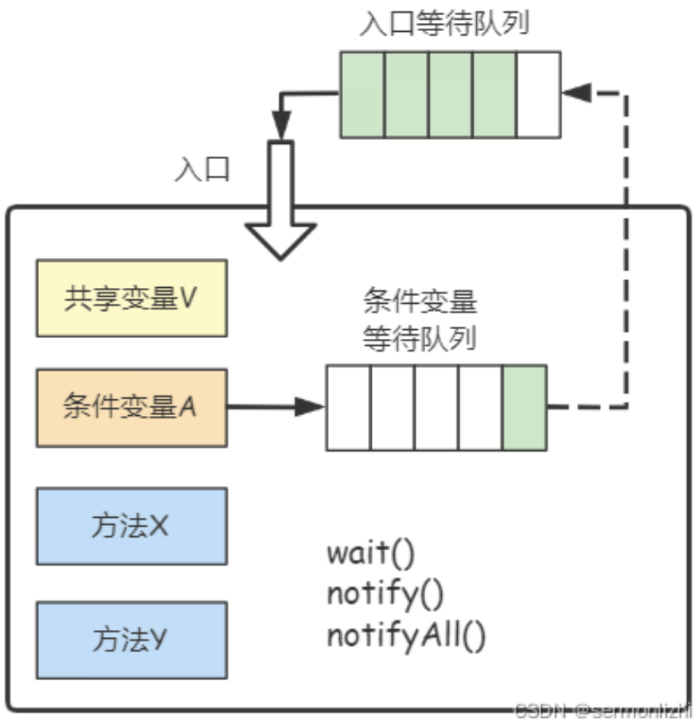


## Monitor机制在Java中实现

java.lang.Object类定义了wait()、notify()、notifyAll()方法，所以在Java中，所有对象都可以作为锁对象，这些方法的具体实现，依赖于ObjectMonitor，这是JVM内部基于C++实现的一套机制。

ObjectMonitor其主要数据结构如下(hosspot源码ObjectMonitor.hpp)

``` c
ObjectMonitor() {
    _header       = NULL; //对象头  markOop
    _count        = 0;  
    _waiters      = 0,   
    _recursions   = 0;   // 锁的重入次数 
    _object       = NULL;  //存储锁对象
    _owner        = NULL;  // 标识拥有该monitor的线程（当前获取锁的线程） 
    _WaitSet      = NULL;  // 等待线程（调用wait）组成的双向循环链表，_WaitSet是第一个节点
    _WaitSetLock  = 0 ;    
    _Responsible  = NULL ;
    _succ         = NULL ;
    _cxq          = NULL ; //多线程竞争锁会先存到这个单向链表中 （FILO栈结构）
    FreeNext      = NULL ;
    _EntryList    = NULL ; //存放在进入或重新进入时被阻塞(blocked)的线程 (也是存竞争锁失败的线程)
    _SpinFreq     = 0 ;
    _SpinClock    = 0 ;
    OwnerIsThread = 0 ;
    _previous_owner_tid = 0;
}
```

_WaitSet是一个条件等待队列，所有调用wait()方法的线程都会放入到该队列中，_csq和_EntryList是两个入口等待队列，不同的是，_cxq是一个栈结构，而_EntryList是一个链表结构，ObjectMonitor中线程锁流转图如下：


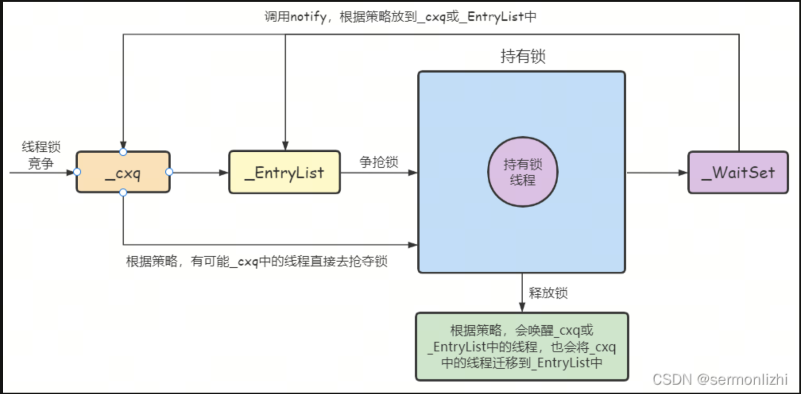

当外部线程竞争时，会把竞争的线程插入到_cxq的头部，而释放锁时，根据策略会有所不同，默认策略(QMode=0)是：如果_EntryList为空，则把_cxq中的元素按照原有顺序插入到_EntryList中，并唤醒第一个线程，也就是当_EntryList为空时，是后来的线程先获取锁(非公平锁)；如果_EntryList不为空，直接从_EntryList中唤醒锁

注：Synchronized只有处于重量级锁状态时，才会有ObjectMonitor对象，但Synchronized还有偏向锁、轻量级锁以及无锁这三种锁状态，这些锁以及锁膨胀过程会在后面的文章介绍。

JVM内置锁在JDK1.5之后版本做了重大的优化，如锁粗化(Lock Coarsening)、锁消除(Lock Elimination)、偏向锁(Biased Lock)、轻量级锁(Ligthweight Lock)、自适应性自旋(Adaptive Spining)等技术来减少锁操作的开销，内置锁的并发性能已经基本与Lock持平。

## 对象的内存布局

在Hotspot虚拟机中，对象在内存中的布局分为三块区域：对象头(Header)、实例数据(Instance Data)和对其填充(Padding)。

对象头：比如hash码，对象所属的年代，对象锁，锁状态标志，偏向锁(线程)ID，偏向时间，数组长度(数组对象才有)等

实例数据：存放类的属性数据信息，包括父类的属性信息

对齐填充：由于Hotspot虚拟机的自动内存管理系统要求对象起始地址必须是8字节的整数倍，换句话说就是任何对象的大小都必须是8字节的整数倍。对象头已经被精心设计成正好是8字节的整数倍，因此，如果对象实例数据没有对齐的话，就需要通过对齐填充来补全。

对象内存布局如下图所示：


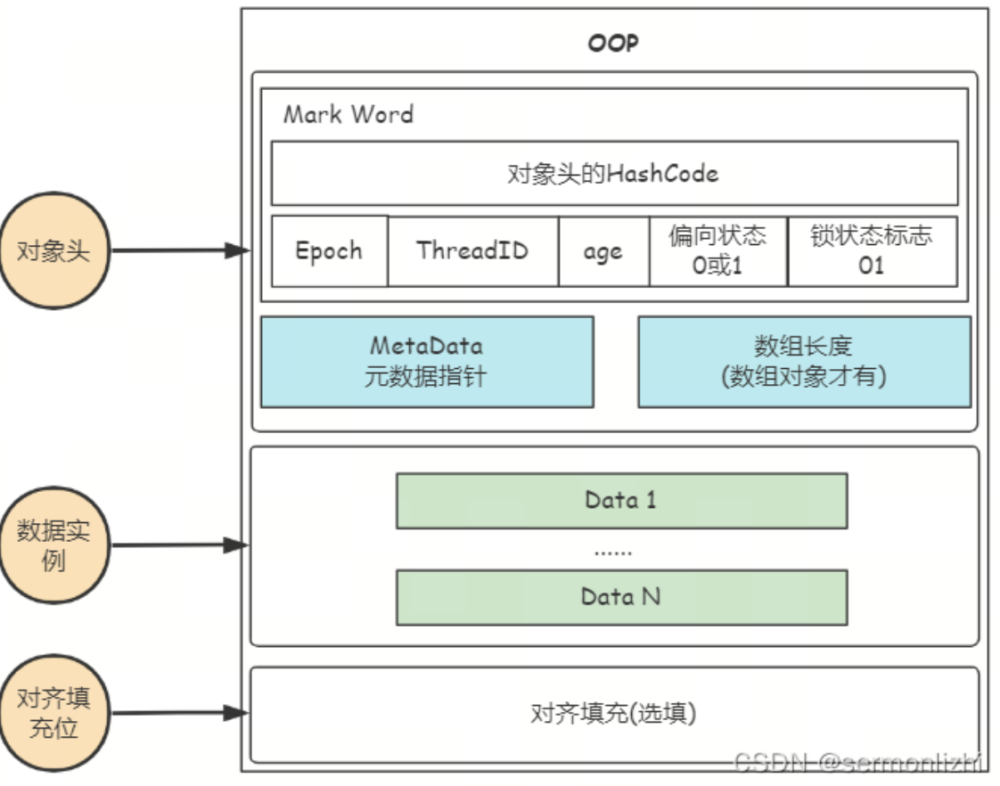

### 对象头详解

在Hotspot虚拟机对象的对象头中，又包括了两类信息。第一类是用于存放对象自身的运行时数据，就是上面的Mark Word部分，对象头的另一部分是类型指针，即对象指向它的类型元数据的指针，此外，如果对象是一个Java数组，那么对象头还需要有一块记录数组长度的数据。

Mark Word

用于存放对象自身的运行时数据，如哈希码(hashCode)、GC分代年龄、锁状态标识、线程持有的锁、偏向线程ID、偏向时间戳等，这部分数据的长度在32位和64位的虚拟机中分别为32bit和64bit，官方称它为“Mark Word”。

Klass Pointer

类型指针，虚拟机通过这个指针来确定这个对象是哪个类的实例。在32位虚拟机占用4byte，64位开启压缩指针或最大堆内存<32G时也占用4byte，否则8byte。JDK1.8中默认开启压缩指针后为4byte，当在JVM参数中关闭压缩指针(-xx:-UseCompressedOops)后，长度为8byte。

数组长度(只有数组对象有)

如果对象是一个数组，那在对象头中还必须有一块数据用于记录数组长度，占用4byte。

Mark Word

Mark Wod是如何记录锁状态的呢？Hotspot通过markOop类型实现Mark Word，具体实现位于markOop.hpp文件中。由于对象需要存储的运行时数据很多，考虑到虚拟机的内存使用，markOop被设计成一个非固定的数据结构，以便在极小的空间存储尽量多的数据，根据对象的状态复用自己的存储空间。

简单理解就是：Mark Word结构搞得这么复杂，是因为需要节省空间，让同一内存区域在不同阶段有不同的用处。

- hash：保存对象的哈希码，运行期间调用System.identityHashCode()来计算，不过是延迟计算，当真正调用Object::hashCode()方法时才会去计算，然后赋值到这里
- age：保存对象的分代年龄。保存对象被GC的次数，当该次数到达阈值的时候，对象就会转移到老年代。这里用4bit来表示，是因为在Hotspot虚拟机的垃圾回收算法中，如果GC次数超过15就会被转移到老年代。
- biased_lock：偏向锁标识。由于无锁和偏向锁的锁标识都是01，没办法区分，这里引入一位偏向锁标识
- lock：锁状态标识位。区分锁状态，比如11标识对象待GC回收状态
- JavaThread：保存持有偏向锁的线程ID。偏向模式的时候，当某个线程持有锁对象时，对象这里就会被置为该线程的ID。在后面的操作中就不需要进行尝试获取锁的动作。这个线程ID并不是JVM分配的线程ID号，和Java Thread中的ID是两个概念。
- epoch：保存偏向时间戳。偏向锁在CAS锁操作过程中，偏向性标识，表示对象更偏向哪个锁。

32位JVM下的对象结构描述


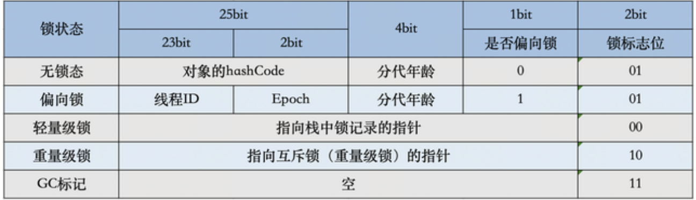

64位JVM下的对象结构描述


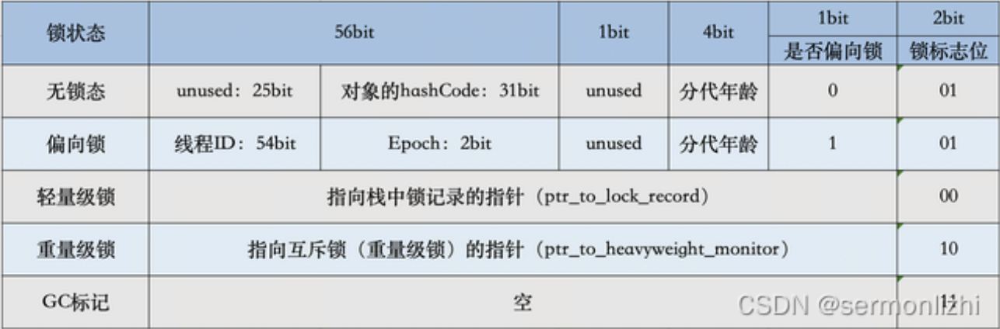

- ptr_to_lock_record：轻量级锁状态下，指向栈中锁记录的指针。当锁获取是无竞争时，JVM使用原子操作，而不是操作系统的互斥，这种技术称为轻量级锁定。在轻量级锁定的情况下，JVM通过CAS操作在对象的Mark Word中设置指向锁记录的指针。
- ptr_to_heavyweight_monitor：重量级锁状态下，指向对象监视器Monitor的指针。如果两个不同的线程同时在同一个对象上竞争，则必须将轻量级锁升级到Monitor以管理等待的线程。在重量级锁定的情况下，JVM在对象的ptr_to_heavyweight_monitor设置指向Monitor的指针。

注：不论是轻量级锁的栈中锁记录还是重量级锁的Monitor对象，都会记录锁对象的hashCode值，而唯独偏向锁中，没有分配记录hashCode值的地方，所以，如果锁对象调用了hashCode()方法，那么它一定不会处于偏向锁状态

Mark Work中锁标记枚举

``` c
enum { locked_value            = 0,    //00 轻量级锁 
      unlocked_value           = 1,    //001 无锁
      monitor_value            = 2,    //10 监视器锁，也叫膨胀锁，也叫重量级锁
      marked_value             = 3,    //11 GC标记
      biased_lock_pattern      = 5     //101 偏向锁
     }

```

更直观的理解方式：


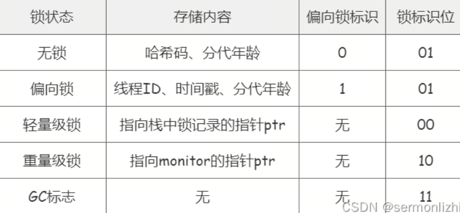


### 栈帧（stack frame）

方法执行时，在jvm的栈中会创建一个栈帧用来存储局部变量、操作数栈、动态链接、方法出口等信息。方法从调用到执行完成，就是栈帧在虚拟机栈中入栈到出栈的过程。（所以代码块中的局部变量可以实现入栈创建，出栈销毁）

线程中的许多方法同时处于执行状态，对执行引擎来说，活动线程中，栈顶的栈帧才是有效的，称为当前栈帧，与这个栈帧关联的方法称为当前方法。


## 偏向锁、轻量级锁和重量级锁

加锁是因为多个线程竞争临界资源，只有一个线程竞争、两个线程去竞争、n多个线程竞争的激烈程度是不同的。竞争越激烈的情况下，获取锁的代价越大，所以为了减少性能消耗，jvm根据不同竞争情况，将锁分为偏向锁、轻量级锁、重量级锁。

### 偏向锁

偏向锁是一种针对加锁操作的优化手段，经过研究发现，在大多数情况下，锁不仅不存在多线程竞争，而且总是由同一个线程多次获取，因此为了消除数据在无锁竞争下锁重入(CAS操作)的开销而引入偏向锁。对于没有锁竞争的场合，偏向锁有很好的优化效果。

``` java
/***StringBuffer内部同步***/
public synchronized int length() { 
    return count; 
} 
//System.out.println 无意识的使用锁 
public void println(String x) { 
    synchronized (this) {
        print(x); newLine(); 
    } 
}
```

偏向锁是加锁，将Mark Word中的线程Id标记为当前线程id，就加锁成功了，具体的流程如下：
- 先读取对象的Mark Word 判断是否处于可偏向的状态，即检查Mark Word中的 是偏向状态和锁标志位。
- 如果可偏向的，说明当前线程可加锁，那么就用CAS操作去将线程id写入到Mark Word中，如果获取锁成功，执行同步代码。如果CAS操作失败，说明其他线程在竞争，并取到了偏向锁
- 如果不是可偏向的，首先验证Mark Word中线程id是否为当前线程，如果是继续执行代码。如果不是，说明锁对象偏向其他线程，等待安全点，验证是否需要升级为轻量级锁。

Safe Point（安全点）
- GC Safe Point（GC安全点）
- Biased Safe Point（偏向锁安全点）

撤销偏向锁的请求由获取竞争偏向锁失败的线程向JVM的任务队列发出，但执行则需要等到偏向线程达到Safe Point（安全点）处（如果偏向线程还存活的话，否则便无需等待。JVM维护了一个集合保存存活的线程，通过遍历该集合判断是否存活）由JVM线程（即处理专项任务的守护线程）负责执行。这是因为在撤销期间可能会修改偏向线程的虚拟机栈栈帧中的数据，因此需要在一个线程暂停的环境来避免并发问题。
  
当JVM开启了偏向锁模式(JDK6默认开启)，新创建对象的Mark Word中Thread ID为0，说明此时处于可偏向但未偏向任何线程，也叫做匿名偏向(anonymously bisaed)

偏向锁模式存在偏向锁延迟机制：HotSpot 虚拟机在启动后有 4s 的延迟才会对每个新建的对象开启偏向锁模式。JVM启动时会进行一系列的复杂活动，比如装载配置，系统类初始化等等。在这个过程中会使用大量synchronized关键字对对象加锁，且这些锁大多数都不是偏向锁。为了减少初始化时间，JVM默认延时加载偏向锁。

偏向锁相关JVM参数：

``` 
//关闭延迟开启偏向锁
-XX:BiasedLockingStartupDelay=0
//禁止偏向锁
-XX:-UseBiasedLocking 
```

偏向锁撤销
- 调用HashCode方法: Mark Word部分偏向锁没有分配存储hashCode值的位置，所以当调用hashCode()方法时，将会使对象永远无法再回到偏向锁状态。
- 调用wait/notify方法: 调用锁对象的wait(timeout)方法，会升级成为重量级锁

### 轻量级锁

偏向锁失败时，虚拟机并不会立即升级为重量级锁，它还会尝试使用一种轻量级锁的优化手段，此时Mark Word的结构也变为轻量级锁的结构。轻量级锁所适应的场景是线程交替执行同步块的场合。如果存在同一时间多个线程访问同一把锁的场景，就会导致轻量级锁膨胀为重量级锁。

轻量级锁采用CAS自旋锁的方式来完成加锁，相对于重量级锁加锁的代价相对小一些，如果一直获取不到锁状态，自旋占用的资源会超过重量级锁，所以轻量级锁膨胀为重量级锁的条件就是自旋达超过一定次数（默认为10，可以修改PreBlockSpin参数调整）。

轻量级锁不会降级成为偏向锁，只会降级成为无锁状态

重量级锁释放后变成无锁，此时有新的线程来调用同步块，会直接变成轻量级锁。不会从无锁变成偏向锁。

## 轻量级锁底层原理

轻量锁的锁对象与线程锁记录之间的关系如下图所示：


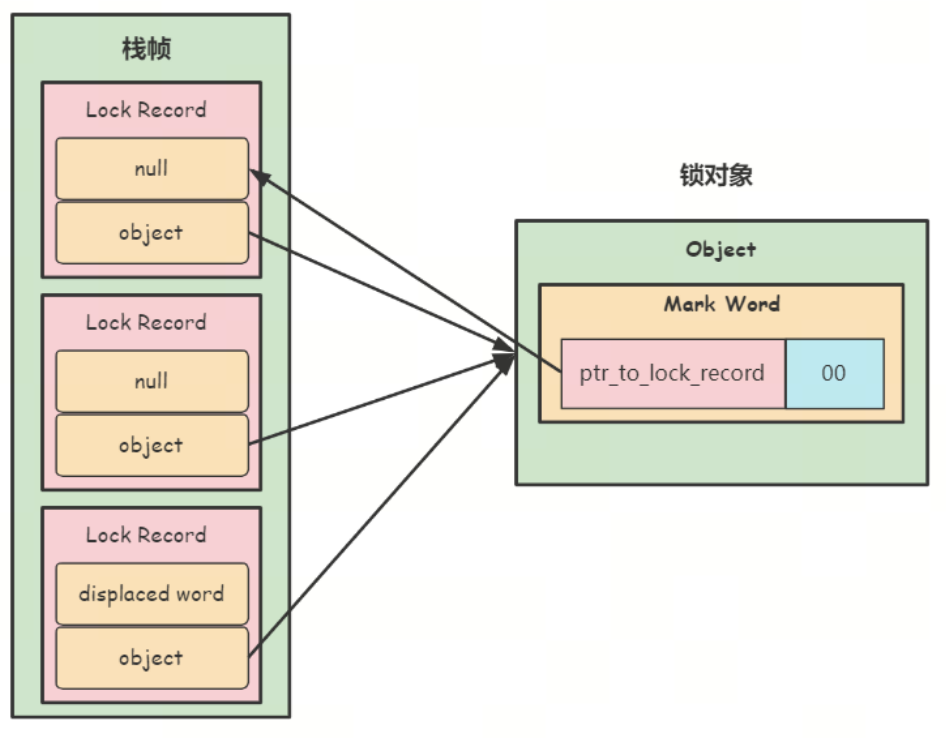

线程每次加锁，都会在线程的栈帧中分配一块锁记录的空间，锁记录里面包含了锁对象的Mark Word(displaced word)和指向锁对象的指针，而锁对象的对象头里面的ptr_to_lock_record是指向栈帧中锁记录的指针。

当线程第一次加锁时，锁记录就去记录完整的Mark Word和锁对象指针，当线程重入加锁时，同样会生成一个锁记录，但该锁记录里面的displaced word就为null，只记录了指向锁对象的指针，而锁对象里面的ptr_to_lock_record记录的是线程栈顶的锁记录

当字节码解释器在执行monitorenter字节码轻度锁住一个对象时，就会在获取锁的线程的栈上显示或隐式分配一个lock record。其主要作用就是持有displaced word和锁对象的元数据，解释器可以使用lock record来检测非法的锁状态；隐式地充当重入机制的计数器。

轻量级锁加锁逻辑如下图所示：


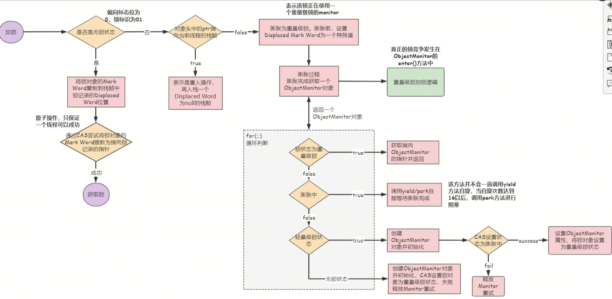-_

轻量级锁加锁的过程：

- 复制锁对象的Mark Word到所记录的Displaced Word中
- 通过CAS将锁对象的Mark Word中的信息设置为指向栈帧中锁记录的指针
- 修改锁状态为00
- 将栈帧中锁记录的Obj指向锁对象
  
上面图中后面的逻辑主要介绍了锁膨胀的过程，锁膨胀的结果是生成一个ObjectMonitor对象，并把锁状态更新为重量级锁，而重量级锁的加锁逻辑在后面会介绍

通过上面轻量级锁加锁和膨胀的过程，我们可以清晰地看到，从轻量级锁膨胀到重量级锁，并没有自旋，只要出现不同线程竞争锁的情况，就会膨胀成重量级锁。

注：在无锁的状态下，如果通过CAS尝试获取失败时，会直接膨胀成重量级锁

解锁逻辑

轻量级锁的解锁逻辑比较简单，如下图所示：


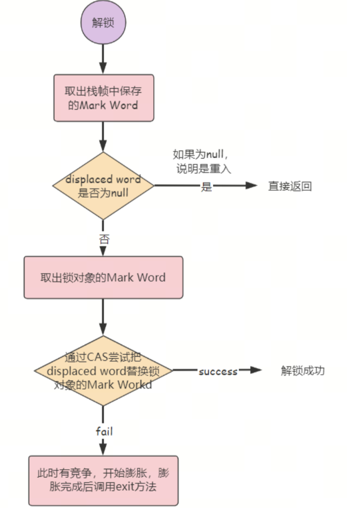

## 重量级锁原理

加锁逻辑

从下面的加锁逻辑中可以看出，为了避免调用系统同步，重量级锁在获取锁的过程中会多次去尝试获取锁和适应性自旋通过CAS来获取锁，只有当实在获取不到锁的时候，才会把线程封装成一个node节点，然后插入的_cxq队列(入口等待队列)的头部


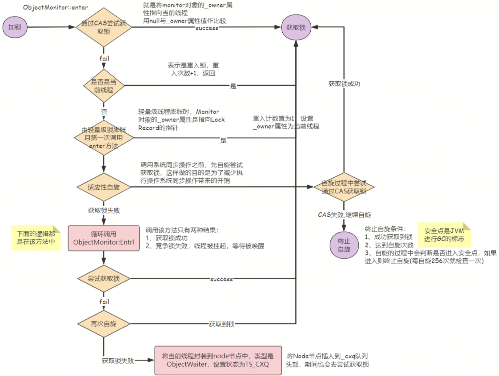

把线程的node节点插入到入口等待队列的头部后，就循环来尝试获取锁，或者当线程被唤醒时，第一时间去尝试获取锁，并通过适应性自旋来尝试获取锁，如果成功，就跳出循环，将node节点从入口等待队列移除；否则就继续调用park方法进行阻塞


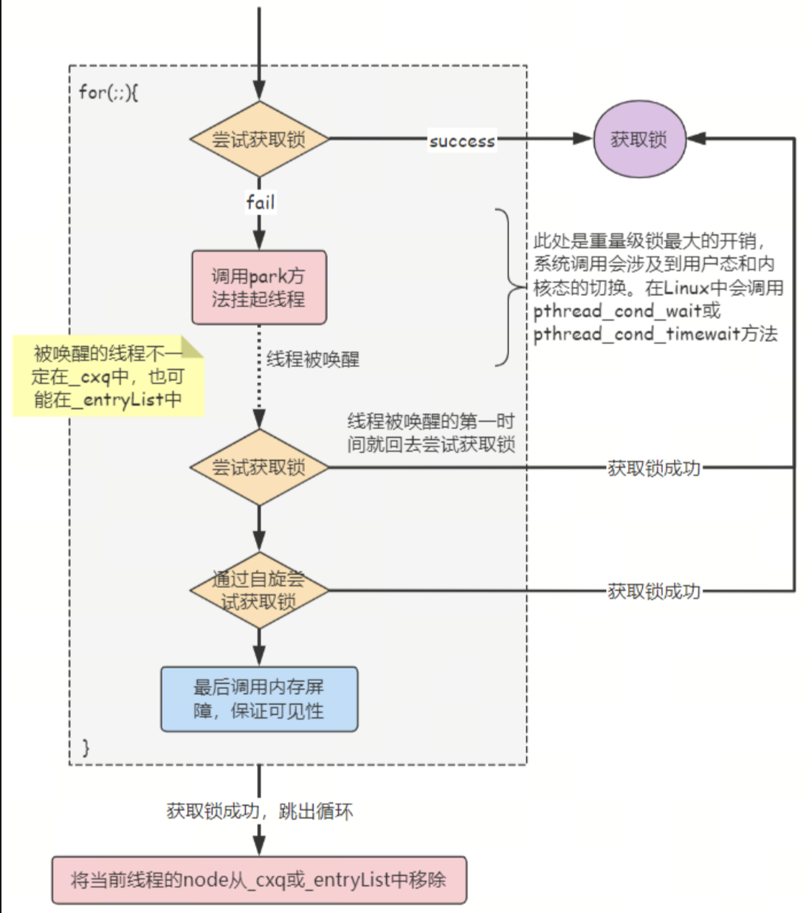

解锁逻辑

重量级锁的解锁逻辑也比较简单，将ObjectMonitor中的_owner属性置为null，然后调用一个写屏障让修改生效就表示释放锁了，但需要注意的是此时锁对象的状态还是重量级锁，锁状态从重量级锁变成无锁状态，需要等到ObjectMonitor对象被GC回收才行，所以即便没有线程竞争锁，锁状态也可能依然是重量级锁状态。


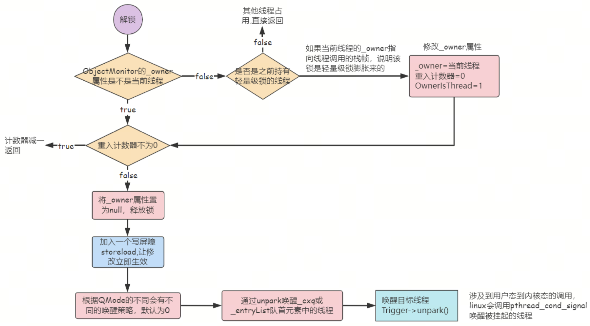

在解锁逻辑中，最重要的是唤醒策略，根据QMode的不同会有不同的唤醒策略：

- QMode=2且_cxq不为空，取_cxq队首的ObjectWaiter对象，然后调用ExitEpilog()方法，该方法会唤醒ObjectWaiter对象中的线程，然后立即返回
- QMode=3且_cxq不为空，把_cxq队首元素放入到_entryList队列的尾部(这两个都是MESA模型的入口等待队列)，直接从_entryList中唤醒线程
- QMode=4且_cxq不为空，把_cxq队首元素放到_entryList队列的头部，直接从_entryList中唤醒线程
- QMode=1且_cxq不为空，_entryList为空，将_cxq的元素全部转移到_entryList中，并反转顺序
- QMode=0(默认)，如果_entryList为空，则把_cxq的元素按原有顺序插入到_entryList中，并唤醒第一个线程，如果_entryList不为空，直接从_entryList中唤醒线程

## 锁对象状态变换

下图展示了无锁、偏向锁、轻量级锁、重量级锁之间的状态变换：


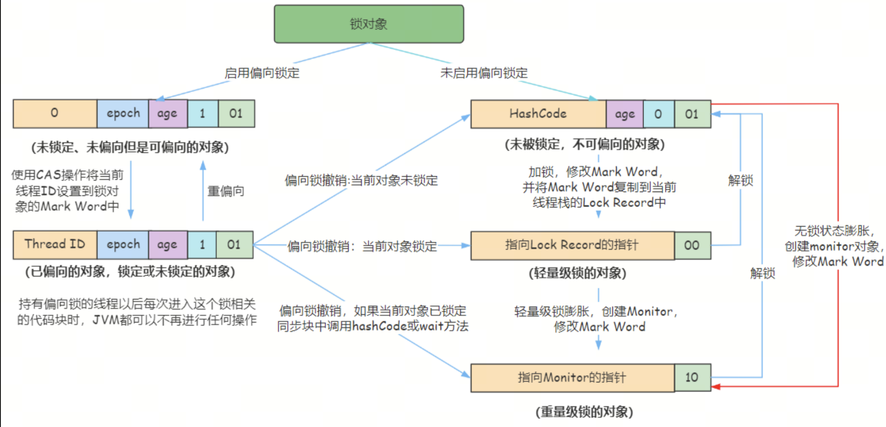

如果开启了偏向锁模式，创建的锁对象将处于未锁定状态的偏向锁(ThreadID为0)，它是在没有线程竞争的情况下存在的，线程持有锁对象前后，锁对象都处于偏向锁状态。

偏向锁，它只是偏向某个线程，后续进入同步块的逻辑，没有加锁和解锁的开销

偏向锁的重偏向，在后面锁优化的部分会介绍为什么会出现重偏向的问题。

在轻量级锁加锁的过程中，如果锁对象处于无锁状态，就会通过CAS来获取锁，如果失败，就会直接膨胀成重量级锁，也就是上图中后边红线表示的信息，直接从无锁，膨胀成重量级锁。

### 重量级锁自旋

在前面重量级锁原理部分，介绍了重量级锁加锁的流程，在重量级锁加锁的过程中，会通过自适应性自旋和多次重试获取锁，来避免线程阻塞。线程阻塞和唤醒都需要调用系统内核方法，涉及到用户态到内核态的切换，这是开销很大的操作。

- 自旋会占用 CPU 时间，单核 CPU 自旋就是浪费，多核 CPU 自旋才能发挥优势。
- 在 Java 6 之后自旋是自适应的，比如对象刚刚的一次自旋操作成功过，那么认为这次自旋成功的可能性会高，就多自旋几次；反之，就少自旋甚至不自旋，比较智能。
- Java 7 之后不能控制是否开启自旋功能

### 锁粗化

假设一系列的操作都会对同一个锁对象反复加锁及解锁，甚至加锁操作是在循环体内部，即使没有出现线程竞争，频繁进行同步和互斥操作也会导致不必要的性能损耗。

如果JVM检测到有一连串的操作都是对同一对象的加锁，将会扩大加锁同步的范围(即锁粗化)到整个操作序列的外部

以我们常用的StringBuffer为例，它的append()方法是一个同步方法

``` java
public synchronized StringBuffer append(String str) {
    toStringCache = null;
    super.append(str);
    return this;
}
```

下面的应用场景在我们日常开发中是比较常见的，如果每次调用append()方法都会进行解锁和加锁的逻辑，对性能影响很大，但JVM检测到这一连串的append操作都是对同一个锁对象进行加锁，就会将其合并为一个范围更大的加锁和解锁逻辑，即在第一次调用append()方法时进行加锁，最后一次调用append()方法结束时进行解锁。

``` java
StringBuffer buffer = new StringBuffer();
/**
 * 锁粗化
 */
public void append(){
    buffer.append("aaa").append(" bbb").append(" ccc");
}
```

Synchronized基于Monitor机制实现，依赖底层操作系统的互斥原语Mutex(互斥量)，它是一个重量级锁，性能较低。

### 锁消除

锁消除就是删除不必要的加锁逻辑。锁消除是Java虚拟机在JIT编译期间，通过对运行上下文的扫描，去除不可能存在共享资源竞争的锁，通过锁消除，可以节省毫无意义的请求锁时间。

锁消除的前提一定是不存在共享资源的竞争，即资源是线程私有的。

仍以StringBuffer为例子，在自定义的append()方法中，定义了一个StringBuffer对象，这个对象是零时变量，归方法栈所有，方法调用完就会被销毁，不可能从该方法中逃出去，因此这个过程是线程安全的，所以，可以将锁消除。

我们通过开启和关闭锁消除来比较一下这个耗时

``` java
/**
 * 锁消除
 * -XX:+EliminateLocks 开启锁消除(jdk8默认开启）
 * -XX:-EliminateLocks 关闭锁消除
 * @param str1
 * @param str2
 */
public void append(String str1, String str2) {
    StringBuffer stringBuffer = new StringBuffer();
    stringBuffer.append(str1).append(str2);
}

public static void main(String[] args) throws InterruptedException {
    LockEliminationTest demo = new LockEliminationTest();
    long start = System.currentTimeMillis();
    for (int i = 0; i < 100000000; i++) {
        demo.append("aaa", "bbb");
    }
    long end = System.currentTimeMillis();
    System.out.println("执行时间：" + (end - start) + " ms");
}

```

测试结果如下：

开启锁消除: 执行时间：2692 ms
关闭锁消除: 执行时间：6427 ms

### 偏向锁批量重偏向和批量撤销

上面已经说过，偏向锁加锁和解锁前后，它都处于偏向锁模式，只是锁对象中的ThreadID发生了变化，而当一个线程反复进入同步块时，偏向锁带来的性能开销基本可以忽略，但当其他线程尝试获取锁时，就得等到safe point时，将偏向锁撤销为无锁或轻量级锁状态，会消耗一定的性能。所以在多线程竞争频繁的情况下，偏向锁不仅不能提高性能，还会导致性能下降，所以就有了偏向锁批量重偏向和批量撤销的机制

基本原理

以Class为单位，为每个Class维护一个偏向锁撤销计数器，每一个该Class的实例对象发生偏向操作时，该计数器+1，当这个值在一定时间内达到重偏向阈值(默认20)时，JVM就认为该Class的偏向锁有问题，因此会进行批量重偏向。

每个Class都有一个对应的epoch字段，每个处于偏向锁状态的锁对象的Mark Word中也有该字段，其初始值为创建对象时Class的epoch值。每次发生偏向锁撤销时，就将该值+1，同时遍历JVM中所有的栈，找到所有该Class对应的处于加锁状态的偏向锁，将其epoch值改为新值。下次获取锁时，发现当前对象的epoch值和Class的epoch值不相等，就相当于当前偏向锁已经偏向了其他线程，也不会执行撤销操作，而是直接通过CAS将Mark Word的Thread ID改成当前线程ID。

当达到重偏向阈值(默认20)后，如果该Class的epoch值继续增长，当期达到批量撤销的阈值(默认40)后，JVM就认为该Class的使用场景存在多线程竞争，会将该Class标记为不可偏向，之后对于该Class的实例对象的锁，直接走轻量级锁的逻辑。

设置JVM参数-XX:+PrintFlagsFinal，在项目启动时即可输出JVM的默认参数值

``` 
intx BiasedLockingBulkRebiasThreshold   = 20   //默认偏向锁批量重偏向阈值
```

可以通过-XX:BiasedLockingBulkRebiasThreshold 和 -XX:BiasedLockingBulkRevokeThreshold 来手动设置阈值

应用场景

批量重偏向(bulk rebias)：假设有一个类LockObject，现在创建了大量的该类实例对象作为锁对象，在线程A中，用这些锁对象来做同步操作；同时，在线程B中，也用这些锁对象来做同步操作，这个时候，由于线程B会尝试去获取锁，这些锁会撤销到轻量级锁，当撤销达到重偏向的阈值后，JVM就会对这些锁对象进行重偏向，让它们偏向线程B。

可以使用下面的代码来演示批量重偏向，thread1中，对这些锁对象执行同步操作，这些锁对象都会偏向thread1，第一个打印出来的对象内存布局可以看到，此时处于偏向锁状态，而在thread2中，再次用这些对象进行同步操作，可以看到第1至第18个锁对象已经撤销到了轻量级锁状态，而后面从第19个锁对象开始，经过了重偏向之后，又回到了偏向锁状态。

``` java
//延时产生可偏向对象
Thread.sleep(5000);
// 创建一个list，来存放锁对象
List<Object> list = new ArrayList<>();

// 线程1
new Thread(() -> {
    for (int i = 0; i < 50; i++) {
        // 新建锁对象
        Object lock = new Object();
        synchronized (lock) {
            list.add(lock);
        }
    }
    //为了防止JVM线程复用，在创建完对象后，保持线程thead1状态为存活
    Thread.sleep(100000);
}, "thead1").start();

//睡眠3s钟保证线程thead1创建对象完成
Thread.sleep(3000);
log.debug("打印thead1，list中第20个对象的对象头：");
log.debug((ClassLayout.parseInstance(list.get(19)).toPrintable()));

// 线程2
new Thread(() -> {
    for (int i = 0; i < 40; i++) {
        Object obj = list.get(i);
        synchronized (obj) {
            if(i>=15&&i<=21||i>=38){
                log.debug("thread2-第" + (i + 1) + "次加锁执行中\t"+
                          ClassLayout.parseInstance(obj).toPrintable());
            }
        }
        if(i==17||i==19){
            log.debug("thread2-第" + (i + 1) + "次释放锁\t"+
                      ClassLayout.parseInstance(obj).toPrintable());
        }
    }
    Thread.sleep(100000);
}, "thead2").start();

LockSupport.park();

```

批量撤销(bulk revoke)：在明显多线竞争剧烈的情况下，使用偏向锁是不合适的。此时直接从无锁状态开始向轻量级锁膨胀性能更好，避免了偏向锁撤销到轻量锁时等待safe point的开销。

所以批量撤销之后，新创建的锁对象都处于无锁状态，直接从无锁开始膨胀。

当撤销偏向锁阈值超过 40 次后，jvm 会认为不该偏向，于是整个类的所有对象都会变为不可偏向的，新建的对象也是不可偏向的。

注意：时间-XX:BiasedLockingDecayTime=25000ms范围内没有达到40次，撤销次数清为0，重新计时

在上面演示重偏向的代码thread2后面，加入下面的代码就可以看到批量撤销的效果

``` java
Thread.sleep(3000);

new Thread(() -> {
    for (int i = 0; i < 50; i++) {
        Object lock =list.get(i);
        if(i>=17&&i<=21||i>=35&&i<=41){
            log.debug("thread3-第" + (i + 1) + "次准备加锁\t"+
                      ClassLayout.parseInstance(lock).toPrintable());
        }
        synchronized (lock){
            if(i>=17&&i<=21||i>=35&&i<=41){
                log.debug("thread3-第" + (i + 1) + "次加锁执行中\t"+
                          ClassLayout.parseInstance(lock).toPrintable());
            }
        }
    }
},"thread3").start();

log.debug((ClassLayout.parseInstance(new Object()).toPrintable()));

```

thread2中锁对象经过了重偏向后，第19至第38个锁对象就还是偏向锁状态，但从第39个锁对象开始，经过了批量撤销之后，变成了轻量级锁状态，而后面再创建的锁对象，就是无锁状态的了。

总结：

- 批量重偏向和批量撤销是针对Class的优化，与实例锁对象无关
- 偏向锁重偏向一次之后不可再次重偏向
- 当某个类已经触发批量撤销机制后，JVM会默认当前类产生了严重的问题，剥夺了该类的新实例对象使用偏向锁的权利

### 逃逸分析

逃逸分析，是一种可以有效减少Java 程序中同步负载和内存堆分配压力的跨函数全局数据流分析算法。通过逃逸分析，Java Hotspot编译器能够分析出一个新的对象的引用的使用范围从而决定是否要将这个对象分配到堆上。逃逸分析的基本行为就是分析对象动态作用域。

方法逃逸

当一个对象在方法中被定义后，它可能被外部方法所引用，例如作为调用参数传递到其他地方中。

线程逃逸

这个对象甚至可能被其它线程访问到，例如赋值给类变量或可以在其它线程中访问的实例变量。

使用逃逸分析，编译器可以对代码做如下优化：
- 同步省略或锁消除(Synchronization Elimination)。如果一个对象被发现只能从一个线程被访问到，那么对于这个对象的操作可以不考虑同步。
- 将堆分配转化为栈分配(Stack Allocation)。如果一个对象在子程序中被分配，要使指向该对象的指针永远不会逃逸，对象可能是栈分配的候选，而不是堆分配。
- 分离对象或标量替换(Scalar Replacement)。有的对象可能不需要作为一个连续的内存结构存在也可以被访问到，那么对象的部分（或全部）可以不存储在内存，而是存储在CPU寄存器中。

jdk6才开始引入该技术，jdk7开始默认开启逃逸分析。在Java代码运行时，可以通过JVM参数指定是否开启逃逸分析：

```
-XX:+DoEscapeAnalysis  //表示开启逃逸分析 (jdk1.8默认开启）
-XX:-DoEscapeAnalysis //表示关闭逃逸分析。
-XX:+EliminateAllocations   //开启标量替换(默认打开)
```

``` java
/**
 * @author  lizhi
 *
 * 进行两种测试
 * 关闭逃逸分析，同时调大堆空间，避免堆内GC的发生，如果有GC信息将会被打印出来
 * VM运行参数：-Xmx4G -Xms4G -XX:-DoEscapeAnalysis -XX:+PrintGCDetails -XX:+HeapDumpOnOutOfMemoryError
 *
 * 开启逃逸分析  jdk8默认开启
 * VM运行参数：-Xmx4G -Xms4G -XX:+DoEscapeAnalysis -XX:+PrintGCDetails -XX:+HeapDumpOnOutOfMemoryError
 *
 * 执行main方法后
 * jps 查看进程
 * jmap -histo 进程ID
 *
 */
public static void main(String[] args) {
        long start = System.currentTimeMillis();
        for (int i = 0; i < 500000; i++) {
            alloc();
        }

        long end = System.currentTimeMillis();

        log.info("执行时间：" + (end - start) + " ms");
        try {
            Thread.sleep(Integer.MAX_VALUE);
        } catch (InterruptedException e1) {
            e1.printStackTrace();
        }
    }

    /**
     * JIT编译时会对代码进行逃逸分析
     * 并不是所有对象存放在堆区，有的一部分存在线程栈空间
     * Ponit没有逃逸
     */
    private static String alloc() {
        Point point = new Point();
        return point.toString();
    }

    /**
     *同步省略（锁消除）  JIT编译阶段优化，JIT经过逃逸分析之后发现无线程安全问题，就会做锁消除
     */
    public void append(String str1, String str2) {
        StringBuffer stringBuffer = new StringBuffer();
        stringBuffer.append(str1).append(str2);
    }

    /**
     * 标量替换
     *
     */
    private static void test2() {
        Point point = new Point(1,2);
        System.out.println("point.x="+point.getX()+"; point.y="+point.getY());

//        int x=1;
//        int y=2;
//        System.out.println("point.x="+x+"; point.y="+y);
    }
}

@Data
@AllArgsConstructor
@NoArgsConstructor
class Point{
    private int x;
    private int y;
}
```

使用：jmap -histo pid 对比结果


## bak

synchronized是针对对象的隐式锁使用的，注意是对象！
- 锁实例
- 锁类
- 锁方法
- 锁静态类
  锁静态方法

举个小例子，该例子没有任何业务含义，只是为了说明synchronized的基本用法：

``` java
Class MyClass(){
  synchronized void myFunction(){
    //do something
  }
}

public static void main(){
  MyClass myClass = new MyClass();
  myClass.myFunction();
}
```

myFunction()方法是个同步方法，隐式锁是谁的？答：是该方法所在类的对象。

看看怎么使用的：myClass.myFunction();很清楚了吧，隐式锁是myClass的。

说的在明白一点，线程想要执行myClass.myFunction();就要先获得myClass的锁。

下面总结一下：

1、synchronized关键字的作用域有二种：

1）是某个对象实例内，synchronizeda Method(){} 可以防止多个线程同时访问这个对象的synchronized方法（如果一个对象有多个synchronized方法，只要一个线程访问了其中的一个synchronized方法，其它线程不能同时访问这个对象中任何一个synchronized方法）。这时，不同的对象实例的synchronized方法是不相干扰的。也就是说，其它线程照样可以同时访问相同类的另一个对象实例中的synchronized方法；

2）是某个类的范围，synchronized static aStaticMethod{} 防止多个线程同时访问这个类中的 synchronized static方法。它可以对类的所有对象实例起作用。（注：这个可以认为是对Class对象起作用）

2、除了方法前用synchronized关键字，synchronized关键字还可以用于方法中的某个区块中，表示只对这个区块的资源实行互斥访问。用法是:

synchronized(this){/*区块*/}，它的作用域是this，即是当前对象。当然这个括号里可以是任何对象，synchronized对方法和块的含义和用法并无本质不同；

3、synchronized关键字是不能继承的，也就是说，基类的方法synchronized f(){} 在继承类中并不自动是synchronized f(){}，而是变成了f(){}。继承类需要你显式的指定它的某个方法为synchronized方法；

synchronized可能造成死锁，比如：

``` java
    class DeadLockSample{
        public final Object lock1 = new Object();
        public final Object lock2 = new Object();

        public void methodOne(){
           synchronized(lock1){
              ...
              synchronized(lock2){...}
           }
        }

        public void methodTwo(){
           synchronized(lock2){
          ...
              synchronized(lock1){...}
           }
        }
    }
```

假设场景：线程A调用methodOne()，获得lock1的隐式锁后，在获得lock2的隐式锁之前线程B进入运行，调用methodTwo()，抢先获得了lock2的隐式锁，此时线程A等着线程B交出lock2，线程B等着lock1进入方法块，死锁就这样被创造出来了。


