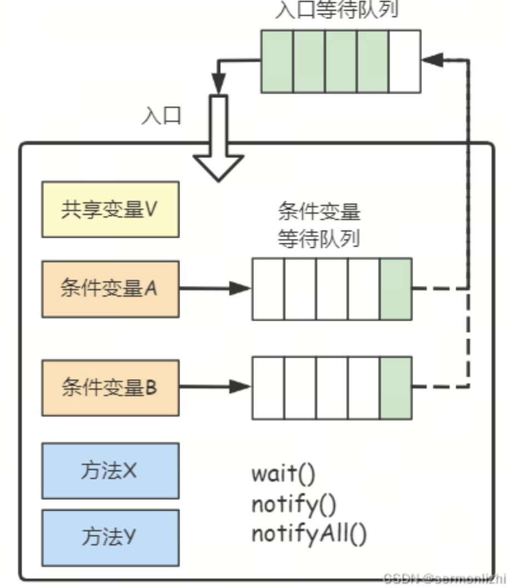

# java thead

[美妙的Java源码世界](https://blog.csdn.net/sermonlizhi/category_11194011.html)

## thread status
1. 新建状态（New）：新创建了一个线程对象。
2. 就绪状态（Runnable）：线程对象创建后，其他线程调用了该对象的start()方法。该状态的线程位于可运行线程池中，变得可运行，等待获取CPU的使用权。
3. 运行状态（Running）：就绪状态的线程获取了CPU，执行程序代码。
4. 阻塞状态（Blocked）：阻塞状态是线程因为某种原因放弃CPU使用权，暂时停止运行。直到线程进入就绪状态，才有机会转到运行状态。阻塞的情况分三种：
- 等待阻塞：运行的线程执行wait()方法，JVM会把该线程放入等待池中。
- 同步阻塞：运行的线程在获取对象的同步锁时，若该同步锁被别的线程占用，则JVM会把该线程放入锁池中。
- 其他阻塞：运行的线程执行sleep()或join()方法，或者发出了I/O请求时，JVM会把该线程置为阻塞状态。当sleep()状态超时、join()等待线程终止或者超时、或者I/O处理完毕时，线程重新转入就绪状态。
5. 死亡状态（Dead）：线程执行完了或者因异常退出了run()方法，该线程结束生命周期。


## 互斥同步基本概念

互斥: 保证临界区的竞态条件发生，同一时刻只能有一个线程执行临界区代码

同步: 由于线程执行的先后顺序不同，需要一个线程等待其他线程运行到某个点然后再唤起线程

临界区：

一段代码块内如果存在对共享资源的多线程读写操作，称这段代码块为临界区，其共享资源为临界资源

竞态条件：

多个线程在临界区内执行，由于代码的执行序列不同而导致结果无法预测，称之为发生了竞态条件

[[id:dn-java-thread-synchronized][synchronized]]

## MESA管程

Monitor，直译为“监视器”，而操作系统领域一般翻译为“管程”。管程是指管理共享变量以及对共享变量操作的过程，让它们支持并发。在Java 1.5之前，Java语言提供的唯一并发语言就是管程，Java 1.5之后提供的SDK并发包也是以管程为基础的。除了Java之外，C/C++、C#等高级语言也都是支持管程的。synchronized关键字和wait()、notify()、notifyAll()这三个方法是Java中实现管程技术的组成部分。

在管程的发展史上，先后出现过三种不同的管程模型，分别是Hasen模型、Hoare模型和MESA模型。

现在广泛使用的是MESA模型，它的基本结构如下图所示：




在MESA模型中，最主要的就是入口等待队列和条件变量等待队列，而每个条件变量都对应一个条件队列。

当多个线程访问共享变量时，只允许一个线程进入，其他线程在入口等待队列进行排队等待，保证了线程间的互斥。

在线程执行的过程中，当前线程可能需要等待其他线程的计算结果(条件)，这个时候，当前线程就会进入到条件队列进行等待，当其他线程运行完得到计算结果之后，会唤醒条件队列的线程，这时，条件等待队列的线程会再次进入到入口等待队列中。条件变量和条件等待队列的作用是解决线程之间的同步问题。

wait()方法的正确使用姿势

对于MESA管程来说，有一个编程范式：

``` java
while(条件不满足){
    wait();
}
```

由于线程被唤醒的时候和获取到锁执行的时间是不一致的，被唤醒的线程在入口队列中经过排队等候重新获取到锁时，可能条件又不满足了，所以需要循环检验条件。MESA模型的wait()方法还有一个超时参数，为了避免线程进入等待队列永久阻塞。

notify()和notifyAll()的使用

满足以下条件时，可以使用notify()，其余情况尽量使用notifyAll()

- 所有等待线程拥有相同的等待条件
- 所有等待线程被唤醒后，执行相同的操作
- 只需要唤醒一个线程


## LockSupport 锁基类

来自LockSupport类的注释说明

基本的线程阻塞原语用于创建锁和其他同步类。这个类为每个使用它的线程关联一个许可（在Semaphore类意义上的许可）。

如果许可可用，调用park方法将立即返回，并在过程中消耗该许可；否则，它可能会阻塞。调用unpark方法将使许可可用（如果它尚未可用）。（与Semaphore不同，许可不会累积。最多只有一个。）

park和unpark方法提供了有效的线程阻塞和解除阻塞手段，不会遇到导致Thread.suspend和Thread.resume被弃用的问题：一个线程调用park，另一个线程试图unpark它的竞争条件将保持程序的活性，这是由于许可的缘故。此外，如果调用者的线程被中断，park方法也会返回，并支持超时版本。

一般来说，park方法必须在循环中调用，以便在返回时重新检查条件。在这个意义上，park是优化了一种“忙等待”，它不会浪费太多时间进行轮询，但必须与unpark一起使用才能有效。

三种形式的park都支持一个blocker对象参数。在线程被阻塞时记录这个对象，以便监控和诊断工具识别线程被阻塞的原因。（这些工具可以使用getBlocker(Thread)方法访问blocker。）强烈建议使用这些形式而不是没有此参数的原始形式。在锁实现中作为阻塞者供应的正常参数是this。这些方法被设计成用于创建更高级别的同步实用程序工具，而本身对于大多数并发控制应用来说并不是很有用。

park方法仅在设计形式为

while (!canProceed()) { ... LockSupport.park(this); }

的构造中使用，其中this作为阻塞者参数。

``` java
class FIFOMutex {
    private final AtomicBoolean locked = new AtomicBoolean(false);
    private final Queue<Thread> waiters = new ConcurrentLinkedQueue<Thread>();

    public void lock() {
        boolean wasInterrupted = false;
        Thread current = Thread.currentThread();
        waiters.add(current);          
        // Block while not first in queue or cannot acquire lock
        while (waiters.peek() != current || 
                !locked.compareAndSet(false, true)) {
            LockSupport.park(this);
            if (Thread.interrupted()) // ignore interrupts while waiting
                wasInterrupted = true;
        }
        waiters.remove();
        if (wasInterrupted)          // reassert interrupt status on exit
            current.interrupt();
    }

    public void unlock() {
        locked.set(false);
        LockSupport.unpark(waiters.peek());
    }
}
```

## 守护线程
守护线程是辅助线程，比如A线程中启动了线程B，并把B设置成守护，则A为主线程，如果主线程结束，守护它的线程不论做什么都会结束。

``` java
public class DaemonSample {
    public static void main(String[] args) throws Exception{
        DaemonThread t = new DaemonThread();
        t.setDaemon(true);//this is set t thread as a daemon thread.
        t.start();
        Thread.sleep(2000);
        System.out.println("main thread exit.");
    }
}

class DaemonThread extends Thread {
    @Override
    public void run() {
        for(int i = 0; i < 10; i++) {
            try {
                Thread.sleep(1000);
            } catch (InterruptedException e) {
                e.printStackTrace();
            }
            System.out.println("i=" + i);
        }
    }
}
```

这个例子的结果是main主线程睡两秒之后说再见，而子线程则是在这两秒内计计数然后跟着一起说再见。当然它很不情愿，因为它想计10秒，但是没机会。把t.setDaemonThread(true)注释掉你会看到主线程说再见了，但是子线程快快乐乐的计完数说再见。这就是守护线程的作用，一切以非守护线程为主！

## 线程中断

public void interrupt()

"中断"是Java线程的一个方法，可以用于停止线程或提示线程进行检查。当一个线程调用了Thread.interrupt()方法后，"中断"状态会被设置。这个状态是一个标记，表示线程是否应该被中断。

如果线程处于阻塞状态（例如线程调用了Thread.sleep()、Thread.join()、Thread.wait()、condition.await()、以及可中断的通道上的I/O操作等方法后进入阻塞状态），那么在线程检查中断状态时，如果发现中断状态为真，那么它会在这些阻塞方法调用处抛出InterruptedException异常。

如果线程处于非阻塞状态，那么它可能会在任何时候检查到中断状态并响应中断，这取决于程序本身的设计。

``` java

public class InterruptDemo {

    public static void main(String[] args) {
        InterruptExampleThread thread = new InterruptExampleThread("MyThread");
        thread.start();
        // 10秒后中断线程
        new Timer().schedule(new TimerTask() {
            @Override
            public void run() {
                thread.interrupt();
            }
        }, 10000);
    }

    static class InterruptExampleThread extends Thread {
        public InterruptExampleThread(String name) {
            super(name);
        }

        @Override
        public void run() {
            while (!Thread.currentThread().isInterrupted()) {
                System.out.println(getName() + " is running...");
                try {
                    // 让线程睡眠一段时间，模拟正在执行的任务
                    Thread.sleep(1000);
                } catch (InterruptedException e) {
                    // 如果线程被中断，将抛出InterruptedException，并设置中断状态
                    System.out.println(getName() + " was interrupted, trying to finish what we were doing...");
                    // 如果我们想要立即停止线程，我们可以再次设置中断状态
                    // 外部interrupt会引起中断异常，但状态可能会被刷为非中断
                     Thread.currentThread().interrupt();
                }
            }
            System.out.println(getName() + " was interrupted, finishing task...");
        }
    }
}
```

## join方法
在简单的多线程编程中，常常使用join方法来控制线程的执行顺序，也仅仅是一小部分的作用。它的内部实现是wait(0)直至被调用线程执行完毕，调用线程才被唤醒。

``` java
public class JoinSample {
    public static void main(String[] args) throws Exception{
        Thread t = new Thread(new SubThread());
        t.start();
        t.join();
        System.out.println("The end of main thread...");
    }
}

class SubThread implements Runnable {

    public void run() {
        try {
            Thread.sleep(2000);
        } catch (InterruptedException e) {
            e.printStackTrace();
        }
        System.out.println("The end of sub thread...");
    }
}
```

在这个例子中，被调用join()的线程是t，而调用线程则是main所以会先打印下面的那句再打印上面的，即使t要先睡两秒，main也得等着。把t.join()注释掉，main就可以扬眉吐气了。


## wait notify
wait()/notify()：调用任意对象的wait()方法导致线程阻塞，并且该对象上的锁被释放。而调用任意对象的notify()方法则导致因调用该对象的wait()方法而阻塞的线程中随机选择的一个解除阻塞（但要等到获得锁后才真正可执行）。

synchronized与这两个方法之间的关系：

1.有synchronized的地方不一定有wait,notify

2.有wait,notify的地方必有synchronized.这是因为wait和notify不是属于线程类，而是每一个对象都具有的方法（事实上，这两个方法是Object类里的），而且，这两个方法都和对象锁有关，有锁的地方，必有synchronized。

锁是针对对象的，wait()/notify()的操作是与对象锁相关的，那么把wait()/notify()设计在Object中也就是合情合理的了。

为什么有wait,notify的地方必有synchronized？

synchronized方法中由当前线程占有锁。另一方面，调用wait()notify()方法的对象上的锁必须为当前线程所拥有。因此，wait()notify()方法调用必须放置在synchronized方法中，synchronized方法的上锁对象就是调用wait()notify()方法的对象。若不满足这一条件，则程序虽然仍能编译，但在运行时会出现IllegalMonitorStateException异常。

能调用wait()/notify()的只有当前线程，前提是必须获得了对象锁，就是说必须要进入到synchronized方法中。


