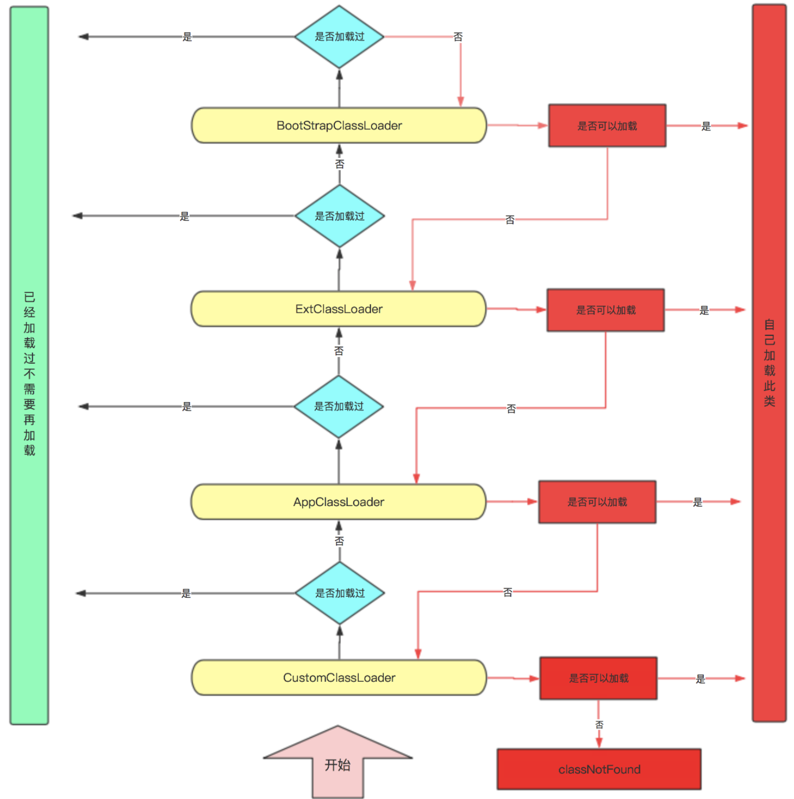
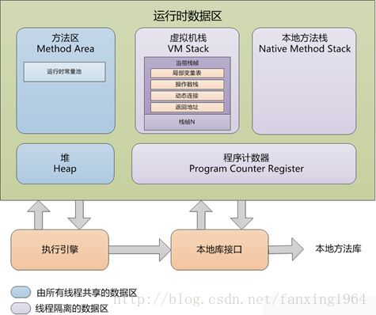

[TOC]

### **jvm 的主要组成部分？及其作用？**

- 类加载器（ClassLoader）
- 运行时数据区（Runtime Data Area）
- 执行引擎（Execution Engine）
- 本地库接口（Native Interface）

组件的作用： 首先通过类加载器（ClassLoader）会把 Java 代码转换成字节码，运行时数据区（Runtime Data Area）再把字节码加载到内存中，而字节码文件只是 JVM 的一套指令集规范，并不能直接交个底层操作系统去执行，因此需要特定的命令解析器执行引擎（Execution Engine），将字节码翻译成底层系统指令，再交由 CPU 去执行，而这个过程中需要调用其他语言的本地库接口（Native Interface）来实现整个程序的功能。

### 什么是双亲委派机制

当某个类加载器需要加载某个`.class`文件时，它首先把这个任务委托给他的上级类加载器，递归这个操作，如果上级的类加载器没有加载，自己才会去加载这个类。

类加载器的类别

BootstrapClassLoader（启动类加载器）
c++编写，加载java核心库 java.*,构造ExtClassLoader和AppClassLoader。由于引导类加载器涉及到虚拟机本地实现细节，开发者无法直接获取到启动类加载器的引用，所以不允许直接通过引用进行操作

ExtClassLoader （标准扩展类加载器）
java编写，加载扩展库，如classpath中的jre ，javax.*或者
java.ext.dir 指定位置中的类，开发者可以直接使用标准扩展类加载器。

AppClassLoader（系统类加载器）
java编写，加载程序所在的目录，如user.dir所在的位置的class

CustomClassLoader（用户自定义类加载器）
java编写,用户自定义的类加载器,可加载指定路径的class文件

****

### **jvm 运行时数据区？**

- 程序计数器
- 虚拟机栈
- 本地方法栈
- 堆
- 方法区

有的区域随着虚拟机进程的启动而存在，有的区域则依赖用户进程的启动和结束而创建和销毁。

### **类加载的执行过程？**

类加载分为以下 5 个步骤：

1. 加载：根据查找路径找到相应的 class 文件然后导入；
2. 检查：检查加载的 class 文件的正确性；
3. 准备：给类中的静态变量分配内存空间；
4. 解析：虚拟机将常量池中的符号引用替换成直接引用的过程。符号引用就理解为一个标示，而在直接引用直接指向内存中的地址；
5. 初始化：对静态变量和静态代码块执行初始化工作。

### **怎么判断对象是否可以被回收？**

一般有两种方法来判断：

- 引用计数器：为每个对象创建一个引用计数，有对象引用时计数器 +1，引用被释放时计数 -1，当计数器为 0 时就可以被回收。它有一个缺点不能解决循环引用的问题；
- 可达性分析：从 GC Roots 开始向下搜索，搜索所走过的路径称为引用链。当一个对象到 GC Roots 没有任何引用链相连时，则证明此对象是可以被回收的。

### **jvm 有哪些垃圾回收算法？**

- 标记-清除算法
- 标记-整理算法
- 复制算法
- 分代算法

### **jvm 有哪些垃圾回收器？**

- Serial：最早的单线程串行垃圾回收器。
- Serial Old：Serial 垃圾回收器的老年版本，同样也是单线程的，可以作为 CMS 垃圾回收器的备选预案。
- ParNew：是 Serial 的多线程版本。
- Parallel 和 ParNew 收集器类似是多线程的，但 Parallel 是吞吐量优先的收集器，可以牺牲等待时间换取系统的吞吐量。
- Parallel Old 是 Parallel 老生代版本，Parallel 使用的是复制的内存回收算法，Parallel Old 使用的是标记-整理的内存回收算法。
- CMS：一种以获得最短停顿时间为目标的收集器，非常适用 B/S 系统。
- G1：一种兼顾吞吐量和停顿时间的 GC 实现，是 JDK 9 以后的默认 GC 选项。

### **详细介绍一下 CMS 垃圾回收器？**

CMS 是英文 Concurrent Mark-Sweep 的简称，是以牺牲吞吐量为代价来获得最短回收停顿时间的垃圾回收器。对于要求服务器响应速度的应用上，这种垃圾回收器非常适合。在启动 JVM 的参数加上“-XX:+UseConcMarkSweepGC”来指定使用 CMS 垃圾回收器。

CMS 使用的是标记-清除的算法实现的，所以在 gc 的时候回产生大量的内存碎片，当剩余内存不能满足程序运行要求时，系统将会出现 Concurrent Mode Failure，临时 CMS 会采用 Serial Old 回收器进行垃圾清除，此时的性能将会被降低。

### **新生代垃圾回收器和老生代垃圾回收器都有哪些？有什么区别？**

- 新生代回收器：Serial、ParNew、Parallel Scavenge
- 老年代回收器：Serial Old、Parallel Old、CMS
- 整堆回收器：G1

新生代垃圾回收器一般采用的是复制算法，复制算法的优点是效率高，缺点是内存利用率低；老年代回收器一般采用的是标记-整理的算法进行垃圾回收。

### **简述分代垃圾回收器是怎么工作的？**

分代回收器有两个分区：老生代和新生代，新生代默认的空间占比总空间的 1/3，老生代的默认占比是 2/3。

新生代使用的是复制算法，新生代里有 3 个分区：Eden、To Survivor、From Survivor，它们的默认占比是 8:1:1，它的执行流程如下：

- 把 Eden + From Survivor 存活的对象放入 To Survivor 区；
- 清空 Eden 和 From Survivor 分区；
- From Survivor 和 To Survivor 分区交换，From Survivor 变 To Survivor，To Survivor 变 From Survivor。

每次在 From Survivor 到 To Survivor 移动时都存活的对象，年龄就 +1，当年龄到达 15（默认配置是 15）时，升级为老生代。大对象也会直接进入老生代。

老生代当空间占用到达某个值之后就会触发全局垃圾收回，一般使用标记整理的执行算法。以上这些循环往复就构成了整个分代垃圾回收的整体执行流程。

### **说一下 jvm 调优的工具？**

JDK 自带了很多监控工具，都位于 JDK 的 bin 目录下，其中最常用的是 jconsole 和 jvisualvm 这两款视图监控工具。

- jconsole：用于对 JVM 中的内存、线程和类等进行监控；
- jvisualvm：JDK 自带的全能分析工具，可以分析：内存快照、线程快照、程序死锁、监控内存的变化、gc 变化等。

### **常用的 jvm 调优的参数都有哪些？**

- -Xms2g：初始化推大小为 2g；
- -Xmx2g：堆最大内存为 2g；
- -XX:NewRatio=4：设置年轻的和老年代的内存比例为 1:4；
- -XX:SurvivorRatio=8：设置新生代 Eden 和 Survivor 比例为 8:2；
- –XX:+UseParNewGC：指定使用 ParNew + Serial Old 垃圾回收器组合；
- -XX:+UseParallelOldGC：指定使用 ParNew + ParNew Old 垃圾回收器组合；
- -XX:+UseConcMarkSweepGC：指定使用 CMS + Serial Old 垃圾回收器组合；
- -XX:+PrintGC：开启打印 gc 信息；
- -XX:+PrintGCDetails：打印 gc 详细信息。