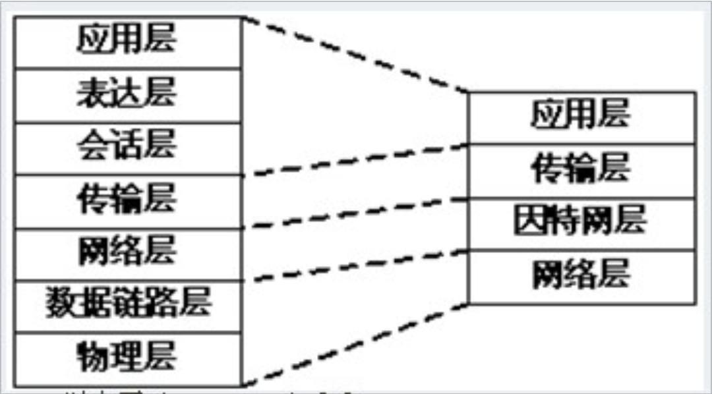
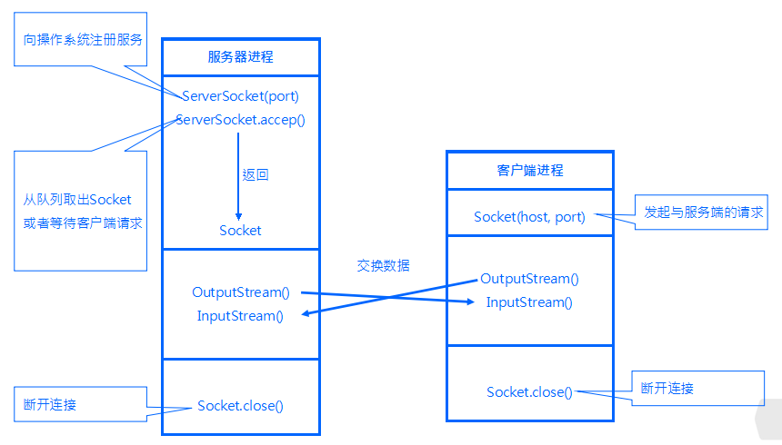

网络七层协议
------------

7 应用层 : telnet，HTTP,FTP,NFS,SMTP

6 表示层

5 会话层

4 传输层 : 是否选择差错恢复协议还是无差错恢复协议，TCP、UDP协议

3 网络层 ：对端到端的包传输进行定义，IP协议

2 数据链路层 :
数据链路的建立,拆除,对数据的检错,纠错是数据链路层的基本任务

1 物理层：有关传输介质的特性标准，提供传输媒体及其连接

网络四层层协议
--------------

实际的实现不是按七层开发来的，是四层。

七层协议中的物理层、会话层、表达层只是一种定义，实际上是没有实现的。

****

JAVA网络通信过程
----------------

\

Socket
------

构造函数

    Socket()
    Socket(InetAddress address, int port)throws UnknownHostException, IOException
    Socket(InetAddress address, int port, InetAddress localAddress, int localPort)throws IOException
    Socket(String host, int port)throws UnknownHostException, IOException
    Socket(String host, int port, InetAddress localAddress, int localPort)throws IOException

除去第一种不带参数的之外，其它构造函数会尝试建立与服务器的连接。如果失败会抛出IOException错误。如果成功，则返回Socket对象。

InetAddress是一个用于记录主机的类，其静态getHostByName(String
msg)可以返回一个实例，其静态方法getLocalHost()也可以获得当前主机的IP地址，并返回一个实例。

Socket(String host, int port, InetAddress localAddress, int
localPort)构造函数的参数分别为目标IP、目标端口、绑定本地IP、绑定本地端口。

主要方法：

    getInetAddress();    //远程服务端的IP地址
    getPort();    　　　//远程服务端的端口
    getLocalAddress()   //本地客户端的IP地址
    getLocalPort()    　//本地客户端的端口
    getInputStream();   //获得输入流
    getOutStream();    //获得输出流
    isClosed(); //连接是否已关闭，若关闭，返回true；否则返回false
    isConnect();　　//如果曾经连接过，返回true；否则返回false
    isBound();  //如果Socket已经与本地一个端口绑定，返回true；否则返回false

ServerSocket
------------

构造函数

    ServerSocket()throws IOException
    ServerSocket(int port)throws IOException
    ServerSocket(int port, int backlog)throws IOException
    ServerSocket(int port, int backlog, InetAddress bindAddr)throws IOException

注意点：

1.port服务端要监听的端口；backlog客户端连接请求的队列长度；bindAddr服务端绑定IP

2.如果端口被占用或者没有权限使用某些端口会抛出BindException错误。譬如1\~1023的端口需要管理员才拥有权限绑定。

3\. 如果设置端口为0，则系统会自动为其分配一个端口；

4.bindAddr用于绑定服务器IP，为什么会有这样的设置呢，譬如有些机器有多个网卡。

5.ServerSocket一旦绑定了监听端口，就无法更改。ServerSocket()可以实现在绑定端口前设置其他的参数。

多线程的ServerSocket示例：

    public void service(){
        while(true){
            Socket socket=null;
            try{
                socket=serverSocket.accept();    //主线程获取客户端连接
                Thread workThread=new Thread(new Handler(socket)); //创建线程
                workThread.start();  //启动线程
            }catch(Exception e){
                e.printStackTrace();
            }
        }
    }
    
    class Handler implements Runnable{
        private Socket socket;
        public Handler(Socket socket){
            this.socket=socket;
        }
        
        public void run(){
            try{
                System.out.println("新连接:"+socket.getInetAddress()+":"+socket.getPort());
                Thread.sleep(10000);
            }catch(Exception e){e.printStackTrace();}finally{
                try{
                    System.out.println("关闭连接:"+socket.getInetAddress()+":"+socket.getPort());
                    if(socket!=null)socket.close();
                }catch(IOException e){
                    e.printStackTrace();
                }
            }
        }
    }

URL对象示例
-----------

    URL url = new URL("http://www.cnblogs.com/linjiqin/");
    BufferedReader in = new BufferedReader(new InputStreamReader(url.openStream()));
    String inputLine;
    while ((inputLine = in.readLine()) != null) {
    System.out.println(inputLine);
    }
    in.close();

URLConnection示例
-----------------

通过URL的方法openStream()，我们只能从网络上读取数据，如果我们同时还想输出数据，例如向服务器端的CGI程序发送一些数据，我们必须先与URL建立连接，然后才能对其进行读写，这时就要用到类URLConnection了。

    //创建URL对象
    URL url=new URL("http://www.javasoft.com/cgi-bin/backwards");
    //由URL对象获取URLConnection对象
    URLConnection conn=url.openConnection();
    //由URLConnection获取输入流，并构造DataInputStream对象
    DataInputStream dis=new DataInputStream(conn.getInputStream()); 
    //由URLConnection获取输出流，并构造PrintStream对象
    PrintStream ps=new PrintStream(conn.getOutputStream());
    String line=dis.readLine(); 
    ps.println("client…"); //向服务器写出字符串 "client…"

DatagramSocket
--------------

DatagramSocket具有的主要方法如下：

receive(DatagramPacket
d)：接收数据报文到d中。receive方法产生一个"阻塞"。"阻塞"是一个专业名词，它会产生一个内部循环，使程序暂停在这个地方，直到一个条件触发。

send(DatagramPacket dp)：发送报文dp到目的地。

setSoTimeout(int timeout)：设置超时时间，单位为毫秒。

close()：关闭DatagramSocket。在应用程序退出的时候，通常会主动释放资源，关闭Socket，但是由于异常地退出可能造成资源无法回收。所以，应该在程序完成时，主动使用此方法关闭Socket，或在捕获到异常抛出后关闭Socket。

    DatagramSocket  server = new DatagramSocket(5050);

DatagramPacket
--------------

用于处理报文，它将Byte数组、目标地址、目标端口等数据包装成报文或者将报文拆卸成Byte数组。应用程序在产生数据包是应该注意，TCP/IP规定数据报文大小最多包含65507个，通常主机接收548个字节，但大多数平台能够支持8192字节大小的报文。

DatagramPacket类的构建器共有4个：

DatagramPacket(byte\[\] buf, int
length)：将数据包中Length长的数据装进Buf数组，一般用来接收客户端发送的数据。

DatagramPacket(byte\[\] buf, int offset, int
length)：将数据包中从Offset开始、Length长的数据装进Buf数组。

DatagramPacket(byte\[\] buf, int length, InetAddress clientAddress, int
clientPort)：从Buf数组中，取出Length长的数据创建数据包对象，目标是clientAddress地址，clientPort端口,通常用来发送数据给客户端。

DatagramPacket(byte\[\] buf, int offset, int length, InetAddress
clientAddress, int
clientPort)：从Buf数组中，取出Offset开始的、Length长的数据创建数据包对象，目标是clientAddress地址，clientPort端口，通常用来发送数据给客户端。

主要的方法如下：

getData(): 从实例中取得报文的Byte数组编码。

setDate(byte\[\] buf)：将byte数组放入要发送的报文中。