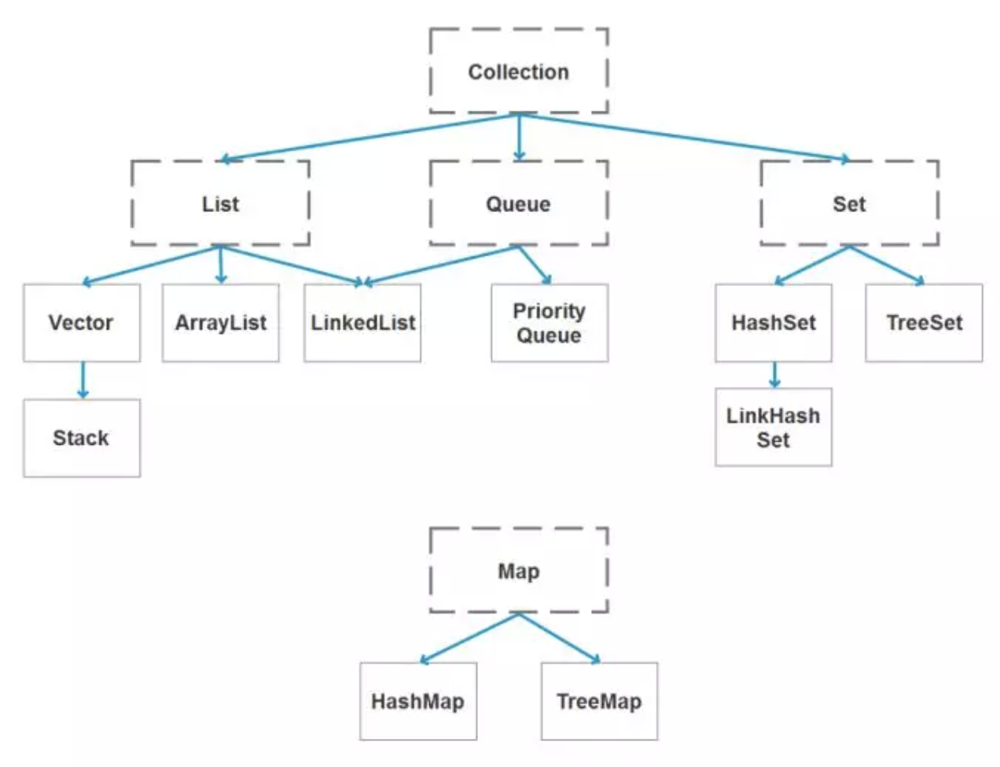

### **Java 基础**

  

#### **1\. JDK 和 JRE 有什么区别？**

*   JDK：Java Development Kit 的简称，java 开发工具包，提供了 java 的开发环境和运行环境。
    
*   JRE：Java Runtime Environment 的简称，java 运行环境，为 java 的运行提供了所需环境。
    

具体来说 JDK 其实包含了 JRE，同时还包含了编译 java 源码的编译器 javac，还包含了很多 java 程序调试和分析的工具。简单来说：如果你需要运行 java 程序，只需安装 JRE 就可以了，如果你需要编写 java 程序，需要安装 JDK。

#### **2\. == 和 equals 的区别是什么？**  

**\== 解读**

对于基本类型和引用类型 == 的作用效果是不同的，如下所示：

*   基本类型：比较的是值是否相同；
    
*   引用类型：比较的是引用是否相同；
    

代码示例：

```plain
String x = "string";
String y = "string";
String z = new String("string");
System.out.println(x==y); // true
System.out.println(x==z); // false
System.out.println(x.equals(y)); // true
System.out.println(x.equals(z)); // true
```

代码解读：因为 x 和 y 指向的是同一个引用，所以 == 也是 true，而 new String()方法则重写开辟了内存空间，所以 == 结果为 false，而 equals 比较的一直是值，所以结果都为 true。

**equals 解读**

equals 本质上就是 ==，只不过 String 和 Integer 等重写了 equals 方法，把它变成了值比较。看下面的代码就明白了。

首先来看默认情况下 equals 比较一个有相同值的对象，代码如下：

```plain
class Cat {
    public Cat(String name) {
        this.name = name;
    }

    private String name;

    public String getName() {
        return name;
    }

    public void setName(String name) {
        this.name = name;
    }
}

Cat c1 = new Cat("王磊");
Cat c2 = new Cat("王磊");
System.out.println(c1.equals(c2)); // false
```

输出结果出乎我们的意料，竟然是 false？这是怎么回事，看了 equals 源码就知道了，源码如下：

```plain
public boolean equals(Object obj) {
    return (this == obj);
}
```

原来 equals 本质上就是 ==。

那问题来了，两个相同值的 String 对象，为什么返回的是 true？代码如下：

```plain
String s1 = new String("老王");
String s2 = new String("老王");
System.out.println(s1.equals(s2)); // true
```

同样的，当我们进入 String 的 equals 方法，找到了答案，代码如下：

```plain
public boolean equals(Object anObject) {
    if (this == anObject) {
        return true;
    }
    if (anObject instanceof String) {
        String anotherString = (String)anObject;
        int n = value.length;
        if (n == anotherString.value.length) {
            char v1[] = value;
            char v2[] = anotherString.value;
            int i = 0;
            while (n-- != 0) {
                if (v1[i] != v2[i])
                    return false;
                i++;
            }
            return true;
        }
    }
    return false;
}
```

原来是 String 重写了 Object 的 equals 方法，把引用比较改成了值比较。

**总结** ：== 对于基本类型来说是值比较，对于引用类型来说是比较的是引用；而 equals 默认情况下是引用比较，只是很多类重新了 equals 方法，比如 String、Integer 等把它变成了值比较，所以一般情况下 equals 比较的是值是否相等。  

#### **3\. 两个对象的 hashCode()相同，则 equals()也一定为 true，对吗？**

不对，两个对象的 hashCode()相同，equals()不一定 true。

代码示例：  

```plain
String str1 = "通话";
String str2 = "重地";
System.out.println(String.format("str1：%d | str2：%d",  str1.hashCode(),str2.hashCode()));
System.out.println(str1.equals(str2));
```

执行的结果：

```
str1：1179395 | str2：1179395
false
```

代码解读：很显然“通话”和“重地”的 hashCode() 相同，然而 equals() 则为 false，因为在散列表中，hashCode()相等即两个键值对的哈希值相等，然而哈希值相等，并不一定能得出键值对相等。  

#### **4\. final 在 java 中有什么作用？**

*   final 修饰的类叫最终类，该类不能被继承。
    
*   final 修饰的方法不能被重写。
    
*   final 修饰的变量叫常量，常量必须初始化，初始化之后值就不能被修改。
    

#### **5\. java 中的 Math.round(-1.5) 等于多少？**

等于 -1，因为在数轴上取值时，中间值（0.5）向右取整，所以正 0.5 是往上取整，负 0.5 是直接舍弃。

#### **6\. String 属于基础的数据类型吗？**

String 不属于基础类型，基础类型有 8 种：byte、boolean、char、short、int、float、long、double，而 String 属于对象。

#### **7\. java 中操作字符串都有哪些类？它们之间有什么区别？**

操作字符串的类有：String、StringBuffer、StringBuilder。

String 和 StringBuffer、StringBuilder 的区别在于 String 声明的是不可变的对象，每次操作都会生成新的 String 对象，然后将指针指向新的 String 对象，而 StringBuffer、StringBuilder 可以在原有对象的基础上进行操作，所以在经常改变字符串内容的情况下最好不要使用 String。

StringBuffer 和 StringBuilder 最大的区别在于，StringBuffer 是线程安全的，而 StringBuilder 是非线程安全的，但 StringBuilder 的性能却高于 StringBuffer，所以在单线程环境下推荐使用 StringBuilder，多线程环境下推荐使用 StringBuffer。

####   **8\. String str="i"与 String str=new String("i")一样吗？**

  不一样，因为内存的分配方式不一样。String str="i"的方式，java 虚拟机会将其分配到常量池中；而 String str=new String("i") 则会被分到堆内存中。

#### **9\. 如何将字符串反转？**

使用 StringBuilder 或者 stringBuffer 的 reverse() 方法。

示例代码：

```plain
// StringBuffer reverse
StringBuffer stringBuffer = new StringBuffer();
stringBuffer.append("abcdefg");
System.out.println(stringBuffer.reverse()); // gfedcba
// StringBuilder reverse
StringBuilder stringBuilder = new StringBuilder();
stringBuilder.append("abcdefg");
System.out.println(stringBuilder.reverse()); // gfedcba
```

#### **10\. String 类的常用方法都有那些？**

*   indexOf()：返回指定字符的索引。
    
*   charAt()：返回指定索引处的字符。
    
*   replace()：字符串替换。
    
*   trim()：去除字符串两端空白。
    
*   split()：分割字符串，返回一个分割后的字符串数组。
    
*   getBytes()：返回字符串的 byte 类型数组。
    
*   length()：返回字符串长度。
    
*   toLowerCase()：将字符串转成小写字母。
    
*   toUpperCase()：将字符串转成大写字符。
    
*   substring()：截取字符串。
    
*   equals()：字符串比较。
    

#### **11\. 抽象类必须要有抽象方法吗？**

不需要，抽象类不一定非要有抽象方法。

  示例代码：

```plain
abstract class Cat {
    public static void sayHi() {
        System.out.println("hi~");
    }
}
```

上面代码，抽象类并没有抽象方法但完全可以正常运行。

#### **12\. 普通类和抽象类有哪些区别？**

*   普通类不能包含抽象方法，抽象类可以包含抽象方法。
    
*   抽象类不能直接实例化，普通类可以直接实例化。
    

#### **13\. 抽象类能使用 final 修饰吗？**

不能，定义抽象类就是让其他类继承的，如果定义为 final 该类就不能被继承，这样彼此就会产生矛盾，所以 final 不能修饰抽象类  

#### **14\. 接口和抽象类有什么区别？**

*   实现：抽象类的子类使用 extends 来继承；接口必须使用 implements 来实现接口。
    
*   构造函数：抽象类可以有构造函数；接口不能有。
    
*   main 方法：抽象类可以有 main 方法，并且我们能运行它；接口不能有 main 方法。
    
*   实现数量：类可以实现很多个接口；但是只能继承一个抽象类。
    
*   访问修饰符：接口中的方法默认使用 public 修饰；抽象类中的方法可以是任意访问修饰符。
    

#### **15\. java 中 IO 流分为几种？**

按功能来分：输入流（input）、输出流（output）。

按类型来分：字节流和字符流。  

字节流和字符流的区别是：字节流按 8 位传输以字节为单位输入输出数据，字符流按 16 位传输以字符为单位输入输出数据。

#### **16\. BIO、NIO、AIO 有什么区别？**

*   BIO：Block IO 同步阻塞式 IO，就是我们平常使用的传统 IO，它的特点是模式简单使用方便，并发处理能力低。
    
*   NIO：New IO 同步非阻塞 IO，是传统 IO 的升级，客户端和服务器端通过 Channel（通道）通讯，实现了多路复用。
    
*   AIO：Asynchronous IO 是 NIO 的升级，也叫 NIO2，实现了异步非堵塞 IO ，异步 IO 的操作基于事件和回调机制。  
    

#### **17\. Files的常用方法都有哪些？**

*   Files.exists()：检测文件路径是否存在。
    
*   Files.createFile()：创建文件。
    
*   Files.createDirectory()：创建文件夹。
    
*   Files.delete()：删除一个文件或目录。
    
*   Files.copy()：复制文件。
    
*   Files.move()：移动文件。
    
*   Files.size()：查看文件个数。
    
*   Files.read()：读取文件。
    
*   Files.write()：写入文件。

#### **18. java 容器都有哪些？**

常用容器的图录：



#### **19. Collection 和 Collections 有什么区别？**

- java.util.Collection 是一个集合接口（集合类的一个顶级接口）。它提供了对集合对象进行基本操作的通用接口方法。Collection接口在Java 类库中有很多具体的实现。Collection接口的意义是为各种具体的集合提供了最大化的统一操作方式，其直接继承接口有List与Set。
- Collections则是集合类的一个工具类/帮助类，其中提供了一系列静态方法，用于对集合中元素进行排序、搜索以及线程安全等各种操作。

#### **20. List、Set、Map 之间的区别是什么？**


#### **21. HashMap 和 Hashtable 有什么区别？**

- hashMap去掉了HashTable 的contains方法，但是加上了containsValue（）和containsKey（）方法。
- hashTable同步的，而HashMap是非同步的，效率上逼hashTable要高。
- hashMap允许空键值，而hashTable不允许。

#### **22. 如何决定使用 HashMap 还是 TreeMap？**

对于在Map中插入、删除和定位元素这类操作，HashMap是最好的选择。然而，假如你需要对一个有序的key集合进行遍历，TreeMap是更好的选择。基于你的collection的大小，也许向HashMap中添加元素会更快，将map换为TreeMap进行有序key的遍历。

#### **23. 说一下 HashMap 的实现原理？**

HashMap概述：HashMap是基于哈希表的Map接口的非同步实现。此实现提供所有可选的映射操作，并允许使用null值和null键。此类不保证映射的顺序，特别是它不保证该顺序恒久不变。 

HashMap的数据结构：在java编程语言中，最基本的结构就是两种，一个是数组，另外一个是模拟指针（引用），所有的数据结构都可以用这两个基本结构来构造的，HashMap也不例外。HashMap实际上是一个“链表散列”的数据结构，即数组和链表的结合体。

当我们往Hashmap中put元素时,首先根据key的hashcode重新计算hash值,根绝hash值得到这个元素在数组中的位置(下标),如果该数组在该位置上已经存放了其他元素,那么在这个位置上的元素将以链表的形式存放,新加入的放在链头,最先加入的放入链尾.如果数组中该位置没有元素,就直接将该元素放到数组的该位置上。

需要注意Jdk 1.8中对HashMap的实现做了优化,当链表中的节点数据超过八个之后,该链表会转为红黑树来提高查询效率,从原来的O(n)到O(logn)

#### **24. 说一下 HashSet 的实现原理？**

- HashSet底层由HashMap实现
- HashSet的值存放于HashMap的key上
- HashMap的value统一为PRESENT

#### **25. ArrayList 和 LinkedList 的区别是什么？**

最明显的区别是 ArrrayList底层的数据结构是数组，支持随机访问，而 LinkedList 的底层数据结构是双向循环链表，不支持随机访问。使用下标访问一个元素，ArrayList 的时间复杂度是 O(1)，而 LinkedList 是 O(n)。

#### **26. 如何实现数组和 List 之间的转换？**

- List转换成为数组：调用ArrayList的toArray方法。
- 数组转换成为List：调用Arrays的asList方法。

#### **27. ArrayList 和 Vector 的区别是什么？**

- Vector是同步的，而ArrayList不是。然而，如果你寻求在迭代的时候对列表进行改变，你应该使用CopyOnWriteArrayList。 
- ArrayList比Vector快，它因为有同步，不会过载。 
- ArrayList更加通用，因为我们可以使用Collections工具类轻易地获取同步列表和只读列表。

#### **28. Array 和 ArrayList 有何区别？**

- Array可以容纳基本类型和对象，而ArrayList只能容纳对象。 
- Array是指定大小的，而ArrayList大小是固定的。 
- Array没有提供ArrayList那么多功能，比如addAll、removeAll和iterator等。

#### **29. 在 Queue 中 poll()和 remove()有什么区别？**

poll() 和 remove() 都是从队列中取出一个元素，但是 poll() 在获取元素失败的时候会返回空，但是 remove() 失败的时候会抛出异常。

#### **30. 哪些集合类是线程安全的？**

- vector：就比arraylist多了个同步化机制（线程安全），因为效率较低，现在已经不太建议使用。在web应用中，特别是前台页面，往往效率（页面响应速度）是优先考虑的。
- statck：堆栈类，先进后出。
- hashtable：就比hashmap多了个线程安全。
- enumeration：枚举，相当于迭代器。

#### **31. 迭代器 Iterator 是什么？**

迭代器是一种设计模式，它是一个对象，它可以遍历并选择序列中的对象，而开发人员不需要了解该序列的底层结构。迭代器通常被称为“轻量级”对象，因为创建它的代价小。

#### **32. Iterator 怎么使用？有什么特点？**

Java中的Iterator功能比较简单，并且只能单向移动：

(1) 使用方法iterator()要求容器返回一个Iterator。第一次调用Iterator的next()方法时，它返回序列的第一个元素。注意：iterator()方法是java.lang.Iterable接口,被Collection继承。

(2) 使用next()获得序列中的下一个元素。

(3) 使用hasNext()检查序列中是否还有元素。　　

(4) 使用remove()将迭代器新返回的元素删除。

Iterator是Java迭代器最简单的实现，为List设计的ListIterator具有更多的功能，它可以从两个方向遍历List，也可以从List中插入和删除元素。

#### **33. Iterator 和 ListIterator 有什么区别？**

- Iterator可用来遍历Set和List集合，但是ListIterator只能用来遍历List。 
- Iterator对集合只能是前向遍历，ListIterator既可以前向也可以后向。 
- ListIterator实现了Iterator接口，并包含其他的功能，比如：增加元素，替换元素，获取前一个和后一个元素的索引，等等。