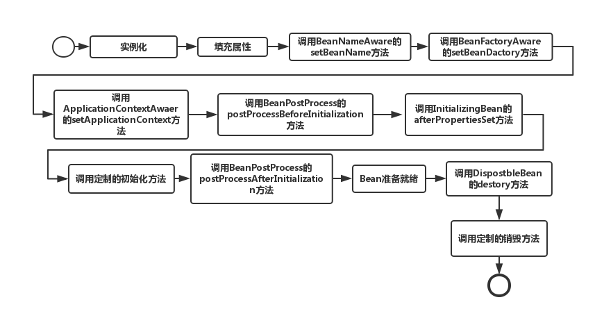
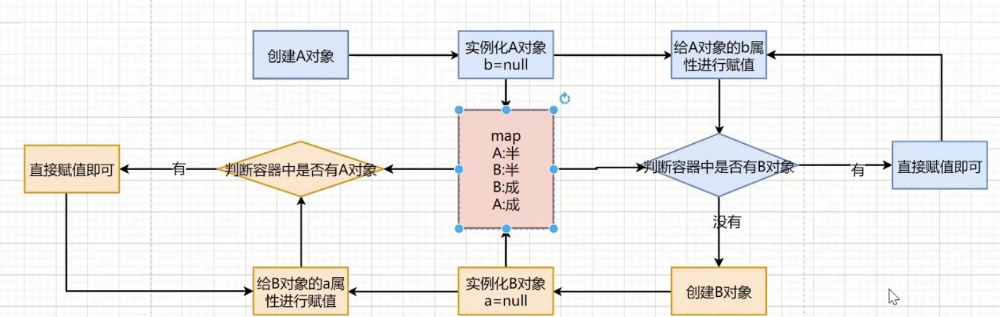
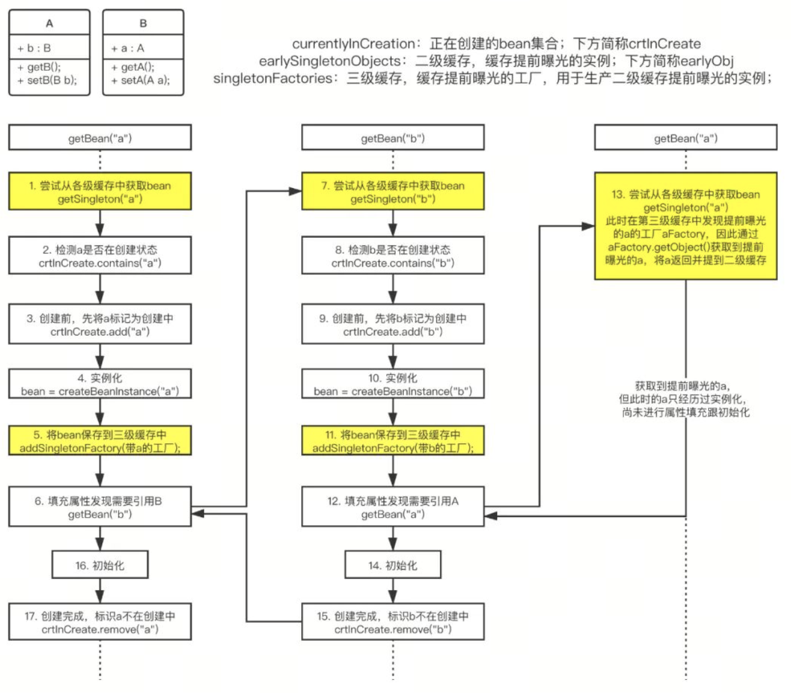

# spring ioc

控制反转、依赖注入，相当于咱不需要自己创建对象，不需要关注对象创建的过程了，要啥对象直接向Spring容器索要即可（Spring 通过反射创建），而我们只需要告诉它需要什么样的对象（bean，bean定义，xml或者注解配置）

控制反转，把对象创建和对象之间的调用过程交给Spring管理，为了降低耦合度。

优点

控制反转和依赖注入降低了应用的代码量。
松耦合，便于维护。
支持加载服务时的饿汉式初始化和懒加载。

## 底层原理

XML解析、工厂模式、反射。

这种设计模式是怎么来的呢？是实践中逐渐形成的。

第一阶段：用普通的无模式来写Java程序。一般初学者都要经过这个阶段。

第二阶段：频繁的开始使用接口，这时，接口一般都会伴随着使用工厂模式。

第三阶段：使用IoC模式。工厂模式还不够好：（1）因为的类的生成代码写死在程序里，如果你要换一个子类，就要修改工厂方法。（2）一个接口常常意味着一个生成工厂，会多出很多工厂类。

## 示例

pom.xml引入依赖

``` xml
        <dependency>
            <groupId>org.springframework</groupId>
            <artifactId>spring-context</artifactId>
            <version>5.2.8.RELEASE</version> <!-- 使用你需要的版本 -->
        </dependency>
```

创建一个对象

``` java
  public class DemoService {
      DemoDao dao;
      public void setDao(DemoDao dao) {
          this.dao = dao;
      }
      public void hello(){
          System.out.println("hello from demo service");
          dao.hello();
      }
  }

  public class DemoDao {
    public void hello(){
        System.out.println("hello from demo dao");
    }
  }
```

创建spring配置文件

``` xml
  <?xml version="1.0" encoding="UTF-8"?>
  <beans xmlns="http://www.springframework.org/schema/beans"
         xmlns:xsi="http://www.w3.org/2001/XMLSchema-instance"
         xsi:schemaLocation="http://www.springframework.org/schema/beans
                             http://www.springframework.org/schema/beans/spring-beans.xsd">

    <bean id="demoService" class="com.onekbase.demo.spring.service.DemoService">
      <property name="dao" ref="demoDao"></property>
    </bean>
    <bean id="demoDao" class="com.onekbase.demo.spring.dao.DemoDao"/>

  </beans>
```

创建Main文件

``` java
public class SpringXmlMain {
    public static void main(String[] args) {
        ApplicationContext context = new ClassPathXmlApplicationContext("spring-ioc.xml");
        DemoService s = context.getBean("demoService", DemoService.class);
        s.hello();
    }
}
```


## Bean的作用域

- singleton：单例，Spring中的bean默认都是单例的。
- prototype：每次请求都会创建⼀个新的bean实例。
- request：每⼀次HTTP请求都会产⽣⼀个新的bean，该bean仅在当前HTTP request内有效。
- session：每⼀次HTTP请求都会产⽣⼀个新的bean，该bean仅在当前HTTP session内有效。
- global-session：全局session作⽤域。


## IOC接口

IOC思想基于IOC容器完成，IOC容器底层就是对象工厂。

Spring提供两种实现IOC容器的方式：

1. BeanFactory：IOC容器的基本实现，Spring内部的接口，一般不提供开发人员使用。
   - 特点：加载配置文件的时候并不会创建bean，在用到的时候才会创建。
2. ApplicationContext：BeanFactory的子接口，提供更多强大功能，一般开发人员使用。
   - 特点：加载配置文件的时候同时创建bean。
   - ApplicationContext接口实现类
     - FileSystemXmlApplicationContext(“盘符路径（绝对路径）”)
     - ClassPathXmlApplicationContext(“src目录下类路径”)

## IOC容器初始化

- 初始化过程：BeanDefinition的资源定位、解析、注册。
  - 从XML读取配置文件。
  - 解析成BeanDefinition，并注入到BeanDefinition实例中。
  - 将BeanDefinition注册到容器BeanDefinitionMap中。
  - BeanFactory根据BeanDefinition的定义信息创建实例化和初始化Bean。
- 单例Bean的初始化以及依赖注入一般都在容器的初始化阶段进行，除非设置了懒加载 lazy-inint为true的单例bean就是在第一次调用getBean() 方法的会后进行初始化和依赖注入。
- 多例Bean在容器启动时不实例化，必须要在getBean调用的时候才实例化。
- loadBeanDefinitions 采⽤了模板模式，具体加载 BeanDefinition 的逻辑由各个⼦类完成。

## FactoryBean

Spring 有两种类型bean，一种普通bean，另外一种工厂bean(FactoryBean)

（1）普通bean在配置文件中，定义bean类型就是返回类型

（2）工厂bean在配置文件中定义bean类型可以和返回类型不一样

第一步创建类，让这个类作为工厂Bean，实现接口FactoryBean

第二步实现接口里的方法，在实现方法中定义返回的bean类型

一个Bean如果实现了FactoryBean接口，那么根据该Bean的名称获取到的实际上是getObject()返回的对象，而不是这个Bean自身实例，如果要获取这个Bean自身实例，那么需要在名称前面加上’&’符号。

通常是⽤来创建⽐较复杂的bean，⼀般的bean 直接⽤xml配置即可，但如果⼀个bean的创建过程中涉及到很多其他的bean 和复杂的逻辑，直接⽤xml配置⽐较⿇烦，这时可以考虑⽤FactoryBean，可以隐藏实例化复杂Bean的细节。

## 条件装配

- @Profile：这是 Spring 的注解，这个注解表示只有当特定的Profile被激活时，才创建带有该注解的Bean，我们可以在应用的配置文件中设置激活的Profile。
- @Conditional：这是 Spring 的注解，它接受一个或多个Condition类，这些类需要实现Condition接口，并重写其matches方法。只有当所有Condition类的matches方法都返回true时，带有@Conditional注解的Bean才会被创建。
- @ConditionalOnProperty：这个注解表示只有当一个或多个给定的属性有特定的值时，才创建带有该注解的Bean。
- @ConditionalOnClass 和 @ConditionalOnMissingClass：这两个注解表示只有当Classpath中有（或没有）特定的类时，才创建带有该注解的Bean。
- @ConditionalOnBean 和 @ConditionalOnMissingBean：这两个注解表示只有当Spring ApplicationContext中有（或没有）特定的Bean时，才创建带有该注解的Bean。
- 
## bean生命周期

Spring Bean的生命周期分为四个阶段和多个扩展点。扩展点又可以分为影响多个Bean和影响单个Bean。

 四个阶段

- 实例化 Instantiation
- 属性赋值 Populate
- 初始化 Initialization
- 销毁 Destruction

多个扩展点

- 影响多个Bean
  - BeanPostProcessor
  - InstantiationAwareBeanPostProcessor
- 影响单个Bean
  - Aware
    - Aware Group1
      - BeanNameAware
      - BeanClassLoaderAware
      - BeanFactoryAware
    - Aware Group2
      - EnvironmentAware
      - EmbeddedValueResolverAware
      - ApplicationContextAware(ResourceLoaderAware\ApplicationEventPublisherAware\MessageSourceAware)
  - 生命周期
    - InitializingBean
    - DisposableBean




对象创建

1. 从xml配置的Bean,@Bean注解，或者Java代码BeanDefinitionBuilder中读取Bean的定义,实例化Bean对象；
2. 设置Bean的属性；
3. 注入Aware的依赖（BeanNameAware,BeanFactoryAware,ApplicationContextAware）;
4. 执行通用的方法前置处理，方法： BeanPostProcessor.postProcessorBeforeInitialization()
5. 执行 InitalizingBean.afterPropertiesSet() 方法
6. 执行Bean自定义的初始化方法init,或者 @PostConstruct 标注的方法；
7. 执行方法BeanPostProcessor.postProcessorAfterInitialization()
8. 创建对象完毕；

对象销毁

1. 执行 DisposableBean.destory() 方法；
2. 执行自定义的destory方法或者 @PreDestory 标注的方法；
3. 销毁对象完毕

``` java

public class LifeBean implements BeanNameAware, BeanFactoryAware,
        ApplicationContextAware, InitializingBean, DisposableBean {

    private String testName;

    public LifeBean(){
        System.out.println("LifeBean Initializing ");
    }

    public void setBeanFactory(BeanFactory beanFactory) throws BeansException {
        System.out.println("LifeBean.setBeanFactory invoke");
    }

    public void setBeanName(String name) {
        System.out.println("LifeBean.setBeanName invoke");
    }

    public void destroy() throws Exception {
        System.out.println("LifeBean.destory invoke");
    }

    public void afterPropertiesSet() throws Exception {
        System.out.println("LifeBean.afterPropertiesSet invoke");
    }

    public void setApplicationContext(ApplicationContext applicationContext) throws BeansException {
        System.out.println("LifeBean.setApplicationContext invoke");
    }

    public String getTestName() {
        return testName;
    }

    public void setTestName(String testName) {
        this.testName = testName;
        System.out.println("setTestName: " + testName);
    }

    public void myPostConstruct(){
        System.out.println("LifeBean.myPostConstruct invoke");
    }

    // 自定义初始化方法
    @PostConstruct
    public void springPostConstruct(){
        System.out.println("LifeBean @PostConstruct");
    }

    public void myPreDestory(){
        System.out.println("LifeBean.myPreDestory invoke");
        System.out.println("---------------destroy-----------------");
    }

    // 自定义销毁方法
    @PreDestroy
    public void springPreDestory(){
        System.out.println("LifeBean @PreDestory");
    }

    @Override
    protected void finalize() throws Throwable {
        System.out.println("------inside finalize-----");
    }
}
```

``` java
public class SubLifeBean extends LifeBean implements BeanClassLoaderAware,
        EnvironmentAware, EmbeddedValueResolverAware, ResourceLoaderAware,
        ApplicationEventPublisherAware,MessageSourceAware{

    private String subName;

    public SubLifeBean(){
        System.out.println("SubLifeBean Initializing ");
    }

    public String getSubName() {
        return subName;
    }

    public void setSubName(String subName) {
        System.out.println("setSubName:"+subName);
        this.subName = subName;
    }

    public void setBeanClassLoader(ClassLoader classLoader) {
        System.out.println("SubLifeBean.setBeanClassLoader invoke");
    }

    public void setApplicationEventPublisher(ApplicationEventPublisher applicationEventPublisher) {
        System.out.println("SubLifeBean.setApplicationEventPublisher invoke");
    }

    public void setEmbeddedValueResolver(StringValueResolver resolver) {
        System.out.println("SubLifeBean.setEmbeddedValueResolver invoke");
    }

    public void setEnvironment(Environment environment) {
        System.out.println("SubLifeBean.setEnvironment invoke");
    }

    public void setMessageSource(MessageSource messageSource) {
        System.out.println("SubLifeBean.setMessageSource invoke");
    }

    public void setResourceLoader(ResourceLoader resourceLoader) {
        System.out.println("SubLifeBean.setResourceLoader invoke");
    }

    @Override
    public String toString() {
        return "SubLifeBean{" +
                "subName='" + subName + '\'' +
                '}';
    }
}

```

``` java
public class MyBeanPostProcessor implements BeanPostProcessor {
    public Object postProcessBeforeInitialization(Object bean, String beanName) throws BeansException {
        if(bean instanceof LifeBean){
            System.out.println("MyBeanPostProcessor.postProcessBeforeInitialization");
        }
        return bean;
    }
    public Object postProcessAfterInitialization(Object bean, String beanName) throws BeansException {
        if(bean instanceof LifeBean){
            System.out.println("MyBeanPostProcessor.postProcessAfterInitialization");
        }
        return bean;
    }
}
```

``` xml
  <context:component-scan base-package="com.onekbase" />

  <bean id="lifeBean" class="com.onekbase.demo.spring.bean.SubLifeBean" init-method="myPostConstruct" destroy-method="myPreDestory">
      <property name="testName" value="test set value"/>
      <property name="subName" value="test set sub value"/>
  </bean>

  <bean class="com.onekbase.demo.spring.bean.MyBeanPostProcessor"/>
```

``` java
public class SpringLifeMain {
    public static void main(String[] args) {
        ApplicationContext context = new ClassPathXmlApplicationContext("spring-ioc-life.xml");
        SubLifeBean bean = context.getBean("lifeBean", SubLifeBean.class);
        System.out.println(bean);
        ((ClassPathXmlApplicationContext) context).registerShutdownHook();
    }
}
```

``` 
LifeBean Initializing 
SubLifeBean Initializing 
setTestName: test set value
setSubName:test set sub value
LifeBean.setBeanName invoke
SubLifeBean.setBeanClassLoader invoke
LifeBean.setBeanFactory invoke
SubLifeBean.setEnvironment invoke
SubLifeBean.setEmbeddedValueResolver invoke
SubLifeBean.setResourceLoader invoke
SubLifeBean.setApplicationEventPublisher invoke
SubLifeBean.setMessageSource invoke
LifeBean.setApplicationContext invoke
MyBeanPostProcessor.postProcessBeforeInitialization
LifeBean @PostConstruct
LifeBean.afterPropertiesSet invoke
LifeBean.myPostConstruct invoke
MyBeanPostProcessor.postProcessAfterInitialization
SubLifeBean{subName='test set sub value'}
LifeBean @PreDestory
LifeBean.destory invoke
LifeBean.myPreDestory invoke
---------------destroy-----------------
```

## 源码分析

ApplicationContext context = new ClassPathXmlApplicationContext("spring-ioc.xml");

- refresh()
  - obtainFreshBeanFactory() //创建beanFactory，注册BeanDefinition
    - AbstractRefreshableApplicationContext.refreshBeanFactory()
      - createBeanFactory();
      - customizeBeanFactory(beanFactory) //设置是否可以覆盖bean和循环依赖
      - AbstractXmlApplicationContext.loadBeanDefinitions(beanFactory)
        - 创建 XmlBeanDefinitionReader
        - loadBeanDefinitions(beanDefinitionReader)
          - AbstractBeanDefinitionReader.loadBeanDefinitions(location)
          - XmlBeanDefinitionReader.registerBeanDefinitions()
          - DefaultBeanDefinitionDocumentReader.doRegisterBeanDefinitions()
            - parseDefaultElement()
            - processBeanDefinition()
              - DefaultListableBeanFactory.registerBeanDefinition() // 注册bean定义
  - prepareBeanFactory(beanFactory) // 初始化bean工厂
  - invokeBeanFactoryPostProcessors(beanFactory) // 激活所有BeanFactoryPostProcessor
  - registerBeanPostProcessors(beanFactory)
  - initApplicationEventMulticaster() // 注册一个事件广播器
  - onRefresh() // 自定义context加载bean
  - registerListeners() // 注册ApplicationListener
  - finishBeanFactoryInitialization(beanFactory) // 完成beanFactory的创建
    - beanFactory.freezeConfiguration() // 所有bean配置冻结，允许缓存
    - beanFactory.preInstantiateSingletons() // 创建Singleton的Bean
      - AbstractAutowireCapableBeanFactory.doCreateBean() // 实际创建bean的方法
        - populateBean() // 创建Bean注入的其他Bean
          - BeanDefinitionValueResolver.resolveReference() // 创建依赖的bean
        - initializeBean() // 初始化bean属性
          - invokeAwareMethods(beanName, bean) //
            - BeanNameAware.setBeanName(beanName)
            - BeanClassLoaderAware.setBeanClassLoader(bcl)
            - BeanFactoryAware.setBeanFactory(）
          - applyBeanPostProcessorsBeforeInitialization(wrappedBean, beanName)
          - invokeInitMethods(beanName, wrappedBean, mbd) // 调用afterPropertiesSet方法
          - applyBeanPostProcessorsAfterInitialization(wrappedBean, beanName)
  - finishRefresh() // 完成
    - clearResourceCaches()
    - initLifecycleProcessor()
    - getLifecycleProcessor().onRefresh()
    - publishEvent(new ContextRefreshedEvent(this))
    - 

context.getBean

- AbstractBeanFactory.doGetBean
- getSingleton // 对于单例bean在初始化时就创建了，这里只是获取一下

## 循环依赖


#+DOWNLOADED: screenshot @ 2023-09-23 20:56:35


核心方法：

getBean() -> doGetBean() -> createBean() -> doCreateBean() -> createBeanInstance() -> doCreateBeanInstance()

需要用两个map将半成品对象和成品对象分开，那为啥还要用到三级缓存呢？

三个map也就是三级缓存中，分别存储的什么对象？
  - 一级缓存：成品对象
  - 二级缓存：半成品对象
  - 三级缓存：lambda表达式（getEarlyBeanReference()）
    
三个map缓存的查找顺序是什么样的？

先查一级缓存找不到二级，再找不到三级。

如果只有一个map缓存，能不能解决循环依赖的问题？

不能，如果只有一个map，成品和半成品都要放在一个map中，而半成品对象是不能给外部使用的，所以必须做区分，否则就有可能暴露半成品。

如果只有两个map缓存，能否解决循环依赖问题？

能，但是有前提条件：循环依赖中不包含aop的处理逻辑

为什么三级缓存能够解决循环依赖中包含代理对象的问题？
    
创建代理对象的时候需要创建原始对象
同一个容器中不能出现同名的两个不同的对象。
如果一个对象被代理，那么代理对象创建完成之后应该覆盖原始对象
在getEarlyBeanReference中，会判断是否需要代理对象，如果有了，就要覆盖。

在对象对外暴露的时候，如何准确的给出原始对象或者代理对象？

因为正常创建代理对象的地方在BPP的后置处理器中，而解决循环依赖问题的时候没执行到那里，因此就用了lambda表达式了，就是一种回调机制，在程序判断需要对外暴露的时候，就执行表达式。




提前曝光，如果用 C 语言的说法就是将指针曝光出去，用 java 就是将引用对象曝光出去。也就是说即便 a 对象还未创建完成，但是在④实例化过程中 new A() 动作已经开辟了一块内存空间，只需要将该地址抛出去 b 就可以引用的到，而不管 a 后期还会进行初始化等其他操作；

已经了解了提前曝光的作用，而相比而言⑤曝光的时机也非常的重要，该时机发生在④实例化之后，⑥填充与⑯ 初始化之前。Spring 循环依赖之所以不能解决实例化注入的原因正式因为注入时机在曝光之前所导致；

第五步

addSingletonFactory(beanName, () -> getEarlyBeanReference(beanName, mbd, bean));

getEarlyBeanReference 目的就是为了后置处理，给一个在提前曝光时操作 bean 的机会，具体要怎么操作 bean，那就继承 SmartInstantiationAwareBeanPostProcessor 重写 getEarlyBeanReference 方法。关键就在于 bean 被曝光到三级缓存时并没用使用提前曝光的后置处理，而是当三级缓存被提前引用到二级缓存时才触发！

在 Spring 的源码中，真正实现这个方法的只有 AbstractAutoProxyCreator 这个类，用于提前曝光的 AOP 代理。

单例构造器注入循环依赖

这个方式是不行的，原因是依赖注入的时间点不对，他的依赖注入发生在构造器阶段，这个时候连实例都没有，内存都还没开辟完，当然也还没有进行提前曝光

Spring 只能解决 setter 注入单例模式下的循环依赖问题。要想解决循环依赖必须要满足两个条件：

- 需要用于提前曝光的缓存；
- 属性的注入时机必须发生在提前曝光动作之后，不管是填充还是初始化都行，总之不能在实例化，因为提前曝光动作在实例化之后。


