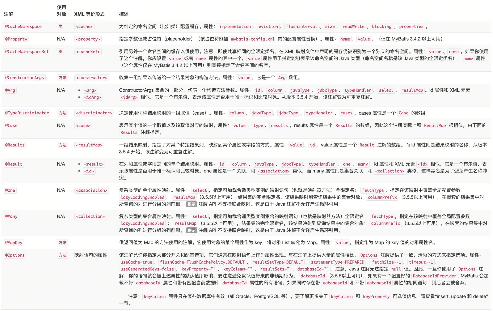
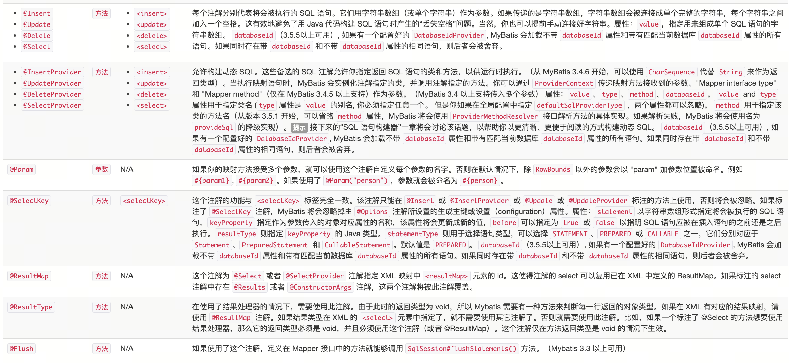
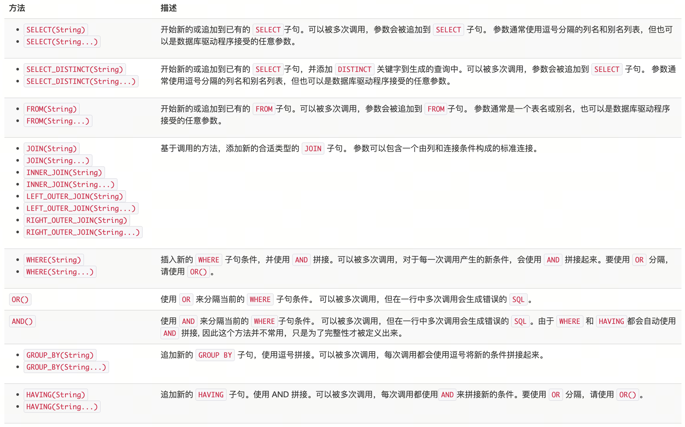
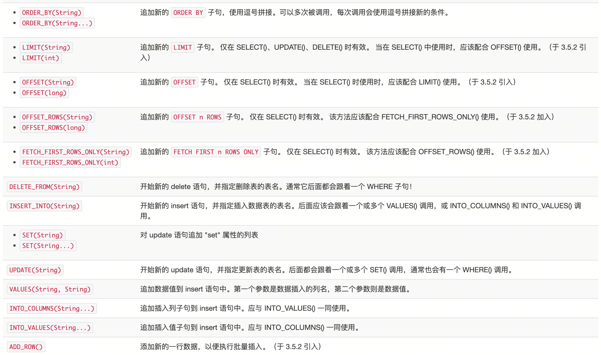

# mybatis Java API 

既然你已经知道如何配置 MyBatis 以及如何创建映射，是时候来尝点甜头了。MyBatis 的 Java API 就是这个甜头。稍后你将看到，和 JDBC 相比，MyBatis 大幅简化你的代码并力图保持其简洁、容易理解和维护。为了使得 SQL 映射更加优秀，MyBatis 3 引入了许多重要的改进。

## 目录结构

    /my_application
      /bin
      /devlib
      /lib                <-- MyBatis *.jar 文件在这里。
      /src
        /org/myapp/
          /action
          /data           <-- MyBatis 配置文件在这里，包括映射器类、XML 配置、XML 映射文件。
            /mybatis-config.xml
            /BlogMapper.java
            /BlogMapper.xml
          /model
          /service
          /view
        /properties       <-- 在 XML 配置中出现的属性值在这里。
      /test
        /org/myapp/
          /action
          /data
          /model
          /service
          /view
        /properties
      /web
        /WEB-INF
          /web.xml

当然，这是推荐的目录结构，并非强制要求，但使用一个通用的目录结构将更有利于大家沟通。

本章接下来的示例将假定你遵循这种目录结构。

## SqlSession

使用 MyBatis 的主要 Java 接口就是 SqlSession。你可以通过这个接口来执行命令，获取映射器实例和管理事务。在介绍 SqlSession 接口之前，我们先来了解如何获取一个 SqlSession 实例。SqlSessions 是由 SqlSessionFactory 实例创建的。SqlSessionFactory 对象包含创建 SqlSession 实例的各种方法。而 SqlSessionFactory 本身是由 SqlSessionFactoryBuilder 创建的，它可以从 XML、注解或 Java 配置代码来创建 SqlSessionFactory。

提示 当 Mybatis 与一些依赖注入框架（如 Spring 或者 Guice）搭配使用时，SqlSession 将被依赖注入框架创建并注入，所以你不需要使用 SqlSessionFactoryBuilder 或者 SqlSessionFactory，可以直接阅读 SqlSession 这一节。请参考 Mybatis-Spring 或者 Mybatis-Guice 手册以了解更多信息。

### SqlSessionFactoryBuilder

SqlSessionFactoryBuilder 有五个 build() 方法，每一种都允许你从不同的资源中创建一个 SqlSessionFactory 实例。

    SqlSessionFactory build(InputStream inputStream)
    SqlSessionFactory build(InputStream inputStream, String environment)
    SqlSessionFactory build(InputStream inputStream, Properties properties)
    SqlSessionFactory build(InputStream inputStream, String env, Properties props)
    SqlSessionFactory build(Configuration config)

第一种方法是最常用的，它接受一个指向 XML 文件（也就是之前讨论的 mybatis-config.xml 文件）的 InputStream 实例。可选的参数是 environment 和 properties。environment 决定加载哪种环境，包括数据源和事务管理器。比如：

``` xml
<environments default="development">
  <environment id="development">
    <transactionManager type="JDBC">
        ...
    <dataSource type="POOLED">
        ...
  </environment>
  <environment id="production">
    <transactionManager type="MANAGED">
        ...
    <dataSource type="JNDI">
        ...
  </environment>
</environments>
```

如果你调用了带 environment 参数的 build 方法，那么 MyBatis 将使用该环境对应的配置。当然，如果你指定了一个无效的环境，会收到错误。如果你调用了不带 environment 参数的 build 方法，那么就会使用默认的环境配置（在上面的示例中，通过 default="development" 指定了默认环境）。

如果你调用了接受 properties 实例的方法，那么 MyBatis 就会加载这些属性，并在配置中提供使用。绝大多数场合下，可以用 \${propName} 形式引用这些配置值。

回想一下，在 mybatis-config.xml 中，可以引用属性值，也可以直接指定属性值。因此，理解属性的优先级是很重要的。在之前的文档中，我们已经介绍过了相关内容，但为了方便查阅，这里再重新介绍一下：

如果一个属性存在于下面的多个位置，那么 MyBatis 将按照以下顺序来加载它们：

首先，读取在 properties 元素体中指定的属性； 其次，读取在 properties 元素的类路径 resource 或 url 指定的属性，且会覆盖已经指定了的重复属性； 最后，读取作为方法参数传递的属性，且会覆盖已经从 properties 元素体和 resource 或 url 属性中加载了的重复属性。

因此，通过方法参数传递的属性的优先级最高，resource 或 url 指定的属性优先级中等，在 properties 元素体中指定的属性优先级最低。

总结一下，前四个方法很大程度上是相同的，但提供了不同的覆盖选项，允许你可选地指定 environment 和/或 properties。以下给出一个从 mybatis-config.xml 文件创建 SqlSessionFactory 的示例：

``` java
String resource = "org/mybatis/builder/mybatis-config.xml";
InputStream inputStream = Resources.getResourceAsStream(resource);
SqlSessionFactoryBuilder builder = new SqlSessionFactoryBuilder();
SqlSessionFactory factory = builder.build(inputStream);
```

注意，这里我们使用了 Resources 工具类，这个类在 org.apache.ibatis.io 包中。Resources 类正如其名，会帮助你从类路径下、文件系统或一个 web URL 中加载资源文件。在略读该类的源代码或用 IDE 查看该类信息后，你会发现一整套相当实用的方法。这里给出一个简表：

``` java
URL getResourceURL(String resource)
URL getResourceURL(ClassLoader loader, String resource)
InputStream getResourceAsStream(String resource)
InputStream getResourceAsStream(ClassLoader loader, String resource)
Properties getResourceAsProperties(String resource)
Properties getResourceAsProperties(ClassLoader loader, String resource)
Reader getResourceAsReader(String resource)
Reader getResourceAsReader(ClassLoader loader, String resource)
File getResourceAsFile(String resource)
File getResourceAsFile(ClassLoader loader, String resource)
InputStream getUrlAsStream(String urlString)
Reader getUrlAsReader(String urlString)
Properties getUrlAsProperties(String urlString)
Class classForName(String className)
```

最后一个 build 方法接受一个 Configuration 实例。Configuration 类包含了对一个 SqlSessionFactory 实例你可能关心的所有内容。在检查配置时，Configuration 类很有用，它允许你查找和操纵 SQL 映射（但当应用开始接收请求时不推荐使用）。你之前学习过的所有配置开关都存在于 Configuration 类，只不过它们是以 Java API 形式暴露的。以下是一个简单的示例，演示如何手动配置 Configuration 实例，然后将它传递给 build() 方法来创建 SqlSessionFactory。

``` java
DataSource dataSource = BaseDataTest.createBlogDataSource();
TransactionFactory transactionFactory = new JdbcTransactionFactory();

Environment environment = new Environment("development", transactionFactory, dataSource);

Configuration configuration = new Configuration(environment);
configuration.setLazyLoadingEnabled(true);
configuration.setEnhancementEnabled(true);
configuration.getTypeAliasRegistry().registerAlias(Blog.class);
configuration.getTypeAliasRegistry().registerAlias(Post.class);
configuration.getTypeAliasRegistry().registerAlias(Author.class);
configuration.addMapper(BoundBlogMapper.class);
configuration.addMapper(BoundAuthorMapper.class);

SqlSessionFactoryBuilder builder = new SqlSessionFactoryBuilder();
SqlSessionFactory factory = builder.build(configuration);
```

现在你就获得一个可以用来创建 SqlSession 实例的 SqlSessionFactory 了。

## SqlSessionFactory

SqlSessionFactory 有六个方法创建 SqlSession 实例。通常来说，当你选择其中一个方法时，你需要考虑以下几点：

事务处理：你希望在 session 作用域中使用事务作用域，还是使用自动提交（auto-commit）？（对很多数据库和/或 JDBC 驱动来说，等同于关闭事务支持） 数据库连接：你希望 MyBatis 帮你从已配置的数据源获取连接，还是使用自己提供的连接？ 语句执行：你希望 MyBatis 复用 PreparedStatement 和/或批量更新语句（包括插入语句和删除语句）吗？

基于以上需求，有下列已重载的多个 openSession() 方法供使用。

``` java
SqlSession openSession()
SqlSession openSession(boolean autoCommit)
SqlSession openSession(Connection connection)
SqlSession openSession(TransactionIsolationLevel level)
SqlSession openSession(ExecutorType execType, TransactionIsolationLevel level)
SqlSession openSession(ExecutorType execType)
SqlSession openSession(ExecutorType execType, boolean autoCommit)
SqlSession openSession(ExecutorType execType, Connection connection)
Configuration getConfiguration();
```

默认的 openSession() 方法没有参数，它会创建具备如下特性的 SqlSession：

-   事务作用域将会开启（也就是不自动提交）。
-   将由当前环境配置的 DataSource 实例中获取 Connection 对象。
-   事务隔离级别将会使用驱动或数据源的默认设置。
-   预处理语句不会被复用，也不会批量处理更新。

相信你已经能从方法签名中知道这些方法的区别。向 autoCommit 可选参数传递 true 值即可开启自动提交功能。若要使用自己的 Connection 实例，传递一个 Connection 实例给 connection 参数即可。注意，我们没有提供同时设置 Connection 和 autoCommit 的方法，这是因为 MyBatis 会依据传入的 Connection 来决定是否启用 autoCommit。对于事务隔离级别，MyBatis 使用了一个 Java 枚举包装器来表示，称为 TransactionIsolationLevel，事务隔离级别支持 JDBC 的五个隔离级别（NONE、READ~UNCOMMITTED~、READ~COMMITTED~、REPEATABLE~READ~ 和 SERIALIZABLE），并且与预期的行为一致。

你可能对 ExecutorType 参数感到陌生。这个枚举类型定义了三个值:

-   ExecutorType.SIMPLE：该类型的执行器没有特别的行为。它为每个语句的执行创建一个新的预处理语句。
-   ExecutorType.REUSE：该类型的执行器会复用预处理语句。
-   ExecutorType.BATCH：该类型的执行器会批量执行所有更新语句，如果
    SELECT
    在多个更新中间执行，将在必要时将多条更新语句分隔开来，以方便理解。

提示 在 SqlSessionFactory 中还有一个方法我们没有提及，就是 getConfiguration()。这个方法会返回一个 Configuration 实例，你可以在运行时使用它来检查 MyBatis 的配置。

提示 如果你使用过 MyBatis 的旧版本，可能还记得 session、事务和批量操作是相互独立的。在新版本中则不是这样。上述三者都包含在 session 作用域内。你不必分别处理事务或批量操作就能得到想要的全部效果。

## SqlSession

正如之前所提到的，SqlSession 在 MyBatis 中是非常强大的一个类。它包含了所有执行语句、提交或回滚事务以及获取映射器实例的方法。

SqlSession 类的方法超过了 20 个，为了方便理解，我们将它们分成几种组别。

语句执行方法 这些方法被用来执行定义在 SQL 映射 XML 文件中的 SELECT、INSERT、UPDATE 和 DELETE 语句。你可以通过名字快速了解它们的作用，每一方法都接受语句的 ID 以及参数对象，参数可以是原始类型（支持自动装箱或包装类）、JavaBean、POJO 或 Map。

``` java
<T> T selectOne(String statement, Object parameter)
<E> List<E> selectList(String statement, Object parameter)
<T> Cursor<T> selectCursor(String statement, Object parameter)
<K,V> Map<K,V> selectMap(String statement, Object parameter, String mapKey)
int insert(String statement, Object parameter)
int update(String statement, Object parameter)
int delete(String statement, Object parameter)
```

selectOne 和 selectList 的不同仅仅是 selectOne 必须返回一个对象或 null 值。如果返回值多于一个，就会抛出异常。如果你不知道返回对象会有多少，请使用 selectList。如果需要查看某个对象是否存在，最好的办法是查询一个 count 值（0 或 1）。selectMap 稍微特殊一点，它会将返回对象的其中一个属性作为 key 值，将对象作为 value 值，从而将多个结果集转为 Map 类型值。由于并不是所有语句都需要参数，所以这些方法都具有一个不需要参数的重载形式。

游标（Cursor）与列表（List）返回的结果相同，不同的是，游标借助迭代器实现了数据的惰性加载。

``` java
try (Cursor<MyEntity> entities = session.selectCursor(statement, param)) {
   for (MyEntity entity:entities) {
      // 处理单个实体
   }
}
```

insert、update 以及 delete 方法返回的值表示受该语句影响的行数。

``` java
<T> T selectOne(String statement)
<E> List<E> selectList(String statement)
<T> Cursor<T> selectCursor(String statement)
<K,V> Map<K,V> selectMap(String statement, String mapKey)
int insert(String statement)
int update(String statement)
int delete(String statement)
```

最后，还有 select 方法的三个高级版本，它们允许你限制返回行数的范围，或是提供自定义结果处理逻辑，通常在数据集非常庞大的情形下使用。

``` java
<E> List<E> selectList (String statement, Object parameter, RowBounds rowBounds)
<T> Cursor<T> selectCursor(String statement, Object parameter, RowBounds rowBounds)
<K,V> Map<K,V> selectMap(String statement, Object parameter, String mapKey, RowBounds rowbounds)
void select (String statement, Object parameter, ResultHandler<T> handler)
void select (String statement, Object parameter, RowBounds rowBounds, ResultHandler<T> handler)
```

RowBounds 参数会告诉 MyBatis 略过指定数量的记录，并限制返回结果的数量。RowBounds 类的 offset 和 limit 值只有在构造函数时才能传入，其它时候是不能修改的。

``` java
int offset = 100;
int limit = 25;
RowBounds rowBounds = new RowBounds(offset, limit);
```

数据库驱动决定了略过记录时的查询效率。为了获得最佳的性能，建议将 ResultSet 类型设置为 SCROLL~SENSITIVE~ 或 SCROLL~INSENSITIVE~（换句话说：不要使用 FORWARD~ONLY~）。

ResultHandler 参数允许自定义每行结果的处理过程。你可以将它添加到 List 中、创建 Map 和 Set，甚至丢弃每个返回值，只保留计算后的统计结果。你可以使用 ResultHandler 做很多事，这其实就是 MyBatis 构建 结果列表的内部实现办法。

从版本 3.4.6 开始，ResultHandler 会在存储过程的 REFCURSOR 输出参数中传递使用的 CALLABLE 语句。

它的接口很简单：

``` java
package org.apache.ibatis.session;
public interface ResultHandler<T> {
  void handleResult(ResultContext<? extends T> context);
}
```

ResultContext 参数允许你访问结果对象和当前已被创建的对象数目，另外还提供了一个返回值为 Boolean 的 stop 方法，你可以使用此 stop 方法来停止 MyBatis 加载更多的结果。

使用 ResultHandler 的时候需要注意以下两个限制：

-   使用带 ResultHandler 参数的方法时，收到的数据不会被缓存。
-   当使用高级的结果映射集（resultMap）时，MyBatis
    很可能需要数行结果来构造一个对象。如果你使用了
    ResultHandler，你可能会接收到关联（association）或者集合（collection）中尚未被完整填充的对象。

**立即批量更新方法**

当你将 ExecutorType 设置为 ExecutorType.BATCH 时，可以使用这个方法清除（执行）缓存在 JDBC 驱动类中的批量更新语句。

``` java
List<BatchResult> flushStatements()
```

**事务控制方法**

有四个方法用来控制事务作用域。当然，如果你已经设置了自动提交或你使用了外部事务管理器，这些方法就没什么作用了。然而，如果你正在使用由 Connection 实例控制的 JDBC 事务管理器，那么这四个方法就会派上用场：

``` java
void commit()
void commit(boolean force)
void rollback()
void rollback(boolean force)
```

默认情况下 MyBatis 不会自动提交事务，除非它侦测到调用了插入、更新、删除或 select with affectData enabled 方法改变了数据库。如果你没有使用这些方法提交修改，那么你可以在 commit 和 rollback 方法参数中传入 true 值，来保证事务被正常提交（注意，在自动提交模式或者使用了外部事务管理器的情况下，设置 force 值对 session 无效）。大部分情况下你无需调用 rollback()，因为 MyBatis 会在你没有调用 commit 时替你完成回滚操作。不过，当你要在一个可能多次提交或回滚的 session 中详细控制事务，回滚操作就派上用场了。

提示 MyBatis-Spring 和 MyBatis-Guice 提供了声明式事务处理，所以如果你在使用 Mybatis 的同时使用了 Spring 或者 Guice，请参考它们的手册以获取更多的内容。

**本地缓存**

Mybatis 使用到了两种缓存：本地缓存（local cache）和二级缓存（second level cache）。

每当一个新 session 被创建，MyBatis 就会创建一个与之相关联的本地缓存。任何在 session 执行过的查询结果都会被保存在本地缓存中，所以，当再次执行参数相同的相同查询时，就不需要实际查询数据库了。本地缓存将会在做出修改、事务提交或回滚，以及关闭 session 时清空。

默认情况下，本地缓存数据的生命周期等同于整个 session 的周期。由于缓存会被用来解决循环引用问题和加快重复嵌套查询的速度，所以无法将其完全禁用。但是你可以通过设置 localCacheScope=STATEMENT 来只在语句执行时使用缓存。

注意，如果 localCacheScope 被设置为 SESSION，对于某个对象，MyBatis 将返回在本地缓存中唯一对象的引用。对返回的对象（例如 list）做出的任何修改将会影响本地缓存的内容，进而将会影响到在本次 session 中从缓存返回的值。因此，不要对 MyBatis 所返回的对象作出更改，以防后患。

你可以随时调用以下方法来清空本地缓存：

void clearCache()

确保 SqlSession 被关闭

void close()

对于你打开的任何 session，你都要保证它们被妥善关闭，这很重要。保证妥善关闭的最佳代码模式是这样的：

``` java
try (SqlSession session = sqlSessionFactory.openSession()) {
    // 假设下面三行代码是你的业务逻辑
    session.insert(...);
    session.update(...);
    session.delete(...);
    session.commit();
}
```

提示 和 SqlSessionFactory 一样，你可以调用当前使用的 SqlSession 的 getConfiguration 方法来获得 Configuration 实例。

``` java
Configuration getConfiguration()
```

**使用映射器**

``` java
<T> T getMapper(Class<T> type)
```

上述的各个 insert、update、delete 和 select 方法都很强大，但也有些繁琐，它们并不符合类型安全，对你的 IDE 和单元测试也不是那么友好。因此，使用映射器类来执行映射语句是更常见的做法。

我们已经在之前的入门章节中见到过一个使用映射器的示例。一个映射器类就是一个仅需声明与 SqlSession 方法相匹配方法的接口。下面的示例展示了一些方法签名以及它们是如何映射到 SqlSession 上的。

``` java
public interface AuthorMapper {
  // (Author) selectOne("selectAuthor",5);
  Author selectAuthor(int id);
  // (List<Author>) selectList(“selectAuthors”)
  List<Author> selectAuthors();
  // (Map<Integer,Author>) selectMap("selectAuthors", "id")
  @MapKey("id")
  Map<Integer, Author> selectAuthors();
  // insert("insertAuthor", author)
  int insertAuthor(Author author);
  // updateAuthor("updateAuthor", author)
  int updateAuthor(Author author);
  // delete("deleteAuthor",5)
  int deleteAuthor(int id);
}
```

总之，每个映射器方法签名应该匹配相关联的 SqlSession 方法，字符串参数 ID 无需匹配。而是由方法名匹配映射语句的 ID。

此外，返回类型必须匹配期望的结果类型，返回单个值时，返回类型应该是返回值的类，返回多个值时，则为数组或集合类，另外也可以是游标（Cursor）。所有常用的类型都是支持的，包括：原始类型、Map、POJO 和 JavaBean。

提示 映射器接口不需要去实现任何接口或继承自任何类。只要方法签名可以被用来唯一识别对应的映射语句就可以了。

提示 映射器接口可以继承自其他接口。在使用 XML 来绑定映射器接口时，保证语句处于合适的命名空间中即可。唯一的限制是，不能在两个具有继承关系的接口中拥有相同的方法签名（这是潜在的危险做法，不可取）。

你可以传递多个参数给一个映射器方法。在多个参数的情况下，默认它们将会以 param 加上它们在参数列表中的位置来命名，比如：#{param1}、#{param2}等。如果你想（在有多个参数时）自定义参数的名称，那么你可以在参数上使用 @Param("paramName") 注解。

你也可以给方法传递一个 RowBounds 实例来限制查询结果。

**映射器注解**

设计初期的 MyBatis 是一个 XML 驱动的框架。配置信息是基于 XML 的，映射语句也是定义在 XML 中的。而在 MyBatis 3 中，我们提供了其它的配置方式。MyBatis 3 构建在全面且强大的基于 Java 语言的配置 API 之上。它是 XML 和注解配置的基础。注解提供了一种简单且低成本的方式来实现简单的映射语句。

提示 不幸的是，Java 注解的表达能力和灵活性十分有限。尽管我们花了很多时间在调查、设计和试验上，但最强大的 MyBatis 映射并不能用注解来构建——我们真没开玩笑。而 C# 属性就没有这些限制，因此 MyBatis.NET 的配置会比 XML 有更大的选择余地。虽说如此，基于 Java 注解的配置还是有它的好处的。

**注解如下表所示：**





**映射注解示例**

这个例子展示了如何使用 @SelectKey 注解来在插入前读取数据库序列的值：

``` java
@Insert("insert into table3 (id, name) values(#{nameId}, #{name})")
@SelectKey(statement="call next value for TestSequence", keyProperty="nameId", before=true, resultType=int.class)
int insertTable3(Name name);
```

这个例子展示了如何使用 @SelectKey 注解来在插入后读取数据库自增列的值：

``` java
@Insert("insert into table2 (name) values(#{name})")
@SelectKey(statement="call identity()", keyProperty="nameId", before=false, resultType=int.class)
int insertTable2(Name name);
```

这个例子展示了如何使用 @Flush 注解来调用 SqlSession#flushStatements()：

``` java
@Flush
List<BatchResult> flush();
```

这些例子展示了如何通过指定 @Result 的 id 属性来命名结果集：

``` java
@Results(id = "userResult", value = {
  @Result(property = "id", column = "uid", id = true),
  @Result(property = "firstName", column = "first_name"),
  @Result(property = "lastName", column = "last_name")
})
@Select("select * from users where id = #{id}")
User getUserById(Integer id);

@Results(id = "companyResults")
@ConstructorArgs({
  @Arg(column = "cid", javaType = Integer.class, id = true),
  @Arg(column = "name", javaType = String.class)
})
@Select("select * from company where id = #{id}")
Company getCompanyById(Integer id);
```

这个例子展示了如何使用单个参数的 @SqlProvider 注解：

``` java
@SelectProvider(type = UserSqlBuilder.class, method = "buildGetUsersByName")
List<User> getUsersByName(String name);

class UserSqlBuilder {
  public static String buildGetUsersByName(final String name) {
    return new SQL()\{\{
      SELECT("*");
      FROM("users");
      if (name != null) {
        WHERE("name like #{value} || '%'");
      }
      ORDER_BY("id");
    \}\}.toString();
  }
}
```

这个例子展示了如何使用多个参数的 @SqlProvider 注解：

``` java
@SelectProvider(type = UserSqlBuilder.class, method = "buildGetUsersByName")
List<User> getUsersByName(
    @Param("name") String name, @Param("orderByColumn") String orderByColumn);

class UserSqlBuilder {

  // 如果不使用 @Param，就应该定义与 mapper 方法相同的参数
  public static String buildGetUsersByName(
      final String name, final String orderByColumn) {
    return new SQL()\{\{
      SELECT("*");
      FROM("users");
      WHERE("name like #{name} || '%'");
      ORDER_BY(orderByColumn);
    \}\}.toString();
  }

  // 如果使用 @Param，就可以只定义需要使用的参数
  public static String buildGetUsersByName(@Param("orderByColumn") final String orderByColumn) {
    return new SQL()\{\{
      SELECT("*");
      FROM("users");
      WHERE("name like #{name} || '%'");
      ORDER_BY(orderByColumn);
    \}\}.toString();
  }
}
```

这是一个在全局配置下让所有映射方法在同一个 sql provider 类里面的例子（3.5.6 后可用）:

``` java
Configuration configuration = new Configuration();
configuration.setDefaultSqlProviderType(TemplateFilePathProvider.class); // 让所有映射方法在同一个 sql provider 类里面
// ...
```

``` java
// 在 sql provider 注解上可以省略 type/value 属性
// 如果省略，MyBatis 将使用 defaultSqlProviderType 所指定的类
public interface UserMapper {

  @SelectProvider // 等价于 @SelectProvider(TemplateFilePathProvider.class)
  User findUser(int id);

  @InsertProvider // 等价于 @InsertProvider(TemplateFilePathProvider.class)
  void createUser(User user);

  @UpdateProvider // 等价于 @UpdateProvider(TemplateFilePathProvider.class)
  void updateUser(User user);

  @DeleteProvider // 等价于 @DeleteProvider(TemplateFilePathProvider.class)
  void deleteUser(int id);
}
```

以下例子展示了 ProviderMethodResolver（3.5.1 后可用）的默认实现使用方法：

``` java
@SelectProvider(UserSqlProvider.class)
List<User> getUsersByName(String name);

// 在你的 provider 类中实现 ProviderMethodResolver 接口
class UserSqlProvider implements ProviderMethodResolver {
  // 默认实现中，会将映射器方法的调用解析到实现的同名方法上
  public static String getUsersByName(final String name) {
    return new SQL()\{\{
      SELECT("*");
      FROM("users");
      if (name != null) {
        WHERE("name like #{value} || '%'");
      }
      ORDER_BY("id");
    \}\}.toString();
  }
}
```

这个例子展现了如何在声明注解时使用 databaseId 属性（3.5.5后可用）：

``` java
@Select(value = "SELECT SYS_GUID() FROM dual", databaseId = "oracle") // 如果 DatabaseIdProvider 提供的是 "oracle"，使用这条语句
@Select(value = "SELECT uuid_generate_v4()", databaseId = "postgres") // 如果 DatabaseIdProvider 提供的是 "postgres"，使用这条语句
@Select("SELECT RANDOM_UUID()") // 如果 DatabaseIdProvider 没有配置或者没有对应的 databaseId, 使用这条语句
String generateId();
```

# mybatis SQL语句构建器 [mybatis-sql语句构建器]

## 问题

Java 程序员面对的最痛苦的事情之一就是在 Java 代码中嵌入 SQL 语句。这通常是因为需要动态生成 SQL 语句，不然我们可以将它们放到外部文件或者存储过程中。如你所见，MyBatis 在 XML 映射中具备强大的 SQL 动态生成能力。但有时，我们还是需要在 Java 代码里构建 SQL 语句。此时，MyBatis 有另外一个特性可以帮到你，让你从处理典型问题中解放出来，比如加号、引号、换行、格式化问题、嵌入条件的逗号管理及 AND 连接。确实，在 Java 代码中动态生成 SQL 代码真的就是一场噩梦。例如：

``` java
String sql = "SELECT P.ID, P.USERNAME, P.PASSWORD, P.FULL_NAME, "
"P.LAST_NAME,P.CREATED_ON, P.UPDATED_ON " +
"FROM PERSON P, ACCOUNT A " +
"INNER JOIN DEPARTMENT D on D.ID = P.DEPARTMENT_ID " +
"INNER JOIN COMPANY C on D.COMPANY_ID = C.ID " +
"WHERE (P.ID = A.ID AND P.FIRST_NAME like ?) " +
"OR (P.LAST_NAME like ?) " +
"GROUP BY P.ID " +
"HAVING (P.LAST_NAME like ?) " +
"OR (P.FIRST_NAME like ?) " +
"ORDER BY P.ID, P.FULL_NAME";
```

## 解决方案

MyBatis 3 提供了方便的工具类来帮助解决此问题。借助 SQL 类，我们只需要简单地创建一个实例，并调用它的方法即可生成 SQL 语句。让我们来用 SQL 类重写上面的例子：

``` java
private String selectPersonSql() {
  return new SQL() \{\{
    SELECT("P.ID, P.USERNAME, P.PASSWORD, P.FULL_NAME");
    SELECT("P.LAST_NAME, P.CREATED_ON, P.UPDATED_ON");
    FROM("PERSON P");
    FROM("ACCOUNT A");
    INNER_JOIN("DEPARTMENT D on D.ID = P.DEPARTMENT_ID");
    INNER_JOIN("COMPANY C on D.COMPANY_ID = C.ID");
    WHERE("P.ID = A.ID");
    WHERE("P.FIRST_NAME like ?");
    OR();
    WHERE("P.LAST_NAME like ?");
    GROUP_BY("P.ID");
    HAVING("P.LAST_NAME like ?");
    OR();
    HAVING("P.FIRST_NAME like ?");
    ORDER_BY("P.ID");
    ORDER_BY("P.FULL_NAME");
  \}\}.toString();
}
```

这个例子有什么特别之处吗？仔细看一下你会发现，你不用担心可能会重复出现的 "AND" 关键字，或者要做出用 "WHERE" 拼接还是 "AND" 拼接还是不用拼接的选择。SQL 类已经为你处理了哪里应该插入
"WHERE"、哪里应该使用 "AND" 的问题，并帮你完成所有的字符串拼接工作。

## SQL 类

这里有一些示例：

``` java
// 匿名内部类风格
public String deletePersonSql() {
  return new SQL() \{\{
    DELETE_FROM("PERSON");
    WHERE("ID = #{id}");
  \}\}.toString();
}

// Builder / Fluent 风格
public String insertPersonSql() {
  String sql = new SQL()
    .INSERT_INTO("PERSON")
    .VALUES("ID, FIRST_NAME", "#{id}, #{firstName}")
    .VALUES("LAST_NAME", "#{lastName}")
    .toString();
  return sql;
}

// 动态条件（注意参数需要使用 final 修饰，以便匿名内部类对它们进行访问）
public String selectPersonLike(final String id, final String firstName, final String lastName) {
  return new SQL() \{\{
    SELECT("P.ID, P.USERNAME, P.PASSWORD, P.FIRST_NAME, P.LAST_NAME");
    FROM("PERSON P");
    if (id != null) {
      WHERE("P.ID like #{id}");
    }
    if (firstName != null) {
      WHERE("P.FIRST_NAME like #{firstName}");
    }
    if (lastName != null) {
      WHERE("P.LAST_NAME like #{lastName}");
    }
    ORDER_BY("P.LAST_NAME");
  \}\}.toString();
}

public String deletePersonSql() {
  return new SQL() \{\{
    DELETE_FROM("PERSON");
    WHERE("ID = #{id}");
  \}\}.toString();
}

public String insertPersonSql() {
  return new SQL() \{\{
    INSERT_INTO("PERSON");
    VALUES("ID, FIRST_NAME", "#{id}, #{firstName}");
    VALUES("LAST_NAME", "#{lastName}");
  \}\}.toString();
}

public String updatePersonSql() {
  return new SQL() \{\{
    UPDATE("PERSON");
    SET("FIRST_NAME = #{firstName}");
    WHERE("ID = #{id}");
  \}\}.toString();
}
```





提示 注意，SQL 类将原样插入 LIMIT、OFFSET、OFFSET n ROWS 以及 FETCH FIRST n ROWS ONLY 子句。换句话说，类库不会为不支持这些子句的数据库执行任何转换。 因此，用户应该要了解目标数据库是否支持这些子句。如果目标数据库不支持这些子句，产生的 SQL 可能会引起运行错误。

从版本 3.4.2 开始，你可以像下面这样使用可变长度参数：

``` java
public String selectPersonSql() {
  return new SQL()
    .SELECT("P.ID", "A.USERNAME", "A.PASSWORD", "P.FULL_NAME", "D.DEPARTMENT_NAME", "C.COMPANY_NAME")
    .FROM("PERSON P", "ACCOUNT A")
    .INNER_JOIN("DEPARTMENT D on D.ID = P.DEPARTMENT_ID", "COMPANY C on D.COMPANY_ID = C.ID")
    .WHERE("P.ID = A.ID", "P.FULL_NAME like #{name}")
    .ORDER_BY("P.ID", "P.FULL_NAME")
    .toString();
}

public String insertPersonSql() {
  return new SQL()
    .INSERT_INTO("PERSON")
    .INTO_COLUMNS("ID", "FULL_NAME")
    .INTO_VALUES("#{id}", "#{fullName}")
    .toString();
}

public String updatePersonSql() {
  return new SQL()
    .UPDATE("PERSON")
    .SET("FULL_NAME = #{fullName}", "DATE_OF_BIRTH = #{dateOfBirth}")
    .WHERE("ID = #{id}")
    .toString();
}
```

从版本 3.5.2 开始，你可以像下面这样构建批量插入语句：

``` java
public String insertPersonsSql() {
  // INSERT INTO PERSON (ID, FULL_NAME)
  //     VALUES (#{mainPerson.id}, #{mainPerson.fullName}) , (#{subPerson.id}, #{subPerson.fullName})
  return new SQL()
    .INSERT_INTO("PERSON")
    .INTO_COLUMNS("ID", "FULL_NAME")
    .INTO_VALUES("#{mainPerson.id}", "#{mainPerson.fullName}")
    .ADD_ROW()
    .INTO_VALUES("#{subPerson.id}", "#{subPerson.fullName}")
    .toString();
}
```

从版本 3.5.2 开始，你可以像下面这样构建限制返回结果数的 SELECT 语句：

``` java
public String selectPersonsWithOffsetLimitSql() {
  // SELECT id, name FROM PERSON
  //     LIMIT #{limit} OFFSET #{offset}
  return new SQL()
    .SELECT("id", "name")
    .FROM("PERSON")
    .LIMIT("#{limit}")
    .OFFSET("#{offset}")
    .toString();
}

public String selectPersonsWithFetchFirstSql() {
  // SELECT id, name FROM PERSON
  //     OFFSET #{offset} ROWS FETCH FIRST #{limit} ROWS ONLY
  return new SQL()
    .SELECT("id", "name")
    .FROM("PERSON")
    .OFFSET_ROWS("#{offset}")
    .FETCH_FIRST_ROWS_ONLY("#{limit}")
    .toString();
}
```

# mybatis日志 [mybatis日志]

Mybatis 通过使用内置的日志工厂提供日志功能。内置日志工厂将会把日志工作委托给下面的实现之一：

-   SLF4J
-   Apache Commons Logging
-   Log4j 2
-   Log4j （3.5.9 起废弃）
-   JDK logging

MyBatis 内置日志工厂基于运行时自省机制选择合适的日志工具。它会使用第一个查找得到的工具（按上文列举的顺序查找）。如果一个都未找到，日志功能就会被禁用。

不少应用服务器（如 Tomcat 和 WebShpere）的类路径中已经包含 Commons Logging，所以在这种配置环境下的 MyBatis 会把它作为日志工具，记住这点非常重要。这将意味着，在诸如 WebSphere 的环境中，它提供了 Commons Logging 的私有实现，你的 Log4J 配置将被忽略。MyBatis 将你的 Log4J 配置忽略掉是相当令人郁闷的（事实上，正是因为在这种配置环境下，MyBatis 才会选择使用 Commons Logging 而不是 Log4J）。如果你的应用部署在一个类路径已经包含 Commons Logging 的环境中，而你又想使用其它日志工具，你可以通过在 MyBatis 配置文件 mybatis-config.xml 里面添加一项 setting 来选择别的日志工具。

```xml 
<configuration>
  <settings>
    ...
    <setting name="logImpl" value="LOG4J"/>
    ...
  </settings>
</configuration>
```

logImpl 可选的值有：SLF4J、LOG4J、LOG4J2、JDK~LOGGING~、COMMONS~LOGGING~、STDOUT~LOGGING~、NO~LOGGING~，或者是实现了接口 org.apache.ibatis.logging.Log 的，且构造方法是以字符串为参数的类的完全限定名。（译者注：可以参考org.apache.ibatis.logging.slf4j.Slf4jImpl.java的实现）

你也可以调用如下任一方法来使用日志工具：

``` java
org.apache.ibatis.logging.LogFactory.useSlf4jLogging();
org.apache.ibatis.logging.LogFactory.useLog4JLogging();
org.apache.ibatis.logging.LogFactory.useJdkLogging();
org.apache.ibatis.logging.LogFactory.useCommonsLogging();
org.apache.ibatis.logging.LogFactory.useStdOutLogging();
```

如果你决定要调用以上某个方法，请在调用其它 MyBatis 方法之前调用它。另外，仅当运行时类路径中存在该日志工具时，调用与该日志工具对应的方法才会生效，否则 MyBatis 一概忽略。如你环境中并不存在 Log4J2，你却调用了相应的方法，MyBatis 就会忽略这一调用，转而以默认的查找顺序查找日志工具。

## 日志配置

你可以对包、映射类的全限定名、命名空间或全限定语句名开启日志功能来查看 MyBatis 的日志语句。

再次说明下，具体怎么做，由使用的日志工具决定，这里以 SLF4J(Logback) 为例。配置日志功能非常简单：添加一个或多个配置文件（如 logback.xml），有时需要添加 jar 包。下面的例子将使用 SLF4J(Logback) 来配置完整的日志服务，共两个步骤：

### 步骤 1：添加 SLF4J + Logback 的 jar 包

因为我们使用的是 SLF4J(Logback)，就要确保它的 jar 包在应用中是可用的。要启用 SLF4J(Logback)，只要将 jar 包添加到应用的类路径中即可。SLF4J(Logback) 的 jar 包可以在上面的链接中下载。

对于 web 应用或企业级应用，则需要将 logback-classic.jar, logback-core.jar and slf4j-api.jar 添加到 WEB-INF/lib 目录下；对于独立应用，可以将它添加到JVM 的 -classpath 启动参数中。

如果你使用 maven, 你可以通过在 pom.xml 中添加下面的依赖来下载 jar 文件。

``` xml
<dependency>
  <groupId>ch.qos.logback</groupId>
  <artifactId>logback-classic</artifactId>
  <version>1.x.x</version>
</dependency>
```

### 步骤 2：配置 Logback

配置 Logback 比较简单，假如你需要记录这个映射器接口的日志：

    package org.mybatis.example;
    public interface BlogMapper {
      @Select("SELECT * FROM blog WHERE id = #{id}")
      Blog selectBlog(int id);
    }

在应用的类路径中创建一个名称为 logback.xml 的文件，文件的具体内容如下：

``` xml
<?xml version="1.0" encoding="UTF-8"?>
<!DOCTYPE configuration>
<configuration>

  <appender name="stdout" class="ch.qos.logback.core.ConsoleAppender">
    <encoder>
      <pattern>%5level [%thread] - %msg%n</pattern>
    </encoder>
  </appender>

  <logger name="org.mybatis.example.BlogMapper">
    <level value="trace"/>
  </logger>
  <root level="error">
    <appender-ref ref="stdout"/>
  </root>

</configuration>
```

添加以上配置后，SLF4J(Logback) 就会记录 org.mybatis.example.BlogMapper 的详细执行操作，且仅记录应用中其它类的错误信息（若有）。

你也可以将日志的记录方式从接口级别切换到语句级别，从而实现更细粒度的控制。如下配置只对 selectBlog 语句记录日志：

``` xml
<logger name="org.mybatis.example.BlogMapper.selectBlog">
  <level value="trace"/>
</logger>
```

与此相对，可以对一组映射器接口记录日志，只要对映射器接口所在的包开启日志功能即可：

``` xml
<logger name="org.mybatis.example">
  <level value="trace"/>
</logger>
```

某些查询可能会返回庞大的结果集，此时只想记录其执行的 SQL 语句而不想记录结果该怎么办？为此，Mybatis 中 SQL 语句的日志级别被设为DEBUG（JDK 日志设为 FINE），结果的日志级别为 TRACE（JDK 日志设为 FINER)。所以，只要将日志级别调整为 DEBUG 即可达到目的：

``` xml
<logger name="org.mybatis.example">
  <level value="debug"/>
</logger>
```

要记录日志的是类似下面的映射器文件而不是映射器接口又该怎么做呢？

``` xml
<?xml version="1.0" encoding="UTF-8" ?>
<!DOCTYPE mapper
  PUBLIC "-//mybatis.org//DTD Mapper 3.0//EN"
  "https://mybatis.org/dtd/mybatis-3-mapper.dtd">
<mapper namespace="org.mybatis.example.BlogMapper">
  <select id="selectBlog" resultType="Blog">
    select * from Blog where id = #{id}
  </select>
</mapper>
```

如需对 XML 文件记录日志，只要对命名空间增加日志记录功能即可：

``` xml
<logger name="org.mybatis.example.BlogMapper">
  <level value="trace"/>
</logger>
```

要记录具体语句的日志可以这样做：

``` xml
<logger name="org.mybatis.example.BlogMapper.selectBlog">
  <level value="trace"/>
</logger>
```

你应该注意到了，为映射器接口和 XML 文件添加日志功能的语句毫无差别。

注意 如果你使用的是 SLF4J 或 Log4j 2，MyBatis 将以 MYBATIS 这个值进行调用。

配置文件 log4j.properties 的余下内容是针对日志输出源的，这一内容已经超出本文档范围。关于 Logback 的更多内容，可以参考Logback 的网站。不过，你也可以简单地做做实验，看看不同的配置会产生怎样的效果。

### Log4j 2 配置示例

pom.xml

``` xml
<dependency>
  <groupId>org.apache.logging.log4j</groupId>
  <artifactId>log4j-core</artifactId>
  <version>2.x.x</version>
</dependency>
```

log4j2.xml

``` xml
<?xml version="1.0" encoding="UTF-8"?>
<Configuration xmlns="http://logging.apache.org/log4j/2.0/config">

  <Appenders>
    <Console name="stdout" target="SYSTEM_OUT">
      <PatternLayout pattern="%5level [%t] - %msg%n"/>
    </Console>
  </Appenders>

  <Loggers>
    <Logger name="org.mybatis.example.BlogMapper" level="trace"/>
    <Root level="error" >
      <AppenderRef ref="stdout"/>
    </Root>
  </Loggers>

</Configuration>
```

### Log4j 配置示例

pom.xml

``` xml
<dependency>
  <groupId>log4j</groupId>
  <artifactId>log4j</artifactId>
  <version>1.2.17</version>
</dependency>
```

log4j.properties

    log4j.rootLogger=ERROR, stdout

    log4j.logger.org.mybatis.example.BlogMapper=TRACE

    log4j.appender.stdout=org.apache.log4j.ConsoleAppender
    log4j.appender.stdout.layout=org.apache.log4j.PatternLayout
    log4j.appender.stdout.layout.ConversionPattern=%5p [%t] - %m%n

### JDK logging 配置示例

logging.properties

    handlers=java.util.logging.ConsoleHandler
    .level=SEVERE

    org.mybatis.example.BlogMapper=FINER

    java.util.logging.ConsoleHandler.level=ALL
    java.util.logging.ConsoleHandler.formatter=java.util.logging.SimpleFormatter
    java.util.logging.SimpleFormatter.format=%1$tT.%1$tL %4$s %3$s - %5$s%6$s%n
