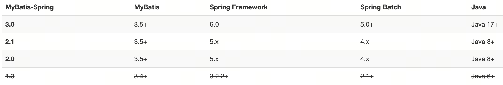
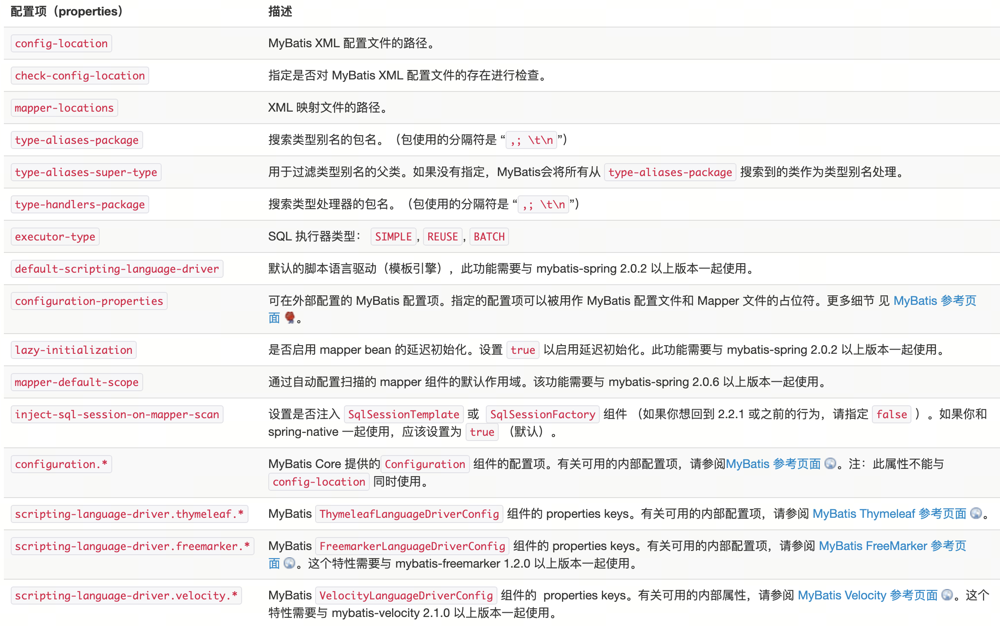

# MyBatis-Spring

## 什么是 MyBatis-Spring？

MyBatis-Spring 会帮助你将 MyBatis 代码无缝地整合到 Spring 中。它将允许 MyBatis 参与到 Spring 的事务管理之中，创建映射器 mapper 和 SqlSession 并注入到 bean 中，以及将 Mybatis 的异常转换为 Spring 的 DataAccessException。 最终，可以做到应用代码不依赖于 MyBatis，Spring 或 MyBatis-Spring。

## 动机

Spring 2.0 只支持 iBatis 2.0。那么，我们就想将 MyBatis3 的支持添加到 Spring 3.0 中（参见 Spring Jira 中的 问题 ）。不幸的是，Spring 3.0 的开发在 MyBatis 3.0 官方发布前就结束了。 由于 Spring 开发团队不想发布一个基于未发布版的 MyBatis 的整合支持，如果要获得 Spring 官方的支持，只能等待下一次的发布了。基于在 Spring 中对 MyBatis 提供支持的兴趣，MyBatis 社区认为，应该开始召集有兴趣参与其中的贡献者们，将对 Spring 的集成作为 MyBatis 的一个社区子项目。

## 知识基础

在开始使用 MyBatis-Spring 之前，你需要先熟悉 Spring 和 MyBatis 这两个框架和有关它们的术语。这很重要——因为本手册中不会提供二者的基本内容，安装和配置教程。

MyBatis-Spring 需要以下版本：



## 安装

要使用 MyBatis-Spring 模块，只需要在类路径下包含 mybatis-spring-3.0.2.jar 文件和相关依赖即可。

如果使用 Maven 作为构建工具，仅需要在 pom.xml 中加入以下代码即可：

``` xml
<dependency>
  <groupId>org.mybatis</groupId>
  <artifactId>mybatis-spring</artifactId>
  <version>3.0.2</version>
</dependency>
```

## 快速上手

要和 Spring 一起使用 MyBatis，需要在 Spring 应用上下文中定义至少两样东西：一个 SqlSessionFactory 和至少一个数据映射器类。

在 MyBatis-Spring 中，可使用 SqlSessionFactoryBean来创建 SqlSessionFactory。 要配置这个工厂 bean，只需要把下面代码放在 Spring 的 XML 配置文件中：

``` xml
<bean id="sqlSessionFactory" class="org.mybatis.spring.SqlSessionFactoryBean">
  <property name="dataSource" ref="dataSource" />
</bean>
```

``` java
@Configuration
public class MyBatisConfig {
  @Bean
  public SqlSessionFactory sqlSessionFactory() throws Exception {
    SqlSessionFactoryBean factoryBean = new SqlSessionFactoryBean();
    factoryBean.setDataSource(dataSource());
    return factoryBean.getObject();
  }
}
```

注意：SqlSessionFactory 需要一个 DataSource（数据源）。这可以是任意的 DataSource，只需要和配置其它 Spring 数据库连接一样配置它就可以了。

假设你定义了一个如下的 mapper 接口：

``` java
public interface UserMapper {
  @Select("SELECT * FROM users WHERE id = #{userId}")
  User getUser(@Param("userId") String userId);
}
```

那么可以通过 MapperFactoryBean 将接口加入到 Spring 中:

``` xml
<bean id="userMapper" class="org.mybatis.spring.mapper.MapperFactoryBean">
  <property name="mapperInterface" value="org.mybatis.spring.sample.mapper.UserMapper" />
  <property name="sqlSessionFactory" ref="sqlSessionFactory" />
</bean>
```

需要注意的是：所指定的映射器类必须是一个接口，而不是具体的实现类。在这个示例中，通过注解来指定 SQL 语句，但是也可以使用 MyBatis 映射器的 XML 配置文件。

配置好之后，你就可以像 Spring 中普通的 bean 注入方法那样，将映射器注入到你的业务或服务对象中。MapperFactoryBean 将会负责 SqlSession 的创建和关闭。 如果使用了 Spring 的事务功能，那么当事务完成时，session 将会被提交或回滚。最终任何异常都会被转换成 Spring 的 DataAccessException 异常。

使用 Java 代码来配置的方式如下：

``` java
@Configuration
public class MyBatisConfig {
  @Bean
  public UserMapper userMapper() throws Exception {
    SqlSessionTemplate sqlSessionTemplate = new SqlSessionTemplate(sqlSessionFactory());
    return sqlSessionTemplate.getMapper(UserMapper.class);
  }
}
```

要调用 MyBatis 的数据方法，只需一行代码：

``` java
public class FooServiceImpl implements FooService {

  private final UserMapper userMapper;

  public FooServiceImpl(UserMapper userMapper) {
    this.userMapper = userMapper;
  }

  public User doSomeBusinessStuff(String userId) {
    return this.userMapper.getUser(userId);
  }
}
```

## SqlSessionFactoryBean

在基础的 MyBatis 用法中，是通过 SqlSessionFactoryBuilder 来创建 SqlSessionFactory 的。而在 MyBatis-Spring 中，则使用 SqlSessionFactoryBean 来创建。

### 设置

要创建工厂 bean，将下面的代码放到 Spring 的 XML 配置文件中：

``` xml
<bean id="sqlSessionFactory" class="org.mybatis.spring.SqlSessionFactoryBean">
  <property name="dataSource" ref="dataSource" />
</bean>
```

需要注意的是 SqlSessionFactoryBean 实现了 Spring 的 FactoryBean 接口（参见 Spring 官方文档 3.8 节 通过工厂 bean 自定义实例化逻辑 ）。 这意味着由 Spring 最终创建的 bean 并不是 SqlSessionFactoryBean 本身，而是工厂类（SqlSessionFactoryBean）的 getObject() 方法的返回结果。这种情况下，Spring 将会在应用启动时为你创建 SqlSessionFactory，并使用 sqlSessionFactory 这个名字存储起来。

等效的 Java 代码如下：

``` java
@Configuration
public class MyBatisConfig {
  @Bean
  public SqlSessionFactory sqlSessionFactory() {
    SqlSessionFactoryBean factoryBean = new SqlSessionFactoryBean();
    factoryBean.setDataSource(dataSource());
    return factoryBean.getObject();
  }
}
```

通常，在 MyBatis-Spring 中，你不需要直接使用 SqlSessionFactoryBean 或对应的 SqlSessionFactory。 相反，session 的工厂 bean 将会被注入到 MapperFactoryBean 或其它继承于 SqlSessionDaoSupport 的 DAO（Data Access Object，数据访问对象）中。

### 属性

SqlSessionFactory 有一个唯一的必要属性：用于 JDBC 的 DataSource。这可以是任意的 DataSource 对象，它的配置方法和其它 Spring 数据库连接是一样的。

一个常用的属性是 configLocation，它用来指定 MyBatis 的 XML 配置文件路径。它在需要修改 MyBatis 的基础配置非常有用。通常，基础配置指的是 `<settings>`或 `<typeAliases>`元素。

需要注意的是，这个配置文件并不需要是一个完整的 MyBatis 配置。确切地说，任何环境配置（`<environments>`），数据源（`<DataSource>`）和 MyBatis 的事务管理器（`<transactionManager>`）都会被忽略。 SqlSessionFactoryBean 会创建它自有的 MyBatis 环境配置（Environment），并按要求设置自定义环境的值。

如果 MyBatis 在映射器类对应的路径下找不到与之相对应的映射器 XML 文件，那么也需要配置文件。这时有两种解决办法：第一种是手动在 MyBatis 的 XML 配置文件中的 `<mappers>`部分中指定 XML
文件的类路径；第二种是设置工厂 bean 的 mapperLocations 属性。

mapperLocations 属性接受多个资源位置。这个属性可以用来指定 MyBatis 的映射器 XML 配置文件的位置。属性的值是一个 Ant 风格的字符串，可以指定加载一个目录中的所有文件，或者从一个目录开始递归搜索所有目录。比如:

``` xml
<bean id="sqlSessionFactory" class="org.mybatis.spring.SqlSessionFactoryBean">
  <property name="dataSource" ref="dataSource" />
  <property name="mapperLocations" value="classpath*:sample/config/mappers/**/*.xml" />
</bean>
```

这会从类路径下加载所有在 sample.config.mappers 包和它的子包中的 MyBatis 映射器 XML 配置文件。

在容器管理事务的时候，你可能需要的一个属性是 transactionFactoryClass。请参考事务一章的相关章节。

如果你使用了多个数据库，那么需要设置 databaseIdProvider 属性：

``` xml
<bean id="databaseIdProvider" class="org.apache.ibatis.mapping.VendorDatabaseIdProvider">
  <property name="properties">
    <props>
      <prop key="SQL Server">sqlserver</prop>
      <prop key="DB2">db2</prop>
      <prop key="Oracle">oracle</prop>
      <prop key="MySQL">mysql</prop>
    </props>
  </property>
</bean>
```

``` xml
<bean id="sqlSessionFactory" class="org.mybatis.spring.SqlSessionFactoryBean">
  <property name="dataSource" ref="dataSource" />
  <property name="mapperLocations" value="classpath*:sample/config/mappers/**/*.xml" />
  <property name="databaseIdProvider" ref="databaseIdProvider"/>
</bean>
```

提示 自 1.3.0 版本开始，新增的 configuration 属性能够在没有对应的 MyBatis XML 配置文件的情况下，直接设置 Configuration 实例。例如：

``` xml
<bean id="sqlSessionFactory" class="org.mybatis.spring.SqlSessionFactoryBean">
  <property name="dataSource" ref="dataSource" />
  <property name="configuration">
    <bean class="org.apache.ibatis.session.Configuration">
      <property name="mapUnderscoreToCamelCase" value="true"/>
    </bean>
  </property>
</bean>
```

## 事务

一个使用 MyBatis-Spring 的其中一个主要原因是它允许 MyBatis 参与到 Spring 的事务管理中。而不是给 MyBatis 创建一个新的专用事务管理器，MyBatis-Spring 借助了 Spring 中的 DataSourceTransactionManager 来实现事务管理。

一旦配置好了 Spring 的事务管理器，你就可以在 Spring 中按你平时的方式来配置事务。并且支持 @Transactional 注解和 AOP 风格的配置。在事务处理期间，一个单独的 SqlSession 对象将会被创建和使用。当事务完成时，这个 session 会以合适的方式提交或回滚。

事务配置好了以后，MyBatis-Spring 将会透明地管理事务。这样在你的 DAO 类中就不需要额外的代码了。

### 标准配置

要开启 Spring 的事务处理功能，在 Spring 的配置文件中创建一个 DataSourceTransactionManager 对象：

``` xml
<bean id="transactionManager" class="org.springframework.jdbc.datasource.DataSourceTransactionManager">
  <constructor-arg ref="dataSource" />
</bean>
```

``` java
@Configuration
public class DataSourceConfig {
  @Bean
  public DataSourceTransactionManager transactionManager() {
    return new DataSourceTransactionManager(dataSource());
  }
}
```

传入的 DataSource 可以是任何能够与 Spring 兼容的 JDBC DataSource。包括连接池和通过 JNDI 查找获得的 DataSource。

注意：为事务管理器指定的 DataSource 必须和用来创建 SqlSessionFactoryBean 的是同一个数据源，否则事务管理器就无法工作了。

### 交由容器管理事务

如果你正使用一个 JEE 容器而且想让 Spring 参与到容器管理事务（Container managed transactions，CMT）的过程中，那么 Spring 应该被设置为使用 JtaTransactionManager 或由容器指定的一个子类作为事务管理器。最简单的方式是使用 Spring 的事务命名空间或使用 JtaTransactionManagerFactoryBean：

``` xml
<tx:jta-transaction-manager />
```

``` java
@Configuration
public class DataSourceConfig {
  @Bean
  public JtaTransactionManager transactionManager() {
    return new JtaTransactionManagerFactoryBean().getObject();
  }
}
```

在这个配置中，MyBatis 将会和其它由容器管理事务配置的 Spring 事务资源一样。Spring 会自动使用任何一个存在的容器事务管理器，并注入一个 SqlSession。 如果没有正在进行的事务，而基于事务配置需要一个新的事务的时候，Spring 会开启一个新的由容器管理的事务。

注意，如果你想使用由容器管理的事务，而不想使用 Spring 的事务管理，你就不能配置任何的 Spring 事务管理器。并必须配置 SqlSessionFactoryBean 以使用基本的 MyBatis 的 ManagedTransactionFactory：

``` xml
<bean id="sqlSessionFactory" class="org.mybatis.spring.SqlSessionFactoryBean">
  <property name="dataSource" ref="dataSource" />
  <property name="transactionFactory">
    <bean class="org.apache.ibatis.transaction.managed.ManagedTransactionFactory" />
  </property>
</bean>
```

``` java
@Configuration
public class MyBatisConfig {
  @Bean
  public SqlSessionFactory sqlSessionFactory() {
    SqlSessionFactoryBean factoryBean = new SqlSessionFactoryBean();
    factoryBean.setDataSource(dataSource());
    factoryBean.setTransactionFactory(new ManagedTransactionFactory());
    return factoryBean.getObject();
  }
}
```

### 编程式事务管理

MyBatis 的 SqlSession 提供几个方法来在代码中处理事务。但是当使用 MyBatis-Spring 时，你的 bean 将会注入由 Spring 管理的 SqlSession 或映射器。也就是说，Spring 总是为你处理了事务。

你不能在 Spring 管理的 SqlSession 上调用 SqlSession.commit()，SqlSession.rollback() 或 SqlSession.close() 方法。如果这样做了，就会抛出 UnsupportedOperationException 异常。在使用注入的映射器时，这些方法也不会暴露出来。

无论 JDBC 连接是否设置为自动提交，调用 SqlSession 数据方法或在 Spring 事务之外调用任何在映射器中方法，事务都将会自动被提交。

如果你想编程式地控制事务，请参考 the Spring reference document(Data Access -Programmatic transaction management-) 。下面的代码展示了如何使用 PlatformTransactionManager 手工管理事务。

``` java
public class UserService {
  private final PlatformTransactionManager transactionManager;
  public UserService(PlatformTransactionManager transactionManager) {
    this.transactionManager = transactionManager;
  }
  public void createUser() {
    TransactionStatus txStatus =
        transactionManager.getTransaction(new DefaultTransactionDefinition());
    try {
      userMapper.insertUser(user);
    } catch (Exception e) {
      transactionManager.rollback(txStatus);
      throw e;
    }
    transactionManager.commit(txStatus);
  }
}
```

在使用 TransactionTemplate 的时候，可以省略对 commit 和 rollback 方法的调用。

``` java
public class UserService {
  private final PlatformTransactionManager transactionManager;
  public UserService(PlatformTransactionManager transactionManager) {
    this.transactionManager = transactionManager;
  }
  public void createUser() {
    TransactionTemplate transactionTemplate = new TransactionTemplate(transactionManager);
    transactionTemplate.execute(txStatus -> {
      userMapper.insertUser(user);
      return null;
    });
  }
}
```

注意：虽然这段代码使用的是一个映射器，但换成 SqlSession 也是可以工作的。

## 使用 SqlSession

在 MyBatis 中，你可以使用 SqlSessionFactory 来创建 SqlSession。 一旦你获得一个 session 之后，你可以使用它来执行映射了的语句，提交或回滚连接，最后，当不再需要它的时候，你可以关闭 session。 使用 MyBatis-Spring 之后，你不再需要直接使用 SqlSessionFactory 了，因为你的 bean 可以被注入一个线程安全的 SqlSession，它能基于 Spring 的事务配置来自动提交、回滚、关闭 session。

### SqlSessionTemplate

SqlSessionTemplate 是 MyBatis-Spring 的核心。作为 SqlSession 的一个实现，这意味着可以使用它无缝代替你代码中已经在使用的 SqlSession。 SqlSessionTemplate 是线程安全的，可以被多个 DAO 或映射器所共享使用。

当调用 SQL 方法时（包括由 getMapper() 方法返回的映射器中的方法），SqlSessionTemplate 将会保证使用的 SqlSession 与当前 Spring 的事务相关。 此外，它管理 session 的生命周期，包含必要的关闭、提交或回滚操作。另外，它也负责将 MyBatis 的异常翻译成 Spring 中的 DataAccessExceptions。

由于模板可以参与到 Spring 的事务管理中，并且由于其是线程安全的，可以供多个映射器类使用，你应该总是用 SqlSessionTemplate 来替换 MyBatis 默认的 DefaultSqlSession 实现。在同一应用程序中的不同类之间混杂使用可能会引起数据一致性的问题。

可以使用 SqlSessionFactory 作为构造方法的参数来创建 SqlSessionTemplate 对象。

``` xml
<bean id="sqlSession" class="org.mybatis.spring.SqlSessionTemplate">
  <constructor-arg index="0" ref="sqlSessionFactory" />
</bean>
```

``` java
@Configuration
public class MyBatisConfig {
  @Bean
  public SqlSessionTemplate sqlSession() throws Exception {
    return new SqlSessionTemplate(sqlSessionFactory());
  }
}
```

现在，这个 bean 就可以直接注入到你的 DAO bean 中了。你需要在你的 bean 中添加一个 SqlSession 属性，就像下面这样：

``` java
public class UserDaoImpl implements UserDao {

  private SqlSession sqlSession;

  public void setSqlSession(SqlSession sqlSession) {
    this.sqlSession = sqlSession;
  }

  public User getUser(String userId) {
    return sqlSession.selectOne("org.mybatis.spring.sample.mapper.UserMapper.getUser", userId);
  }
}
```

按下面这样，注入 SqlSessionTemplate：

``` xml
<bean id="userDao" class="org.mybatis.spring.sample.dao.UserDaoImpl">
  <property name="sqlSession" ref="sqlSession" />
</bean>
```

SqlSessionTemplate 还有一个接收 ExecutorType 参数的构造方法。这允许你使用如下 Spring 配置来批量创建对象，例如批量创建一些 SqlSession：

``` xml
<bean id="sqlSession" class="org.mybatis.spring.SqlSessionTemplate">
  <constructor-arg index="0" ref="sqlSessionFactory" />
  <constructor-arg index="1" value="BATCH" />
</bean>
```

``` java
@Configuration
public class MyBatisConfig {
  @Bean
  public SqlSessionTemplate sqlSession() throws Exception {
    return new SqlSessionTemplate(sqlSessionFactory(), ExecutorType.BATCH);
  }
}
```

现在所有的映射语句可以进行批量操作了，可以在 DAO 中编写如下的代码

``` java
public class UserService {
  private final SqlSession sqlSession;
  public UserService(SqlSession sqlSession) {
    this.sqlSession = sqlSession;
  }
  public void insertUsers(List<User> users) {
    for (User user : users) {
      sqlSession.insert("org.mybatis.spring.sample.mapper.UserMapper.insertUser", user);
    }
  }
}
```

注意，只需要在希望语句执行的方法与 SqlSessionTemplate 中的默认设置不同时使用这种配置。

这种配置的弊端在于，当调用这个方法时，不能存在使用不同 ExecutorType 的进行中的事务。要么确保对不同 ExecutorType 的 SqlSessionTemplate 的调用处在不同的事务中，要么完全不使用事务。

### SqlSessionDaoSupport

SqlSessionDaoSupport 是一个抽象的支持类，用来为你提供 SqlSession。调用 getSqlSession() 方法你会得到一个 SqlSessionTemplate，之后可以用于执行 SQL 方法，就像下面这样:

``` java
public class UserDaoImpl extends SqlSessionDaoSupport implements UserDao {
  public User getUser(String userId) {
    return getSqlSession().selectOne("org.mybatis.spring.sample.mapper.UserMapper.getUser", userId);
  }
}
```

在这个类里面，通常更倾向于使用 MapperFactoryBean，因为它不需要额外的代码。但是，如果你需要在 DAO 中做其它非 MyBatis 的工作或需要一个非抽象的实现类，那么这个类就很有用了。

SqlSessionDaoSupport 需要通过属性设置一个 sqlSessionFactory 或 SqlSessionTemplate。如果两个属性都被设置了，那么 SqlSessionFactory 将被忽略。

假设类 UserMapperImpl 是 SqlSessionDaoSupport 的子类，可以编写如下的 Spring 配置来执行设置：

``` java
<bean id="userDao" class="org.mybatis.spring.sample.dao.UserDaoImpl">
  <property name="sqlSessionFactory" ref="sqlSessionFactory" />
</bean>
```

## 注入映射器

与其在数据访问对象（DAO）中手工编写使用 SqlSessionDaoSupport 或 SqlSessionTemplate 的代码，还不如让 Mybatis-Spring 为你创建一个线程安全的映射器，这样你就可以直接注入到其它的 bean 中了：

``` xml
<bean id="fooService" class="org.mybatis.spring.sample.service.FooServiceImpl">
  <constructor-arg ref="userMapper" />
</bean>
```

注入完毕后，映射器就可以在你的应用逻辑代码中使用了：

``` java
public class FooServiceImpl implements FooService {

  private final UserMapper userMapper;

  public FooServiceImpl(UserMapper userMapper) {
    this.userMapper = userMapper;
  }

  public User doSomeBusinessStuff(String userId) {
    return this.userMapper.getUser(userId);
  }
}
```

注意代码中并没有任何的对 SqlSession 或 MyBatis 的引用。你也不需要担心创建、打开、关闭 session，MyBatis-Spring 将为你打理好一切。

### 注册映射器

注册映射器的方法根据你的配置方法，即经典的 XML 配置或新的 3.0 以上版本的 Java 配置（也就是常说的 @Configuration），而有所不同。

### XML 配置

在你的 XML 中加入 MapperFactoryBean 以便将映射器注册到 Spring 中。就像下面一样：

``` java
<bean id="userMapper" class="org.mybatis.spring.mapper.MapperFactoryBean">
  <property name="mapperInterface" value="org.mybatis.spring.sample.mapper.UserMapper" />
  <property name="sqlSessionFactory" ref="sqlSessionFactory" />
</bean>
```

如果映射器接口 UserMapper 在相同的类路径下有对应的 MyBatis XML 映射器配置文件，将会被 MapperFactoryBean 自动解析。不需要在 MyBatis 配置文件中显式配置映射器，除非映射器配置文件与接口类不在同一个类路径下。 参考 SqlSessionFactoryBean 的 configLocation 属性以获取更多信息。

注意 MapperFactoryBean 需要配置一个 SqlSessionFactory 或 SqlSessionTemplate。它们可以分别通过 sqlSessionFactory 和 sqlSessionTemplate 属性来进行设置。 如果两者都被设置，SqlSessionFactory 将被忽略。由于 SqlSessionTemplate 已经设置了一个 session 工厂，MapperFactoryBean 将使用那个工厂。

### Java 配置

``` java
@Configuration
public class MyBatisConfig {
  @Bean
  public MapperFactoryBean<UserMapper> userMapper() throws Exception {
    MapperFactoryBean<UserMapper> factoryBean = new MapperFactoryBean<>(UserMapper.class);
    factoryBean.setSqlSessionFactory(sqlSessionFactory());
    return factoryBean;
  }
}
```

### 发现映射器

不需要一个个地注册你的所有映射器。你可以让 MyBatis-Spring 对类路径进行扫描来发现它们。

有几种办法来发现映射器：

使用 `<mybatis:scan/>`元素 使用 @MapperScan 注解 在经典 Spring XML 配置文件中注册一个 MapperScannerConfigurer `<mybatis:scan/>`和 @MapperScan 都在 MyBatis-Spring 1.2.0 中被引入。@MapperScan 需要你使用 Spring 3.1+。

从 2.0.2 版本开始，mapper 扫描机制支持控制 mapper bean 的懒加载 (lazy-initialization) ，这个选项是可选的。 添加这个选项是为了支持 Spring Boot 2.2 中的懒加载特性。 默认的选项值为 false （即不开启懒加载）。 如果开发者想使用懒加载的特性，需要显式地将其设置为 true.

IMPORTANT 如果开发者想使用懒加载的特性，需要首先知道其局限性。 如果有下列情况，懒加载将在你的应用中不起作用：

当使用 `<association>`(@One) 与 `<collection>`(@Many) 指向其它的 mapper 时 当使用 `<include>` 将其它的 mapper 的一部分包含进来时 当使用 `<cache-ref>`(@CacheNamespaceRef) 指向其它的 mapper 的缓存时 当使用 `<select resultMap="…">`(@ResultMap) 指向其它的 mapper 的结果集时 NOTE 然而，通过使用 @DependsOn（Spring 的特性）在初始化依赖 bean 的同时，可以使用懒加载，如下所示：

``` java
@DependsOn("vendorMapper")
public interface GoodsMapper {
  // ...
}
```

2.0.6 起，开发者可以通过 mapper 扫描的特性，使用(default-scope 的)选项和作用域注解来指定扫描的 bean 的作用域(@Scope、 @RefreshScope 等)。 添加这个可选项是为了支持 Spring Cloud 的 refresh 作用域的特性。可选项默认为空（ 相当于指定 singleton 作用域）。 当被扫描的 bean 定义在 singleton 作用域（默认作用域），且若最终的作用域不是 singleton 时，为其创建一个基于作用域的代理 bean ，default-scope 作用于 mapper bean(MapperFactoryBean).

### \<mybatis:scan\>

\<mybatis:scan/\> 元素会发现映射器，它发现映射器的方法与 Spring 内建的 \<context:component-scan/\> 发现 bean 的方法非常类似。

下面是一个 XML 配置样例：

``` xml
<beans xmlns="http://www.springframework.org/schema/beans"
  xmlns:xsi="http://www.w3.org/2001/XMLSchema-instance"
  xmlns:mybatis="http://mybatis.org/schema/mybatis-spring"
  xsi:schemaLocation="
  http://www.springframework.org/schema/beans http://www.springframework.org/schema/beans/spring-beans.xsd
  http://mybatis.org/schema/mybatis-spring http://mybatis.org/schema/mybatis-spring.xsd">

  <mybatis:scan base-package="org.mybatis.spring.sample.mapper" />

  <!-- ... -->

</beans>
```

base-package 属性允许你设置映射器接口文件的基础包。通过使用逗号或分号分隔，你可以设置多个包。并且会在你所指定的包中递归搜索映射器。

注意，不需要为 \<mybatis:scan/\> 指定 SqlSessionFactory 或 SqlSessionTemplate，这是因为它将使用能够被自动注入的 MapperFactoryBean。但如果你正在使用多个数据源（DataSource），自动注入可能不适合你。 在这种情况下，你可以使用 factory-ref 或 template-ref 属性指定你想使用的 bean 名称。

\<mybatis:scan/\> 支持基于标记接口或注解的过滤操作。在 annotation 属性中，可以指定映射器应该具有的特定注解。而在 marker-interface 属性中，可以指定映射器应该继承的父接口。当这两个属性都被设置的时候，被发现的映射器会满足这两个条件。 默认情况下，这两个属性为空，因此在基础包中的所有接口都会被作为映射器被发现。

被发现的映射器会按照 Spring 对自动发现组件的默认命名策略进行命名（参考 the Spring reference document(Core Technologies -Naming autodetected components-) ）。 也就是说，如果没有使用注解显式指定名称，将会使用映射器的首字母小写非全限定类名作为名称。但如果发现映射器具有 @Component 或 JSR-330 标准中 @Named 注解，会使用注解中的名称作为名称。 提醒一下，你可以设置 annotation 属性为你自定义的注解，然后在你的注解上设置 org.springframework.stereotype.Component 或 javax.inject.Named（需要使用 Java SE 6 以上）注解，这样你的注解既可以作为标记，也可以作为一个名字提供器来使用了。

提示 \<context:component-scan/\> 无法发现并注册映射器。映射器的本质是接口，为了将它们注册到 Spring 中，发现器必须知道如何为找到的每个接口创建一个 MapperFactoryBean。

### @MapperScan

当你正在使用 Spring 的基于 Java 的配置时（也就是 @Configuration），相比于使用 \<mybatis:scan/\>，你会更喜欢用 @MapperScan。

@MapperScan 注解的使用方法如下：

``` java
@Configuration
@MapperScan("org.mybatis.spring.sample.mapper")
public class AppConfig {
  // ...
}
```

这个注解具有与之前见过的 \<mybatis:scan/\> 元素一样的工作方式。它也可以通过 markerInterface 和 annotationClass 属性设置标记接口或注解类。 通过配置 sqlSessionFactory 和 sqlSessionTemplate 属性，你还能指定一个 SqlSessionFactory 或 SqlSessionTemplate。

NOTE 从 2.0.4 起，如果 basePackageClasses 或 basePackages 没有定义， 扫描将基于声明这个注解的类所在的包。

### MapperScannerConfigurer

MapperScannerConfigurer 是一个 BeanDefinitionRegistryPostProcessor，这样就可以作为一个 bean，包含在经典的 XML 应用上下文中。为了配置 MapperScannerConfigurer，使用下面的 Spring 配置：

``` xml
<bean class="org.mybatis.spring.mapper.MapperScannerConfigurer">
  <property name="basePackage" value="org.mybatis.spring.sample.mapper" />
</bean>
```

如果你需要指定 sqlSessionFactory 或 sqlSessionTemplate，那你应该要指定的是 bean 名而不是 bean 的引用，因此要使用 value 属性而不是通常的 ref 属性：

``` xml
<property name="sqlSessionFactoryBeanName" value="sqlSessionFactory" />
```

提示 在 MyBatis-Spring 1.0.2 之前，sqlSessionFactoryBean 和 sqlSessionTemplateBean 属性是唯一可用的属性。 但由于 MapperScannerConfigurer 在启动过程中比 PropertyPlaceholderConfigurer 运行得更早，经常会产生错误。基于这个原因，上述的属性已被废弃，现在建议使用 sqlSessionFactoryBeanName 和 sqlSessionTemplateBeanName 属性。

# MyBatis-Spring-Boot-Starter

[MyBatis-Spring-Boot-Starter官方文档](http://mybatis.org/spring-boot-starter/mybatis-spring-boot-autoconfigure/zh/index.html)

## 什么是 MyBatis-Spring-Boot-Starter?

MyBatis-Spring-Boot-Starter 可以帮助你更快地在 Spring Boot 之上构建 MyBatis 应用。

你将通过使用这个模块实现以下目的：

构建单体应用程序 将几乎不需要样板配置 使用更少的 XML 配置

## 安装

要使用 MyBatis-Spring-Boot-Starter 模块，你只需要将 mybatis-spring-boot-autoconfigure.jar 文件以及它的依赖（ mybatis.jar, mybatis-spring.jar 等） 放在类路径下。

## Maven

如果你使用 Maven，只需要在你的 pom.xml 添加以下依赖：

``` xml
<dependency>
    <groupId>org.mybatis.spring.boot</groupId>
    <artifactId>mybatis-spring-boot-starter</artifactId>
    <version>3.0.2</version>
</dependency>
```

## 快速开始

正如你已经知道的， 要与 Spring 一起使用 MyBatis，你至少需要一个 SqlSessionFactory 和一个 mapper 接口。

MyBatis-Spring-Boot-Starter 将会：

自动探测存在的 DataSource 将使用 SqlSessionFactoryBean 创建并注册一个 SqlSessionFactory 的实例，并将探测到的 DataSource 作为数据源 将创建并注册一个从 SqlSessionFactory 中得到的 SqlSessionTemplate 的实例 自动扫描你的 mapper，将它们与 SqlSessionTemplate 相关联，并将它们注册到Spring 的环境（context）中去，这样它们就可以被注入到你的 bean 中

假设我们有下面的 mapper ：

``` java
@Mapper
public interface CityMapper {

  @Select("SELECT * FROM CITY WHERE state = #{state}")
  City findByState(@Param("state") String state);

}
```

你只需要创建一个 Spring boot 应用，像下面这样，将 mapper 注入进去（ Spring 4.3 以上可用）。

``` java
@SpringBootApplication
public class SampleMybatisApplication implements CommandLineRunner {

  private final CityMapper cityMapper;

  public SampleMybatisApplication(CityMapper cityMapper) {
    this.cityMapper = cityMapper;
  }

  public static void main(String[] args) {
    SpringApplication.run(SampleMybatisApplication.class, args);
  }

  @Override
  public void run(String... args) throws Exception {
    System.out.println(this.cityMapper.findByState("CA"));
  }

}
```

这就是你需要做的所有事情了。 你的 Spring boot 应用可以正常运行了。

## “扫描”的进阶用法

MyBatis-Spring-Boot-Starter 将默认搜寻带有 @Mapper 注解的 mapper 接口。

你可能想指定一个自定义的注解或接口来扫描，如果那样的话，你就必须使用 @MapperScan 注解了。在 MyBatis-Spring 参考页面 中查看更多信息。

如果 MyBatis-Spring-Boot-Starter 发现至少有一个 SqlSessionFactoryBean ，它将不会开始扫描。 所以如果你想停止扫描，你应该用 @Bean 方法明确注册你的 mapper。

## 使用 SqlSession

一个 SqlSessionTemplate 的实例被创建并添加到 Spring 的环境中，因此你可以使用 MyBatis API，让它像下面一样被注入到你的 bean 中（Spring 4.3 以上可用）。

``` java
@Component
public class CityDao {

  private final SqlSession sqlSession;

  public CityDao(SqlSession sqlSession) {
    this.sqlSession = sqlSession;
  }

  public City selectCityById(long id) {
    return this.sqlSession.selectOne("selectCityById", id);
  }

}
```

## 配置

像其他的 Spring Boot 应用一样，配置参数在 application.properties （或 application.yml )。

MyBatis 在它的配置项中，使用 mybatis 作为前缀。

可用的配置项如下：



例如：

    # application.properties
    mybatis.type-aliases-package=com.example.domain.model
    mybatis.type-handlers-package=com.example.typehandler
    mybatis.configuration.map-underscore-to-camel-case=true
    mybatis.configuration.default-fetch-size=100
    mybatis.configuration.default-statement-timeout=30
    ...

    # application.yml
    mybatis:
        type-aliases-package: com.example.domain.model
        type-handlers-package: com.example.typehandler
        configuration:
            map-underscore-to-camel-case: true
            default-fetch-size: 100
            default-statement-timeout: 30
    ...

## 使用 ConfigurationCustomizer

MyBatis-Spring-Boot-Starter 提供了使用 Java Config 来自定义 MyBatis 配置的可能。

MyBatis-Spring-Boot-Starter 将自动寻找实现了 ConfigurationCustomizer 接口的组件，调用自定义 MyBatis 配置的方法。( 1.2.1 及以上的版本可用）

例如：

``` java
@Configuration
public class MyBatisConfig {
  @Bean
  ConfigurationCustomizer mybatisConfigurationCustomizer() {
    return new ConfigurationCustomizer() {
      @Override
      public void customize(Configuration configuration) {
        // customize ...
      }
    };
  }
}
```

## 使用 SqlSessionFactoryBeanCustomizer

MyBatis-Spring-Boot-Starter 提供了使用 Java Config 来自定义自动配置生成的 SqlSessionFactoryBean 。

MyBatis-Spring-Boot-Starter 将自动寻找实现了 SqlSessionFactoryBeanCustomizer 接口的组件，调用自定义 SqlSessionFactoryBean 的方法。( 2.2.2 及以上的版本可用）

For example:

``` java
@Configuration
public class MyBatisConfig {
  @Bean
  SqlSessionFactoryBeanCustomizer sqlSessionFactoryBeanCustomizer() {
    return new SqlSessionFactoryBeanCustomizer() {
      @Override
      public void customize(SqlSessionFactoryBean factoryBean) {
        // customize ...
      }
    };
  }
}
```

## 使用 SpringBootVFS

MyBatis-Spring-Boot-Starter 提供了 SpringBootVFS 作为 VFS 的实现类。 VFS 用于从应用或应用服务器中寻找类 （例如： 类型别名的目标类，类型处理器类） 。 如果你使用可执行的 jar 文件来运行 Spring boot 应用，你需要使用 SpringBootVFS 。 由于拥有自动配置的特性，MyBatis-Spring-Boot-Starter 会自动启用它。 但在你手动配置（MyBatis-Spring-Boot-Starter）的时候 (例如： 当你使用多个 DataSource 的时候）。

在手动配置（MyBatis-Spring-Boot-Starter）的时候，这样使用 SpringBootVFS ：

``` java
@Configuration
public class MyBatisConfig {
  @Bean
  public SqlSessionFactory masterSqlSessionFactory() throws Exception {
    SqlSessionFactoryBean factoryBean = new SqlSessionFactoryBean();
    factoryBean.setDataSource(masterDataSource());
    factoryBean.setVfs(SpringBootVFS.class); // Sets the SpringBootVFS class into SqlSessionFactoryBean
    // ...
    return factoryBean.getObject();
  }
}
```

## 探测 MyBatis 组件

The MyBatis-Spring-Boot-Starter 将检测实现以下由 MyBatis 提供的接口的组件。

Interceptor (拦截器) TypeHandler (类型处理器) LanguageDriver （插入脚本语言）(需要 mybatis-spring 2.0.2 以上配合使用) DatabaseIdProvider

``` java
@Configuration
public class MyBatisConfig {
  @Bean
  MyInterceptor myInterceptor() {
    return MyInterceptor();
  }
  @Bean
  MyTypeHandler myTypeHandler() {
    return MyTypeHandler();
  }
  @Bean
  MyLanguageDriver myLanguageDriver() {
    return MyLanguageDriver();
  }
  @Bean
  VendorDatabaseIdProvider databaseIdProvider() {
    VendorDatabaseIdProvider databaseIdProvider = new VendorDatabaseIdProvider();
    Properties properties = new Properties();
    properties.put("SQL Server", "sqlserver");
    properties.put("DB2", "db2");
    properties.put("H2", "h2");
    databaseIdProvider.setProperties(properties);
    return databaseIdProvider;
  }  
}
```

注意: 如果只有一个 LangaugeDriver ，它将自动地将其作为默认的脚本语言。

如果你想自定义 LangaugeDriver 的配置，请注册用户定义的组件。

## ThymeleafLanguageDriver

``` java
@Configuration
public class MyBatisConfig {
  @Bean
  ThymeleafLanguageDriverConfig thymeleafLanguageDriverConfig() {
    return ThymeleafLanguageDriverConfig.newInstance(c -> {
      // ... 自定义代码
    });
  }
}
```

## FreeMarkerLanguageDriverConfig

``` java
@Configuration
public class MyBatisConfig {
  @Bean
  FreeMarkerLanguageDriverConfig freeMarkerLanguageDriverConfig() {
    return FreeMarkerLanguageDriverConfig.newInstance(c -> {
      // ... 自定义代码
    });
  }
}
```

## VelocityLanguageDriver

``` java
@Configuration
public class MyBatisConfig {
  @Bean
  VelocityLanguageDriverConfig velocityLanguageDriverConfig() {
    return VelocityLanguageDriverConfig.newInstance(c -> {
      // ... customization code
    });
  }
}
```
