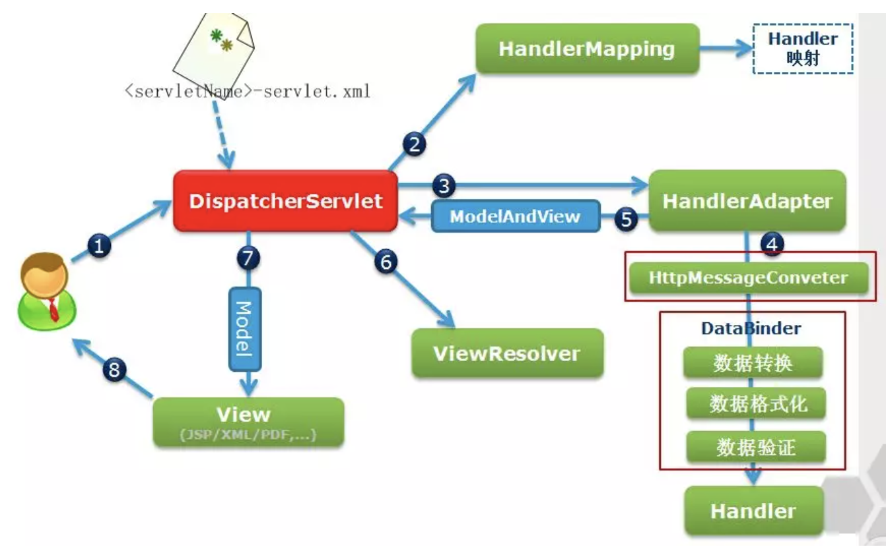

**Spring运行流程描述：**
1. 用户向服务器发送请求，请求被Spring 前端控制Servelt DispatcherServlet捕获；
2. DispatcherServlet对请求URL进行解析，得到请求资源标识符（URI）。然后根据该URI，调用HandlerMapping获得该Handler配置的所有相关的对象（包括Handler对象以及Handler对象对应的拦截器），最后以HandlerExecutionChain对象的形式返回；
3. DispatcherServlet 根据获得的Handler，选择一个合适的HandlerAdapter；（附注：如果成功获得HandlerAdapter后，此时将开始执行拦截器的preHandler(...)方法）
4.  提取Request中的模型数据，填充Handler入参，开始执行Handler（Controller)。 在填充Handler的入参过程中，根据你的配置，Spring将帮你做一些额外的工作：

- HttpMessageConveter： 将请求消息（如Json、xml等数据）转换成一个对象，将对象转换为指定的响应信息
- 数据转换：对请求消息进行数据转换。如String转换成Integer、Double等
- 数据根式化：对请求消息进行数据格式化。 如将字符串转换成格式化数字或格式化日期等
- 数据验证： 验证数据的有效性（长度、格式等），验证结果存储到BindingResult或Error中
5.  Handler执行完成后，向DispatcherServlet 返回一个ModelAndView对象；
6.  根据返回的ModelAndView，选择一个适合的ViewResolver（必须是已经注册到Spring容器中的ViewResolver)返回给DispatcherServlet ；
7. ViewResolver 结合Model和View，来渲染视图；
8. 将渲染结果返回给客户端。

**Spring MVC的核心组件：**

1. DispatcherServlet：中央控制器，把请求给转发到具体的控制类
2. Controller：具体处理请求的控制器
3. HandlerMapping：映射处理器，负责映射中央处理器转发给controller时的映射策略
4. ModelAndView：服务层返回的数据和视图层的封装类
5. ViewResolver：视图解析器，解析具体的视图
6. Interceptors ：拦截器，负责拦截我们定义的请求然后做处理工作

**@RequestMapping 的作用是什么？**

RequestMapping是一个用来处理请求地址映射的注解，可用于类或方法上。用于类上，表示类中的所有响应请求的方法都是以该地址作为父路径。

RequestMapping注解有六个属性，下面我们把她分成三类进行说明。

- value：指定请求的实际地址，指定的地址可以是URI Template 模式（后面将会说明）；
- method：指定请求的method类型， GET、POST、PUT、DELETE等；
- consumes：指定处理请求的提交内容类型（Content-Type），例如application/json, text/html；
- produces：指定返回的内容类型，仅当request请求头中的(Accept)类型中包含该指定类型才返回；
- params： 指定request中必须包含某些参数值是，才让该方法处理。
- headers：指定request中必须包含某些指定的header值，才能让该方法处理请求。