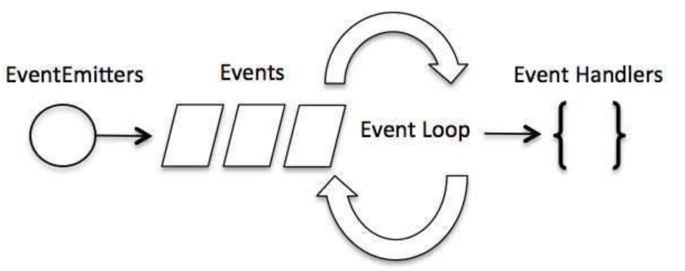
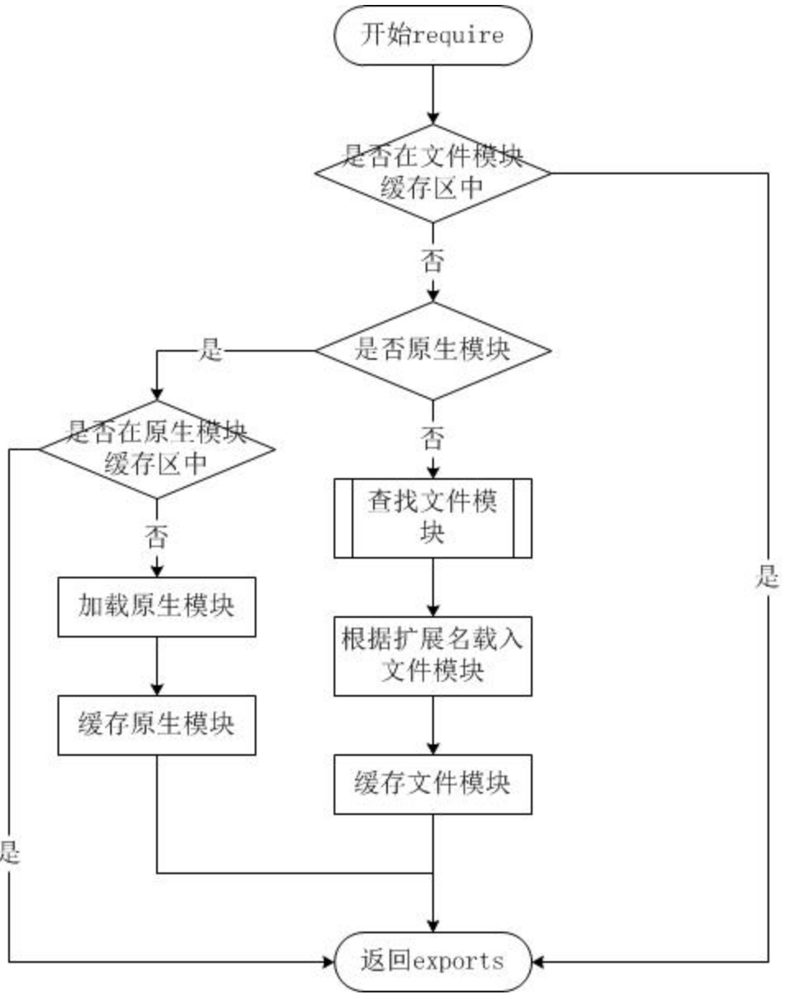

# doc-nodejs 

-   [nodejs](https://www.w3cschool.cn/nodejs/) w3cshool
-   [nodejs](https://www.runoob.com/nodejs/nodejs-tutorial.html) runoob

## nvm [nvm]

NVM是Node.js的版本管理工具，可以方便地在不同版本的Node.js之间切换。它可以通过命令行或者脚本来管理Node.js的版本，支持在同一台机器上安装多个版本的Node.js，并能够方便地切换它们。

NVM的主要功能包括：

-   安装和卸载Node.js的不同版本。
-   切换不同版本的Node.js。
-   管理全局和本地的Node.js模块。
-   支持在不同的操作系统上使用。

安装nvm

<https://github.com/nvm-sh/nvm> git主页有各种安装方式

curl -o-
<https://raw.githubusercontent.com/nvm-sh/nvm/v0.39.3/install.sh> \|
bash

nvm ls-remote 无返回问题

export NVM~NODEJSORGMIRROR~=<http://nodejs.org/dist>

如果使用了代理，需要shell设置 export
http~proxy~=<http://127.0.0.1:10080> export
https~proxy~=<http://127.0.0.1:10080>

镜像地址更换

nvm root 找到安装地址，打开settings文件，添加如下配置

node~mirror~: <https://cdn.npmmirror.com/binaries/node/> npm~mirror~:
<https://cdn.npmmirror.com/binaries/npm/>

## 基础

使用的版本

    $ node -v
    v4.4.3

### Hello World

    console.log("Hello World");

保存该文件，文件名为 helloworld.js， 并通过 node 命令来执行：

    node helloworld.js

交互模式

打开终端，键入node进入命令交互模式，可以输入一条代码语句后立即执行并显示结果，例如：

    $ node
    > console.log('Hello World!');
    Hello World!

### 第一个web应用

Node.js 应用是由哪几部分组成的：

require 指令：在 Node.js 中，使用 require
指令来加载和引入模块，引入的模块可以是内置模块，也可以是第三方模块或自定义模块。

创建服务器：服务器可以监听客户端的请求，类似于 Apache 、Nginx 等 HTTP
服务器。

接收请求与响应请求 服务器很容易创建，客户端可以使用浏览器或终端发送 HTTP
请求，服务器接收请求后返回响应数据。

使用 require 指令来加载和引入模块

``` javascript
const module = require('module-name');
```

其中，module-name
可以是一个文件路径（相对或绝对路径），也可以是一个模块名称，如果是一个模块名称，Node.js
会自动从 node~modules~ 目录中查找该模块。

require
指令会返回被加载的模块的导出对象，可以通过该对象来访问模块中定义的属性和方法，如果模块中有多个导出对象，则可以使用解构赋值的方式来获取它们。

我们使用 require 指令来载入 http 模块，并将实例化的 HTTP 赋值给变量
http，实例如下:

``` javascript
var http = require("http");
```

接下来我们使用 http.createServer() 方法创建服务器，并使用 listen
方法绑定 8888 端口。 函数通过 request, response 参数来接收和响应数据。

实例如下，在你项目的根目录下创建一个叫 server.js
的文件，并写入以下代码：

``` javascript
var http = require('http');

http.createServer(function (request, response) {

    // 发送 HTTP 头部 
    // HTTP 状态值: 200 : OK
    // 内容类型: text/plain
    response.writeHead(200, {'Content-Type': 'text/plain'});

    // 发送响应数据 "Hello World"
    response.end('Hello World\n');
}).listen(8888);

// 终端打印如下信息
console.log('Server running at http://127.0.0.1:8888/');
```

以上代码我们完成了一个可以工作的 HTTP 服务器。

使用 node 命令执行以上的代码：

    node server.js
    Server running at http://127.0.0.1:8888/

## NPM 使用介绍 [npm-使用介绍]

NPM是随同NodeJS一起安装的包管理工具，能解决NodeJS代码部署上的很多问题，常见的使用场景有以下几种：

-   允许用户从NPM服务器下载别人编写的第三方包到本地使用。
-   允许用户从NPM服务器下载并安装别人编写的命令行程序到本地使用。
-   允许用户将自己编写的包或命令行程序上传到NPM服务器供别人使用。

由于新版的nodejs已经集成了npm，所以之前npm也一并安装好了。同样可以通过输入
"npm -v" 来测试是否成功安装。命令如下，出现版本提示表示安装成功:

    $ npm -v
    2.3.0

如果你安装的是旧版本的 npm，可以很容易得通过 npm 命令来升级，命令如下：

    $ sudo npm install npm -g
    /usr/local/bin/npm -> /usr/local/lib/node_modules/npm/bin/npm-cli.js
    npm@2.14.2 /usr/local/lib/node_modules/npm

如果是 Window 系统使用以下命令即可：

    npm install npm -g

使用淘宝镜像的命令：

    npm install -g cnpm --registry=https://registry.npmmirror.com

### 使用 npm 命令安装模块

npm 安装 Node.js 模块语法格式如下：

    $ npm install <Module Name>

以下实例，我们使用 npm 命令安装常用的 Node.js web框架模块 express:

    $ npm install express

安装好之后，express 包就放在了工程目录下的 node~modules~
目录中，因此在代码中只需要通过 require('express')
的方式就好，无需指定第三方包路径。

    var express = require('express');

### 全局安装与本地安装

npm
的包安装分为本地安装（local）、全局安装（global）两种，从敲的命令行来看，差别只是有没有-g而已，比如

    npm install express          # 本地安装
    npm install express -g   # 全局安装

如果出现以下错误：

    npm err! Error: connect ECONNREFUSED 127.0.0.1:8087 

解决办法为：

    $ npm config set proxy null

本地安装

1.  将安装包放在 ./node~modules~ 下（运行 npm
    命令时所在的目录），如果没有 node~modules~ 目录，会在当前执行 npm
    命令的目录下生成 node~modules~ 目录。
2.  可以通过 require() 来引入本地安装的包。

全局安装

1.  将安装包放在 /usr/local 下或者你 node 的安装目录。
2.  可以直接在命令行里使用。

全局目录可以通过npm config set prefix '目录路径' 来设置，也可以通过 npm
config ls 、npm get prefix 来查看当前的全局目录

如果你希望具备两者功能，则需要在两个地方安装它或使用 npm link。

接下来我们使用全局方式安装 express

    $ npm install express -g

查看安装信息

你可以使用以下命令来查看所有全局安装的模块：

    $ npm list -g

    ├─┬ cnpm@4.3.2
    │ ├── auto-correct@1.0.0
    │ ├── bagpipe@0.3.5
    │ ├── colors@1.1.2
    │ ├─┬ commander@2.9.0
    │ │ └── graceful-readlink@1.0.1
    │ ├─┬ cross-spawn@0.2.9
    │ │ └── lru-cache@2.7.3
    ……

如果要查看某个模块的版本号，可以使用命令如下：

    $ npm list grunt

    projectName@projectVersion /path/to/project/folder
    └── grunt@0.4.1

### 使用 package.json

package.json 位于模块的目录下，用于定义包的属性。接下来让我们来看下
express 包的 package.json 文件，位于 node~modules~/express/package.json
内容：

``` javascript
{
  "name": "express",
  "description": "Fast, unopinionated, minimalist web framework",
  "version": "4.13.3",
  "author": {
    "name": "TJ Holowaychuk",
    "email": "tj@vision-media.ca"
  },
  "contributors": [
    {
      "name": "Aaron Heckmann",
      "email": "aaron.heckmann+github@gmail.com"
    },
    {
      "name": "Ciaran Jessup",
      "email": "ciaranj@gmail.com"
    }
  ],
  "license": "MIT",
  "repository": {
    "type": "git",
    "url": "git+https://github.com/strongloop/express.git"
  },
  "homepage": "http://expressjs.com/",
  "keywords": [
    "express",
    "framework",
    "sinatra",
    "web",
    "rest",
    "restful",
    "router",
    "app",
    "api"
  ],
  "dependencies": {
    "accepts": "~1.2.12",
    "array-flatten": "1.1.1",
    "content-disposition": "0.5.0",
    "content-type": "~1.0.1",
    "cookie": "0.1.3",
    "cookie-signature": "1.0.6"
  },
  "devDependencies": {
    "after": "0.8.1",
    "ejs": "2.3.3",
    "istanbul": "0.3.17",
    "marked": "0.3.5",
    "mocha": "2.2.5"
  },
  "engines": {
    "node": ">= 0.10.0"
  },
  "files": [
    "LICENSE",
    "History.md",
    "Readme.md",
    "index.js",
    "lib/"
  ],
  "scripts": {
    "test": "mocha --require test/support/env --reporter spec --bail --check-leaks test/ test/acceptance/",
    "test-ci": "istanbul cover node_modules/mocha/bin/_mocha --report lcovonly -- --require test/support/env --reporter spec --check-leaks test/ test/acceptance/",
    "test-cov": "istanbul cover node_modules/mocha/bin/_mocha -- --require test/support/env --reporter dot --check-leaks test/ test/acceptance/",
    "test-tap": "mocha --require test/support/env --reporter tap --check-leaks test/ test/acceptance/"
  },
  "gitHead": "ef7ad681b245fba023843ce94f6bcb8e275bbb8e",
  "bugs": {
    "url": "https://github.com/strongloop/express/issues"
  },
  "_id": "express@4.13.3",
  "_shasum": "ddb2f1fb4502bf33598d2b032b037960ca6c80a3",
  "_from": "express@*",
  "_npmVersion": "1.4.28",
  "_npmUser": {
    "name": "dougwilson",
    "email": "doug@somethingdoug.com"
  },
  "maintainers": [
    {
      "name": "tjholowaychuk",
      "email": "tj@vision-media.ca"
    },
    {
      "name": "jongleberry",
      "email": "jonathanrichardong@gmail.com"
    }
  ],
  "dist": {
    "shasum": "ddb2f1fb4502bf33598d2b032b037960ca6c80a3",
    "tarball": "http://registry.npmjs.org/express/-/express-4.13.3.tgz"
  },
  "directories": {},
  "_resolved": "https://registry.npmjs.org/express/-/express-4.13.3.tgz",
  "readme": "ERROR: No README data found!"
}

```

Package.json 属性说明

-   name - 包名。
-   version - 包的版本号。
-   description - 包的描述。
-   homepage - 包的官网 url 。
-   author - 包的作者姓名。
-   contributors - 包的其他贡献者姓名。
-   dependencies - 依赖包列表。如果依赖包没有安装，npm
    会自动将依赖包安装在 node~module~ 目录下。
-   repository - 包代码存放的地方的类型，可以是 git 或 svn，git 可在
    Github 上。
-   main - main 字段指定了程序的主入口文件，require('moduleName')
    就会加载这个文件。这个字段的默认值是模块根目录下面的 index.js。
-   keywords - 关键字

### 卸载更新模块

我们可以使用以下命令来卸载 Node.js 模块。

\$ npm uninstall express

卸载后，你可以到 *node~modules~*
目录下查看包是否还存在，或者使用以下命令查看：

\$ npm ls

更新模块

我们可以使用以下命令更新模块：

\$ npm update express

搜索模块

使用以下来搜索模块：

\$ npm search express

### 创建模块

创建模块，package.json 文件是必不可少的。我们可以使用 NPM 生成
package.json 文件，生成的文件包含了基本的结果。

    $ npm init
    This utility will walk you through creating a package.json file.
    It only covers the most common items, and tries to guess sensible defaults.

    See `npm help json` for definitive documentation on these fields
    and exactly what they do.

    Use `npm install <pkg> --save` afterwards to install a package and
    save it as a dependency in the package.json file.

    Press ^C at any time to quit.
    name: (node_modules) runoob                   # 模块名
    version: (1.0.0) 
    description: Node.js 测试模块(www.runoob.com)  # 描述
    entry point: (index.js) 
    test command: make test
    git repository: https://github.com/runoob/runoob.git  # Github 地址
    keywords: 
    author: 
    license: (ISC) 
    About to write to ……/node_modules/package.json:      # 生成地址

    {
      "name": "runoob",
      "version": "1.0.0",
      "description": "Node.js 测试模块(www.runoob.com)",
      ……
    }


    Is this ok? (yes) yes

以上的信息，你需要根据你自己的情况输入。在最后输入 "yes" 后会生成
package.json 文件。

接下来我们可以使用以下命令在 npm 资源库中注册用户（使用邮箱注册）：

    $ npm adduser
    Username: mcmohd
    Password:
    Email: (this IS public) mcmohd@gmail.com

接下来我们就用以下命令来发布模块：

    $ npm publish

如果你以上的步骤都操作正确，你就可以跟其他模块一样使用 npm 来安装。

### 版本号

使用 NPM 下载和发布代码时都会接触到版本号。NPM
使用语义版本号来管理代码，这里简单介绍一下。

语义版本号分为X.Y.Z三位，分别代表主版本号、次版本号和补丁版本号。当代码变更时，版本号按以下原则更新。

-   如果只是修复bug，需要更新Z位。
-   如果是新增了功能，但是向下兼容，需要更新Y位。
-   如果有大变动，向下不兼容，需要更新X位。

版本号有了这个保证后，在申明第三方包依赖时，除了可依赖于一个固定版本号外，还可依赖于某个范围的版本号。例如"argv":
"0.0.x"表示依赖于0.0.x系列的最新版argv。

NPM支持的所有版本号范围指定方式可以查看官方文档。

### NPM 常用命令

除了本章介绍的部分外，NPM还提供了很多功能，package.json里也有很多其它有用的字段。

除了可以在npmjs.org/doc/查看官方文档外，这里再介绍一些NPM常用命令。

NPM提供了很多命令，例如install和publish，使用npm help可查看所有命令。

-   使用npm help \<command\>可查看某条命令的详细帮助，例如npm help
    install。
-   在package.json所在目录下使用npm install .
    -g可先在本地安装当前命令行程序，可用于发布前的本地测试。
-   使用npm update
    \<package\>可以把当前目录下node~modules子目录里边的对应模块更新至最新版本~。
-   使用npm update \<package\>
    -g可以把全局安装的对应命令行程序更新至最新版。
-   使用npm cache
    clear可以清空NPM本地缓存，用于对付使用相同版本号发布新版本代码的人。
-   使用npm unpublish
    \<package\>@\<version\>可以撤销发布自己发布过的某个版本代码。

### NPM create [npm-create]

npm v6 版本给 init 命令添加了别名 create，俩命令一样的

npm init 命令除了可以用来创建 package.json
文件，还可以用来执行一个包的命令；它后面还可以接一个 \<initializer\>
参数。该命令格式：

    npm init <initializer>

参数 initializer 是名为 create-\<initializer\> 的 npm 包 ( 例如
create-vite )，执行 npm init \<initializer\> 将会被转换为相应的 npm exec
操作，即会使用 npm exec 命令来运行 create-\<initializer\> 包中对应命令
create-\<initializer\>（package.json 的 bin 字段指定），例如：

    # 使用 create-vite 包的 create-vite 命令创建一个名为 my-vite-project 的项目
    $ npm init vite my-vite-project
    # 等同于
    $ npm exec create-vite my-vite-project

当我们执行 npm create vite 时，会先补全包名为 create-vite，转换为使用
npm exec 命令执行，即 npm exec create-vite，接着执行包对应的 create-vite
命令（如果本地未安装 create-vite 包则先安装再执行）

### 使用淘宝 NPM 镜像

由于国内直接使用 npm 的官方镜像是非常慢的，这里推荐使用淘宝 NPM 镜像。

淘宝 NPM 镜像是一个完整 npmjs.org
镜像，你可以用此代替官方版本(只读)，同步频率目前为 10分钟
一次以保证尽量与官方服务同步。

你可以使用淘宝定制的 cnpm (gzip 压缩支持) 命令行工具代替默认的 npm:

    $ npm install -g cnpm --registry=https://registry.npmmirror.com

这样就可以使用 cnpm 命令来安装模块了：

    $ cnpm install [name]

更多信息可以查阅：https://npmmirror.com/。

## 事件循环

Node.js 是单进程单线程应用程序，但是因为 V8
引擎提供的异步执行回调接口，通过这些接口可以处理大量的并发，所以性能非常高。

Node.js 几乎每一个 API 都是支持回调函数的。

Node.js 基本上所有的事件机制都是用设计模式中观察者模式实现。

Node.js
单线程类似进入一个while(true)的事件循环，直到没有事件观察者退出，每个异步事件都生成一个事件观察者，如果有事件发生就调用该回调函数.

### 事件驱动程序

Node.js 使用事件驱动模型，当web
server接收到请求，就把它关闭然后进行处理，然后去服务下一个web请求。

当这个请求完成，它被放回处理队列，当到达队列开头，这个结果被返回给用户。

这个模型非常高效可扩展性非常强，因为 webserver
一直接受请求而不等待任何读写操作。（这也称之为非阻塞式IO或者事件驱动IO）

在事件驱动模型中，会生成一个主循环来监听事件，当检测到事件时触发回调函数。



整个事件驱动的流程就是这么实现的，非常简洁。有点类似于观察者模式，事件相当于一个主题(Subject)，而所有注册到这个事件上的处理函数相当于观察者(Observer)。

Node.js 有多个内置的事件，我们可以通过引入 events 模块，并通过实例化
EventEmitter 类来绑定和监听事件，如下实例：

``` javascript
// 引入 events 模块
var events = require('events');
// 创建 eventEmitter 对象
var eventEmitter = new events.EventEmitter();
```

以下程序绑定事件处理程序：

``` javascript
// 绑定事件及事件的处理程序
eventEmitter.on('eventName', eventHandler);
```

我们可以通过程序触发事件：

``` javascript
// 触发事件
eventEmitter.emit('eventName');
```

### 实例

创建 main.js 文件，代码如下所示：

``` javascript
// 引入 events 模块
var events = require('events');
// 创建 eventEmitter 对象
var eventEmitter = new events.EventEmitter();

// 创建事件处理程序
var connectHandler = function connected() {
   console.log('连接成功。');

   // 触发 data_received 事件 
   eventEmitter.emit('data_received');
}

// 绑定 connection 事件处理程序
eventEmitter.on('connection', connectHandler);

// 使用匿名函数绑定 data_received 事件
eventEmitter.on('data_received', function(){
   console.log('数据接收成功。');
});

// 触发 connection 事件 
eventEmitter.emit('connection');

console.log("程序执行完毕。");
```

    $ node main.js
    连接成功。
    数据接收成功。
    程序执行完毕。

## EventEmitter

Node.js 所有的异步 I/O 操作在完成时都会发送一个事件到事件队列。

Node.js 里面的许多对象都会分发事件：一个 net.Server
对象会在每次有新连接时触发一个事件， 一个 fs.readStream
对象会在文件被打开的时候触发一个事件。 所有这些产生事件的对象都是
events.EventEmitter 的实例。

### EventEmitter 类

events 模块只提供了一个对象： events.EventEmitter。EventEmitter
的核心就是事件触发与事件监听器功能的封装。

你可以通过require("events");来访问该模块。

``` javascript
// 引入 events 模块
var events = require('events');
// 创建 eventEmitter 对象
var eventEmitter = new events.EventEmitter();
```

EventEmitter 对象如果在实例化时发生错误，会触发 error
事件。当添加新的监听器时，newListener
事件会触发，当监听器被移除时，removeListener 事件被触发。

下面我们用一个简单的例子说明 EventEmitter 的用法：

``` javascript
//event.js 文件
var EventEmitter = require('events').EventEmitter; 
var event = new EventEmitter(); 
event.on('some_event', function() { 
    console.log('some_event 事件触发'); 
}); 
setTimeout(function() { 
    event.emit('some_event'); 
}, 1000); 

```

执行结果如下：

运行这段代码，1 秒后控制台输出了 'some~event~ 事件触发'。其原理是 event 对象注册了事件 some~event~ 的一个监听器，然后我们通过 setTimeout 在 1000 毫秒以后向 event 对象发送事件 some~event~，此时会调用some~event~ 的监听器。

    $ node event.js 
    some_event 事件触发

EventEmitter 的每个事件由一个事件名和若干个参数组成，事件名是一个字符串，通常表达一定的语义。对于每个事件，EventEmitter
支持 若干个事件监听器。

当事件触发时，注册到这个事件的事件监听器被依次调用，事件参数作为回调函数参数传递。

让我们以下面的例子解释这个过程：

``` javascript
//event.js 文件
var events = require('events'); 
var emitter = new events.EventEmitter(); 
emitter.on('someEvent', function(arg1, arg2) { 
    console.log('listener1', arg1, arg2); 
}); 
emitter.on('someEvent', function(arg1, arg2) { 
    console.log('listener2', arg1, arg2); 
}); 
emitter.emit('someEvent', 'arg1 参数', 'arg2 参数'); 
```

执行以上代码，运行的结果如下：

    $ node event.js 
    listener1 arg1 参数 arg2 参数
    listener2 arg1 参数 arg2 参数

以上例子中，emitter 为事件 someEvent 注册了两个事件监听器，然后触发了 someEvent 事件。

运行结果中可以看到两个事件监听器回调函数被先后调用。 这就是EventEmitter最简单的用法。

EventEmitter 提供了多个属性，如 on 和 emit。on 函数用于绑定事件函数，emit 属性用于触发一个事件。接下来我们来具体看下
EventEmitter 的属性介绍。

看源文件

### 实例

以下实例通过 connection（连接）事件演示了 EventEmitter 类的应用。

创建 main.js 文件，代码如下：

``` javascript
var events = require('events');
var eventEmitter = new events.EventEmitter();

// 监听器 #1
var listener1 = function listener1() {
   console.log('监听器 listener1 执行。');
}

// 监听器 #2
var listener2 = function listener2() {
  console.log('监听器 listener2 执行。');
}

// 绑定 connection 事件，处理函数为 listener1 
eventEmitter.addListener('connection', listener1);

// 绑定 connection 事件，处理函数为 listener2
eventEmitter.on('connection', listener2);

var eventListeners = eventEmitter.listenerCount('connection');
console.log(eventListeners + " 个监听器监听连接事件。");

// 处理 connection 事件 
eventEmitter.emit('connection');

// 移除监绑定的 listener1 函数
eventEmitter.removeListener('connection', listener1);
console.log("listener1 不再受监听。");

// 触发连接事件
eventEmitter.emit('connection');

eventListeners = eventEmitter.listenerCount('connection');
console.log(eventListeners + " 个监听器监听连接事件。");

console.log("程序执行完毕。");

```

以上代码，执行结果如下所示：

    $ node main.js
    2 个监听器监听连接事件。
    监听器 listener1 执行。
    监听器 listener2 执行。
    listener1 不再受监听。
    监听器 listener2 执行。
    1 个监听器监听连接事件。
    程序执行完毕。

### error 事件

EventEmitter 定义了一个特殊的事件 error，它包含了错误的语义，我们在遇到 异常的时候通常会触发 error 事件。

当 error 被触发时，EventEmitter 规定如果没有响 应的监听器，Node.js 会把它当作异常，退出程序并输出错误信息。

我们一般要为会触发 error 事件的对象设置监听器，避免遇到错误后整个程序崩溃。例如：

``` javascript
var events = require('events'); 
var emitter = new events.EventEmitter(); 
emitter.emit('error'); 
```

运行时会显示以下错误：

    node.js:201 
    throw e; // process.nextTick error, or 'error' event on first tick 
    ^ 
    Error: Uncaught, unspecified 'error' event. 
    at EventEmitter.emit (events.js:50:15) 
    at Object.<anonymous> (/home/byvoid/error.js:5:9) 
    at Module._compile (module.js:441:26) 
    at Object..js (module.js:459:10) 
    at Module.load (module.js:348:31) 
    at Function._load (module.js:308:12) 
    at Array.0 (module.js:479:10) 
    at EventEmitter._tickCallback (node.js:192:40) 

### 继承 EventEmitter

大多数时候我们不会直接使用 EventEmitter，而是在对象中继承它。包括 fs、net、 http 在内的，只要是支持事件响应的核心模块都是 EventEmitter 的子类。

为什么要这样做呢？原因有两点：

首先，具有某个实体功能的对象实现事件符合语义， 事件的监听和发生应该是一个对象的方法。

其次 JavaScript 的对象机制是基于原型的，支持 部分多重继承，继承 EventEmitter 不会打乱对象原有的继承关系。

## Buffer(缓冲区)

JavaScript 语言自身只有字符串数据类型，没有二进制数据类型。

但在处理像TCP流或文件流时，必须使用到二进制数据。因此在 Node.js中，定义了一个 Buffer 类，该类用来创建一个专门存放二进制数据的缓存区。

在 Node.js 中，Buffer 类是随 Node 内核一起发布的核心库。Buffer 库为 Node.js 带来了一种存储原始数据的方法，可以让 Node.js 处理二进制数据，每当需要在 Node.js 中处理I/O操作中移动的数据时，就有可能使用 Buffer 库。原始数据存储在 Buffer 类的实例中。一个 Buffer 类似于一个整数数组，但它对应于 V8 堆内存之外的一块原始内存。

在v6.0之前创建Buffer对象直接使用new Buffer()构造函数来创建对象实例，但是Buffer对内存的权限操作相比很大，可以直接捕获一些敏感信息，所以在v6.0以后，官方文档里面建议使用 Buffer.from() 接口去创建Buffer对象。

### Buffer 与字符编码

Buffer 实例一般用于表示编码字符的序列，比如 UTF-8 、 UCS2 、 Base64 、或十六进制编码的数据。 通过使用显式的字符编码，就可以在 Buffer 实例与普通的 JavaScript 字符串之间进行相互转换。

``` javascript
const buf = Buffer.from('runoob', 'ascii');

// 输出 72756e6f6f62
console.log(buf.toString('hex'));

// 输出 cnVub29i
console.log(buf.toString('base64'));
```

Node.js 目前支持的字符编码包括：

-   ascii - 仅支持 7 位 ASCII
    数据。如果设置去掉高位的话，这种编码是非常快的。
-   utf8 - 多字节编码的 Unicode 字符。许多网页和其他文档格式都使用 UTF-8
    。
-   utf16le - 2 或 4 个字节，小字节序编码的 Unicode
    字符。支持代理对（U+10000 至 U+10FFFF）。
-   ucs2 - utf16le 的别名。
-   base64 - Base64 编码。
-   latin1 - 一种把 Buffer 编码成一字节编码的字符串的方式。
-   binary - latin1 的别名。
-   hex - 将每个字节编码为两个十六进制字符。

其他操作看教程文档

## Stream(流)

Stream 是一个抽象接口，Node 中有很多对象实现了这个接口。例如，对http
服务器发起请求的request 对象就是一个 Stream，还有stdout（标准输出）。

Node.js，Stream 有四种流类型：

-   Readable - 可读操作。
-   Writable - 可写操作。
-   Duplex - 可读可写操作.
-   Transform - 操作被写入数据，然后读出结果。

所有的 Stream 对象都是 EventEmitter 的实例。常用的事件有：

-   data - 当有数据可读时触发。
-   end - 没有更多的数据可读时触发。
-   error - 在接收和写入过程中发生错误时触发。
-   finish - 所有数据已被写入到底层系统时触发。

本教程会为大家介绍常用的流操作。

### 从流中读取数据

``` javascript
var fs = require("fs");
var data = '';

// 创建可读流
var readerStream = fs.createReadStream('input.txt');

// 设置编码为 utf8。
readerStream.setEncoding('UTF8');

// 处理流事件 --> data, end, and error
readerStream.on('data', function(chunk) {
   data += chunk;
});

readerStream.on('end',function(){
   console.log(data);
});

readerStream.on('error', function(err){
   console.log(err.stack);
});

console.log("程序执行完毕");
```

### 写入流

``` javascript
var fs = require("fs");
var data = '菜鸟教程官网地址：www.runoob.com';

// 创建一个可以写入的流，写入到文件 output.txt 中
var writerStream = fs.createWriteStream('output.txt');

// 使用 utf8 编码写入数据
writerStream.write(data,'UTF8');

// 标记文件末尾
writerStream.end();

// 处理流事件 --> finish、error
writerStream.on('finish', function() {
    console.log("写入完成。");
});

writerStream.on('error', function(err){
   console.log(err.stack);
});

console.log("程序执行完毕");
```

### 管道流

``` javascript
var fs = require("fs");

// 创建一个可读流
var readerStream = fs.createReadStream('input.txt');

// 创建一个可写流
var writerStream = fs.createWriteStream('output.txt');

// 管道读写操作
// 读取 input.txt 文件内容，并将内容写入到 output.txt 文件中
readerStream.pipe(writerStream);

console.log("程序执行完毕");

```

### 链式流

``` javascript
var fs = require("fs");
var zlib = require('zlib');

// 压缩 input.txt 文件为 input.txt.gz
fs.createReadStream('input.txt')
  .pipe(zlib.createGzip())
  .pipe(fs.createWriteStream('input.txt.gz'));

console.log("文件压缩完成。");

```

``` javascript
var fs = require("fs");
var zlib = require('zlib');

// 解压 input.txt.gz 文件为 input.txt
fs.createReadStream('input.txt.gz')
  .pipe(zlib.createGunzip())
  .pipe(fs.createWriteStream('input.txt'));

console.log("文件解压完成。");
```

## 模块系统

为了让Node.js的文件可以相互调用，Node.js提供了一个简单的模块系统。

模块是Node.js
应用程序的基本组成部分，文件和模块是一一对应的。换言之，一个 Node.js
文件就是一个模块，这个文件可能是JavaScript 代码、JSON 或者编译过的C/C++
扩展。

### 引入模块

在 Node.js 中，引入一个模块非常简单，如下我们创建一个 main.js 文件并引入
hello 模块，代码如下:

``` javascript
var hello = require('./hello');
hello.world();
```

以上实例中，代码 require('./hello') 引入了当前目录下的 hello.js 文件（./
为当前目录，node.js 默认后缀为 js）。

Node.js 提供了 exports 和 require 两个对象，其中 exports
是模块公开的接口，require 用于从外部获取一个模块的接口，即所获取模块的
exports 对象。

接下来我们就来创建 hello.js 文件，代码如下：

``` javascript
exports.world = function() {
  console.log('Hello World');
}
```

在以上示例中，hello.js 通过 exports 对象把 world 作为模块的访问接口，在
main.js 中通过 require('./hello') 加载这个模块，然后就可以直接访 问
hello.js 中 exports 对象的成员函数了。

有时候我们只是想把一个对象封装到模块中，格式如下：

``` javascript
module.exports = function() {
  // ...
}
```

例如:

``` javascript
//hello.js 
function Hello() { 
    var name; 
    this.setName = function(thyName) { 
        name = thyName; 
    }; 
    this.sayHello = function() { 
        console.log('Hello ' + name); 
    }; 
}; 
module.exports = Hello;

```

这样就可以直接获得这个对象了：

``` javascript
//main.js 
var Hello = require('./hello'); 
hello = new Hello(); 
hello.setName('BYVoid'); 
hello.sayHello(); 
```

模块接口的唯一变化是使用 module.exports = Hello 代替了exports.world =
function(){}。 在外部引用该模块时，其接口对象就是要输出的 Hello
对象本身，而不是原先的 exports。

### 服务端的模块放在哪里

也许你已经注意到，我们已经在代码中使用了模块了。像这样：

``` javascript
var http = require("http");
...
http.createServer(...);
```

Node.js 中自带了一个叫做 http
的模块，在我们的代码中请求它并把返回值赋给一个本地变量。

这把我们的本地变量变成了一个拥有所有 http 模块所提供的公共方法的对象。

Node.js 的 require 方法中的文件查找策略如下：

由于 Node.js 中存在 4 类模块（原生模块和3种文件模块），尽管 require
方法极其简单，但是内部的加载却是十分复杂的，其加载优先级也各自不同。如下图所示：

```{=org}
#+DOWNLOADED: screenshot @ 2023-10-16 10:04:02
```


从文件模块缓存中加载

尽管原生模块与文件模块的优先级不同，但是都会优先从文件模块的缓存中加载已经存在的模块。

从原生模块加载

原生模块的优先级仅次于文件模块缓存的优先级。require
方法在解析文件名之后，优先检查模块是否在原生模块列表中。以http模块为例，尽管在目录下存在一个
http/http.js/http.node/http.json 文件，require("http")
都不会从这些文件中加载，而是从原生模块中加载。

原生模块也有一个缓存区，同样也是优先从缓存区加载。如果缓存区没有被加载过，则调用原生模块的加载方式进行加载和执行。

从文件加载

当文件模块缓存中不存在，而且不是原生模块的时候，Node.js 会解析 require
方法传入的参数，并从文件系统中加载实际的文件，加载过程中的包装和编译细节在前一节中已经介绍过，这里我们将详细描述查找文件模块的过程，其中，也有一些细节值得知晓。

require方法接受以下几种参数的传递：

-   http、fs、path等，原生模块。
-   ./mod或../mod，相对路径的文件模块。
-   /pathtomodule/mod，绝对路径的文件模块。
-   mod，非原生模块的文件模块。
-   在路径 Y 下执行 require(X) 语句执行顺序：

```{=html}
<!-- -->
```
    1. 如果 X 是内置模块
       a. 返回内置模块
       b. 停止执行
    2. 如果 X 以 '/' 开头
       a. 设置 Y 为文件根路径
    3. 如果 X 以 './' 或 '/' or '../' 开头
       a. LOAD_AS_FILE(Y + X)
       b. LOAD_AS_DIRECTORY(Y + X)
    4. LOAD_NODE_MODULES(X, dirname(Y))
    5. 抛出异常 "not found"

    LOAD_AS_FILE(X)
    1. 如果 X 是一个文件, 将 X 作为 JavaScript 文本载入并停止执行。
    2. 如果 X.js 是一个文件, 将 X.js 作为 JavaScript 文本载入并停止执行。
    3. 如果 X.json 是一个文件, 解析 X.json 为 JavaScript 对象并停止执行。
    4. 如果 X.node 是一个文件, 将 X.node 作为二进制插件载入并停止执行。

    LOAD_INDEX(X)
    1. 如果 X/index.js 是一个文件,  将 X/index.js 作为 JavaScript 文本载入并停止执行。
    2. 如果 X/index.json 是一个文件, 解析 X/index.json 为 JavaScript 对象并停止执行。
    3. 如果 X/index.node 是一个文件,  将 X/index.node 作为二进制插件载入并停止执行。

    LOAD_AS_DIRECTORY(X)
    1. 如果 X/package.json 是一个文件,
       a. 解析 X/package.json, 并查找 "main" 字段。
       b. let M = X + (json main 字段)
       c. LOAD_AS_FILE(M)
       d. LOAD_INDEX(M)
    2. LOAD_INDEX(X)

    LOAD_NODE_MODULES(X, START)
    1. let DIRS=NODE_MODULES_PATHS(START)
    2. for each DIR in DIRS:
       a. LOAD_AS_FILE(DIR/X)
       b. LOAD_AS_DIRECTORY(DIR/X)

    NODE_MODULES_PATHS(START)
    1. let PARTS = path split(START)
    2. let I = count of PARTS - 1
    3. let DIRS = []
    4. while I >= 0,
       a. if PARTS[I] = "node_modules" CONTINUE
       b. DIR = path join(PARTS[0 .. I] + "node_modules")
       c. DIRS = DIRS + DIR
       d. let I = I - 1
    5. return DIRS

exports 和 module.exports 的使用

如果要对外暴露属性或方法，就用 exports
就行，要暴露对象(类似class，包含了很多属性和方法)，就用 module.exports。

## 路由

我们要为路由提供请求的 URL 和其他需要的 GET 及 POST
参数，随后路由需要根据这些数据来执行相应的代码。

因此，我们需要查看 HTTP 请求，从中提取出请求的 URL 以及 GET/POST
参数。这一功能应当属于路由还是服务器（甚至作为一个模块自身的功能）确实值得探讨，但这里暂定其为我们的HTTP服务器的功能。

我们需要的所有数据都会包含在 request 对象中，该对象作为 onRequest()
回调函数的第一个参数传递。但是为了解析这些数据，我们需要额外的 Node.JS
模块，它们分别是 url 和 querystring 模块。

                       url.parse(string).query
                                               |
               url.parse(string).pathname      |
                           |                   |
                           |                   |
                         ------ -------------------
    http://localhost:8888/start?foo=bar&hello=world
                                    ---       -----
                                     |          |
                                     |          |
                  querystring.parse(queryString)["foo"]    |
                                                |
                             querystring.parse(queryString)["hello"]

当然我们也可以用 querystring 模块来解析 POST
请求体中的参数，稍后会有演示。

现在我们来给 onRequest() 函数加上一些逻辑，用来找出浏览器请求的 URL
路径：

``` javascript
var http = require("http");
var url = require("url");

function start() {
  function onRequest(request, response) {
    var pathname = url.parse(request.url).pathname;
    console.log("Request for " + pathname + " received.");
    response.writeHead(200, {"Content-Type": "text/plain"});
    response.write("Hello World");
    response.end();
  }

  http.createServer(onRequest).listen(8888);
  console.log("Server has started.");
}

exports.start = start;
```

好了，我们的应用现在可以通过请求的 URL
路径来区别不同请求了–这使我们得以使用路由（还未完成）来将请求以 URL
路径为基准映射到处理程序上。

在我们所要构建的应用中，这意味着来自 /start 和 /upload
的请求可以使用不同的代码来处理。稍后我们将看到这些内容是如何整合到一起的。

现在我们可以来编写路由了，建立一个名为 router.js 的文件，添加以下内容：

``` javascript
function route(pathname) {
  console.log("About to route a request for " + pathname);
}

exports.route = route;
```

如你所见，这段代码什么也没干，不过对于现在来说这是应该的。在添加更多的逻辑以前，我们先来看看如何把路由和服务器整合起来。

我们的服务器应当知道路由的存在并加以有效利用。我们当然可以通过硬编码的方式将这一依赖项绑定到服务器上，但是其它语言的编程经验告诉我们这会是一件非常痛苦的事，因此我们将使用依赖注入的方式较松散地添加路由模块。

首先，我们来扩展一下服务器的 start()
函数，以便将路由函数作为参数传递过去，server.js 文件代码如下

``` javascript
var http = require("http");
var url = require("url");

function start(route) {
  function onRequest(request, response) {
    var pathname = url.parse(request.url).pathname;
    console.log("Request for " + pathname + " received.");

    route(pathname);

    response.writeHead(200, {"Content-Type": "text/plain"});
    response.write("Hello World");
    response.end();
  }

  http.createServer(onRequest).listen(8888);
  console.log("Server has started.");
}

exports.start = start;
```

同时，我们会相应扩展 index.js，使得路由函数可以被注入到服务器中：

``` javascript
var server = require("./server");
var router = require("./router");

server.start(router.route);
```

在这里，我们传递的函数依旧什么也没做。

如果现在启动应用（node
index.js，始终记得这个命令行），随后请求一个URL，你将会看到应用输出相应的信息，这表明我们的HTTP服务器已经在使用路由模块了，并会将请求的路径传递给路由：

    $ node index.js
    Server has started.

根据前面的 event 绑定，直接将事件名定义成路径还是很不错的，不过要区分
request.method 是 get 还是 post ，可以分两个文件处理

``` javascript
var http = require("http");
var url = require('url');
const { exit } = require("process");
var events = require('events');

// 创建 eventEmitter 对象 
var eventEmitter = new events.EventEmitter();

// route 根路径 
eventEmitter.on('/', function(method, response){
    response.writeHead(200, {'Content-Type': 'text/plain'});
    response.end('Hello World\n');
});

// route 404 
eventEmitter.on('404', function(method, url, response){
    response.writeHead(404, {'Content-Type': 'text/plain'});
    response.end('404 Not Found\n');
});

// 启动服务 
http.createServer(function (request, response) {
    console.log(request.url);

    // 分发 
    if (eventEmitter.listenerCount(request.url) > 0){
        eventEmitter.emit(request.url, request.method, response);
    }
    else {
        eventEmitter.emit('404', request.method, request.url, response);
    }

}).listen(8888);

console.log('Server running at http://127.0.0.1:8888/');
```

## 全局对象

JavaScript 中有一个特殊的对象，称为全局对象（Global
Object），它及其所有属性都可以在程序的任何地方访问，即全局变量。

在浏览器 JavaScript 中，通常 window 是全局对象， 而 Node.js
中的全局对象是 global，所有全局变量（除了 global 本身以外）都是 global
对象的属性。

在 Node.js 我们可以直接访问到 global 的属性，而不需要在应用中包含它。

### 全局对象与全局变量

global 最根本的作用是作为全局变量的宿主。按照 ECMAScript
的定义，满足以下条 件的变量是全局变量：

-   在最外层定义的变量；
-   全局对象的属性；
-   隐式定义的变量（未定义直接赋值的变量）。

当你定义一个全局变量时，这个变量同时也会成为全局对象的属性，反之亦然。需要注
意的是，在 Node.js
中你不可能在最外层定义变量，因为所有用户代码都是属于当前模块的，
而模块本身不是最外层上下文。

注意： 最好不要使用 var
定义变量以避免引入全局变量，因为全局变量会污染命名空间，提高代码的耦合风险。

-   \_~filename~

表示当前正在执行的脚本的文件名。它将输出文件所在位置的绝对路径，且和命令行参数所指定的文件名不一定相同。
如果在模块中，返回的值是模块文件的路径。

-   \_~dirname~

表示当前执行脚本所在的目录。

-   setTimeout(cb, ms)

全局函数在指定的毫秒(ms)数后执行指定函数(cb)。：setTimeout()
只执行一次指定函数。

返回一个代表定时器的句柄值。

-   clearTimeout(t): 全局函数用于停止一个之前通过 setTimeout()
    创建的定时器。 参数 t 是通过 setTimeout() 函数创建的定时器。

-   setInterval(cb, ms) : 全局函数在指定的毫秒(ms)数后执行指定函数(cb)。

返回一个代表定时器的句柄值。可以使用 clearInterval(t) 函数来清除定时器。

setInterval() 方法会不停地调用函数，直到 clearInterval()
被调用或窗口被关闭。

-   console
    -   console.log
    -   console.info
    -   console.error
    -   console.warn
    -   console.dir:
        对一个对象进行检查（inspect），并以易于阅读和打印的格式显示。
    -   console.time: 输出时间，表示计时开始。
    -   console.timeEnd: 结束时间，表示计时结束。
    -   console.trace: 当前执行的代码在堆栈中的调用路径
    -   console.assert: 用于判断某个表达式或变量是否为真

console 用于提供控制台标准输出，它是由 Internet Explorer 的 JScript
引擎提供的调试工具，后来逐渐成为浏览器的实施标准。

Node.js 沿用了这个标准，提供与习惯行为一致的 console
对象，用于向标准输出流（stdout）或标准错误流（stderr）输出字符。

-   process: 一个全局变量，即 global 对象的属性。

它用于描述当前Node.js
进程状态的对象，提供了一个与操作系统的简单接口。通常在你写本地命令行程序的时候，少不了要
和它打交道。
