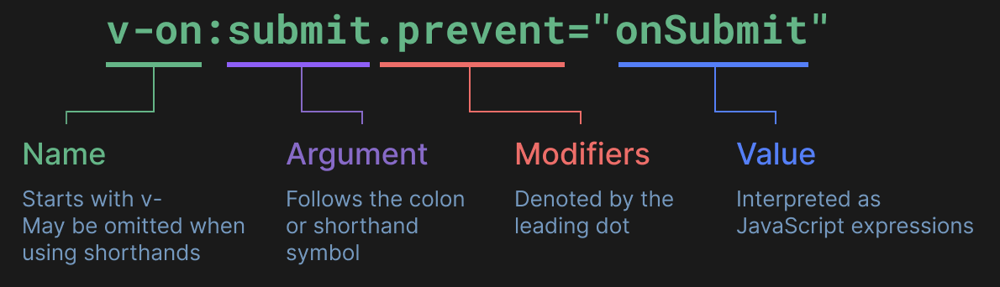
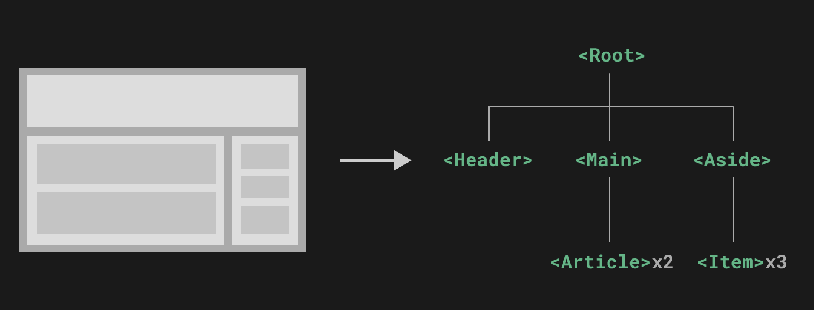
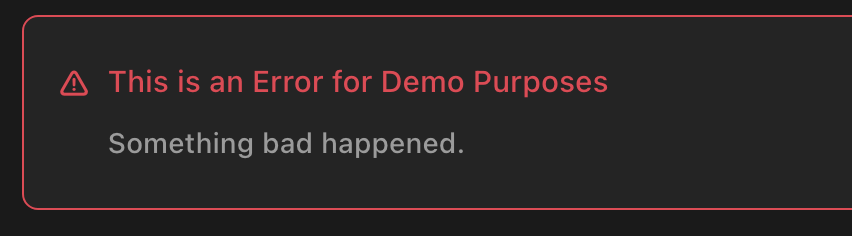

# doc-vue 

-   [官网vue2](https://v2.cn.vuejs.org/)
-   [官网vue3](https://cn.vuejs.org/)
-   [Vue Router](https://router.vuejs.org/zh/)
-   [doc-vue-com](id:doc-cst-js-vue-component)
-   [doc-vue-router](id:doc-cst-js-vue-router)

## hello demo

以下推荐国外比较稳定的两个
CDN，国内还没发现哪一家比较好，目前还是建议下载到本地。

-   Staticfile CDN（国内） :
    <https://cdn.staticfile.org/vue/2.2.2/vue.min.js>
-   unpkg：https://unpkg.com/vue@2.6.14/dist/vue.min.js。
-   cdnjs :
    <https://cdnjs.cloudflare.com/ajax/libs/vue/2.1.8/vue.min.js>

``` html
<!DOCTYPE html>
<html>
<head>
<meta charset="utf-8">
<title>Vue 测试实例</title>
<script src="https://cdn.staticfile.org/vue/2.7.0/vue.min.js"></script>
</head>
<body>
<div id="app">
  <p>{{ message }}</p>
</div>

<script>
new Vue({
  el: '#app',
  data: {
    message: 'Hello Vue.js!'
  }
})
</script>
</body>
</html>
```

## 创建一个 Vue 应用

[NPM create](id:doc-cst-js-node-create)

本地搭建 Vue 单页应用。创建的项目将使用基于 Vite
的构建设置，并允许我们使用 Vue 的单文件组件 (SFC)。

    npm create vue@latest

    > cd <your-project-name>
    > npm install
    > npm run dev

通过 CDN 使用 Vue

``` html
<script src="https://unpkg.com/vue@3/dist/vue.global.js"></script>
```

### 使用全局构建版本

``` html
<script src="https://unpkg.com/vue@3/dist/vue.global.js"></script>

<div id="app">{{ message }}</div>

<script>
  const { createApp, ref } = Vue

  createApp({
    setup() {
      const message = ref('Hello vue!')
      return {
        message
      }
    }
  }).mount('#app')
</script>
```

### 使用 ES 模块构建版本

``` html
<div id="app">{{ message }}</div>

<script type="module">
  import { createApp, ref } from 'https://unpkg.com/vue@3/dist/vue.esm-browser.js'

  createApp({
    setup() {
      const message = ref('Hello Vue!')
      return {
        message
      }
    }
  }).mount('#app')
</script>
```

注意我们使用了 \<script type="module"\>，且导入的 CDN URL 指向的是 Vue
的 ES 模块构建版本。

### 启用 Import maps

在上面的示例中，我们使用了完整的 CDN URL
来导入，但在文档的其余部分中，你将看到如下代码：

    import { createApp } from 'vue'

我们可以使用导入映射表 (Import Maps) 来告诉浏览器如何定位到导入的 vue：

``` html
<script type="importmap">
  {
    "imports": {
      "vue": "https://unpkg.com/vue@3/dist/vue.esm-browser.js"
    }
  }
</script>

<div id="app">{{ message }}</div>

<script type="module">
  import { createApp, ref } from 'vue'

  createApp({
    setup() {
      const message = ref('Hello Vue!')
      return {
        message
      }
    }
  }).mount('#app')
</script>
```

### 拆分模块

``` html
<!-- index.html -->
<div id="app"></div>

<script type="module">
  import { createApp } from 'vue'
  import MyComponent from './my-component.js'

  createApp(MyComponent).mount('#app')
</script>
```

``` html
// my-component.js
import { ref } from 'vue'
export default {
  setup() {
    const count = ref(0)
    return { count }
  },
  template: `<div>count is {{ count }}</div>`
}
```

如果直接在浏览器中打开了上面的
index.html，你会发现它抛出了一个错误，因为 ES 模块不能通过 <file://>
协议工作，也即是当你打开一个本地文件时浏览器使用的协议。

由于安全原因，ES 模块只能通过 <http://>
协议工作，也即是浏览器在打开网页时使用的协议。为了使 ES
模块在我们的本地机器上工作，我们需要使用本地的 HTTP 服务器，通过
<http://> 协议来提供 index.html。

## 模板语法

### 文本插值

最基本的数据绑定形式是文本插值，它使用的是“Mustache”语法 (即双大括号)：

``` html
<span>Message: {{ msg }}</span>
```

双大括号标签会被替换为相应组件实例中 msg 属性的值。同时每次 msg
属性更改时它也会同步更新。

### 原始 HTML

双大括号会将数据解释为纯文本，而不是 HTML。若想插入 HTML，你需要使用
v-html 指令：

    <p>Using text interpolation: {{ rawHtml }}</p>
    <p>Using v-html directive: <span v-html="rawHtml"></span></p>

    Using text interpolation: <span style="color: red">This should be red.</span>
    Using v-html directive: This should be red.

这里我们遇到了一个新的概念。这里看到的 v-html attribute
被称为一个指令。指令由 v- 作为前缀，表明它们是一些由 Vue 提供的特殊
attribute，你可能已经猜到了，它们将为渲染的 DOM
应用特殊的响应式行为。这里我们做的事情简单来说就是：在当前组件实例上，将此元素的
innerHTML 与 rawHtml 属性保持同步。

span 的内容将会被替换为 rawHtml 属性的值，插值为纯
HTML——数据绑定将会被忽略。注意，你不能使用 v-html 来拼接组合模板，因为
Vue 不是一个基于字符串的模板引擎。在使用 Vue 时，应当使用组件作为 UI
重用和组合的基本单元。

### Attribute 绑定

双大括号不能在 HTML attributes 中使用。想要响应式地绑定一个
attribute，应该使用 v-bind 指令：

``` html
<div v-bind:id="dynamicId"></div>
```

v-bind 指令指示 Vue 将元素的 id attribute 与组件的 dynamicId
属性保持一致。如果绑定的值是 null 或者 undefined，那么该 attribute
将会从渲染的元素上移除。

简写

因为 v-bind 非常常用，我们提供了特定的简写语法：

``` html
<div :id="dynamicId"></div>
```

开头为 : 的 attribute 可能和一般的 HTML attribute
看起来不太一样，但它的确是合法的 attribute 名称字符，并且所有支持 Vue
的浏览器都能正确解析它。此外，他们不会出现在最终渲染的 DOM
中。简写语法是可选的，但相信在你了解了它更多的用处后，你应该会更喜欢它。

布尔型 Attribute

布尔型 attribute 依据 true / false 值来决定 attribute
是否应该存在于该元素上。disabled 就是最常见的例子之一。

v-bind 在这种场景下的行为略有不同：

``` html
<button :disabled="isButtonDisabled">Button</button>
```

当 isButtonDisabled 为真值或一个空字符串 (即 \<button disabled=""\>)
时，元素会包含这个 disabled attribute。而当其为其他假值时 attribute
将被忽略。

动态绑定多个值

如果你有像这样的一个包含多个 attribute 的 JavaScript 对象：

``` javascript
const objectOfAttrs = {
  id: 'container',
  class: 'wrapper'
}
```

通过不带参数的 v-bind，你可以将它们绑定到单个元素上：

``` html
<div v-bind="objectOfAttrs"></div>
```

### 使用 JavaScript 表达式

至此，我们仅在模板中绑定了一些简单的属性名。但是 Vue
实际上在所有的数据绑定中都支持完整的 JavaScript 表达式：

``` javascript
{{ number + 1 }}

{{ ok ? 'YES' : 'NO' }}

{{ message.split('').reverse().join('') }}

<div :id="`list-${id}`"></div>
```

这些表达式都会被作为 JavaScript ，以当前组件实例为作用域解析执行。

在 Vue 模板内，JavaScript 表达式可以被使用在如下场景上：

-   在文本插值中 (双大括号)
-   在任何 Vue 指令 (以 v- 开头的特殊 attribute) attribute 的值中

仅支持表达式

每个绑定仅支持单一表达式，也就是一段能够被求值的 JavaScript
代码。一个简单的判断方法是是否可以合法地写在 return 后面。

因此，下面的例子都是无效的：

``` javascript
<!-- 这是一个语句，而非表达式 -->
{{ var a = 1 }}

<!-- 条件控制也不支持，请使用三元表达式 -->
\{\{ if (ok) { return message } \}\}
```

调用函数

可以在绑定的表达式中使用一个组件暴露的方法：

``` html
<time :title="toTitleDate(date)" :datetime="date">
  {{ formatDate(date) }}
</time>
```

受限的全局访问

模板中的表达式将被沙盒化，仅能够访问到有限的全局对象列表。该列表中会暴露常用的内置全局对象，比如
Math 和 Date。

没有显式包含在列表中的全局对象将不能在模板内表达式中访问，例如用户附加在
window 上的属性。然而，你也可以自行在 app.config.globalProperties
上显式地添加它们，供所有的 Vue 表达式使用。

### 指令 Directives

指令是带有 v- 前缀的特殊 attribute。Vue
提供了许多内置指令，包括上面我们所介绍的 v-bind 和 v-html。

指令 attribute 的期望值为一个 JavaScript 表达式
(除了少数几个例外，即之后要讨论到的 v-for、v-on 和
v-slot)。一个指令的任务是在其表达式的值变化时响应式地更新 DOM。以 v-if
为例：

``` html
<p v-if="seen">Now you see me</p>
```

这里，v-if 指令会基于表达式 seen 的值的真假来移除/插入该 \<p\> 元素。

参数 Arguments

某些指令会需要一个“参数”，在指令名后通过一个冒号隔开做标识。例如用
v-bind 指令来响应式地更新一个 HTML attribute：

``` html
<a v-bind:href="url"> ... </a>

<!-- 简写 -->
<a :href="url"> ... </a>
```

这里 href 就是一个参数，它告诉 v-bind 指令将表达式 url 的值绑定到元素的
href attribute 上。在简写中，参数前的一切 (例如 v-bind:)
都会被缩略为一个 : 字符。

另一个例子是 v-on 指令，它将监听 DOM 事件：

``` html
<a v-on:click="doSomething"> ... </a>

<!-- 简写 -->
<a @click="doSomething"> ... </a>
```

这里的参数是要监听的事件名称：click。v-on 有一个相应的缩写，即 @
字符。我们之后也会讨论关于事件处理的更多细节。

动态参数

同样在指令参数上也可以使用一个 JavaScript
表达式，需要包含在一对方括号内：

``` html
<!--
注意，参数表达式有一些约束，
参见下面“动态参数值的限制”与“动态参数语法的限制”章节的解释
-->
<a v-bind:[attributeName]="url"> ... </a>

<!-- 简写 -->
<a :[attributeName]="url"> ... </a>
```

这里的 attributeName 会作为一个 JavaScript
表达式被动态执行，计算得到的值会被用作最终的参数。举例来说，如果你的组件实例有一个数据属性
attributeName，其值为 "href"，那么这个绑定就等价于 v-bind:href。

相似地，你还可以将一个函数绑定到动态的事件名称上：

``` html
<a v-on:[eventName]="doSomething"> ... </a>

<!-- 简写 -->
<a @[eventName]="doSomething">
```

在此示例中，当 eventName 的值是 "focus" 时，v-on:\[eventName\] 就等价于
v-on:focus。

动态参数值的限制

动态参数中表达式的值应当是一个字符串，或者是 null。特殊值 null
意为显式移除该绑定。其他非字符串的值会触发警告。

动态参数语法的限制

动态参数表达式因为某些字符的缘故有一些语法限制，比如空格和引号，在 HTML
attribute 名称中都是不合法的。例如下面的示例：

``` html
<!-- 这会触发一个编译器警告 -->
<a :['foo' + bar]="value"> ... </a>
```

如果你需要传入一个复杂的动态参数，我们推荐使用计算属性替换复杂的表达式，也是
Vue 最基础的概念之一，我们很快就会讲到。

当使用 DOM 内嵌模板 (直接写在 HTML 文件里的模板)
时，我们需要避免在名称中使用大写字母，因为浏览器会强制将其转换为小写：

``` html
<a :[someAttr]="value"> ... </a>
```

上面的例子将会在 DOM 内嵌模板中被转换为 :\[someattr\]。如果你的组件拥有
“someAttr” 属性而非
“someattr”，这段代码将不会工作。单文件组件内的模板不受此限制。

修饰符 Modifiers

修饰符是以点开头的特殊后缀，表明指令需要以一些特殊的方式被绑定。例如
.prevent 修饰符会告知 v-on 指令对触发的事件调用 event.preventDefault()：

``` html
<form @submit.prevent="onSubmit">...</form>
```

之后在讲到 v-on 和 v-model 的功能时，你将会看到其他修饰符的例子。

最后，在这里你可以直观地看到完整的指令语法：

```{=org}
#+DOWNLOADED: screenshot @ 2023-12-07 14:39:32
```


## 响应式基础 组合式

### 声明响应式状态

1.  ref()

    在组合式 API 中，推荐使用 ref() 函数来声明响应式状态：

    ``` javascript
    import { ref } from 'vue'

    const count = ref(0)
    ```

    ref() 接收参数，并将其包裹在一个带有 .value 属性的 ref 对象中返回：

    ``` javascript
    const count = ref(0)

    console.log(count) // { value: 0 }
    console.log(count.value) // 0

    count.value++
    console.log(count.value) // 1
    ```

    要在组件模板中访问 ref，请从组件的 setup() 函数中声明并返回它们：

    ``` javascript
    import { ref } from 'vue'

    export default {
      // `setup` 是一个特殊的钩子，专门用于组合式 API。
      setup() {
        const count = ref(0)

        // 将 ref 暴露给模板
        return {
          count
        }
      }
    }
    ```

    ``` html
    <div>{{ count }}</div>
    ```

    注意，在模板中使用 ref 时，我们不需要附加
    .value。为了方便起见，当在模板中使用时，ref 会自动解包
    (有一些注意事项)。

    你也可以直接在事件监听器中改变一个 ref：

    ``` html
    <button @click="count++">
      {{ count }}
    </button>
    ```

    对于更复杂的逻辑，我们可以在同一作用域内声明更改 ref
    的函数，并将它们作为方法与状态一起公开：

    ``` javascript
    import { ref } from 'vue'

    export default {
      setup() {
        const count = ref(0)

        function increment() {
          // 在 JavaScript 中需要 .value
          count.value++
        }

        // 不要忘记同时暴露 increment 函数
        return {
          count,
          increment
        }
      }
    }
    ```

    然后，暴露的方法可以被用作事件监听器：

    ``` html
    <button @click="increment">
      {{ count }}
    </button>
    ```

    这里是 Codepen 上的例子，没有使用任何构建工具。

2.  \<script setup\>

    在 setup()
    函数中手动暴露大量的状态和方法非常繁琐。幸运的是，我们可以通过使用单文件组件
    (SFC) 来避免这种情况。我们可以使用 \<script setup\>
    来大幅度地简化代码：

    ``` javascript
    <script setup>
    import { ref } from 'vue'

    const count = ref(0)

    function increment() {
      count.value++
    }
    </script>

    <template>
      <button @click="increment">
        {{ count }}
      </button>
    </template>
    ```

    \<script setup\>
    中的顶层的导入、声明的变量和函数可在同一组件的模板中直接使用。你可以理解为模板是在同一作用域内声明的一个
    JavaScript 函数——它自然可以访问与它一起声明的所有内容。

### reactive()

还有另一种声明响应式状态的方式，即使用 reactive()
API。与将内部值包装在特殊对象中的 ref 不同，reactive()
将使对象本身具有响应性：

``` javascript
import { reactive } from 'vue'

const state = reactive({ count: 0 })
```

在模板中使用：

``` xml
<button @click="state.count++">
  {{ state.count }}
</button>
```

响应式对象是 JavaScript 代理，其行为就和普通对象一样。不同的是，Vue
能够拦截对响应式对象所有属性的访问和修改，以便进行依赖追踪和触发更新。

reactive() 将深层地转换对象：当访问嵌套对象时，它们也会被 reactive()
包装。当 ref 的值是一个对象时，ref() 也会在内部调用它。与浅层 ref
类似，这里也有一个 shallowReactive() API 可以选择退出深层响应性。

``` javascript
import { reactive } from 'vue'

const state = reactive({ count: 0 })
```

在模板中使用：

``` html
<button @click="state.count++">
  {{ state.count }}
</button>
```

响应式对象是 JavaScript 代理，其行为就和普通对象一样。不同的是，Vue
能够拦截对响应式对象所有属性的访问和修改，以便进行依赖追踪和触发更新。

reactive() 将深层地转换对象：当访问嵌套对象时，它们也会被 reactive()
包装。当 ref 的值是一个对象时，ref() 也会在内部调用它。与浅层 ref
类似，这里也有一个 shallowReactive() API 可以选择退出深层响应性。

### Reactive Proxy vs. Original

值得注意的是，reactive() 返回的是一个原始对象的
Proxy，它和原始对象是不相等的：

``` javascript
const raw = {}
const proxy = reactive(raw)

// 代理对象和原始对象不是全等的
console.log(proxy === raw) // false
```

只有代理对象是响应式的，更改原始对象不会触发更新。因此，使用 Vue
的响应式系统的最佳实践是 仅使用你声明对象的代理版本。

为保证访问代理的一致性，对同一个原始对象调用 reactive()
会总是返回同样的代理对象，而对一个已存在的代理对象调用 reactive()
会返回其本身：

    // 在同一个对象上调用 reactive() 会返回相同的代理
    console.log(reactive(raw) === proxy) // true

    // 在一个代理上调用 reactive() 会返回它自己
    console.log(reactive(proxy) === proxy) // true

这个规则对嵌套对象也适用。依靠深层响应性，响应式对象内的嵌套对象依然是代理：

    const proxy = reactive({})

    const raw = {}
    proxy.nested = raw

    console.log(proxy.nested === raw) // false

### reactive() 的局限性

reactive() API 有一些局限性：

1.  有限的值类型：它只能用于对象类型 (对象、数组和如 Map、Set
    这样的集合类型)。它不能持有如 string、number 或 boolean
    这样的原始类型。

2.  不能替换整个对象：由于 Vue
    的响应式跟踪是通过属性访问实现的，因此我们必须始终保持对响应式对象的相同引用。这意味着我们不能轻易地“替换”响应式对象，因为这样的话与第一个引用的响应性连接将丢失：

    ``` javascript
    let state = reactive({ count: 0 })

    // 上面的 ({ count: 0 }) 引用将不再被追踪
    // (响应性连接已丢失！)
    state = reactive({ count: 1 })
    ```

3.  对解构操作不友好：当我们将响应式对象的原始类型属性解构为本地变量时，或者将该属性传递给函数时，我们将丢失响应性连接：

    ``` javascript
    const state = reactive({ count: 0 })

    // 当解构时，count 已经与 state.count 断开连接
    let { count } = state
    // 不会影响原始的 state
    count++

    // 该函数接收到的是一个普通的数字
    // 并且无法追踪 state.count 的变化
    // 我们必须传入整个对象以保持响应性
    callSomeFunction(state.count)
    ```

由于这些限制，我们建议使用 ref() 作为声明响应式状态的主要 API。

## 响应式基础 选项式

### 声明响应式状态

选用选项式 API 时，会用 data
选项来声明组件的响应式状态。此选项的值应为返回一个对象的函数。Vue
将在创建新组件实例的时候调用此函数，并将函数返回的对象用响应式系统进行包装。此对象的所有顶层属性都会被代理到组件实例
(即方法和生命周期钩子中的 this) 上。

``` javascript
export default {
  data() {
    return {
      count: 1
    }
  },

  // `mounted` 是生命周期钩子，之后我们会讲到
  mounted() {
    // `this` 指向当前组件实例
    console.log(this.count) // => 1

    // 数据属性也可以被更改
    this.count = 2
  }
}
```

这些实例上的属性仅在实例首次创建时被添加，因此你需要确保它们都出现在
data 函数返回的对象上。若所需的值还未准备好，在必要时也可以使用
null、undefined 或者其他一些值占位。

虽然也可以不在 data
上定义，直接向组件实例添加新属性，但这个属性将无法触发响应式更新。

Vue 在组件实例上暴露的内置 API 使用 \$ 作为前缀。它同时也为内部属性保留
\_ 前缀。因此，你应该避免在顶层 data 上使用任何以这些字符作前缀的属性。

响应式代理 vs. 原始值

在 Vue 3 中，数据是基于 JavaScript Proxy（代理） 实现响应式的。使用过
Vue 2 的用户可能需要注意下面这样的边界情况：

``` javascript
export default {
  data() {
    return {
      someObject: {}
    }
  },
  mounted() {
    const newObject = {}
    this.someObject = newObject

    console.log(newObject === this.someObject) // false
  }
}
```

当你在赋值后再访问 this.someObject，此值已经是原来的 newObject
的一个响应式代理。与 Vue 2 不同的是，这里原始的 newObject
不会变为响应式：请确保始终通过 this 来访问响应式状态。

### 声明方法

要为组件添加方法，我们需要用到 methods
选项。它应该是一个包含所有方法的对象：

``` javascript
export default {
  data() {
    return {
      count: 0
    }
  },
  methods: {
    increment() {
      this.count++
    }
  },
  mounted() {
    // 在其他方法或是生命周期中也可以调用方法
    this.increment()
  }
}
```

Vue 自动为 methods 中的方法绑定了永远指向组件实例的
this。这确保了方法在作为事件监听器或回调函数时始终保持正确的
this。你不应该在定义 methods 时使用箭头函数，因为箭头函数没有自己的 this
上下文。

``` javascript
export default {
  methods: {
    increment: () => {
      // 反例：无法访问此处的 `this`!
    }
  }
}
```

和组件实例上的其他属性一样，方法也可以在模板上被访问。在模板中它们常常被用作事件监听器：

``` html
<button @click="increment">{{ count }}</button>
```

在上面的例子中，increment 方法会在 \<button\> 被点击时调用。

### 深层响应性

在 Vue
中，默认情况下，状态是深度响应的。这意味着当改变嵌套对象或数组时，这些变化也会被检测到：

``` javascript
export default {
  data() {
    return {
      obj: {
        nested: { count: 0 },
        arr: ['foo', 'bar']
      }
    }
  },
  methods: {
    mutateDeeply() {
      // 以下都会按照期望工作
      this.obj.nested.count++
      this.obj.arr.push('baz')
    }
  }
}
```

### DOM 更新时机

当你修改了响应式状态时，DOM 会被自动更新。但是需要注意的是，DOM
更新不是同步的。Vue 会在“next
tick”更新周期中缓冲所有状态的修改，以确保不管你进行了多少次状态修改，每个组件都只会被更新一次。

要等待 DOM 更新完成后再执行额外的代码，可以使用 nextTick() 全局 API：

``` javascript
import { nextTick } from 'vue'

export default {
  methods: {
    async increment() {
      this.count++
      await nextTick()
      // 现在 DOM 已经更新了
    }
  }
}
```

### 有状态方法

在某些情况下，我们可能需要动态地创建一个方法函数，比如创建一个预置防抖的事件处理器：

``` javascript
import { debounce } from 'lodash-es'

export default {
  methods: {
    // 使用 Lodash 的防抖函数
    click: debounce(function () {
      // ... 对点击的响应 ...
    }, 500)
  }
}
```

不过这种方法对于被重用的组件来说是有问题的，因为这个预置防抖的函数是
有状态的：它在运行时维护着一个内部状态。如果多个组件实例都共享这同一个预置防抖的函数，那么它们之间将会互相影响。

要保持每个组件实例的防抖函数都彼此独立，我们可以改为在 created
生命周期钩子中创建这个预置防抖的函数：

``` javascript
export default {
  created() {
    // 每个实例都有了自己的预置防抖的处理函数
    this.debouncedClick = _.debounce(this.click, 500)
  },
  unmounted() {
    // 最好是在组件卸载时
    // 清除掉防抖计时器
    this.debouncedClick.cancel()
  },
  methods: {
    click() {
      // ... 对点击的响应 ...
    }
  }
}
```

## 计算属性

### 基础示例

模板中的表达式虽然方便，但也只能用来做简单的操作。如果在模板中写太多逻辑，会让模板变得臃肿，难以维护。比如说，我们有这样一个包含嵌套数组的对象：

``` javascript
export default {
  data() {
    return {
      author: {
        name: 'John Doe',
        books: [
          'Vue 2 - Advanced Guide',
          'Vue 3 - Basic Guide',
          'Vue 4 - The Mystery'
        ]
      }
    }
  }
}
```

我们想根据 author 是否已有一些书籍来展示不同的信息：

``` html
<p>Has published books:</p>
<span>{{ author.books.length > 0 ? 'Yes' : 'No' }}</span>
```

这里的模板看起来有些复杂。我们必须认真看好一会儿才能明白它的计算依赖于
author.books。更重要的是，如果在模板中需要不止一次这样的计算，我们可不想将这样的代码在模板里重复好多遍。

因此我们推荐使用计算属性来描述依赖响应式状态的复杂逻辑。这是重构后的示例：

``` javascript
export default {
  data() {
    return {
      author: {
        name: 'John Doe',
        books: [
          'Vue 2 - Advanced Guide',
          'Vue 3 - Basic Guide',
          'Vue 4 - The Mystery'
        ]
      }
    }
  },
  computed: {
    // 一个计算属性的 getter
    publishedBooksMessage() {
      // `this` 指向当前组件实例
      return this.author.books.length > 0 ? 'Yes' : 'No'
    }
  }
}
```

``` html
<p>Has published books:</p>
<span>{{ publishedBooksMessage }}</span>
```

我们在这里定义了一个计算属性 publishedBooksMessage。

更改此应用的 data 中 books 数组的值后，可以看到 publishedBooksMessage
也会随之改变。

在模板中使用计算属性的方式和一般的属性并无二致。Vue 会检测到
this.publishedBooksMessage 依赖于 this.author.books，所以当
this.author.books 改变时，任何依赖于 this.publishedBooksMessage
的绑定都将同时更新。

1.  计算属性缓存 vs 方法

    你可能注意到我们在表达式中像这样调用一个函数也会获得和计算属性相同的结果：

    ``` html
    <p>{{ calculateBooksMessage() }}</p>
    ```

    ``` javascript
    // 组件中
    methods: {
      calculateBooksMessage() {
        return this.author.books.length > 0 ? 'Yes' : 'No'
      }
    }
    ```

    若我们将同样的函数定义为一个方法而不是计算属性，两种方式在结果上确实是完全相同的，然而，不同之处在于计算属性值会基于其响应式依赖被缓存。一个计算属性仅会在其响应式依赖更新时才重新计算。这意味着只要
    author.books 不改变，无论多少次访问 publishedBooksMessage
    都会立即返回先前的计算结果，而不用重复执行 getter 函数。

    这也解释了为什么下面的计算属性永远不会更新，因为 Date.now()
    并不是一个响应式依赖：

    ``` javascript
    computed: {
      now() {
        return Date.now()
      }
    }
    ```

    相比之下，方法调用总是会在重渲染发生时再次执行函数。

    为什么需要缓存呢？想象一下我们有一个非常耗性能的计算属性
    list，需要循环一个巨大的数组并做许多计算逻辑，并且可能也有其他计算属性依赖于
    list。没有缓存的话，我们会重复执行非常多次 list 的
    getter，然而这实际上没有必要！如果你确定不需要缓存，那么也可以使用方法调用。

2.  可写计算属性

    计算属性默认是只读的。当你尝试修改一个计算属性时，你会收到一个运行时警告。只在某些特殊场景中你可能才需要用到“可写”的属性，你可以通过同时提供
    getter 和 setter 来创建：

    ``` javascript
    export default {
      data() {
        return {
          firstName: 'John',
          lastName: 'Doe'
        }
      },
      computed: {
        fullName: {
          // getter
          get() {
            return this.firstName + ' ' + this.lastName
          },
          // setter
          set(newValue) {
            // 注意：我们这里使用的是解构赋值语法
            [this.firstName, this.lastName] = newValue.split(' ')
          }
        }
      }
    }
    ```

    现在当你再运行 this.fullName = 'John Doe' 时，setter 会被调用而
    this.firstName 和 this.lastName 会随之更新。

3.  最佳实践

    Getter 不应有副作用​

    计算属性的 getter
    应只做计算而没有任何其他的副作用，这一点非常重要，请务必牢记。举例来说，不要在
    getter 中做异步请求或者更改
    DOM！一个计算属性的声明中描述的是如何根据其他值派生一个值。因此
    getter
    的职责应该仅为计算和返回该值。在之后的指引中我们会讨论如何使用侦听器根据其他响应式状态的变更来创建副作用。

    避免直接修改计算属性值​

    从计算属性返回的值是派生状态。可以把它看作是一个“临时快照”，每当源状态发生变化时，就会创建一个新的快照。更改快照是没有意义的，因此计算属性的返回值应该被视为只读的，并且永远不应该被更改——应该更新它所依赖的源状态以触发新的计算。

## Class 与 Style 绑定

数据绑定的一个常见需求场景是操纵元素的 CSS class 列表和内联样式。因为
class 和 style 都是 attribute，我们可以和其他 attribute 一样使用 v-bind
将它们和动态的字符串绑定。但是，在处理比较复杂的绑定时，通过拼接生成字符串是麻烦且易出错的。因此，Vue
专门为 class 和 style 的 v-bind
用法提供了特殊的功能增强。除了字符串外，表达式的值也可以是对象或数组。

### 绑定 HTML class

1.  绑定对象

    我们可以给 :class (v-bind:class 的缩写) 传递一个对象来动态切换
    class：

    ``` html
    <div :class="{ active: isActive }"></div>
    ```

    上面的语法表示 active 是否存在取决于数据属性 isActive 的真假值。

    你可以在对象中写多个字段来操作多个 class。此外，:class
    指令也可以和一般的 class attribute 共存。举例来说，下面这样的状态：

    ``` javascript
    data() {
      return {
        isActive: true,
        hasError: false
      }
    }
    ```

    配合以下模板：

    ``` html
    <div
      class="static"
      :class="{ active: isActive, 'text-danger': hasError }"
    ></div>
    ```

    渲染的结果会是：

    ``` html
    <div class="static active"></div>
    ```

    当 isActive 或者 hasError 改变时，class
    列表会随之更新。举例来说，如果 hasError 变为 true，class
    列表也会变成 "static active text-danger"。

    绑定的对象并不一定需要写成内联字面量的形式，也可以直接绑定一个对象：

    ``` javascript
    data() {
      return {
        classObject: {
          active: true,
          'text-danger': false
        }
      }
    }
    ```

        <div :class="classObject"></div>

    这将渲染：

        <div class="active"></div>

    我们也可以绑定一个返回对象的计算属性。这是一个常见且很有用的技巧：

    ``` javascript
    data() {
      return {
        isActive: true,
        error: null
      }
    },
    computed: {
      classObject() {
        return {
          active: this.isActive && !this.error,
          'text-danger': this.error && this.error.type === 'fatal'
        }
      }
    }
    ```

        <div :class="classObject"></div>

2.  绑定数组

    我们可以给 :class 绑定一个数组来渲染多个 CSS class：

    ``` javascript
    data() {
      return {
        activeClass: 'active',
        errorClass: 'text-danger'
      }
    }
    ```

        <div :class="[activeClass, errorClass]"></div>

    渲染的结果是：

        <div class="active text-danger"></div>

    如果你也想在数组中有条件地渲染某个 class，你可以使用三元表达式：

        <div :class="[isActive ? activeClass : '', errorClass]"></div>

    errorClass 会一直存在，但 activeClass 只会在 isActive 为真时才存在。

    然而，这可能在有多个依赖条件的 class
    时会有些冗长。因此也可以在数组中嵌套对象：

        <div :class="[{ active: isActive }, errorClass]"></div>

3.  在组件上使用

    本节假设你已经有 Vue
    组件的知识基础。如果没有，你也可以暂时跳过，以后再阅读。

    对于只有一个根元素的组件，当你使用了 class attribute 时，这些 class
    会被添加到根元素上并与该元素上已有的 class 合并。

    举例来说，如果你声明了一个组件名叫 MyComponent，模板如下：

        <!-- 子组件模板 -->
        <p class="foo bar">Hi!</p>

    在使用时添加一些 class：

        <!-- 在使用组件时 -->
        <MyComponent class="baz boo" />

    渲染出的 HTML 为：

        <p class="foo bar baz boo">Hi!</p>

    Class 的绑定也是同样的：

        <MyComponent :class="{ active: isActive }" />

    当 isActive 为真时，被渲染的 HTML 会是：

        <p class="foo bar active">Hi!</p>

    如果你的组件有多个根元素，你将需要指定哪个根元素来接收这个
    class。你可以通过组件的 \$attrs 属性来实现指定：

        <!-- MyComponent 模板使用 $attrs 时 -->
        <p :class="$attrs.class">Hi!</p>
        <span>This is a child component</span>

        <MyComponent class="baz" />

    这将被渲染为：

        <p class="baz">Hi!</p>
        <span>This is a child component</span>

    你可以在透传 Attribute 一章中了解更多组件的 attribute 继承的细节。

### 绑定内联样式

1.  绑定对象

    :style 支持绑定 JavaScript 对象值，对应的是 HTML 元素的 style 属性：

        data() {
          return {
            activeColor: 'red',
            fontSize: 30
          }
        }

        <div :style="{ color: activeColor, fontSize: fontSize + 'px' }"></div>

    尽管推荐使用 camelCase，但 :style 也支持 kebab-cased 形式的 CSS 属性
    key (对应其 CSS 中的实际名称)，例如：

        <div :style="{ 'font-size': fontSize + 'px' }"></div>

    直接绑定一个样式对象通常是一个好主意，这样可以使模板更加简洁：

        data() {
          return {
            styleObject: {
              color: 'red',
              fontSize: '13px'
            }
          }
        }

        <div :style="styleObject"></div>

    同样的，如果样式对象需要更复杂的逻辑，也可以使用返回样式对象的计算属性。

2.  绑定数组

    我们还可以给 :style
    绑定一个包含多个样式对象的数组。这些对象会被合并后渲染到同一元素上：

        <div :style="[baseStyles, overridingStyles]"></div>

3.  自动前缀

    当你在 :style 中使用了需要浏览器特殊前缀的 CSS 属性时，Vue
    会自动为他们加上相应的前缀。Vue
    是在运行时检查该属性是否支持在当前浏览器中使用。如果浏览器不支持某个属性，那么将尝试加上各个浏览器特殊前缀，以找到哪一个是被支持的。

    样式多值

    你可以对一个样式属性提供多个 (不同前缀的) 值，举例来说：

        <div :style="{ display: ['-webkit-box', '-ms-flexbox', 'flex'] }"></div>

    数组仅会渲染浏览器支持的最后一个值。在这个示例中，在支持不需要特别前缀的浏览器中都会渲染为
    display: flex。

## 条件渲染

### v-if

v-if
指令用于条件性地渲染一块内容。这块内容只会在指令的表达式返回真值时才被渲染。

    <h1 v-if="awesome">Vue is awesome!</h1>

### v-else

你也可以使用 v-else 为 v-if 添加一个“else 区块”。

    <button @click="awesome = !awesome">Toggle</button>

    <h1 v-if="awesome">Vue is awesome!</h1>
    <h1 v-else>Oh no 😢</h1>

一个 v-else 元素必须跟在一个 v-if 或者 v-else-if
元素后面，否则它将不会被识别。

### v-else-if

顾名思义，v-else-if 提供的是相应于 v-if 的“else if
区块”。它可以连续多次重复使用：

    <div v-if="type === 'A'">
      A
    </div>
    <div v-else-if="type === 'B'">
      B
    </div>
    <div v-else-if="type === 'C'">
      C
    </div>
    <div v-else>
      Not A/B/C
    </div>

和 v-else 类似，一个使用 v-else-if 的元素必须紧跟在一个 v-if 或一个
v-else-if 元素后面。

### \<template\> 上的 v-if

因为 v-if
是一个指令，他必须依附于某个元素。但如果我们想要切换不止一个元素呢？在这种情况下我们可以在一个
\<template\> 元素上使用
v-if，这只是一个不可见的包装器元素，最后渲染的结果并不会包含这个
\<template\> 元素。

    <template v-if="ok">
      <h1>Title</h1>
      <p>Paragraph 1</p>
      <p>Paragraph 2</p>
    </template>

v-else 和 v-else-if 也可以在 \<template\> 上使用。

### v-show

另一个可以用来按条件显示一个元素的指令是 v-show。其用法基本一样：

    <h1 v-show="ok">Hello!</h1>

不同之处在于 v-show 会在 DOM 渲染中保留该元素；v-show
仅切换了该元素上名为 display 的 CSS 属性。

v-show 不支持在 \<template\> 元素上使用，也不能和 v-else 搭配使用。

### v-if vs. v-show

v-if
是“真实的”按条件渲染，因为它确保了在切换时，条件区块内的事件监听器和子组件都会被销毁与重建。

v-if 也是惰性的：如果在初次渲染时条件值为
false，则不会做任何事。条件区块只有当条件首次变为 true 时才被渲染。

相比之下，v-show 简单许多，元素无论初始条件如何，始终会被渲染，只有 CSS
display 属性会被切换。

总的来说，v-if 有更高的切换开销，而 v-show
有更高的初始渲染开销。因此，如果需要频繁切换，则使用 v-show
较好；如果在运行时绑定条件很少改变，则 v-if 会更合适。

### v-if 和 v-for

同时使用 v-if 和 v-for
是不推荐的，因为这样二者的优先级不明显。请查看风格指南获得更多信息。

当 v-if 和 v-for 同时存在于一个元素上的时候，v-if
会首先被执行。请查看列表渲染指南获取更多细节。

## 列表渲染

### v-for

我们可以使用 v-for 指令基于一个数组来渲染一个列表。v-for
指令的值需要使用 item in items 形式的特殊语法，其中 items
是源数据的数组，而 item 是迭代项的别名：

    data() {
      return {
        items: [{ message: 'Foo' }, { message: 'Bar' }]
      }
    }

    <li v-for="item in items">
      {{ item.message }}
    </li>

在 v-for 块中可以完整地访问父作用域内的属性和变量。v-for
也支持使用可选的第二个参数表示当前项的位置索引。

    data() {
      return {
        parentMessage: 'Parent',
        items: [{ message: 'Foo' }, { message: 'Bar' }]
      }
    }

    <li v-for="(item, index) in items">
      {{ parentMessage }} - {{ index }} - {{ item.message }}
    </li>

v-for 变量的作用域和下面的 JavaScript 代码很类似：

    const parentMessage = 'Parent'
    const items = [
      /* ... */
    ]

    items.forEach((item, index) => {
      // 可以访问外层的 `parentMessage`
      // 而 `item` 和 `index` 只在这个作用域可用
      console.log(parentMessage, item.message, index)
    })

注意 v-for 是如何对应 forEach 回调的函数签名的。实际上，你也可以在定义
v-for 的变量别名时使用解构，和解构函数参数类似：

    <li v-for="{ message } in items">
      {{ message }}
    </li>

    <!-- 有 index 索引时 -->
    <li v-for="({ message }, index) in items">
      {{ message }} {{ index }}
    </li>

对于多层嵌套的 v-for，作用域的工作方式和函数的作用域很类似。每个 v-for
作用域都可以访问到父级作用域：

    <li v-for="item in items">
      <span v-for="childItem in item.children">
        {{ item.message }} {{ childItem }}
      </span>
    </li>

你也可以使用 of 作为分隔符来替代 in，这更接近 JavaScript 的迭代器语法：

    <div v-for="item of items"></div>

1.  v-for 与对象

    你也可以使用 v-for
    来遍历一个对象的所有属性。遍历的顺序会基于对该对象调用 Object.keys()
    的返回值来决定。

    ``` javascript
    data() {
      return {
        myObject: {
          title: 'How to do lists in Vue',
          author: 'Jane Doe',
          publishedAt: '2016-04-10'
        }
      }
    }
    ```

        <ul>
          <li v-for="value in myObject">
            {{ value }}
          </li>
        </ul>

    可以通过提供第二个参数表示属性名 (例如 key)：

        <li v-for="(value, key) in myObject">
          {{ key }}: {{ value }}
        </li>

    第三个参数表示位置索引：

        <li v-for="(value, key, index) in myObject">
          {{ index }}. {{ key }}: {{ value }}
        </li>

2.  在 v-for 里使用范围值

    v-for 可以直接接受一个整数值。在这种用例中，会将该模板基于 1…n
    的取值范围重复多次。

        <span v-for="n in 10">{{ n }}</span>

    注意此处 n 的初值是从 1 开始而非 0。

3.  \<template\> 上的 v-for

    与模板上的 v-if 类似，你也可以在 \<template\> 标签上使用 v-for
    来渲染一个包含多个元素的块。例如：

        <ul>
          <template v-for="item in items">
            <li>{{ item.msg }}</li>
            <li class="divider" role="presentation"></li>
          </template>
        </ul>

4.  v-for 与 v-if

    当它们同时存在于一个节点上时，v-if 比 v-for 的优先级更高。这意味着
    v-if 的条件将无法访问到 v-for 作用域内定义的变量别名：

        <!--
         这会抛出一个错误，因为属性 todo 此时
         没有在该实例上定义
        -->
        <li v-for="todo in todos" v-if="!todo.isComplete">
          {{ todo.name }}
        </li>

    在外新包装一层 \<template\> 再在其上使用 v-for 可以解决这个问题
    (这也更加明显易读)：

        <template v-for="todo in todos">
          <li v-if="!todo.isComplete">
            {{ todo.name }}
          </li>
        </template>

5.  通过 key 管理状态

    Vue 默认按照“就地更新”的策略来更新通过 v-for
    渲染的元素列表。当数据项的顺序改变时，Vue 不会随之移动 DOM
    元素的顺序，而是就地更新每个元素，确保它们在原本指定的索引位置上渲染。

    默认模式是高效的，但只适用于列表渲染输出的结果不依赖子组件状态或者临时
    DOM 状态 (例如表单输入值) 的情况。

    为了给 Vue
    一个提示，以便它可以跟踪每个节点的标识，从而重用和重新排序现有的元素，你需要为每个元素对应的块提供一个唯一的
    key attribute：

        <div v-for="item in items" :key="item.id">
          <!-- 内容 -->
        </div>

    当你使用 \<template v-for\> 时，key 应该被放置在这个 \<template\>
    容器上：

        <template v-for="todo in todos" :key="todo.name">
          <li>{{ todo.name }}</li>
        </template>

    推荐在任何可行的时候为 v-for 提供一个 key attribute，除非所迭代的
    DOM 内容非常简单 (例如：不包含组件或有状态的 DOM
    元素)，或者你想有意采用默认行为来提高性能。

    key 绑定的值期望是一个基础类型的值，例如字符串或 number
    类型。不要用对象作为 v-for 的 key。关于 key attribute
    的更多用途细节，请参阅 key API 文档。

6.  组件上使用 v-for

    我们可以直接在组件上使用 v-for，和在一般的元素上使用没有区别
    (别忘记提供一个 key)：

        <MyComponent v-for="item in items" :key="item.id" />

    但是，这不会自动将任何数据传递给组件，因为组件有自己独立的作用域。为了将迭代后的数据传递到组件中，我们还需要传递
    props：

        <MyComponent
          v-for="(item, index) in items"
          :item="item"
          :index="index"
          :key="item.id"
        />

    不自动将 item 注入组件的原因是，这会使组件与 v-for
    的工作方式紧密耦合。明确其数据的来源可以使组件在其他情况下重用。

    这里是一个简单的 Todo List 的例子，展示了如何通过 v-for
    来渲染一个组件列表，并向每个实例中传入不同的数据。

7.  组件上使用 v-for

    我们可以直接在组件上使用 v-for，和在一般的元素上使用没有区别
    (别忘记提供一个 key)：

        <MyComponent v-for="item in items" :key="item.id" />

    但是，这不会自动将任何数据传递给组件，因为组件有自己独立的作用域。为了将迭代后的数据传递到组件中，我们还需要传递
    props：

        <MyComponent
          v-for="(item, index) in items"
          :item="item"
          :index="index"
          :key="item.id"
        />

    不自动将 item 注入组件的原因是，这会使组件与 v-for
    的工作方式紧密耦合。明确其数据的来源可以使组件在其他情况下重用。

    这里是一个简单的 Todo List 的例子，展示了如何通过 v-for
    来渲染一个组件列表，并向每个实例中传入不同的数据。

8.  数组变化侦测

    变更方法​

    Vue
    能够侦听响应式数组的变更方法，并在它们被调用时触发相关的更新。这些变更方法包括：

    push() pop() shift() unshift() splice() sort() reverse()

    替换一个数组​

    变更方法，顾名思义，就是会对调用它们的原数组进行变更。相对地，也有一些不可变
    (immutable) 方法，例如 filter()，concat() 和
    slice()，这些都不会更改原数组，而总是返回一个新数组。当遇到的是非变更方法时，我们需要将旧的数组替换为新的：

        this.items = this.items.filter((item) => item.message.match(/Foo/))

    你可能认为这将导致 Vue 丢弃现有的 DOM
    并重新渲染整个列表——幸运的是，情况并非如此。Vue
    实现了一些巧妙的方法来最大化对 DOM
    元素的重用，因此用另一个包含部分重叠对象的数组来做替换，仍会是一种非常高效的操作。

9.  展示过滤或排序后的结果

    有时，我们希望显示数组经过过滤或排序后的内容，而不实际变更或重置原始数据。在这种情况下，你可以创建返回已过滤或已排序数组的计算属性。

    举例来说：

        data() {
          return {
            numbers: [1, 2, 3, 4, 5]
          }
        },
        computed: {
          evenNumbers() {
            return this.numbers.filter(n => n % 2 === 0)
          }
        }

        <li v-for="n in evenNumbers">{{ n }}</li>

    在计算属性不可行的情况下 (例如在多层嵌套的 v-for
    循环中)，你可以使用以下方法：

        data() {
          return {
            sets: [[ 1, 2, 3, 4, 5 ], [6, 7, 8, 9, 10]]
          }
        },
        methods: {
          even(numbers) {
            return numbers.filter(number => number % 2 === 0)
          }
        }

        <ul v-for="numbers in sets">
          <li v-for="n in even(numbers)">{{ n }}</li>
        </ul>

    在计算属性中使用 reverse() 和 sort()
    的时候务必小心！这两个方法将变更原始数组，计算函数中不应该这么做。请在调用这些方法之前创建一个原数组的副本：

        - return numbers.reverse()
        + return [...numbers].reverse()

## 事件处理

### 监听事件

我们可以使用 v-on 指令 (简写为 @) 来监听 DOM
事件，并在事件触发时执行对应的 JavaScript。用法：v-on:click="handler" 或
@click="handler"。

事件处理器 (handler) 的值可以是：

内联事件处理器：事件被触发时执行的内联 JavaScript 语句 (与 onclick
类似)。

方法事件处理器：一个指向组件上定义的方法的属性名或是路径。

### 内联事件处理器

内联事件处理器通常用于简单场景，例如：

    data() {
      return {
        count: 0
      }
    }

    <button @click="count++">Add 1</button>
    <p>Count is: {{ count }}</p>

### 方法事件处理器

随着事件处理器的逻辑变得愈发复杂，内联代码方式变得不够灵活。因此 v-on
也可以接受一个方法名或对某个方法的调用。

举例来说：

    data() {
      return {
        name: 'Vue.js'
      }
    },
    methods: {
      greet(event) {
        // 方法中的 `this` 指向当前活跃的组件实例
        alert(`Hello ${this.name}!`)
        // `event` 是 DOM 原生事件
        if (event) {
          alert(event.target.tagName)
        }
      }
    }

    <!-- `greet` 是上面定义过的方法名 -->
    <button @click="greet">Greet</button>

方法事件处理器会自动接收原生 DOM
事件并触发执行。在上面的例子中，我们能够通过被触发事件的
event.target.tagName 访问到该 DOM 元素。

方法与内联事件判断​

模板编译器会通过检查 v-on 的值是否是合法的 JavaScript
标识符或属性访问路径来断定是何种形式的事件处理器。举例来说，foo、foo.bar
和 foo\['bar'\] 会被视为方法事件处理器，而 foo() 和 count++
会被视为内联事件处理器。

### 在内联处理器中调用方法

除了直接绑定方法名，你还可以在内联事件处理器中调用方法。这允许我们向方法传入自定义参数以代替原生事件：

    methods: {
      say(message) {
        alert(message)
      }
    }

    <button @click="say('hello')">Say hello</button>
    <button @click="say('bye')">Say bye</button>

### 在内联事件处理器中访问事件参数

有时我们需要在内联事件处理器中访问原生 DOM
事件。你可以向该处理器方法传入一个特殊的 \$event
变量，或者使用内联箭头函数：

    <!-- 使用特殊的 $event 变量 -->
    <button @click="warn('Form cannot be submitted yet.', $event)">
      Submit
    </button>

    <!-- 使用内联箭头函数 -->
    <button @click="(event) => warn('Form cannot be submitted yet.', event)">
      Submit
    </button>

    methods: {
      warn(message, event) {
        // 这里可以访问 DOM 原生事件
        if (event) {
          event.preventDefault()
        }
        alert(message)
      }
    }

### 事件修饰符

在处理事件时调用 event.preventDefault() 或 event.stopPropagation()
是很常见的。尽管我们可以直接在方法内调用，但如果方法能更专注于数据逻辑而不用去处理
DOM 事件的细节会更好。

为解决这一问题，Vue 为 v-on 提供了事件修饰符。修饰符是用 .
表示的指令后缀，包含以下这些：

.stop .prevent .self .capture .once .passive

``` html
<!-- 单击事件将停止传递 -->
<a @click.stop="doThis"></a>

<!-- 提交事件将不再重新加载页面 -->
<form @submit.prevent="onSubmit"></form>

<!-- 修饰语可以使用链式书写 -->
<a @click.stop.prevent="doThat"></a>

<!-- 也可以只有修饰符 -->
<form @submit.prevent></form>

<!-- 仅当 event.target 是元素本身时才会触发事件处理器 -->
<!-- 例如：事件处理器不来自子元素 -->
<div @click.self="doThat">...</div>
```

使用修饰符时需要注意调用顺序，因为相关代码是以相同的顺序生成的。因此使用
@click.prevent.self 会阻止元素及其子元素的所有点击事件的默认行为，而
@click.self.prevent 则只会阻止对元素本身的点击事件的默认行为。

.capture、.once 和 .passive 修饰符与原生 addEventListener 事件相对应：

``` html
<!-- 添加事件监听器时，使用 `capture` 捕获模式 -->
<!-- 例如：指向内部元素的事件，在被内部元素处理前，先被外部处理 -->
<div @click.capture="doThis">...</div>

<!-- 点击事件最多被触发一次 -->
<a @click.once="doThis"></a>

<!-- 滚动事件的默认行为 (scrolling) 将立即发生而非等待 `onScroll` 完成 -->
<!-- 以防其中包含 `event.preventDefault()` -->
<div @scroll.passive="onScroll">...</div>
```

.passive
修饰符一般用于触摸事件的监听器，可以用来改善移动端设备的滚屏性能。

请勿同时使用 .passive 和 .prevent，因为 .passive
已经向浏览器表明了你不想阻止事件的默认行为。如果你这么做了，则 .prevent
会被忽略，并且浏览器会抛出警告。

### 按键修饰符

在监听键盘事件时，我们经常需要检查特定的按键。Vue 允许在 v-on 或 @
监听按键事件时添加按键修饰符。

    <!-- 仅在 `key` 为 `Enter` 时调用 `submit` -->
    <input @keyup.enter="submit" />

你可以直接使用 KeyboardEvent.key 暴露的按键名称作为修饰符，但需要转为
kebab-case 形式。

    <input @keyup.page-down="onPageDown" />

在上面的例子中，仅会在 \$event.key 为 'PageDown' 时调用事件处理。

按键别名​

Vue 为一些常用的按键提供了别名：

.enter .tab .delete (捕获“Delete”和“Backspace”两个按键) .esc .space .up
.down .left .right

系统按键修饰符​

你可以使用以下系统按键修饰符来触发鼠标或键盘事件监听器，只有当按键被按下时才会触发。

.ctrl .alt .shift .meta

在 Mac 键盘上，meta 是 Command 键 (⌘)。在 Windows 键盘上，meta 键是
Windows 键 (⊞)。在 Sun 微机系统键盘上，meta 是钻石键
(◆)。在某些键盘上，特别是 MIT 和 Lisp 机器的键盘及其后代版本的键盘，如
Knight 键盘，space-cadet 键盘，meta 都被标记为“META”。在 Symbolics
键盘上，meta 也被标识为“META”或“Meta”。

举例来说：

    <!-- Alt + Enter -->
    <input @keyup.alt.enter="clear" />

    <!-- Ctrl + 点击 -->
    <div @click.ctrl="doSomething">Do something</div>

请注意，系统按键修饰符和常规按键不同。与 keyup
事件一起使用时，该按键必须在事件发出时处于按下状态。换句话说，keyup.ctrl
只会在你仍然按住 ctrl 但松开了另一个键时被触发。若你单独松开 ctrl
键将不会触发。

1.  .exact 修饰符

    .exact 修饰符允许控制触发一个事件所需的确定组合的系统按键修饰符。

        <!-- 当按下 Ctrl 时，即使同时按下 Alt 或 Shift 也会触发 -->
        <button @click.ctrl="onClick">A</button>

        <!-- 仅当按下 Ctrl 且未按任何其他键时才会触发 -->
        <button @click.ctrl.exact="onCtrlClick">A</button>

        <!-- 仅当没有按下任何系统按键时触发 -->
        <button @click.exact="onClick">A</button>

### 鼠标按键修饰符

.left .right .middle

这些修饰符将处理程序限定为由特定鼠标按键触发的事件。

## 表单输入绑定

在前端处理表单时，我们常常需要将表单输入框的内容同步给 JavaScript
中相应的变量。手动连接值绑定和更改事件监听器可能会很麻烦：

    <input
      :value="text"
      @input="event => text = event.target.value">

v-model 指令帮我们简化了这一步骤：

    <input v-model="text">

另外，v-model 还可以用于各种不同类型的输入，\<textarea\>、\<select\>
元素。它会根据所使用的元素自动使用对应的 DOM 属性和事件组合：

文本类型的 \<input\> 和 \<textarea\> 元素会绑定 value property 并侦听
input 事件； \<input type="checkbox"\> 和 \<input type="radio"\> 会绑定
checked property 并侦听 change 事件； \<select\> 会绑定 value property
并侦听 change 事件。

v-model 会忽略任何表单元素上初始的 value、checked 或 selected
attribute。它将始终将当前绑定的 JavaScript
状态视为数据的正确来源。你应该在 JavaScript 中使用data
选项来声明该初始值。

### 基本用法

文本​

    <p>Message is: {{ message }}</p>
    <input v-model="message" placeholder="edit me" />

对于需要使用 IME 的语言 (中文，日文和韩文等)，你会发现 v-model 不会在
IME
输入还在拼字阶段时触发更新。如果你的确想在拼字阶段也触发更新，请直接使用自己的
input 事件监听器和 value 绑定而不要使用 v-model。

多行文本

    <span>Multiline message is:</span>
    <p style="white-space: pre-line;">{{ message }}</p>
    <textarea v-model="message" placeholder="add multiple lines"></textarea>

注意在 \<textarea\> 中是不支持插值表达式的。请使用 v-model 来替代：

    <!-- 错误 -->
    <textarea>{{ text }}</textarea>

    <!-- 正确 -->
    <textarea v-model="text"></textarea>

复选框

单一的复选框，绑定布尔类型值：

    <input type="checkbox" id="checkbox" v-model="checked" />
    <label for="checkbox">{{ checked }}</label>

我们也可以将多个复选框绑定到同一个数组或集合的值：

    export default {
      data() {
        return {
          checkedNames: []
        }
      }
    }

    <div>Checked names: {{ checkedNames }}</div>

    <input type="checkbox" id="jack" value="Jack" v-model="checkedNames">
    <label for="jack">Jack</label>

    <input type="checkbox" id="john" value="John" v-model="checkedNames">
    <label for="john">John</label>

    <input type="checkbox" id="mike" value="Mike" v-model="checkedNames">
    <label for="mike">Mike</label>

在这个例子中，checkedNames 数组将始终包含所有当前被选中的框的值。

单选按钮

    <div>Picked: {{ picked }}</div>

    <input type="radio" id="one" value="One" v-model="picked" />
    <label for="one">One</label>

    <input type="radio" id="two" value="Two" v-model="picked" />
    <label for="two">Two</label>

选择器

    <div>Selected: {{ selected }}</div>

    <select v-model="selected">
      <option disabled value="">Please select one</option>
      <option>A</option>
      <option>B</option>
      <option>C</option>
    </select>

多选 (值绑定到一个数组)：

    <div>Selected: {{ selected }}</div>

    <select v-model="selected" multiple>
      <option>A</option>
      <option>B</option>
      <option>C</option>
    </select>

选择器的选项可以使用 v-for 动态渲染：

    export default {
      data() {
        return {
          selected: 'A',
          options: [
            { text: 'One', value: 'A' },
            { text: 'Two', value: 'B' },
            { text: 'Three', value: 'C' }
          ]
        }
      }
    }

    <select v-model="selected">
      <option v-for="option in options" :value="option.value">
        {{ option.text }}
      </option>
    </select>

    <div>Selected: {{ selected }}</div>

### 值绑定

对于单选按钮，复选框和选择器选项，v-model 绑定的值通常是静态的字符串
(或者对复选框是布尔值)：

    <!-- `picked` 在被选择时是字符串 "a" -->
    <input type="radio" v-model="picked" value="a" />

    <!-- `toggle` 只会为 true 或 false -->
    <input type="checkbox" v-model="toggle" />

    <!-- `selected` 在第一项被选中时为字符串 "abc" -->
    <select v-model="selected">
      <option value="abc">ABC</option>
    </select>

但有时我们可能希望将该值绑定到当前组件实例上的动态数据。这可以通过使用
v-bind 来实现。此外，使用 v-bind
还使我们可以将选项值绑定为非字符串的数据类型。

复选框

    <input
      type="checkbox"
      v-model="toggle"
      true-value="yes"
      false-value="no" />

true-value 和 false-value 是 Vue 特有的 attributes，仅支持和 v-model
配套使用。这里 toggle 属性的值会在选中时被设为 'yes'，取消选择时设为
'no'。你同样可以通过 v-bind 将其绑定为其他动态值：

    <input
      type="checkbox"
      v-model="toggle"
      :true-value="dynamicTrueValue"
      :false-value="dynamicFalseValue" />

true-value 和 false-value attributes 不会影响 value
attribute，因为浏览器在表单提交时，并不会包含未选择的复选框。为了保证这两个值
(例如：“yes”和“no”) 的其中之一被表单提交，请使用单选按钮作为替代。

单选按钮

    <input type="radio" v-model="pick" :value="first" />
    <input type="radio" v-model="pick" :value="second" />

pick 会在第一个按钮选中时被设为 first，在第二个按钮选中时被设为 second。

选择器选项

    <select v-model="selected">
      <!-- 内联对象字面量 -->
      <option :value="{ number: 123 }">123</option>
    </select>

v-model
同样也支持非字符串类型的值绑定！在上面这个例子中，当某个选项被选中，selected
会被设为该对象字面量值 { number: 123 }。

### 修饰符

.lazy

默认情况下，v-model 会在每次 input 事件后更新数据 (IME
拼字阶段的状态例外)。你可以添加 lazy 修饰符来改为在每次 change
事件后更新数据：

    <!-- 在 "change" 事件后同步更新而不是 "input" -->
    <input v-model.lazy="msg" />

.number

如果你想让用户输入自动转换为数字，你可以在 v-model 后添加 .number
修饰符来管理输入：

    <input v-model.number="age" />

如果该值无法被 parseFloat() 处理，那么将返回原始值。

number 修饰符会在输入框有 type="number" 时自动启用。

.trim

如果你想要默认自动去除用户输入内容中两端的空格，你可以在 v-model 后添加
.trim 修饰符：

    <input v-model.trim="msg" />

### 组件上的 v-model

如果你还不熟悉 Vue 的组件，那么现在可以跳过这个部分。

HTML 的内置表单输入类型并不总能满足所有需求。幸运的是，我们可以使用 Vue
构建具有自定义行为的可复用输入组件，并且这些输入组件也支持
v-model！要了解更多关于此的内容，请在组件指引中阅读配合 v-model 使用。

## 生命周期钩子

每个 Vue
组件实例在创建时都需要经历一系列的初始化步骤，比如设置好数据侦听，编译模板，挂载实例到
DOM，以及在数据改变时更新
DOM。在此过程中，它也会运行被称为生命周期钩子的函数，让开发者有机会在特定阶段运行自己的代码。

### 注册周期钩子

举例来说，mounted 钩子可以用来在组件完成初始渲染并创建 DOM
节点后运行代码：

    export default {
      mounted() {
        console.log(`the component is now mounted.`)
      }
    }

还有其他一些钩子，会在实例生命周期的不同阶段被调用，最常用的是
mounted、updated 和 unmounted。

所有生命周期钩子函数的 this
上下文都会自动指向当前调用它的组件实例。注意：避免用箭头函数来定义生命周期钩子，因为如果这样的话你将无法在函数中通过
this 获取组件实例。

### 生命周期图示

下面是实例生命周期的图表。你现在并不需要完全理解图中的所有内容，但以后它将是一个有用的参考。


## 侦听器

### 基本示例

计算属性允许我们声明性地计算衍生值。然而在有些情况下，我们需要在状态变化时执行一些“副作用”：例如更改
DOM，或是根据异步操作的结果去修改另一处的状态。

在选项式 API 中，我们可以使用 watch
选项在每次响应式属性发生变化时触发一个函数。

    export default {
      data() {
        return {
          question: '',
          answer: 'Questions usually contain a question mark. ;-)'
        }
      },
      watch: {
        // 每当 question 改变时，这个函数就会执行
        question(newQuestion, oldQuestion) {
          if (newQuestion.includes('?')) {
            this.getAnswer()
          }
        }
      },
      methods: {
        async getAnswer() {
          this.answer = 'Thinking...'
          try {
            const res = await fetch('https://yesno.wtf/api')
            this.answer = (await res.json()).answer
          } catch (error) {
            this.answer = 'Error! Could not reach the API. ' + error
          }
        }
      }
    }

    <p>
      Ask a yes/no question:
      <input v-model="question" />
    </p>
    <p>{{ answer }}</p>

watch 选项也支持把键设置成用 . 分隔的路径：

    export default {
      watch: {
        // 注意：只能是简单的路径，不支持表达式。
        'some.nested.key'(newValue) {
          // ...
        }
      }
    }

### 深层侦听器

watch
默认是浅层的：被侦听的属性，仅在被赋新值时，才会触发回调函数——而嵌套属性的变化不会触发。如果想侦听所有嵌套的变更，你需要深层侦听器：

    export default {
      watch: {
        someObject: {
          handler(newValue, oldValue) {
            // 注意：在嵌套的变更中，
            // 只要没有替换对象本身，
            // 那么这里的 `newValue` 和 `oldValue` 相同
          },
          deep: true
        }
      }
    }

谨慎使用

深度侦听需要遍历被侦听对象中的所有嵌套的属性，当用于大型数据结构时，开销很大。因此请只在必要时才使用它，并且要留意性能。

### 即时回调的侦听器

watch
默认是懒执行的：仅当数据源变化时，才会执行回调。但在某些场景中，我们希望在创建侦听器时，立即执行一遍回调。举例来说，我们想请求一些初始数据，然后在相关状态更改时重新请求数据。

我们可以用一个对象来声明侦听器，这个对象有 handler 方法和 immediate:
true 选项，这样便能强制回调函数立即执行：

    export default {
      // ...
      watch: {
        question: {
          handler(newQuestion) {
            // 在组件实例创建时会立即调用
          },
          // 强制立即执行回调
          immediate: true
        }
      }
      // ...
    }

回调函数的初次执行就发生在 created 钩子之前。Vue 此时已经处理了
data、computed 和 methods 选项，所以这些属性在第一次调用时就是可用的。

### 回调的触发时机

当你更改了响应式状态，它可能会同时触发 Vue 组件更新和侦听器回调。

默认情况下，用户创建的侦听器回调，都会在 Vue
组件更新之前被调用。这意味着你在侦听器回调中访问的 DOM 将是被 Vue
更新之前的状态。

如果想在侦听器回调中能访问被 Vue 更新之后的 DOM，你需要指明 flush:
'post' 选项：

    export default {
      // ...
      watch: {
        key: {
          handler() {},
          flush: 'post'
        }
      }
    }

### this.\$watch()

我们也可以使用组件实例的 \$watch() 方法来命令式地创建一个侦听器：

    export default {
      created() {
        this.$watch('question', (newQuestion) => {
          // ...
        })
      }
    }

如果要在特定条件下设置一个侦听器，或者只侦听响应用户交互的内容，这方法很有用。它还允许你提前停止该侦听器。

### 停止侦听器

用 watch 选项或者 \$watch()
实例方法声明的侦听器，会在宿主组件卸载时自动停止。因此，在大多数场景下，你无需关心怎么停止它。

在少数情况下，你的确需要在组件卸载之前就停止一个侦听器，这时可以调用
\$watch() API 返回的函数：

    const unwatch = this.$watch('foo', callback)

    // ...当该侦听器不再需要时
    unwatch()

## 模板引用

虽然 Vue 的声明性渲染模型为你抽象了大部分对 DOM
的直接操作，但在某些情况下，我们仍然需要直接访问底层 DOM
元素。要实现这一点，我们可以使用特殊的 ref attribute：

    <input ref="input">

ref 是一个特殊的 attribute，和 v-for 章节中提到的 key
类似。它允许我们在一个特定的 DOM
元素或子组件实例被挂载后，获得对它的直接引用。这可能很有用，比如说在组件挂载时将焦点设置到一个
input 元素上，或在一个元素上初始化一个第三方库。

### 访问模板引用

挂载结束后引用都会被暴露在 this.\$refs 之上：

    <script>
    export default {
      mounted() {
        this.$refs.input.focus()
      }
    }
    </script>

    <template>
      <input ref="input" />
    </template>

注意，你只可以在组件挂载后才能访问模板引用。如果你想在模板中的表达式上访问
\$refs.input，在初次渲染时会是
null。这是因为在初次渲染前这个元素还不存在呢！

### v-for 中的模板引用

当在 v-for 中使用模板引用时，相应的引用中包含的值是一个数组：

    <script>
    export default {
      data() {
        return {
          list: [
            /* ... */
          ]
        }
      },
      mounted() {
        console.log(this.$refs.items)
      }
    }
    </script>

    <template>
      <ul>
        <li v-for="item in list" ref="items">
          {{ item }}
        </li>
      </ul>
    </template>

应该注意的是，ref 数组并不保证与源数组相同的顺序。

### 函数模板引用

除了使用字符串值作名字，ref attribute
还可以绑定为一个函数，会在每次组件更新时都被调用。该函数会收到元素引用作为其第一个参数：

    <input :ref="(el) => { /* 将 el 赋值给一个数据属性或 ref 变量 */ }">

注意我们这里需要使用动态的 :ref
绑定才能够传入一个函数。当绑定的元素被卸载时，函数也会被调用一次，此时的
el 参数会是 null。你当然也可以绑定一个组件方法而不是内联函数。

### 组件上的 ref

这一小节假设你已了解组件的相关知识，或者你也可以先跳过这里，之后再回来看。

模板引用也可以被用在一个子组件上。这种情况下引用中获得的值是组件实例：

    <script>
    import Child from './Child.vue'

    export default {
      components: {
        Child
      },
      mounted() {
        // this.$refs.child 是 <Child /> 组件的实例
      }
    }
    </script>

    <template>
      <Child ref="child" />
    </template>

如果一个子组件使用的是选项式 API ，被引用的组件实例和该子组件的 this
完全一致，这意味着父组件对子组件的每一个属性和方法都有完全的访问权。这使得在父组件和子组件之间创建紧密耦合的实现细节变得很容易，当然也因此，应该只在绝对需要时才使用组件引用。大多数情况下，你应该首先使用标准的
props 和 emit 接口来实现父子组件交互。

expose 选项可以用于限制对子组件实例的访问：

    export default {
      expose: ['publicData', 'publicMethod'],
      data() {
        return {
          publicData: 'foo',
          privateData: 'bar'
        }
      },
      methods: {
        publicMethod() {
          /* ... */
        },
        privateMethod() {
          /* ... */
        }
      }
    }

在上面这个例子中，父组件通过模板引用访问到子组件实例后，仅能访问
publicData 和 publicMethod。

## 组件基础

组件允许我们将 UI
划分为独立的、可重用的部分，并且可以对每个部分进行单独的思考。在实际应用中，组件常常被组织成层层嵌套的树状结构：

```{=org}
#+DOWNLOADED: screenshot @ 2023-12-15 14:16:35
```


这和我们嵌套 HTML 元素的方式类似，Vue
实现了自己的组件模型，使我们可以在每个组件内封装自定义内容与逻辑。Vue
同样也能很好地配合原生 Web Component。如果你想知道 Vue 组件与原生 Web
Components 之间的关系，可以阅读此章节。

### 定义一个组件

当使用构建步骤时，我们一般会将 Vue 组件定义在一个单独的 .vue
文件中，这被叫做单文件组件 (简称 SFC)：

    <script>
    export default {
      data() {
        return {
          count: 0
        }
      }
    }
    </script>

    <template>
      <button @click="count++">You clicked me {{ count }} times.</button>
    </template>

当不使用构建步骤时，一个 Vue 组件以一个包含 Vue 特定选项的 JavaScript
对象来定义：

    export default {
      data() {
        return {
          count: 0
        }
      },
      template: `
        <button @click="count++">
          You clicked me {{ count }} times.
        </button>`
    }

这里的模板是一个内联的 JavaScript 字符串，Vue
将会在运行时编译它。你也可以使用 ID 选择器来指向一个元素 (通常是原生的
\<template\> 元素)，Vue 将会使用其内容作为模板来源。

上面的例子中定义了一个组件，并在一个 .js
文件里默认导出了它自己，但你也可以通过具名导出在一个文件中导出多个组件。

### 使用组件

我们会在接下来的指引中使用 SFC
语法，无论你是否使用构建步骤，组件相关的概念都是相同的。示例一节中展示了两种场景中的组件使用情况。

要使用一个子组件，我们需要在父组件中导入它。假设我们把计数器组件放在了一个叫做
ButtonCounter.vue 的文件中，这个组件将会以默认导出的形式被暴露给外部。

    <script>
    import ButtonCounter from './ButtonCounter.vue'

    export default {
      components: {
        ButtonCounter
      }
    }
    </script>

    <template>
      <h1>Here is a child component!</h1>
      <ButtonCounter />
    </template>

若要将导入的组件暴露给模板，我们需要在 components
选项上注册它。这个组件将会以其注册时的名字作为模板中的标签名。

当然，你也可以全局地注册一个组件，使得它在当前应用中的任何组件上都可以使用，而不需要额外再导入。关于组件的全局注册和局部注册两种方式的利弊，我们放在了组件注册这一章节中专门讨论。

组件可以被重用任意多次：

    <h1>Here is a child component!</h1>
    <ButtonCounter />
    <ButtonCounter />
    <ButtonCounter />

你会注意到，每当点击这些按钮时，每一个组件都维护着自己的状态，是不同的
count。这是因为每当你使用一个组件，就创建了一个新的实例。

在单文件组件中，推荐为子组件使用 PascalCase 的标签名，以此来和原生的
HTML 元素作区分。虽然原生 HTML 标签名是不区分大小写的，但 Vue
单文件组件是可以在编译中区分大小写的。我们也可以使用 /\>
来关闭一个标签。

如果你是直接在 DOM 中书写模板 (例如原生 \<template\>
元素的内容)，模板的编译需要遵从浏览器中 HTML
的解析行为。在这种情况下，你应该需要使用 kebab-case
形式并显式地关闭这些组件的标签。

    <!-- 如果是在 DOM 中书写该模板 -->
    <button-counter></button-counter>
    <button-counter></button-counter>
    <button-counter></button-counter>

请看 DOM 内模板解析注意事项了解更多细节。

### 传递 props

如果我们正在构建一个博客，我们可能需要一个表示博客文章的组件。我们希望所有的博客文章分享相同的视觉布局，但有不同的内容。要实现这样的效果自然必须向组件中传递数据，例如每篇文章标题和内容，这就会使用到
props。

Props 是一种特别的
attributes，你可以在组件上声明注册。要传递给博客文章组件一个标题，我们必须在组件的
props 列表上声明它。这里要用到 props 选项：

    <!-- BlogPost.vue -->
    <script>
    export default {
      props: ['title']
    }
    </script>

    <template>
      <h4>{{ title }}</h4>
    </template>

当一个值被传递给 prop
时，它将成为该组件实例上的一个属性。该属性的值可以像其他组件属性一样，在模板和组件的
this 上下文中访问。

一个组件可以有任意多的 props，默认情况下，所有 prop 都接受任意类型的值。

当一个 prop 被注册后，可以像这样以自定义 attribute 的形式传递数据给它：

    <BlogPost title="My journey with Vue" />
    <BlogPost title="Blogging with Vue" />
    <BlogPost title="Why Vue is so fun" />

在实际应用中，我们可能在父组件中会有如下的一个博客文章数组：

    export default {
      // ...
      data() {
        return {
          posts: [
            { id: 1, title: 'My journey with Vue' },
            { id: 2, title: 'Blogging with Vue' },
            { id: 3, title: 'Why Vue is so fun' }
          ]
        }
      }
    }

这种情况下，我们可以使用 v-for 来渲染它们：

    <BlogPost
      v-for="post in posts"
      :key="post.id"
      :title="post.title"
     />

留意我们是如何使用 v-bind 来传递动态 prop
值的。当事先不知道要渲染的确切内容时，这一点特别有用。

以上就是目前你需要了解的关于 props
的全部了。如果你看完本章节后还想知道更多细节，我们推荐你深入阅读关于
props 的完整指引。

### 监听事件

让我们继续关注我们的 \<BlogPost\>
组件。我们会发现有时候它需要与父组件进行交互。例如，要在此处实现无障碍访问的需求，将博客文章的文字能够放大，而页面的其余部分仍使用默认字号。

在父组件中，我们可以添加一个 postFontSize 数据属性来实现这个效果：

    data() {
      return {
        posts: [
          /* ... */
        ],
        postFontSize: 1
      }
    }

在模板中用它来控制所有博客文章的字体大小：

    <div :style="{ fontSize: postFontSize + 'em' }">
      <BlogPost
        v-for="post in posts"
        :key="post.id"
        :title="post.title"
       />
    </div>

然后，给 \<BlogPost\> 组件添加一个按钮：

    <!-- BlogPost.vue, 省略了 <script> -->
    <template>
      <div class="blog-post">
        <h4>{{ title }}</h4>
        <button>Enlarge text</button>
      </div>
    </template>

这个按钮目前还没有做任何事情，我们想要点击这个按钮来告诉父组件它应该放大所有博客文章的文字。要解决这个问题，组件实例提供了一个自定义事件系统。父组件可以通过
v-on 或 @ 来选择性地监听子组件上抛的事件，就像监听原生 DOM 事件那样：

    <BlogPost
      ...
      @enlarge-text="postFontSize += 0.1"
     />

子组件可以通过调用内置的 \$emit 方法，通过传入事件名称来抛出一个事件：

    <!-- BlogPost.vue, 省略了 <script> -->
    <template>
      <div class="blog-post">
        <h4>{{ title }}</h4>
        <button @click="$emit('enlarge-text')">Enlarge text</button>
      </div>
    </template>

因为有了 @enlarge-text="postFontSize += 0.1"
的监听，父组件会接收这一事件，从而更新 postFontSize 的值。

我们可以通过 emits 选项来声明需要抛出的事件：

    <!-- BlogPost.vue -->
    <script>
    export default {
      props: ['title'],
      emits: ['enlarge-text']
    }
    </script>

这声明了一个组件可能触发的所有事件，还可以对事件的参数进行验证。同时，这还可以让
Vue 避免将它们作为原生事件监听器隐式地应用于子组件的根元素。

以上就是目前你需要了解的关于组件自定义事件的所有知识了。如果你看完本章节后还想知道更多细节，请深入阅读组件事件章节。

### 通过插槽来分配内容

一些情况下我们会希望能和 HTML 元素一样向组件中传递内容：

    <AlertBox>
      Something bad happened.
    </AlertBox>

我们期望能渲染成这样：

```{=org}
#+DOWNLOADED: screenshot @ 2023-12-18 11:23:00
```


这可以通过 Vue 的自定义 \<slot\> 元素来实现：

    <template>
      <div class="alert-box">
        <strong>This is an Error for Demo Purposes</strong>
        <slot />
      </div>
    </template>

    <style scoped>
    .alert-box {
      /* ... */
    }
    </style>

如上所示，我们使用 \<slot\>
作为一个占位符，父组件传递进来的内容就会渲染在这里。

以上就是目前你需要了解的关于插槽的所有知识了。如果你看完本章节后还想知道更多细节，请深入阅读组件插槽章节。

### 动态组件

有些场景会需要在两个组件间来回切换，比如 Tab 界面：

上面的例子是通过 Vue 的 \<component\> 元素和特殊的 is attribute 实现的：

    <!-- currentTab 改变时组件也改变 -->
    <component :is="currentTab"></component>

在上面的例子中，被传给 :is 的值可以是以下几种：

被注册的组件名

-   导入的组件对象
-   你也可以使用 is attribute 来创建一般的 HTML 元素。

当使用 \<component :is="…"\>
来在多个组件间作切换时，被切换掉的组件会被卸载。我们可以通过
\<KeepAlive\> 组件强制被切换掉的组件仍然保持“存活”的状态。

### DOM 内模板解析注意事项

如果你想在 DOM 中直接书写 Vue 模板，Vue 则必须从 DOM
中获取模板字符串。由于浏览器的原生 HTML
解析行为限制，有一些需要注意的事项。

大小写区分​

HTML
标签和属性名称是不分大小写的，所以浏览器会把任何大写的字符解释为小写。这意味着当你使用
DOM 内的模板时，无论是 PascalCase 形式的组件名称、camelCase 形式的 prop
名称还是 v-on 的事件名称，都需要转换为相应等价的 kebab-case
(短横线连字符) 形式：

    // JavaScript 中的 camelCase
    const BlogPost = {
      props: ['postTitle'],
      emits: ['updatePost'],
      template: `
        <h3>{{ postTitle }}</h3>
      `
    }

    <!-- HTML 中的 kebab-case -->
    <blog-post post-title="hello!" @update-post="onUpdatePost"></blog-post>

闭合标签​

我们在上面的例子中已经使用过了闭合标签 (self-closing tag)：

    <MyComponent />

这是因为 Vue 的模板解析器支持任意标签使用 /\> 作为标签关闭的标志。

然而在 DOM 内模板中，我们必须显式地写出关闭标签：

    <my-component></my-component>

这是由于 HTML 只允许一小部分特殊的元素省略其关闭标签，最常见的就是
\<input\> 和 \。对于其他的元素来说，如果你省略了关闭标签，原生的
HTML 解析器会认为开启的标签永远没有结束，用下面这个代码片段举例来说：

    <my-component /> <!-- 我们想要在这里关闭标签... -->
    <span>hello</span>

将被解析为：

    <my-component>
      <span>hello</span>
    </my-component> <!-- 但浏览器会在这里关闭标签 -->

元素位置限制​

某些 HTML 元素对于放在其中的元素类型有限制，例如
\<ul\>，\<ol\>，\<table\> 和
\<select\>，相应的，某些元素仅在放置于特定元素中时才会显示，例如
\<li\>，\<tr\> 和 \<option\>。

这将导致在使用带有此类限制元素的组件时出现问题。例如：

    <table>
      <blog-post-row></blog-post-row>
    </table>

自定义的组件 \<blog-post-row\>
将作为无效的内容被忽略，因而在最终呈现的输出中造成错误。我们可以使用特殊的
is attribute 作为一种解决方案：

    <table>
      <tr is="vue:blog-post-row"></tr>
    </table>

当使用在原生 HTML 元素上时，is 的值必须加上前缀 vue: 才可以被解析为一个
Vue 组件。这一点是必要的，为了避免和原生的自定义内置元素相混淆。

以上就是你需要了解的关于 DOM 内模板解析的所有注意事项，同时也是 Vue
基础部分的所有内容。祝贺你！虽然还有很多需要学习的，但你可以先暂停一下，去用
Vue 做一些有趣的东西，或者研究一些示例。

完成了本页的阅读后，回顾一下你刚才所学到的知识，如果还想知道更多细节，我们推荐你继续阅读关于组件的完整指引。
