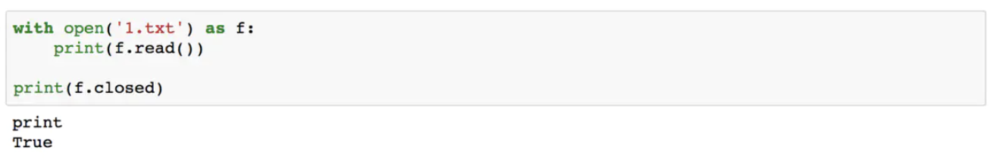
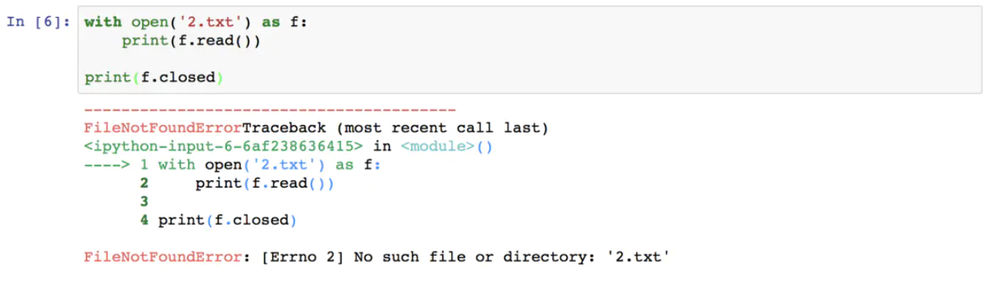
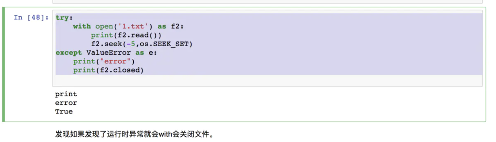
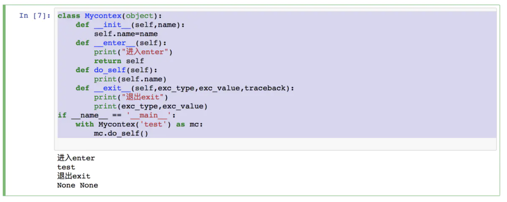
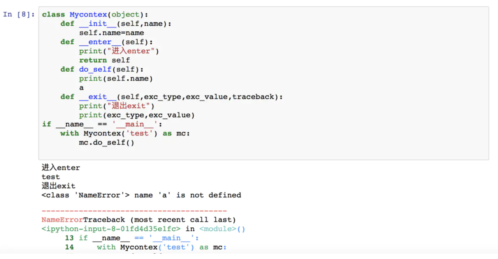

# Python关键字

## with

with表达式其实是try-finally的简写形式。但是又不是全相同。

```
"""
格式
with context [as var]:
    pass
"""

with open('1.txt') as f:
    print(f.read())
    
print(f.closed)
```

表达式open('1.txt')返回是一个_io.TextIOWrapper 类型的变量用f接受到。在with语句块中就可以使用这个变量操作文件。执行with这个结构之后。f会自动关闭。相当于自带了一个finally。



但是with本身并没有异常捕获的功能，但是如果发生了运行时异常，它照样可以关闭文件释放资源。

这个例子可以看出with没有捕获异常的功能。

```
with open('2.txt') as f:
    print(f.read())
    
print(f.closed)
```



这个例子可以看出with发生了异常也会关闭程序。

```
try:
    with open('1.txt') as f2:
        print(f2.read())
        f2.seek(-5,os.SEEK_SET)
except ValueError as e:
    print("error")
    print(f2.closed)
```



原理

with 语句实质是上下文管理。 

1. 上下文管理协议。包含方法__enter__() 和 __exit__()，支持该协议对象要实现这两个方法。 
2. 上下文管理器，定义执行with语句时要建立的运行时上下文，负责执行with语句块上下文中的进入与退出操作。 
3. 进入上下文的时候执行__enter__方法，如果设置as var语句，var变量接受__enter__()方法返回值。
4. 如果运行时发生了异常，就退出上下文管理器。调用管理器__exit__方法。

自定义类必须包含上述几个方法才能正确使用with关键字。

```
class Mycontex(object):
    def __init__(self,name):
        self.name=name
    def __enter__(self):
        print("进入enter")
        return self
    def do_self(self):
        print(self.name)
    def __exit__(self,exc_type,exc_value,traceback):
        print("退出exit")
        print(exc_type,exc_value)
if __name__ == '__main__':
    with Mycontex('test') as mc:
        mc.do_self()
```



下面我们故意加一个NameError



即使程序发生了错误，python解释器终止了我们的程序，但是我们的类 还是顺利关闭了。

应用场景

1、文件操作。2、进程线程之间互斥对象。3、支持上下文其他对象