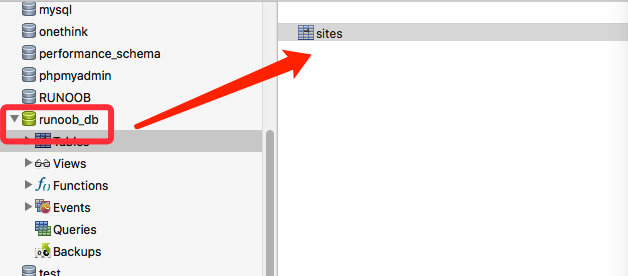
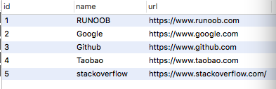

# Python MySQL - mysql-connector 驱动

MySQL 是最流行的关系型数据库管理系统，如果你不熟悉 MySQL，可以阅读我们的 [MySQL 教程。](https://www.runoob.com/mysql/mysql-tutorial.html)

本章节我们为大家介绍使用 **mysql-connector** 来连接使用 MySQL， **mysql-connector** 是 **MySQL** 官方提供的驱动器。

我们可以使用 **pip** 命令来安装 **mysql-connector**：

```python
python -m pip install mysql-connector
```

使用以下代码测试 mysql-connector 是否安装成功：

demo\_mysql\_test.py:

```
import mysql.connector
```

执行以上代码，如果没有产生错误，表明安装成功。

> 注**意：**如果你的 MySQL 是 8.0 版本，密码插件验证方式发生了变化，早期版本为 mysql\_native\_password，8.0 版本为 caching\_sha2\_password，所以需要做些改变：
> 
> 先修改 my.ini 配置：
> 
> ```plain
> [mysqld]
> default_authentication_plugin=mysql_native_password
> ```
> 
> 然后在 mysql 下执行以下命令来修改密码：
> 
> ```plain
> ALTER USER 'root'@'localhost' IDENTIFIED WITH mysql_native_password BY '新密码';
> ```
> 
> 更多内容可以参考：[Python MySQL8.0 链接问题](https://www.runoob.com/note/45833)。

* * *

## 创建数据库连接

可以使用以下代码来连接数据库：

 demo\_mysql\_test.py:

```python
import mysql.connector
 
mydb = mysql.connector.connect(
  host="localhost",       # 数据库主机地址
  user="yourusername",    # 数据库用户名
  passwd="yourpassword"   # 数据库密码
)
 
print(mydb)
```


### 创建数据库

创建数据库使用 "CREATE DATABASE" 语句，以下创建一个名为 runoob\_db 的数据库：

demo\_mysql\_test.py:

```python
import mysql.connector
 
mydb = mysql.connector.connect(
  host="localhost",
  user="root",
  passwd="123456"
)
 
mycursor = mydb.cursor()
 
mycursor.execute("CREATE DATABASE runoob_db")
```


创建数据库前我们也可以使用 "SHOW DATABASES" 语句来查看数据库是否存在：

demo\_mysql\_test.py:

输出所有数据库列表：

```python
import mysql.connector
 
mydb = mysql.connector.connect(
  host="localhost",
  user="root",
  passwd="123456"
)
 
mycursor = mydb.cursor()
 
mycursor.execute("SHOW DATABASES")
 
for x in mycursor:
  print(x)
```


或者我们可以直接连接数据库，如果数据库不存在，会输出错误信息：

demo\_mysql\_test.py:

```python
import mysql.connector
 
mydb = mysql.connector.connect(
  host="localhost",
  user="root",
  passwd="123456",
  database="runoob_db"
)
```


* * *

## 创建数据表

创建数据表使用 **"CREATE TABLE"** 语句，创建数据表前，需要确保数据库已存在，以下创建一个名为 **sites** 的数据表：

demo\_mysql\_test.py:

```python
import mysql.connector
 
mydb = mysql.connector.connect(
  host="localhost",
  user="root",
  passwd="123456",
  database="runoob_db"
)
mycursor = mydb.cursor()
 
mycursor.execute("CREATE TABLE sites (name VARCHAR(255), url VARCHAR(255))")
```


执行成功后，我们可以看到数据库创建的数据表 sites，字段为 name 和 url。



**我们也可以使用 **"SHOW TABLES"** 语句来查看数据表是否已存在：**

demo\_mysql\_test.py:

```python
import mysql.connector
 
mydb = mysql.connector.connect(
  host="localhost",
  user="root",
  passwd="123456",
  database="runoob_db"
)
mycursor = mydb.cursor()
 
mycursor.execute("SHOW TABLES")
 
for x in mycursor:
  print(x)
```


### 主键设置

创建表的时候我们一般都会设置一个主键（PRIMARY KEY），我们可以使用 **"INT AUTO\_INCREMENT PRIMARY KEY"** 语句来创建一个主键，主键起始值为 1，逐步递增。

如果我们的表已经创建，我们需要使用 **ALTER TABLE** 来给表添加主键：

 demo\_mysql\_test.py:

给 sites 表添加主键。

```python
import mysql.connector
 
mydb = mysql.connector.connect(
  host="localhost",
  user="root",
  passwd="123456",
  database="runoob_db"
)
mycursor = mydb.cursor()
 
mycursor.execute("ALTER TABLE sites ADD COLUMN id INT AUTO_INCREMENT PRIMARY KEY")
```


如果你还未创建 sites 表，可以直接使用以下代码创建。

demo\_mysql\_test.py:

给表创建主键。

```python
import mysql.connector
 
mydb = mysql.connector.connect(
  host="localhost",
  user="root",
  passwd="123456",
  database="runoob_db"
)
mycursor = mydb.cursor()
 
mycursor.execute("CREATE TABLE sites (id INT AUTO_INCREMENT PRIMARY KEY, name VARCHAR(255), url VARCHAR(255))")
```


* * *

## 插入数据

插入数据使用 **"INSERT INTO"** 语句：

demo\_mysql\_test.py:

向 sites 表插入一条记录。

```python
import mysql.connector
 
mydb = mysql.connector.connect(
  host="localhost",
  user="root",
  passwd="123456",
  database="runoob_db"
)
mycursor = mydb.cursor()
 
sql = "INSERT INTO sites (name, url) VALUES (%s, %s)"
val = ("RUNOOB", "https://www.runoob.com")
mycursor.execute(sql, val)
 
mydb.commit()    # 数据表内容有更新，必须使用到该语句
 
print(mycursor.rowcount, "记录插入成功。")
```


执行代码，输出结果为：

```plain
1 记录插入成功
```

### 批量插入

批量插入使用 **executemany()** 方法，该方法的第二个参数是一个元组列表，包含了我们要插入的数据：

demo\_mysql\_test.py:

向 sites 表插入多条记录。

```python
import mysql.connector
 
mydb = mysql.connector.connect(
  host="localhost",
  user="root",
  passwd="123456",
  database="runoob_db"
)
mycursor = mydb.cursor()
 
sql = "INSERT INTO sites (name, url) VALUES (%s, %s)"
val = [
  ('Google', 'https://www.google.com'),
  ('Github', 'https://www.github.com'),
  ('Taobao', 'https://www.taobao.com'),
  ('stackoverflow', 'https://www.stackoverflow.com/')
]
 
mycursor.executemany(sql, val)
 
mydb.commit()    # 数据表内容有更新，必须使用到该语句
 
print(mycursor.rowcount, "记录插入成功。")
```


执行代码，输出结果为：

```plain
4 记录插入成功。
```

执行以上代码后，我们可以看看数据表的记录：



如果我们想在数据记录插入后，获取该记录的 ID ，可以使用以下代码：

demo\_mysql\_test.py:

```python
import mysql.connector
 
mydb = mysql.connector.connect(
  host="localhost",
  user="root",
  passwd="123456",
  database="runoob_db"
)
mycursor = mydb.cursor()
 
sql = "INSERT INTO sites (name, url) VALUES (%s, %s)"
val = ("Zhihu", "https://www.zhihu.com")
mycursor.execute(sql, val)
 
mydb.commit()
 
print("1 条记录已插入, ID:", mycursor.lastrowid)
```


执行代码，输出结果为：

```plain
1 条记录已插入, ID: 6
```

* * *

## 查询数据

查询数据使用 **SELECT** 语句：

 demo\_mysql\_test.py:

```python
import mysql.connector
 
mydb = mysql.connector.connect(
  host="localhost",
  user="root",
  passwd="123456",
  database="runoob_db"
)
mycursor = mydb.cursor()
 
mycursor.execute("SELECT * FROM sites")
 
myresult = mycursor.fetchall()     # fetchall() 获取所有记录
 
for x in myresult:
  print(x)
```


执行代码，输出结果为：

```plain
(1, 'RUNOOB', 'https://www.runoob.com')
(2, 'Google', 'https://www.google.com')
(3, 'Github', 'https://www.github.com')
(4, 'Taobao', 'https://www.taobao.com')
(5, 'stackoverflow', 'https://www.stackoverflow.com/')
(6, 'Zhihu', 'https://www.zhihu.com')
```

也可以读取指定的字段数据：

demo\_mysql\_test.py:

```python
import mysql.connector
 
mydb = mysql.connector.connect(
  host="localhost",
  user="root",
  passwd="123456",
  database="runoob_db"
)
mycursor = mydb.cursor()
 
mycursor.execute("SELECT name, url FROM sites")
 
myresult = mycursor.fetchall()
 
for x in myresult:
  print(x)
```


执行代码，输出结果为：

```plain
('RUNOOB', 'https://www.runoob.com')
('Google', 'https://www.google.com')
('Github', 'https://www.github.com')
('Taobao', 'https://www.taobao.com')
('stackoverflow', 'https://www.stackoverflow.com/')
('Zhihu', 'https://www.zhihu.com')
```

如果我们只想读取一条数据，可以使用 **fetchone()** 方法：

demo\_mysql\_test.py:

```python
import mysql.connector
 
mydb = mysql.connector.connect(
  host="localhost",
  user="root",
  passwd="123456",
  database="runoob_db"
)
mycursor = mydb.cursor()
 
mycursor.execute("SELECT * FROM sites")
 
myresult = mycursor.fetchone()
 
print(myresult)
```


执行代码，输出结果为：

```plain
(1, 'RUNOOB', 'https://www.runoob.com')
```

### where 条件语句

如果我们要读取指定条件的数据，可以使用 **where** 语句：

demo\_mysql\_test.py

读取 name 字段为 RUNOOB 的记录：

```python
import mysql.connector
 
mydb = mysql.connector.connect(
  host="localhost",
  user="root",
  passwd="123456",
  database="runoob_db"
)
mycursor = mydb.cursor()
 
sql = "SELECT * FROM sites WHERE name ='RUNOOB'"
 
mycursor.execute(sql)
 
myresult = mycursor.fetchall()
 
for x in myresult:
  print(x)
```


执行代码，输出结果为：

```plain
(1, 'RUNOOB', 'https://www.runoob.com')
```

也可以使用通配符 %：

 demo\_mysql\_test.py

```python
import mysql.connector
 
mydb = mysql.connector.connect(
  host="localhost",
  user="root",
  passwd="123456",
  database="runoob_db"
)
mycursor = mydb.cursor()
 
sql = "SELECT * FROM sites WHERE url LIKE '%oo%'"
 
mycursor.execute(sql)
 
myresult = mycursor.fetchall()
 
for x in myresult:
  print(x)
```


执行代码，输出结果为：

```plain
(1, 'RUNOOB', 'https://www.runoob.com')
(2, 'Google', 'https://www.google.com')
```

为了防止数据库查询发生 SQL 注入的攻击，我们可以使用 %s 占位符来转义查询的条件：

demo\_mysql\_test.py

```python
import mysql.connector
 
mydb = mysql.connector.connect(
  host="localhost",
  user="root",
  passwd="123456",
  database="runoob_db"
)
mycursor = mydb.cursor()
 
sql = "SELECT * FROM sites WHERE name = %s"
na = ("RUNOOB", )
 
mycursor.execute(sql, na)
 
myresult = mycursor.fetchall()
 
for x in myresult:
  print(x)
```


### 排序

查询结果排序可以使用 **ORDER BY** 语句，默认的排序方式为升序，关键字为 **ASC**，如果要设置降序排序，可以设置关键字 **DESC**。

demo\_mysql\_test.py

按 name 字段字母的升序排序：

```python
import mysql.connector
 
mydb = mysql.connector.connect(
  host="localhost",
  user="root",
  passwd="123456",
  database="runoob_db"
)
mycursor = mydb.cursor()
 
sql = "SELECT * FROM sites ORDER BY name"
 
mycursor.execute(sql)
 
myresult = mycursor.fetchall()
 
for x in myresult:
  print(x)
```


执行代码，输出结果为：

```plain
(3, 'Github', 'https://www.github.com')
(2, 'Google', 'https://www.google.com')
(1, 'RUNOOB', 'https://www.runoob.com')
(5, 'stackoverflow', 'https://www.stackoverflow.com/')
(4, 'Taobao', 'https://www.taobao.com')
(6, 'Zhihu', 'https://www.zhihu.com')
```

降序排序实例：

demo\_mysql\_test.py

按 name 字段字母的降序排序：

```python
import mysql.connector
 
mydb = mysql.connector.connect(
  host="localhost",
  user="root",
  passwd="123456",
  database="runoob_db"
)
mycursor = mydb.cursor()
 
sql = "SELECT * FROM sites ORDER BY name DESC"
 
mycursor.execute(sql)
 
myresult = mycursor.fetchall()
 
for x in myresult:
  print(x)
```


执行代码，输出结果为：

```plain
(6, 'Zhihu', 'https://www.zhihu.com')
(4, 'Taobao', 'https://www.taobao.com')
(5, 'stackoverflow', 'https://www.stackoverflow.com/')
(1, 'RUNOOB', 'https://www.runoob.com')
(2, 'Google', 'https://www.google.com')
(3, 'Github', 'https://www.github.com')
```

### Limit

如果我们要设置查询的数据量，可以通过 **"LIMIT"** 语句来指定

demo\_mysql\_test.py

读取前 3 条记录：

```python
import mysql.connector
 
mydb = mysql.connector.connect(
  host="localhost",
  user="root",
  passwd="123456",
  database="runoob_db"
)
mycursor = mydb.cursor()
 
mycursor.execute("SELECT * FROM sites LIMIT 3")
 
myresult = mycursor.fetchall()
 
for x in myresult:
  print(x)
```


执行代码，输出结果为：

```plain
(1, 'RUNOOB', 'https://www.runoob.com')
(2, 'Google', 'https://www.google.com')
(3, 'Github', 'https://www.github.com')
```

也可以指定起始位置，使用的关键字是 **OFFSET**：

demo\_mysql\_test.py

从第二条开始读取前 3 条记录：

```python
import mysql.connector
 
mydb = mysql.connector.connect(
  host="localhost",
  user="root",
  passwd="123456",
  database="runoob_db"
)
mycursor = mydb.cursor()
 
mycursor.execute("SELECT * FROM sites LIMIT 3 OFFSET 1")  # 0 为 第一条，1 为第二条，以此类推
 
myresult = mycursor.fetchall()
 
for x in myresult:
  print(x)
```


执行代码，输出结果为：

```plain
(2, 'Google', 'https://www.google.com')
(3, 'Github', 'https://www.github.com')
(4, 'Taobao', 'https://www.taobao.com')
```

* * *

## 删除记录

删除记录使用 **"DELETE FROM"** 语句：

demo\_mysql\_test.py

删除 name 为 stackoverflow 的记录：

```python
import mysql.connector
 
mydb = mysql.connector.connect(
  host="localhost",
  user="root",
  passwd="123456",
  database="runoob_db"
)
mycursor = mydb.cursor()
 
sql = "DELETE FROM sites WHERE name = 'stackoverflow'"
 
mycursor.execute(sql)
 
mydb.commit()
 
print(mycursor.rowcount, " 条记录删除")
```


执行代码，输出结果为：

```plain
1  条记录删除
```

**注意：**要慎重使用删除语句，删除语句要确保指定了 WHERE 条件语句，否则会导致整表数据被删除。

为了防止数据库查询发生 SQL 注入的攻击，我们可以使用 %s 占位符来转义删除语句的条件：

demo\_mysql\_test.py

```python
import mysql.connector
 
mydb = mysql.connector.connect(
  host="localhost",
  user="root",
  passwd="123456",
  database="runoob_db"
)
mycursor = mydb.cursor()
 
sql = "DELETE FROM sites WHERE name = %s"
na = ("stackoverflow", )
 
mycursor.execute(sql, na)
 
mydb.commit()
 
print(mycursor.rowcount, " 条记录删除")
```


执行代码，输出结果为：

```plain
1  条记录删除
```

* * *

## 更新表数据

数据表更新使用 **"UPDATE"** 语句：

demo\_mysql\_test.py

将 name 为 Zhihu 的字段数据改为 ZH：

```python
import mysql.connector
 
mydb = mysql.connector.connect(
  host="localhost",
  user="root",
  passwd="123456",
  database="runoob_db"
)
mycursor = mydb.cursor()
 
sql = "UPDATE sites SET name = 'ZH' WHERE name = 'Zhihu'"
 
mycursor.execute(sql)
 
mydb.commit()
 
print(mycursor.rowcount, " 条记录被修改")
```


执行代码，输出结果为：

```plain
1  条记录被修改
```

**注意：**UPDATE 语句要确保指定了 WHERE 条件语句，否则会导致整表数据被更新。

为了防止数据库查询发生 SQL 注入的攻击，我们可以使用 %s 占位符来转义更新语句的条件：

demo\_mysql\_test.py

```python
import mysql.connector
 
mydb = mysql.connector.connect(
  host="localhost",
  user="root",
  passwd="123456",
  database="runoob_db"
)
mycursor = mydb.cursor()
 
sql = "UPDATE sites SET name = %s WHERE name = %s"
val = ("Zhihu", "ZH")
 
mycursor.execute(sql, val)
 
mydb.commit()
 
print(mycursor.rowcount, " 条记录被修改")
```


执行代码，输出结果为：

```plain
1  条记录被修改
```

* * *

## 删除表

删除表使用 **"DROP TABLE"** 语句， IF EXISTS 关键字是用于判断表是否存在，只有在存在的情况才删除：

 demo\_mysql\_test.py

```python
import mysql.connector
 
mydb = mysql.connector.connect(
  host="localhost",
  user="root",
  passwd="123456",
  database="runoob_db"
)
mycursor = mydb.cursor()
 
sql = "DROP TABLE IF EXISTS sites"  # 删除数据表 sites
 
mycursor.execute(sql)
```

