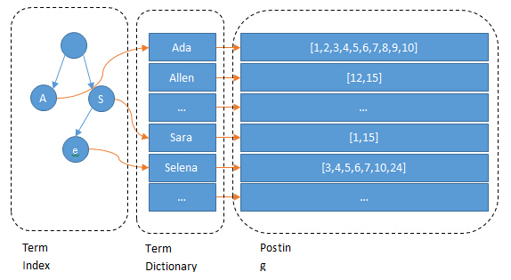
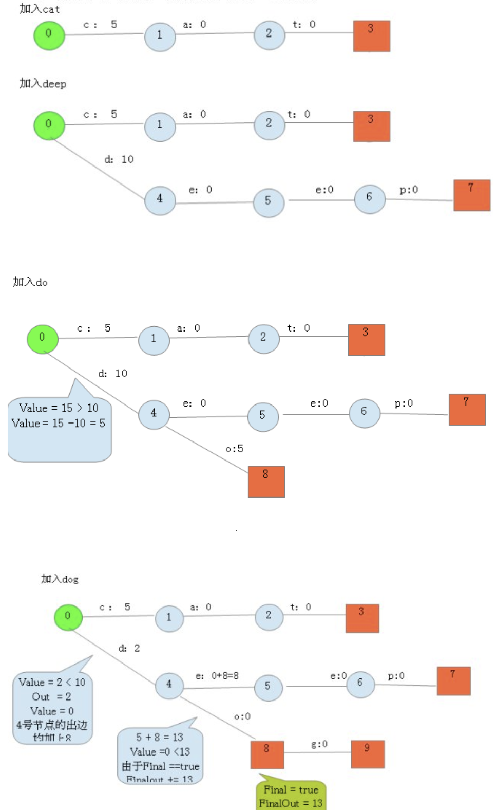
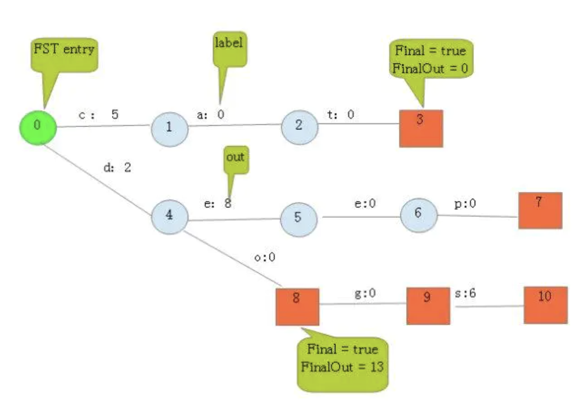
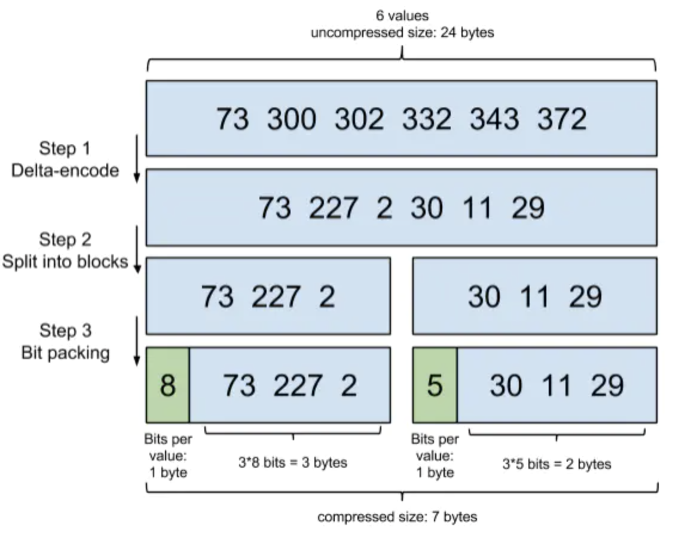
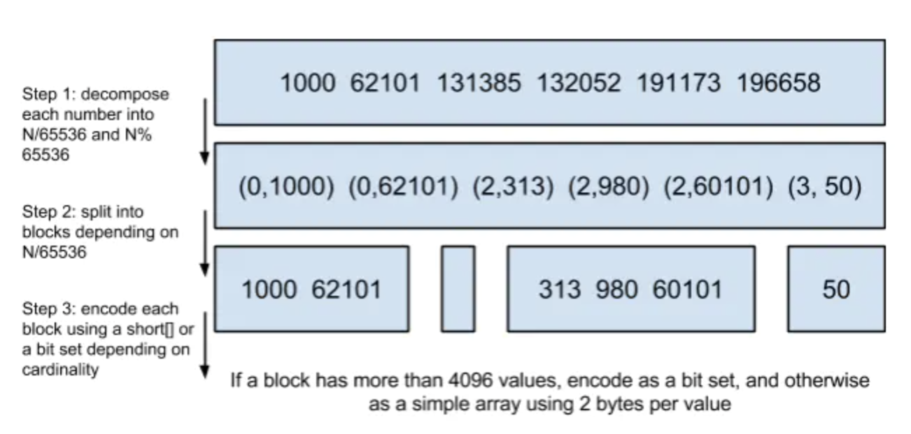

# es 算法 

知识点：

1.  posting list: 倒排索引
    -   Frame Of Reference: 增量编码压缩
    -   Roaring bitmaps:
2.  term dictionary: term的二分字典
3.  term index: term前缀字典，映射term dictionary块
    -   FST: 有穷状态转换器

## 什么是倒排索引?


继续上面的例子，假设有这么几条数据(为了简单，去掉about, interests这两个field):

| ID  | Name | Age | Sex    |
|-----|------|-----|--------|
| 1   | Kate | 24  | Female |
| 2   | John | 24  | Male   |
| 3   | Bill | 29  | Male   |

ID是Elasticsearch自建的文档id，那么Elasticsearch建立的索引如下:

**Name:**

| Term | Posting List |
|------|--------------|
| Kate | 1            |
| John | 2            |
| Bill | 3            |

**Age:**

| Term | Posting List |
|------|--------------|
| 24   | \[1,2\]      |
| 29   | 3            |

**Sex:**

| Term   | Posting List |
|--------|--------------|
| Female | 1            |
| Male   | \[2,3\]      |

### Posting List

Elasticsearch分别为每个field都建立了一个倒排索引，Kate, John, 24, Female这些叫term，而\[1,2\]就是*Posting List*。Posting list就是一个int的数组，存储了所有符合某个term的文档id。

看到这里，不要认为就结束了，精彩的部分才刚开始…

通过posting list这种索引方式似乎可以很快进行查找，比如要找age=24的同学，爱回答问题的小明马上就举手回答：我知道，id是1，2的同学。但是，如果这里有上千万的记录呢？如果是想通过name来查找呢？

### Term Dictionary

Elasticsearch为了能快速找到某个term，将所有的term排个序，二分法查找term，logN的查找效率，就像通过字典查找一样，这就是*Term Dictionary*。现在再看起来，似乎和传统数据库通过B-Tree的方式类似啊，为什么说比B-Tree的查询快呢？

### Term Index

B-Tree通过减少磁盘寻道次数来提高查询性能，Elasticsearch也是采用同样的思路，直接通过内存查找term，不读磁盘，但是如果term太多，term dictionary也会很大，放内存不现实，于是有了*Term Index*，就像字典里的索引页一样，A开头的有哪些term，分别在哪页，可以理解term index是一颗树：



所以term index不需要存下所有的term，而仅仅是他们的一些前缀与Term Dictionary的block之间的映射关系，再结合FST(Finite State Transducers)的压缩技术，可以使term index缓存到内存中。从term index查到对应的term dictionary的block位置之后，再去磁盘上找term，大大减少了磁盘随机读的次数。

## term index的压缩

Lucene使用FST算法以字节的方式来存储所有的Term，重复利用Term Index的前缀和后缀，使Term Index小到可以放进内存，减少存储空间，不过相对的也会占用更多的cpu资源。FST在Lucene4.0以后的版本中用于快速定位所查单词在字典中的位置。

Finite StateTransducers，简称 FST，通常中文译作*有穷状态转换器*，在语音识别和自然语言搜索、处理等方向被广泛应用。

FST的功能类似于字典，可以表示成FST\<Key, Value\>的形式。其最大的特点是，可以用=O(length(key))=的复杂度来找到key对应的value，也就是说查找复杂度仅取决于所查找的key长度。

假设我们现在要将以下term index映射到term dictionary的block序号：

```
"cat" ------ > 5
"deep" ------ > 10
"do" ------ > 15
"dog" ------ > 2
"dogs" ------ > 8
```

最简单的做法就是定义个Map<string, integer=““>，大家找到自己的位置对应入座就好了，但从内存占用少的角度想想，有没有更优的办法呢？答案就是FST。

对于经典FST算法来说，要求*Key必须按字典序从小到大加入到FST中。上面的例子中key已经排好序了。

按照以下步骤建立FST：

1.建一个空节点，表示FST的入口，所有的Key都从这个入口开始。
2.如果还有未处理的Key，则枚举Key的每一个label。处理流程如下：
2.1如果当前节点存在含此label的边，则
2.1.1如果Value包含该边的out值，则 Value = Value -- out
2.1.2否则 令temp=out--Value； out =Value，并使下一个节点的所有边out都加上temp。 如果下一节点是Final节点 则FinalOut += temp
2.1.3进入下一个节点
2.2否则： 新建一个节点另其out = Value， Value = 0。



最后加入=dogs=，得到最后的结果：



从上图可以看出，每条边有两条属性，一个表示label（key的元素），另一个表示Value(out)。

注意Value不一定是数字，还可一是另一个字符串，但要求Value必须满足叠加性，如这里的正整数2 + 8 = 10。字符串的叠加行为： aa + b = aab。

建完这个图之后，我们就可以很容易的查找出任意一个key的Value了。例如：查找dog，我们查找的路径为：0 → 4 → 8 → 9。 其权值和为： 2 + 0 + 0 + 0 = 2。其中最后一个零表示
node\[9\].finalOut = 0。所以“dog”的Value为2。

## Frame Of Reference

Lucene除了上面说到用FST压缩term index外，对posting list也会进行压缩。

有人可能会有疑问："posting list不是已经只存储文档id了吗？还需要压缩吗？"。设想这样一种情况，Lucene需要对一千万个同学的性别进行索引，而世界上只有男/女这样两个性别，每个posting
list都会有数百万个文档id，这里显然有很大的压缩空间与价值，对于减少索引尺寸有非常重要的意义。

Lucene使用*Frame Of Reference*编码来实现对posting list压缩，其思路简单来说就是：*增量编码压缩，将大数变小数，按字节存储*。

示意图如下：



-   step1：在对posting list进行压缩时进行了正序排序。
-   step2：通过增量将73后面的大数变成小数存储增量值。
-   step3: 转换成二进制，取占最大位的数，227占8位，前三个占八位，30占五位，后三个数每个占五位。

## Roaring bitmaps

除此之外，Lucene在执行filter操作还会使用一种叫做*Roaring bitmaps*的数据结构来存储文档ID，同样可以达到压缩存储空间的目的。

说到Roaring bitmaps，就必须先从bitmap说起。bitmap是一种很直观的数据结构，假设有某个posting list：
```
[1,3,4,7,10]
```
对应的bitmap就是：
```
[1,0,1,1,0,0,1,0,0,1]
```
非常直观，用0/1表示某个值是否存在，比如10这个值就对应第10位，对应的bit值是1，这样用一个字节就可以代表8个文档id，旧版本(5.0之前)的Lucene就是用这样的方式来压缩的，但这样的压缩方式仍然不够高效，如果有1亿个文档，那么需要12.5MB的存储空间，这仅仅是对应一个索引字段(我们往往会有很多个索引字段)。于是有人想出了Roaring bitmaps这样更高效的数据结构。Roaring bitmaps压缩的原理可以理解为，与其保存100个0，占用100个bit，还不如保存0一次，然后声明这个0有100个。

Bitmap的缺点是存储空间随着文档个数线性增长，Roaring bitmaps需要打破这个魔咒就一定要用到某些指数特性：

将posting list按照65535为界限分块，比如第一块所包含的文档id范围在0-65535之间，第二块的id范围65536-131071，以此类推。再用\<商，余数\>的组合表示每一组id，这样每组里的id范围都在0\~65535内了，剩下的就好办了，既然每组id不会变得无限大，那么我们就可以通过最有效的方式对这里的id存储。



-   step1：从小到大进行排序。
-   step2：将大数除以65536，用除得的结果和余数来表示这个大数。
-   step3:：以65535为界进行分块。

为什么是以65535为界限呢？

程序员的世界里除了1024外，65535也是一个经典值，因为它=2^16^-1，正好是用2个字节能表示的最大数，一个short的存储单位，注意到上图里的最后一行“If a block has more than 4096 values, encode as a bit set, and otherwise as a simple array using 2 bytes per value”，如果是大块，节省点用bitset存，小块就豪爽点，2个字节我也不计较了，用一个short\[\]存着方便。

那为什么用4096来区分大块还是小块呢？

都说程序员的世界是二进制的，4096*2bytes ＝ 8192bytes < 1KB, 磁盘一次寻道可以顺序把一个小块的内容都读出来，再大一位就超过1KB了，需要两次读。
