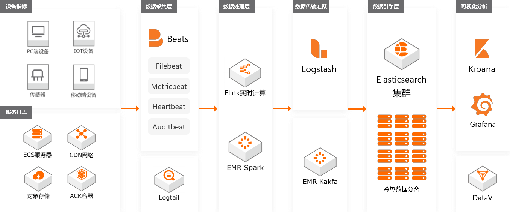
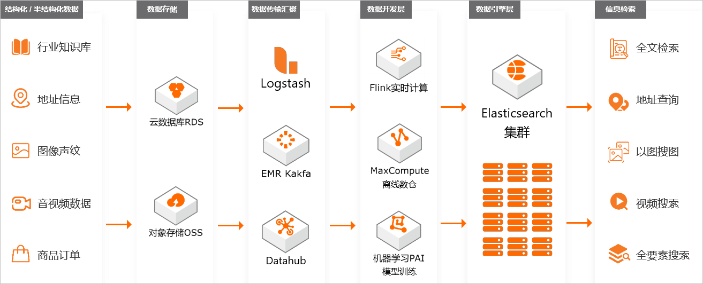
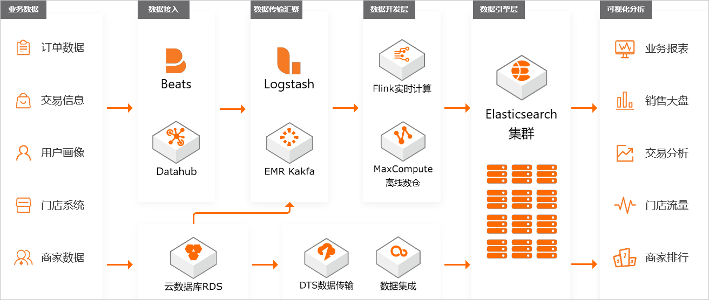

# 规格容量评估

在使用Elasticsearch前，请先评估集群所需的资源容量，包括磁盘容量、集群规格、shard大小和数量等。本文根据实际测试结果和用户使用经验，提供了相对通用的评估方法。您可以参考本文的内容，初步规划集群的规格容量。

## 磁盘容量评估

影响Elasticsearch集群磁盘空间大小的因素包括：

-   副本数量：至少1个副本。
-   索引开销：通常比源数据大10%（=~all~=参数等未计算）。
-   操作系统预留：默认操作系统会保留5%的文件系统供您处理关键流程、系统恢复以及磁盘碎片等。
-   Elasticsearch内部开销：段合并、日志等内部操作，预留20%。
-   安全阈值：通常至少预留15%的安全阈值。

根据以上因素得到：最小磁盘总大小 = 源数据大小 * 3.4。计算方式如下。

磁盘总大小 = 源数据 * （1 + 副本数量）* 索引开销 /（1 - Linux预留空间）/（1 - Elasticsearch开销）/（1 - 安全阈值） = 源数据 * （1 + 副本数量）* 1.7 = 源数据 * 3.4

## 集群规格评估

Elasticsearch的单机规格在一定程度上限制了集群的能力，本文根据测试结果和使用经验给出如下建议：

-   集群最大节点数：集群最大节点数 = 单节点CPU * 5。
-   单节点最大数据量。
    使用场景不同，单节点最大承载数据量也会不同，具体如下：
    -   数据加速、查询聚合等场景：单节点磁盘最大容量 = 单节点内存大小（GB）* 10。
    -   日志写入、离线分析等场景：单节点磁盘最大容量 = 单节点内存大小（GB）* 50。
    -   通常情况：单节点磁盘最大容量 = 单节点内存大小（GB）* 30。

本文以下面的集群规格为例，按照以上计算方式，得到的单节点最大数据量如下表所示。

| 规格      | 最大节点数 | 单节点磁盘最大容量（查询） | 单节点磁盘最大容量（日志） | 单节点磁盘最大容量（通常） |
|-----------|------------|----------------------------|----------------------------|----------------------------|
| 2核4 GB   | 10         | 40 GB                      | 200 GB                     | 120 GB                     |
| 2核8 GB   | 10         | 80 GB                      | 400 GB                     | 240 GB                     |
| 4核16 GB  | 20         | 160 GB                     | 800 GB                     | 480 GB                     |
| 8核32 GB  | 40         | 320 GB                     | 1.5 TB                     | 960 GB                     |
| 16核64 GB | 80         | 640 GB                     | 2 TB                       | 1.9 TB                     |

## Shard评估

Shard大小和数量是影响Elasticsearch集群稳定性和性能的重要因素之一。Elasticsearch集群中任何一个索引都需要有一个合理的shard规划。合理的shard规划能够防止因业务不明确，导致分片庞大消耗Elasticsearch本身性能的问题。

**说明** Elasticsearch 7.x以下版本的索引默认包含5个主shard，1个副shard；Elasticsearch 7.x及以上版本的索引默认包含1个主shard，1个副shard。

在进行shard规划前，请先考虑以下几个问题：

-   当前单个索引的数据多大
-   数据是否会持续增长
-   购买的实例规格多大
-   是否会定期删除或者合并临时索引

基于以上问题，下文对shard规划提供了一些建议。这些建议仅供参考，实际业务中还需根据需求进行调整：

-   建议在分配shard前，对Elasticsearch进行数据测试。当数据量很大时，要减少写入量的大小，降低Elasticsearch压力，建议选择多主1副本；当数据量较小，且写入量也比较小时，建议使用单主多副本或者单主1副本。
-   建议一个shard的存储量保持在30 GB以内（最优），特殊情况下，可以提升到50GB以内。如果评估结果超过该容量，建议在创建索引之前，合理进行shard分配，后期进行reindex，虽然能保证不停机，但是比较耗时。

**说明** 对于评估数据量低于30 GB的业务，也可以使用1主多备的策略进行负载均衡。例如20 GB的单索引，在5个数据节点中，可以考虑1主4副本的shard规划。

-   对于日志分析或者超大索引场景，建议单个shard大小不要超过100 GB。
-   建议shard的个数（包括副本）要尽可能等于数据节点数，或者是数据节点数的整数倍。

**说明**
主分片不是越多越好，因为主分片越多，Elasticsearch性能开销也会越大。

-   建议单个节点上同一索引的shard个数不要超5个。
-   建议按照以下说明，评估单个节点上全部索引的shard数量：
    -   单个数据节点的shard数量 = 当前节点的内存大小 * 30（小规格实例参考）
    -   单个数据节点的shard数量 = 当前节点的内存大小 * 50（大规格实例参考）

建议按照1:5的比例添加独立的协调节点（2个起），CPU:Memory为1:4或1:8。例如10个8核32GB的数据节点，建议配置2个8核32 GB的独立协调节点。

# 系统默认插件

IK分词插件（英文名为analysis-ik）是阿里云Elasticsearch的扩展插件，默认不能卸载。该插件在开源插件的基础上，扩展支持了对象存储服务OSS（Object Storage Service）词典文件的动态加载，可以实现IK词典的冷更新和热更新。

aliyun-sql插件是基于Apache Calcite开发的部署在服务端的SQL解析插件，使用此插件您可以像使用普通数据库一样使用SQL语句查询Elasticsearch中的数据，从而极大地降低您学习和使用Elasticsearch的成本。

apack插件是阿里云Elasticsearch团队自研的插件，支持物理复制和向量检索功能，本文仅介绍物理复制功能。物理复制功能适用于索引有副本、写入数据量大、对数据写入后可见性延迟要求不高的场景，例如日志场景、时序分析场景等，可以大幅度降低CPU开销，提升写入性能。

AliNLP分词插件是阿里云Elasticsearch自带的一个系统默认插件。通过该插件，您可以在阿里云Elasticsearch中集成对应的分析器和分词器，完成文档分析和检索。您也可以使用AliNLP分词插件的词库配置功能，通过词典文件的热更新自定义词库配置（替换默认词典）。本文介绍如何使用AliNLP分词插件。

向量检索插件是阿里云Elasticsearch团队自主开发的向量检索引擎插件，基于阿里巴巴达摩院proxima向量检索库实现，能够帮助您快速实现图像搜索、视频指纹采样、人脸识别、语音识别和商品推荐等向量检索场景的需求。本文介绍如何使用向量检索插件。

向量检索插件是阿里云Elasticsearch团队自主开发的向量检索引擎插件，基于阿里巴巴达摩院proxima向量检索库实现，能够帮助您快速实现图像搜索、视频指纹采样、人脸识别、语音识别和商品推荐等向量检索场景的需求。本文介绍如何使用向量检索插件。

codec-compression是阿里云Elasticsearch（简称ES）团队自主开发的索引压缩插件，支持brotli和zstd压缩算法，具有更高的索引压缩比，可以大幅降低索引的存储成本。

faster-bulk插件是阿里云Elasticsearch团队自研的插件，目的是为了提高写入吞吐和降低写入拒绝。该插件能够实现将bulk写入请求按照指定bulk请求大小和时间间隔进行批量聚合，防止过小的bulk请求阻塞写入队列，有效提升写入吞吐。本文介绍faster-bulk插件的适用场景和使用方法。

# 应用场景

阿里云Elasticsearch具有广泛的应用场景，包括日志分析与运维全观测、信息检索、数据智能等。

## 日志分析与全观测

在复杂业务场景下，海量服务器、物理机、Docker容器、移动设备和IoT传感器等设备中，往往存在着结构分散、种类多样、规模庞大的各类指标、日志和APM数据，对全链路的异常问题定位、业务分析与运维带来了巨大的挑战。用户往往很难从繁杂的日志中获取价值，却要承担其高昂的存储成本。

阿里云Elasticsearch能够通过Beats、Logstash等组件，快速对接各种常见数据源，提供弹性可扩展的集中采集和开箱即用的存储分析能力。并借助Kibana仪表盘，高效地构建数据可视化运维看板，并在看板中灵活地配置主机名称、IP地址、部署情况、显示颜色等信息。最终帮助您在海量数据中快速定位和发现问题，提高解决问题的效率，从而让日志数据产生价值。

## 信息检索

每一个生活在移动互联网中的用户，每天都在查询各种各样的信息。例如查询信用卡账单、电子发票、附近的餐厅酒店、媒体咨询、购物订单、交通物流等。为了帮助用户高效获取信息，广大企业需要实现面向海量数据的信息检索服务。

相对于传统关系型数据库，Elasticsearch拥有强大的全文检索能力，并提供了简单易用的RESTful API和各种语言客户端。只需要几毫秒的时间，即可在PB级结构化和非结构化的数据中找到匹配信息。您可以使用阿里云Elasticsearch的高可用性和易用性，实现复杂组合、条件和模糊查询，轻松应对各类文本、数字、日期、IP地理数据，乃至图像、音视频数据的高性能读写。从而快速搭建电商商品或订单检索、App搜索、企业CRM（Customer Relationship Management）系统等检索服务，并整合到已有业务框架中。

## 数据智能

随着游戏、教育、零售等各个行业的快速发展，除了底层系统的日志指标数据外，往往还存在着规模庞大的业务数据，例如用户行为、行车轨迹、交易记录等。在数据驱动运营的行业背景下，深入统计分析和挖掘业务数据，为上层业务发现问题与机会并辅助商业决策，才能真正让数据产生价值。

阿里云Elasticsearch拥有结构化查询能力，并支持复杂过滤和聚合统计功能。不仅可以快速、高效地分析用户行为、属性、标签等各类数据，实现目标人群的精准触达；还能借助Kibana，完成业务数据的统计分类以及大盘的搭建，从而在电子商务、移动应用、广告媒体等多个场景下，高效统计并分析海量数据，深入挖掘业务的数据价值。

