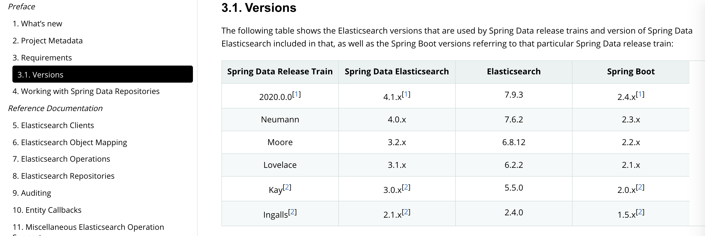

# es springboot 

## springboot-starter

默认starter有ES装配的实现，只需要引入ES的client实现就可以了。

``` xml
<dependency>
            <groupId>org.springframework.boot</groupId>
            <artifactId>spring-boot-starter</artifactId>
</dependency>
```

``` 
org.springframework.boot.autoconfigure.data.elasticsearch.ElasticsearchAutoConfiguration,\
org.springframework.boot.autoconfigure.data.elasticsearch.ElasticsearchDataAutoConfiguration,\
org.springframework.boot.autoconfigure.data.elasticsearch.ElasticsearchRepositoriesAutoConfiguration,\
org.springframework.boot.autoconfigure.data.elasticsearch.ReactiveElasticsearchRepositoriesAutoConfiguration,
```

es的starter实现是spring-data的实现。

```xml
<dependency>
    <groupId>org.springframework.boot</groupId>
    <artifactId>spring-boot-starter-data-elasticsearch</artifactId>
</dependency>
```
## 版本对应关系

看最新版本的doc

<https://spring.io/projects/spring-data-elasticsearch#learn>



## CRUD方法

数据操作文法分为分页和非分页，实现是通过继承两个接口。

``` java
@NoRepositoryBean
public interface CrudRepository<T, ID> extends Repository<T, ID> {
    <S extends T> S save(S var1);

    <S extends T> Iterable<S> saveAll(Iterable<S> var1);

    Optional<T> findById(ID var1);

    boolean existsById(ID var1);

    Iterable<T> findAll();

    Iterable<T> findAllById(Iterable<ID> var1);

    long count();

    void deleteById(ID var1);

    void delete(T var1);

    void deleteAll(Iterable<? extends T> var1);

    void deleteAll();
}

@NoRepositoryBean
public interface PagingAndSortingRepository<T, ID> extends CrudRepository<T, ID> {
    Iterable<T> findAll(Sort var1);

    Page<T> findAll(Pageable var1);
}
```

## 一个实现示例

必须指定一个文档类和主键

``` java
public interface TestDao extends CrudRepository<TestBean, Long> {
    List<TestBean> findByName(String name);

    List<TestBean> findByNameOrDesc(String name,String text);
}

@Data
@Document(indexName = "testdoct")
public class TestBean implements Serializable {
    public TestBean() {
    }

    public TestBean(long id, String name, Integer age, String sex, String desc) {
        this.id = id;
        this.name = name;
        this.age = age;
        this.sex = sex;
        this.desc = desc;
    }

    // 必须指定一个id，
    @Id
    private long id;
    private String name;
    private Integer age;
    private String sex;
    private String desc;
}
```

## 非默认方法的实现

按命名标准编写接口名，spring-data可以自动转换成对应的查询实现。


| Keyword               | Sample                                   | Elasticsearch Query String                                                                                           |
|-----------------------|------------------------------------------|--------------------------|
| And                   | findByNameAndPrice                       | {"bool" : {"must" : [ {"field" : {"name" : "?"}}, {"field" : {"price" : "?"}} ]}}                                    |
| Or                    | findByNameOrPrice                        | {"bool" : {"should" : [ {"field" : {"name" : "?"}}, {"field" : {"price" : "?"}} ]}}                                  |
| Is                    | findByName                               | {"bool" : {"must" : {"field" : {"name" : "?"}}}}                                                                     |
| Not                   | findByNameNot                            | {"bool" : {"must_not" : {"field" : {"name" : "?"}}}}                                                                 |
| Between               | findByPriceBetween                       | {"bool" : {"must" : {"range" : {"price" : {"from" : ?,"to" : ?,"include_lower" : true,"include_upper" : true}}}}}    |
| LessThanEqual         | findByPriceLessThan                      | {"bool" : {"must" : {"range" : {"price" : {"from" : null,"to" : ?,"include_lower" : true,"include_upper" : true}}}}} |
| GreaterThanEqual      | findByPriceGreaterThan                   | {"bool" : {"must" : {"range" : {"price" : {"from" : ?,"to" : null,"include_lower" : true,"include_upper" : true}}}}} |
| Before                | findByPriceBefore                        | {"bool" : {"must" : {"range" : {"price" : {"from" : null,"to" : ?,"include_lower" : true,"include_upper" : true}}}}} |
| After                 | findByPriceAfter                         | {"bool" : {"must" : {"range" : {"price" : {"from" : ?,"to" : null,"include_lower" : true,"include_upper" : true}}}}} |
| Like                  | findByNameLike                           | {"bool" : {"must" : {"field" : {"name" : {"query" : "?*","analyze_wildcard" : true}}}}}                              |
| StartingWith          | findByNameStartingWith                   | {"bool" : {"must" : {"field" : {"name" : {"query" : "?*","analyze_wildcard" : true}}}}}                              |
| EndingWith            | findByNameEndingWith                     | {"bool" : {"must" : {"field" : {"name" : {"query" : "*?","analyze_wildcard" : true}}}}}                              |
| Contains/Containing   | findByNameContaining                     | {"bool" : {"must" : {"field" : {"name" : {"query" : "**?**","analyze_wildcard" : true}}}}}                           |
| In                    | findByNameIn(Collection<String>names)    | {"bool" : {"must" : {"bool" : {"should" : [ {"field" : {"name" : "?"}}, {"field" : {"name" : "?"}} ]}}}}             |
| NotIn                 | findByNameNotIn(Collection<String>names) | {"bool" : {"must_not" : {"bool" : {"should" : {"field" : {"name" : "?"}}}}}}                                         |
| Near                  | findByStoreNear                          | Not Supported Yet !                                                                                                  |
| True                  | findByAvailableTrue                      | {"bool" : {"must" : {"field" : {"available" : true}}}}                                                               |
| False                 | findByAvailableFalse                     | {"bool" : {"must" : {"field" : {"available" : false}}}}                                                              |
| OrderBy               | findByAvailableTrueOrderByNameDesc       | {"sort" : [{ "name" : {"order" : "desc"} }],"bool" : {"must" : {"field" : {"available" : true}}}}                    |
